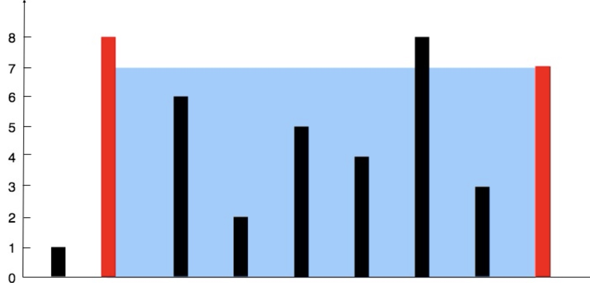

# Leetcode 1-99

[TOC]


## 1.两数之和

> 给定一个整数数组 `nums` 和一个整数目标值 `target`，请你在该数组中找出 **和为目标值** *`target`* 的那 **两个** 整数，并返回它们的数组下标。
>
> 你可以假设每种输入只会对应一个答案。但是，数组中同一个元素在答案里不能重复出现。
>
> 你可以按任意顺序返回答案。

遍历num，维护一个哈希表，在哈希表中检索target-num，没有就将num加入表中。

O(n)


## 2.两数相加

> 给你两个 **非空** 的链表，表示两个非负的整数。它们每位数字都是按照 **逆序** 的方式存储的，并且每个节点只能存储 **一位** 数字。
>
> 请你将两个数相加，并以相同形式返回一个表示和的链表。

注意进位即可。

时间复杂度 O(m+n) 。

```c++
/**
 * Definition for singly-linked list.
 * struct ListNode {
 *     int val;
 *     ListNode *next;
 *     ListNode() : val(0), next(nullptr) {}
 *     ListNode(int x) : val(x), next(nullptr) {}
 *     ListNode(int x, ListNode *next) : val(x), next(next) {}
 * };
 */
class Solution {
public:
    ListNode* addTwoNumbers(ListNode* l1, ListNode* l2) {
        ListNode* head=new ListNode();
        int sum=l1->val+l2->val;
        head->val=sum%10;
        sum/=10;
        l1=l1->next;
        l2=l2->next;
        ListNode* nxt=head;
        while(l1!=nullptr && l2!=nullptr)
        {
            nxt->next=new ListNode();
            nxt=nxt->next;
            sum=sum+l1->val+l2->val;
            nxt->val=sum%10;
            sum/=10;
            l1=l1->next;
            l2=l2->next;
        }
        ListNode* tail;
        if(l1==nullptr)
            tail=l2;
        else
            tail=l1;
        while(tail!=nullptr)
        {
            nxt->next=new ListNode();
            nxt=nxt->next;
            sum+=tail->val;
            nxt->val=sum%10;
            sum/=10;
            tail=tail->next;
        }
        while(sum>0)
        {
            nxt->next=new ListNode();
            nxt=nxt->next;
            nxt->val=sum%10;
            sum/=10;
        }
        return head;
    }
};
```


## 3.无重复字符的最长子串

> 给定一个字符串 `s` ，请你找出其中不含有重复字符的 **最长子串** 的长度。

滑动窗口。维护一个集合，遍历时right位置的字符ch如果已经在集合中，则移动left，直到集合中ch被移出，再将right的ch加入。移动时维护集合元素数量的最大值。

O(n)


## 4.寻找两个正序数组的中位数

> 给定两个大小分别为 `m` 和 `n` 的正序（从小到大）数组 `nums1` 和 `nums2`。请你找出并返回这两个正序数组的 **中位数** 。
>
> - `nums1.length == m`
> - `nums2.length == n`
> - `0 <= m <= 1000`
> - `0 <= n <= 1000`
> - `1 <= m + n <= 2000`
> - `-10^6 <= nums1[i], nums2[i] <= 10^6`

这道题是特殊的二分法。

寻找两个正序数组的中位数，那么有两种情况：

1. 合并后有奇数个数字，那么就是求第 (m+n+1)/2 小的数字。
2. 合并后有偶数个数字，那么就是求第 (m+n)/2 和第 (m+n)/2+1 小的数的平均数。

于是，如果我们能求出两个正序数组合并后下第k小的数字就可以求出中位数。

这里开始引入二分法，即每次排除掉接近 k/2 的数字。

我们从两个正序数组取出前 k/2 个数字，然后将第 k/2 个数字比大小。假设这两个数分别为x和y，那么当两个数组合并后，第k小的数有3种可能：

1. 是x和y中较大的数。
2. 在nums1中，且在x的后方。
3. 在nums2中，且在y的后方。

也可以这么理解，x和y中较小的那个数在合并后数组中的位置一定在第k个数之前，因为不可能有k-1个数能插在它的前面，否则这k-1个数加上x和y就大于k了，而我们只取出了最多k个数。

于是，我们可以把x和y中较小的那个数字和它前面的数全部排除。

时间复杂度 $O(log(m+n))$ 。

```c++
class Solution {
public:

    int findkth(vector<int>& nums1, int start1, int end1, vector<int>& nums2, int start2, int end2, int k) {
        if(start1>end1) {
            return nums2[start2+k-1];
        } else if(start2>end2) {
            return nums1[start1+k-1];
        }
        if(k==1) {
            return min(nums1[start1], nums2[start2]);
        }

        // 从两个数组中各取half个数字
        int half;
        if(k%2==0) {
            half = k/2;
        } else {
            half = (k-1)/2;
        }
        int select1 = min(half, end1-start1+1);
        int select2 = min(half, end2-start2+1);
        // 排除nums1的select1个数字
        if(nums1[start1+select1-1] < nums2[start2+select2-1]) {
            return findkth(nums1, start1+select1, end1, nums2, start2, end2, k-select1);
        } else {
            return findkth(nums1, start1, end1, nums2, start2+select2, end2, k-select2);
        }

    }

    double findMedianSortedArrays(vector<int>& nums1, vector<int>& nums2) {
        int m = nums1.size();
        int n = nums2.size();
        int total = m+n;
        if(total%2==0) {
            int left = findkth(nums1, 0, m-1, nums2, 0, n-1, total/2);
            int right = findkth(nums1, 0, m-1, nums2, 0, n-1, total/2+1);
            return (left+right)/2.0;
        } else {
            int ret = findkth(nums1, 0, m-1, nums2, 0, n-1, (total+1)/2);
            return (double)ret;
        }
    }
};

```


## 5.最长回文子串

> 给你一个字符串 `s`，找到 `s` 中最长的回文子串。如果字符串的反序与原始字符串相同，则该字符串称为回文字符串。

动态规划。dp\[i\]\[j\]为boolean矩阵，表示s[i]到s[j]是否为回文子串。遍历子串长度，从1到n。

```java
//递推式：
if(dp[i+1][j-1] && s.charAt(i)==s.charAt(j))
{                    
    dp[i][j] = true;
    ret = s.substring(i, j+1);
 }
```

O(n^2)


## 8.字符串转换整数(atoi)

>请你来实现一个 `myAtoi(string s)` 函数，使其能将字符串转换成一个 32 位有符号整数（类似 C/C++ 中的 `atoi` 函数）。
>
>函数 `myAtoi(string s)` 的算法如下：
>
>1. 读入字符串并丢弃无用的前导空格
>2. 检查下一个字符（假设还未到字符末尾）为正还是负号，读取该字符（如果有）。 确定最终结果是负数还是正数。 如果两者都不存在，则假定结果为正。
>3. 读入下一个字符，直到到达下一个非数字字符或到达输入的结尾。字符串的其余部分将被忽略。
>4. 将前面步骤读入的这些数字转换为整数（即，"123" -> 123， "0032" -> 32）。如果没有读入数字，则整数为 `0` 。必要时更改符号（从步骤 2 开始）。
>5. 如果整数数超过 32 位有符号整数范围 `[−231, 231 − 1]` ，需要截断这个整数，使其保持在这个范围内。具体来说，小于 `−231` 的整数应该被固定为 `−231` ，大于 `231 − 1` 的整数应该被固定为 `231 − 1` 。
>6. 返回整数作为最终结果。
>
>**注意：**
>
>- 本题中的空白字符只包括空格字符 `' '` 。
>- 除前导空格或数字后的其余字符串外，**请勿忽略** 任何其他字符。
>
>- `0 <= s.length <= 200`
>- `s` 由英文字母（大写和小写）、数字（`0-9`）、`' '`、`'+'`、`'-'` 和 `'.'` 组成

时间复杂度 $O(n)$ 。

```c++
class Solution {
public:
    int myAtoi(string s) {
        //printf("%d %d\n", INT_MAX, INT_MIN);
        int len=s.length();
        int index=0;
        while(index<len && s[index]==' ')
        {
            index++;
        }
        int ret=0;
        bool negative=false;
        
        if(index>=len)
        {
            return 0;
        }
        if(s[index]=='+')
        {
            index++;
        }
        else if(s[index]=='-')
        {
            index++;
            negative = true;
        }

        bool overflowUp=false;
        bool overflowDown=false;
        while(index<len)
        {
            if(!isdigit(s[index]))
            {
                break;
            }
            int digit=s[index]-'0';
            if(negative==false)
            {
                if(ret>INT_MAX/10)
                {
                    overflowUp = true;
                    break;
                }
                if(ret==INT_MAX/10 && digit>INT_MAX%10)
                {
                    overflowUp = true;
                    break;
                }
                
            }
            else
            {
                digit = -digit;
                if(ret<INT_MIN/10)
                {
                    overflowDown =true;
                    break;
                }
                if(ret==INT_MIN/10 && digit<INT_MIN%10)
                {
                    overflowDown = true;
                    break;
                }
            }
            ret = ret*10+digit;
            index++;
        }
        if(overflowUp)
        {
            ret = INT_MAX;
        }
        if(overflowDown)
        {
            ret = INT_MIN;
        }
        return ret;
    }
};
```


## 9.回文数

>给你一个整数 `x` ，如果 `x` 是一个回文整数，返回 `true` ；否则，返回 `false` 。
>
>回文数是指正序（从左向右）和倒序（从右向左）读都是一样的整数。
>
>- 例如，`121` 是回文，而 `123` 不是。

```c++
class Solution {
public:
    bool isPalindrome(int x) {
        string s = to_string(x);
        int left=0;
        int right=s.length()-1;
        while(left<right) {
            if(s[left]!=s[right]) {
                return false;
            }
            left++;
            right--;
        }
        return true;
    }
};
```


## 10.正则表达式匹配

> 给你一个字符串 `s` 和一个字符规律 `p`，请你来实现一个支持 `'.'` 和 `'*'` 的正则表达式匹配。
> - `'.'` 匹配任意单个字符
> - `'*'` 匹配零个或多个前面的那一个元素
>
> 所谓匹配，是要涵盖 **整个** 字符串 `s`的，而不是部分字符串。

动态规划。dp\[i\]\[j\]为boolean矩阵，表示 s[i]与p[j]是否能够匹配。在进行状态转移时，我们考虑 p[j]是哪种字符。

+ 如果 p[j] 是一个小写字母，那么我们必须在 s 中匹配一个相同的小写字母。也就是说，如果 s[i]与p[j]不相同，那么无法进行匹配；如果相同，我们可以匹配两个字符串的最后一个字符，完整的匹配结果取决于两个字符串前面的部分，即`dp[i-1][j-1]`。

+ 如果p[j]是 `*`，那么就表示我们可以将p[j-1]匹配任意自然数次。本质上，只需要考虑0次和正整数次。如果s[i]和p[j-1]不匹配，那只能选择0次，匹配结果取决于`dp[i][j-2]`。如果s[i]和p[j-1]匹配，那么当匹配0次时，结果取决于`dp[i][j-2]`，当匹配自然数次时，匹配结果取决于`dp[i-1][j]`。

综上，状态转移方程如下：


​    

本题要注意，使用一个单独的一维数组表示p能不能匹配空串，以便于后续递推dp。

O(mn)


## 11.盛最多水的容器

>给定一个长度为 n 的整数数组 height 。有 n 条垂线，第 i 条线的两个端点是 (i, 0) 和 (i, height[i]) 。
>
>找出其中的两条线，使得它们与 x 轴共同构成的容器可以容纳最多的水。
>
>返回容器可以储存的最大水量。
>
>说明：你不能倾斜容器。
>
>
>
>- `n == height.length`
>- `2 <= n <= 105`
>- `0 <= height[i] <= 10^4`

初始化双指针分别为水槽左右两端，循环每轮将短板向内移动一格，并更新面积最大值，直到两指针相遇时跳出，即可获得最大面积。复杂度为O(n)。

为什么每次将短板向内移动一格，所有消去的状态都 **不会导致面积最大值丢失** ？

假设左右指针分别为i，j，其中i指向短板。那么将i向右移动一格，相当于排除了$S(i,j-1),S(i,j-2),\cdots,S(i,i+1)$ 这些状态。所有这些状态的面积一定小于 $S(i,j)$ ，因为它们的：

+ 短板高度一定与 $S(i,j)$ 的相同或更低。
+ 底边长度一定小于 $S(i,j)$ 。

时间复杂度 $O(n)$ 。

```c++
class Solution {
public:
    int maxArea(vector<int>& height) {
        int ret = 0;
        int left = 0;
        int right = height.size()-1;
        while(left<right) {
            ret = max(ret, (right-left)*min(height[left], height[right]));
            if(height[left] < height[right])
                left++;
            else
                right--;
        }
        return ret;
    }
};
```


## 12.整数转罗马数字

>罗马数字包含以下七种字符： `I`， `V`， `X`， `L`，`C`，`D` 和 `M`。
>
>```
>字符          数值
>I             1
>V             5
>X             10
>L             50
>C             100
>D             500
>M             1000
>```
>
>例如， 罗马数字 2 写做 `II` ，即为两个并列的 1。12 写做 `XII` ，即为 `X` + `II` 。 27 写做 `XXVII`, 即为 `XX` + `V` + `II` 。
>
>通常情况下，罗马数字中小的数字在大的数字的右边。但也存在特例，例如 4 不写做 `IIII`，而是 `IV`。数字 1 在数字 5 的左边，所表示的数等于大数 5 减小数 1 得到的数值 4 。同样地，数字 9 表示为 `IX`。这个特殊的规则只适用于以下六种情况：
>
>- `I` 可以放在 `V` (5) 和 `X` (10) 的左边，来表示 4 和 9。
>- `X` 可以放在 `L` (50) 和 `C` (100) 的左边，来表示 40 和 90。 
>- `C` 可以放在 `D` (500) 和 `M` (1000) 的左边，来表示 400 和 900。
>
>给你一个整数，将其转为罗马数字。
>
>- `1 <= num <= 3999` 

将所有可能的数字排序，优先使用大数字。

时间复杂度 $O(L)$，L是答案的长度。

```c++
class Solution {
public:
    string intToRoman(int num) {
        unordered_map<int, string> mp;
        mp[1] = 'I';
        mp[5] = 'V';
        mp[10] = 'X';
        mp[50] = 'L';
        mp[100] = 'C';
        mp[500] = 'D';
        mp[1000] = 'M';
        mp[4] = "IV";
        mp[9] = "IX";
        mp[40] = "XL";
        mp[90] = "XC";
        mp[400] = "CD";
        mp[900] = "CM";
        vector<int> vec = {1, 5, 10, 50, 100, 500, 1000, 4, 9, 40, 90, 400, 900};
        sort(vec.begin(), vec.end());
        int n = vec.size();
        string ret;
        for(int i=n-1; i>=0; i--) {
            int cnt = num/vec[i];
            for(int j=0; j<cnt; j++)
                ret.append(mp[vec[i]]);
            num -= cnt*vec[i];
        }
        return ret;
    }
};
```


## 13.罗马数字转整数

>罗马数字包含以下七种字符: `I`， `V`， `X`， `L`，`C`，`D` 和 `M`。
>
>```
>字符          数值
>I             1
>V             5
>X             10
>L             50
>C             100
>D             500
>M             1000
>```
>
>例如， 罗马数字 `2` 写做 `II` ，即为两个并列的 1 。`12` 写做 `XII` ，即为 `X` + `II` 。 `27` 写做 `XXVII`, 即为 `XX` + `V` + `II` 。
>
>通常情况下，罗马数字中小的数字在大的数字的右边。但也存在特例，例如 4 不写做 `IIII`，而是 `IV`。数字 1 在数字 5 的左边，所表示的数等于大数 5 减小数 1 得到的数值 4 。同样地，数字 9 表示为 `IX`。这个特殊的规则只适用于以下六种情况：
>
>- `I` 可以放在 `V` (5) 和 `X` (10) 的左边，来表示 4 和 9。
>- `X` 可以放在 `L` (50) 和 `C` (100) 的左边，来表示 40 和 90。 
>- `C` 可以放在 `D` (500) 和 `M` (1000) 的左边，来表示 400 和 900。
>
>给定一个罗马数字，将其转换成整数。
>
>- `1 <= s.length <= 15`
>- `s` 仅含字符 `('I', 'V', 'X', 'L', 'C', 'D', 'M')`
>- 题目数据保证 `s` 是一个有效的罗马数字，且表示整数在范围 `[1, 3999]` 内
>- 题目所给测试用例皆符合罗马数字书写规则，不会出现跨位等情况。
>- IL 和 IM 这样的例子并不符合题目要求，49 应该写作 XLIX，999 应该写作 CMXCIX 。

遍历一遍，如果下一个字符对应的数字大于当前字符对应的数字，那么就减去当前字符对应的数字。

时间复杂度 $O(n)$ 。

```c++
class Solution {
public:
    int romanToInt(string s) {
        unordered_map<char, int> mp;
        mp['I'] = 1;
        mp['V'] = 5;
        mp['X'] = 10;
        mp['L'] = 50;
        mp['C'] = 100;
        mp['D'] = 500;
        mp['M'] = 1000;
        int n = s.size();
        int idx = 0;
        int ret=0;
        while(idx<n) {
            if(idx+1<n && mp[s[idx]]<mp[s[idx+1]]) {
                ret += mp[s[idx+1]]-mp[s[idx]];
                idx += 2;
            } else {
                ret += mp[s[idx]];
                idx++;
            }
        }
        return ret;
    }
};
```


## 15.三数之和

>给你一个整数数组 `nums` ，判断是否存在三元组 `[nums[i], nums[j], nums[k]]` 满足 `i != j`、`i != k` 且 `j != k` ，同时还满足 `nums[i] + nums[j] + nums[k] == 0` 。请
>
>你返回所有和为 `0` 且不重复的三元组。
>
>**注意：**答案中不可以包含重复的三元组。
>
>- `3 <= nums.length <= 3000`
>- `-10^5 <= nums[i] <= 10^5`

双指针。

最简单的方法是暴力枚举三个数字，然后去重。首先去重的问题可以在遍历时解决，我们只需要保证枚举三元组时，按照从小到大的顺序遍历三元组，那么结果自然就去重了。因此，可以先将nums数组排序，然后枚举i,j,k时，如果与上一个数字相等，则可以直接跳过。

此时时间复杂度仍为 $O(n^3)$ 。注意到三元组的和为0，那么其实当前两个元素确定后，第三个元素也就确定了。而且，随着我们的遍历，第二个元素会增大，而第三个元素必然减小。朴素的做法中第三重循环是要查找第二个元素之后的所有元素，但其实第三个元素只需要接着上一次的位置向前查找即可。于是第二和第三重循环总共只查找了一次数组，时间复杂度降为 $O(n^2)$ 。

```c++
class Solution {
public:
    vector<vector<int>> threeSum(vector<int>& nums) {
        sort(nums.begin(), nums.end());
        int n = nums.size();
        vector<vector<int>> ret;
        for(int i=0; i<n; i++) {
            if(i>0 && nums[i-1]==nums[i])
                continue;
            int k = n-1;
            for(int j=i+1; j<n; j++) {
                if(j>i+1 && nums[j-1]==nums[j])
                    continue;
                if(j>=k)
                    break;
                while(j<k && nums[i]+nums[j]+nums[k]>0) {
                    k--;
                }
                if(j<k && nums[i]+nums[j]+nums[k]==0) {
                    vector<int> vec;
                    vec.push_back(nums[i]);
                    vec.push_back(nums[j]);
                    vec.push_back(nums[k]);
                    ret.push_back(vec);
                }
            }
        }      
        return ret;
    }
};
```


## 16.最接近的三数之和

>给你一个长度为 `n` 的整数数组 `nums` 和 一个目标值 `target`。请你从 `nums` 中选出三个整数，使它们的和与 `target` 最接近。
>
>返回这三个数的和。假定每组输入只存在恰好一个解。
>
>- `3 <= nums.length <= 1000`
>- `-1000 <= nums[i] <= 1000`
>- `-10^4 <= target <= 10^4`

双指针，同15题。

时间复杂度为 $O(n^2)$ 。

```c++
class Solution {
public:

    void update(int& ret, int t, int target) {
        if(abs(ret-target)>abs(t-target)) {
            ret = t;
        }
    }

    int threeSumClosest(vector<int>& nums, int target) {
        sort(nums.begin(), nums.end());
        int ret = nums[0]+nums[1]+nums[2];
        for(int i=0; i<nums.size()-2; i++) {
            int left = i+1;
            int right = nums.size()-1;
            int t = nums[i]+nums[left]+nums[right];
            update(ret, t, target);
            while(left+1<right) {
                if(t<target) {
                    left++;
                } else {
                    right--;
                }
                t =  nums[i]+nums[left]+nums[right];
                update(ret, t, target);
            }
        }
        return ret;
    }
};
```


## 17.电话号码的字母组合

>给定一个仅包含数字 `2-9` 的字符串，返回所有它能表示的字母组合。答案可以按 **任意顺序** 返回。
>
>给出数字到字母的映射如下（与电话按键相同）。注意 1 不对应任何字母。
>
>- `0 <= digits.length <= 4`
>- `digits[i]` 是范围 `['2', '9']` 的一个数字。

回溯。

时间复杂度 $O(n)$ 。

```c++
class Solution {
public:
    map<char, string> mp;

    vector<string> letterCombinations(string digits) {
    
        vector<string> ret;
        if(digits.length()==0)
            return ret;
        
        mp['2'] = "abc";
        mp['3'] = "def";
        mp['4'] = "ghi";
        mp['5'] = "jkl";
        mp['6'] = "mno";
        mp['7'] = "pqrs";
        mp['8'] = "tuv";
        mp['9'] = "wxyz";
        string cur;
        backtrack(digits, ret, cur, 0, digits.length());
        return ret;
    }

    void backtrack(string &digits, vector<string> &vec, string str, int idx, int length)
    {
        if(idx == length)
        {
            vec.push_back(str);
            return;
        }
        char digit = digits[idx];
        string dictionary = mp[digit];
        int size = dictionary.length();
        for(int i=0; i<size; i++)
        {
            string nextStr = str;
            nextStr.append(1, dictionary[i]);
            backtrack(digits, vec, nextStr, idx+1, length);
        }
    }
};
```


## 18.四数之和

>给你一个由 `n` 个整数组成的数组 `nums` ，和一个目标值 `target` 。请你找出并返回满足下述全部条件且**不重复**的四元组 `[nums[a], nums[b], nums[c], nums[d]]` （若两个四元组元素一一对应，则认为两个四元组重复）：
>
>- `0 <= a, b, c, d < n`
>- `a`、`b`、`c` 和 `d` **互不相同**
>- `nums[a] + nums[b] + nums[c] + nums[d] == target`
>
>你可以按 **任意顺序** 返回答案 。

双指针。与15题类似。

前两个数正常枚举，后两个数用双指针。另外注意使用集合去重。

时间复杂度 $O(n^3)$ 。

```c++
class Solution {
public:
    vector<vector<int>> fourSum(vector<int>& nums, int target) {
        sort(nums.begin(), nums.end());
        unordered_set<string> set;
        vector<vector<int>> ret;
        if(nums.size()<4) {
            return ret;
        }
        for(int i=0; i<nums.size()-3; i++) {
            for(int j=i+1; j<nums.size()-2; j++) {
                int left = j+1;
                int right = nums.size()-1;
                while(left<right) {
                    long long int cur = (long long int)nums[i]+nums[j]+nums[left]+nums[right];
                    if(cur==target) {
                        string s = to_string(nums[i])+to_string(nums[j])+to_string(nums[left])+to_string(nums[right]);
                        if(set.count(s)==0) {
                            ret.push_back({nums[i], nums[j], nums[left], nums[right]});
                            set.insert(s);
                        }
                        left++;
                    } else if(cur<target) {
                        left++;
                    } else {
                        right--;
                    }
                }
            }
        }
        return ret;
    }
};
```


## 19.删除链表的倒数第N个结点

>给你一个链表，删除链表的倒数第 `n` 个结点，并且返回链表的头结点。
>
>- 链表中结点的数目为 `sz`
>- `1 <= sz <= 30`
>- `0 <= Node.val <= 100`
>- `1 <= n <= sz`
>
> 
>
>**进阶：**你能尝试使用一趟扫描实现吗？

可以先遍历一遍求出链表长度，再从开头找到要删除的节点。如果一趟扫描，可以用两个指针，两个指针相距为n，同步前进，走在前面的到达末位时，走在后面的正好在要删除的节点之前。

时间复杂度 $O(n)$ 。

```c++
/**
 * Definition for singly-linked list.
 * struct ListNode {
 *     int val;
 *     ListNode *next;
 *     ListNode() : val(0), next(nullptr) {}
 *     ListNode(int x) : val(x), next(nullptr) {}
 *     ListNode(int x, ListNode *next) : val(x), next(next) {}
 * };
 */
class Solution {
public:
    ListNode* removeNthFromEnd(ListNode* head, int n) {
        ListNode* p1 = head;
        ListNode* p2 = head;
        for(int i=0; i<n; i++) {
            p2 = p2->next;
        }
        if(p2==nullptr) {
            head = head->next;
            return head;
        }
        while(p2->next) {
            p1 = p1->next;
            p2 = p2->next;
        }
        if(p1->next) {
            p1->next = p1->next->next;
        }
        return head;
    }
};
```


## 20.有效的括号

>给定一个只包括 `'('`，`')'`，`'{'`，`'}'`，`'['`，`']'` 的字符串 `s`，判断字符串是否有效。
>
>有效字符串需满足：
>
>1. 左括号必须用相同类型的右括号闭合。
>2. 左括号必须以正确的顺序闭合。
>3. 每个右括号都有一个对应的相同类型的左括号。
>4. `1 <= s.length <= 104`
>5. `s` 仅由括号 `'()[]{}'` 组成

时间复杂度 $O(n)$ 。

```c++
class Solution {
public:
    bool isValid(string s) {
        int n = s.size();
        stack<char> st;
        for(int i=0; i<n; i++) {
            if(s[i]==')') {
                if(st.empty() || st.top()!='(') {
                    return false;
                }
                st.pop();
            } else if(s[i]=='}') {
                if(st.empty() || st.top()!='{') {
                    return false;
                }
                st.pop();
            } else if(s[i]==']') {
                if(st.empty() || st.top()!='[') {
                    return false;
                }
                st.pop();
            } else {
                st.push(s[i]);
            }
        }
        return st.empty();
    }
};
```


## 21.合并两个有序链表

>将两个升序链表合并为一个新的 **升序** 链表并返回。新链表是通过拼接给定的两个链表的所有节点组成的。 
>
>- 两个链表的节点数目范围是 `[0, 50]`
>- `-100 <= Node.val <= 100`
>- `l1` 和 `l2` 均按 **非递减顺序** 排列

时间复杂度 $O(m+n)$ 。

```c++
/**
 * Definition for singly-linked list.
 * struct ListNode {
 *     int val;
 *     ListNode *next;
 *     ListNode() : val(0), next(nullptr) {}
 *     ListNode(int x) : val(x), next(nullptr) {}
 *     ListNode(int x, ListNode *next) : val(x), next(next) {}
 * };
 */
class Solution {
public:
    ListNode* mergeTwoLists(ListNode* list1, ListNode* list2) {
        ListNode* head;
        if(list1==nullptr) {
            head = list2;
            return head;
        }
        else if(list2==nullptr) {
            head = list1;
            return head;
        }

        if(list1->val < list2->val) {
            head = list1;
            list1 = list1->next;
        }
        else {
            head = list2;
            list2 = list2->next;
        }
        ListNode* p = head;
        while(list1 && list2) {
            if(list1->val<list2->val) {
                p->next = list1;
                p = list1;
                list1 = list1->next;
            }
            else {
                p->next = list2;
                p = list2;
                list2 = list2->next;
            }
        }
        if(list1) {
            p->next = list1;
        }
        else {
            p->next = list2;
        }
        return head;
        
    }
};
```


## 22.括号生成

>数字 `n` 代表生成括号的对数，请你设计一个函数，用于能够生成所有可能的并且 **有效的** 括号组合。
>
>- `1 <= n <= 8`

回溯。

时间复杂度其实是卡特兰数，这里不展开分析，$O(\frac{4^n}{\sqrt{n}})$ 。

```c++
class Solution {
public:
    vector<string> generateParenthesis(int n) {
        vector<string> ret;
        string str;
        backtrack(ret, str, 0, 0, n);
        return ret;
    }

    void backtrack(vector<string> &vec, string str, int left, int right, int n)
    {
        if(left==n && right==n)
        {
            vec.push_back(str);
            return;
        }
        if(left<n)
        {
            string cur = str;
            cur.append(1, '(');
            backtrack(vec, cur, left+1, right, n);
        }
        if(right<left)
        {
            string cur = str;
            cur.append(1, ')');
            backtrack(vec, cur, left, right+1, n);
        }
    }
};
```


## 23.合并K个升序链表

>给你一个链表数组，每个链表都已经按升序排列。
>
>请你将所有链表合并到一个升序链表中，返回合并后的链表。
>
>- `k == lists.length`
>- `0 <= k <= 10^4`
>- `0 <= lists[i].length <= 500`
>- `-10^4 <= lists[i][j] <= 10^4`
>- `lists[i]` 按 **升序** 排列
>- `lists[i].length` 的总和不超过 `10^4`

优先队列。

每次都要从k个链表中选出来最小的一个加入结果链表，因此可以把所有链表的头放入一个最小堆来维护。

设链表平均长度为n，时间复杂度 $O(nklogk)$ 。

```c++
/**
 * Definition for singly-linked list.
 * struct ListNode {
 *     int val;
 *     ListNode *next;
 *     ListNode() : val(0), next(nullptr) {}
 *     ListNode(int x) : val(x), next(nullptr) {}
 *     ListNode(int x, ListNode *next) : val(x), next(next) {}
 * };
 */
class Solution {
public:
    struct cmp
    {
        bool operator() (const ListNode* a, const ListNode* b)
        {
            return a->val > b->val;
        }
    };
    
    ListNode* mergeKLists(vector<ListNode*>& lists) {

        priority_queue<ListNode*, vector<ListNode*>, cmp> que;
        vector<ListNode*>::iterator it=lists.begin();
        while(it!=lists.end())
        {
            ListNode* p=*it;
            if(p!=nullptr)
            {
                que.push(p);
            }
            it++;
        }
        ListNode* head=new ListNode();
        ListNode* nxt=head;

        while(!que.empty())
        {
            ListNode* p=que.top();
            que.pop();
            nxt->next = new ListNode(p->val);
            nxt=nxt->next;
            if(p->next!=nullptr)
            {
                que.push(p->next);
            }
        }

        ListNode* ret=head->next;
        delete head;
        return ret;
    }
};
```


## 24.两两交换链表中的节点

>给你一个链表，两两交换其中相邻的节点，并返回交换后链表的头节点。你必须在不修改节点内部的值的情况下完成本题（即，只能进行节点交换）。
>
>- 链表中节点的数目在范围 `[0, 100]` 内
>- `0 <= Node.val <= 100`

时间复杂度 $O(n)$ 。

```c++
/**
 * Definition for singly-linked list.
 * struct ListNode {
 *     int val;
 *     ListNode *next;
 *     ListNode() : val(0), next(nullptr) {}
 *     ListNode(int x) : val(x), next(nullptr) {}
 *     ListNode(int x, ListNode *next) : val(x), next(next) {}
 * };
 */
class Solution {
public:

    ListNode* swapPair(ListNode* p) {
        ListNode* nxt = p->next;
        if(nxt==nullptr) {
            return p;
        }
        p->next = nxt->next;
        nxt->next = p;
        return nxt;
    }

    ListNode* swapPairs(ListNode* head) {
        if(head==nullptr) {
            return nullptr;
        }
        ListNode* p = head;
        if(p->next==nullptr) {
            return p;
        }
        head = p->next;
        p->next = head->next;
        head->next = p;
        while(p->next) {
            p->next = swapPair(p->next);
            if(p->next->next) {
                p = p->next->next;
            }
            else {
                p = p->next;
            }

        }
        return head;
    }
};
```


## 25.K个一组翻转链表

>给你链表的头节点 `head` ，每 `k` 个节点一组进行翻转，请你返回修改后的链表。
>
>`k` 是一个正整数，它的值小于或等于链表的长度。如果节点总数不是 `k` 的整数倍，那么请将最后剩余的节点保持原有顺序。
>
>你不能只是单纯的改变节点内部的值，而是需要实际进行节点交换。
>
>- 链表中的节点数目为 `n`
>- `1 <= k <= n <= 5000`
>- `0 <= Node.val <= 1000`
>- **进阶：**你可以设计一个只用 `O(1)` 额外内存空间的算法解决此问题吗？

K个一组进行翻转链表即可。

时间复杂度 $O(n)$ 。

```c++
/**
 * Definition for singly-linked list.
 * struct ListNode {
 *     int val;
 *     ListNode *next;
 *     ListNode() : val(0), next(nullptr) {}
 *     ListNode(int x) : val(x), next(nullptr) {}
 *     ListNode(int x, ListNode *next) : val(x), next(next) {}
 * };
 */
class Solution {
public:

    ListNode* reverse(ListNode* p, int k) {
        ListNode* ret = p;
        for(int i=0; i<k-1; i++) {
            if(ret->next==nullptr) {
                return p;
            }
            ret = ret->next;
        }
        ListNode* it = p;
        ret = it;
        for(int i=0; i<k-1; i++) {
            ListNode* nxt = it->next;
            it->next = nxt->next;
            nxt->next = ret;
            ret = nxt;
        }
        return ret;
    }


    ListNode* reverseKGroup(ListNode* head, int k) {
        struct ListNode ret;
        ret.next = head;
        ListNode* p = &ret;
        while(p->next) {
            p->next = reverse(p->next, k);
            for(int i=0; i<k; i++) {
                if(p->next) {
                    p = p->next;
                }
                else {
                    return ret.next;
                }
            }
        }
        return ret.next;
    }
};
```


## 26.删除有序数组中的重复项

>给你一个 **非严格递增排列** 的数组 `nums` ，请你**[ 原地](http://baike.baidu.com/item/原地算法)** 删除重复出现的元素，使每个元素 **只出现一次** ，返回删除后数组的新长度。元素的 **相对顺序** 应该保持 **一致** 。然后返回 `nums` 中唯一元素的个数。
>
>考虑 `nums` 的唯一元素的数量为 `k` ，你需要做以下事情确保你的题解可以被通过：
>
>- 更改数组 `nums` ，使 `nums` 的前 `k` 个元素包含唯一元素，并按照它们最初在 `nums` 中出现的顺序排列。`nums` 的其余元素与 `nums` 的大小不重要。
>- 返回 `k` 。
>
>- `1 <= nums.length <= 3 * 10^4`
>- `-10^4 <= nums[i] <= 10^4`
>- `nums` 已按 **非严格递增** 排列

时间复杂度 $O(n)$ 。

```c++
class Solution {
public:
    int removeDuplicates(vector<int>& nums) {
        if(nums.size()==0)
            return 0;
        int last = nums[0];
        int idx = 1;
        for(int i=1; i<nums.size(); i++) {
            if(nums[i] != last) {
                nums[idx++] = nums[i];
            }
            last = nums[i];
        }
        return idx;
    }
};
```


## 27.移除元素

>给你一个数组 `nums` 和一个值 `val`，你需要 **[原地](https://baike.baidu.com/item/原地算法)** 移除所有数值等于 `val` 的元素，并返回移除后数组的新长度。
>
>不要使用额外的数组空间，你必须仅使用 `O(1)` 额外空间并 **[原地 ](https://baike.baidu.com/item/原地算法)修改输入数组**。
>
>元素的顺序可以改变。你不需要考虑数组中超出新长度后面的元素。
>
>- `0 <= nums.length <= 100`
>- `0 <= nums[i] <= 50`
>- `0 <= val <= 100`

时间复杂度 $O(n)$ 。

```c++
class Solution {
public:
    int removeElement(vector<int>& nums, int val) {
        int idx = 0;
        for(int i=0; i<nums.size(); i++) {
            if(nums[i]!=val) {
                nums[idx++] = nums[i];
            }
        }
        return idx;
    }
};
```


## 30.串联所有单词的子串

>给定一个字符串 `s` 和一个字符串数组 `words`**。** `words` 中所有字符串 **长度相同**。
>
> `s` 中的 **串联子串** 是指一个包含 `words` 中所有字符串以任意顺序排列连接起来的子串。
>
>- 例如，如果 `words = ["ab","cd","ef"]`， 那么 `"abcdef"`， `"abefcd"`，`"cdabef"`， `"cdefab"`，`"efabcd"`， 和 `"efcdab"` 都是串联子串。 `"acdbef"` 不是串联子串，因为他不是任何 `words` 排列的连接。
>
>返回所有串联子串在 `s` 中的开始索引。你可以以 **任意顺序** 返回答案。
>
>- `1 <= s.length <= 10^4`
>- `1 <= words.length <= 5000`
>- `1 <= words[i].length <= 30`
>- `words[i]` 和 `s` 由小写英文字母组成

滑动窗口。

此题是 438. 找到字符串中所有字母异位词 的进阶版。不同的是第 438 题的元素是字母，而此题的元素是单词，但好在每个单词的长度是固定的，所以可以用类似的滑动窗口来解这题。

需要注意的是，如果我们在遍历时每次向前一个字符，那么滑动窗口中的每个单词都发生了改变，这会导致我们不能高效的维护窗口中已有的单词。因此，我们可以每次向前移动一个单词的长度，这样窗口中除了第一个和最后一个单词分别要弹出和加入，其他的单词不发生改变。为了遍历到所有的可能，我们需要枚举起点，从0到单词长度减一。

时间复杂度 $O(s\times n)$ ，其中s是字符串s的长度，n是words中单词的个数。

```c++
class Solution {
public:
    void slide(string& s, int idx, unordered_map<string, int>& hash, int len, int n, vector<int>& ret) {
        int cur = 0;
        unordered_map<string, int> mp;
        for(int i=0; i<n; i++ ) {
            string str = s.substr(idx+i*len, len);
            mp[str]++;
            if(mp[str]<=hash[str])
                cur++;
        }
        if(cur==n) {
            ret.push_back(idx);
        }
        for(int i=idx+len*n; i+len<=s.size(); i+=len) {
            string front = s.substr(i-len*n, len);
            string back = s.substr(i, len);
            mp[front]--;
            if(hash[front]!=0 && mp[front]<hash[front]) {
                cur--;
            }
            mp[back]++;
            if(mp[back]<=hash[back]) {
                cur++;
            }
            if(cur==n) {
                ret.push_back(i-len*n+len);
            }
        }
        
    }

    vector<int> findSubstring(string s, vector<string>& words) {
        int n = words.size();
        unordered_map<string, int> wordsHash;
        for(int i=0; i<n; i++) {
            wordsHash[words[i]]++;
        }
        int wordLen = words[0].size();
        vector<int> ret;
        for(int i=0; i<wordLen; i++) {
            if(i+n*wordLen <= s.size())
                slide(s, i, wordsHash, wordLen, n, ret);
        }
        return ret;
    }
};
```


## 31.下一个排列

>整数数组的一个 **排列** 就是将其所有成员以序列或线性顺序排列。
>
>- 例如，`arr = [1,2,3]` ，以下这些都可以视作 `arr` 的排列：`[1,2,3]`、`[1,3,2]`、`[3,1,2]`、`[2,3,1]` 。
>
>整数数组的 **下一个排列** 是指其整数的下一个字典序更大的排列。更正式地，如果数组的所有排列根据其字典顺序从小到大排列在一个容器中，那么数组的 **下一个排列** 就是在这个有序容器中排在它后面的那个排列。如果不存在下一个更大的排列，那么这个数组必须重排为字典序最小的排列（即，其元素按升序排列）。
>
>- 例如，`arr = [1,2,3]` 的下一个排列是 `[1,3,2]` 。
>- 类似地，`arr = [2,3,1]` 的下一个排列是 `[3,1,2]` 。
>- 而 `arr = [3,2,1]` 的下一个排列是 `[1,2,3]` ，因为 `[3,2,1]` 不存在一个字典序更大的排列。
>
>给你一个整数数组 `nums` ，找出 `nums` 的下一个排列。
>
>必须**[ 原地 ](https://baike.baidu.com/item/原地算法)**修改，只允许使用额外常数空间。
>
>- `1 <= nums.length <= 100`
>- `0 <= nums[i] <= 100`

两边扫描。

注意到下一个排列总是比当前排列要大，除非该排列已经是最大的排列。我们希望找到一种方法，能够找到一个大于当前序列的新序列，且变大的幅度尽可能小。具体地：

我们需要将一个左边的「较小数」与一个右边的「较大数」交换，以能够让当前排列变大，从而得到下一个排列。

同时我们要让这个「较小数」尽量靠右，而「较大数」尽可能小。当交换完成后，「较大数」右边的数需要按照升序重新排列。这样可以在保证新排列大于原来排列的情况下，使变大的幅度尽可能小。

具体地，我们这样描述该算法，对于长度为 n 的排列 a：

1. 首先从后向前查找第一个顺序对 (i,i+1)，满足 a[i]<a[i+1]。这样「较小数」即为 a[i]。此时 [i+1,n) 必然是下降序列。
2. 如果找到了顺序对，那么在区间 [i+1,n) 中从后向前查找第一个元素 j 满足 a[i]<a[j]。这样「较大数」即为 a[j]。
3. 交换 a[i] 与 a[j]，此时可以证明区间 [i+1,n) 必为降序。我们可以直接使用双指针反转区间 [i+1,n) 使其变为升序，而无需对该区间进行排序。

时间复杂度 $O(n)$ 。

```cpp
class Solution {
public:
    void nextPermutation(vector<int>& nums) {
        int sz = nums.size();
        if(sz==1)
            return;
        int left=sz-1;
        while(left>0 && nums[left-1]>=nums[left])
        {
            left--;
        }
        if(left==0)
        {
            reverse(nums.begin(), nums.end());
            return;
        }
        left--;
        int right=sz-1;
        while(right>left && nums[right]<=nums[left])
        {
            right--;
        }
        swap(nums[left], nums[right]);
        reverse(nums.begin()+left+1, nums.end());
    }
};
```


## 32.最长有效括号

>给你一个只包含 `'('` 和 `')'` 的字符串，找出最长有效（格式正确且连续）括号子串的长度。
>
>- `0 <= s.length <= 3 * 10^4`
>- `s[i]` 为 `'('` 或 `')'`

动态规划+栈。

记录以每个字符为结尾的最长有效字符串的起点。

时间复杂度 $O(n)$ 。

```c++
class Solution {
public:
    int longestValidParentheses(string s) {
        int n = s.size();
        stack<int> stk;
        vector<int> dp(n, 0);
        for(int i=0; i<n; i++) {
            if(s[i]=='(') {
                dp[i] = -2;
                stk.push(i);
            } else if(stk.empty()){ //s[i]==')' && stk.empty
                dp[i] = -2;
                stk.push(i);
            } else if(s[stk.top()]=='(') {  //s[i]==')' && stk.top=='('
                stk.pop();
                if(stk.empty()) {
                    dp[i] = -1;
                } else {
                    dp[i] = stk.top();
                }
            } else {  //s[i]==')' && stk.top==')'
                dp[i] = -2;
                stk.push(i);
            }
        }
        int ret=0;
        for(int i=0; i<n; i++) {
            if(dp[i]!=-2) {
                ret = max(ret, i-dp[i]);
            }
        }
        return ret;
    }
};
```


## 33.搜索旋转排序数组

>整数数组 `nums` 按升序排列，数组中的值 **互不相同** 。
>
>在传递给函数之前，`nums` 在预先未知的某个下标 `k`（`0 <= k < nums.length`）上进行了 **旋转**，使数组变为 `[nums[k], nums[k+1], ..., nums[n-1], nums[0], nums[1], ..., nums[k-1]]`（下标 **从 0 开始** 计数）。例如， `[0,1,2,4,5,6,7]` 在下标 `3` 处经旋转后可能变为 `[4,5,6,7,0,1,2]` 。
>
>给你 **旋转后** 的数组 `nums` 和一个整数 `target` ，如果 `nums` 中存在这个目标值 `target` ，则返回它的下标，否则返回 `-1` 。
>
>你必须设计一个时间复杂度为 `O(log n)` 的算法解决此问题。
>
>- `1 <= nums.length <= 5000`
>- `-10^4 <= nums[i] <= 10^4`
>- `nums` 中的每个值都 **独一无二**
>- 题目数据保证 `nums` 在预先未知的某个下标上进行了旋转
>- `-10^4 <= target <= 10^4`

二分。

方法一：

可以先使用一次二分找到旋转的位置，然后在其中一段中使用二分查找目标。

时间复杂度 $O(logn)$ 。

```c++
class Solution {
public:
    int search(vector<int>& nums, int target) {
        int axis = searchAxis(nums, 0, nums.size()-1);
        int leftRes = searchTarget(nums, 0, axis-1, target);
        int rightRes = searchTarget(nums, axis, nums.size()-1, target);
        if(leftRes==-1 && rightRes==-1)
            return -1;
        else
            return leftRes+rightRes+1;
    }

    int searchAxis(vector<int>& nums, int left, int right)
    {   
        if(left==right)
            return right;
        if(right==left+1)
            return right;
        int mid = (left+right)/2;
        if(nums[left]>nums[mid])
            return searchAxis(nums, left, mid);
        else
            return searchAxis(nums, mid, right);
    }

    int searchTarget(vector<int>& nums, int left, int right, int target)
    {
        if(right<left)
            return -1;
        if(left==right)
        {
            if(nums[left]==target)
                return left;
            else 
                return -1;
        }
        int mid = (left+right)/2;
        if(nums[mid]==target)
            return mid;
        int leftRes = searchTarget(nums, left, mid-1, target);
        if(leftRes!=-1)
            return leftRes;
        return searchTarget(nums, mid+1, right, target);
            
    }
};
```

方法二

可以在常规二分查找的时候查看当前 mid 为分割位置分割出来的两个部分 [l, mid] 和 [mid + 1, r] 哪个部分是有序的，并根据有序的那个部分确定我们该如何改变二分查找的上下界，因为我们能够根据有序的那部分判断出 target 在不在这个部分：

+ 如果 [l, mid - 1] 是有序数组，且 target 的大小满足 [nums[l],nums[mid])，则我们应该将搜索范围缩小至 [l, mid - 1]，否则在 [mid + 1, r] 中寻找。
+ 如果 [mid, r] 是有序数组，且 target 的大小满足 (nums[mid+1],nums[r]]，则我们应该将搜索范围缩小至 [mid + 1, r]，否则在 [l, mid - 1] 中寻找。


时间复杂度 $O(logn)$ 。

```c++
class Solution {
public:
    int search(vector<int>& nums, int target) {
        int n = nums.size();
        int left = 0;
        int right = n-1;
        if(left==right) {
            if(nums[left]==target)
                return 0;
            return -1;
        }
        while(left<right) {
            int mid = (left+right)/2;
            if(mid==left) {
                if(nums[mid]==target)
                    return mid;
                left++;
                break;
            }
            if(nums[mid]>nums[left]) {
                // left in order
                if(target>=nums[left] && target<=nums[mid]) {
                    right = mid;
                } else {
                    left = mid+1;
                }
            } else {
                // right in order
                if(target>=nums[mid] && target<=nums[right]) {
                    left = mid;
                } else {
                    right = mid-1;
                }
            }
        }
        if(left>right) {
            return -1;
        }
        if(nums[right] == target) {
            return right;
        }
        return -1;
    }
};
```


## 34.在排序数组中查找元素的第一个和最后一个位置

>给你一个按照非递减顺序排列的整数数组 `nums`，和一个目标值 `target`。请你找出给定目标值在数组中的开始位置和结束位置。
>
>如果数组中不存在目标值 `target`，返回 `[-1, -1]`。
>
>你必须设计并实现时间复杂度为 `O(log n)` 的算法解决此问题。
>
>- `0 <= nums.length <= 10^5`
>- `-10^9 <= nums[i] <= 10^9`
>- `nums` 是一个非递减数组
>- `-10^9 <= target <= 10^9`

时间复杂度 $O(logn)$ 。

```c++
class Solution {
public:
    vector<int> searchRange(vector<int>& nums, int target) {
        int idx1 = lower_bound(nums.begin(), nums.end(), target)-nums.begin();
        int idx2 = upper_bound(nums.begin(), nums.end(), target)-nums.begin();
        if(idx1 == nums.size() || nums[idx1]!=target) {
            return vector<int>(2, -1);
        }
        idx2--;
        return vector<int> {idx1, idx2};
    }
};
```


## 35.搜索插入位置

>给定一个排序数组和一个目标值，在数组中找到目标值，并返回其索引。如果目标值不存在于数组中，返回它将会被按顺序插入的位置。
>
>请必须使用时间复杂度为 `O(log n)` 的算法。
>
>- `1 <= nums.length <= 10^4`
>- `-10^4 <= nums[i] <= 10^4`
>- `nums` 为 **无重复元素** 的 **升序** 排列数组
>- `-10^4 <= target <= 10^4`

二分法。

可以直接使用STL的lowerbound函数。

时间复杂度 $O(logn)$ 。

```c++
class Solution {
public:
    int searchInsert(vector<int>& nums, int target) {
        return lower_bound(nums.begin(), nums.end(), target)-nums.begin();
    }
};
```


## 36.有效的数独

>请你判断一个 `9 x 9` 的数独是否有效。只需要 **根据以下规则** ，验证已经填入的数字是否有效即可。
>
>1. 数字 `1-9` 在每一行只能出现一次。
>2. 数字 `1-9` 在每一列只能出现一次。
>3. 数字 `1-9` 在每一个以粗实线分隔的 `3x3` 宫内只能出现一次。（请参考示例图）
>
>- `board.length == 9`
>- `board[i].length == 9`
>- `board[i][j]` 是一位数字（`1-9`）或者 `'.'`

时间复杂度 $O(1)$ 。

```c++
class Solution {
public:

    bool valid(vector<char>& vec) {
        vector<int> vis(10, 0);
        for(int i=0; i<9; i++) {
            if(vec[i]=='.') {
                continue;
            } else if(vis[vec[i]-'0']==1) {
                return false;
            }
            vis[vec[i]-'0'] = 1;
        }
        return true;
    }


    bool isValidSudoku(vector<vector<char>>& board) {
        for(int i=0; i<9; i++) {
            if(!valid(board[i])) {
                return false;
            }
        }

        for(int i=0; i<9; i++) {
            vector<char> vec(9);
            for(int j=0; j<9; j++) {
                vec[j] = board[j][i];
            }
            if(!valid(vec)) {
                return false;
            }
        }
        for(int i=0; i<3; i++) {
            for(int j=0; j<3; j++) {
                vector<char> vec(9);
                for(int m=0; m<3; m++) {
                    for(int n=0; n<3; n++) {
                        vec[m*3+n] = board[i*3+m][j*3+n];
                    }
                }
                if(!valid(vec)) {
                    return false;
                }
            }
        }
        return true;
    }
};
```


## 39.组合总和

 >给你一个 **无重复元素** 的整数数组 `candidates` 和一个目标整数 `target` ，找出 `candidates` 中可以使数字和为目标数 `target` 的 所有 **不同组合** ，并以列表形式返回。你可以按 **任意顺序** 返回这些组合。
 >
 >`candidates` 中的 **同一个** 数字可以 **无限制重复被选取** 。如果至少一个数字的被选数量不同，则两种组合是不同的。 
 >
 >对于给定的输入，保证和为 `target` 的不同组合数少于 `150` 个。
 >
 >- `1 <= candidates.length <= 30`
 >- `2 <= candidates[i] <= 40`
 >- `candidates` 的所有元素 **互不相同**
 >- `1 <= target <= 40`

回溯。

时间复杂度较难分析。

```c++
class Solution {
public:

    void backtrack(vector<int>& candidates, int target, int idx, vector<int>& cur, vector<vector<int>>& ret)
    {
        if(idx==candidates.size()-1)
        {
            int candidate = candidates[idx];
            if(target%candidate==0)
            {
                int num = target/candidate;
                for(int i=0; i<num; i++)
                {
                    cur.push_back(candidate);
                }
                ret.push_back(cur);
                for(int i=0; i<num; i++) {
                    cur.pop_back();
                }
            }
        }
        else
        {
            int candidate = candidates[idx];
            int n = target/candidate;
            backtrack(candidates, target, idx+1, cur, ret);
            for(int i=1; i<=n; i++) {
                cur.push_back(candidate);
                backtrack(candidates, target-i*candidate, idx+1, cur, ret);
            }
            for(int i=1; i<=n; i++) {
                cur.pop_back();
            }
        }
    }

    static bool cmp(int a, int b) {
        return a>b;
    }

    vector<vector<int>> combinationSum(vector<int>& candidates, int target) {
        sort(candidates.begin(), candidates.end(), cmp);
        vector<vector<int>> ret;
        vector<int> cur;
        backtrack(candidates, target, 0, cur, ret);
        return ret;
    }
};
```


## 41.缺失的第一个正数

>给你一个未排序的整数数组 `nums` ，请你找出其中没有出现的最小的正整数。
>
>请你实现时间复杂度为 `O(n)` 并且只使用常数级别额外空间的解决方案。
>
>- `1 <= nums.length <= 5 * 10^5`
>- `-2^31 <= nums[i] <= 2^31 - 1`

将数组中的正整数按顺序放在数组的最前端，即数字i放在 $nums[i-1]$ 的位置上。最后遍历数组即可知道确实的第一个正数。这里需要注意，在将数字放到指定位置时，需要一个临时变量存储被覆盖的数字。

时间复杂度 $O(n)$ 。

```c++
class Solution {
public:
    int firstMissingPositive(vector<int>& nums) {
        int n = nums.size();
        int tmp;
        for(int i=0; i<n; i++) {
            tmp = nums[i];
            while(tmp>0 && tmp<=n && tmp!=nums[tmp-1]) {
                swap(tmp, nums[tmp-1]);
            }
        }
        for(int i=0; i<n; i++) {
            if(nums[i]!=i+1) {
                return i+1;
            }
        }
        return n+1;
    }
};
```


## 42.接雨水

>给定 `n` 个非负整数表示每个宽度为 `1` 的柱子的高度图，计算按此排列的柱子，下雨之后能接多少雨水。
>
>- `n == height.length`
>- `1 <= n <= 2 * 10^4`
>- `0 <= height[i] <= 10^5`

接满水后，所有柱子和水的高度肯定是先上升，再下降。因此，先遍历一遍数组，找到任意一个最高的柱子，然后分别计算左右两侧可以接的雨水。以左侧为例，从左向右遍历，维护柱子高度的最大值，遍历过程中凡是高度小于最大值的柱子，少于的部分都可以用来接水。

```c++
class Solution {
public:
    int trap(vector<int>& height) {
        int top=0;
        int topIdx=-1;
        int sz = height.size();
        for(int i=0; i<sz; i++)
        {
            if(height[i]>=top)
            {
                top = height[i];
                topIdx = i;
            }
        }
        int res=0;
        int level=height[0];
        for(int i=1; i<=topIdx; i++)
        {
            if(height[i]>=level)
                level = height[i];
            else           
                res += level-height[i];          
        }
        level = height[sz-1];
        for(int i=sz-2; i>=topIdx; i--)
        {
            if(height[i]>=level)
                level = height[i];
            else
                res += level-height[i];
        }
        return res;
    }
};
```


## 43.字符串相乘

>给定两个以字符串形式表示的非负整数 `num1` 和 `num2`，返回 `num1` 和 `num2` 的乘积，它们的乘积也表示为字符串形式。
>
>**注意：**不能使用任何内置的 BigInteger 库或直接将输入转换为整数。
>
>- `1 <= num1.length, num2.length <= 200`
>- `num1` 和 `num2` 只能由数字组成。
>- `num1` 和 `num2` 都不包含任何前导零，除了数字0本身。

竖式法。注意，我们可以在最后统一处理进位。

另外，n位数乘以m位数只能是n+m-1位数或者n+m位数(这可以用100×1000和999×9999来验证）。所以，最后判断结果位数的时候只需要判断两个可能的情况。

时间复杂度 $O(nm)$。

```c++
class Solution {
public:
    string multiply(string num1, string num2) {
        string zero("0");
        if(num1==zero || num2==zero) {
            return string("0");
        }
        int n = num1.size();
        int m = num2.size();
        vector<int> n1(n, 0);
        vector<int> n2(m, 0);
        for(int i=0; i<n; i++) {
            n1[i] = num1[n-i-1]-'0';
        }
        for(int i=0; i<m; i++) {
            n2[i] = num2[m-i-1]-'0';
        }
        vector<int> res(n+m, 0);
 
        for(int i=0; i<m; i++) {
            for(int j=0; j<n; j++) {
                res[i+j] += n1[j]*n2[i];
            }
        }
        int cur = 0;
        for(int i=0; i<m+n-1; i++) {
            cur += res[i];
            res[i] = cur%10;
            cur /= 10;
        }
        int idx = n+m-1;
        if(cur>0) {
            res[n+m-1] = cur;
            idx++;
        }

        for(int i=0; i<idx/2; i++) {
            swap(res[i], res[idx-1-i]);
        }
        for(int i=0; i<idx; i++) {
            res[i] += '0';
        }
        return string(res.begin(), res.begin()+idx);
    }
};
```


## 44.通配符匹配

>给你一个输入字符串 (`s`) 和一个字符模式 (`p`) ，请你实现一个支持 `'?'` 和 `'*'` 匹配规则的通配符匹配：
>
>- `'?'` 可以匹配任何单个字符。
>- `'*'` 可以匹配任意字符序列（包括空字符序列）。
>
>判定匹配成功的充要条件是：字符模式必须能够 **完全匹配** 输入字符串（而不是部分匹配）。
>
>- `0 <= s.length, p.length <= 2000`
>- `s` 仅由小写英文字母组成
>- `p` 仅由小写英文字母、`'?'` 或 `'*'` 组成

方法一：动态规划

我们用`dp[i][j]`表示字符串 s 的前 i 个字符和模式 p 的前 j 个字符是否能匹配。在进行状态转移时，我们可以考虑模式 p 的第 j 个字符 `p[j]`，与之对应的是字符串 s 中的第 i 个字符 `s[i]`。

+ 如果 $p[j]$ 是小写字母，那么 $s[i]$ 也必须为相同的小写字母：
    $$
    \begin{equation*}
    dp[i][j] = (s_i与p_j相同)\and dp[i-1][j-1]
    \end{equation*}
    $$

+ 如果 $p[j]$ 是'?'，那么对 $s[i]$ 没有任何要求：
    $$
    \begin{equation*}
    dp[i][j] = dp[i-1][j-1]
    \end{equation*}
    $$

+ 如果 $p[j]$ 是'*'，那么星号可以匹配0或多个小写字母：
    $$
    \begin{equation*}
    dp[i][j] = dp[i][j-1] \or dp[i-1][j]
    \end{equation*}
    $$

只有确定了边界条件，才能进行动态规划。在上述的状态转移方程中，由于 $dp[i][j]$ 对应着s的前讠个字符和模式p的前j个字符，因此所有的 $dp[0][j]$ 和 $dp[i][0]$ 都是边界条件，因为它们涉及到空字符串或者空模式的情况，这是我们在状态转移方程中没有考虑到的:

+ $dp[0][0] = True$ ，即当s和p均为空时，匹配成功。
+ $dp[i][0]=False$ ，即空模式无法匹配非空字符串。
+ $dp[0][j]$ 需要分情况讨论，只有当模式p的前j个字符均为星号时，$dp[0][j]$ 才为真。


方法二：贪心

方法一的瓶颈在于对星号 * 的处理方式：使用动态规划枚举所有的情况。由于星号是万能的匹配字符，连续的多个星号和单个星号实际上是等价的，那么不连续的多个星号呢？如果模式p的形式为 $*u_1*u_2*u_3*\cdots*u_x*$ ，即字符串(可以为空串)和星号交替出现，并且首尾均为星号，那么可以设计下面的匹配算法：首先在字符串s中找到最靠前的 $u_1$ ，然后在其之后的子串中最靠前的 $u_2$ ，以此类推，直到找到 $u_x$ 即可。该方法直接实现的复杂度为 $O(mn)$ ，但是可以用AC自动机优化，此处不介绍。


## 45.跳跃游戏II

>给定一个长度为 `n` 整数数组 `nums`。初始位置为 `nums[0]`。
>
>每个元素 `nums[i]` 表示从索引 `i` 向前跳转的最大长度。换句话说，如果你在 `nums[i]` 处，你可以跳转到任意 `nums[i + j]` 处:
>
>- `0 <= j <= nums[i]` 
>- `i + j < n`
>
>返回到达 `nums[n - 1]` 的最小跳跃次数。生成的测试用例可以到达 `nums[n - 1]`。

在每个位置 pos，枚举它可以从pos跳到的所有位置nextPost，那么下一个跳跃的地点就贪心的选择使得 $nextPos+nums[nextPos]$ 最大的nextPos即可。

时间复杂度 $O(n)$ 。

```c++
class Solution {
public:
    
    int jump(vector<int>& nums) {
        int sz = nums.size();
        int pos=0;
        if(sz==1)
            return 0;
        int jump=0;
        while(true)
        {
            jump++;
            int step = nums[pos];
            int nextPos = pos+1;
            int maxPos = nextPos+nums[nextPos];
            if(nextPos>=sz-1)
                return jump;
            for(int i=2; i<=step; i++)
            {
                if(pos+i>=sz-1)
                    return jump;
                if(pos+i+nums[pos+i]>maxPos)
                {
                    nextPos = pos+i;
                    maxPos = pos+i+nums[pos+i];
                }
            }
            pos = nextPos;
        }
    }
};
```


## 46.全排列

>给定一个不含重复数字的数组 `nums` ，返回其 *所有可能的全排列* 。你可以 **按任意顺序** 返回答案。
>
>- `1 <= nums.length <= 6`
>- `-10 <= nums[i] <= 10`
>- `nums` 中的所有整数 **互不相同**

方法一：

回溯。

使用一个vis数组记录是否已经选择过第i个数。

时间复杂度 $O(n\times n!)$ 。

```c++
class Solution {
public:

    void backtrace(vector<vector<int>>& ret, vector<int>& cur, vector<int>& nums, int idx, vector<bool>& vis) {
        int n = nums.size();
        if(idx==n) {
            ret.push_back(cur);
            return;
        }
        for(int i=0; i<n; i++) {
            if(vis[i]==false) {
                cur.push_back(nums[i]);
                vis[i] = true;
                backtrace(ret, cur, nums, idx+1, vis);
                cur.pop_back();
                vis[i] = false;
            }
        }
    }

    vector<vector<int>> permute(vector<int>& nums) {
        int n = nums.size();
        vector<bool> vis(n, false);
        vector<vector<int>> ret;
        vector<int> cur;
        backtrace(ret, cur, nums, 0, vis);
        return ret;
    }
};
```

方法二：

参考31.下一个排列。首先将下标按顺序放入一个数组，然后循环生成下一个排列，每生成一个排列，就可以生成一个实际数字的排列（用下标处的数字代替下标即可）。

时间复杂度 $O(n\times n!)$ 。

```c++
class Solution {
public:

    bool nextPermutation(vector<int>& vec) {
        int n = vec.size();
        int left = n-1;
        while(left>0 && vec[left-1]>vec[left]) {
            left--;
        }
        if(left==0) {
            return false;
        }
        left--;
    
        int right = n-1;
        while(right>left && vec[right]<vec[left]) {
            right--;
        }
        swap(vec[left], vec[right]);
        reverse(vec.begin()+left+1, vec.end());
        return true;
    }

    vector<vector<int>> permute(vector<int>& nums) {
        int n = nums.size();
        vector<int> permutation;
        for(int i=0; i<n; i++) {
            permutation.push_back(i);
        }

        vector<vector<int>> ret;
        vector<int> vec(n, 0);
        ret.push_back(nums);
        while(nextPermutation(permutation)) {
            for(int i=0; i<n; i++) {
                vec[i] = nums[permutation[i]];
            }
            ret.push_back(vec);
        }
        return ret;
    }
};
```


## 51.N皇后

>按照国际象棋的规则，皇后可以攻击与之处在同一行或同一列或同一斜线上的棋子。
>
>**n 皇后问题** 研究的是如何将 `n` 个皇后放置在 `n×n` 的棋盘上，并且使皇后彼此之间不能相互攻击。
>
>给你一个整数 `n` ，返回所有不同的 **n 皇后问题** 的解决方案。
>
>每一种解法包含一个不同的 **n 皇后问题** 的棋子放置方案，该方案中 `'Q'` 和 `'.'` 分别代表了皇后和空位。
>
>- `1 <= n <= 9`

方法一：

回溯。用一个数组存储当前已经放置的皇后的位置。

```c++
class Solution {
public:
    typedef pair<int, int> P;

    bool legal(P position, vector<P>& curQueen) {
        int sz = curQueen.size();
        for(int i=0; i<sz; i++) {
            P& queen = curQueen[i];
            if(queen.first==position.first || queen.second==position.second) {
                return false;
            }
            if(abs(queen.first-position.first) == abs(queen.second-position.second)) {
                return false;
            }
        }
        return true;
    }

    void backtrace(vector<vector<string>>& ret, vector<vector<char>>& curBoard, P& curPosition, vector<P>& curQueen, int n) {
        if(curQueen.size()==n) {
            vector<string> ans;
            for(int i=0; i<n; i++) {
                string str = string(curBoard[i].begin(), curBoard[i].end());
                ans.push_back(str);
            }
            ret.push_back(ans);
            return;
        }
        if(curPosition.first==n) {
            return;
        }

        // do not put here
        if(curPosition.second!=n-1) {
            P nxtPosition = P(curPosition.first, curPosition.second+1);
            backtrace(ret, curBoard, nxtPosition, curQueen, n);
        } else {
            P nxtPosition = P(curPosition.first+1, 0);
            backtrace(ret, curBoard, nxtPosition, curQueen, n);
        }

        // put here
        if(!legal(curPosition, curQueen)) {
            return;
        }
        curBoard[curPosition.first][curPosition.second] = 'Q';
        curQueen.push_back(curPosition);
        P nxtPosition = P(curPosition.first+1, 0);
        backtrace(ret, curBoard, nxtPosition, curQueen, n);
        curQueen.pop_back();
        curBoard[curPosition.first][curPosition.second] = '.';
    }

    vector<vector<string>> solveNQueens(int n) {
        vector<vector<string>> ret;
        vector<vector<char>> curBoard(n, vector<char>(n, '.'));
        vector<P> curQueen;
        P curPosition(0, 0);
        backtrace(ret, curBoard, curPosition, curQueen, n);
        return ret;
    }
};
```

方法二：

回溯的改进。上面的方法有两个可以改进的方面：

1. 其实我们可以不用存储历史皇后的x坐标。因为要在nxn的棋盘上放n个皇后，那必然是每一行都会有一个皇后，每一列都有一个皇后。因此，我们可以直接按行回溯，遍历到第n+1行就返回。
2. 在每次判断当前位置是否可以放置皇后时，都要和之前放置的皇后进行计算。其实，我们可以使用哈希表来将这个过程改进为 $O(1)$ 。我们将非法位置存储在哈希表中，这样只需要判断当前位置是否在非法集合中。由于当前位置一定是新的一行，所以不会有行相同的皇后。于是我们可以将非法区域分为这3类（注意，它们可能有重叠部分，但他们的和一定是全部非法区域）。
    1. 与之前的皇后列相同。对于这种非法区域，我们只需要用哈希表存储历史皇后的列坐标即可。
    2. 与之前的皇后同处于一条从左上角到右下角的斜线上。对于这种非法区域，其实处于相同的斜线上的点的行坐标与列坐标是同步增大的，因此二者的差是固定的。此外，不同斜线的这个差值是不同的。因此，我们可以将这个差值存入哈希表，用于代表这条斜线。这样我们可以在 $O(1)$ 时间内判断当前位置是否与历史皇后在同一条斜线上。
    3. 与之前的皇后同处于一条从左下角到右上角的斜线上。与2同理，只不过这种斜线的特点是，其上的点的行坐标与列坐标的和是固定的。

时间复杂度  $O(n!)$ 。

```c++
class Solution {
public:
    typedef pair<int, int> P;

    bool legal(P position, vector<P>& curQueen) {
        int sz = curQueen.size();
        for(int i=0; i<sz; i++) {
            P& queen = curQueen[i];
            if(queen.first==position.first || queen.second==position.second) {
                return false;
            }
            if(abs(queen.first-position.first) == abs(queen.second-position.second)) {
                return false;
            }
        }
        return true;
    }

    void backtrace(vector<vector<string>>& ret, vector<vector<char>>& curBoard, P& curPosition, vector<P>& curQueen, int n) {
        if(curQueen.size()==n) {
            vector<string> ans;
            for(int i=0; i<n; i++) {
                string str = string(curBoard[i].begin(), curBoard[i].end());
                ans.push_back(str);
            }
            ret.push_back(ans);
            return;
        }
        if(curPosition.first==n) {
            return;
        }

        // do not put here
        if(curPosition.second!=n-1) {
            P nxtPosition = P(curPosition.first, curPosition.second+1);
            backtrace(ret, curBoard, nxtPosition, curQueen, n);
        } else {
            P nxtPosition = P(curPosition.first+1, 0);
            backtrace(ret, curBoard, nxtPosition, curQueen, n);
        }

        // put here
        if(!legal(curPosition, curQueen)) {
            return;
        }
        curBoard[curPosition.first][curPosition.second] = 'Q';
        curQueen.push_back(curPosition);
        P nxtPosition = P(curPosition.first+1, 0);
        backtrace(ret, curBoard, nxtPosition, curQueen, n);
        curQueen.pop_back();
        curBoard[curPosition.first][curPosition.second] = '.';
    }

    vector<vector<string>> solveNQueens(int n) {
        vector<vector<string>> ret;
        vector<vector<char>> curBoard(n, vector<char>(n, '.'));
        vector<P> curQueen;
        P curPosition(0, 0);
        backtrace(ret, curBoard, curPosition, curQueen, n);
        return ret;
    }
};
```


## 53.最大子数组和

>给你一个整数数组 `nums` ，请你找出一个具有最大和的连续子数组（子数组最少包含一个元素），返回其最大和。
>
>**子数组** 是数组中的一个连续部分。
>
>- `1 <= nums.length <= 10^5`
>- `-10^4 <= nums[i] <= 10^4`

动态规划。

遍历数组，过程中求以 $nums[i]$ 结尾的子数组的最大和，并维护一个最大值。在求以 $nums[i]$ 结尾的子数组的最大和时，如果以 $nums[i-1]$ 结尾的子数组的最大和是正数，那么将这个正数加上 $nums[i]$ 就是以 $nums[i]$ 结尾的子数组的最大和。

时间复杂度 $O(n)$ 。

```c++
class Solution {
public:
    int maxSubArray(vector<int>& nums) {
        int n = nums.size();
        int sum = 0;
        int res = INT_MIN;
        for(int i=0; i<n; i++) {
            sum = max(0, sum);
            sum += nums[i];
            res = max(res, sum);
        }
        return res;
    }
};
```


## 54.螺旋矩阵

>给你一个 `m` 行 `n` 列的矩阵 `matrix` ，请按照 **顺时针螺旋顺序** ，返回矩阵中的所有元素。
>
>- `m == matrix.length`
>- `n == matrix[i].length`
>- `1 <= m, n <= 10`
>- `-100 <= matrix[i][j] <= 100`

 递归。新将最外层一圈加入结果，然后递归处理内部的小矩阵。

时间复杂度 $O(mn)$ 。

```c++
class Solution {
public:

    void traverse(vector<vector<int>>& matrix, vector<int>& res, int m, int n, int x, int y) {
        if(m==1) {
            for(int i=0; i<n; i++) {
                res.push_back(matrix[x][y+i]);
            }
            return;
        } 

        if(n==1) {
            for(int i=0; i<m; i++) {
                res.push_back(matrix[x+i][y]);
            }
            return;
        }

        // m>=2 and n>=2
        for(int i=0; i<n; i++) {
            res.push_back(matrix[x][y+i]);
        }
        for(int i=1; i<m-1; i++) {
            res.push_back(matrix[x+i][y+n-1]);
        }
        for(int i=n-1; i>=0; i--) {
            res.push_back(matrix[x+m-1][y+i]);
        }
        for(int i=m-2; i>0; i--) {
            res.push_back(matrix[x+i][y]);
        }
        if(m>2 && n>2)
            traverse(matrix, res, m-2, n-2, x+1, y+1);
    }

    vector<int> spiralOrder(vector<vector<int>>& matrix) {
        int m = matrix.size();
        int n = matrix[0].size();
        vector<int> res;
        traverse(matrix, res, m, n, 0, 0);
        return res;
    }
};
```


## 55.跳跃游戏

>给定一个非负整数数组 `nums` ，你最初位于数组的 **第一个下标** 。
>
>数组中的每个元素代表你在该位置可以跳跃的最大长度。
>
>判断你是否能够到达最后一个下标。
>
>- `1 <= nums.length <= 3 * 10^4`
>- `0 <= nums[i] <= 10^5`

维护当前位置和能够跳到的最大位置。每次向前跳一步，更新这两个值。

时间复杂度 $O(n)$ 。

```c++
class Solution {
public:
    bool canJump(vector<int>& nums) {
        int n = nums.size();
        int curPos = 0;
        int maxPos = nums[0];
        while(curPos<maxPos && curPos<n-1) {
            curPos++;
            maxPos = max(maxPos, curPos+nums[curPos]);
            if(maxPos>=n-1) {
                return true;
            }
        }
        return maxPos>=n-1;
    }
};
```


## 56.合并区间

>以数组 `intervals` 表示若干个区间的集合，其中单个区间为 `intervals[i] = [starti, endi]` 。请你合并所有重叠的区间，并返回 *一个不重叠的区间数组，该数组需恰好覆盖输入中的所有区间* 。
>
>- `1 <= intervals.length <= 10^4`
>- `intervals[i].length == 2`
>- `0 <= starti <= endi <= 10^4`

先将所有区间按照左端点排序。然后遍历所有区间，如果新区间与当前区间重叠，就更新当前区间的右端点，如果不重合，那么当前区间就是一个要输出的区间，同时新区间变成当前区间。

时间复杂度 $O(n)$ 。

```c++
class Solution {
public:
    static const int N=1e4+5;
    vector<vector<int>> merge(vector<vector<int>>& intervals) {
        int n = intervals.size();
        sort(intervals.begin(), intervals.end());
        vector<vector<int>> ret;
        vector<int> cur = intervals[0];
        for(int i=1; i<n; i++) {
            if(intervals[i][0]<=cur[1]) {
                cur[1] = max(cur[1], intervals[i][1]);
            } else {
                ret.push_back(cur);
                cur = intervals[i];
            }
        }
        ret.push_back(cur);
        return ret;
    }
};
```


## 58.最后一个单词的长度

>给你一个字符串 `s`，由若干单词组成，单词前后用一些空格字符隔开。返回字符串中 **最后一个** 单词的长度。
>
>**单词** 是指仅由字母组成、不包含任何空格字符的最大子字符串。
>
>- `1 <= s.length <= 104`
>- `s` 仅有英文字母和空格 `' '` 组成
>- `s` 中至少存在一个单词

时间复杂度 $O(n)$ 。

```c++
class Solution {
public:
    int lengthOfLastWord(string s) {
        int n = s.size();
        int right = n-1;
        while(right>=0 && s[right]==' ') {
            right--;
        } 
        if(right<0) {
            return 0;
        }
        int left = right;
        while(left>=0 && s[left]!=' ') {
            left--;
        }
        return right-left;
    }
};
```


## 62.不同路径

>一个机器人位于一个 `m x n` 网格的左上角 （起始点在下图中标记为 “Start” ）。
>
>机器人每次只能向下或者向右移动一步。机器人试图达到网格的右下角（在下图中标记为 “Finish” ）。
>
>问总共有多少条不同的路径？
>
>- `1 <= m, n <= 100`
>- 题目数据保证答案小于等于 `2 * 10^9`

方法一：动态规划

定义 $dp[i][j]:=走到第i行第j格的方案数。$ 则递推式为：
$$
\begin{equation*}
dp[i][j] = dp[i-1][j]+dp[i][j-1]
\end{equation*}
$$
时间复杂度 $O(mn)$ 。

```c++
class Solution {
public:
    static const int N=1e2+5;
    int dp[N][N];
    int uniquePaths(int m, int n) {
        for(int i=0; i<m; i++)
            dp[i][0] = 1;
        for(int i=0; i<n; i++)
            dp[0][i] = 1;
        for(int i=1; i<m; i++)
        {
            for(int j=1; j<n; j++)
            {
                dp[i][j] = dp[i-1][j] + dp[i][j-1];
            }
        }
        return dp[m-1][n-1];
    }
};
```

方法二：组合数学

从左上角到右下角的过程中，我们需要移动 m+n−2 次，其中有 m−1 次向下移动，n−1 次向右移动。因此路径的总数就等于从 m+n−2 次移动中选择 m−1 次向下移动的方案数，即组合数 ：
$$
C_{m+n-2}^{m-1} = \binom{m+n-2}{m-1} = \frac{(m+n-2)!}{(m-1)!(n-1)!} = \frac{(m+n-2)\cdots n}{(m-1)!}
$$
时间复杂度 $O(min(m,n))$ 。

```c++
class Solution {
public:
    int uniquePaths(int m, int n) {
        long long ans = 1;
        for (int x = n, y = 1; y < m; ++x, ++y) {
            ans = ans * x / y; //注意，这里肯定能整除是因为每一步都是组合数C(k,n-1+k)
        }
        return ans;
    }
};
```


## 63.不同路径II

>一个机器人位于一个 `m x n` 网格的左上角 （起始点在下图中标记为 “Start” ）。
>
>机器人每次只能向下或者向右移动一步。机器人试图达到网格的右下角（在下图中标记为 “Finish”）。
>
>现在考虑网格中有障碍物。那么从左上角到右下角将会有多少条不同的路径？
>
>网格中的障碍物和空位置分别用 `1` 和 `0` 来表示。
>
>- `m == obstacleGrid.length`
>- `n == obstacleGrid[i].length`
>- `1 <= m, n <= 100`
>- `obstacleGrid[i][j]` 为 `0` 或 `1`

动态规划。思路和62题相同，只不过在有障碍物的位置处路径数直接置0即可。复杂度 $O(mn)$ 。

```c++
class Solution {
public:
    static const int N=1e2+5;
    int dp[N][N];

    int uniquePathsWithObstacles(vector<vector<int>>& obstacleGrid) {
        int m = obstacleGrid.size();
        int n = obstacleGrid[0].size();
        if(obstacleGrid[0][0]==1)
            dp[0][0] = 0;
        else
            dp[0][0] = 1;
        for(int i=1; i<m; i++)
        {
            if(obstacleGrid[i][0]==1)
                dp[i][0] = 0;
            else
                dp[i][0] = dp[i-1][0];
        }
        for(int i=1; i<n; i++)
        {
            if(obstacleGrid[0][i]==1)
                dp[0][i] = 0;
            else
                dp[0][i] = dp[0][i-1];
        }
        for(int i=1; i<m; i++)
        {
            for(int j=1; j<n; j++)
            {
                if(obstacleGrid[i][j]==1)
                    dp[i][j] = 0;
                else
                    dp[i][j] = dp[i-1][j] + dp[i][j-1];
            }
        }
        return dp[m-1][n-1];
    }
};
```


## 64.最小路径和

>给定一个包含非负整数的 `m x n` 网格 `grid` ，请找出一条从左上角到右下角的路径，使得路径上的数字总和为最小。
>
>**说明：**每次只能向下或者向右移动一步。
>
>- `m == grid.length`
>- `n == grid[i].length`
>- `1 <= m, n <= 200`
>- `0 <= grid[i][j] <= 100`

动态规划。和62题思路一样，递推式变为取左侧和上方数值的最小值加当前值。复杂度 $O(mn)$ 。

```c++
class Solution {
public:
    static const int N = 205;
    int dp[N]; //滚动数组
    int minPathSum(vector<vector<int>>& grid) {
        int m = grid.size();
        int n = grid[0].size();
        dp[0] = grid[0][0];
        for(int i=1; i<n; i++)
            dp[i] = dp[i-1]+grid[0][i];
        for(int i=1; i<m; i++)
        {
            dp[0] += grid[i][0];
            for(int j=1; j<n; j++)
                dp[j] = min(dp[j-1], dp[j])+grid[i][j];
        }
        return dp[n-1];
    }
};
```


## 68.文本左右对其

>给定一个单词数组 `words` 和一个长度 `maxWidth` ，重新排版单词，使其成为每行恰好有 `maxWidth` 个字符，且左右两端对齐的文本。
>
>你应该使用 “**贪心算法**” 来放置给定的单词；也就是说，尽可能多地往每行中放置单词。必要时可用空格 `' '` 填充，使得每行恰好有 *maxWidth* 个字符。
>
>要求尽可能均匀分配单词间的空格数量。如果某一行单词间的空格不能均匀分配，则左侧放置的空格数要多于右侧的空格数。
>
>文本的最后一行应为左对齐，且单词之间不插入**额外的**空格。
>
>**注意:**
>
>- 单词是指由非空格字符组成的字符序列。
>- 每个单词的长度大于 0，小于等于 *maxWidth*。
>- 输入单词数组 `words` 至少包含一个单词。
>- `1 <= words.length <= 300`
>- `1 <= words[i].length <= 20`
>- `words[i]` 由小写英文字母和符号组成
>- `1 <= maxWidth <= 100`
>- `words[i].length <= maxWidth`

时间复杂度 $O(\Sigma words[i].length)$ 。

```c++
class Solution {
public:

    void appendBlank(string& s, int n) {
        for(int i=0; i<n; i++) {
            s.append(" ");
        }
    }

    vector<string> fullJustify(vector<string>& words, int maxWidth) {
        int n = words.size();
        vector<string> ret;
        int idx = 0;
        while(idx<n) {
            int num = 1;
            int width = words[idx].size();
            while(idx+num<n && width+1+words[idx+num].size()<=maxWidth) {
                width += 1+words[idx+num].size();
                num++;
            }
            if(idx+num==n) {
                
                // last line
                string s;
                s = words[idx];
                int curWidth = s.size();
                for(int i=1; i<num; i++) {
                    s.append(" ");
                    s.append(words[idx+i]);
                    curWidth += 1+words[idx+i].size();
                }
                appendBlank(s, maxWidth-curWidth);
                ret.push_back(s);
            }
            else if(num==1){
                int curWidth = words[idx].size();
                string s = words[idx];
                appendBlank(s, maxWidth-curWidth);
                ret.push_back(s);
            } 
            else {
                int gap = num-1;
                int wordsWidth = 0;
                for(int i=0; i<num; i++) {
                    wordsWidth += words[idx+i].size();
                }
                int gapWidth = (maxWidth-wordsWidth)/gap;
                int largeGap = maxWidth-wordsWidth-gapWidth*gap;
                string s;
                for(int i=0; i<largeGap; i++) {
                    s.append(words[idx+i]);
                    appendBlank(s, gapWidth+1);
                }
                s.append(words[idx+largeGap]);
                for(int i=largeGap+1; i<num; i++) {
                    appendBlank(s, gapWidth);             
                    s.append(words[idx+i]);
                }
                ret.push_back(s);
            }
            idx += num;
        }
        return ret;
    }
};
```


## 69.x的平方根

>给你一个非负整数 `x` ，计算并返回 `x` 的 **算术平方根** 。
>
>由于返回类型是整数，结果只保留 **整数部分** ，小数部分将被 **舍去 。**
>
>**注意：**不允许使用任何内置指数函数和算符，例如 `pow(x, 0.5)` 或者 `x ** 0.5` 。
>
>- `0 <= x <= 2^31 - 1`

二分。

时间复杂度 $O(logn)$ 。

```c++
class Solution {
public:
    typedef long long int ll;
    int mySqrt(int x) {
        if(x<=1)
            return x;
        ll num = x;
        ll left = 1;
        ll right = x;
        while(left<right)
        {
            if(left+1==right)
            {
                if(right*right<=num)
                    return right;
                else
                    return left;
            }
            ll mid = (left+right)/2;
            if(mid*mid == num)
                return mid;
            else if(mid*mid<num)
                left = mid;
            else
                right = mid;
        }
        return left;
    }
};
```


## 70.爬楼梯

>假设你正在爬楼梯。需要 `n` 阶你才能到达楼顶。
>
>每次你可以爬 `1` 或 `2` 个台阶。你有多少种不同的方法可以爬到楼顶呢？
>
>- `1 <= n <= 45`

方法一：动态规划

$dp[i]=dp[i-1]+dp[i-2]$ 。复杂度 $O(n)$ 。

```c++
class Solution {
public:
    static const int N=50;
    int dp[N];
    int climbStairs(int n) {
        dp[1] = 1;
        dp[2] = 2;
        for(int i=3; i<=n; i++)
            dp[i] = dp[i-1]+dp[i-2];
        return dp[n];
    }
};
```

方法二：矩阵快速幂

递推式 $dp[i]=dp[i-1]+dp[i-2]$ 可以转换为矩阵和列向量的积：
$$
\begin{equation*}
\begin{bmatrix}
1&1 \\ 
1&0
\end{bmatrix}
\begin{bmatrix}
dp[n-1] \\
dp[n-2]
\end{bmatrix}
=
\begin{bmatrix}
dp[n] \\
dp[n-1]
\end{bmatrix}
\end{equation*}
$$
因此有：
$$
\begin{equation*}
\begin{bmatrix}
1&1 \\ 
1&0
\end{bmatrix}^{n-2}
\begin{bmatrix}
dp[2] \\
dp[1]
\end{bmatrix}
=
\begin{bmatrix}
dp[n] \\
dp[n-1]
\end{bmatrix}
\end{equation*}
$$

```c++
class Solution {
public:

    typedef long long int ll;
    class Matrix
    {
    public:
        static const int N=2;
        ll data[N][N];
        ll mod;

        Matrix(ll data, ll mod)
        {
            for (int i = 0; i < N; i++)
            {
                for (int j = 0; j < N; j++)
                {
                    this->data[i][j] = data;
                }
            }
            this->mod = mod;
        }

        Matrix mul(Matrix& a, Matrix& b)
        {
            Matrix ret(0, mod);
            for(int i=0; i<N; i++)
            {
                for(int j=0; j<N; j++)
                {
                    for(int k=0; k<N; k++)
                    {
                        ll res = ret.data[i][j];
                        res += (a.data[i][k]*b.data[k][j])%mod;
                        ret.data[i][j] = res%mod;
                    }
                }
            }
            return ret;
        }
        
        Matrix pow(ll exp)
        {
            Matrix ret(0, mod);
            for(int i=0; i<N; i++)
                ret.data[i][i] = 1;
            Matrix tmp=*this;
            while(exp)
            {
                if(exp&1)
                    ret = mul(ret, tmp);
                tmp = mul(tmp, tmp);
                exp = exp>>1;
            }
            return ret;
        }
    };

    int climbStairs(int n) {
        Matrix mat(0, INT_MAX);
        mat.data[0][0] = 1;
        mat.data[0][1] = 1;
        mat.data[1][0] = 1;
        if(n==1)
            return 1;
        else if(n==2)
            return 2;
        else
        {
            mat = mat.pow(n-2);
            return mat.data[0][0]*2+mat.data[0][1]*1;
        }
    }
};
```


## 72.编辑距离

>给你两个单词 `word1` 和 `word2`， *请返回将 `word1` 转换成 `word2` 所使用的最少操作数* 。
>
>你可以对一个单词进行如下三种操作：
>
>- 插入一个字符
>- 删除一个字符
>- 替换一个字符
>
>- `0 <= word1.length, word2.length <= 500`
>- `word1` 和 `word2` 由小写英文字母组成

动态规划。定义 $dp[i][j]:=word1的前i个字符构成的字符串与word2的前j个字符构成的字符串之间的编辑距离$ 。

考虑按照最优操作从word1变到word2后，word2最后一个字母的来源，有以下3种可能：

1. 来源于插入一个字符。由于该字符是word2的最后一个字符，因此插入该字符的操作可以放在最后一步完成，那么操作次数即为从word1与去掉末尾字符的word2之间的编辑距离再加一。 此时有 $dp[i][j]=dp[i][j-1]+1$ 。
2. 来源于word1中已经存在的某个字符。根据该字母在word1中的位置，有两种情况：
    + 该字母在word1的末尾。此时word1和word2的末尾相同，直接有 $dp[i][j]=dp[i-1][j-1]$ 。
    + 该字母不在word1的末尾。此时，word1变换成word2一定要把该字母之后的所有的字母删除掉，因此可以先把word1的末尾字母删除，然后再变换为word2。由于该字母肯定不是结尾，那么可以先删除掉一个word1的结尾字母，然后再将word1变换为word2。此时有 $dp[i][j]=dp[i-1][j]+1$ 。
3. 来源于word1中某个字母的替换。根据该字母在word1中的位置，有两种情况：
    + 该字母在word1的末尾。此时可以先把word1和word2均去掉末尾，然后按照最优操作变换，再将末尾还回去，然后将word1的末尾替换为word2的末尾。此时有 $dp[i][j] = dp[i-1][j-1]+1$ 。
    + 该字母不在word1的末尾。此时，word1变换成word2一定要把该字母之后的所有的字母删除掉，因此可以先把word1的末尾字母删除，然后再变换为word2。此时有 $dp[i][j]=dp[i-1][j]+1$ 。

综上，有递推式：
$$
\begin{equation*}
dp[i][j]=
\left\{
\begin{aligned}
 & min(dp[i][j-1]+1,dp[i-1][j-1], dp[i-1][j]+1) & ,&\ word1[i]=word2[j] \\
 & min(dp[i][j-1]+1,dp[i-1][j]+1,dp[i-1][j-1]+1) & ,&\ word1[i]!=word2[j]
\end{aligned}
\right.
\end{equation*}
$$

时间复杂度 $O(mn)$ 。

```c++
class Solution {
public:
    static const int N=505;
    int dp[N][N];
    int minDistance(string word1, string word2) {
        int m = word1.size();
        int n = word2.size();
        for(int i=0; i<=m; i++)
            dp[i][0] = i;
        for(int j=0; j<=n; j++)
            dp[0][j] = j;

        for(int i=1; i<=m; i++)
        {
            for(int j=1; j<=n; j++)
            {
                if(word1[i-1]==word2[j-1])
                    dp[i][j] = min({dp[i][j-1]+1, dp[i-1][j-1], dp[i-1][j]+1});
                else
                    dp[i][j] = min({dp[i][j-1]+1, dp[i-1][j]+1, dp[i-1][j-1]+1});
            }
        }
        return dp[m][n];
    }
};
```


## 73.矩阵置零

>给定一个 `*m* x *n*` 的矩阵，如果一个元素为 **0** ，则将其所在行和列的所有元素都设为 **0** 。请使用 **[原地](http://baike.baidu.com/item/原地算法)** 算法**。**
>
>- `m == matrix.length`
>- `n == matrix[0].length`
>- `1 <= m, n <= 200`
>- `-2^31 <= matrix[i][j] <= 2^31 - 1`
>- 你能想出一个仅使用常量空间的解决方案吗？

最简单的方法是，使用一行和一列标记变量，用来标记每一行和每一列是否有零，最后再统一更新。一种优化是将矩阵的第一行和第一列作为标记变量。由于做标记时会将第一行和第一列的部分元素置零，这将导致我们后续无法区分这个零是矩阵原本自带的零，还是用于标记的零。于是，我们可以提前用两个变量标记第一行和第一列是否包含零。其实，我们甚至可以只用一个变量标记第一列是否原本就包含零，而第一行是否包含零用第一列的第一个元素标记即可。注意，由于第一行是标记行，所以我们最后更新矩阵时，要最后更新第一行。

时间复杂度 $O(mn)$ 。

```c++
class Solution {
public:
    void setZeroes(vector<vector<int>>& matrix) {
        int n = matrix.size();
        int m = matrix[0].size();
        bool column = false;
        for(int i=0; i<n; i++) {
            if(matrix[i][0] == 0) {
                column = true;
                break;
            }
        }

        for(int i=0; i<n; i++) {
            for(int j=1; j<m; j++) {
                if(matrix[i][j] == 0) {
                    matrix[i][0] = matrix[0][j] = 0;
                }
            }
        }

        for(int i=n-1; i>=0; i--) {
            for(int j=1; j<m; j++) {
                if(matrix[i][0]==0 || matrix[0][j]==0) {
                    matrix[i][j] = 0;
                }
            }
        }

        if(column == true) {
            for(int i=0; i<n; i++) {
                matrix[i][0] = 0;
            }
        }
        return ;
    }
};
```


## 74.搜索二维矩阵

>编写一个高效的算法来判断 `m x n` 矩阵中，是否存在一个目标值。该矩阵具有如下特性：
>
>- 每行中的整数从左到右按升序排列。
>- 每行的第一个整数大于前一行的最后一个整数。
>
>- `m == matrix.length`
>- `n == matrix[i].length`
>- `1 <= m, n <= 100`
>- `-10^4 <= matrix[i][j], target <= 10^4`

二分。

先对行数进行二分，再对列数进行二分。

时间复杂度 $O(logm+logn)=O(log(mn))$ 。

```c++
class Solution {
public:
    bool searchMatrix(vector<vector<int>>& matrix, int target) {
        int m = matrix.size();
        int n = matrix[0].size();
        if(target<matrix[0][0] || target>matrix[m-1][n-1])
            return false;
        int left = 0;
        int right = m-1;
        while(left<right)
        {
            if(left+1==right)
            {
                if(matrix[left][0]>target)
                    return false;
                else if(matrix[right][0]<=target)
                {
                    left = right;
                    break;
                }
                else
                {
                    right = left;
                    break;
                }
                
            }
            int mid = (left+right)/2;
            if(matrix[mid][0]>target)
                right = mid-1;
            else if(matrix[mid][0]<target)
                left = mid;
            else
                return true;
        }
        int row = left;
        left = 0;
        right = n-1;
        while(left<right)
        {
            if(left+1==right)
                return matrix[row][left]==target || matrix[row][right]==target;
            int mid = (left+right)/2;
            if(matrix[row][mid]>target)
                right = mid-1;
            else if(matrix[row][mid]<target)
                left = mid+1;
            else
                return true;
        }
        return matrix[row][left]==target;
    }
};
```

这里补充一下关于 lower_bound 的用法。其实，该函数可以有第4个参数，是一个函数指针，所指的函数具有两个参数，第一个是lower_bound的target同类型的值，第二个参数迭代器指向的元素的同类型的值，在本题中，就是`vector<int>`。

```c++
class Solution {
public:

    static bool cmp(int target, vector<int>& vec)
    {
        return target<vec[0];
    }

    bool searchMatrix(vector<vector<int>> matrix, int target) {
        auto row = upper_bound(matrix.begin(), matrix.end(), target, cmp);
        if (row == matrix.begin()) {
            return false;
        }
        --row;
        return binary_search(row->begin(), row->end(), target);
    }
};

```


## 75.颜色分类

>给定一个包含红色、白色和蓝色、共 `n` 个元素的数组 `nums` ，**[原地](https://baike.baidu.com/item/原地算法)**对它们进行排序，使得相同颜色的元素相邻，并按照红色、白色、蓝色顺序排列。
>
>我们使用整数 `0`、 `1` 和 `2` 分别表示红色、白色和蓝色。
>
>必须在不使用库内置的 sort 函数的情况下解决这个问题。
>
>- `n == nums.length`
>- `1 <= n <= 300`
>- `nums[i]` 为 `0`、`1` 或 `2`

只需要将0移动到数组头部，将2移动到数组尾部，中间设置为1即可。

时间复杂度 $O(n)$ 。

```c++
class Solution {
public:
    void sortColors(vector<int>& nums) {
        int n = nums.size();
        int left = 0;
        int right = n-1;
        int idx = 0;
        while(idx<=right) {
            if(nums[idx]==0) {
                nums[left++] = 0;
                idx++;
            } else if(nums[idx]==2) {
                swap(nums[idx], nums[right]);
                right--;
            } else {
                idx++;
            }
        }
        for(int i=left; i<=right; i++) {
            nums[i] = 1;
        }
    }
};
```


## 76.最小覆盖子串

>给你一个字符串 `s` 、一个字符串 `t` 。返回 `s` 中涵盖 `t` 所有字符的最小子串。如果 `s` 中不存在涵盖 `t` 所有字符的子串，则返回空字符串 `""` 。
>
>**注意：**
>
>- 对于 `t` 中重复字符，我们寻找的子字符串中该字符数量必须不少于 `t` 中该字符数量。
>- 如果 `s` 中存在这样的子串，我们保证它是唯一的答案。
>
>- `m == s.length`
>- `n == t.length`
>- `1 <= m, n <= 10^5`
>- `s` 和 `t` 由英文字母组成

滑动窗口。

使用一个哈希表记录 $t$ 中每种字符的个数，再用一个哈希表记录当前滑动窗口中的每种字符的个数。首先找到最靠左的一个合法滑动窗口，然后滑动窗口每次向右扩展一个字符，起左边界就在保持窗口合法的前提下尽可能向右移动。滑动过程中维护窗口的最小值即可。

时间复杂度 $O(n)$ 。

```c++
class Solution {
public:
    string minWindow(string s, string t) {
        int tlen = t.size();
        unordered_map<int, int> mp;
        for(int i=0; i<tlen; i++) {
            mp[t[i]]++;
        }
        int slen = s.size();
        int match = 0;
        int left = 0;
        int right = 0;
        unordered_map<int, int> cur;
        while(right<slen && match<tlen) {
            if(mp[s[right]]>0 && cur[s[right]]<mp[s[right]]) {
                match++;
            }
            cur[s[right]]++;
            right++;
        }
        right--;
        if(match<tlen) {
            return "";
        }
        while(cur[s[left]]>mp[s[left]]) {
            cur[s[left]]--;
            left++;
        }
        

        int resLeft = left;
        int resRight = right;
        int resLength = right-left+1;
        while(right+1<slen) {
            right++;
            cur[s[right]]++;
            while(cur[s[left]]>mp[s[left]]) {
                cur[s[left]]--;
                left++;
            }
            if(resLength>right-left+1) {
                resLength = right-left+1;
                resLeft = left;
                resRight = right;
            }
        }
        return s.substr(resLeft, resLength);
    }
};
```


## 78.子集

>给你一个整数数组 `nums` ，数组中的元素 **互不相同** 。返回该数组所有可能的子集（幂集）。
>
>解集 **不能** 包含重复的子集。你可以按 **任意顺序** 返回解集。
>
>- `1 <= nums.length <= 10`
>- `-10 <= nums[i] <= 10`
>- `nums` 中的所有元素 **互不相同**

回溯。

对于任意一个子集，数组中的元素都有出现和不出现两种选择。

时间复杂度 $O(n\times 2^n)$ 。

```c++
class Solution {
public:

    void backtrace(vector<vector<int>>& ret, vector<int>& cur, vector<int>& nums, int idx) {
        int n = nums.size();
        if(n==idx) {
            ret.push_back(cur);
            return;
        }
        backtrace(ret, cur, nums, idx+1);
        cur.push_back(nums[idx]);
        backtrace(ret, cur, nums, idx+1);
        cur.pop_back();
    }

    vector<vector<int>> subsets(vector<int>& nums) {
        int n = nums.size();
        vector<int> contain(n, 0);
        vector<vector<int>> ret;
        vector<int> cur;
        backtrace(ret, cur, nums, 0);
        return ret;
    }
};
```


## 79.单词搜索

>给定一个 `m x n` 二维字符网格 `board` 和一个字符串单词 `word` 。如果 `word` 存在于网格中，返回 `true` ；否则，返回 `false` 。
>
>单词必须按照字母顺序，通过相邻的单元格内的字母构成，其中“相邻”单元格是那些水平相邻或垂直相邻的单元格。同一个单元格内的字母不允许被重复使用。
>
>- `m == board.length`
>- `n = board[i].length`
>- `1 <= m, n <= 6`
>- `1 <= word.length <= 15`
>- `board` 和 `word` 仅由大小写英文字母组成

时间复杂度 $O(mn\times 3^L)$ ，这是一个很松的上界。

```c++
class Solution {
public:
    int xdirection[4] = {0,1,0,-1};
    int ydirection[4] = {1,0,-1,0};


    bool dfs(vector<vector<char>> &board, string &word, int x, int y, int index, vector<vector<bool>> &visited)
    {
        int size = word.size();
        int xsize = board.size(); //xsize>0
        int ysize = board[0].size();
        if(board[x][y]!=word[index])
            return false;
        if(index==size-1)
            return true;
        visited[x][y] = true;
        
        for(int i=0; i<4; i++)
        {
            int curX = x+xdirection[i];
            int curY = y+ydirection[i];
            if(curX<0 || curX>xsize-1 || curY<0 || curY>ysize-1)
                continue;
            if(visited[curX][curY]==true)
                continue;
            if(board[curX][curY]!=word[index+1])
                continue;
            if(dfs(board, word, curX, curY, index+1, visited))
                return true;
        }
        visited[x][y] = false;
        return false;
    }

    bool exist(vector<vector<char>>& board, string word) {
        int xsize = board.size();
        if(xsize==0)
            return false;
        int ysize = board[0].size();
        if(ysize==0)
            return false;
        if(word.empty())
            return true;
    
        vector<vector<bool>> visited(xsize, vector<bool>(ysize, false));
        
        for(int i=0; i<xsize; i++)
        {
            for(int j=0; j<ysize; j++)
            {
                if( dfs(board, word, i, j, 0, visited) )
                    return true;
            }
        }    
        return false;
    }
};
```


## 80.删除有序数组中的重复项II

>给你一个有序数组 `nums` ，请你**[ 原地](http://baike.baidu.com/item/原地算法)** 删除重复出现的元素，使得出现次数超过两次的元素**只出现两次** ，返回删除后数组的新长度。
>
>不要使用额外的数组空间，你必须在 **[原地 ](https://baike.baidu.com/item/原地算法)修改输入数组** 并在使用 O(1) 额外空间的条件下完成。
>
>- `1 <= nums.length <= 3 * 10^4`
>- `-10^4 <= nums[i] <= 10^4`
>- `nums` 已按升序排列

时间复杂度 $O(n)$ 。

```c++
class Solution {
public:
    int removeDuplicates(vector<int>& nums) {
        if(nums.size()==0) {
            return 0;
        }
        int last = nums[0];
        int cnt = 1;
        int idx = 1;
        for(int i=1; i<nums.size(); i++) {
            if(nums[i] == last && cnt == 2) {
                continue;
            }
            if(nums[i] == last) {
                cnt++;
            } else {
                cnt = 1;
                last = nums[i];
            }
            nums[idx++] = nums[i];
        } 
        return idx;
    }
};
```


## 81.搜索旋转排序数组II

>已知存在一个按非降序排列的整数数组 `nums` ，数组中的值不必互不相同。
>
>在传递给函数之前，`nums` 在预先未知的某个下标 `k`（`0 <= k < nums.length`）上进行了 **旋转** ，使数组变为 `[nums[k], nums[k+1], ..., nums[n-1], nums[0], nums[1], ..., nums[k-1]]`（下标 **从 0 开始** 计数）。例如， `[0,1,2,4,4,4,5,6,6,7]` 在下标 `5` 处经旋转后可能变为 `[4,5,6,6,7,0,1,2,4,4]`。
>
>给你 **旋转后** 的数组 `nums` 和一个整数 `target` ，请你编写一个函数来判断给定的目标值是否存在于数组中。如果 `nums` 中存在这个目标值 `target` ，则返回 `true` ，否则返回 `false` 。
>
>你必须尽可能减少整个操作步骤。
>
>- `1 <= nums.length <= 5000`
>- `-10^4 <= nums[i] <= 10^4`
>- 题目数据保证 `nums` 在预先未知的某个下标上进行了旋转
>- `-10^4 <= target <= 10^4`

二分。

此题是33题的变形，取消了数组中的值互异这一条件。因此，在搜索时可能出现左右两端和中间的值全相等的情况，那么就无法判断左右子数组哪个是有序的，此时只能将左右边界收缩1来减小范围。最坏情况下需要 $O(n)$ 的时间。

**另外注意，33题和81题是在旋转数组中搜索target，而153题和154题是在旋转数组中搜索最小值，我们不能用154的方法去找旋转数组的旋转点，因为154的方法只保证找到最小值，但这个最小值不一定是旋转点。**

时间复杂度 $O(n)$ 。

```c++
class Solution {
public:
    int search(vector<int>& nums, int target) {
        int n = nums.size();
        int left = 0;
        int right = n-1;
        if(left==right) {
            if(nums[left]==target)
                return true;
            return false;
        }
        while(left<right) {
            int mid = (left+right)/2;
            if(mid==left) {
                if(nums[mid]==target)
                    return true;
                left++;
                break;
            }
            if(nums[mid]>nums[left] || nums[mid]>nums[right]) {
                // left in order
                if(target>=nums[left] && target<=nums[mid]) {
                    right = mid;
                } else {
                    left = mid+1;
                }
            } else if(nums[mid]<nums[left] || nums[mid]<nums[right]) {
                // right in order
                if(target>=nums[mid] && target<=nums[right]) {
                    left = mid;
                } else {
                    right = mid-1;
                }
            } else {
                // not sure
                if(nums[left]==target || nums[right]==target) {
                    return true;
                }
                left++;
                right--;
            }
        }
        if(left>right) {
            return false;
        }
        if(nums[right] == target) {
            return true;
        }
        return false;
    }
};
```


## 82.删除排序链表中的重复元素II

>给定一个已排序的链表的头 `head` ， *删除原始链表中所有重复数字的节点，只留下不同的数字* 。返回 *已排序的链表* 。
>
>- 链表中节点数目在范围 `[0, 300]` 内
>- `-100 <= Node.val <= 100`
>- 题目数据保证链表已经按升序 **排列**

时间复杂度 $O(n)$ 。

```c++
/**
 * Definition for singly-linked list.
 * struct ListNode {
 *     int val;
 *     ListNode *next;
 *     ListNode() : val(0), next(nullptr) {}
 *     ListNode(int x) : val(x), next(nullptr) {}
 *     ListNode(int x, ListNode *next) : val(x), next(next) {}
 * };
 */
class Solution {
public:
    ListNode* deleteDuplicates(ListNode* head) {
        ListNode h;
        h.next = head;
        ListNode* p1 = &h;
        ListNode* p2 = head;
        while(p2!=nullptr) {
            if(p2->next!=nullptr && p2->val==p2->next->val) {
                int val = p2->val;
                while(p1->next!=nullptr && p1->next->val==val) {
                    p1->next = p1->next->next;
                }
                p2 = p1->next;
            } else {
                p1 = p2;
                p2 = p2->next;
            }
        }
        return h.next;
    }
};
```


## 83.删除排序链表中的重复元素

>给定一个已排序的链表的头 `head` ， *删除所有重复的元素，使每个元素只出现一次* 。返回 *已排序的链表* 。
>
>- 链表中节点数目在范围 `[0, 300]` 内
>- `-100 <= Node.val <= 100`
>- 题目数据保证链表已经按升序 **排列**

时间复杂度 $O(n)$ 。

```c++
/**
 * Definition for singly-linked list.
 * struct ListNode {
 *     int val;
 *     ListNode *next;
 *     ListNode() : val(0), next(nullptr) {}
 *     ListNode(int x) : val(x), next(nullptr) {}
 *     ListNode(int x, ListNode *next) : val(x), next(next) {}
 * };
 */
class Solution {
public:
    ListNode* deleteDuplicates(ListNode* head) {
        ListNode* node = head;
        if(node==nullptr) {
            return node;
        }
        ListNode* nxt = node->next;
        while(nxt!=nullptr) {
            if(node->val==nxt->val) {
                node->next = nxt->next;
                nxt = node->next;
            }
            else {
                node = nxt;
                nxt = nxt->next;
            }
        }
        return head;
    }
};
```


## 84.柱状图中的最大矩形

>给定 *n* 个非负整数，用来表示柱状图中各个柱子的高度。每个柱子彼此相邻，且宽度为 1 。
>
>求在该柱状图中，能够勾勒出来的矩形的最大面积。
>
>- `1 <= heights.length <=10^5`
>- `0 <= heights[i] <= 10^4`

单调栈。

注意到最终最大矩形的高一定是某个柱子的高。于是，我们可以枚举以每个柱子的高作为矩形的高能够画出的最大矩形。那么很明显，我们需要从当前柱子向左右两侧扩展，直到左右两侧的柱子高度小于当前柱子，那么就得到了最大矩形的边界。

现在问题就是，如何快速得到距离当前柱子最近且小于当前柱子的数？这显示可以利用单调栈来解决，和739.每日温度相同。

时间复杂度 $O(n)$ 。

```c++
class Solution {
public:
    int largestRectangleArea(vector<int>& heights) {
        int n = heights.size();
        vector<int> left(n, 0);
        vector<int> right(n, 0);
        
        stack<int> st;
        for(int i=n-1; i>=0; i--) {
            while(!st.empty() && heights[i] < heights[st.top()]) {
                left[st.top()] = i;
                st.pop();
            }
            st.push(i);
        }
        while(!st.empty()) {
            left[st.top()] = -1;
            st.pop();
        }

        for(int i=0; i<n; i++) {
            while(!st.empty() && heights[st.top()] > heights[i]) {
                right[st.top()] = i;
                st.pop();
            }
            st.push(i);
        }
        while(!st.empty()) {
            right[st.top()] = n;
            st.pop();
        }

        int ret = 0;
        for(int i=0; i<n; i++) {
            int cur = heights[i] * (right[i]-left[i]-1);
            ret = max(ret, cur);
        }
        return ret;
    }
};
```


## 87.扰乱字符串

>使用下面描述的算法可以扰乱字符串 `s` 得到字符串 `t` ：
>
>1. 如果字符串的长度为 1 ，算法停止
>2. 如果字符串的长度 > 1 ，执行下述步骤：
>    - 在一个随机下标处将字符串分割成两个非空的子字符串。即，如果已知字符串 `s` ，则可以将其分成两个子字符串 `x` 和 `y` ，且满足 `s = x + y` 。
>    - **随机** 决定是要「交换两个子字符串」还是要「保持这两个子字符串的顺序不变」。即，在执行这一步骤之后，`s` 可能是 `s = x + y` 或者 `s = y + x` 。
>    - 在 `x` 和 `y` 这两个子字符串上继续从步骤 1 开始递归执行此算法。
>
>给你两个 **长度相等** 的字符串 `s1` 和 `s2`，判断 `s2` 是否是 `s1` 的扰乱字符串。如果是，返回 `true` ；否则，返回 `false` 。
>
>- `s1.length == s2.length`
>- `1 <= s1.length <= 30`
>- `s1` 和 `s2` 由小写英文字母组成

动态规划。我们可以枚举第一次分割的位置。设s1和s2的长度为n，那么有n-1个切割位置。假设s1在某位置切割后分为x1和y1，那么如果以下两种情况满足任意一种，就称该切割为扰乱切割：

+ s2在同位置切割后分为x2和y2，且x1与x2互为扰乱字符串，y1和y2互为扰乱字符串。
+ s2在对称位置切割后分为x2和y2，切x1与y2互为扰乱字符串，x2与y1互为扰乱字符串。

如果这n-1个切割位置中有任意一个位置为扰乱切割，那么s1就和s2互为扰乱字符串。由于切割后的问题为规模更小的子问题，所以我们可以从长度为1到长度为n进行递推。

定义 $dp[i][j][p][q]:=s1[i]到s1[j]构成的字符串与s2[p]到s2[q]构成的字符串是否互相扰乱$ 。

时间复杂度 $O(n^4)$ 。直接实现的空间复杂度为 $O(n^4)$ ，但其实dp数组可以用两维记录s1和s2子串的起点，用一维记录子串的长度，这样就可以实现 $O(n^3)$ 的空间复杂度。

```c++
class Solution {
public:
    static const int N=35;
    bool dp[N][N][N][N];
    bool isScramble(string s1, string s2) {
        int n = s1.size();
        for(int length=1; length<=n; length++)
        {
            for(int i=0; i<n; i++)
            {
                int j = i+length-1;
                if(j>=n)
                    break;
                for(int p=0; p<n; p++)
                {
                    int q = p+length-1;
                    if(q>=n)
                        break;
                    if(length==1)
                    {
                        dp[i][j][p][q] = (s1[i]==s2[p]);
                    }
                    else
                    {
                        bool flag = false;
                        for(int k=1; k<=length-1; k++)
                        {
                            if(dp[i][i+k-1][p][p+k-1] && dp[i+k][j][p+k][q] || dp[i][i+k-1][q-k+1][q] && dp[i+k][j][p][q-k])
                            {
                                flag = true;
                                break;
                            }
                        }
                        dp[i][j][p][q] = flag;
                    }
                    
                }
            }
        }
        return dp[0][n-1][0][n-1];
    }
};
```


## 88.合并两个有序数组

>给你两个按 **非递减顺序** 排列的整数数组 `nums1` 和 `nums2`，另有两个整数 `m` 和 `n` ，分别表示 `nums1` 和 `nums2` 中的元素数目。
>
>请你 **合并** `nums2` 到 `nums1` 中，使合并后的数组同样按 **非递减顺序** 排列。
>
>**注意：**最终，合并后数组不应由函数返回，而是存储在数组 `nums1` 中。为了应对这种情况，`nums1` 的初始长度为 `m + n`，其中前 `m` 个元素表示应合并的元素，后 `n` 个元素为 `0` ，应忽略。`nums2` 的长度为 `n` 。
>
>- `nums1.length == m + n`
>- `nums2.length == n`
>- `0 <= m, n <= 200`
>- `1 <= m + n <= 200`
>- `-10^9 <= nums1[i], nums2[j] <= 10^9`

时间复杂度 $O(m+n)$ 。

```c++
class Solution {
public:
    void merge(vector<int>& nums1, int m, vector<int>& nums2, int n) {
        for(int i=m+n-1; i>=n; i--) {
            nums1[i] = nums1[i-n];
        }
        int idx1 = n;
        int idx2 = 0;
        int idx = 0;
        while(idx1 < m+n && idx2 < n) {
            if(nums1[idx1] < nums2[idx2]) {
                nums1[idx++] = nums1[idx1++];
            } else {
                nums1[idx++] = nums2[idx2++];
            }
        }
        while(idx1<m+n) {
            nums1[idx++] = nums1[idx1++];
        }
        while(idx2<n) {
            nums1[idx++] = nums2[idx2++];
        }
        return;
    }
};
```


## 91.解码方法

>一条包含字母 `A-Z` 的消息通过以下映射进行了 **编码** ：
>
>```
>'A' -> "1"
>'B' -> "2"
>...
>'Z' -> "26"
>```
>
>要 **解码** 已编码的消息，所有数字必须基于上述映射的方法，反向映射回字母（可能有多种方法）。例如，`"11106"` 可以映射为：
>
>- `"AAJF"` ，将消息分组为 `(1 1 10 6)`
>- `"KJF"` ，将消息分组为 `(11 10 6)`
>
>注意，消息不能分组为 `(1 11 06)` ，因为 `"06"` 不能映射为 `"F"` ，这是由于 `"6"` 和 `"06"` 在映射中并不等价。
>
>给你一个只含数字的 **非空** 字符串 `s` ，请计算并返回 **解码** 方法的 **总数** 。
>
>题目数据保证答案肯定是一个 **32 位** 的整数。
>
>- `1 <= s.length <= 100`
>- `s` 只包含数字，并且可能包含前导零。

动态规划。定义 $dp[i]:=s[0:i]的解码方法数$ 。

时间复杂度 $O(n)$ 。

```c++
class Solution {
public:
    static const int N=1e3+5;
    int dp[N];
    int numDecodings(string s) {
        if(s[0]=='0')
            return 0;
        dp[0] = 1;
        dp[1] = 1;
        int sz = s.size();
        for(int i=1; i<sz; i++)
        {
            if(s[i-1]=='0')
            {
                if(s[i]=='0')
                    dp[i+1] = 0;
                else
                    dp[i+1] = dp[i];
            }
            else if(s[i-1]=='1')
            {
                if(s[i]=='0')
                    dp[i+1] = dp[i-1];
                else
                    dp[i+1] = dp[i]+dp[i-1];
            }
            else if(s[i-1]=='2')
            {
                if(s[i]=='0')
                    dp[i+1] = dp[i-1];
                else if(s[i]>='1' && s[i]<='6')
                    dp[i+1] = dp[i-1]+dp[i];
                else 
                    dp[i+1] = dp[i];
            }
            else
            {
                if(s[i]=='0')
                    dp[i+1] = 0;
                else
                    dp[i+1] = dp[i];
            }
        }
        return dp[sz];
    }
};
```


## 92.反转链表II

>给你单链表的头指针 `head` 和两个整数 `left` 和 `right` ，其中 `left <= right` 。请你反转从位置 `left` 到位置 `right` 的链表节点，返回 **反转后的链表** 。
>
>- 链表中节点数目为 `n`
>- `1 <= n <= 500`
>- `-500 <= Node.val <= 500`
>- `1 <= left <= right <= n`

反转单链表的变形。

时间复杂度 $O(n)$ 。

```c++
/**
 * Definition for singly-linked list.
 * struct ListNode {
 *     int val;
 *     ListNode *next;
 *     ListNode() : val(0), next(nullptr) {}
 *     ListNode(int x) : val(x), next(nullptr) {}
 *     ListNode(int x, ListNode *next) : val(x), next(next) {}
 * };
 */
class Solution {
public:
    ListNode* reverseBetween(ListNode* head, int left, int right) {
        if(left==right) {
            return head;
        }
        ListNode h;
        h.next = head;
        ListNode* pre = &h;
        for(int i=0; i<left-1; i++) {
            pre = pre->next;
        }
        ListNode* tail = pre->next;
        ListNode* newHead = tail;
        for(int i=0; i<right-left; i++) {
            ListNode* nxt = tail->next;
            tail->next = nxt->next;
            nxt->next = newHead;
            newHead = nxt;
            pre->next = newHead;
        }
        return h.next;
    }
};
```


## 93.复原IP地址

>**有效 IP 地址** 正好由四个整数（每个整数位于 `0` 到 `255` 之间组成，且不能含有前导 `0`），整数之间用 `'.'` 分隔。
>
>- 例如：`"0.1.2.201"` 和` "192.168.1.1"` 是 **有效** IP 地址，但是 `"0.011.255.245"`、`"192.168.1.312"` 和 `"192.168@1.1"`是 **无效** IP 地址。
>
>给定一个只包含数字的字符串 `s` ，用以表示一个 IP 地址，返回所有可能的**有效 IP 地址**，这些地址可以通过在 `s` 中插入 `'.'` 来形成。你 **不能** 重新排序或删除 `s` 中的任何数字。你可以按 **任何** 顺序返回答案。
>
>- `1 <= s.length <= 20`
>- `s` 仅由数字组成

回溯。

我们用 SEG_COUNT=4 表示 IP 地址的段数。时间复杂度 $O(3^{SEG\_COUNT}\times |s|)$ 。

```c++
class Solution {
public:

    void backtrace(vector<string>& ret, vector<char>& cur, string& s, int idx, int pointCnt) {
        if(idx==s.size() && pointCnt==4) {
            ret.push_back(string(cur.begin(), cur.end()-1));
            return;
        }
        if(pointCnt==4) {
            return;
        }
        if(s[idx]=='0') {
            cur.push_back(s[idx]);
            cur.push_back('.');
            backtrace(ret, cur, s, idx+1, pointCnt+1);
            cur.pop_back();
            cur.pop_back();
        }
        else {
            int sum = 0;
            int size = cur.size();
            for(int i=idx; i<s.size(); i++) {
                sum = sum*10+s[i]-'0';
                if(sum>255) {
                    break;
                }
                cur.push_back(s[i]);
                cur.push_back('.');
                backtrace(ret, cur, s, i+1, pointCnt+1);
                cur.pop_back();
            }
            cur.resize(size);
        }
    }

    vector<string> restoreIpAddresses(string s) {
        vector<char> cur;
        int pointCnt = 0;
        vector<string> ret;
        backtrace(ret, cur, s, 0, 0);
        return ret;
    }
};
```


## 94.二叉树的中序遍历

>给定一个二叉树的根节点 `root` ，返回 *它的 **中序** 遍历* 。
>
>- 树中节点数目在范围 `[0, 100]` 内
>- `-100 <= Node.val <= 100`
>- **进阶:** 递归算法很简单，你可以通过迭代算法完成吗？

方法一：

这里我们直接考虑迭代算法。

很明显需要使用栈来存储节点，从而模拟递归算法的函数栈。由于每次从栈里拿出节点时，就是要访问该节点的时机（即把这个节点的val加入返回的vector中），所以我们不能一开始就将根节点出栈。因为中序遍历总是先访问左子节点，所以我们应该先把最左侧的分支全部入栈，然后再挨个出栈访问。再出栈时，如果当前节点有右子节点，那么同理，要把以这个右子节点为根的左分支全部入栈。

时间复杂度 $O(n)$ ，空间复杂度 $O(n)$ 。

```c++
/**
 * Definition for a binary tree node.
 * struct TreeNode {
 *     int val;
 *     TreeNode *left;
 *     TreeNode *right;
 *     TreeNode() : val(0), left(nullptr), right(nullptr) {}
 *     TreeNode(int x) : val(x), left(nullptr), right(nullptr) {}
 *     TreeNode(int x, TreeNode *left, TreeNode *right) : val(x), left(left), right(right) {}
 * };
 */
class Solution {
public:
    vector<int> inorderTraversal(TreeNode* root) {
        stack<TreeNode*> st;
        vector<int> ret;
        if(root==nullptr) {
            return ret;
        }
        while(root!=nullptr) {
            st.push(root);
            root = root->left;
        }
        while(!st.empty()) {
            TreeNode* cur = st.top();
            st.pop();
            ret.push_back(cur->val);
            cur = cur->right;
            while(cur!=nullptr) {
                st.push(cur);
                cur = cur->left;
            }
        }
        return ret;
    }
};
```

方法二：

Morris遍历算法。具体见资料。

时间复杂度 $O(n)$ ，空间复杂度 $O(1)$ 。

```c++

class Solution {
public:
    vector<int> inorderTraversal(TreeNode* root) {
        vector<int> ret;
        TreeNode* cur = root;
        TreeNode* mostRight = NULL;
        while(cur!=NULL) {
            if(cur->left!=NULL) {
                mostRight = cur->left;
                while(mostRight->right!=NULL && mostRight->right!=cur) {
                    mostRight = mostRight->right;
                }
                if(mostRight->right==NULL) {
                    mostRight->right = cur;
                    cur = cur->left;
                    continue;
                } else {
                    ret.push_back(cur->val);
                    mostRight->right = NULL;
                }
            } else {
                ret.push_back(cur->val);
            }
            cur = cur->right;
        }
        return ret;
    }
};

```


## 97.交错字符串

>给定三个字符串 `s1`、`s2`、`s3`，请你帮忙验证 `s3` 是否是由 `s1` 和 `s2` **交错** 组成的。
>
>两个字符串 `s` 和 `t` **交错** 的定义与过程如下，其中每个字符串都会被分割成若干 **非空** 子字符串：
>
>- `s = s1 + s2 + ... + sn`
>- `t = t1 + t2 + ... + tm`
>- `|n - m| <= 1`
>- **交错** 是 `s1 + t1 + s2 + t2 + s3 + t3 + ...` 或者 `t1 + s1 + t2 + s2 + t3 + s3 + ...`
>
>**注意：**`a + b` 意味着字符串 `a` 和 `b` 连接。
>
>- `0 <= s1.length, s2.length <= 100`
>- `0 <= s3.length <= 200`
>- `s1`、`s2`、和 `s3` 都由小写英文字母组成

动态规划。定义 $dp[i][j]:=S_1的前i个字符和S_2的前j个字符是否能交错组成S_3的前i+j个字符$ 。对于 $dp[i][j]$ ，考虑S3的第i+j个字符的来源即可。

+ 来源于S1，则 $s3[i+j-1]==s1[i-1] 且 dp[i-1][j]==true$ 时满足交错组成。
+ 来源于S2，则 $s3[i+j-1]==s2[j-1] 且 dp[i][j-1]==true$ 时满足交错组成。

时间复杂度 $O(mn)$ 。

```c++
class Solution {
public:
    static const int N=1e2+5;
    bool dp[N][N];
    bool isInterleave(string s1, string s2, string s3) {
        int m=s1.size();
        int n=s2.size();
        if(s3.size()!=m+n)
            return false;
        dp[0][0] = true;
        for(int j=1; j<=n; j++)
        {
            if(s2[j-1]==s3[j-1])
                dp[0][j] = dp[0][j-1];
            else
                dp[0][j] = false;
        }
        for(int i=1; i<=m; i++)
        {
            if(s1[i-1]==s3[i-1])
                dp[i][0] = dp[i-1][0];
            else
                dp[i][0] = false;
        }
        for(int i=1; i<=m; i++)
        {
            for(int j=1; j<=n; j++)
            {
                if(s3[i+j-1]==s1[i-1] && dp[i-1][j])
                    dp[i][j] = true;
                else if(s3[i+j-1]==s2[j-1] && dp[i][j-1])
                    dp[i][j] = true;
                else
                    dp[i][j] = false;
            }
        }
        return dp[m][n];
    }
};
```


## 98.验证二叉搜索树

>给你一个二叉树的根节点 `root` ，判断其是否是一个有效的二叉搜索树。
>
>**有效** 二叉搜索树定义如下：
>
>- 节点的左子树只包含 **小于** 当前节点的数。
>- 节点的右子树只包含 **大于** 当前节点的数。
>- 所有左子树和右子树自身必须也是二叉搜索树。
>- 树中节点数目范围在`[1, 10^4]` 内
>- `-2^31 <= Node.val <= 2^31 - 1`

由于要确保左子树只包含小于当前节点的数，右子树只包含大于当前节点的数，所以每个节点其实都有一个取值范围。因此，我们递归的验证左右子树，确保每个节点都在规定的范围内即可。

时间复杂度 $O(n)$ 。

```c++
/**
 * Definition for a binary tree node.
 * struct TreeNode {
 *     int val;
 *     TreeNode *left;
 *     TreeNode *right;
 *     TreeNode() : val(0), left(nullptr), right(nullptr) {}
 *     TreeNode(int x) : val(x), left(nullptr), right(nullptr) {}
 *     TreeNode(int x, TreeNode *left, TreeNode *right) : val(x), left(left), right(right) {}
 * };
 */
class Solution {
public:

    bool valid(TreeNode* root, bool tag1, int minimum, bool tag2, int maximum) {
        if(root==nullptr) {
            return true;
        }
        if(tag1==true && root->val<=minimum) {
            return false;
        }
        if(tag2==true && root->val>=maximum) {
            return false;
        }
        if(!valid(root->left, tag1, minimum, true, root->val)) {
            return false;
        }
        if(!valid(root->right, true, root->val, tag2, maximum)) {
            return false;
        }
        return true;
    }

    bool isValidBST(TreeNode* root) {
        return valid(root, false, INT_MIN, false, INT_MAX);
    }
};
```


