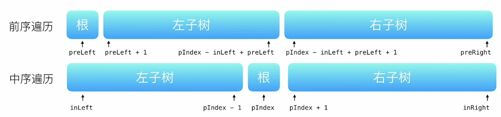

# Leetcode 100-199

[TOC]


## 101.对称二叉树

>给你一个二叉树的根节点 `root` ， 检查它是否轴对称。
>
>- 树中节点数目在范围 `[1, 1000]` 内
>- `-100 <= Node.val <= 100`

时间复杂度 $O(n)$ 。

```c++
/**
 * Definition for a binary tree node.
 * struct TreeNode {
 *     int val;
 *     TreeNode *left;
 *     TreeNode *right;
 *     TreeNode() : val(0), left(nullptr), right(nullptr) {}
 *     TreeNode(int x) : val(x), left(nullptr), right(nullptr) {}
 *     TreeNode(int x, TreeNode *left, TreeNode *right) : val(x), left(left), right(right) {}
 * };
 */
class Solution {
public:

    bool symmetric(TreeNode* left, TreeNode* right) {
        if(left!=nullptr && right!=nullptr) {
            if(left->val!=right->val) {
                return false;
            }
            return symmetric(left->left, right->right) && symmetric(left->right, right->left);
        } else if(left==nullptr && right==nullptr) {
            return true;
        } else {
            return false;
        }
    }


    bool isSymmetric(TreeNode* root) {
        if(root==nullptr) {
            return true;
        }
        return symmetric(root->left, root->right);
    }
};
```


## 102.二叉树的层序遍历

>给你二叉树的根节点 `root` ，返回其节点值的 **层序遍历** 。 （即逐层地，从左到右访问所有节点）。
>
>- 树中节点数目在范围 `[0, 2000]` 内
>- `-1000 <= Node.val <= 1000`

时间复杂度 $O(n)$ 。

```c++
/**
 * Definition for a binary tree node.
 * struct TreeNode {
 *     int val;
 *     TreeNode *left;
 *     TreeNode *right;
 *     TreeNode() : val(0), left(nullptr), right(nullptr) {}
 *     TreeNode(int x) : val(x), left(nullptr), right(nullptr) {}
 *     TreeNode(int x, TreeNode *left, TreeNode *right) : val(x), left(left), right(right) {}
 * };
 */
class Solution {
public:
    vector<vector<int>> levelOrder(TreeNode* root) {
        queue<TreeNode*> que;
        vector<vector<int>> ret;
        ret.clear();
        if(root==nullptr)
            return ret;

        que.push(root);
        while(!que.empty())
        {
            int size=que.size();
            vector<int> layer;
            layer.clear();
            while(size--)
            {
                TreeNode* node=que.front();
                que.pop();
                layer.push_back(node->val);
                if(node->left!=nullptr)
                    que.push(node->left);
                if(node->right!=nullptr)
                    que.push(node->right);
            }
            ret.push_back(layer);
            
        }
        return ret;
    }
};
```


## 103.二叉树的锯齿形层序遍历

>给你二叉树的根节点 `root` ，返回其节点值的 **锯齿形层序遍历** 。（即先从左往右，再从右往左进行下一层遍历，以此类推，层与层之间交替进行）。

时间复杂度 $O(n)$ 。

```c++
/**
 * Definition for a binary tree node.
 * struct TreeNode {
 *     int val;
 *     TreeNode *left;
 *     TreeNode *right;
 *     TreeNode() : val(0), left(nullptr), right(nullptr) {}
 *     TreeNode(int x) : val(x), left(nullptr), right(nullptr) {}
 *     TreeNode(int x, TreeNode *left, TreeNode *right) : val(x), left(left), right(right) {}
 * };
 */
class Solution {
public:
    vector<vector<int>> zigzagLevelOrder(TreeNode* root) {
        vector<vector<int>> ret;
        ret.clear();
        deque<TreeNode*> doubleque;
        doubleque.clear();
        if(root==nullptr)
            return ret;
        doubleque.push_back(root);
        bool reverse=false;
        while(doubleque.empty()==false)
        {
            int size=doubleque.size();
            vector<int> layer;
            layer.clear();
            if(reverse==true)
            {
                stack<TreeNode*> st;
                while(!doubleque.empty())
                {
                    TreeNode* node=doubleque.front();
                    
                    st.push(node);
                    doubleque.pop_front();
                }
                while(!st.empty())
                {
                    doubleque.push_front(st.top());
                    layer.push_back(st.top()->val);
                    st.pop();
                }
            }
            
            while(size--)
            {
                TreeNode* node=doubleque.front();
                doubleque.pop_front();
                if(reverse==false)
                    layer.push_back(node->val);
                if(node->left!=nullptr)
                    doubleque.push_back(node->left);
                if(node->right!=nullptr)
                    doubleque.push_back(node->right);
            }
            reverse=!reverse;
            ret.push_back(layer);
        }
        return ret;
    }
};
```


## 104.二叉树的最大深度

>给定一个二叉树 `root` ，返回其最大深度。
>
>二叉树的 **最大深度** 是指从根节点到最远叶子节点的最长路径上的节点数。
>
>- 树中节点的数量在 `[0, 10^4]` 区间内。
>- `-100 <= Node.val <= 100`

此题可以用递归或BFS完成，均比较简单。

时间复杂度 $O(n)$ 。

```c++
/**
 * Definition for a binary tree node.
 * struct TreeNode {
 *     int val;
 *     TreeNode *left;
 *     TreeNode *right;
 *     TreeNode() : val(0), left(nullptr), right(nullptr) {}
 *     TreeNode(int x) : val(x), left(nullptr), right(nullptr) {}
 *     TreeNode(int x, TreeNode *left, TreeNode *right) : val(x), left(left), right(right) {}
 * };
 */
class Solution {
public:
    int maxDepth(TreeNode* root) {
        if(root == nullptr) {
            return 0;
        } else {
            return 1+max(maxDepth(root->left), maxDepth(root->right));
        }
    }
};
```


## 105.从前序与中序遍历序列构造二叉树

>给定两个整数数组 `preorder` 和 `inorder` ，其中 `preorder` 是二叉树的**先序遍历**， `inorder` 是同一棵树的**中序遍历**，请构造二叉树并返回其根节点。
>
>- `1 <= preorder.length <= 3000`
>- `inorder.length == preorder.length`
>- `-3000 <= preorder[i], inorder[i] <= 3000`
>- `preorder` 和 `inorder` 均 **无重复** 元素
>- `inorder` 均出现在 `preorder`
>- `preorder` **保证** 为二叉树的前序遍历序列
>- `inorder` **保证** 为二叉树的中序遍历序列

对于一个树，其先序遍历与中序遍历的结构如下图所示；



由此可见，我们可以递归地构造这棵树，递归函数传入的参数就是先序和中序遍历序列。我们先从前序遍历的第一个元素知道当前构造的树的根节点的值并构造根节点，然后在中序遍历序列中找到根节点所在的位置。这样我们就能够知道左子树中有多少个元素，并在先序遍历序列中找到左右子树的分界点。最后，我们知道了左右子树分别对应的先序和中序遍历序列，就可以递归构造了。另外注意，在中序遍历序列中找到根节点的位置这个操作可以在 $O(1)$ 时间内完成，只需要提前用哈希表存储每个节点在中序遍历序列中的位置即可。

时间复杂度 $O(n)$ 。

```c++
/**
 * Definition for a binary tree node.
 * struct TreeNode {
 *     int val;
 *     TreeNode *left;
 *     TreeNode *right;
 *     TreeNode() : val(0), left(nullptr), right(nullptr) {}
 *     TreeNode(int x) : val(x), left(nullptr), right(nullptr) {}
 *     TreeNode(int x, TreeNode *left, TreeNode *right) : val(x), left(left), right(right) {}
 * };
 */
class Solution {
public:

    TreeNode* buildTree(vector<int>& preorder, int preLeft, int preRight, 
        vector<int>& inorder, int inLeft, int inRight, unordered_map<int, int>& mp) {
            if(preLeft>preRight) {
                return nullptr;
            }
            TreeNode* root = new TreeNode(preorder[preLeft]);
            int rootIdx = mp[root->val];
            int leftCnt = rootIdx-inLeft;
            root->left = buildTree(preorder, preLeft+1, preLeft+leftCnt, inorder, inLeft, rootIdx-1, mp);
            root->right = buildTree(preorder, preLeft+leftCnt+1, preRight, inorder, rootIdx+1, inRight, mp);
            return root;
        }

    TreeNode* buildTree(vector<int>& preorder, vector<int>& inorder) {
        unordered_map<int, int> mp;
        int n = inorder.size();
        for(int i=0; i<n; i++) {
            mp[inorder[i]] = i;
        }
        TreeNode* root = buildTree(preorder, 0, n-1, inorder, 0, n-1, mp);
        return root;
    }
};
```


## 108.将有序数组转换为二叉搜索树

>给你一个整数数组 `nums` ，其中元素已经按 **升序** 排列，请你将其转换为一棵 **高度平衡** 二叉搜索树。
>
>**高度平衡** 二叉树是一棵满足「每个节点的左右两个子树的高度差的绝对值不超过 1 」的二叉树。
>
>- `1 <= nums.length <= 104`
>- `-104 <= nums[i] <= 104`
>- `nums` 按 **严格递增** 顺序排列

此题可以利用构造平衡二叉搜索树的算法来完成，但左旋右旋难度不小。其实，考虑到数组nums升序，且之后不会再添加或删除节点，因此，其实可以简单的从数组构造。以数组的中点为根，左半部分为左子树，右半部分为右子树递归构建即可。

时间复杂度 $O(n)$ 。

```c++
/**
 * Definition for a binary tree node.
 * struct TreeNode {
 *     int val;
 *     TreeNode *left;
 *     TreeNode *right;
 *     TreeNode() : val(0), left(nullptr), right(nullptr) {}
 *     TreeNode(int x) : val(x), left(nullptr), right(nullptr) {}
 *     TreeNode(int x, TreeNode *left, TreeNode *right) : val(x), left(left), right(right) {}
 * };
 */
class Solution {
public:
    TreeNode* helper(vector<int>& nums, int left, int right) {
        if(left>right) 
            return nullptr;
        int mid = (left+right)/2;
        TreeNode* head = new TreeNode(nums[mid]);
        head->left = helper(nums, left, mid-1);
        head->right = helper(nums, mid+1, right);
        return head;
    }

    TreeNode* sortedArrayToBST(vector<int>& nums) {
        return helper(nums, 0, nums.size()-1);
    }
};
```


## 110.平衡二叉树

>给定一个二叉树，判断它是否是高度平衡的二叉树。
>
>本题中，一棵高度平衡二叉树定义为：
>
>一个二叉树*每个节点* 的左右两个子树的高度差的绝对值不超过 1 。
>
>- 树中的节点数在范围 `[0, 5000]` 内
>- `-104 <= Node.val <= 104`

递归搜索子树的高度。搜索的同时判断子树是否平衡，不平衡就返回-1。

时间复杂度 $O(n)$ 。

```c++
/**
 * Definition for a binary tree node.
 * struct TreeNode {
 *     int val;
 *     TreeNode *left;
 *     TreeNode *right;
 *     TreeNode() : val(0), left(nullptr), right(nullptr) {}
 *     TreeNode(int x) : val(x), left(nullptr), right(nullptr) {}
 *     TreeNode(int x, TreeNode *left, TreeNode *right) : val(x), left(left), right(right) {}
 * };
 */
class Solution {
public:

    int depth(TreeNode* root) {
        if(root==nullptr) {
            return 0;
        }
        int left = depth(root->left);
        int right = depth(root->right);
        if(left==-1 || right==-1) {
            return -1;
        }
        if(left>right) {
            swap(left, right);
        }
        if(right-left>1) {
            return -1;
        }
        return right+1;
    }

    bool isBalanced(TreeNode* root) {
        if(root==nullptr) {
            return true;
        }
        int left = depth(root->left);
        int right = depth(root->right);
        if(left==-1 || right==-1) {
            return false;
        }
        if(left>right) {
            swap(left, right);
        }
        if(right-left>1) {
            return false;
        }
        return true;
    }
};
```


## 114.二叉树展开为链表

>给你二叉树的根结点 `root` ，请你将它展开为一个单链表：
>
>- 展开后的单链表应该同样使用 `TreeNode` ，其中 `right` 子指针指向链表中下一个结点，而左子指针始终为 `null` 。
>- 展开后的单链表应该与二叉树 [**先序遍历**](https://baike.baidu.com/item/先序遍历/6442839?fr=aladdin) 顺序相同。
>- 树中结点数在范围 `[0, 2000]` 内
>- `-100 <= Node.val <= 100`
>- **进阶：**你可以使用原地算法（`O(1)` 额外空间）展开这棵树吗？

可以先先序遍历，并将节点按顺序存储到一个链表中，最后再修改树结构，但这不是空间复杂度 $O(1)$ 的算法。其实我们可以直接查找每个右子节点的前驱。即当一个节点没有左子节点时，那么其右子节点的前驱就是当前节点。当一个节点有左子树时，其右子节点的前驱就是左子树中最靠右的节点。于是我们可以一遍向右遍历，一遍修改树结构。

时间复杂度 $O(n)$ ，空间复杂度 $O(1)$ 。

```c++
/**
 * Definition for a binary tree node.
 * struct TreeNode {
 *     int val;
 *     TreeNode *left;
 *     TreeNode *right;
 *     TreeNode() : val(0), left(nullptr), right(nullptr) {}
 *     TreeNode(int x) : val(x), left(nullptr), right(nullptr) {}
 *     TreeNode(int x, TreeNode *left, TreeNode *right) : val(x), left(left), right(right) {}
 * };
 */
class Solution {
public:
    void flatten(TreeNode* root) {
        TreeNode* cur = root;
        while(cur!=nullptr) {
            if(cur->left == nullptr) {
                cur = cur->right;
                continue;
            }
            TreeNode* rightMost = cur->left;
            while(rightMost->right!=nullptr) {
                rightMost = rightMost->right;
            }
            rightMost->right = cur->right;
            cur->right = cur->left;
            cur->left = nullptr;
            cur = cur->right;
        }
    }
};
```


## 113.路径总和II

>给你二叉树的根节点 `root` 和一个整数目标和 `targetSum` ，找出所有 **从根节点到叶子节点** 路径总和等于给定目标和的路径。
>
>**叶子节点** 是指没有子节点的节点。

回溯。

时间复杂度 $O(n)$ 。

```c++
/**
 * Definition for a binary tree node.
 * struct TreeNode {
 *     int val;
 *     TreeNode *left;
 *     TreeNode *right;
 *     TreeNode() : val(0), left(nullptr), right(nullptr) {}
 *     TreeNode(int x) : val(x), left(nullptr), right(nullptr) {}
 *     TreeNode(int x, TreeNode *left, TreeNode *right) : val(x), left(left), right(right) {}
 * };
 */
class Solution {
public:

    void findPath(TreeNode* root, int targetSum, int curSum, vector<int>& path, vector<vector<int>>& ret) {
        if(root->left==nullptr && root->right==nullptr) {
            curSum += root->val;
            if(curSum==targetSum) {
                path.push_back(root->val);
                ret.push_back(path);
                path.pop_back();
            }
            return;
        }
        curSum += root->val;
        path.push_back(root->val);
        if(root->left) {
            findPath(root->left, targetSum, curSum, path, ret);
        }
        if(root->right) {
            findPath(root->right, targetSum, curSum, path, ret);
        }
        path.pop_back();
    }

    vector<vector<int>> pathSum(TreeNode* root, int targetSum) {
        vector<vector<int>> ret;
        vector<int> path;
        int curSum = 0;
        if(root==nullptr) {
            return ret;
        }
        findPath(root, targetSum, curSum, path, ret);
        return ret;
    }
};
```


## 115.不同的子序列

>给你两个字符串 `s` 和 `t` ，统计并返回在 `s` 的 **子序列** 中 `t` 出现的个数。
>
>题目数据保证答案符合 32 位带符号整数范围。
>
>- `1 <= s.length, t.length <= 1000`
>- `s` 和 `t` 由英文字母组成

动态规划。定义$dp[i][j]:=s[0:j+1]的子序列中t[0:i+1]出现的个数$ 。那么对于 $dp[i][j]$ ，字符串t的最后一个字符的来源有两种情况：

+ 来源于字符串s的末尾字符。此时需要满足 $t[i]==s[j]$ ，则 $dp[i][j]=dp[i-1][j-1]$ 。
+ 来源于字符串s的非末尾字符。此时  $dp[i][j]=dp[i][j-1]$ 。

时间复杂度 $O(mn)$ 。

下面的代码使用了滚动数组。另外需要注意的是，题目数据保证答案符合32位带符号整数范围，但是动态规划的过程中数据可能溢出，因此可以在dp过程中将结果对32位带符号整数的最大值取模。

```c++
class Solution {
public:
    typedef long long int ll;
    static const int N=1e3+5;
    ll dp[2][N];
    int numDistinct(string s, string t) {
        int slen = s.size();
        int tlen = t.size();
        for(int i=0; i<slen; i++)
            dp[1][i] = 1;
        for(int i=0; i<tlen; i++)
        {
            for(int j=0; j<slen; j++)
            {
                if(j<i)
                    dp[i&1][j] = 0;
                else if(j==0)
                    dp[i&1][j] = (s[0]==t[0]);
                else if(t[i]==s[j])
                    dp[i&1][j] = (dp[i&1][j-1] + dp[1-(i&1)][j-1])%INT_MAX;
                else
                    dp[i&1][j] = dp[i&1][j-1];
            }
        }
        return dp[(tlen-1)&1][slen-1];
    }
};
```


## 118.杨辉三角

>给定一个非负整数 *`numRows`，*生成「杨辉三角」的前 *`numRows`* 行。
>
>在「杨辉三角」中，每个数是它左上方和右上方的数的和。
>
>- `1 <= numRows <= 30`

动态规划。时间复杂度 $O(n^2)$ 。

```c++
class Solution {
public:
    vector<vector<int>> generate(int numRows) {
        vector<vector<int>> ret;
        for(int i=1; i<=numRows; i++)
        {
            vector<int> row;
            if(ret.size()==0)
            {
                row.push_back(1);
                ret.push_back(row);
            }
            else
            {
                row.push_back(1);
                vector<int>& lastRow = ret.back();
                for(int j=0; j<lastRow.size()-1; j++)
                {
                    row.push_back(lastRow[j]+lastRow[j+1]);
                }
                row.push_back(1);
                ret.push_back(row);
            }
        }
        return ret;
    }
};
```


## 119.杨辉三角II

>给定一个非负索引 `rowIndex`，返回「杨辉三角」的第 `rowIndex` 行。
>
>在「杨辉三角」中，每个数是它左上方和右上方的数的和。
>
>- `0 <= rowIndex <= 33`

动态规划。若使用滚动数组，注意需要从后往前更新数组。

时间复杂度 $O(n^2)$ 。

```c++
class Solution {
public:
    vector<int> getRow(int rowIndex) {
        rowIndex++;
        vector<int> ret(rowIndex, 0);
        ret[0] = 1;
        for(int i=2; i<=rowIndex; i++)
        {
            ret[i-1] = 1;
            for(int j=i-2; j>=1; j--)
            {
                ret[j] += ret[j-1];
            }
        }
        return ret;
    }
};
```


## 120.三角形最小路径和

>给定一个三角形 `triangle` ，找出自顶向下的最小路径和。
>
>每一步只能移动到下一行中相邻的结点上。**相邻的结点** 在这里指的是 **下标** 与 **上一层结点下标** 相同或者等于 **上一层结点下标 + 1** 的两个结点。也就是说，如果正位于当前行的下标 `i` ，那么下一步可以移动到下一行的下标 `i` 或 `i + 1` 。
>
>- `1 <= triangle.length <= 200`
>- `triangle[0].length == 1`
>- `triangle[i].length == triangle[i - 1].length + 1`
>- `-10^4 <= triangle[i][j] <= 10^4`

动态规划。可以使用滚动数组，从后往前遍历。

时间复杂度 $O(n^2)$ 。

```c++
class Solution {
public:
    int minimumTotal(vector<vector<int>>& triangle) {
        int sz = triangle.size();
        vector<int> dp(sz, 0);
        for(int i=1; i<=sz; i++)
        {
            for(int j=i-1; j>=0; j--)
            {
                if(j==0)               
                    dp[j] += triangle[i-1][j];               
                else if(j==i-1)
                    dp[j] = triangle[i-1][j] + dp[j-1];
                else 
                    dp[j] = triangle[i-1][j] + min(dp[j], dp[j-1]);
            }
        }
        int ret = INT_MAX;
        for(int i=0; i<sz; i++)
            ret = min(ret, dp[i]);
        return ret;
    }
};
```


## 121.买卖股票的最佳时机

>给定一个数组 `prices` ，它的第 `i` 个元素 `prices[i]` 表示一支给定股票第 `i` 天的价格。
>
>你只能选择 **某一天** 买入这只股票，并选择在 **未来的某一个不同的日子** 卖出该股票。设计一个算法来计算你所能获取的最大利润。
>
>返回你可以从这笔交易中获取的最大利润。如果你不能获取任何利润，返回 `0` 。
>
>- `1 <= prices.length <= 10^5`
>- `0 <= prices[i] <= 10^4`

注意，题目的意思最多只能买入卖出各一次。我们可以遍历价格，用一个变量记录当前遇到过的最低股票价格，当前价格与最低价格的差就是当前利润，维护当前利润的最大值即可。

时间复杂度 $O(n)$ 。

```c++
class Solution {
public:
    int maxProfit(vector<int>& prices) {
        int n = prices.size();
        int minPrice = prices[0];
        int profit = 0;
        for(int i=1; i<n; i++) {
            profit = max(profit, prices[i]-minPrice);
            minPrice = min(minPrice, prices[i]);
        }
        return profit;
    }
};
```


## 123.买卖股票的最佳时机III

>给定一个数组，它的第 `i` 个元素是一支给定的股票在第 `i` 天的价格。
>
>设计一个算法来计算你所能获取的最大利润。你最多可以完成 **两笔** 交易。
>
>**注意：**你不能同时参与多笔交易（你必须在再次购买前出售掉之前的股票）。
>
>- `1 <= prices.length <= 10^5`
>- `0 <= prices[i] <= 10^5`

动态规划。定义：
$$
\begin{equation*}
\begin{aligned}
&dp[i][0]:=到第i+1天结束只买过一支股票的最大利润 \\
&dp[i][1]:=到第i+1天结束买过一支股票并且卖出的最大利润 \\
&dp[i][2]:=到第i+1天结束买过一支股票并卖出，又买了一支股票的最大利润 \\
&dp[i][3]:=到第i+1天结束完成了两次交易的最大利润 \\
\end{aligned}
\end{equation*}
$$
于是有递推关系：
$$
\begin{equation*}
\begin{aligned}
&dp[i][0] = max(dp[i-1][0], -prices[i]); \\
&dp[i][1] = max(dp[i-1][1], dp[i-1][0]+prices[i]); \\
&dp[i][2] = max(dp[i-1][2], dp[i-1][1]-prices[i]); \\
&dp[i][3] = max(dp[i-1][3], dp[i-1][2]+prices[i]); \\
\end{aligned}
\end{equation*}
$$
时间复杂度 $O(n)$ 。

```c++
class Solution {
public:
    static const int MIN=-0x3e3e3e3e;
    static const int N=1e5+5;
    int dp[N][4];
    int maxProfit(vector<int>& prices) {
        int sz = prices.size();
        dp[0][0] = -prices[0];
        dp[0][1] = MIN;
        dp[0][2] = MIN;
        dp[0][3] = MIN;
        for(int i=1; i<sz; i++)
        {
            dp[i][0] = max(dp[i-1][0], -prices[i]);
            dp[i][1] = max(dp[i-1][1], dp[i-1][0]+prices[i]);
            dp[i][2] = max(dp[i-1][2], dp[i-1][1]-prices[i]);
            dp[i][3] = max(dp[i-1][3], dp[i-1][2]+prices[i]);
        }
        return max({0, dp[sz-1][1], dp[sz-1][3]});
    }
};
```


## 124.二叉树中的最大路径和

>二叉树中的 **路径** 被定义为一条节点序列，序列中每对相邻节点之间都存在一条边。同一个节点在一条路径序列中 **至多出现一次** 。该路径 **至少包含一个** 节点，且不一定经过根节点。
>
>**路径和** 是路径中各节点值的总和。
>
>给你一个二叉树的根节点 `root` ，返回其 **最大路径和** 。
>
>- 树中节点数目范围是 `[1, 3 * 10^4]`
>- `-1000 <= Node.val <= 1000`

我们定义辅助路径是指具有线性关系的一条路径，即一定是从根节点到叶子节点的路径的一部分。那么对于题目中要求的最大路径，一定是某个节点再加上左右子节点为起点的辅助路径(如果左右子节点的辅助路径和为正值)。因此，我们可以递归求出当前节为起点的辅助路径的最大值，然后在同时更新题目要求的最大路径值。

时间复杂度 $O(n)$ 。

```c++
/**
 * Definition for a binary tree node.
 * struct TreeNode {
 *     int val;
 *     TreeNode *left;
 *     TreeNode *right;
 *     TreeNode() : val(0), left(nullptr), right(nullptr) {}
 *     TreeNode(int x) : val(x), left(nullptr), right(nullptr) {}
 *     TreeNode(int x, TreeNode *left, TreeNode *right) : val(x), left(left), right(right) {}
 * };
 */
class Solution {
public:
    int res;
    int dfs(TreeNode* root) {
        int left = 0;
        int right = 0;
        if(root->left) {
            left = dfs(root->left);
        }
        if(root->right) {
            right = dfs(root->right);
        }
        
        int ret = root->val;
        ret = max(ret, root->val+left);
        ret = max(ret, root->val+right);

        res = max(res, root->val);
        res = max(res, root->val+left);
        res = max(res, root->val+right);
        res = max(res, root->val+left+right);
        return ret;
    }

    int maxPathSum(TreeNode* root) {
        res = root->val;
        dfs(root);
        return res;
    }
};
```


## 128.最长连续序列

>给定一个未排序的整数数组 `nums` ，找出数字连续的最长序列（不要求序列元素在原数组中连续）的长度。
>
>请你设计并实现时间复杂度为 `O(n)` 的算法解决此问题。
>
>- `0 <= nums.length <= 105`
>- `-109 <= nums[i] <= 109`

数组中的数显然是分散在整数域内，我们要找最长连续序列，其实只需要找到最长连续序列的起始点，然后从起始点开始往后逐一递增，直到数字不在数组中为止。因此，我们可以提前讲所有数字放入一个哈希表，然后对于一个数字num，只有num-1不在哈希表中，它才可能是最长序列的起点。所以，对于这种num，我们检查以它为起点的最长连续序列的长度。最终取所有序列的长度最大值即可。

由于每个数字只会在检查中出现一次，所以时间复杂度 $O(n)$ 。

```c++
class Solution {
public:
    int longestConsecutive(vector<int>& nums) {
        unordered_set<int> numSet;
        int n = nums.size();
        for(int i=0; i<n; i++) {
            numSet.insert(nums[i]);
        }
        int res = 0;
        unordered_set<int>::iterator it = numSet.begin();
        while(it!=numSet.end()) {
            int num = *it;
            if(numSet.count(num-1)) {
                it++;
                continue;
            }
            int cur = 1;
            while(numSet.count(num+1)) {
                num++;
                cur++;
            }
            res = max(res, cur);
            it++;
        }
        return res;
    }
};
```


## 129.求根节点到叶节点数字之和

>给你一个二叉树的根节点 `root` ，树中每个节点都存放有一个 `0` 到 `9` 之间的数字。
>
>每条从根节点到叶节点的路径都代表一个数字：
>
>- 例如，从根节点到叶节点的路径 `1 -> 2 -> 3` 表示数字 `123` 。
>
>计算从根节点到叶节点生成的 **所有数字之和** 。
>
>**叶节点** 是指没有子节点的节点。
>
>- 树中节点的数目在范围 `[1, 1000]` 内
>- `0 <= Node.val <= 9`
>- 树的深度不超过 `10`

回溯。

时间复杂度 $O(n)$ 。

```c++
/**
 * Definition for a binary tree node.
 * struct TreeNode {
 *     int val;
 *     TreeNode *left;
 *     TreeNode *right;
 *     TreeNode() : val(0), left(nullptr), right(nullptr) {}
 *     TreeNode(int x) : val(x), left(nullptr), right(nullptr) {}
 *     TreeNode(int x, TreeNode *left, TreeNode *right) : val(x), left(left), right(right) {}
 * };
 */
class Solution {
public:

    void dfs(TreeNode* root, int& cur, int& res) {
        cur = cur*10+root->val;
        if(root->left==nullptr && root->right==nullptr) {
            res += cur;
        }
        if(root->left!=nullptr)
            dfs(root->left, cur, res);
        if(root->right!=nullptr)
            dfs(root->right, cur, res);
        cur /= 10;
    }

    int sumNumbers(TreeNode* root) {
        int res = 0;
        int cur = 0;
        dfs(root, cur, res);
        return res;
    }
};
```


## 131.分割回文串

>给你一个字符串 s，请你将 s 分割成一些子串，使每个子串都是 回文串 。返回 s 所有可能的分割方案。
>回文串 是正着读和反着读都一样的字符串。
>
>- `1 <= s.length <= 16`
>- `s` 仅由小写英文字母组成

方法一：动态规划

定义 $dp[i]:=s的前i+1个字符的分割方案。$ 遍历到第i+1个字符是，可以枚举以该字符为结尾的回文串，假设 $s[j]$ 到 $s[i]$ 为回文串，那么将该串拼接到 $dp[j-1]$ 的所有分割方案后，得到的所有方法都是 $dp[i]$ 中的一种方案。

另外，在判断回文串时，可以使用动态规划预处理一个二维数组，这样后续就不用重复的遍历字符串来判断了。

最坏的情况下，字符串s由同一种字符构成，则它一共有 $2^n$ 种分割方案。所以结果集合的规模是 $2^n$ 。由于遍历过程中，会存储n个结果集合，每个集合的存储时间为 $n2^n$ ，所以时间复杂度是 $O(2^1+2*2^2+\cdots+n*2^n)$ 。
$$
\begin{equation*}
\begin{aligned}
& 令\ f(n)=2^1+2\times2^2+3\times2^3+\cdots+n2^n \\
& 则有\ 2f(n)=1\times2^2+2\times2^3+3\times2^4+\cdots+(n-1)2^n+n2^{n+1} \\
& \therefore f(n)-2f(n)=2^1+2^2+\cdots+2^n-n2^{n+1} \\
& -f(n) = \frac{2(1-2^n)}{1-2}-n2^{n+1} \\
& f(n) = n2^{n+1}-2^{n+1}+2 \\
& f(n) = (n-1)2^{n+1}+2 \\
& \therefore 时间复杂度为 O(n2^n) 
\end{aligned}
\end{equation*}
$$


```c++
class Solution {
public:
    static const int N=20;
    vector<vector<string>> dp[N];
    bool palindrome[N][N];

    vector<vector<string>> partition(string s) {
        int sz = s.size();
        for(int length=1; length<=sz; length++)
        {
            for(int start=0; start<sz; start++)
            {
                int end = start+length-1;
                if(end>sz-1)
                    break;
                if(length==1)
                    palindrome[start][end] = true;
                else if(length==2)       
                    palindrome[start][end] = (s[start]==s[end]);         
                else
                    palindrome[start][end] = (s[start]==s[end])&&palindrome[start+1][end-1];   
            }
        }
        for(int i=0; i<sz; i++)
        {
            for(int j=i; j>=0; j--)
            {
                if(palindrome[j][i])
                {
                    if(j==0)
                    {
                        vector<string> vec;
                        vec.push_back(s.substr(0,i+1));
                        dp[i].push_back(vec);
                    }
                    else
                    {
                        vector<vector<string>>& tmp = dp[j-1];
                        for(int k=0; k<tmp.size(); k++)
                        {
                            vector<string> vec = tmp[k];
                            vec.push_back(s.substr(j,i-j+1));
                            dp[i].push_back(vec);
                        }
                    }
                }
            }
        }
        return dp[sz-1];
    }
};
```

方法二：动态规划+回溯

首先使用动态规划预处理出回文数组。

在遍历到 $s[i]$ 时，枚举下一个分割位置从 $s[i]$ 到 $s[sz-1]$ 。DFS搜索即可。

由于搜索出结果集合中每个答案并放入结果集合需要的时间复杂度为 $O(n)$ ，所以总的时间复杂度为  $O(n2^n)$ 。

```c++

class Solution {
private:
    static const int N=20;
    bool palindrome[N][N];
    vector<vector<string>> ret;
    vector<string> ans;
public:
    void dfs(const string& s, int idx, int sz) 
    {
        if(idx==sz) 
        {
            ret.push_back(ans);
            return;
        }
        for(int j=idx; j<sz; j++)
        {
            if(palindrome[idx][j])
            {
                ans.push_back(s.substr(idx, j-idx+1));
                dfs(s, j+1, sz);
                ans.pop_back();
            }
        }
    }

    vector<vector<string>> partition(string s) {
        int sz = s.size();
        for(int length=1; length<=sz; length++)
        {
            for(int start=0; start<sz; start++)
            {
                int end = start+length-1;
                if(end>sz-1)
                    break;
                if(length==1)
                    palindrome[start][end] = true;
                else if(length==2)       
                    palindrome[start][end] = (s[start]==s[end]);         
                else
                    palindrome[start][end] = (s[start]==s[end])&&palindrome[start+1][end-1];   
            }
        }
        dfs(s, 0, sz);
        return ret;
    }
};

```


## 132.分割回文串II

>给你一个字符串 `s`，请你将 `s` 分割成一些子串，使每个子串都是回文。
>
>返回符合要求的 **最少分割次数** 。
>
>- `1 <= s.length <= 2000`
>- `s` 仅由小写英文字母组成

动态规划。此题和131题的区别是不用求出具体的分割方案，只需要知道最少分割的次数。所以可以使用dp数组记录切割的最小次数。

定义 $dp[i]:=S的前i+1个字符构成的字符串的最少分割次数。$ 

时间复杂度 $O(n^2)$ 。

```c++
class Solution {
public:
    static const int N=2e3+5;
    bool palindrome[N][N];
    int dp[N];
    int minCut(string s) {
        int sz = s.size();
        for(int length=1; length<=sz; length++)
        {
            for(int start=0; start<sz; start++)
            {
                int end = start+length-1;
                if(end>sz-1)
                    break;
                if(length==1)
                    palindrome[start][end] = true;
                else if(length==2)       
                    palindrome[start][end] = (s[start]==s[end]);         
                else
                    palindrome[start][end] = (s[start]==s[end])&&palindrome[start+1][end-1];   
            }
        }
        for(int i=0; i<sz; i++)
        {
            dp[i] = INT_MAX;
            for(int j=i; j>=0; j--)
            {
                if(palindrome[j][i])
                {
                    if(j==0)
                        dp[i] = 0;
                    else
                        dp[i] = min(dp[i], dp[j-1]+1);
                }
            }
        }
        return dp[sz-1];
    }
};
```


## 133.克隆图

>给你无向 **[连通](https://baike.baidu.com/item/连通图/6460995?fr=aladdin)** 图中一个节点的引用，请你返回该图的 [**深拷贝**](https://baike.baidu.com/item/深拷贝/22785317?fr=aladdin)（克隆）。
>
>图中的每个节点都包含它的值 `val`（`int`） 和其邻居的列表（`list[Node]`）。
>
>1. 节点数不超过 100 。
>2. 每个节点值 `Node.val` 都是唯一的，`1 <= Node.val <= 100`。
>3. 无向图是一个[简单图](https://baike.baidu.com/item/简单图/1680528?fr=aladdin)，这意味着图中没有重复的边，也没有自环。
>4. 由于图是无向的，如果节点 *p* 是节点 *q* 的邻居，那么节点 *q* 也必须是节点 *p* 的邻居。
>5. 图是连通图，你可以从给定节点访问到所有节点。

DFS。用哈希表存储旧图与新图之间节点的映射关系。

时间复杂度 $O(n)$ 。

```c++
/*
// Definition for a Node.
class Node {
public:
    int val;
    vector<Node*> neighbors;
    Node() {
        val = 0;
        neighbors = vector<Node*>();
    }
    Node(int _val) {
        val = _val;
        neighbors = vector<Node*>();
    }
    Node(int _val, vector<Node*> _neighbors) {
        val = _val;
        neighbors = _neighbors;
    }
};
*/

class Solution {
public:

    Node* dfs_build(Node* old_node, unordered_map<Node*, Node*>& mp) {
        if(mp.find(old_node)!=mp.end()) {
            return mp[old_node];
        }
        Node* ret = new Node(old_node->val);
        mp.insert({old_node, ret});
        for(auto& item : old_node->neighbors) {
            ret->neighbors.push_back(dfs_build(item, mp));
        }
        return ret;
    }

    Node* cloneGraph(Node* node) {
        unordered_map<Node*, Node*> old2new;
        if(node==nullptr) {
            return nullptr;
        }
        Node* ret = dfs_build(node, old2new);
        return ret;
    }
};
```


## 134.加油站

>在一条环路上有 `n` 个加油站，其中第 `i` 个加油站有汽油 `gas[i]` 升。
>
>你有一辆油箱容量无限的的汽车，从第 `i` 个加油站开往第 `i+1` 个加油站需要消耗汽油 `cost[i]` 升。你从其中的一个加油站出发，开始时油箱为空。
>
>给定两个整数数组 `gas` 和 `cost` ，如果你可以绕环路行驶一周，则返回出发时加油站的编号，否则返回 `-1` 。如果存在解，则 **保证** 它是 **唯一** 的。

首先计算一个净消耗数组 $num[i]=gas[i]-cost[i]$ 。题目的要求是选择一个起点，从这个起点遍历加和num数组，只要过程中总和一直非负，就说明该起点满足条件。

先假设起点是0，指针开始遍历加和，如果过程中sum变为负数了，就将起点往前移动（变为$n-1,n-2,\cdots$），直到sum变为非负，就继续将指针往后移动。在移动过程中，如果遍历完了所有的加油站，那么就判断此时的sum是否非负，如果非负就是返回起点即可。

题解：

首先检查第 0 个加油站，并试图判断能否环绕一周，假设从加油站x最远能到达y，那么在x和y之间的所有加油站作为起点都不能到达y+1，所以可以直接把起点移动到y+1开始遍历。


## 135.分发糖果

>`n` 个孩子站成一排。给你一个整数数组 `ratings` 表示每个孩子的评分。
>
>你需要按照以下要求，给这些孩子分发糖果：
>
>- 每个孩子至少分配到 `1` 个糖果。
>- 相邻两个孩子评分更高的孩子会获得更多的糖果。
>
>请你给每个孩子分发糖果，计算并返回需要准备的 **最少糖果数目** 。
>
>- `n == ratings.length`
>- `1 <= n <= 2 * 10^4`
>- `0 <= ratings[i] <= 2 * 10^4`

将“相邻的孩子中，评分高的孩子必须获得更多的糖果”这句话拆分为两个规则，分别处理。

+ 左规则：当 ratings[i−1]<ratings[i], i 号学生的糖果数量将比 i−1 号孩子的糖果数量多。
+ 右规则：当 ratings[i]>ratings[i+1], i 号学生的糖果数量将比 i+1 号孩子的糖果数量多。

我们遍历该数组两次，处理出每一个学生分别满足左规则或右规则时，最少需要被分得的糖果数量。每个人最终分得的糖果数量即为这两个数量的最大值。

具体地，以左规则为例：我们从左到右遍历该数组，假设当前遍历到位置 i，如果有 ratings[i−1]<ratings[i],我们令left[i]=left[i−1]+1即可，否则我们令 left[i]=1。


## 136.只出现一次的数字

>给你一个 **非空** 整数数组 `nums` ，除了某个元素只出现一次以外，其余每个元素均出现两次。找出那个只出现了一次的元素。
>
>你必须设计并实现线性时间复杂度的算法来解决此问题，且该算法只使用常量额外空间。
>
>- `1 <= nums.length <= 3 * 104`
>- `-3 * 104 <= nums[i] <= 3 * 104`
>- 除了某个元素只出现一次以外，其余每个元素均出现两次。

时间复杂度 $O(n)$ 。

```c++
class Solution {
public:
    int singleNumber(vector<int>& nums) {
        int x = nums[0];
        for(int i=1; i<nums.size(); i++) {
            x ^= nums[i];
        }
        return x;
    }
};
```


## 138.随机链表的复制

>给你一个长度为 `n` 的链表，每个节点包含一个额外增加的随机指针 `random` ，该指针可以指向链表中的任何节点或空节点。
>
>构造这个链表的 **[深拷贝](https://baike.baidu.com/item/深拷贝/22785317?fr=aladdin)**。 深拷贝应该正好由 `n` 个 **全新** 节点组成，其中每个新节点的值都设为其对应的原节点的值。新节点的 `next` 指针和 `random` 指针也都应指向复制链表中的新节点，并使原链表和复制链表中的这些指针能够表示相同的链表状态。**复制链表中的指针都不应指向原链表中的节点** 。
>
>例如，如果原链表中有 `X` 和 `Y` 两个节点，其中 `X.random --> Y` 。那么在复制链表中对应的两个节点 `x` 和 `y` ，同样有 `x.random --> y` 。
>
>返回复制链表的头节点。注意，你的程序不应该修改原本的链表。
>
>- `0 <= n <= 1000`
>- `-10^4 <= Node.val <= 10^4`
>- `Node.random` 为 `null` 或指向链表中的节点。

方法一：

一个简单的方法是使用哈希表记录新旧节点的对应关系，即键是旧节点，值是新节点。

时间复杂度 $O(n)$ ，空间复杂度 $O(n)$ 。

```c++
/*
// Definition for a Node.
class Node {
public:
    int val;
    Node* next;
    Node* random;
    
    Node(int _val) {
        val = _val;
        next = NULL;
        random = NULL;
    }
};
*/

class Solution {
public:
    Node* copyRandomList(Node* head) {
        map<Node*, Node*> mp;
        if(head == NULL) {
            return NULL;
        }
        Node* ret = new Node(head->val);
        mp[head] = ret;
        Node* p = head;
        Node* q = ret;
        while(p->next) {
            q->next = new Node(p->next->val);
            mp[p->next] = q->next;
            p = p->next;
            q = q->next; 
        }
        p = head;
        q = ret;
        while(p) {
            q->random = mp[p->random];
            p = p->next;
            q = q->next;
        }
        return ret;
    }
};
```

方法二：

其实，上一种方法中的哈希表可以省略。我们可以利用链表的next域记录新节点。首先在原链表的每个节点之后插入一个val相同的节点，这个节点就是复制出来的节点。此时一个节点S对应的新节点S'的random域就是S的random域的节点的后继。

时间复杂度 $O(n)$ ，空间复杂度 $O(1)$ 。

```c++

class Solution {
public:
    Node* copyRandomList(Node* head) {
        Node* p = head;
        while(p) {
            Node* nxt = p->next;
            p->next = new Node(p->val);
            p->next->next = nxt;
            p = nxt;
        }
        p = head;
        while(p) {
            if(p->random == NULL) {
                p->next->random = NULL;
            } else {
                p->next->random = p->random->next;
            }
            p = p->next->next;
        }
        if(head==NULL) {
            return NULL;
        }
        Node* ret = head->next;
        p = head;
        Node* q = ret;
        while(q->next) {
            p->next = q->next;
            q->next = q->next->next;
            p = p->next;
            q = q->next;
        }
        p->next = NULL;
        return ret;
    }
};
```


## 139.单词拆分

>给你一个字符串 `s` 和一个字符串列表 `wordDict` 作为字典。请你判断是否可以利用字典中出现的单词拼接出 `s` 。
>
>**注意：**不要求字典中出现的单词全部都使用，并且字典中的单词可以重复使用。
>
>- `1 <= s.length <= 300`
>- `1 <= wordDict.length <= 1000`
>- `1 <= wordDict[i].length <= 20`
>- `s` 和 `wordDict[i]` 仅有小写英文字母组成
>- `wordDict` 中的所有字符串 **互不相同**

方法一：回溯+记忆化搜索

每次从wordDict中取出一个单词往后拼接，拼接到s的末尾即成功。为了避免同一个位置重复搜索，使用标记记录每个位置是否可以完成搜索。

由于使用了记忆化搜索后，s的每个位置均可以被每个单词搜索一遍，所以时间复杂度 $O(nm)$ ，其中n是s的长度，m是wordDict的长度。

```c++
class Solution {
public:
    static const int N=3e2+5;
    bool memory[N];
    bool dfs(string& s, int idx, vector<string>& wordDict)
    {
        if(memory[idx]==false)
            return false;
        if(idx==s.size())
            return true;
        int wordCnt = wordDict.size();
        
        for(int i=0; i<wordCnt; i++)
        {
            string& word = wordDict[i];
            if(idx+word.size()-1>=s.size())
                continue;
            bool flag = true;
            for(int k=0; k<word.size(); k++)
            {
                if(s[idx+k]!=word[k])
                {
                    flag = false;
                    break;
                }
            }
            if(flag && dfs(s, idx+word.size(), wordDict))
                return true;
        }
        memory[idx] = false;
        return false;
    }

    bool wordBreak(string s, vector<string>& wordDict) {
        for(int i=0; i<N; i++)
            memory[i] = true;
        int sz = s.size();
        return dfs(s, 0, wordDict);
    }
};
```

方法二：动态规划

定义 $dp[i]:=S的前i+1个字符是否能被wordDict中的单词拼接出$  。为了快速判断S的后缀是否在单词表中，可以将所有单词预处理到一个哈希表中。遍历到S的第i个字符时，有两种策略：

1. 设最长的单词长度为x，遍历 $s[i-x]$ 到 $s[i]$ ，即枚举每个位置j作为分割位置，根据 $dp[j-1]$ 和 $s[j]$ 到 $s[i]$ 是否在单词表中来判断当前位置是否可以被拼接出。此方法的时间复杂度为 $O(max(nx,m))$ 。
2. 遍历字符串表中的每个单词word，根据 $dp[i-word.size()+1]$ 和 word是否为s的后缀来判断当前位置是否可以被拼接出。此方法的时间复杂度为 $O(nm)$ 。

下面的代码使用第一种策略：

```c++
class Solution {
public:
    bool wordBreak(string s, vector<string>& wordDict) {
        int n = s.size();
        int m = wordDict.size();
        unordered_set<string> words;
        int maxLen = 0;
        for(int i=0; i<m; i++) {
            words.insert(wordDict[i]);
            maxLen = max(maxLen, (int)wordDict[i].size());
        }

        vector<bool> dp(n, false);
        for(int i=0; i<n; i++) {
            
            int start = max(-1, i-maxLen);
            for(int j=start; j<i; j++) {
                if(j==-1 || dp[j]) {
                    if(words.count(s.substr(j+1, i-j))) {
                        dp[i] = true;
                        break;
                    }
                }
            }
        }
        return dp[n-1];
    }
};
```


## 140.单词拆分II

>给定一个字符串 `s` 和一个字符串字典 `wordDict` ，在字符串 `s` 中增加空格来构建一个句子，使得句子中所有的单词都在词典中。**以任意顺序** 返回所有这些可能的句子。
>
>**注意：**词典中的同一个单词可能在分段中被重复使用多次。
>
>- `1 <= s.length <= 20`
>- `1 <= wordDict.length <= 1000`
>- `1 <= wordDict[i].length <= 10`
>- `s` 和 `wordDict[i]` 仅有小写英文字母组成
>- `wordDict` 中所有字符串都 **不同**

回溯。与139题的方法一使用相同的方法搜索，只不过在搜索完成后是将句子加入结果集合，而不是返回true。

设直接实现该算法的时间复杂度为 $f(n)$ 。对于长度为n的字符串，我们首先枚举第一个拼接的单词。在最坏的情况下，每个位置均可以匹配一个长度为1的单词，则每个位置均是一个子问题。我们把拼接过程的时间消耗都算在最后将句子加入结果集合中。则每个句子的拼接过程和加入结果的时间消耗都是 $O(n)$ 。所以有:
$$
\begin{equation*}
\begin{aligned}
& f(n) = f(n-1)+f(n-2)+\cdots+f(1) \ 且 \ f(1)=n 。\\
& f(n) = 2f(n-1) = 2^2f(n-2) = \cdots = 2^{n-1}f(1) = n2^{n-1} = O(n2^n)
\end{aligned}
\end{equation*}
$$

```c++
class Solution {
public:
    vector<string> ret;
    string ans;
    unordered_set<string> set;
    int maxLength=0;
    void dfs(string& s, int idx, vector<string>& wordDict)
    {
        if(idx==s.size())
        {
            ret.push_back(ans.substr(1, ans.size()-1));
            return;
        }

        for(int j=1; j<=maxLength; j++)
        {
            if(idx+j-1>=s.size())
                break;
            if(set.count(s.substr(idx,j)))
            {
                ans = ans+" "+s.substr(idx,j);
                dfs(s, idx+j, wordDict);
                ans = ans.substr(0, ans.size()-j-1);
            }
        }
    }

    vector<string> wordBreak(string s, vector<string>& wordDict) {
        for(int i=0; i<wordDict.size(); i++)
        {
            set.insert(wordDict[i]);
            maxLength = max(maxLength, (int)wordDict[i].size());
        }
        dfs(s, 0, wordDict);
        return ret;
    }
};
```


## 141.环形链表

>给你一个链表的头节点 `head` ，判断链表中是否有环。
>
>如果链表中有某个节点，可以通过连续跟踪 `next` 指针再次到达，则链表中存在环。 为了表示给定链表中的环，评测系统内部使用整数 `pos` 来表示链表尾连接到链表中的位置（索引从 0 开始）。**注意：`pos` 不作为参数进行传递** 。仅仅是为了标识链表的实际情况。
>
>*如果链表中存在环* ，则返回 `true` 。 否则，返回 `false` 。

快慢指针。

慢的每次走一步，快的每次走两步。如果走到NULL则没有环，如果走到快慢指针相等则有环。

时间复杂度 $O(n)$ 。

```c++
/**
 * Definition for singly-linked list.
 * struct ListNode {
 *     int val;
 *     ListNode *next;
 *     ListNode(int x) : val(x), next(NULL) {}
 * };
 */
class Solution {
public:
    bool hasCycle(ListNode *head) {
        if(head == NULL || head->next==NULL) {
            return false;
        }
        ListNode* slow = head;
        ListNode* fast = head->next;
        while(slow!=fast) {
            if(fast->next == NULL || fast->next->next == NULL) {
                return false;
            }
            fast = fast->next->next;
            slow = slow->next;
        }
        return true;
    }
};
```


## 142.环形链表II

>给定一个链表的头节点  `head` ，返回链表开始入环的第一个节点。 *如果链表无环，则返回 `null`。*
>
>如果链表中有某个节点，可以通过连续跟踪 `next` 指针再次到达，则链表中存在环。 为了表示给定链表中的环，评测系统内部使用整数 `pos` 来表示链表尾连接到链表中的位置（**索引从 0 开始**）。如果 `pos` 是 `-1`，则在该链表中没有环。**注意：`pos` 不作为参数进行传递**，仅仅是为了标识链表的实际情况。
>
>**不允许修改** 链表。
>
>- 链表中节点的数目范围在范围 `[0, 104]` 内
>- `-105 <= Node.val <= 105`
>- `pos` 的值为 `-1` 或者链表中的一个有效索引
>- **进阶：**你是否可以使用 `O(1)` 空间解决此题？

快慢指针。

快指针每次走2步，慢指针每次走1步，如果快指针走到null，则没有环，否则有环。在快慢指针第一次相遇时，将慢指针重置到起点，然后快指针变为慢指针，二者同步前进，第二次相遇点就是环的入口。

时间复杂度 $O(n)$ 。

```c++
/**
 * Definition for singly-linked list.
 * struct ListNode {
 *     int val;
 *     ListNode *next;
 *     ListNode(int x) : val(x), next(NULL) {}
 * };
 */
class Solution {
public:
    ListNode *detectCycle(ListNode *head) {
        if(head==NULL || head->next==NULL) {
            return NULL;
        }
        ListNode* fast = head->next->next;
        ListNode* slow = head->next;
        while(fast!=slow) {
            if(fast==NULL || fast->next==NULL) {
                return NULL;
            }
            fast = fast->next->next;
            slow = slow->next;
        }
        slow = head;
        while(slow!=fast) {
            slow = slow->next;
            fast = fast->next;
        }
        return slow;
    }
};
```


## 143.重排链表

>给定一个单链表 `L` 的头节点 `head` ，单链表 `L` 表示为：
>
>```
>L0 → L1 → … → Ln - 1 → Ln
>```
>
>请将其重新排列后变为：
>
>```
>L0 → Ln → L1 → Ln - 1 → L2 → Ln - 2 → …
>```
>
>不能只是单纯的改变节点内部的值，而是需要实际的进行节点交换。
>
>- 链表的长度范围为 `[1, 5 * 104]`
>- `1 <= node.val <= 1000`

链表反转+合并链表。

先将后半部分反转，然后再合并两个链表。

时间复杂度  $O(n)$ 。

```c++
/**
 * Definition for singly-linked list.
 * struct ListNode {
 *     int val;
 *     ListNode *next;
 *     ListNode() : val(0), next(nullptr) {}
 *     ListNode(int x) : val(x), next(nullptr) {}
 *     ListNode(int x, ListNode *next) : val(x), next(next) {}
 * };
 */
class Solution {
public:

    ListNode* reverseList(ListNode* head) {
        ListNode* pre = head;
        ListNode* end = head;
        ListNode* nxt = head->next;
        while(nxt!=nullptr) {
            end->next = nxt->next;
            nxt->next = pre;
            pre = nxt;
            nxt = end->next;
        }
        return pre;
    }

    void reorderList(ListNode* head) {
        ListNode* h = head;
        int n = 0;
        while(h!=nullptr) {
            n++;
            h = h->next;
        }
        if(n<=1) {
            return;
        }
        h = head;
        for(int i=0; i<(n-1)/2; i++) {
            h = h->next;
        }
        ListNode* h2 = h->next;
        h->next = nullptr;
        ListNode* h1 = head;

        h2 = reverseList(h2);
        ListNode* hpre;
        ListNode* h2pre;
        while(h2!=nullptr) {
            hpre = h1;
            h2pre = h2;
            h1 = h1->next;
            h2 = h2->next;
            hpre->next = h2pre;
            h2pre->next = h1;
        }
    }
};
```


## 146.LRU缓存

>请你设计并实现一个满足 [LRU (最近最少使用) 缓存](https://baike.baidu.com/item/LRU) 约束的数据结构。
>
>实现 `LRUCache` 类：
>
>- `LRUCache(int capacity)` 以 **正整数** 作为容量 `capacity` 初始化 LRU 缓存
>- `int get(int key)` 如果关键字 `key` 存在于缓存中，则返回关键字的值，否则返回 `-1` 。
>- `void put(int key, int value)` 如果关键字 `key` 已经存在，则变更其数据值 `value` ；如果不存在，则向缓存中插入该组 `key-value` 。如果插入操作导致关键字数量超过 `capacity` ，则应该 **逐出** 最久未使用的关键字。
>
>函数 `get` 和 `put` 必须以 `O(1)` 的平均时间复杂度运行。
>
>- `1 <= capacity <= 3000`
>- `0 <= key <= 10000`
>- `0 <= value <= 10^5`
>- 最多调用 `2 * 105` 次 `get` 和 `put`

LRU的经典实现，使用一个双向链表和一个哈希表。双向链表用于存储最近使用的数据，哈希表用于存储数据在链表中的位置。

时间复杂度 $O(1)$ 。

```c++
class LRUCache {
public:
    typedef pair<int, int> Pair;
    list<Pair> doubleLinkedList;
    unordered_map<int, list<Pair>::iterator> mp;
    int capacity;

    LRUCache(int capacity) {
        this->capacity = capacity;
    }
    
    int get(int key) {
        if(mp.count(key)) {
            list<Pair>::iterator it = mp[key];
            Pair p = *it;
            doubleLinkedList.erase(it);
            doubleLinkedList.push_front(p);
            mp[key] = doubleLinkedList.begin();
            return p.second;
        } else {
            return -1;
        }
    }
    
    void put(int key, int value) {
        Pair p(key, value);
        if(mp.count(key)) {
            list<Pair>::iterator it = mp[key];
            doubleLinkedList.erase(it);
            doubleLinkedList.push_front(p);
            mp[key] = doubleLinkedList.begin();
        } else {
            doubleLinkedList.push_front(p);
            mp[key] = doubleLinkedList.begin();
            if(doubleLinkedList.size()>capacity) {
                p = doubleLinkedList.back();
                mp.erase(p.first);
                doubleLinkedList.pop_back();
            }
        }
    }
};

/**
 * Your LRUCache object will be instantiated and called as such:
 * LRUCache* obj = new LRUCache(capacity);
 * int param_1 = obj->get(key);
 * obj->put(key,value);
 */
```


## 148.排序链表

>给你链表的头结点 `head` ，请将其按 **升序** 排列并返回 **排序后的链表** 。
>
>- 链表中节点的数目在范围 `[0, 5 * 10^4]` 内
>- `-10^5 <= Node.val <= 10^5`
>- **进阶：**你可以在 `O(n log n)` 时间复杂度和常数级空间复杂度下，对链表进行排序吗？

归并排序。

如果对空间复杂度没有要求，那么我们可以直接将链表中的数据拷贝的数组中进行排序。但如果要求常数级空间复杂度，就只能原地操作。归并排序是适合链表排序的算法，且时间复杂度是 $O(nlogn)$ 。

在实现时，归并排序有自顶向下和自底向上两种方式。

自顶向上的算法使用递归实现，由于函数栈也占用空间，所以其空间复杂度是 $O(logn)$ 。

自底向上的算法占用常数级空间，因此这里我们给出自底向上的算法。首先遍历链表求出长度，然后枚举每次排序的长度length，每次乘以2，直到超过链表长度。对于每个长度，我们两两归并，即每两个length长度的链表合并一次，直到链表被分割完毕。

时间复杂度 $O(nlogn)$ ，空间复杂度 $O(1)$ 。

```c++
/**
 * Definition for singly-linked list.
 * struct ListNode {
 *     int val;
 *     ListNode *next;
 *     ListNode() : val(0), next(nullptr) {}
 *     ListNode(int x) : val(x), next(nullptr) {}
 *     ListNode(int x, ListNode *next) : val(x), next(next) {}
 * };
 */
class Solution {
public:

    ListNode* merge(ListNode* h1, ListNode* h2) {
        ListNode head;
        ListNode* p =&head;
        while(h1 && h2) {
            if(h1->val < h2->val) {
                p->next = h1;
                h1 = h1->next;
            } else {
                p->next = h2;
                h2 = h2->next;
            }
            p = p->next;
        }
        if(h1==nullptr) {
            p->next = h2;
        } else {
            p->next = h1;
        }
        return head.next;
    }

    ListNode* sortList(ListNode* head) {
        if(head==nullptr || head->next==nullptr) {
            return head;
        }

        int n = 0;
        ListNode* p = head;
        while(p) {
            n++;
            p = p->next;
        }

        ListNode h(0, head);
        for(int length=1; length<n; length*=2) {
            ListNode* prev = &h;
            ListNode* cur = h.next;
            while(cur!=nullptr) {
                ListNode* head1 = cur;
                for(int i=0; i<length-1 && cur->next!=nullptr; i++) {
                    cur = cur->next;
                }

                ListNode* head2 = cur->next;
                cur->next = nullptr;
                cur = head2;

                if(cur==nullptr) {
                    prev->next = head1;
                    break;
                }
                
                for(int i=0; i<length-1 && cur->next!=nullptr; i++) {
                    cur = cur->next;
                }
                ListNode* nxt = cur->next;
                cur->next = nullptr;
                cur = nxt;

                ListNode* merged = merge(head1, head2);
                prev->next = merged;
                while(prev->next!=nullptr) {
                    prev = prev->next;
                }
            }
        }
        return h.next;
    }
};
```


## 151.反转字符串中的单词

>给你一个字符串 `s` ，请你反转字符串中 **单词** 的顺序。
>
>**单词** 是由非空格字符组成的字符串。`s` 中使用至少一个空格将字符串中的 **单词** 分隔开。
>
>返回 **单词** 顺序颠倒且 **单词** 之间用单个空格连接的结果字符串。
>
>**注意：**输入字符串 `s`中可能会存在前导空格、尾随空格或者单词间的多个空格。返回的结果字符串中，单词间应当仅用单个空格分隔，且不包含任何额外的空格。
>
>- `1 <= s.length <= 104`
>- `s` 包含英文大小写字母、数字和空格 `' '`
>- `s` 中 **至少存在一个** 单词

时间复杂度 $O(n)$ 。

```c++
class Solution {
public:
    string reverseWords(string s) {
        int n = s.size();
        vector<vector<char>> vec;
        vector<char> cur;
        for(int i=0; i<n; i++) {
            if(s[i]!=' ') {
                cur.push_back(s[i]);
            } else if(i>0 && s[i-1]!=' ') {
                vec.push_back(cur);
                cur.clear();
                
            }
        }
        if(cur.size()) {
            vec.push_back(cur);
        }

        string ret;
        for(int i=vec.size()-1; i>0; i--) {
            string t;
            t.assign(vec[i].begin(), vec[i].end());
            ret.append(t);
            ret.append(" ");
        }
        string t;
        t.assign(vec[0].begin(), vec[0].end());
        ret.append(t);
        return ret;
    }
};
```


## 152.乘积最大子数组

>给你一个整数数组 `nums` ，请你找出数组中乘积最大的非空连续子数组（该子数组中至少包含一个数字），并返回该子数组所对应的乘积。
>
>测试用例的答案是一个 **32-位** 整数。
>
>**子数组** 是数组的连续子序列。
>
>- `1 <= nums.length <= 2 * 10^4`
>- `-10 <= nums[i] <= 10`
>- `nums` 的任何前缀或后缀的乘积都 **保证** 是一个 **32-位** 整数

方法一：

将数组以0为分界点分割为多个子数组，分别求出每个子数组的最大乘积即可。对于每个子数组，最大乘积有以下3种情况。

1. 所有数字的积为正数，则该数就是最大乘积。
2. 所有数字的积为负数，取掉左侧第一个负数和该数左侧的数，剩下的数的积为最大乘积。
3. 所有数字的积为负数，取掉右侧第一个负数和该数右侧的数，剩下的数的积为最大乘积。

时间复杂度 $O(n)$ 。

```c++
class Solution {
public:

    int func(vector<int> vec)
    {
        int sz = vec.size();
        vector<int> product(sz, 0);
        product[0] = vec[0];
        for(int i=1; i<sz; i++)
        {
            product[i] = product[i-1]*vec[i];
        }
        if(product[sz-1]>0)
            return product[sz-1];
        int ret=0;
        int left=0;
        for(int i=0; i<sz; i++)
        {
            if(vec[i]<0)
                break;
            else
                left++;
        }
        if(left<sz-1)
            ret = max(ret, product[sz-1]/product[left]);
        int right = sz-1;
        for(int i=sz-1; i>=0; i--)
        {
            if(vec[i]<0)
                break;
            else
                right--;
        }
        if(right>0)
            ret = max(ret, product[right-1]);
        return ret;

    }

    int maxProduct(vector<int>& nums) {
        vector<vector<int>> subStrings;
        int sz = nums.size();
        vector<int> subString;
        for(int i=0; i<sz; i++)
        {
            if(nums[i]==0 && subString.size()>0)
            {
                subStrings.push_back(subString);
                subString.clear();
            }
            else if(nums[i]!=0)
            {
                subString.push_back(nums[i]);
            }
        } 
        if(subString.size())
            subStrings.push_back(subString);
        int ret=0;
        for(int i=0; i<subStrings.size(); i++)
        {
            ret = max(ret, func(subStrings[i]));
        }
        if(ret==0)
        {
            return *max_element(nums.begin(), nums.end());
        }
        return ret;
    }
};
```

方法二：动态规划

定义状态:
$$
\begin{equation*}
\begin{aligned}
& maxProduct[i]:=以nums[i]结尾的最大乘积 \\
& minProduct[i]:=以nums[i]结尾的最小乘积 \\
\end{aligned}
\end{equation*}
$$
由于数组中有负数，所以最大乘积可能来自前一位的最小乘积，反之也有可能。因此有：
$$
\begin{equation*}
\begin{aligned}
& maxProduct[i]=
\left \{
\begin{aligned}
& max(nums[i], nums[i]*maxProduct[i-1]), &nums[i]>0 \\
& max(nums[i], nums[i]*minProduct[i-1]), &nums[i]<0 \\
& 0, & nums[i]=0 \\
\end{aligned}
\right. \\
& minProduct[i]=
\left \{
\begin{aligned}
& min(nums[i], nums[i]*minProduct[i-1]), &nums[i]>0 \\
& min(nums[i], nums[i]*maxProduct[i-1]), &nums[i]<0 \\
& 0, & nums[i]=0 \\
\end{aligned}
\right. \\

\end{aligned}
\end{equation*}
$$

时间复杂度 $O(n)$ 。

```c++
class Solution {
public:
    int maxProduct(vector<int>& nums) {
        vector <int> maxProduct(nums), minProduct(nums);
        maxProduct[0] = nums[0];
        minProduct[0] = nums[0];
        for(int i=1; i<nums.size(); ++i) 
        {
            if(nums[i]>0)
            {
                maxProduct[i] = max(nums[i], nums[i]*maxProduct[i-1]);
                minProduct[i] = min(nums[i], nums[i]*minProduct[i-1]);
            }
            else if(nums[i]<0)
            {
                maxProduct[i] = max(nums[i], nums[i]*minProduct[i-1]);
                minProduct[i] = min(nums[i], nums[i]*maxProduct[i-1]);
            }
            else
            {
                maxProduct[i] = minProduct[i] = 0;
            }
        }
        return *max_element(maxProduct.begin(), maxProduct.end());
    }
};
```


## 153.寻找旋转排序数组中的最小值

>已知一个长度为 `n` 的数组，预先按照升序排列，经由 `1` 到 `n` 次 **旋转** 后，得到输入数组。例如，原数组 `nums = [0,1,2,4,5,6,7]` 在变化后可能得到：
>
>- 若旋转 `4` 次，则可以得到 `[4,5,6,7,0,1,2]`
>- 若旋转 `7` 次，则可以得到 `[0,1,2,4,5,6,7]`
>
>注意，数组 `[a[0], a[1], a[2], ..., a[n-1]]` **旋转一次** 的结果为数组 `[a[n-1], a[0], a[1], a[2], ..., a[n-2]]` 。
>
>给你一个元素值 **互不相同** 的数组 `nums` ，它原来是一个升序排列的数组，并按上述情形进行了多次旋转。请你找出并返回数组中的 **最小元素** 。
>
>你必须设计一个时间复杂度为 `O(log n)` 的算法解决此问题。
>
>- `n == nums.length`
>- `1 <= n <= 5000`
>- `-5000 <= nums[i] <= 5000`
>- `nums` 中的所有整数 **互不相同**
>- `nums` 原来是一个升序排序的数组，并进行了 `1` 至 `n` 次旋转

二分。

时间复杂度 $O(logn)$ 。

```c++
class Solution {
public:
    int findMin(vector<int>& nums) {
        if(nums.size()==1) 
            return nums[0];
        int n = nums.size();
        int left = 0;
        int right = n-1;
        while(left<right) {
            int mid = (left+right)/2;
            if(nums[mid] < nums[right]) {
                right = mid;
            } else {
                left = mid+1;
            }
        }
        return nums[right];
    }
};
```


## 154.寻找旋转排序数组中的最小值II

>已知一个长度为 `n` 的数组，预先按照升序排列，经由 `1` 到 `n` 次 **旋转** 后，得到输入数组。例如，原数组 `nums = [0,1,4,4,5,6,7]` 在变化后可能得到：
>
>- 若旋转 `4` 次，则可以得到 `[4,5,6,7,0,1,4]`
>- 若旋转 `7` 次，则可以得到 `[0,1,4,4,5,6,7]`
>
>注意，数组 `[a[0], a[1], a[2], ..., a[n-1]]` **旋转一次** 的结果为数组 `[a[n-1], a[0], a[1], a[2], ..., a[n-2]]` 。
>
>给你一个可能存在 **重复** 元素值的数组 `nums` ，它原来是一个升序排列的数组，并按上述情形进行了多次旋转。请你找出并返回数组中的 **最小元素** 。
>
>你必须尽可能减少整个过程的操作步骤。
>
>- `n == nums.length`
>- `1 <= n <= 5000`
>- `-5000 <= nums[i] <= 5000`
>- `nums` 原来是一个升序排序的数组，并进行了 `1` 至 `n` 次旋转

二分。

此题是153的变形，去掉了元素互异的限制。因此在二分时可能出现右端和中间的值相等的情况。由于重复元素的存在，我们并不能确定mid究竟在最小值的左侧还是右侧，因此我们不能莽撞地忽略某一部分的元素。我们唯一可以知道的是，由于它们的值相同，所以无论right是不是最小值，都有一个它的替代品mid，因此我们可以忽略二分查找区间的右端点。

时间复杂度平均 $O(logn)$ ，最坏情况所有元素都相等时  $O(n)$ 。

```c++
class Solution {
public:
    int findMin(vector<int>& nums) {
        int n = nums.size();
        if(n==1) {
            return nums[0];
        }
        int left = 0;
        int right = n-1;

        while(left<right) {
            int mid = (left+right)/2;
            if(nums[mid]<nums[right]) {
                right = mid;
            } else if(nums[mid]>nums[right]) {
                left = mid+1;
            } else {
                right--;
            }        
        }
        return nums[right];
    }
};
```


## 155.最小栈

>设计一个支持 `push` ，`pop` ，`top` 操作，并能在常数时间内检索到最小元素的栈。
>
>实现 `MinStack` 类:
>
>- `MinStack()` 初始化堆栈对象。
>- `void push(int val)` 将元素val推入堆栈。
>- `void pop()` 删除堆栈顶部的元素。
>- `int top()` 获取堆栈顶部的元素。
>- `int getMin()` 获取堆栈中的最小元素。
>- `-231 <= val <= 231 - 1`
>- `pop`、`top` 和 `getMin` 操作总是在 **非空栈** 上调用
>- `push`, `pop`, `top`, and `getMin`最多被调用 `3 * 104` 次

辅助栈。用一个额外的栈存储最小值。

```c++
class MinStack {
    stack<int> st;
    stack<int> minst;
public:
    MinStack() {

    }
    
    void push(int val) {
        st.push(val);
        if(minst.empty()) {
            minst.push(val);
        } else {
            minst.push(min(minst.top(), val));
        }
    }
    
    void pop() {
        st.pop();
        minst.pop();
    }
    
    int top() {
        return st.top();
    }
    
    int getMin() {
        return minst.top();
    }
};
```


## 160.相交链表

>给你两个单链表的头节点 `headA` 和 `headB` ，请你找出并返回两个单链表相交的起始节点。如果两个链表不存在相交节点，返回 `null` 。
>
>题目数据 **保证** 整个链式结构中不存在环。
>
>- `listA` 中节点数目为 `m`
>- `listB` 中节点数目为 `n`
>- `1 <= m, n <= 3 * 10^4`
>- `1 <= Node.val <= 10^5`
>- `0 <= skipA <= m`
>- `0 <= skipB <= n`
>- 如果 `listA` 和 `listB` 没有交点，`intersectVal` 为 `0`
>- 如果 `listA` 和 `listB` 有交点，`intersectVal == listA[skipA] == listB[skipB]`

先遍历两个链表，求出两个链表的长度。然后移动相对更长的那个链表的头，直到两个链表长度相同，此时同步移动指针并判断是否相交即可。

时间复杂度 $O(m+n)$ 。

```c++
/**
 * Definition for singly-linked list.
 * struct ListNode {
 *     int val;
 *     ListNode *next;
 *     ListNode(int x) : val(x), next(NULL) {}
 * };
 */
class Solution {
public:
    ListNode *getIntersectionNode(ListNode *headA, ListNode *headB) {
        ListNode* a = headA;
        ListNode* b = headB;
        int m = 0;
        int n = 0;
        while(a->next!=NULL) {
            m++;
            a = a->next;
        }
        while(b->next!=NULL) {
            n++;
            b = b->next;
        }
        if(m>n) {
            int diff = m-n;
            while(diff--) {
                headA = headA->next;
            }
        }
        else if(n>m) {
            int diff = n-m;
            while(diff--) {
                headB = headB->next;
            }
        }
        if(headA==headB) {
            return headA;
        }
        while(headA->next) {
            headA = headA->next;
            headB = headB->next;
            if(headA==headB) {
                return headA;
            }
        }
        return NULL;
    }
};
```


 


## 162.寻找峰值

>峰值元素是指其值严格大于左右相邻值的元素。
>
>给你一个整数数组 `nums`，找到峰值元素并返回其索引。数组可能包含多个峰值，在这种情况下，返回 **任何一个峰值** 所在位置即可。
>
>你可以假设 `nums[-1] = nums[n] = -∞` 。
>
>你必须实现时间复杂度为 `O(log n)` 的算法来解决此问题。
>
>- `1 <= nums.length <= 1000`
>- `-231 <= nums[i] <= 231 - 1`
>- 对于所有有效的 `i` 都有 `nums[i] != nums[i + 1]`

二分。

注意到一个重要条件，相邻元素不相等。因此我们可以二分答案，观察中间元素 $nums[mid]$ 与其相邻元素的大小关系，确定下一个搜索区间。

+ $nums[mid]<nums[mid-1] 且 nums[mid]<nums[mid+1]$ ，此时mid处的元素就是一个峰值，直接返回即可。
+ 如果不是上面的情况，那么mid元素左右两侧至少有一个元素大于$nums[mid]$。不妨设$nums[mid-1]>nums[mid]$，右侧同理。由于假设 $nums[-1]=-∞$ ，因此区间$[0,mid-1]$ 之间至少有一个元素大于两侧的值，即存在一个峰值，所以搜索左区间即可。

时间复杂度 $O(logn)$ 。

```c++
class Solution {
public:

    static int searchPeak(vector<int>& nums, int left, int right)
    {
        if(left==right)
            return left;
        if(left+1==right)
        {
            if(nums[left]>nums[right])
                return left;
            else
                return right;
        }
        int mid = (left+right)/2;
        if(nums[mid-1]<nums[mid] && nums[mid+1]<nums[mid])
            return mid;
        else if(nums[mid-1]>nums[mid])
            return searchPeak(nums, left, mid-1);
        else
            return searchPeak(nums, mid+1, right);
    }
    int findPeakElement(vector<int>& nums) {
        return searchPeak(nums, 0, nums.size()-1);
    }
};
```


## 165.比较版本号

> 给你两个版本号 `version1` 和 `version2` ，请你比较它们。
>
> 版本号由一个或多个修订号组成，各修订号由一个 `'.'` 连接。每个修订号由 **多位数字** 组成，可能包含 **前导零** 。每个版本号至少包含一个字符。修订号从左到右编号，下标从 0 开始，最左边的修订号下标为 0 ，下一个修订号下标为 1 ，以此类推。例如，`2.5.33` 和 `0.1` 都是有效的版本号。
>
> 比较版本号时，请按从左到右的顺序依次比较它们的修订号。比较修订号时，只需比较 **忽略任何前导零后的整数值** 。也就是说，修订号 `1` 和修订号 `001` **相等** 。如果版本号没有指定某个下标处的修订号，则该修订号视为 `0` 。例如，版本 `1.0` 小于版本 `1.1`，因为它们下标为 `0` 的修订号相同，而下标为 `1` 的修订号分别为 `0` 和 `1` ，`0 < 1` 。
>
> 返回规则如下：
>
> - 如果 `*version1* > *version2*` 返回 `1`，
> - 如果 `*version1* < *version2*` 返回 `-1`，
> - 除此之外返回 `0`。
>
> 
>
> - `1 <= version1.length, version2.length <= 500`
> - `version1` 和 `version2` 仅包含数字和 `'.'`
> - `version1` 和 `version2` 都是 **有效版本号**
> - `version1` 和 `version2` 的所有修订号都可以存储在 **32 位整数** 中

时间复杂度 $O(n+m)$ 。

```c++
class Solution {
public:

    void convertVersion(string& version, vector<long long>& vec) {
        long long cur = 0;
        for(int i=0; i<version.size(); i++) {
            if(version[i]=='.') {
                vec.push_back(cur);
                cur = 0;
            } else {
                cur = cur*10+version[i]-'0';
            }
        }
        vec.push_back(cur);
    }

    int compareVersion(string version1, string version2) {
        vector<long long> v1;
        vector<long long> v2;
        convertVersion(version1, v1);
        convertVersion(version2, v2);
        int n1 = v1.size();
        int n2 = v2.size();
        int n = max(n1, n2);
        for(int i=n1; i<n; i++) {
            v1.push_back(0);
        }
        for(int i=n2; i<n; i++) {
            v2.push_back(0);
        }
        for(int i=0; i<n; i++) {
            if(v1[i] < v2[i]) {
                return -1;
            } else if(v1[i] > v2[i]) {
                return 1;
            }
        }
        return 0;
    }
};
```


## 167.两数之和

>给你一个下标从 **1** 开始的整数数组 `numbers` ，该数组已按 **非递减顺序排列** ，请你从数组中找出满足相加之和等于目标数 `target` 的两个数。如果设这两个数分别是 `numbers[index1]` 和 `numbers[index2]` ，则 `1 <= index1 < index2 <= numbers.length` 。
>
>以长度为 2 的整数数组 `[index1, index2]` 的形式返回这两个整数的下标 `index1` 和`index2`。
>
>你可以假设每个输入 **只对应唯一的答案** ，而且你 **不可以** 重复使用相同的元素。
>
>你所设计的解决方案必须只使用常量级的额外空间。
>
>- `2 <= numbers.length <= 3 * 104`
>- `-1000 <= numbers[i] <= 1000`
>- `numbers` 按 **非递减顺序** 排列
>- `-1000 <= target <= 1000`
>- **仅存在一个有效答案**

方法一：二分

使用哈希表可以在 $O(n)$ 的时间内找到答案，但题目要求使用常量级的额外空间，因此每次确定一个数字，在剩余数组中使用二分法搜索另一个数字。

时间复杂度 $O(nlogn)$ 。

```c++
class Solution {
public:
    vector<int> twoSum(vector<int>& numbers, int target) {
        int n = numbers.size();
        for(int i=0; i<n; i++)
        {
            int first = numbers[i];
            int second = target-first;
            int idx = lower_bound(numbers.begin()+i+1, numbers.end(), second)-numbers.begin();
            if(idx<n && numbers[idx]==second)
            {
                return vector<int> {i+1, idx+1};
            }
        }
        return vector<int>();
    }
};
```

方法二：双指针

初始时两个指针分别指向第一个元素位置和最后一个元素的位置。每次计算两个指针指向的两个元素之和，并和目标值比较。如果两个元素之和等于目标值，则发现了唯一解。如果两个元素之和小于目标值，则将左侧指针右移一位。如果两个元素之和大于目标值，则将右侧指针左移一位。移动指针之后，重复上述操作，直到找到答案。

使用双指针的实质是缩小查找范围。那么会不会把可能的解过滤掉？答案是不会。假设 $i,j$ 是唯一解，其中 0≤i<j≤numbers.length−1。初始时两个指针分别指向下标 0 和下标 numbers.length−1，左指针指向的下标小于或等于 i，右指针指向的下标大于或等于 j。除非初始时左指针和右指针已经位于下标 i 和 j，否则一定是左指针先到达下标 i 的位置或者右指针先到达下标 j 的位置。

如果左指针先到达下标 i 的位置，此时右指针还在下标 j 的右侧，sum>target，因此一定是右指针左移，左指针不可能移到 i 的右侧。

如果右指针先到达下标 j 的位置，此时左指针还在下标 i 的左侧，sum<target，因此一定是左指针右移，右指针不可能移到 j 的左侧。

由此可见，在整个移动过程中，左指针不可能移到 i 的右侧，右指针不可能移到 j 的左侧，因此不会把可能的解过滤掉。由于题目确保有唯一的答案，因此使用双指针一定可以找到答案。

时间复杂度 $O(n)$ 。

```c++
class Solution {
public:
    vector<int> twoSum(vector<int>& numbers, int target) {
        int left=0;
        int right = numbers.size()-1;
        while(left<right)
        {
            int sum = numbers[left]+numbers[right];
            if(sum==target)
                return {left+1, right+1};
            else if(sum<target)
                left++;
            else
                right--;
        }
        return {-1, -1};
    }
};
```


## 169.多数元素

>给定一个大小为 `n` 的数组 `nums` ，返回其中的多数元素。多数元素是指在数组中出现次数 **大于** `⌊ n/2 ⌋` 的元素。
>
>你可以假设数组是非空的，并且给定的数组总是存在多数元素。	
>
>- `n == nums.length`
>- `1 <= n <= 5 * 104`
>- `-10^9 <= nums[i] <= 10^9`

摩尔投票。

时间复杂度 $O(n)$ 。

```c++
class Solution {
public:
    int majorityElement(vector<int>& nums) {
        int n = nums.size();
        int ret;
        int cnt = 0;
        for(int i=0; i<nums.size(); i++) {
            if(cnt==0) {
                ret = nums[i];
                cnt = 1;
            } else if(nums[i]==ret){
                cnt++;
            } else {
                cnt--;
            }
        }
        return ret;
    }
};
```


## 174.地下城游戏

>恶魔们抓住了公主并将她关在了地下城 `dungeon` 的 **右下角** 。地下城是由 `m x n` 个房间组成的二维网格。我们英勇的骑士最初被安置在 **左上角** 的房间里，他必须穿过地下城并通过对抗恶魔来拯救公主。
>
>骑士的初始健康点数为一个正整数。如果他的健康点数在某一时刻降至 0 或以下，他会立即死亡。
>
>有些房间由恶魔守卫，因此骑士在进入这些房间时会失去健康点数（若房间里的值为*负整数*，则表示骑士将损失健康点数）；其他房间要么是空的（房间里的值为 *0*），要么包含增加骑士健康点数的魔法球（若房间里的值为*正整数*，则表示骑士将增加健康点数）。
>
>为了尽快解救公主，骑士决定每次只 **向右** 或 **向下** 移动一步。
>
>返回确保骑士能够拯救到公主所需的最低初始健康点数。
>
>**注意：**任何房间都可能对骑士的健康点数造成威胁，也可能增加骑士的健康点数，包括骑士进入的左上角房间以及公主被监禁的右下角房间。
>
>- `m == dungeon.length`
>- `n == dungeon[i].length`
>- `1 <= m, n <= 200`
>- `-1000 <= dungeon[i][j] <= 1000`

动态规划。此题需要注意的是，骑士在移动时需要保证健康点数大于等于1。很容易想到的动态规划是，记录骑士走到i，j处所需的最少健康点数。但我们发现这样 $dp[i][j]$ 并不能从 $dp[i-1][j]$ 和 $dp[i][j-1]$ 直接推出，因为我们不知道骑士到达该位置的上方或左侧时，还有多少生命值。那我们是否能够增加一个状态，即骑士此时的健康值呢？答案是仍然不行。因为我们不能简单的最小化初始状态的健康值，骑士此时的健康值会影响后续的移动。例如，假设从上方到达当前位置，需要初始健康值20，当前健康值10；从左侧到达当前位置，需要初始健康值10，当前健康值30。此时我们无法确定当前位置应该从哪条路到达。

可以发现，在最后到达右下角后，只要健康值大于0即可，与它的大小无关。因此如果我们从后往前递推，即从右下角移动到左上角，则只需要保证健康值大于0即可，具体的大小并不需要关心。

于是我们定义 $dp[i][j]:=从第i+1行j+1列到达右下角所需要的最小初始健康值$ 。递推式: $dp[i][j] = max(1, min(dp[i+1][j], dp[i][j+1])-dungeon[i][j]);$ 。

时间复杂度 $O(mn)$ 。

```c++
class Solution {
public:
    static const int N=205;
    int dp[N];
    int calculateMinimumHP(vector<vector<int>>& dungeon) {
        int m = dungeon.size();
        int n = dungeon[0].size();
        for(int i=n-1; i>=0; i--)
            dp[i] = INT_MAX;
        dp[n-1] = 1;
        for(int i=m-1; i>=0; i--)
        {
            dp[n-1] = max(1, dp[n-1]-dungeon[i][n-1]);
            for(int j=n-2; j>=0; j--)
            {
                dp[j] = max(1, min(dp[j], dp[j+1])-dungeon[i][j]);
            }
        }
        return dp[0];
    }
};
```


## 179,最大数

>给定一组非负整数 `nums`，重新排列每个数的顺序（每个数不可拆分）使之组成一个最大的整数。
>
>**注意：**输出结果可能非常大，所以你需要返回一个字符串而不是整数。
>
>- `1 <= nums.length <= 100`
>- `0 <= nums[i] <= 10^9`

贪心算法。将数组按照如下cmp函数排序后输出即可：

如果 $to\_string(nums[i])+to\_string(nums[j]) > to\_string(nums[j])+to\_string(nums[i])$ ，那么在最终的字符串中数字i一定排在数字j的前面。

需要注意当排序后nums[0]==0时，说明nums数组全是0，应该输出“0”，而不是拼接后的“000···”。

时间复杂度 $O(nlognlogm)$ ，其中m是nums中最大值。

```c++
class Solution {
public:
    string largestNumber(vector<int>& nums) {
        vector<string> vec;
        for(int i=0; i<nums.size(); i++) {
            vec.push_back(to_string(nums[i]));
        }
        sort(vec.begin(), vec.end(), [](string& a, string& b)->bool{
            string num1 = a+b;
            string num2 = b+a;
            int n = a.size();
            int m = b.size();
            for(int i=0; i<n+m; i++) {
                if(num1[i]>num2[i]) {
                    return true;
                } else if(num1[i]<num2[i]) {
                    return false;
                }
            }
            return false;
        });
        string ret;
        int idx = 0;
        while(idx<vec.size() && vec[idx]=="0") {
            idx++;
        }
        if(idx==vec.size()) {
            return string("0");
        }
        while(idx<vec.size()) {
            ret.append(vec[idx]);
            idx++;
        }
        return ret;
    }
};
```


## 188.买卖股票的最佳时机IV

>给定一个整数数组 `prices` ，它的第 `i` 个元素 `prices[i]` 是一支给定的股票在第 `i` 天的价格，和一个整型 `k` 。
>
>设计一个算法来计算你所能获取的最大利润。你最多可以完成 `k` 笔交易。也就是说，你最多可以买 `k` 次，卖 `k` 次。
>
>**注意：**你不能同时参与多笔交易（你必须在再次购买前出售掉之前的股票）。
>
>- `0 <= k <= 100`
>- `0 <= prices.length <= 1000`
>- `0 <= prices[i] <= 1000`

动态规划。此题是128题的推广形式。第128题是最多可以完成两笔交易，此题是k笔交易。DP状态的定义和递推式都和128题相同。

定义状态 $dp[i][0]:=完成了i笔交易的最大利润，dp[i][1]:=完成了i-1笔交易且买入了一支股票的最大利润$ 。

使用滚动数组，于是有递推式:
$$
\begin{equation*}
\begin{aligned}
& dp[j][0] = max(dp[j][0], dp[j][1]+prices[i]); \\
& dp[j][1] = max(dp[j-1][0]-prices[i], dp[j][1]); \\
\end{aligned}
\end{equation*}
$$
时间复杂度 $O(nk)$ 。

```c++
class Solution {
public:
    static const int N=105;
    static const int INF=0x3e3e3e3e;
    int dp[N][2];
    int maxProfit(int k, vector<int>& prices) {
        int sz = prices.size();
        for(int i=0; i<N; i++)
        {
            dp[i][0] = -INF;
            dp[i][1] = -INF;
        }
        dp[0][0] = 0;
        for(int i=0; i<sz; i++)
        {
            for(int j=1; j<=k; j++)
            {
                dp[j][0] = max(dp[j][0], dp[j][1]+prices[i]);
                dp[j][1] = max(dp[j-1][0]-prices[i], dp[j][1]);
            }
        }
        int ret=0;
        for(int i=1; i<=k; i++)
            ret = max(ret, dp[i][0]);
        return ret;
    }
};
```


## 189.轮转数组

>给定一个整数数组 `nums`，将数组中的元素向右轮转 `k` 个位置，其中 `k` 是非负数。
>
>- `1 <= nums.length <= 10^5`
>- `-2^31 <= nums[i] <= 2^31 - 1`
>- `0 <= k <= 10^5`

创建新数组的方法非常简单，这里我们提供一种空间复杂度为 $O(1)$ 的方法。我们用一个变量暂存目标位置被覆盖的数字，然后一直往后替换。这个环可能会回到起点，此时我们需要换一个起点。数学上可以证明，新起点只需要将上一个起点加一即可得到。也就是说，这些环是彼此挨着并且平行的。

时间复杂度 $O(n)$ 。

```c++
class Solution {
public:
    void rotate(vector<int>& nums, int k) {
        int n = nums.size();
        k = k%n;
        int cnt = 0;
        int start = 0;
        while(cnt<n) {
            int tmp = nums[start];
            int idx = (start+k)%n;
            do {
                swap(tmp, nums[idx]);
                idx = (idx+k)%n;
                cnt++;
            } while(idx!=(start+k)%n);
            start++;
        }
        return ;
    }
};
```


## 198.打家劫舍

>你是一个专业的小偷，计划偷窃沿街的房屋。每间房内都藏有一定的现金，影响你偷窃的唯一制约因素就是相邻的房屋装有相互连通的防盗系统，**如果两间相邻的房屋在同一晚上被小偷闯入，系统会自动报警**。
>
>给定一个代表每个房屋存放金额的非负整数数组，计算你 **不触动警报装置的情况下** ，一夜之内能够偷窃到的最高金额。
>
>- `1 <= nums.length <= 100`
>- `0 <= nums[i] <= 400`

动态规划。记录一天前能获得的最大值和两天前能获得的最大值即可。递推式为 $today = max(twoDaysBefore+nums[i], oneDayBefore)$ 。

时间复杂度 $O(n)$ 。

```c++
class Solution {
public:
    int rob(vector<int>& nums) {
        if(nums.size()<=2)
            return *max_element(nums.begin(), nums.end());
        int twoDaysBefore = nums[0];
        int oneDayBefore = max(nums[0], nums[1]);
        int sz = nums.size();
        int today;
        for(int i=2; i<sz; i++)
        {
            today = max(oneDayBefore, twoDaysBefore+nums[i]);
            twoDaysBefore = oneDayBefore;
            oneDayBefore = today;
        }
        return today;
    }
};
```


## 199.二叉树的右视图

>给定一个二叉树的 **根节点** `root`，想象自己站在它的右侧，按照从顶部到底部的顺序，返回从右侧所能看到的节点值。
>
>- 二叉树的节点个数的范围是 `[0,100]`
>- `-100 <= Node.val <= 100` 

层序遍历。

其实右视图就是每层最靠右的节点，因此，层序遍历并记录每层最靠右的节点即可。

时间复杂度 $O(n)$ 。

```c++
/**
 * Definition for a binary tree node.
 * struct TreeNode {
 *     int val;
 *     TreeNode *left;
 *     TreeNode *right;
 *     TreeNode() : val(0), left(nullptr), right(nullptr) {}
 *     TreeNode(int x) : val(x), left(nullptr), right(nullptr) {}
 *     TreeNode(int x, TreeNode *left, TreeNode *right) : val(x), left(left), right(right) {}
 * };
 */
class Solution {
public:
    vector<int> rightSideView(TreeNode* root) {
        queue<TreeNode*> que;
        vector<int> ret;
        if(root==nullptr) {
            return ret;
        }
        que.push(root);
        while(!que.empty()) {
            ret.push_back(que.front()->val);
            int size = que.size();
            for(int i=0; i<size; i++) {
                TreeNode* cur = que.front();
                if(cur->right!=nullptr) {
                    que.push(cur->right);
                }
                if(cur->left!=nullptr) {
                    que.push(cur->left);
                }
                que.pop();
            }
        }
        return ret;
    }
};
```


