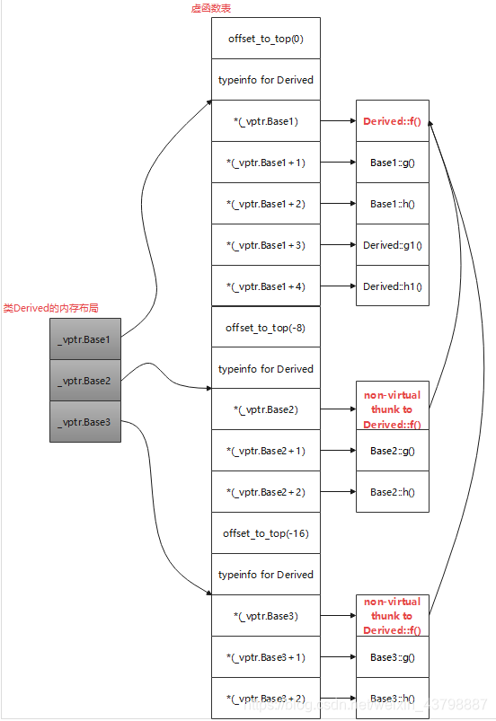
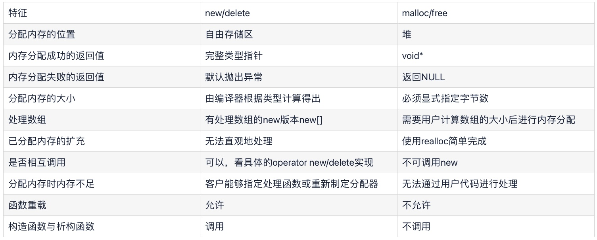

# C++

## 面向对象编程的四大特征

1. **抽象**

     抽象是将一类对象的共同特征总结出来构造类的过程，包括数据抽象和行为抽象两方面。抽象只关注对象的哪些属性和行为，并不关注这此行为的细节是什么。它的本质是一种对现实世界事物的建模。

    - 作用：隐藏具体实现，使用者只需关心功能，无需关心实现。
    - 意义：提高代码的扩展性、维护性；降低复杂度，减少细节负担。

2. **封装**

    封装就是将抽象得到的数据和行为相结合，形成一个有机的整体，也就是将数据与操作数据的源代码进行有机的结合，形成类，其中数据和函数都是类的成员。

    封装的好处：

    + 良好的封装能够减少耦合，类内部的结构的修改不影响外部代码的使用。
    + 将类的使用者和设计者分开，使用者要访问该类的代码和数据，必须通过严格的接口控制，增强了模块的安全性。
    + 将现实世界的物体抽象成为类，有利于代码重用。

3. **继承**

    类的继承指的是从已有类产生新类的过程。一般来说有如下三种继承方式：

    1. 单一继承：继承一个父类，这种继承称为单一继承，这也是我们用的做多的继承方式。
    2. 多重继承：一个派生类继承多个基类，类与类之间要用逗号隔开，类名之前要有继承权限，假使两个或两个基类都有某变量或函数，在子类中调用时需要加**类名限定符**如obj.classA::i = 1；
    3. 菱形继承：多重继承掺杂隔代继承1-n-1模式，此时需要用到虚继承，例如 B，C虚拟继承于A，D再多重继承B，C，否则会出错。

    继承的好处：

    + 提高了代码的复用性
    + 提高了代码的可维护性
    + 建立了类与类之间的关系，继承是多态的前提。

    继承的缺点

    + 在一定程度上，造成类与类之间的强关联，即所谓的高耦合，父类功能的改变对子类也会造成影响。

4. **多态**

    可以简单概括为“一个接口，多种方法”，即用的是同一个接口，但是效果各不相同，多态有两种形式的多态，一种是静态多态，一种是动态多态。

    **静态多态**。也称为编译期间的多态，编译器在编译期间完成的，编译器根据函数实参的类型(可能会进行隐式类型转换)，可推断出要调用那个函数，如果有对应的函数就调用该函数，否则出现编译错误。 静态多态有两种实现方式：1.函数重载：包括普通函数的重载和成员函数的重载。 2.函数模板的使用。

    **动态多态**。即运行时的多态，在程序执行期间(非编译期)判断所引用对象的实际类型，根据其实际类型调用相应的方法。对于相关的对象类型，确定它们之间的一个共同功能集，然后在基类中，把这些共同的功能声明为多个公共的虚函数接口。各个子类重写这些虚函数，以完成具体的功能。具体实现就是c++的虚函数。

    多态是以封装和继承为基础实现的性质 ，多态是方法的多态，不是属性的多态（多态与属性无关）。多态的存在有三个必要条件：继承，方法重写，父类引用指向子类对象。父类引用指向子类对象后，用该父类引用调用子类重写的方法，此时多态就产生了。


## 面向过程和面向对象编程的区别

面向过程就是分析出解决问题所需要的步骤，然后用函数把这些步骤一步一步实现，使用的时候一个一个依次调用就可以了。面向过程的性能比面向对象高，因为类调用时需要实例化，开销比较大，比较消耗资源;比如单片机、嵌入式开发、 Linux/Unix等一般采用面向过程开发，性能是最重要的因素。


面向对象是把构成问题事务分解成各个对象，建立对象的目的不是为了完成一个步骤，而是为了描叙某个事物在整个解决问题的步骤中的行为。面向对象易维护、易复用、易扩展，由于面向对象有封装、继承、多态性的特性，可以设计出低耦合的系统，使系统 更加灵活、更加易于维护。


## 结构体(struct)和共同体(union)的区别

结构体struct：把不同类型的数据组合成一个整体。struct里每个成员都有自己独立的地址。sizeof(struct)是内存对齐后所有成员长度的加和。（引申出内存对齐的问题）

共同体union：各成员共享一段内存空间, 一个union变量的长度等于各成员中最长的长度，以达到节省空间的目的。所谓的共享不是指把多个成员同时装入一个union变量内, 而是指该union变量可被赋予任一成员值,但每次只能赋一种值, 赋入新值则冲去旧值。 


## 内存对齐

32位系统cpu一次寻址4个字节，64位系统一次寻址8个字节

以64位系统为列：CPU一次寻址都是从地址为8的倍数的地址开始寻址，如果存储的数据都是内存对齐的，即每一个数据的首地址也都是存放在以8为倍数的地址中，那么CPU一次寻址就可以读取整个数据。

如果没有内存对齐，数据都是一个接着一个存储的。那么为了访问未对齐的数据的内存，CPU处理器一次读取的内存数据(8字节)可能包含两个数据的存储数据，而导致数据读取不完整，需要作两次内存访问；而对齐的内存访问仅需要一次访问。


如果一个变量的内存地址正好位于它长度的整数倍，他就被称做**自然对齐**。数据结构应该尽可能地在自然边界上对齐。原因在于，为了访问未对齐的内存，处理器需要作两次内存访问；而对齐的内存访问仅需要一次访问。

每个特定平台上的编译器都有自己的默认“对齐系数”（也叫对齐模数）。32位系统，gcc中默认#pragma pack(4)，可以通过预编译命令#pragma pack(n)，n = 1,2,4,8,16来改变这一系数。

**有效对齐值**：是给定值#pragma pack(n)和结构体中最长数据类型长度中较小的那个。有效对齐值也叫对齐单位。

然后明确内存对齐的两个规则：

1.结构体第一个成员的偏移量（offset）为0，以后每个成员相对于结构体首地址的 offset 都是该成员大小与有效对齐值中较小那个的整数倍，如有需要编译器会在成员之间加上填充字节。

2.结构体的总大小为 有效对齐值 的整数倍，如有需要编译器会在最末一个成员之后加上填充字节。


## C++的多态

分为静态多态和动态多态。

### 静态多态

又称为编译时多态。在编译器就能够确定函数的地址。实现方式例如函数重载、函数模版。

### 动态多态

又称为运行时多态。在运行时根据具体的对象才能确定函数的地址。实现方式是派生类重写基类的虚函数，用基类的指针引用派生类对象，调用虚函数时会调用派生类重写后的函数。

虚函数的实现原理：

1. 每个含有虚函数的类的对象都有一个虚函数表指针（虚函数表存储在只读数据段，虚函数本身和普通函数一样存储在代码段），虚函数表中存储着虚函数的地址。派生类的虚函数表中会有超类的虚函数表的副本。
2. 当创建子类对象时，编译器对虚函数表指针的初始化过程：
    1. 对象在创建时，由编译器对 vptr 进行初始化，虚函数表指针属于类对象，存储在堆或者栈上
    2. 子类的构造会先调用父类的构造函数，这个时候 vptr 会先指向父类的虚函数表
    3. 子类构造的时候，vptr 会再指向子类的虚函数表
    4. 对象的创建完成后，vptr 最终的指向才确定
3. 单继承的派生类的虚函数表的形成过程：
    1. 先拷贝基类的虚表 
    2. 如果派生类重写了基类的虚函数，则修改同位置的基类虚函数地址，指向新的函数
    3. 跟上派生类新定义的虚函数
4. 多继承的派生类的结构是，有一张虚函数表，但是是n个基类的虚函数表拼接而成，类对象中还有n个虚函数表指针，指向了虚函数表中的不同位置。此外，派生类自己的新添加的虚函数会被放在虚函数表中第一个基类的函数的后面。




纯虚函数：

纯虚函数是基类不给出默认实现的虚函数，申明了纯虚函数的类称为抽象类（注意，c++中没有abstract关键字）。抽象类无法实例化，继承抽象类的派生类要么也为抽象类，要么实现所有的纯虚函数，则可以进行实例化。

另外注意：

1. 构造函数不可以是虚函数，虚函数表和虚函数表指针的建立在构造函数之后。另外，我们也没有需求让构造函数成为虚函数，因为我们在创建对象时调用的是派生类的构造方法，构造好之后才用基类指针去引用。
2. 析构函数建议申明为虚函数，实际上是必须为虚函数。如果对象是在栈上，那么对象会随着函数栈的销毁而释放，但是如果在堆上，释放一个基类指针时，如果析构函数不是虚函数，那么就不会调用派生类的析构函数，从而导致派生类的成员无法被释放，造成内存泄漏。


## const 和 constexpr的区别

const表示只读常量。在c11以前，const有双重语义，一方面表示只读，一方面如果用常量表达式来初始化const变量，那么编译器会认为该变量是常量。所以，对于用常量表达式初始化的const变量，可以用来初始化数组长度等，因为它的值在编译期就可以确定，而且不会改变。

在c11后，引入了constexpr，将const的双重语义分离，const只保留只读的含义，而constexpr表示常量的含义。


## C++11的新特性

### 变量和基本类型

1. long long 长整数
2. nullptr 空指针常量
3. 列表初始化。用花括号来初始化变量得到了全面应用，这种初始化的形式被成为**列表初始化**。无论是类的变量，数组，stl的容器，类的构造，都统一使用{}，以后只要是初始化就首先考虑{}的初始化就OK了。
4. constexpr 编译器常量
5. using 起别名。 using可以用于定义模板别名，而typedef不能。
6. auto和decltype。auto通过变量的初始值来推断变量的类型，所以会计算出变量的初始值。auto会忽略掉顶层const, 保留底层const. 而decltype 从表达式的类型推断出要定义的变量的类型，不进行计算。不论是顶层const还是底层const, decltype都会保留。另外，如果decltype内的表达式被括号包裹，那么会返回引用类型。

### 字符串、向量和数组

1. 范围for语句
2. vector对象的vector，两个尖括号之间可以不加空格了
3. 容器的cbegin和cend函数，返回const迭代器

### 函数和表达式

1. return {} 这个用法的含义是返回一个用列表初始化构造的函数返回值的类型对象。例如

```c++
vector<int> twoSum(vector<int>& nums, int target) {
	return {1, 2, 3};    //直接构造好vector<int>并将这个对象返回
}
```

2. 非成员版本的swap函数。

3. lambda表达式。**[capture] (parameters) -> return value { body }**,只有 [capture] 捕获列表和 { body } 函数体是必选的，其他可选。lambda表达式的捕捉列表：

    [] 不捕获任何变量,这种情况下lambda表达式内部不能访问外部的变量。
    [&] 以引用方式捕获所有变量
    [=] 用值的方式捕获所有变量（可能被编译器优化为const &)
    [=, &foo] 以引用捕获变量foo, 但其余变量都靠值捕获
    [&, foo] 以值捕获foo, 但其余变量都靠引用捕获
    [bar] 以值方式捕获bar; 不捕获其它变量
    [this] 捕获所在类的this指针 （Qt中使用很多，如此lambda可以通过this访问界面控件的数据）

4. 右值引用。分为纯右值引用和消亡值引用。

    1. 纯右值例如除了字符串以外的字面量，nullptr，true，false等。
    2. 消亡值是一些临时对象。


### 类

1. 委托构造函数。在c++11以前，构造函数不能调用另一个构造函数，因为它实际上是会创建一个新的匿名对象进行初始化，而不是初始化当前对象。c++11提出了委托构造函数机制，使用方法类似类的成员变量初始化。但是要注意，使用了委托构造函数后，就不能再使用成员变量初始化。
1. final 关键字。作用于函数则不能被重写，作用于类则不能被继承。
1. override，显式地声明对基类虚函数的重写。


### 标准库

1. C++的map,multimap,set,multiset使用红黑树实现，插入和查询都是O(logn)的复杂度；但C++11为四种unordered模板类提供底层哈希实现以达到O(1)的复杂度：
    1. unordered_set

    1. unordered_multiset

    1. unordered_map

    1. unordered_multimap


2. 正式引入了对多线程的支持，包含在thread头文件。

    1. mutex

    2. recursive_mutex

    3. timed_mutex

    4. timed_recuresive_mutex

    5. condition_variable

    6. lock_guard<Mutex>，只支持自动的加锁和释放

    7. unique_lock<Mutex>，支持自动手动加锁和释放

    8. c++17引入了 shared_mutex，支持互斥锁和共享锁，通常使用unique_lock进行互斥锁，使用shared_lock进行共享锁。

        shared_lock是read lock。搭配std::shared_mutex使用，被锁后仍允许其他线程执行同样被shared_lock的代码。lock_guard和unique_lock是write lock。被锁后不允许其他线程执行被shared_lock或unique_lock的代码。

3. RAII思想实现的智能指针。


## RAII

RAll (Resource Acquisition ls Initialization）是由c++之父Bjarne Stroustrup提出的，中文翻译为资源获取即初始化，使用局部对象来管理资源的技术称为资源获取即初始化；这里的资源主要是指操作系统中有限的东西如内存(heap)、网络套接字，互斥量，文件句柄等等，局部对象是指存储在栈的对象，它的生命周期是由操作系统来管理的，无需人工介入。

RAII方式使用资源的过程：

1. 创建对象的同时获取并初始化资源
2. 使用资源
3. 析构对象的同时销毁资源

由于在栈上的对象会自动析构，所以可以自动释放资源。

举例，lock_guard和unique_lock都是RAII风格的互斥锁，智能指针。


## 智能指针

智能指针本质是一个封装了一个原始C++指针的类模板，为了确保动态内存的安全性而产生的。实现原理的核心思想就是RAII，通过创建一个对象存储需要的资源，然后依靠对象的析构函数来释放资源。只不过，智能指针还有引用计数功能，使得包装类的析构函数可以正确的释放资源。

智能指针是封装原始指针的类，用于解决悬空(dangling)指针或多次删除被指向对象，以及资源泄露问题，通常用来确保指针的寿命和其指向对象的寿命一致。

原始指针的缺点有：

1. 需要**手动管理内存**
2. 容易发生**内存泄露**（忘记释放、出现异常等）
3. 释放之后**产生野指针**

C++11提供了四种智能指针：auto_ptr(C++17已移除)； unique_ptr； shared_ptr;  weak_ptr；

因为 auto_ptr 已经在 C++ 17 中移除，这里不再研究该类型。又因为weak_ptr是shared_ptr的弱引用，所以，主要的智能指针分为两个unique_ptr和shared_ptr。

### unique_ptr

std::unique_ptr 是通过指针占有并管理另一对象，并在 unique_ptr 离开作用域时释放该对象的智能指针。在下列两者之一发生时用关联的删除器释放对象：

+ 销毁了管理的 unique_ptr 对象
+ 通过 operator= 或 reset() 赋值另一指针给管理的 unique_ptr 对象。
  

可以使用构造函数或make_unique来构造unique_ptr。

unique_ptr不允许被复制，但是可以通过函数返回给其他的unique_ptr，还可以通过std::move（）转移给其他的unique_ptr。还是一个unique_ptr独占一个地址。unique_ptr满足可移动构造 (MoveConstructible) 和可移动赋值 (MoveAssignable) 的要求，但不满足可复制构造 (CopyConstructible) 或可复制赋值 (CopyAssignable) 的要求。 因此不可以使用 = 操作和拷贝构造函数，仅能使用移动操作。


### shared_ptr

std::shared_ptr 是通过指针保持对象共享所有权的智能指针。多个 shared_ptr 对象可占有同一对象。下列情况之一出现时销毁对象并解分配其内存：

+ 最后剩下的占有对象的 shared_ptr 被销毁；
+ 最后剩下的占有对象的 shared_ptr 被通过 operator= 或 reset() 赋值为另一指针。
  

有两种方式创建 shared_ptr。一种是调用构造函数，将已经创建的指针作为初始化参数。另一种是使用make_shared宏来加速创建的过程。make_shared会负责创建目标对象。

```c++
void main( )
{
 shared_ptr<int> sptr1( new int );
 shared_ptr<int> sptr2 = make_shared<int>(100);
}
```

也可以使用拷贝的方式初始化共享智能指针，这两个对象会同时管理同一块内存，堆内存对应的引用计数也会增加。

如果使用移动构造的方式初始化智能指针对象，只是转让了内存的所有权，管理内存的对象不会增加，因此内存引用技术不会增加。

shared_ptr默认调用delete释放关联的资源。如果用户采用一个不一样的析构策略时，他可以自由指定构造这个shared_ptr的策略。例如一个lamda表达式，来指定一个通用的释放步骤。

```c++
void main( )
{
 shared_ptr<Test> sptr1( new Test[5],
        [ ](Test* p) { delete[ ] p; } );
}
```


### weak_ptr

weak_ptr的引入是为了解决shared_ptr的循环引用问题。在shared_ptr的使用过程中，当强引用计数为0是，就会释放所指向的堆内存。那么问题来了，如果和死锁一样，当两个shared_ptr互相引用，那么它们就永远无法被释放了。

weak_ptr 的出现就是**为了解决shared_ptr的循环引用的问题的**。例如，**将两个循环引用的类中的一个成员变量改为weak_ptr对象**.

一个强引用当被引用的对象活着的话，这个引用也存在（就是说，当至少有一个强引用，那么这个对象就不能被释放）。share_ptr就是强引用。相对而言，弱引用当引用的对象活着的时候不一定存在。仅仅是当它存在的时候的一个引用。弱引用并不修改该对象的引用计数，这意味这弱引用它并不对对象的内存进行管理，在功能上类似于普通指针，然而一个比较大的区别是，弱引用能检测到所管理的对象是否已经被释放，从而避免访问非法内存。

弱引用智能指针 std::weak_ptr 可以看做是 shared_ptr 的助手，它不管理 shared_ptr 内部的指针。std::weak_ptr 没有重载操作符 * 和->，因为它不共享指针，不能操作资源，所以它的构造不会增加引用计数，析构也不会减少引用计数，它的主要作用就是作为一个旁观者监视 shared_ptr 中管理的资源是否存在。

通过调用 std::weak_ptr 类提供的 use_count() 方法可以获得当前所观测资源的引用计数。

通过调用 std::weak_ptr 类提供的 expired() 方法来判断观测的资源是否已经被释放。

通过调用 std::weak_ptr 类提供的 lock() 方法来获取管理所监测资源的 shared_ptr 对象。

通过调用 std::weak_ptr 类提供的 reset() 方法来清空对象，使其不监测任何资源。


## 匿名函数的本质是什么？他的优点是什么？
匿名函数本质上是一个仿函数，编译器会生成一个重载了()运算符的匿名对象，使得该对象可以像函数一样被调用。

优点：使用匿名函数，可以免去函数的声明和定义。这样匿名函数仅在调用函数的时候才会创建函数对象，而调用结束后立即释放，所以匿名函数比非匿名函数更节省空间。


## 为什么C++11引入了右值引用

主要有两个作用：

1. 支持移动语义。通过右值引用，可以引用临时变量等一些消亡值，代替复制构造函数的大规模拷贝操作，直接讲消亡值内部的资源指针和目标交换，实现移动大对象。
2. 支持完美转发。在函数模板中，可以将 自己的参数“完美”地转发给其它函数。所谓完美，即 不仅能准确地转发参数的值，还能保证被转发参数的左、右值属性不变。 C++11标准引入了右值引用和移动语义，所以，能否实现完美转发，决定了该参数在传递过程使用的是拷贝语义(调用拷贝构造函数)还是移动语义 (调用移动构造函数)。如果模板中 (包括类模板和函数模板)函数的参数书写成为T&& 参数名 那么，函数既可以接受左值引用，又可以接受右值引用。 提供了模板函数std::forward<T>(参数)，用于转发参数如果参数是一个右值，转发之后仍是右值引用;如果 参数是一个左值，转发之后仍是左值引用。


## 左值引用和指针的区别？

**是否初始化**：指针可以不用初始化，引用必须初始化

**性质不同**：指针是一个变量，引用是对被引用的对象取一个别名

**占用内存单元不同**：指针有自己的空间地址，引用和被引用对象占同一个空间。


## malloc的内存分配的方式，有什么缺点？
malloc并不是系统调用，而是C库中的函数，用于动态内存分配，在使用malloc分配内存的时候会有两种方式向操作系统申请堆内存

方式1：当用户分配的内存小于128KB时通过brk()系统调用从堆分配内存，实现方式：将堆顶指针向高地址移动，获取内存空间，如果使用free释放空间，并不会将内存归还给操作系统，而是会缓存在malloc的内存池中，待下次使用

方式2：当用户分配的内存大于128KB时通过mmap()系统调用在文件映射区域分配内存，实现方式为：使用私有匿名映射的方式，在文件映射区分配一块内存，也就是从文件映射区拿了一块内存，free释放内存的时候，会把内存归还给操作系统，内存得到真正释放

缺点：容易造成内存泄漏和过多的内存碎片，影响系统正常运行，还得注意判断内存是否分配成功，而且内存释放后（使用free函数之后指针变量p本身保存的地址并没有改变），需要将p的赋值为NULL拴住野指针。


## 为什么不全部使用mmap来分配内存？
因为向操作系统申请内存的时候，是要通过系统调用的，执行系统调用要进入内核态，然后再回到用户态，状态的切换会耗费不少时间，所以申请内存的操作应该避免频繁的系统调用，如果都使用mmap来分配内存，等于每次都要执行系统调用。另外，因为mmap分配的内存每次释放的时候都会归还给操作系统，于是每次mmap分配的虚拟地址都是缺页状态，然后在第一次访问该虚拟地址的时候就会触发缺页中断。

也就是说，**频繁通过 mmap 分配的内存话，不仅每次都会发生运行态的切换，还会发生缺页中断（在第一次访问虚拟地址后），这样会导致 CPU 消耗较大**。

## 为什么不全部都用brk

如果全部使用brk申请内存那么随着程序频繁的调用malloc和free，尤其是小块内存，堆内将产生越来越多的不可用的内存碎片。


## free() 函数只传入一个内存地址，为什么能知道要释放多大的内存？

malloc 返回给用户态的内存起始地址比进程的堆空间起始地址多了 16 字节，这个多出来的 16 字节就是保存了该内存块的描述信息，比如有该内存块的大小。


## define和const的区别是什么？
编译阶段：define是在编译预处理阶段进行简单的文本替换，const是在编译阶段确定其值

安全性：define定义的宏常量没有数据类型，只是进行简单的替换，不会进行类型安全检查；const定义的常量是有类型的，是要进行类型判断的

内存占用：define定义的宏常量，在程序中使用多少次就会进行多少次替换，内存中有多个备份，占用的是代码段的内存；const定义常量占用静态存储区域的空间，程序运行过程中只有一份


## 程序运行的步骤是什么
预编译：将头文件编译，进行宏替换，输出.i文件

编译：将其转化为汇编语言文件，主要做词法分析，语义分析以及检查错误，检查无误后将代码翻译成汇编语言，生成.s文件

汇编：汇编器将汇编语言文件翻译成机器语言，生成.o文件

链接：将目标文件和库链接到一起，生成可执行文件.exe

加载：操作系统将可执行文件加载到内存中，准备执行。

运行：程序开始执行。控制流按照程序的逻辑执行指令，操作系统调度进程执行，程序可能与用户交互，处理输入和输出等。


## struct和class有什么区别

struct的默认继承方式和访问权限是public，而class默认是private。c++保留struct是为了和c兼容。


## 类的生命周期
类从被加载到内存中开始，到卸载出内存为止，它的整个生命周期包括：加载、验证、准备、解析、初始化、使用和卸载七个阶段。其中验证，准备，解析三个部分统称为连接

全局对象在main开始前被创建，main退出后被销毁。

静态对象在第一次进行作用域时被创建，在main退出后被销毁。

局部对象在进入作用域时被创建，在退出作用域时被销毁。

New创建的对象直到内存被释放的时候都存在。


## ++i是左值还是右值，++i和i++哪个效率更高？

1. **`++i` 和 `i++` 是左值还是右值？**
    - `++i` 是左值，因为它表示一个具体的变量，可以出现在赋值语句的左边。
    - `i++` 是右值，因为这需要生成一个临时变量用于返回，i的值已经被递增。
2. **`++i` 和 `i++` 哪个效率更高？**
    - 在大多数情况下，`++i` 的效率更高。这是因为 `++i` 执行递增操作并返回递增后的值，而 `i++` 需要返回递增之前的值，因此需要使用一个临时变量保存原始值。编译器优化可能会减轻这种差异，但通常建议在没有特殊需求时使用 `++i`。

​          

## 全局变量和静态变量的初始化总结

### 1 全局变量

static initialization:

静态初始化，是针对于那些简单的、c++内部定义的数据结构，如int，double，bool及数组结构的初始化，又可分为zero和const两种方式。对于zero初始化，也就是我们没指定初值，编译器分配0值给它，编译时编译器将其分配在.bss段，不占用rom空间；而const初始化，也就是我们指定了初值，编译器将其分配在.data段，占用rom空间。

dynamic initialization:

这种初始化针对的是需要调用构造函数才能完成的初始化。这种初始化会在main函数执行前，在运行时由运行时库调用相应的代码进行初始化。

另外，静态初始化**先于**动态初始化。因为静态初始化发生在编译时期，直接写进.bss段和.data段，在程序执行时直接加载；而动态初始化则是在运行时期，由运行时库调用相应构造函数进行初始化，同样要写进.bss段或.data段。

### 2.静态变量

全局静态变量和类的静态成员变量也分为静态初始化和动态初始化，与全局变量规则相同。而对于局部静态变量，它的动态初始化不是在main函数前，而是在程序执行到相应的初始化语句才开始初始化的。

另外关于静态成员的初始化位置：

类的静态成员必须在类外部进行初始化，这是因为静态成员是属于类的，整个程序中应该只有一份。如果在类内部进行初始化，那么每次创建对象都要定义一个变量，是不合理的。因此，通常在类的cpp文件中进行初始化，从而保证只初始化一遍。

另外注意，const类型的静态成员可以在类内进行初始化，这是编译器优化的结果。编译器对const static类型的成员变量会当作编译期常量，在使用到该变量的地方进行替换，而不会给它分配内存，类似define宏定义。

对于类的非静态成员变量可以在类内进行初始化，但是在构造函数执行时进行初始化的，且构造函数会覆盖类内的初始化。


## shared_ptr线程安全吗？

智能指针中的引用计数是线程安全的，但是智能指针所指向的对象的线程安全问题，智能指针没有做任何保障线程不安全。也就是说它所管理的资源可以线程安全的释放，只保证线程安全的管理资源的生命期，不保证其资源可以线程安全地被访问。


## move底层是怎么实现的？
Move的功能是将一个左值引用强制转化为右值引用，继而可以通过右值引用使用该值，以用于移动语义，从实现原理上讲基本等同一个强制类型转换。

```c++
template <typename T>
typename remove_reference<T>::type&& move(T&& t)
{
    return static_case<typename remove_reference<T>::type&&>(t);
}
```

可以看到，move是一个模版函数，它的参数是一个万能引用，在内部先使用remove_reference模版类将参数的引用去掉，获得原本类型，然后再通过强制类型转换将左值引用转换为右值引用。

优点：可以将左值变成右值而避免拷贝构造，将对象的状态所有权从一个对象转移到另一个对象，只是转移，没有内存搬迁或者内存拷贝。


## 完美转发的原理是什么？
完美转发是指函数模板可以将自己的参数完美的转发给内部调用的其他函数，完美是指不仅能够准确的转发参数的值，还能保证被转发参数的左、右值属性不变。虽然可以使用万能参数接收右值引用，但是在函数内转发时，由于该变量是有名变量，传递时自身还是左值引用，所以需要使用forward函数的返回值作为右值引用进行转发。forward函数进行类型转换，将传递进来的左值以左值传递出来，将传递进来的右值以右值的方式传出。

引用折叠就是说当多个引用嵌套的时候，如果有一个左值引用，则结果为左值引用，如果全部为右值引用，则结果为右值引用。


## 空类默认有哪些函数？

空类在C++中指的是没有任何成员变量、成员函数的类。即使是空类，它也默认拥有以下几个函数：

1. 默认构造函数（也称为无参构造函数）
2. 拷贝构造函数
3. 移动构造函数
4. 拷贝赋值运算符(取址运算符)
5. 移动赋值运算符(const 取址运算符)
6. 析构函数


## explicit用在哪里？有什么作用？

`explicit` 是 C++ 中的一个关键字，通常用于声明构造函数，防止隐式类型转换。它可以用在类的构造函数声明前，用于标识只接受显式调用的构造函数。`explicit` 关键字的作用是禁止编译器使用隐式类型转换将参数类型转换为类类型。


## new和malloc有什么区别




## 自由存储区和堆有什么区别

表面上似乎明显的区别在于：malloc在堆上分配的内存块，使用free释放内存，而new所申请的内存则是在自由存储区上，使用delete来释放。但是，二者又有密切的联系：

1. 一方面，很多new都是用malloc来实现的，这种情况下，堆就是自由存储区的一部分。
2. 另一方面，c++允许运算符重载，所以程序员可以重载new运算符，改用其他内存实现自由存储区，例如全局变量做的对象池，那么此时全局变量位于的静态存储区就是自由存储区的一部分了。


## 迭代器和指针的区别

迭代器不是指针，是一个模板类，通过重载了指针的一些操作符模拟了指针的一些功能，迭代器返回的是对象引用而不是对象的值。

指针能够指向函数而迭代器不行迭代器只能指向容器的元素。


## vector的push_back和emplace_back有什么区别

|                              | push_back        | emplace_back     |
| :--------------------------: | :--------------- | ---------------- |
|       是否支持右值引用       | 支持             | 支持             |
|    是否一定会发生拷贝构造    | 一定             | 不一定           |
| 是够支持直接传入多个构造参数 | 支持一个构造参数 | 支持多个构造参数 |
|       是够支持原地构造       | 不支持           | 支持             |

本质上，push_back和empace_back都支持复制构造和移动构造，所以如果我们要把一个已经创建好的对象添加到vector末尾，那么使用二者都可以，他们都会根据传入的是左值引用还是右值引用而选择拷贝构造函数或移动构造函数。

不同点在于，push_back只支持元素类型的参数，而emplace_back可以传入元素的构造器所需要的参数，emplace_back内部可以原地调用构造函数进行构造。这得益于c++11引入的右值引用和完美转发。

另外，由于存在隐式类型转换，所以push_back如果传入一个单参数构造函数的参数，编译器可以调用对应的构造函数将这个参数转换为对象。当然，如果单参数构造函数被申明为explicit则不可以进行隐式类型转换。


## vector扩容，resize和reserve的区别

首先，容器有size和capacity两个成员变量。size指的是容器含有的元素个数，capacity指的是容器的内存空间最多能够存储的元素个数。

因此，resize修改的是size，resize可能会销毁多余的元素，也可能会使用默认构造函数构造新的元素。当然，如果resize的目标值大于当前capacity，则会引起内存的重新分配。

reserve是预留，所以它修改的是capacity，但reserve的原则是只增不减，如果capacity已经足够大，那么reserve就直接返回。


## vector扩容为了避免重复扩容做了哪些机制？

当vector内存不够时本身内存会以1.5或者2倍的增长，以减少扩容次数。

1.5倍扩容对内存复用有优势，因为多次扩容后，前面释放的内存可能足够下一次分配。但是2倍扩容的条件下，之前释放的内存总和永远不能达到下一次扩容的需要。


## 哈希碰撞的处理方法
开放定址法：当遇到哈希冲突时，去寻找一个新的空闲的哈希地址。

再哈希法：同时构造多个哈希函数，等发生哈希冲突时就使用其他哈希函数知道不发生冲突为止，虽然不易发生聚集，但是增加了计算时间

链地址法：将所有的哈希地址相同的记录都链接在同一链表中

建立公共溢出区：将哈希表分为基本表和溢出表，将发生冲突的都存放在溢出表中


## unordered_map的扩容过程
当unordered_map中的元素数量达到桶的负载因子（0.75）时，会重新分配桶的数量（通常会按照原有桶的数量*2的方式进行扩容，但是具体的增长策略也可以通过修改容器中的max_load_factor成员变量来进行调整），并将所有的元素重新哈希到新的桶中。

负载因子 = 总键值对 / 桶数


## 构造函数是否能声明为虚函数？为什么？

构造函数不能为虚函数，虚函数的调用是通过虚函数表来查找的，而虚函数表由类的实例化对象的vptr指针指向，该指针存放在对象的内部空间之中，需要调用构造函数完成初始化，所以只有构造函数完成后，对象才可以调用虚函数表中的函数。构造函数自身自然不能是虚函数。


## 类中static函数是否能声明为虚函数？

不能。

从语义上来讲，static函数是属于类的，本来就是不可继承重写的，而虚函数的目的是实现多态，需要子类重写父类的虚函数，这与static的理念是冲突的。

从实现上来讲，调用虚函数需要通过this指针，找到对象的虚函数表指针，再找到虚函数表中虚函数的地址，实现调用。但是static函数是没有this指针的，所以虚函数表中不可能放static函数。


## 哪些函数不能被声明为虚函数？

1. 构造函数
2. 内联函数（内联函数有实体，在编译时展开，没有this指针）
3. 静态成员函数
4. 友元函数（C++不支持友元函数的继承，不能继承的函数指定不是虚函数）
5. 非类成员函数


## 什么是虚继承和虚基类

虚继承的引入是为了解决在多继承场景下的菱形继承问题。如果不引入该机制，在派生类中，就会存在多个间接基类，出现名称冲突、数据冗余等问题。

虚继承的目的是让某个类做出声明，承诺愿意共享它的基类。其中，这个被共享的基类就称为虚基类（Virtual Base Class）。在这种机制下，不论虚基类在继承体系中出现了多少次，在派生类中都只包含一份虚基类的成员。

虚继承的实现方式是，虚基类对象不存储在派生类中，而是存储在一个虚表中，并且给派生类一个虚表指针。当派生类要访问虚基类的成员变量时，就通过虚表去访问。这样一来，如果多个基类继承了同一个虚基类，那么派生类中将只有一份虚基类。


## 动态链接和静态链接的区别，动态链接的原理是什么？
区别：他们的最大区别就是在于链接的时机不同，静态链接是在形成可执行程序前，而动态链接的进行则是程序执行时。

静态库：就是将库中的代码包含到自己的程序之中，每个程序链接静态库后，都会包含一份独立的代码，当程序运行起来时，所有这些重复的代码都需要占用独立的存储空间，显然很浪费计算机资源。

动态库：不会将代码直接复制到自己程序中，只会留下调用接口，程序运行时再去将动态库加载到内存中，所有程序只会共享这一份动态库，因此动态库也被称为共享库。由于动态共享库会被映射到多个进程的虚拟地址空间，所以必须使用地址无关代码技术。

动态链接原理：是把程序按照模块拆分成各个相对独立部分，在程序运行时才将它们链接在一起形成一个完整的程序，而不是像静态链接一样把所有程序模块都链接成一个单独的可执行文件


## C++中怎么编译C语言代码？

使用extern“C”让C++代码按照C语言的方式去编译。例如在c++中调用ffmpeg的api。


## 设计一个类，使其只能在堆上创建

- 将类的构造函数私有，拷贝构造声明成私有。防止别人调用拷贝在栈上生成对象。
- 提供一个静态的成员函数，在该静态成员函数中完成堆对象的创建


## 设计一个类，使其只能在栈上创建

- 将类的构造函数私有。防止在堆上创建对象
- 提供一个静态的成员函数，在该静态成员函数中完成栈对象的创建


## 说一下内联函数及其优缺点

内联函数是在编译期将函数体内嵌到程序之中，以此来节省函数调用的开销。

**优点：**是节省了函数调用的开销，让程序运行更加快速。

**缺点：**是如果函数体过长，频繁使用内联函数会导致代码编译膨胀问题。不能递归执行


## 详细说一说fcntl的作用
作用：用于控制打开的文件描述符的一些属性和行为。

有五个功能：

1.复制一个现有的描述符(cmd=F_DUPFD)

2.获得/设置文件描述符标记（cmd=F_GETFD或F_SETFD）

3.获取/设置文件状态标记（cmd=F_GETFL或F_SETFL）

4.获取设置异步IO所有权（cmd=F_GETOWN或F_SETFL）

5.获取设置记录锁（cmd=F_GETLK或F_SET）


## 讲一讲迭代器失效及其解决方法
### 序列式容器迭代器失效

当当前元素的迭代器被删除后，后面所有元素的迭代器都会失效，他们都是一块连续存储的空间，所以当使用erase函数操作时，其后的每一个元素都会向前移动一个位置，此时可以使用erase函数操作可以返回下一个有效的迭代器。

### Vector迭代器失效问题总结

1.当执行了erase方法时，指向删除节点的迭代器全部失效，指向删除节点之后的全部迭代器也失效。

2.当进行push_back方法时，end操作返回的迭代器肯定失效。

3.当插入一个元素后，capacity返回值与没有插入元素之前相比有改变，则需要重新加载整个容器，此时first和end操作返回的迭代器失效。

4.当插入一个元素后，如果空间未重新分配，指向插入位置之前的元素的迭代器依然有效，但指向插入元素之后元素的迭代器全部失效。

### Deque迭代器失效总结

1.对于deque，插入到除首尾位置之外的任何位置都会导致迭代器、指针和引用都会失效，如果在首尾位置添加元素，迭代器会失效，但是指针和引用不会失效。

2.如果在首尾之外的任何位置删除元素，那么指向被删除元素外其他元素的迭代器都会失效。3.如果在其首部和尾部删除元素则只会使指向被删除元素的迭代器失效。

### 关联型容器迭代器失效

删除当前的迭代器，仅仅会使当前的迭代器失效，只要erase时，递增当前迭代器即可。


## 什么是函数调用约定？

函数调用约定就是对函数调用的一个约束和规定，描述了函数参数是怎么传递和由谁清除堆栈的。它决定了，函数参数传递的方式（是否采用寄存器传递参数，采用哪个寄存器传递参数，参数压栈的顺序等），函数调用结束后栈指针由谁恢复（被调用的函数恢复还是调用者恢复），函数修饰名的产生方法。

__stdcall：是standardcall的缩写，是C++的标准调用方式，规则如下：所有参数从右到左依次入栈，如果是调用类成员的话，最后一个入栈的是this指针。被调用函数自动清理堆栈，返回值在EAX。函数修饰名约定：VC将函数编译后会在函数名前面加上下划线前缀，在函数名后加上“@”和参数的字节数。

__cdecl：是C DECLaration的缩写（declaration，声明），表示C语言的默认函数调用方法，规定如下：所有参数从右往左依次入栈，所有参数由调用者清除，称为手动清栈。返回值在EAX中。函数修饰名约定：VC将函数编译后会在函数名前面加上下划线前缀，由于由调用者清理栈，所以允许可变参数函数存在。

__fastcall：是快速调用约定，通过寄存器来传送参数，规则如下：用ECX和EDX传送前两个双字（DWORD）或更小的参数，剩下的参数仍然自右向左压栈传送。被调用函数在返回前清理传送参数的内存栈，返回值在EAX中。函数修饰名约定：VC将函数编译后会在函数名前面加上“@”前缀，在函数名后加上“@”和参数的字节数。

\__thiscall：是唯一一个不能明确指明的函数修饰符，thiscall只能用于处理C++类成员函数的调用，同时thiscall也是C++成员函数缺省的调用约定，由于成员函数调用还有一个this指针，因此必须特殊处理，规定如下：采用栈传递参数，参数从右向左入栈，如果参数个数确定，this指针通过TCX传递给被调用者，如果参数个数不确定，this指针在所有参数压栈后被压入堆栈。对参数个数不确定的，调用者清理堆栈，否则由被调函数清理堆栈，__thiscal不是关键字，程序员不能使用l

\__pascal：与__stdcall一样，在VC中已经被废弃


## 使用条件变量的时候需要注意什么？
当signal先于wait时，该信号会丢失，不会被后续的wait捕获。

因此，在生产者消费者模型中，应该先释放互斥锁，再发送唤醒信号。

只是这样的话，信号还是可以丢失。假设线程A获取了锁，然后发现条件变量不满足，于是它释放锁，在A进入睡眠前，如果线程B发出唤醒信号，则该信号会丢失。不过好在c++的variable_condition的wait方法中，释放锁和进入睡眠是原子操作，因此中间不会插入其他线程的行为。


## Linux中的信号有哪些？

SIGINT：终端终端符，默认动作：终止。可以被捕获。当用户按中断键（Ctrl+C）时，终端驱动程序产生此信号并发送至前台进程组中的每一个进程，当一个进程在运行时失控，特别是在终端输出大量信息时，常用此信号终止它。

SIGQUIT：终端退出符，默认动作：终止+core。当用户在终端按退出键（Ctrl+\）时，终端驱动程序产生此信号，并发送给前台进程中所有进程，此信号不仅终止前台进程组，同时产生一个core文件。

SIGILL：非法硬件指令，默认动作：终止+core。此信号表示进程已执行一条非法硬件指令

SIGRAP：硬件故障，终止+core。指示一个实现定义的硬件故障

SIGBUG：硬件故障，终止+core。指示一个实现定义的硬件故障，当出现某些类型的内存故障时，常产生此信号。

SIGKILL：强制终止，不能被捕获，它向系统管理员提供一个可以杀死任一进程的可靠方法

SIGTERM：请求终止，但是该信号可以被捕获

SIGSTOP：暂停。不能被捕获。

SIGCONT：继续。不能被捕获。


## 什么是尾递归？
尾递归时递归的一种特殊情形，尾递归时一种特殊的尾调用，即在尾部直接调用自身的递归函数。核心思想是边调用便产生结果。

原理：当编译器检测到一个函数调用是尾递归的时候，它会覆盖当前的活动记录而不是在栈中创建一个新的。编译器可以做到这一点，因为递归调用是当前活跃期内最后一条待执行的语句，于是当这个调用返回时栈帧中并没有其他事情可以做，因此也就没有保存栈帧的必要了，通过覆盖当前的栈帧而不是在其之上重新添加一个，这样所使用的栈空间就大大缩减了，这使得实际的运行效率会变得更高。

特点：在尾部调用的是函数自身，可通过优化使得计算仅占用常量栈空间。


## 函数调用进行的操作：
函数调用分为以下几步：

1. 参数入栈，将参数按照函数调用约定依次压入栈中
2. 返回地址入栈，将当前指令的下一条指令的地址入栈，供函数返回使用
3. 进入被调函数，根据函数名找到函数入口，跳转
4. 开辟新的栈帧：
    1. ebp压栈，push ebp
    2. 将esp的值赋给ebp, move ebp esp
    3. 给新栈帧分配空间


函数返回分为以下几步：

1. 将返回值保存到eax寄存器
2. 恢复并回收栈帧空间
3. 将栈底恢复到ebp位置
4. ebp出栈，即恢复ebp位置 
   


## make_shared有什么优势

性能优化。std::make_shared 在性能上通常比直接使用 new 创建 std::shared_ptr 更好。这是因为 std::make_shared 会一次性分配用于存储对象和控制块（包含引用计数等信息）的内存，而使用new创建要创建智能指针本身和共享控制块。


## 初始化和const引用

**引用的类型必须与其所引用对象的类型一致**。我们来看如果将一个引用绑定到另外一种类型上时会发生什么。

```c++
double dval = 3.14;
int &val = dval; // 错误
```

实际上，为了确保val绑定到一个int型变量上，编译器将把上述代码转换成如下形式：

```c++
int temp = dval;
int &val = temp;
```

这样一来，val其实绑定到了一个临时对象。那么我们就不能通过val改变dval，这与引用的含义相违背。因此，C++将这种行为归为非法。

### 一个特例

通过上面的例子，可以引出一个特例。那就是，**在初始化常量引用时，允许使用任意表达式，只要结果能够转换为引用类型**。

还是上面的例子，如果我们的val是一个常量引用，那我们就不会通过val来改变dval的值，因此可以允许将val绑定到临时对象。

```c++
double dval = 3.14;
const int &val = dval;
```

这虽然可行，但是val绑定到了编译器生成的临时变量上，如果我们修改了dval，则val的值是不会改变的。

而如果dval是int类型的值，val就会绑定到dval上，虽然我们不能通过val来改变dval，但如果dval改变， val也会随之而变。


## constexpr和常量表达式

首先，常量表达式是指在编译器就能确定的值。

constexpr是c++11引入的用于修饰常量表达式的关键字。在这之前，我们使用const来修饰常量，但使用const修饰的变量并不一定是常量表达式。**在constexpr出现以前，一个表达式是否为常量表达式是由它的数据类型和初始值共同决定的**。

```c++
const int max_files = 20; // max_files 是常量表达式
const int limit = max_files + 1; // limit 是常量表达式
int staff_size = 27; // staff_size 不是常量表达式，虽然它的值是字面量，但没有const修饰
const int sz = get_size(); // sz 不是常量表达式，它的值需要运行时才能确定
```

C++11 规定，允许将变量声明为 constexpr 类型以便由编译器来验证变量的值是否是一个常量表达式。声明为 constexpr 的变量一定是一个常量，而且必须用常量表达式初始化：

```c++
constexpr int mf = 20; //20是常量表达式
constexpr int limit = mf + 1; // mf+1是常量表达式
constexpr int sz = size(); //只有当 size是一个 constexpr 函数时才是一条正确的声明语句
```

另外，**constexpr将它所定义的对象置为了顶层const**。所以，下面的两个指针的含义不同：

```c++
const int *p = nullptr; //p是一个指向整型常量的指针
constexpr int *q = nullptr; //q是一个指向整数的指针常量
```

最后要注意，**尽管指针和引用都能定义成 constexpr，但它们的初始值却受到严格限制。一个constexpr指针的初始值必须是nullptr或者0,或者是存储于某个固定地址中的对象。**这是因为constexpr只能初始化，不能赋值，所以constexpr指针所指向的地方必须是在编译期就存在的。


## typedef，using，define的区别

typedef和using是关键字，用于取别名，#define 是预处理指令。

typedef和using在编译阶段处理，具有类型检查功能，而define是在预处理阶段进行文本替换。

using用于类型别名是C++11引入的，比typedef更直观。using用于声明语句的格式与普通声明语句很相似，都是  “数据类型 声明符（别名） = 初始值（原名）”。

要注意，typedef和using指定的别名是在编译阶段处理的，而不是简单的文本替换，因此如果某个类型别名指代的是复合类型，那么很有可能出现如下误区：

```c++
typedef char *pstring; // typedef char 是数据类型，*psring 是声明符，表明pstring是字符指针
const pstring cstr = 0; // cstr是指向char的指针常量
```

常见的误区是认为上面的声明语句经过替换后是 const char *pstring cstr，那么cstr就成了指向常量的指针，但这是错误的。由于我们给字符指针取了别名，所以pstring现在是一个数据类型，标识字符指针，那么const修饰pstring整体，就是表明cstr是一个指向字符的指针常量。


## auto与decltype有什么区别

auto是根据初始值来推断类型，所以它一定要有初始值。同时，为了方便使用，auto会忽略顶层const，可以在声明时手动加上限定 const auto。

decltype是编译器根据表达式的声明来推断类型的，而不需要计算初始值。例如:

```c++
decltype(f()) sum = x; // sum的类型就是函数f的返回类型
```

编译器并不实际调用函数f，而是根据函数f的返回值类型来推断sum的类型。

要注意的是，decltype会保留顶层const、底层const和引用。例如：

```c++
const int ci = 0, &cj = ci;
decltype (ci) x= 0; //x的类型是 const int
decltype (cj) y = x; //y的类型是 const int&，y绑定到变量×
decltype (cj) z； // 错误：z是一个引用，必须初始化
```

>关于decltype保留类型引用，牵扯出引用使用的特例。也就是说，引用在任何时候都是和它所引用的变量等价，唯一一个特例就是当用作decltype的推导表达式时，会被推导成引用。也就是在上例中，如果cj按照它的引用变量ci来对待，那么y将成为一个新的int变量，但实际结果却是decltype推导出了cj是一个引用，所以y也成为了一个引用。要注意，对一个指针解引用，所得的结果类型是引用。所以下面的声明中变量b是a的引用。
>
>```c++
>int a = 3;
>int* p;
>decltype(*p) b = a; //b的类型是 int&，所以b成了a的别名
>```

最后，decltype中的表达式如果加了一层括号，那么推导的结果将是引用。

```c++
decltype((i)） d; // 错误：d是 int&，必须初始化
decltype(i) e; //正确：e是一个（未初始化的）int
```


## size()方法的返回值

标准库中的对象的size方法返回值通常不是int，而是标准库定义的size_type。

例如，string返回的是 string::size_type， vector\<int\>返回的是 vector\<int\>::size_type。

**使用这些size_type的原因在于，通过使用配套类型，库类型的使用就能和机器无关**。size_type被定义为无符号数，而且保证在任何平台上它的大小都能足够标识对象的最大长度。因此，size_type占用的内存大小在不同的机器上可能不同，使用它就对程序员屏蔽了这种差异。

另外，由于size_type是无符号数，如果在一个表达式中存在有符号数，那么有符号数会被转换为无符号数，这可能导致意想不到的结果。

```c++
string a;
if(a.size() < -1) // 这个判断条件为真，因为-1被转换为无符号数
```

最后，如果对象或容器支持按下标访问，那么下标也会被转换为size_type再执行查找。因此，在我的机器上，下面的代码可以正常运行。

```c++
long long idx = -18446744073709551615;
string str("123");
cout<< str[idx]; // 输出str[1]，这是因为idx被转换为无符号数后成了1
```


## begin和cbegin

cbegin是C++11引入的用于返回常量迭代器的方法。在C++11之前，begin方法返回的迭代器类型是由容器是否为常量来决定的。

```c++
vector<int> v;
const vector<int> cv;
auto it1 = v.begin(); // it1的类型是 vector<int>::iterator
auto it2 = cv.begin(); // it2的类型是 vector<int>::const_iterator
```

这种默认行为可能会造成意想不到的效果。因此，C++11引入了cbegin，无论对象是否为const，cbegin总是返回常量迭代器。

```c++
auto it3 = v.cbegin(); // it3的类型是 vector<int>::const_iterator
```


