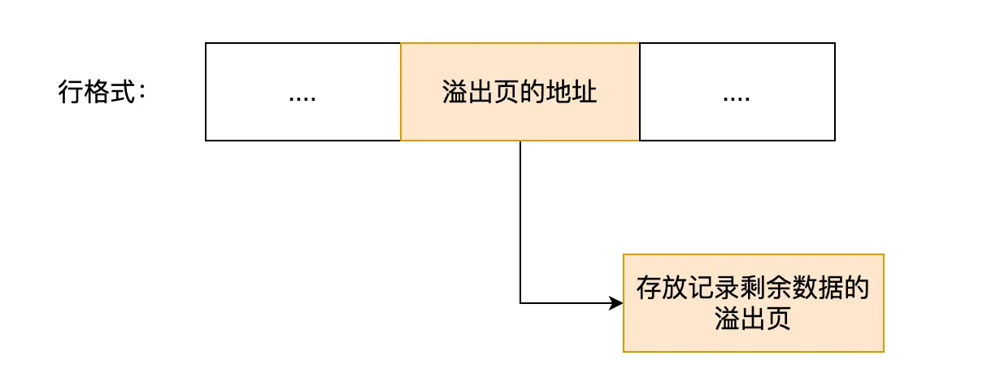

## MySQL的执行流程是怎样的？

可以看到， MySQL 的架构共分为两层：**Server 层和存储引擎层**，

- **Server 层负责建立连接、分析和执行 SQL**。MySQL 大多数的核心功能模块都在这实现，主要包括连接器，查询缓存、解析器、预处理器、优化器、执行器等。另外，所有的内置函数（如日期、时间、数学和加密函数等）和所有跨存储引擎的功能（如存储过程、触发器、视图等。）都在 Server 层实现。
- **存储引擎层负责数据的存储和提取**。支持 InnoDB、MyISAM、Memory 等多个存储引擎，不同的存储引擎共用一个 Server 层。现在最常用的存储引擎是 InnoDB，从 MySQL 5.5 版本开始， InnoDB 成为了 MySQL 的默认存储引擎。我们常说的索引数据结构，就是由存储引擎层实现的，不同的存储引擎支持的索引类型也不相同，比如 InnoDB 支持索引类型是 B+树 ，且是默认使用，也就是说在数据表中创建的主键索引和二级索引默认使用的是 B+ 树索引。

### 1.连接器

连接的过程需要先经过 TCP 三次握手，因为 MySQL 是基于 TCP 协议进行传输的。

MySQL 定义了空闲连接的最大空闲时长，由 `wait_timeout` 参数控制的，默认值是 8 小时（28880秒），如果空闲连接超过了这个时间，连接器就会自动将它断开。

MySQL 服务支持的最大连接数由 max_connections 参数控制。

MySQL 的连接也跟 HTTP 一样，有短连接和长连接的概念。

连接器的工作总结一下：

- 与客户端进行 TCP 三次握手建立连接；
- 校验客户端的用户名和密码，如果用户名或密码不对，则会报错；
- 如果用户名和密码都对了，会读取该用户的权限，然后后面的权限逻辑判断都基于此时读取到的权限；

### 2.查询缓存

连接器的工作完成后，MySQL会解析出 SQL 语句的第一个字段，看看是什么类型的语句。如果 SQL 是查询语句（select 语句），MySQL 就会先去查询缓存（ Query Cache ）里查找缓存数据，缓存是以 key-value 形式保存在内存中的，key 为 SQL 查询语句，value 为 SQL 语句查询的结果。如果命中查询缓存，那么就会直接返回 value 给客户端。如果查询的语句没有命中查询缓存中，那么就要往下继续执行，等执行完后，查询的结果就会被存入查询缓存中。

但是其实**查询缓存**效率不高，尤其是对于更新频繁的表，只要这个表有更新，关于这个表的所有缓存就都失效了。所以在MySQL8.0以后就没有查询缓存这一步了。注意，这里是Server层的缓存，不是存储引擎的缓存。

### 3.解析器

接下来由解析器对SQL语句进行解析，包括两步：

1. **词法分析**。识别出token。
2. **语法分析**。判断语句是否符合MySQL的语法，构建语法树。

### 4.执行

包括3步：

1. **预处理器**

    1. 检查 SQL 查询语句中的表或者字段是否存在；
    2. 将 `select *` 中的 `*` 符号，扩展为表上的所有列；

2. **优化器**

    优化器负责生成执行计划，以高效的方式去完成SQL语句，例如选择根据哪个索引去完成查询。

3. **执行器**

    接下来 MySQL 就真正开始执行语句了，这个工作是由「执行器」完成的。在执行的过程中，执行器就会和存储引擎交互了，交互是以记录为单位的。“以记录为单位”说明执行器每次从存储引擎得到一条记录，然后判断这条记录是否应当在结果集中，如果在就返回给客户端，如果不在就丢弃，然后再从存储引擎取下一条记录。之所以客户端是是直接展示完整的记录，是因为客户端等执行结束后才显示记录的。

    执行器的具体执行有3种情况：

    1. 根据索引查询

        执行器会把查询条件交给存储引擎，存储引擎根据索引可以很快找到记录，判断是否符合条件，对于符合条件的索引执行回表查询，然后将完整记录返回给执行器。

    2. 全表扫描

        当查询没有可用的索引时，执行器不会给存储引擎查询条件，而是直接全表扫描。于是存储引擎每次返回一条记录，执行器判断是否符合查询条件，直到遍历完全表。

    3. 索引下推

        当查询条件有可用的联合索引，但由于范围查询等条件只能使用部分字段时，执行器可能会通过索引下推来减少存储引擎的回表操作。例如在联合索引中，如果第一个查询条件是范围查询，那么第二个字段其实不能使用索引，因为在保证第一个字段有序后，第二个字段可能是无序的。但是执行器仍然会把查询条件交给存储引擎， 存储引擎在二级索引上可以进行判断，只针对那些符合条件的记录进行回表查询。从而减少了整体的回表操作。

## MySQL的一行记录是如何存储的？

MySQL的一个数据库下有3个文件：

1. db.opt，用来存储当前数据库的默认字符集和字符校验规则。
2. t_order.frm ，t_order 的**表结构**会保存在这个文件。在 MySQL 中建立一张表都会生成一个.frm 文件，该文件是用来保存每个表的元数据信息的，主要包含表结构定义。
3. t_order.ibd，t_order 的**表数据**会保存在这个文件。表数据既可以存在共享表空间文件（文件名：ibdata1）里，也可以存放在独占表空间文件（文件名：表名字.ibd）。这个行为是由参数 innodb_file_per_table 控制的，若设置了参数 innodb_file_per_table 为 1，则会将存储的数据、索引等信息单独存储在一个独占表空间，从 MySQL 5.6.6 版本开始，它的默认值就是 1 了，因此从这个版本之后， MySQL 中每一张表的数据都存放在一个独立的 .ibd 文件。

可以看到，表数据是存储在ibd文件中的。MySQL的默认存储引擎是InnoDB，所以下面以InnoDB为例。

表空间文件的结构是由**段（segment）、区（extent）、页（page）、行（row）**组成，InnoDB存储引擎的逻辑存储如下图：

### 1.行 row

数据库表中的记录都是按行（row）进行存放的，每行记录根据不同的行格式，有不同的存储结构。

### 2.页 page

**InnoDB 的数据是按「页」为单位来读写的**，也就是说，当需要读一条记录的时候，并不是将这个行记录从磁盘读出来，而是以页为单位，将其整体读入内存。**默认每个页的大小为 16KB**，也就是最多能保证 16KB 的连续存储空间。

### 3.区 extent

我们知道 InnoDB 存储引擎是用 B+ 树来组织数据的。B+ 树中每一层都是通过双向链表连接起来的，如果是以页为单位来分配存储空间，那么链表中相邻的两个页之间的物理位置并不是连续的，可能离得非常远，那么磁盘查询时就会有大量的随机I/O，随机 I/O 是非常慢的。

**在表中数据量大的时候，为某个索引分配空间的时候就不再按照页为单位分配了，而是按照区（extent）为单位分配。每个区的大小为 1MB，对于 16KB 的页来说，连续的 64 个页会被划为一个区，这样就使得链表中相邻的页的物理位置也相邻，就能使用顺序 I/O 了**。

### 4.段 segment

表空间是由各个段（segment）组成的，段是由多个区（extent）组成的。段一般分为数据段、索引段和回滚段等。

- 索引段：存放 B + 树的非叶子节点的区的集合；
- 数据段：存放 B + 树的叶子节点的区的集合；
- 回滚段：存放的是回滚数据的区的集合， MVCC 利用了回滚段实现了多版本查询数据。

## 记录的行格式

行格式（row_format），就是一条记录的存储结构。

InnoDB 提供了 4 种行格式，分别是 Redundant、Compact、Dynamic和 Compressed 行格式。

Redundant是很古老的格式了，已经不再使用。

使用广泛的是Compact格式，而后两种Dynamic和Compressed都是Compact的变种。

### Compact行格式

可以看到，一条完整的记录分为「记录的额外信息」和「记录的真实数据」两个部分。

### 1.记录的额外信息

记录的额外信息包含 3 个部分：变长字段长度列表、NULL 值列表、记录头信息。

1. **变长字段长度列表**

    varchar(n) 是变长的，变长字段实际存储的数据的长度（大小）不固定的。所以，在存储数据的时候，也要把数据占用的大小存起来，存到「变长字段长度列表」里面，读取数据的时候才能根据这个「变长字段长度列表」去读取对应长度的数据。其他 TEXT、BLOB 等变长字段也是这么实现的。

    这些变长字段的真实数据占用的字节数会按照列的顺序**逆序存放**。逆序存放的设计思想是使得位置靠前的记录的真实数据和数据对应的字段长度信息可以同时在一个 CPU Cache Line 中，这样就可以提高 CPU Cache 的命中率。

    另外，变长字段长度列表并不是每个表的记录都有的，只有包含变长字段的表才会有。

2. **NULL值列表**

    表中的某些列可能会存储 NULL 值，如果把这些 NULL 值都放到记录的真实数据中会比较浪费空间，所以 Compact 行格式把这些值为 NULL 的列存储到 NULL值列表中。

    如果存在允许 NULL 值的列，则每个列对应一个二进制位（bit），二进制位按照列的顺序逆序排列。

    - 二进制位的值为`1`时，代表该列的值为NULL。
    - 二进制位的值为`0`时，代表该列的值不为NULL。

    另外，NULL 值列表必须用整数个字节的位表示（1字节8位），如果使用的二进制位个数不足整数个字节，则在字节的高位补 `0`。

    NULL值列表也不是必须的。当数据表的字段都定义成 NOT NULL 的时候，这时候表里的行格式就不会有 NULL 值列表了。

3. **记录头信息**

    记录头信息中包含的内容很多，这里说几个比较重要的：

    - delete_mask ：标识此条数据是否被删除。从这里可以知道，我们执行 detele 删除记录的时候，并不会真正的删除记录，只是将这个记录的 delete_mask 标记为 1。
    - next_record：下一条记录的位置。从这里可以知道，记录与记录之间是通过链表组织的。在前面我也提到了，指向的是下一条记录的「记录头信息」和「真实数据」之间的位置，这样的好处是向左读就是记录头信息，向右读就是真实数据，比较方便。
    - record_type：表示当前记录的类型，0表示普通记录，1表示B+树非叶子节点记录，2表示最小记录，3表示最大记录。

### 2.记录的真实数据

记录真实数据部分除了我们定义的字段，还有三个隐藏字段，分别为：row_id、trx_id、roll_pointer，我们来看下这三个字段是什么。

- **row_id**：如果我们建表的时候指定了主键或者唯一约束列，那么就没有 row_id 隐藏字段了。如果既没有指定主键，又没有唯一约束，那么 InnoDB 就会为记录添加 row_id 隐藏字段。row_id不是必需的，占用 6 个字节。

- **trx_id**：事务id，表示这个数据是由哪个事务生成的。 trx_id是必需的，占用 6 个字节。

- **roll_pointer**：这条记录上一个版本的指针。roll_pointer 是必需的，占用 7 个字节。

## 行溢出后MySQL是如何处理的？

MySQL 中磁盘和内存交互的基本单位是页，一个页的大小一般是 `16KB`，也就是 `16384字节`，一些大对象如 TEXT、BLOB 可能存储更多的数据，这时一个页可能就存不了一条记录。这个时候就会**发生行溢出，多的数据就会存到另外的「溢出页」中**。

在一般情况下，InnoDB 的数据都是存放在 「数据页」中。但是当发生行溢出时，一个数据页存不了一条记录，InnoDB 存储引擎会自动将溢出的数据存放到「溢出页」中。当发生行溢出时，在记录的真实数据处只会保存该列的一部分数据，而把剩余的数据放在「溢出页」中，然后真实数据处用 20 字节存储指向溢出页的地址，从而可以找到剩余数据所在的页。大致如下图所示。

上面这个是 Compact 行格式在发生行溢出后的处理。

Compressed 和 Dynamic 这两个行格式和 Compact 非常类似，主要的区别在于处理行溢出数据时有些区别。

这两种格式采用完全的行溢出方式，记录的真实数据处不会存储该列的一部分数据，只存储 20 个字节的指针来指向溢出页。而实际的数据都存储在溢出页中，看起来就像下面这样：

## MySQL 的 NULL 值是怎么存放的？

MySQL 的 Compact 行格式中会用「NULL值列表」来标记值为 NULL 的列，NULL 值并不会存储在行格式中的真实数据部分。

## MySQL 怎么知道 varchar(n) 实际占用数据的大小？

MySQL 的 Compact 行格式中会用「变长字段长度列表」存储变长字段实际占用的数据大小。

## 索引的分类

索引的定义就是帮助存储引擎快速获取数据的一种数据结构，形象的说就是**索引是数据的目录**。

我们可以按照四个角度来分类索引。

- 按「数据结构」分类：**B+tree索引、Hash索引、Full-text索引**。
- 按「物理存储」分类：**聚簇索引（主键索引）、二级索引（辅助索引）**。
- 按「字段特性」分类：**主键索引、唯一索引、普通索引、前缀索引**。
- 按「字段个数」分类：**单列索引、联合索引**。

每一种存储引擎支持的索引类型不一定相同，我在表中总结了 MySQL 常见的存储引擎 InnoDB、MyISAM 和 Memory 分别支持的索引类型。

### 1.按数据结构分类

为什么 MySQL InnoDB 选择 B+tree 作为索引的数据结构？

***1、B+Tree vs B Tree***

B+Tree 只在叶子节点存储数据，而 B 树 的非叶子节点也要存储数据，所以 B+Tree 的单个节点的数据量更小，在相同的磁盘 I/O 次数下，就能查询更多的节点。

另外，B+Tree 叶子节点采用的是双向链表连接，适合 MySQL 中常见的基于范围的顺序查找，而 B 树无法做到这一点。

***2、B+Tree vs 二叉树***

对于有 N 个叶子节点的 B+Tree，其搜索复杂度为`O(logdN)`，其中 d 表示节点允许的最大子节点个数为 d 个。

在实际的应用当中， d 值是大于100的，这样就保证了，即使数据达到千万级别时，B+Tree 的高度依然维持在 3~4 层左右，也就是说一次数据查询操作只需要做 3~4 次的磁盘 I/O 操作就能查询到目标数据。

而二叉树的每个父节点的儿子节点个数只能是 2 个，意味着其搜索复杂度为 `O(logN)`，这已经比 B+Tree 高出不少，因此二叉树检索到目标数据所经历的磁盘 I/O 次数要更多。

***3、B+Tree vs Hash***

Hash 在做等值查询的时候效率贼快，搜索复杂度为 O(1)。

但是 Hash 表不适合做范围查询，它更适合做等值的查询，这也是 B+Tree 索引要比 Hash 表索引有着更广泛的适用场景的原因。

### 2.按物理存储分类

从物理存储的角度来看，索引分为聚簇索引（主键索引）、二级索引（辅助索引）。

这两个区别在前面也提到了：

- 主键索引的 B+Tree 的叶子节点存放的是实际数据，所有完整的用户记录都存放在主键索引的 B+Tree 的叶子节点里；
- 二级索引的 B+Tree 的叶子节点存放的是主键值，而不是实际数据。

所以，在查询时使用了二级索引，如果查询的数据能在二级索引里查询的到，那么就不需要回表，这个过程就是覆盖索引。如果查询的数据不在二级索引里，就会先检索二级索引，找到对应的叶子节点，获取到主键值后，然后再检索主键索引，就能查询到数据了，这个过程就是回表。

### 3.按字段特性分类

从字段特性的角度来看，索引分为主键索引、唯一索引、普通索引、前缀索引。

### 4.按字段个数分类

从字段个数的角度来看，索引分为单列索引、联合索引（复合索引）。

- 建立在单列上的索引称为单列索引，比如主键索引；
- 建立在多列上的索引称为联合索引；

## 有什么优化索引的方法？

这里说一下几种常见优化索引的方法：

- 前缀索引优化；
- 覆盖索引优化；
- 主键索引最好是自增的；
- 索引NOT NULL优化
- 防止索引失效；

### 1.前缀索引优化

前缀索引顾名思义就是使用某个字段中字符串的前几个字符建立索引，使用前缀索引是为了减小索引字段大小，可以增加一个索引页中存储的索引值，有效提高索引的查询速度。在一些大字符串的字段作为索引时，使用前缀索引可以帮助我们减小索引项的大小。

不过，前缀索引有一定的局限性，例如：

- order by 就无法使用前缀索引；
- 无法把前缀索引用作覆盖索引；

### 2.覆盖索引优化

覆盖索引是指 SQL 中 query 的所有字段，在索引 B+Tree 的叶子节点上都能找得到的那些索引，从二级索引中查询得到记录，而不需要通过聚簇索引查询获得，可以避免回表的操作。

假设我们只需要查询商品的名称、价格，有什么方式可以避免回表呢？

我们可以建立一个联合索引，即「商品ID、名称、价格」作为一个联合索引。如果索引中存在这些数据，查询将不会再次检索主键索引，从而避免回表。

所以，使用覆盖索引的好处就是，不需要查询出包含整行记录的所有信息，也就减少了大量的 I/O 操作。

### 3.主键自增优化

InnoDB 创建主键索引默认为聚簇索引，数据被存放在了 B+Tree 的叶子节点上。也就是说，同一个叶子节点内的各个数据是按主键顺序存放的，因此，每当有一条新的数据插入时，数据库会根据主键将其插入到对应的叶子节点中。

**如果我们使用自增主键**，那么每次插入的新数据就会按顺序添加到当前索引节点的位置，不需要移动已有的数据，当页面写满，就会自动开辟一个新页面。因为每次**插入一条新记录，都是追加操作，不需要重新移动数据**，因此这种插入数据的方法效率非常高。

**如果我们使用非自增主键**，由于每次插入主键的索引值都是随机的，因此每次插入新的数据时，就可能会插入到现有数据页中间的某个位置，这将不得不移动其它数据来满足新数据的插入，甚至需要从一个页面复制数据到另外一个页面，我们通常将这种情况称为**页分裂**。**页分裂还有可能会造成大量的内存碎片，导致索引结构不紧凑，从而影响查询效率**。

### 4.索引NOT NULL优化

- 第一个原因：索引列存在 NULL 就会导致优化器在做索引选择的时候更加复杂，更加难以优化，因为可为 NULL 的列会使索引、索引统计和值比较都更复杂，比如进行索引统计时，count 会省略值为NULL 的行。
- 第二个原因：NULL 值是一个没意义的值，但是它会占用物理空间，所以会带来的存储空间的问题，因为 InnoDB 存储记录的时候，如果表中存在允许为 NULL 的字段，那么行格式 (opens new window)中**至少会用 1 字节空间存储 NULL 值列表**。

### 5.防止索引失效

这里简单说一下，发生索引失效的情况：

- 对索引使用模糊匹配：当我们使用左或者左右模糊匹配的时候，也就是 `like %xx` 或者 `like %xx%`这两种方式都会造成索引失效；
- 对索引使用函数：当我们在查询条件中对索引列做了计算、函数、类型转换操作，这些情况下都会造成索引失效；
- 不符合最左匹配原则：联合索引要能正确使用需要遵循最左匹配原则，也就是按照最左优先的方式进行索引的匹配，否则就会导致索引失效。
- 在 WHERE 子句中，如果在 OR 前的条件列是索引列，而在 OR 后的条件列不是索引列，那么索引会失效。

## 哪种Count性能最好？

先上结论：count(*) = count(1) > count(主键) > count(非主键)

count() 是一个聚合函数，函数的参数不仅可以是字段名，也可以是其他任意表达式，该函数作用是**统计符合查询条件的记录中，函数指定的参数不为 NULL 的记录有多少个**。

### count(主键字段) 执行过程是怎样的？

在通过 count 函数统计有多少个记录时，MySQL 的 server 层会维护一个名叫 count 的变量。server 层会循环向 InnoDB 读取一条记录，如果 count 函数指定的参数不为 NULL，那么就会将变量 count 加 1，直到符合查询的全部记录被读完，就退出循环。最后将 count 变量的值发送给客户端。

如果表里只有主键索引，没有二级索引时，那么，InnoDB 循环遍历聚簇索引，将读取到的记录的id返回给 server 层，server层会判断 id 值是否为 NULL，如果不为 NULL，就将 count 变量加 1。但是，如果表里有二级索引时，InnoDB 循环遍历的对象就不是聚簇索引，而是二级索引。这是因为相同数量的二级索引记录可以比聚簇索引记录占用更少的存储空间，所以二级索引树比聚簇索引树小，这样遍历二级索引的 I/O 成本比遍历聚簇索引的 I/O 成本小，因此「优化器」优先选择的是二级索引。

### count(1) 执行过程是怎样的？

参数 1 很明显并不是 NULL，因此 server 层每从 InnoDB 读取到一条记录，就将 count 变量加 1。因此，InnoDB 循环遍历聚簇索引（如果有二级索引就遍历二级索引），**但是不会读取记录中的任何字段的值**。

可以看到，count(1)比count(主键)少了一个步骤，InnoDB不需要返回任何真实数据，server直接将count自增，因此count(1)更快。

### count(*)执行过程是怎样的？

**count(`*`) 其实等于 count(`0`)**，也就是说，当你使用 count(`*`) 时，MySQL 会将 `*` 参数转化为参数 0 来处理。

因此，count(*)等于count(1)。

### count(字段) 执行过程是怎样的？

count(字段) 的执行效率相比前面的 count(1)、 count(*)、 count(主键字段) 执行效率是最差的。

count(字段) 需要InnoDB返回记录中该字段，而该字段不是主键字段，所以必须要读取记录。

## 为什么要通过遍历的方式来计数

前面将的案例都是基于 Innodb 存储引擎来说明的，但是在 MyISAM 存储引擎里，执行 count 函数的方式是不一样的，通常在没有任何查询条件下的 count(*)，MyISAM 的查询速度要明显快于 InnoDB。使用 MyISAM 引擎时，执行 count 函数只需要 O(1 )复杂度，这是因为每张 MyISAM 的数据表都有一个 meta 信息有存储了row_count值，由表级锁保证一致性，所以直接读取 row_count 值就是 count 函数的执行结果。

而 InnoDB 存储引擎是支持事务的，同一个时刻的多个查询，由于多版本并发控制（MVCC）的原因，InnoDB 表“应该返回多少行”也是不确定的，所以无法像 MyISAM一样，只维护一个 row_count 变量。

另外，而当带上 where 条件语句之后，MyISAM 跟 InnoDB 就没有区别了，它们都需要扫描表来进行记录个数的统计。

## 如何优化count(*)?

1. 近似值。我们可以使用 show table status 或者 explain 命令来表进行估算。执行 explain 命令效率是很高的，因为它并不会真正的去查询，下图中的 rows 字段值就是 explain 命令对表 t_order 记录的估算值。
2. 额外表保存计数值。如果是想精确的获取表的记录总数，我们可以将这个计数值保存到单独的一张计数表中。当我们在数据表插入一条记录的同时，将计数表中的计数字段 + 1。也就是说，在新增和删除操作时，我们需要额外维护这个计数表。

## 关于数据库的隔离级别，为什么可重复读级别还会有幻读问题呢？

在可重复读中，无法处理insert的数据，所以当事务A先前读取了数据，或者修改了全部数据，事务B还是可以insert数据提交，这时事务A就会发现莫名其妙多了一条之前没有的数据，这就是幻读，不能通过行锁来避免。需要Serializable隔离级别。

虽然 MySQL 的默认事务隔离级别是Repeatable Read，允许幻读现象，但它使用间隙锁和临键锁，在很大程度上减少了这种现象。

## 事务的四大特性以及是如何实现的？

### 1.原子性

原子性是指事务中的操作一起成功或者一起失败。原子性是通过undolog来实现的。当事务执行失败需要回滚的时候可以通过undolog来执行已经完成的操作的逆操作，恢复数据的状态。

### 2.隔离性

隔离性是通过MVCC和锁来实现的。

#### 1.快照读

快照读是通过MVCC来实现的，而MVCC又是通过undolog、聚簇索引的隐藏字段(trx_id+pointer) 和 readview来实现的。

对于4种隔离性，实现方式不同：

1. 读未提交。会出现脏读、不可重复读、幻读的并发问题。每次读取都是当前读，即读取最新数据。
2. 读已提交。会出现不可重复读、幻读的问题。在事务的每个语句之前生成一个read view，从而实现只读取已经提交的事务的修改。
3. 可重复读。会出现幻读的问题。在事务开始前生成一个read view，期间都适用这个read view。因此多次读取看到的都是事务开始时的数据。
4. 串行化。没有并发问题。

另外，MySQL的默认事务隔离级别是可重复读，但他通过行锁、间隙锁和临键锁解决了大部分的幻读问题。

#### 2.当前读

当前读是通过各种锁来实现的。MySQL 里除了普通查询是快照读，其他都是**当前读**，比如 update、insert、delete，这些语句执行前都会查询最新版本的数据，然后再做进一步的操作。另外，select ... for update就是当前读。

有全局锁、表级锁、行级锁。他们又分别有读锁和写锁。表级锁为了加快与行级锁的冲突判断，还引入了意向读锁，意向写锁。行级锁为了解决大部分的幻读现象，还引入了间隙锁和临键锁。

### 3.持久性

持久性是通过redolog来实现的。redolog采用一种WAL(Write-Ahead Logging)的技术，即所有的修改都是先写到存储引擎的buffer pool，再生成redolog，由后台线程定期刷盘。这里要注意，其实undolog也是先写到内存的buffer pool，然后生成redo log。

这样做的原因是，redolog是顺序写，而更新数据库是随机写，顺序写要更快。

redolog并不是每次生成都写磁盘，而是先写到redolog buffer。redolog buffer刷盘(写到磁盘)的策略有好几种，比如每个1s刷新一次，或者redolog buffer写入量达到一半时刷盘等等。但是要保证绝对安全性的策略是，每次任务提交时都刷新到磁盘，只有redolog可持久化后才认为事务完成提交。

### 4.一致性

本质上上面3个特性都是为一致性服务，有了上面3个特性，就能够保证数据库中的数据总是处于一致性状态。

## MySQL有哪些日志？

更新语句的流程会涉及到 undo log（回滚日志）、redo log（重做日志） 、binlog （归档日志）这三种日志：

- **undo log（回滚日志）**：是 Innodb 存储引擎层生成的日志，实现了事务中的**原子性**，主要**用于事务回滚和 MVCC**。
- **redo log（重做日志）**：是 Innodb 存储引擎层生成的日志，实现了事务中的**持久性**，主要**用于掉电等故障恢复**；
- **binlog （归档日志）**：是 Server 层生成的日志，主要**用于数据备份和主从复制**；

## 为什么需要Undo log？

1. **它保证了事务的 ACID特性的原子性（Atomicity）**。一条记录的每一次更新操作产生的 undo log 格式都有一个 roll_pointer 指针和一个 trx_id 事务id：

    - 通过 trx_id 可以知道该记录是被哪个事务修改的；
    - 通过 roll_pointer 指针可以将这些 undo log 串成一个链表，这个链表就被称为版本链；

    当事务失败时，可以通过undo log来回滚已经完成的操作，实现原子性。

2. **undo log配合readview实现了MVCC，是实现隔离性的一部分**。undo log 为每条记录保存多份历史数据，MySQL 在执行快照读（普通 select 语句）的时候，会根据事务的 Read View 里的信息，顺着 undo log 的版本链找到满足其可见性的记录。

## Undo log是如何持久化的？

undo log 和数据页的刷盘策略是一样的，都需要通过 redo log 保证持久化。

buffer pool 中有 undo 页，对 undo 页的修改也都会记录到 redo log。redo log 会每秒刷盘，提交事务时也会刷盘，数据页和 undo 页都是靠这个机制保证持久化的。

## 为什么需要 Buffer Pool？

Innodb 存储引擎设计了一个**缓冲池（Buffer Pool）**，来提高数据库的读写性能。

- 当读取数据时，如果数据存在于 Buffer Pool 中，客户端就会直接读取 Buffer Pool 中的数据，否则再去磁盘中读取。
- 当修改数据时，如果数据存在于 Buffer Pool 中，那直接修改 Buffer Pool 中数据所在的页，然后将其页设置为脏页（该页的内存数据和磁盘上的数据已经不一致），为了减少磁盘I/O，不会立即将脏页写入磁盘，后续由后台线程选择一个合适的时机将脏页写入到磁盘。

InnoDB 会把存储的数据划分为若干个「页」，以页作为磁盘和内存交互的基本单位，一个页的默认大小为 16KB。因此，Buffer Pool 同样需要按「页」来划分。在 MySQL 启动的时候，**InnoDB 会为 Buffer Pool 申请一片连续的内存空间，然后按照默认的`16KB`的大小划分出一个个的页， Buffer Pool 中的页就叫做缓存页**。此时这些缓存页都是空闲的，之后随着程序的运行，才会有磁盘上的页被缓存到 Buffer Pool 中。

Buffer Pool 除了缓存「索引页」和「数据页」，还包括了 Undo 页，插入缓存、自适应哈希索引、锁信息等等。

## 为什么需要Redo log？

1. **Redo log实现了数据库事务的持久性。**

Buffer Pool 是提高了读写效率没错，但内存总是不可靠，万一断电重启，还没来得及落盘的脏页数据就会丢失。为了防止断电导致数据丢失的问题，当有一条记录需要更新的时候，InnoDB 引擎就会**先更新内存（同时标记为脏页），然后将本次对这个页的修改以 redo log 的形式记录下来，这个时候更新就算完成了**。

后续，InnoDB 引擎会在适当的时候，由后台线程将缓存在 Buffer Pool 的脏页刷新到磁盘里，这就是 **WAL （Write-Ahead Logging）技术**。

redo log 是物理日志，记录了某个数据页做了什么修改，比如**对 XXX 表空间中的 YYY 数据页 ZZZ 偏移量的地方做了AAA 更新**，每当执行一个事务就会产生这样的一条或者多条物理日志。

在事务提交时，只要先将 redo log 持久化到磁盘即可，可以不需要等到将缓存在 Buffer Pool 里的脏页数据持久化到磁盘。

当系统崩溃时，虽然脏页数据没有持久化，但是 redo log 已经持久化，接着 MySQL 重启后，可以根据 redo log 的内容，将所有数据恢复到最新的状态。

2. **将写操作从「随机写」变成了「顺序写」，提升 MySQL 写入磁盘的性能。**

写入 redo log 的方式使用了追加操作， 所以磁盘操作是**顺序写**，而写入数据需要先找到写入位置，然后才写到磁盘，所以磁盘操作是**随机写**。磁盘的「顺序写 」比「随机写」 高效的多，因此 redo log 写入磁盘的开销更小。

可以说这是 WAL 技术的另外一个优点：**MySQL 的写操作从磁盘的「随机写」变成了「顺序写」**，提升语句的执行性能。这是因为 MySQL 的写操作并不是立刻更新到磁盘上，而是先记录在日志上，然后在合适的时间再更新到磁盘上 。

## Undo log和Redo log的区别？

这两种日志是属于 InnoDB 存储引擎的日志，它们的区别在于：

- redo log 记录了此次事务「**完成后**」的数据状态，记录的是更新**之后**的值；
- undo log 记录了此次事务「**开始前**」的数据状态，记录的是更新**之前**的值；

## Redo log是直接写磁盘吗？

不是的。

实际上， 执行一个事务的过程中，产生的 redo log 也不是直接写入磁盘的，因为这样会产生大量的 I/O 操作，而且磁盘的运行速度远慢于内存。所以，redo log 也有自己的缓存—— **redo log buffer**，每当产生一条 redo log 时，会先写入到 redo log buffer，后续在持久化到磁盘如下图：

缓存在 redo log buffer 里的 redo log 还是在内存中，它什么时候刷新到磁盘？

主要有下面几个时机：

- MySQL 正常关闭时；
- 当 redo log buffer 中记录的写入量大于 redo log buffer 内存空间的一半时，会触发落盘；
- InnoDB 的后台线程每隔 1 秒，将 redo log buffer 持久化到磁盘。
- 每次事务提交时都将缓存在 redo log buffer 里的 redo log 直接持久化到磁盘（这个策略可由 innodb_flush_log_at_trx_commit 参数控制）。

上面这种 redo log 刷盘时机是在事务提交的时候，这个默认的行为。

除此之外，InnoDB 还提供了另外两种策略，由参数 `innodb_flush_log_at_trx_commit` 参数控制，可取的值有：0、1、2，默认值为 1，这三个值分别代表的策略如下：

- 当设置该**参数为 0 时**，表示每次事务提交时 ，还是**将 redo log 留在 redo log buffer 中** ，该模式下在事务提交时不会主动触发写入磁盘的操作。
- 当设置该**参数为 1 时**，表示每次事务提交时，都**将缓存在 redo log buffer 里的 redo log 直接持久化到磁盘**，这样可以保证 MySQL 异常重启之后数据不会丢失。
- 当设置该**参数为 2 时**，表示每次事务提交时，都只是缓存在 redo log buffer 里的 redo log **写到 redo log 文件，注意写入到「 redo log 文件」并不意味着写入到了磁盘**，因为操作系统的文件系统中有个 Page Cache，Page Cache 是专门用来缓存文件数据的，所以写入「 redo log文件」意味着写入到了操作系统的文件缓存。

## Redo log文件写满了怎么办？

默认情况下， InnoDB 存储引擎有 1 个重做日志文件组( redo log Group），「重做日志文件组」由有 2 个 redo log 文件组成，这两个 redo 日志的文件名叫 ：`ib_logfile0` 和 `ib_logfile1` 

重做日志文件组是以**循环写**的方式工作的，从头开始写，写到末尾就又回到开头，相当于一个环形。

我们知道 redo log 是为了防止 Buffer Pool 中的脏页丢失而设计的，那么如果随着系统运行，Buffer Pool 的脏页刷新到了磁盘中，那么 redo log 对应的记录也就没用了，这时候我们擦除这些旧记录，以腾出空间记录新的更新操作

InnoDB 用 write pos 表示 redo log 当前记录写到的位置，用 checkpoint 表示当前要擦除的位置，

如果 write pos 追上了 checkpoint，就意味着 **redo log 文件满了，这时 MySQL 不能再执行新的更新操作，也就是说 MySQL 会被阻塞**（*因此所以针对并发量大的系统，适当设置 redo log 的文件大小非常重要*），此时会停下来将 Buffer Pool 中的脏页刷新到磁盘中，然后标记 redo log 哪些记录可以被擦除，接着对旧的 redo log 记录进行擦除，等擦除完旧记录腾出了空间，checkpoint 就会往后移动，然后 MySQL 恢复正常运行，继续执行新的更新操作。

所以，一次 checkpoint 的过程就是脏页刷新到磁盘中变成干净页，然后标记 redo log 哪些记录可以被覆盖的过程。

## 为什么需要Binlog？

前面介绍的 undo log 和 redo log 这两个日志都是 Innodb 存储引擎生成的。

MySQL 在完成一条更新操作后，Server 层还会生成一条 binlog，等之后事务提交的时候，会将该事物执行过程中产生的所有 binlog 统一写 入 binlog 文件。

binlog 文件是记录了所有数据库表结构变更和表数据修改的日志，不会记录查询类的操作，比如 SELECT 和 SHOW 操作。

那么，为什么需要binlog可以从binlog与redolog的区别来考虑：

*1、适用对象不同：*

- binlog 是 MySQL 的 Server 层实现的日志，所有存储引擎都可以使用；
- redo log 是 Innodb 存储引擎实现的日志；

*2、文件格式不同：*

- binlog 有 3 种格式类型，分别是 STATEMENT（默认格式）、ROW、 MIXED，区别如下：
    - STATEMENT：每一条修改数据的 SQL 都会被记录到 binlog 中（相当于记录了逻辑操作，所以针对这种格式， binlog 可以称为逻辑日志），主从复制中 slave 端再根据 SQL 语句重现。但 STATEMENT 有动态函数的问题，比如你用了 uuid 或者 now 这些函数，你在主库上执行的结果并不是你在从库执行的结果，这种随时在变的函数会导致复制的数据不一致；
    - ROW：记录行数据最终被修改成什么样了（这种格式的日志，就不能称为逻辑日志了），不会出现 STATEMENT 下动态函数的问题。但 ROW 的缺点是每行数据的变化结果都会被记录，比如执行批量 update 语句，更新多少行数据就会产生多少条记录，使 binlog 文件过大，而在 STATEMENT 格式下只会记录一个 update 语句而已；
    - MIXED：包含了 STATEMENT 和 ROW 模式，它会根据不同的情况自动使用 ROW 模式和 STATEMENT 模式；
- redo log 是物理日志，记录的是在某个数据页做了什么修改，比如对 XXX 表空间中的 YYY 数据页 ZZZ 偏移量的地方做了AAA 更新；

*3、写入方式不同：*

- binlog 是追加写，写满一个文件，就创建一个新的文件继续写，不会覆盖以前的日志，保存的是全量的日志。
- redo log 是循环写，日志空间大小是固定，全部写满就从头开始，保存未被刷入磁盘的脏页日志。

*4、用途不同：*

- binlog 用于备份恢复、主从复制；
- redo log 用于掉电等故障恢复。

## 如果不小心整个数据库的数据被删除了，能使用 redo log 文件恢复数据吗?

不可以使用 redo log 文件恢复，只能使用 binlog 文件恢复。

因为 redo log 文件是循环写，是会边写边擦除日志的，只记录未被刷入磁盘的数据的物理日志，已经刷入磁盘的数据都会从 redo log 文件里擦除。

binlog 文件保存的是全量的日志，也就是保存了所有数据变更的情况，理论上只要记录在 binlog 上的数据，都可以恢复，所以如果不小心整个数据库的数据被删除了，得用 binlog 文件恢复数据。

## MySQL主从复制如何实现的？

MySQL 的主从复制依赖于 binlog ，也就是记录 MySQL 上的所有变化并以二进制形式保存在磁盘上。复制的过程就是将 binlog 中的数据从主库传输到从库上。

这个过程一般是**异步**的，也就是主库上执行事务操作的线程不会等待复制 binlog 的线程同步完成。

MySQL 集群的主从复制过程梳理成 3 个阶段：

- **写入 Binlog**：MySQL 主库在收到客户端提交事务的请求之后，会先写入 binlog，再提交事务，更新存储引擎中的数据，事务提交完成后，返回给客户端“操作成功”的响应。
- **同步 Binlog**：把 binlog 复制到所有从库上。从库会创建一个专门的 I/O 线程，连接主库的 log dump 线程，来接收主库的 binlog 日志，再把 binlog 信息写入 relay log 的中继日志里，再返回给主库“复制成功”的响应。
- **回放 Binlog**：回放 binlog，并更新存储引擎中的数据。从库会创建一个用于回放 binlog 的线程，去读 relay log 中继日志，然后回放 binlog 更新存储引擎中的数据，最终实现主从的数据一致性。

在完成主从复制之后，你就可以在写数据时只写主库，在读数据时只读从库，这样即使写请求会锁表或者锁记录，也不会影响读请求的执行。

除此之外，MySQL主从复制还有以下模型：

- **同步复制**：MySQL 主库提交事务的线程要等待所有从库的复制成功响应，才返回客户端结果。这种方式在实际项目中，基本上没法用，原因有两个：一是性能很差，因为要复制到所有节点才返回响应；二是可用性也很差，主库和所有从库任何一个数据库出问题，都会影响业务。
- **异步复制**（默认模型）：MySQL 主库提交事务的线程并不会等待 binlog 同步到各从库，就返回客户端结果。这种模式一旦主库宕机，数据就会发生丢失。
- **半同步复制**：MySQL 5.7 版本之后增加的一种复制方式，介于两者之间，事务线程不用等待所有的从库复制成功响应，只要一部分复制成功响应回来就行，比如一主二从的集群，只要数据成功复制到任意一个从库上，主库的事务线程就可以返回给客户端。这种**半同步复制的方式，兼顾了异步复制和同步复制的优点，即使出现主库宕机，至少还有一个从库有最新的数据，不存在数据丢失的风险**。

## Binlog如何持久化？

事务执行过程中，先把日志写到 binlog cache（Server 层的 cache），事务提交的时候，再把 binlog cache 写到 binlog 文件中。

一个事务的 binlog 是不能被拆开的，因此无论这个事务有多大（比如有很多条语句），也要保证一次性写入。这是因为有一个线程只能同时有一个事务在执行的设定，所以每当执行一个 begin/start transaction 的时候，就会默认提交上一个事务

MySQL 给每个线程分配了一片内存用于缓冲 binlog ，该内存叫 binlog cache，参数 binlog_cache_size 用于控制单个线程内 binlog cache 所占内存的大小。如果超过了这个参数规定的大小，就要暂存到磁盘。

在事务提交的时候，执行器把 binlog cache 里的完整事务写入到 binlog 文件中，并清空 binlog cache。虽然每个线程有自己 binlog cache，但是最终都写到同一个 binlog 文件：

+ 图中的 write，指的就是指把日志写入到 binlog 文件，但是并没有把数据持久化到磁盘，因为数据还缓存在文件系统的 page cache 里，write 的写入速度还是比较快的，因为不涉及磁盘 I/O。

- 图中的 fsync，才是将数据持久化到磁盘的操作，这里就会涉及磁盘 I/O，所以频繁的 fsync 会导致磁盘的 I/O 升高。

MySQL提供一个 sync_binlog 参数来控制数据库的 binlog 刷到磁盘上的频率：

- sync_binlog = 0 的时候，表示每次提交事务都只 write，不 fsync，后续交由操作系统决定何时将数据持久化到磁盘；
- sync_binlog = 1 的时候，表示每次提交事务都会 write，然后马上执行 fsync；
- sync_binlog =N(N>1) 的时候，表示每次提交事务都 write，但累积 N 个事务后才 fsync。

在MySQL中系统默认的设置是 sync_binlog = 0，也就是不做任何强制性的磁盘刷新指令，这时候的性能是最好的，但是风险也是最大的。因为一旦主机发生异常重启，还没持久化到磁盘的数据就会丢失。

## 为什么需要两阶段提交？

事务提交后，redolog和binlog都是异步持久化到磁盘的，因此如果这两个日志出现半成功状态，则会导致两份日志的不一致性。这是因为 redo log 影响主库的数据，binlog 影响从库的数据，所以 redo log 和 binlog 必须保持一致才能保证主从数据一致。

- **如果在将 redo log 刷入到磁盘之后， MySQL 突然宕机了，而 binlog 还没有来得及写入**。MySQL 重启后，通过 redo log 能将 Buffer Pool 中 id = 1 这行数据的 name 字段恢复到新值 xiaolin，但是 binlog 里面没有记录这条更新语句，在主从架构中，binlog 会被复制到从库，由于 binlog 丢失了这条更新语句，从库的这一行 name 字段是旧值 jay，与主库的值不一致性；
- **如果在将 binlog 刷入到磁盘之后， MySQL 突然宕机了，而 redo log 还没有来得及写入**。由于 redo log 还没写，崩溃恢复以后这个事务无效，所以 id = 1 这行数据的 name 字段还是旧值 jay，而 binlog 里面记录了这条更新语句，在主从架构中，binlog 会被复制到从库，从库执行了这条更新语句，那么这一行 name 字段是新值 xiaolin，与主库的值不一致性；

**MySQL 为了避免出现两份日志之间的逻辑不一致的问题，使用了「两阶段提交」来解决**，两阶段提交其实是分布式事务一致性协议，它可以保证多个逻辑操作要不全部成功，要不全部失败，不会出现半成功的状态。

在 MySQL 的 InnoDB 存储引擎中，开启 binlog 的情况下，MySQL 会同时维护 binlog 日志与 InnoDB 的 redo log，为了保证这两个日志的一致性，MySQL 使用了**内部 XA 事务**。内部 XA 事务由 binlog 作为协调者，存储引擎是参与者。

从图中可看出，事务的提交过程有两个阶段，就是**将 redo log 的写入拆成了两个步骤：prepare 和 commit，中间再穿插写入binlog**，具体如下：

- **prepare 阶段**：将 XID（内部 XA 事务的 ID） 写入到 redo log，同时将 redo log 对应的事务状态设置为 prepare，然后将 redo log 持久化到磁盘（innodb_flush_log_at_trx_commit = 1 的作用）；
- **commit 阶段**：把 XID 写入到 binlog，然后将 binlog 持久化到磁盘（sync_binlog = 1 的作用），接着调用引擎的提交事务接口，将 redo log 状态设置为 commit，此时该状态并不需要持久化到磁盘，只需要 write 到文件系统的 page cache 中就够了，因为只要 binlog 写磁盘成功，就算 redo log 的状态还是 prepare 也没有关系，一样会被认为事务已经执行成功；

如果在事务提交时发生了宕机，在 MySQL 重启后会按顺序扫描 redo log 文件，碰到处于 prepare 状态的 redo log，就拿着 redo log 中的 XID 去 binlog 查看是否存在此 XID：

- **如果 binlog 中没有当前内部 XA 事务的 XID，说明 redolog 完成刷盘，但是 binlog 还没有刷盘，则回滚事务**。对应时刻 A 崩溃恢复的情况。
- **如果 binlog 中有当前内部 XA 事务的 XID，说明 redolog 和 binlog 都已经完成了刷盘，则提交事务**。对应时刻 B 崩溃恢复的情况。

可以看到，**对于处于 prepare 阶段的 redo log，即可以提交事务，也可以回滚事务，这取决于是否能在 binlog 中查找到与 redo log 相同的 XID**，如果有就提交事务，如果没有就回滚事务。这样就可以保证 redo log 和 binlog 这两份日志的一致性了。

所以说，**两阶段提交是以 binlog 写成功为事务提交成功的标识**，因为 binlog 写成功了，就意味着能在 binlog 中查找到与 redo log 相同的 XID。

## 事务没提交的时候，redo log 会被持久化到磁盘吗？

会的。

事务执行中间过程的 redo log 也是直接写在 redo log buffer 中的，这些缓存在 redo log buffer 里的 redo log 也会被「后台线程」每隔一秒一起持久化到磁盘。

也就是说，**事务没提交的时候，redo log 也是可能被持久化到磁盘的**。

有的同学可能会问，如果 mysql 崩溃了，还没提交事务的 redo log 已经被持久化磁盘了，mysql 重启后，数据不就不一致了？

放心，这种情况 mysql 重启会进行回滚操作，因为事务没提交的时候，binlog 是还没持久化到磁盘的。

所以， redo log 可以在事务没提交之前持久化到磁盘，但是 binlog 必须在事务提交之后，才可以持久化到磁盘。

## 两阶段提交有什么问题？

两阶段提交虽然保证了两个日志文件的数据一致性，但是性能很差，主要有两个方面的影响：

- **磁盘 I/O 次数高**：对于“双1”配置，每个事务提交都会进行两次 fsync（刷盘），一次是 redo log 刷盘，另一次是 binlog 刷盘。
- **锁竞争激烈**：两阶段提交虽然能够保证「单事务」两个日志的内容一致，但在「多事务」的情况下，却不能保证两者的提交顺序一致，因此，在两阶段提交的流程基础上，还需要加一个锁来保证提交的原子性，从而保证多事务的情况下，两个日志的提交顺序一致。

## 为什么两阶段提交的IO次数会很高？

binlog 和 redo log 在内存中都对应的缓存空间，binlog 会缓存在 binlog cache，redo log 会缓存在 redo log buffer，它们持久化到磁盘的时机分别由下面这两个参数控制。一般我们为了避免日志丢失的风险，会将这两个参数设置为 1：

- 当 sync_binlog = 1 的时候，表示每次提交事务都会将 binlog cache 里的 binlog 直接持久到磁盘；
- 当 innodb_flush_log_at_trx_commit = 1 时，表示每次事务提交时，都将缓存在 redo log buffer 里的 redo log 直接持久化到磁盘；

可以看到，如果 sync_binlog 和 当 innodb_flush_log_at_trx_commit 都设置为 1，那么在每个事务提交过程中， 都会**至少调用 2 次刷盘操作**，一次是 redo log 刷盘，一次是 binlog 落盘，所以这会成为性能瓶颈。

## 两阶段提交为什么锁竞争激烈？

在早期的 MySQL 版本中，通过使用 prepare_commit_mutex 锁来保证事务提交的顺序，在一个事务获取到锁时才能进入 prepare 阶段，一直到 commit 阶段结束才能释放锁，下个事务才可以继续进行 prepare 操作。

通过加锁虽然完美地解决了顺序一致性的问题，但在并发量较大的时候，就会导致对锁的争用，性能不佳。

## 两阶段提交的组提交？

早期的两阶段提交IO频繁且锁竞争激烈，所以后来提出了组提交方法。

**组提交就是当有多个事务提交的时候，会将多个 binlog 刷盘操作合并成一个，从而减少磁盘 I/O 的次数**。

引入了组提交机制后，prepare 阶段不变，只针对 commit 阶段，将 commit 阶段拆分为三个过程：

- **flush 阶段**：多个事务按进入的顺序将 binlog 从 cache 写入文件（不刷盘）；
- **sync 阶段**：对 binlog 文件做 fsync 操作（多个事务的 binlog 合并一次刷盘）；
- **commit 阶段**：各个事务按顺序做 InnoDB commit 操作；

上面的**每个阶段都有一个队列**，每个阶段有锁进行保护，因此保证了事务写入的顺序，第一个进入队列的事务会成为 leader，leader领导所在队列的所有事务，全权负责整队的操作，完成后通知队内其他事务操作结束。

## 总结一下Update语句的流程

具体更新一条记录 `UPDATE t_user SET name = 'xiaolin' WHERE id = 1;` 的流程如下:

1. 执行器负责具体执行，会调用存储引擎的接口，通过主键索引树搜索获取 id = 1 这一行记录：
    - 如果 id=1 这一行所在的数据页本来就在 buffer pool 中，就直接返回给执行器更新；
    - 如果记录不在 buffer pool，将数据页从磁盘读入到 buffer pool，返回记录给执行器。
2. 执行器得到聚簇索引记录后，会看一下更新前的记录和更新后的记录是否一样：
    - 如果一样的话就不进行后续更新流程；
    - 如果不一样的话就把更新前的记录和更新后的记录都当作参数传给 InnoDB 层，让 InnoDB 真正的执行更新记录的操作；
3. 开启事务， InnoDB 层更新记录前，首先要记录相应的 undo log，因为这是更新操作，需要把被更新的列的旧值记下来，也就是要生成一条 undo log，undo log 会写入 Buffer Pool 中的 Undo 页面，不过在内存修改该 Undo 页面后，需要记录对应的 redo log。
4. InnoDB 层开始更新记录，会先更新内存（同时标记为脏页），然后将记录写到 redo log 里面，这个时候更新就算完成了。为了减少磁盘I/O，不会立即将脏页写入磁盘，后续由后台线程选择一个合适的时机将脏页写入到磁盘。这就是 **WAL 技术**，MySQL 的写操作并不是立刻写到磁盘上，而是先写 redo 日志，然后在合适的时间再将修改的行数据写到磁盘上。
5. 至此，一条记录更新完了。
6. 在一条更新语句执行完成后，然后开始记录该语句对应的 binlog，此时记录的 binlog 会被保存到 binlog cache，并没有刷新到硬盘上的 binlog 文件，在事务提交时才会统一将该事务运行过程中的所有 binlog 刷新到硬盘。
7. 事务提交（为了方便说明，这里不说组提交的过程，只说两阶段提交）：
    - **prepare 阶段**：将 redo log 对应的事务状态设置为 prepare，然后将 redo log 刷新到硬盘；
    - **commit 阶段**：将 binlog 刷新到磁盘，接着调用引擎的提交事务接口，将 redo log 状态设置为 commit（将事务设置为 commit 状态后，刷入到磁盘 redo log 文件）；
8. 至此，一条更新语句执行完成。

