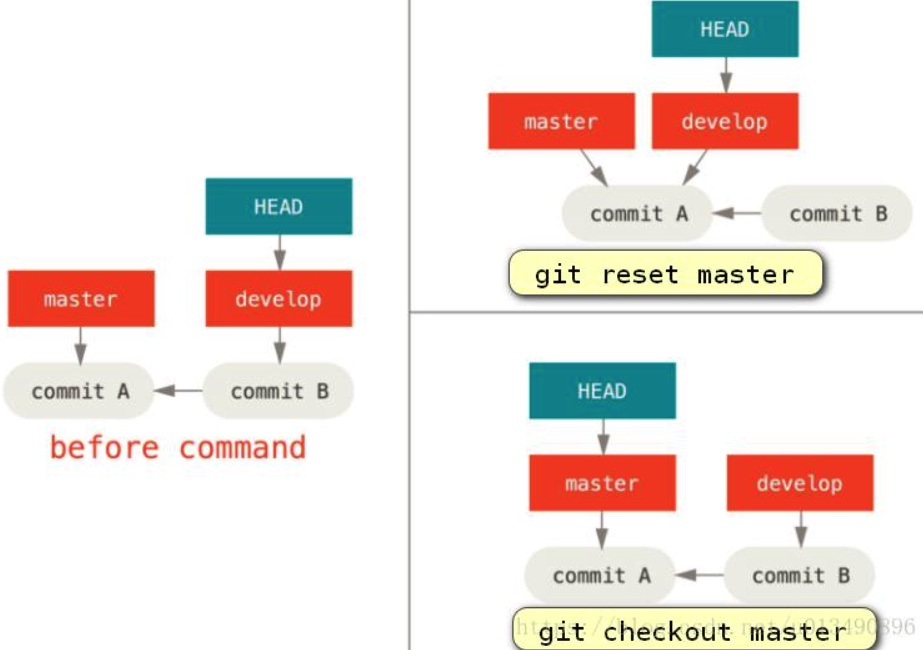
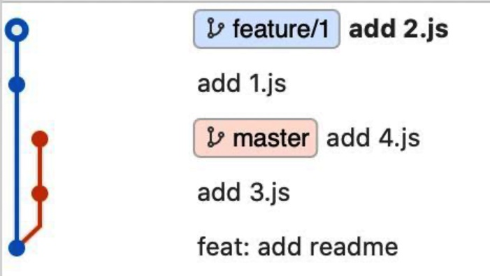
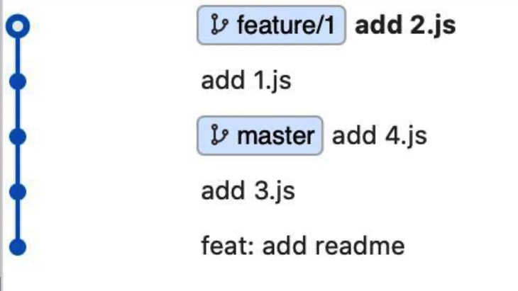

## Git 配置文件

有3个级别：

- 系统级 --system，位于/etc/gitconfig
- 用户级 --global，位于 ~/.gitconfig
- 仓库级 --local，位于 ./git/config


## Git reset 和 checkout 的区别

1. reset 是操作分支本身的，例如master，dev分支，而checkout只会改变HEAD指针。
2. reset 有 soft, mixed, hard 三种模式，checkout 则等价于hard，只不过会把修改带到新的分支。

例如，假设我们有 master 和 develop 分支，它们分别指向不同的提交（上图左边）；我们现在在 develop 上（所以 HEAD 指向它）。 如果我们运行 `git reset master`，那么 develop 会和 master 指向同一个提交； 而如果我们运行 `git checkout master` 的话，develop 不会移动，HEAD 自身会移动，指向 master。

所以，虽然在这两种情况下我们都移动 HEAD 使其指向了提交 A，但做法是非常不同的。 reset 会移动 HEAD 分支的指向，而 checkout 则移动 HEAD 自身。



reset对工作区和暂存区的修改有3种模式：mixed(默认), soft, hard

+ soft：回退到指定 commit id ，保留工作目录和暂存区中的内容，并把重置 HEAD 所带来的新的差异放进暂存区。也就是说，此时如果我们再次commit，则又会得到一个与暂存区相同的版本。
+ mixed: 回退到指定 commit id ，保留工作目录，并且清空暂存区。也就是说，工作目录的修改、暂存区的内容以及由 reset 所导致的新的文件差异，都会被放进工作目录。简而言之，就是把所有差异都混合（mixed）放在工作目录中。
+ hard：回退到指定 commit id 并且将回退后的代码全部放入到暂存区和工作区。注意，如果工作区中有尚未提交的代码，那么这个操作会导致永久失去那些代码。


## Git merge 和 rebase 的区别

merge 和 rebase 是合并分支时的两种策略。

### merge

通常，我们切换到master分支上，然后把其他分支合并到master ：

```shell
git merge dev
```

这会新创建一个提交，master指向这个新提交，而dev不变。这个新提交是由旧master和dev共同指向的，因此会在版本树中造成棱形。此外，merge只需要处理一次冲突即可。

### rebase

首先，我们说每个分支都有一个基，就是它从master分离出来的那次提交，也就是他和master的公共祖先。

假设我们在分支A，它和分支B有公共祖先：提交X。那么我们在分支A上使用：

```shell
git rebase B
```

则会使得版本树先撤销A到X之间的所有提交，然后B上重做这些提交。这样总的提交数不变，分支B指向的提交也不变，但分支A指向的提交已经是基于B之后更新的了。我们的提交记录就会非常清晰，没有分叉。

rebase 的过程中会产生冲突的，此时，就需要手动解决冲突，然后使用git add 、git rebase --continue的方式来处理冲突，完成 rebase，如果不想要某次 rebase 的结果，那么需要使用 git rebase --skip来跳过这次 rebase。


例如，假设我们现在有2条分支，一个为 master ，一个为 feature/1，他们都基于初始的一个提交add readme进行检出分支，之后，master分支增加了3.js,和4.js的文件，分别进行了2次提交，feature/1也增加了1.js和2.js的文件，分别对应以下2条提交记录。



此时，切换到 **feature/1** 分支下，执行 `git rebase master` ,成功之后，通过 log 查看记录。

如下图所示：可以看到先是逐个应用了 mater 分支的更改，然后以 master 分支最后的提交作为基点，再逐个应用 feature/1的每个更改。




## Git pull.rebase

在使用pull时，有3种模式：

- --rebase：等价于先fetch，然后rebase
- --no-rebase：等价于先fetch，然后merge
- --ff-only：只使用fast-forward合并策略

可以在配置中指定 pull.default 来设置默认的合并策略

- git config --global pull.rebase true ：使用rebase
- git config --global pull.rebase false ：使用merge


## Git push.default

push.default 是一个配置项，用于定义在push时不指定源分支和目的分支时的策略。在Git 2.0之前默认是matching，2.0之后是simple。

- nothing：不推任何东西
- matching：推送所有本地和远程都存在的同名分支
- upstream：源分支为当前分支，目的分支是它的upstream分支
- simple：在upstream上添加限制，如果源分支与目的分支名字不同，则不推
- current：源分支是当前分支，目的分支是远端中与源分支同名的分支

如果指定源分支，但不指定目的分支，则情况比较特殊，只有在upstream模式下，目的分支是其追踪的远端分支，其他模式下目的分支都是与其同名的远端分支（没有则创建）。


## 提交流程

### 1. rebase

1. 提交本地所有修改
2. git pull origin master --rebase 拉去远端最新改动并merge到本地master
3. 解决冲突并完成merge
4. 撤销上次提交
5. 只提交需要推送的修改并push

### 2.merge

1. 本地提交需要推送的修改
2. 不需要提交的修改入栈 git stash
3. 拉远端代码，采取merge策略 git pull origin master --no-rebase
4. 解决冲突，提交commit
5. 推到远端 git push origin master:zhanghao_dev
6. 恢复未提交的修改 git stash apply
7. 解决冲突 git add
8. 取消暂存 git reset --mixed master


