# 12.并发

[TOC]

多线程程序在更低一层扩展了多任务的概念:单个程序看起来在同时完成多个任务。每个任务在一个线程(thread) 中执行，线程是控制线程的简称。如果一个程序可以同时运行多个线程，则称这个程序是多线程的 (multithreaded) 。

温馨提示:多线程编程可能会变得相当复杂。本章涵盖了应用程序员可能需要的所有工具。尽管如此，对于更复杂的系统级程序设计，建议参看更高级的参考文献。

## 12.1 什么是线程

首先来看一个使用了两个线程的简单程序。这个程序可以在银行账户之间完成资金转账。我们使用了一个 Bank类，它可以存储给定数目的账户的余额。t ransfer方法将一定金额 从一个账户转移到另一个账户。

在第一个线程中，我们将钱从账户0转移到账户1。第二个线程将钱从账户2转移到账户3。

下面是在一个单独的线程中运行一个任务的简单过程：

1. 将执行这个任务的代码放在一个类的 run 方法中，这个类要实现 Runnable 接口。Runnable 接口非常简单，只有一个方法：

    ```java
    public interface Runnable
    {
        void run();
    }
    ```

    由于 Runnable 是一个函数式接口，所以可以用一个 lambda 表达式创建一个实例:

    ```java
    Runnable r = ()->{//task code};
    ```

2. 从这个 Runnable 对象构造一个 Thread 对象。

    ```java
    var t = new Thread(r);
    ```

3. 启动线程。

    ```java
    t.start();
    ```

于是，上面的任务可以按下面的方式实现。

```java
package threads;

public class ThreadTest
{
    public static final int DELAY = 10；
    public static final int STEPS = 100;
    public static final double MAX_AMOUNT = 1000；

    public static void main(String[] args)
    {
        var bank = new Bank(4, 100000)；
        Runnable task1 = () ->
        {
            try 
            {
                for (int i=0; i<STEPS; i++)
                {
                    double amount = MAX_ANOUNT*Math.random()；
                    bank.transfer(0, 1, amount);
                    Thread.sleep((int)(DELAY * Math.random()));
                }
            }
            catch(InterruptedException e)
            {}
        };
        Runnable task2 = () ->
        {
            try 
            {
                for (int i=0; i<STEPS; i++)
                {
                    double amount = MAX_ANOUNT*Math.random()；
                    bank.transfer(2, 3, amount);
                    Thread.sleep((int)(DELAY * Math.random()));
                }
            }
            catch(InterruptedException e)
            {}
        };
        new Thread(task1).start();
        new Thread(task2).start();
    }
}
```

这里我们捕获sleep方法可能抛出的InterruptedException异常。一般来说，中断用来请求终止一个线程。相应地，出现 InterruptedException 时，run 方法会退出。

```java
java.lang.Thread
    
Thread(Runnable target) //构造一个新线程
void start() //启动该线程，从而调用run方法。这个方法会立即返回，新线程会并发运行
void run() //调用相关Runnable的run方法
static void sleep(long millis) //休眠指定的毫秒数
    
java.lang.Runnable
void run()
```


## 12.2 线程状态

线程可以有如下 6 种状态:

+ New（新建）
+ Runnable（可运行）
+ Blocked（阻塞）
+ Waiting（等待）
+ Timed waiting（计时等待）
+ Terminated（终止）

下面分别对每一种状态进行解释。要确定一个线程的当前状态，只需要调用 getState 方法。各种线程之间的转换关系如下图所示。

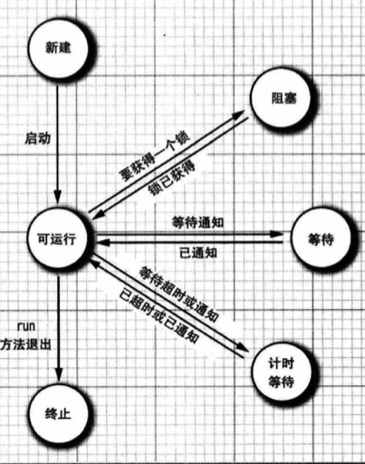


### 12.2.1 新建线程

当用 new 操作符创建一个新线程时，如 new Thread(r), 这个线程还没有开始运行。这意味着它的状态是新建(new)。当一个线程处于新建状态时，程序还没有开始运行线程中的代码。在线程运行之前还有一些基础工作要做。


### 12.2.2 可运行线程

一旦调用 start 方法，线程就处于可运行 (runnable) 状态。一个可运行的线程可能正在 运行也可能没有运行。要由操作系统为线程提供具体的运行时间。(不过，Java 规范没有将正在运行作为一个单独的状态。一个正在运行的线程仍然处于可运行状态。)

一旦一个线程开始运行，它不一定始终保持运行。事实上，运行中的线程有时需要暂 停，让其他线程有机会运行。线程调度的细节依赖于操作系统提供的服务。抢占式调度系统给每一个可运行线程一个时间片来执行任务。当时间片用完时，操作系统剥夺该线程的运行权，并给另一个线程一个机会来运行。

现在所有的桌面以及服务器操作系统都使用抢占式调度。但是，像手机这样的小型设备 可能使用协作式调度。在这样的设备中，一个线程只有在调用yield方法或者被阻塞或等待时才失去控制权。

```java
java.lang.Thread
static void yield() //使当前正在执行的线程向另一个线程交出运行权
```


### 12.2.3 阻塞和等待线程

当线程处于阻塞或等待状态时，它暂时是不活动的。它不运行任何代码，而且消耗最少的资源。要由线程调度器重新激活这个线程。具体细节取决于它是怎样到达非活动状态的。

+ 当一个线程试图获取一个内部的对象锁(而不是java.util.concurrent库中的Lock), 而这个锁目前被其他线程占有，该线程就会被阻塞(我们将在 12.4.3节讨论java.util.concurrent锁，在12.4.5节讨论内部对象锁)。当所有其他线程都释放了这个锁，并且线程调度器允许该线程持有这个锁时，它将变成非阻塞状态。
+ 当线程等待另一个线程通知调度器出现一个条件时，这个线程会进入等待状态。我们会在12.4.4节讨论条件。调用Object.wait方法或Thread.join方法，或者是等待java.util.concurrent库中的 Lock或 Condition 时，就会出现这种情况。实际上，阻塞状态与等待状态并没有太大区别。
+ 有几个方法有超时参数，调用这些方法会让线程进入计时等待(timed waiting)状
    态。这一状态将一直保持到超时期满或者接收到适当的通知。带有超时参数的方法有Thread.sleep和计时版的 Object.wait、Thread.join、Lock.tryLock 以及 Condition.await。


### 12.2.4 终止线程

线程会由于以下两个原因之一而终止:

+ run 方法正常退出，线程自然终止。
+ 因为一个没有捕获的异常终止了 run 方法，使线程意外终止。

具体来说，可以调用线程的 stop 方法杀死一个线程。该方法抛出一个 ThreadDeath 错误对象，这会杀死线程。不过，stop方法巳经废弃，不要在你自己的代码中调用这个方法。

```java
java.lang.Thread
    
void join() //等待终止指定的线程
void join(long millis) //等待指定的线程终止或者等待经过指定的毫秒数。
Thread.State getState() //得到这个线程的状态；取值为 NEW、 RUNNABLE、 BLOCKED、 WAITING、 TIMED_WAITING 或 TERMINATED。
void stop() //停止该线程。这个方法已经废弃。
void suspend() //暂停这个线程的执行。这个方法巳经废弃。
void resume() //恢复线程。这个方法只能在调用suspend之后使用,已经废弃。
```


## 12.3 线程属性

下面几节将讨论线程的各种属性，包括中断的状态、守护线程、未捕获异常的处理器以及不应使用的一些遗留特性。


### 12.3.1 中断线程

当线程的 run 方法执行方法体中最后一条语句后再执行 return 语句返回时，或者出现了方法中没有捕获的异常时，线程将终止。在Java 的早期版本中，还有一个 stop 方法，其他线程可以调用这个方法来终止一个线程。但是，这个方法现在已经被废弃了。 12.4.13 节将讨论它被废弃的缘由。

除了已经被废弃的 stop 方法，没有办法可以强制终止线程。不过，interrupt 方法可以用来请求终止一个线程。

当对一个线程调用 interrupt 方法时，就会设置线程的中断状态。这是每个线程都有的 boolean 标志。每个线程都应该不时地检查这个标志，以判断线程是否被中断。可以使用如下的调用检测：

```java
while(!Thread.currentThread().isInterrupted())
{
    // do more work
}
```

但是，如果线程被阻塞，就无法检查中断状态。这里就要引入 InterruptedException 异常。 当在一个被 sleep 或 wait 调用阻塞的线程上调用 interrupt 方法时，那个阻塞调用(即 sleep 或 wait 调用)将被一个 InterruptedException 异常中断。(有一些阻塞 1/0 调用不能被中断，对此应该考虑选择可中断的调用。有关细节请参看卷 II 的第 2 章和第 4 章。)

中断一个线程只是要引起它的注意。被中断的线程可以决定如何响应中断。某些线程非常重要，所以应该处理这个异常，然后再继续执行。但是，更普遍的清况是，线程只希望将中断解释为一个终止请求。这种线程的 run 方法具有如下形式:

```java
Runnable r  = () -> {
    try
    {
        while(!Thread.currentThread().isInterrupted() && moreWorkToDo)
        {
            // do more work
        }
    }
    catch(InterruptedException e)
    {
        // thread was interrupted during sleep or wait
    }
    finally
    {
        // clean up
    }
}
```

如果在每次工作迭代之后都调用 sleep 方法(或者其他可中断方法)，isInterrupted 检查既没有必要也没有用处。如果设置了中断状态，此时倘若调用 sleep 方法，它不会休眠。实际上，它会清除中断状态并抛出 InterruptedException。因此，如果你的循环调用了 sleep, 不需要检测中断状态，而应当捕获 InterruptedException异常。

```java
java.lang.Thread
    
void interrupt() 
//向线程发送中断请求。线程的中断状态将被设置为 true。如果当前该线程被一个 sleep 调用阻塞，则抛出一个 InterruptedException 异常
    
static boolean interrupted() 
//测试当前线程(即正在执行这个指令的线程)是否被中断。注意，这是一个静态方法。 这个调用有一个副作用, 它将当前线程的中断状态重置为 false。
    
boolean isInterrupted() 
//测试线程是否被中断。与 static interrupted 方法不同，这个调用不改变线程的中断状态。
    
static Thread currentThread() 
//返回表示当前正在执行的线程的Thread对象
```


### 12.3.2 守护线程

可以在启动线程之前进行如下调用将一个线程转换为守护线程（daemon thread）。

```java
t.setDaemon(true);
```

这样一个线程并没有什么魔力。守护线程的唯一用途是为其他线程提供服务。计时器线程就是一个例子，它定时地发送”计时器嘀嗒“信号给其他线程，另外清空过时缓存项的线程也是守护线程。当只剩下守护线程时，虚拟机就会退出。因为如果只剩下守护线程，就没必要继续运行程序了。

```java
java.lang.Thread

void setDaemon(boolean isDaemon)
//标识该线程为守护线程或用户线程。这一方法必须在线程启动之前调用。
```


### 12.3.3 线程名

默认情况下，线程有容易记的名字，如 Thread-2。可以用 setName 方法为线程设置任何名字:

```java
var t = new Thread(runnable);
t.setName("Web crawler");
```

这在线程转储时可能很有用。


### 12.3.4 未捕获异常的处理器

线程的 run 方法不能抛出任何检查型异常，但是，非检查型异常可能会导致线程终止。 在这种情况下，线程会死亡。

不过，对于可以传播的异常，并没有任何 catch 子句。实际上，在线程死亡之前，异常会传递到一个用于处理未捕获异常的处理器。这个处理器必须属于一个实现了 Thread.UncaughtExceptionHandler 接口的类。这个接口只有一个方法：

```java
void uncaughtException(Thread t, Throwable e)
```

可以用 setUncaughtExceptionHandler 方法为任何线程安装一个处理器。也可以用 Thread 类的静态方法 setDefaultUncaughtExceptionHandler 为所有线程安装一个默认的处理器。替代处理器可以使用日志 API 将未捕获异常的报告发送到一个日志文件。

如果没有安装默认处理器，默认处理器则为 null。但是，如果没有为单个线程安装处理器，那么处理器就是该线程的 ThreadGroup 对象。

>线程组是可以一起管理的线程的集合。默认情况下，创建的所有线程都属于同一个线程组，但是也可以建立其他的组。由于现在引入了更好的特性来处理线程集合，所以建议不要在你自己的程序中使用线程组。

ThreadGroup类实现了 Thread.UncaughtExceptionHandler 接口。它的 uncaughtException 方法执行以下操作:

1. 如果该线程组有父线程组，那么调用父线程组的 uncaughtException 方法。

2. 否则，如果 Thread.getDefaultExceptionltandler 方法返回一个非 null 的处理器，则调用该处理器。
3. 否则，如果 Throwable 是 ThreadDeath 的一个实例，什么都不做。
4. 否则，将线程的名字以及 Throwable 的栈轨迹输出到 System.err。


### 12.3.5 线程优先级

在 Java 中每一个线程有一个优先级。默认情况下，一个线程会继承构造它的那个线程的优先级。可以用 setPriority 方法提高或降低任何一个线程的优先级。可以将优先级设置为 MIN_PRIORITY (在 Thread类中定义为 1) 与MAX_PRIORITY (定义为 10) 之间的任何值。 NORM_PRIORITY 定义为 5。

每当线程调度器有机会选择新线程时，它首先选择具有较高优先级的线程。但是，线程优先级高度依赖于系统。当虚拟机依赖于宿主机平台的线程实现时，Java 线程的优先级会映射到宿主机平台的优先级，平台的线程优先级别可能比上述的10个级别多，也可能更少。

在没有使用操作系统线程的 Java 早期版本中，线程优先级可能很有用。不过现在不要使用线程优先级了。

```java
java.lang.Thread
    
void setPriority(int newPriority)
//设置线程的优先级。优先级必须在 Thread.MIN_PRIORITY 与 Thread.MAX_PRIORITY 之间。
```


## 12.4 同步

在大多数实际的多线程应用中，两个或两个以上的线程需要共享对同一数据的存取。如果两个线程存取同一个对象，并且每个线程分别调用了一个修改该对象状态的方法，这两个线程就会相互覆盖，取决于线程访问数据的次序，可能会导致对象被破坏。这种情况通常称为竞态条件 (race condition)。

### 12.4.1 竞态条件的一个例子

在12.1节中我们模拟过银行的转账。在这节中，我们随机地选择从哪个账户转账到另一个账户。

```java
Runnable r = () ->{
    try
    {
        while (true)
        {
            int toAccount = (int) (bank.size() * Math.random());
            double amount = MAX_AMOUNT * Math.random();
            bank.transfer(fromAccount, toAccount, amount);
            Thread.sleep( (int) (DELAY * Math.random() ));
        }
    }
    catch (InterruptedException e)
    {}
 };
```

这个模拟程序运行时，会打印所有账户的总金额。当运行一段时间后，我们会发现总金额发生了变化。这是因为竞态条件导致的程序错误。


### 12.4.2 竞态条件详解

上一节中运行了一个程序，其中有儿个线程会更新银行账户余额。一段时间之后，不知不觉地出现了错误，可能有些钱会丢失，也可能几个账户同时有钱进账。当两个线程试图同时更新同一个账户时，就会出现这个问题。

问题在于更新账户的金额不是原子操作，线程在更新中途可能会被抢占。

transfer方法可能会在执行到中间时被中断。如果能够确保线程失去控制之前方法已经运行完成，那么银行账户对象的状态就不会被破坏。


### 12.4.3 锁对象

有两种机制可防止并发访问代码块。Java语言提供了一个 synchronized 关键字来达到这一 目的，另外Java 5 引入了 Reentrantlock类。 我们会在 12.4.5节介绍 synchronized 关键字。

用 ReentrantLock 保护代码块的基本结构如下：

```java
myLock.lock(); // a ReentrantLock object
try{
    // critical section
}
finally
{
    myLock.unlock(); // make sure the lock is unlocked even if an exception is thrown
}
```

这个结构确保任何时刻只有一个线程进入临界区。一旦一个线程锁定了锁对象，其他任何线程都无法通过 lock语句。当其他线程询用 lock 时，它们会暂停，直到第一个线程释放这个锁对象。

>警告：要把 unlock 操作包括在 finally 子句中，这一点至关重要。如果在临界区的代码抛出一个异常，锁必须释放。否则，其他线程将永远阻塞。

 >注释：不能使用 try-witb-resources 语句且把锁的申请放在try的小括号中。首先，解锁方法名不是 close。不过，即使将它重命名，try-with-resources 语句也无法正常工作。它的首部希望声明一个新变量。但是如果使用一个锁，你可能想使用多个线程共享的那个变量（而不是新变量）。

下面是使用一个锁来保护Bank类的transfer方法。

```java
public class Bank
{
    private var bankLock = new ReentrantLock();

    public void transfer(int from, int to, int amount)
    {
    	bankLock.Lock();
    	try
        {
            System.out.print(Thread.currentThread());
            accounts[from] -= amount;
            System.out.printf(" %10.2f from sd to %d", amount, from, to);
            accounts[to] += amount；
            System.out.printf(" Total Balance: %10.2f%n", getTotalBalance());
        }
        finally
        {
            bankLock.unlock()；
        }
    }
}
```

现在一个线程调用了 transfer, 但是在执行结束前被抢占。假设第二个线程也调用了transfer, 由于第二个线程不能获得锁，将在调用 lock方法时被阻塞。它会暂停，必须等待第一个线程执行完 transfer方法。

注意，每个Bank对象都有一个ReentrantLock对象，不同的线程只有对同一个Bank对象申请锁时才会被串行化，不同的Bank的对象之间是互不影响的。

这个锁称为可重入(reentrant)锁，因为线程可以反复获得已拥有的锁。锁有一个持有计数 (hold count)来跟踪对 lock 方法的嵌套调用。线程每一次调用 lock 后都要调用 unlock 来释放锁。由于这个特性，被一个锁保护的代码可以调用另一个使用相同锁的方法。例如，transfer 方法调用 getTotalBalance 方法，这也会封锁 banklock 对象，此时 banklock 对象的持有计数为 2。当 getTotalBalance 方法退出时，持有计数变回 1。当 transfer 方法退出的时候，持有计数变为0, 线程释放锁。

ReentrantLock 的构造函数：

```java
public ReentrantLock() {
  sync = new NonfairSync(); // 默认使用非公平锁
}
 
public ReentrantLock(boolean fair) {
  sync = fair ? new FairSync() : new NonfairSync(); //如果fair是true，则使用公平锁
}
```

>公平锁：指多个线程按照申请锁的顺序来获取锁，线程直接进入队列中排队，队列中的第一个线程才能获得锁。
>
>非公平锁：线程加锁时直接尝试获取锁，能抢到锁到直接占有锁，抢不到才会到等待队列的队尾等待。


### 12.4.4 条件对象

有了上面介绍的重入锁，能处理一部分同步问题，但还有些问题无法解决。通常，线程进入临界区后并不是一定能执行的，可能需要满足一定的条件才能执行，例如上面的银行转账例子中，源账户的余额必须不少于转账金额，线程才能够继续执行。此时，我们应该让线程在这个条件上挂起，因为如果它不挂起，其他线程也无法执行，也不会有其他线程将金额转入当前账户，那么就会发生死锁。

我们可以使用条件对象来解决这个问题。

我们可以在一个锁对象上关联一个或多个条件对象。当线程需要的条件不满足时，我们在这个条件对象上调用 await 方法，线程会自动释放与之相关联的锁，并将当前线程加入该条件对象的等待集(wait set)，然后挂起。当有其他线程完成某个操作，可能会导致这个条件满足时，它会在这个条件对象上调用 signalAll 方法，这会使得该条件对象的等待集中的所有线程被激活。注意，这里只是接触这些线程的阻塞状态，在执行之前，它们还要竞争该条件对象关联的锁，只有获得锁的线程可以继续运行，然后它会继续判断之前的条件，如果满足则执行，如果仍不满足则又会调用await来释放锁，让其他线程竞争执行权。

另外，线程激活条件对象时也可能使用 signal 方法，它只从等待集中随机挑选一个线程唤醒，这很有效率，但也非常危险，因为其他线程也没有被唤醒，那么所有线程都将挂起，没有线程可能再发出signal，形成死锁。因此，只要一个对象的状态有变化，而且可能有利于等待的线程，就可以调用 signalAll。

可以使用 newCondition 方法在一个锁对象上关联条件对象：

```java
class Bank
{
    private Condition sufficientFunds;
	private Lock bankLock;
    ...
    public Bank()
    {
        ...
        sufficientFunds = bankLock.newCondition();
    }
}
```

通常，可以在一个循环的条件中检测条件，然后在循环中进行 await：

```java
while(!(OK to proceed))
	condition.await();
```

下面是使用条件变量改进的银行转账模拟程序：

```java
public void transfer(int from, int to, int amount)
{
    bankLock.lock()
	try
    {
        while (accounts[from] < amount) //条件不满足
            sufficientFunds.await(); //将线程加入条件对象的等待集，释放锁，然后挂起
        //transfer funds
        ...
        sufficientFunds.signalAll(); //唤醒该条件对象的等待集中的线程
    }
	finally
    {
		bankLock.unlock()；
    }
}
```

综上，正确使用条件对象不是一件简单的事。因此，你可以考虑使用12.5节中介绍的结构。

```java
java.util.concurrent.locks.Lock
    
Condition newCondition()
//返回一个与这个锁相关联的条件对象。
    
java.util.concurrent.locks.Condition

void await()
//将该线程放在这个条件的等待集中。
    
boolean await(long time, TimeUnit unit) throws InterruptedException;
//放入等待集，但是超过指定时间会自动唤醒

void signalAll()
//解除该条件等待集中所有线程的阻塞状态。

void signal()
//从该条件的等待集中随机选择一个线程，解除其阻塞状态。
```


### 12.4.5 synchronized 关键字

我们已经了解了如何使用Lock和Condition对象。现在对锁和条件做一个总结：

+ 锁用来保护代码片段，一次只能有一个线程执行被保护的代码。
+ 锁可以管理试图进人被保护代码段的线程。
+ 一个锁可以有一个或多个相关联的条件对象。
+ 每个条件对象管理那些已经进入被保护代码段但还不能运行的线程。

Lock 和 Condition 接口允许程序员充分控制锁定。不过，大多数情况下，你并不需要那样控制，完全可以使用 Java 语言内置的一种机制。从1.0版开始，Java 中的每个对象都有一个内部锁。如果一个方法声明时有 synchronized 关键字，那么对象的锁将保护整个方法。也就是说，要调用这个方法，线程必须获得内部对象锁。

也就是说

```java
public synchronized void method()
{
    //method body
}
```

等价于

```java
public void method()
{
    this.intrinsicLock.lock();
    try
    {
        //method body
    }
    finally
    {
        this.intrinsicLock.unlock();
    }
}
```

内部对象锁只有一个关联条件，称为内部条件。wait 方法将当前线程加到内部条件的等待集中，notifyAll /notify方法可以解除等待线程的阻塞。换句话说，调用 wait 或 notifyAll 等价于以下调用：

```java
intrinsicCondition.await();
intrinsicCondition.signalAll();
```

>注释：wait、notifyAll 以及 notify 方法是 Object 类的 final 方法。Condition 方法必须命名为 await、 signalAll 和 signal，从而不会与那些方法发生冲突。

现在，用 synchronized 关键字改写上一节的代码：

```java
class Bank
{
    private double[] accounts;
    public synchronized void transfer(int from, int to, int amount) 
        throws InterruptedException
    {
        while(accounts[from]<amount)
            wait(); // wait on intrinsic object lock's single condition
        accounts[from] -= amount;
        accounts[to] += amount;
        notifyAll(); // notify all threads waiting on the condition
    }
    ...
}
```

可以看到，使用 synchronized 关键字可以得到更为简洁的代码。当然，要理解这个代码，必须知道每个对象都有一个内部锁，并且这个锁有一个内部条件。这个锁会管理试图进入 synchronized 方法的线程，这个条件可以管理调用了 wait 的线程。

将静态方法声明为同步也是合法的。如果调用这样一个方法，它会获得相关类对象的内部锁。例如，如果 Bank 类有一个静态同步方法，那么当调用这个方法时，Bank.class 对象的锁会锁定。因此，没有其他线程可以调用这个类的该方法或任何其他同步静态方法。

内部锁和条件存在一些限制。包括：

+ 不能中断一个正在尝试获得锁的线程。
+ 不能指定尝试获得锁时的超时时间。
+ 每个锁仅有一个条件可能是不够的。

在代码中应该使用哪一种做法呢？Lock 和 Condition 对象还是同步方法？下面是我们的一些建议：

+ 最好既不使用 Lock/Condition 也不使用 synchronized 关键字。在许多情况下，可以使用 java.utiL.concurrent 包中的某种机制，它会为你处理所有的锁定。例如，在12.5.1节中，你会看到如何使用阻塞队列来同步完成一个共同任务的线程。
+ 如果 synchronized 关键字适合你的程序，那么尽量使用这种做法，这样可以减少编写的代码量，还能减少出错的概率。
+ 如果特别需要 Lock/Condition 结构提供的额外能力，则使用 Lock/Condition。

```java
java.lang.Object
    
void notifyAll()
//解除在这个对象上调用 wait 方法的那些线程的阻塞状态。该方法只能在同步方法或同步块中调用。如果当前线程不是对象锁的所有者，该方法会抛出一个 IllegalMonitorStateException 异常。
    
void notify()
//随机选择一个在这个对象上调用 wait 方法的线程，解除其阻塞状态。该方法只能在一个同步方法或同步块中调用。如果当前线程不是对象锁的所有者，该方法会抛出一个 IllegalMonitorStateException 异常。

void wait()
//导致一个线程进入等待状态，直到它得到通知。该方法只能在一个同步方法或同步块中调用。如果当前线程不是对象锁的所有者，该方法会抛出一个 IllegalMonitorStateException 异常。

void wait(long millis)
void wait(long millis, int nanos)
//导致一个线程进人等待状态，直到它得到通知或者经过了指定的时间。这些方法只能在一个同步方法或同步块中调用。如果当前线程不是对象锁的所有者，这些方法会抛出 IllegalMonitorStateException 异常。纳秒数不能超过1 000 000。
```


### 12.4.6 同步块

正如刚刚讨论的，每一个Java对象都有一个锁。线程可以通过调用同步方法获得锁。还有另一种机制可以获得锁:即进入一个同步块。当线程进入如下形式的块时，它会获得obj的锁。

```java
synchronized(obj) //this is the syntax for a synchronized block
{
    // critical section
}
```

有时我们会发现一些“专用”锁，例如：

```java
public class Bank
{
    private double[] accounts;
    private var lock = new Object();
    public void transfer(int from, int to, int amount)
    {
        synchronized(lock) // an ad-hoc lock
        {
            acounts[from] -= amount;
            acounts[to] += amount;
        }
    }
}
```

在这里，创建lock对象只是为了使用每个Java对象都拥有的锁。

有时程序员使用一个对象的锁来实现额外的原子操作，这种做法称为客户端锁定(client-side locking)。例如，考虑 Vector类，这是一个列表，它的方法是同步的。现在，假设我们将银行余额存储在一个 Vector\<Double\> 中。下面是 transfer 方法的一个原生实现：

```java
public void transfer(Vector<Double> accounts, int from, int to, int amount) // ERROR
{
    accounts.set(from, accounts.get(from)-amount);
    accounts.set(to, accounts.get(to)+amount);
}
```

在第一次调用get方法后，线程可能被抢占，另一个线程在相同位置所做的操作将会失效。因此我们可以使用客户端锁定的方法，为这个操作加锁：

```java
public void transfer(Vector<Double> accounts, int from, int to, int amount)
{
	synchronized(accounts)
    {
        accounts.set(from, accounts.get(from)-amount);
        accounts.set(to, accounts.get(to)+amount);
    }
}
```

这个方法是可行的，但是完全依赖于这样一个事实：Vector 类会对自己的所有更改方法使用内部锁。因为如果另外一个线程对这个对象进行操作，且使用了另一个锁，那么显然临界区没有被锁住。那么Vector类会对所有方法使用内部锁吗？Vector 类的文档没有给出这样的承诺。你必须仔细研究源代码，而且还得希望将来的版本不会引人非同步的更改方法。可以看到，客户端锁定是非常脆弱的，通常不推荐使用。


### 12.4.7 监视器概念

锁和条件是实现线程同步的强大工具，但是，严格地讲，它们不是面向对象的。多年来，研究人员在努力寻找方法，希望不要求程序员考虑显式锁就可以保证多线程的安全性。

最成功的解决方案之一是监视器（monitor)。用 Java 的术语来讲，监视器具有如下特性：

+ 监视器是只包含私有字段的类。
+ 监视器类的每个对象有一个关联的锁。
+ 所有方法由这个锁锁定。换句话说，如果客户端调用 obj.method()，那么 obj 对象的锁在方法调用开始时自动获得，并且当方法返回时自动释放该锁。因为所有的字段是私有的，这样的安排可以确保一个线程处理字段时，没有其他线程能够访问这些字段。
+ 锁可以有任意多个相关联的条件。

Java 设计者以不太严格的方式采用了监视器概念，Java 中的每一个对象都有一个内部锁和一个内部条件。如果一个方法用 synchronized 关键字声明，那么，它表现得就像是一个监视器方法。可以通过调用 wait/notifyAll/notify 来访问条件变量。不过，Java 对象在以下3个重要方面不同于监视器，这削弱了线程的安全性：

+ 字段不要求是private
+ 方法不要求是synchronized
+ 内部锁对客户是可用的


### 12.4.8 volatile字段

有时，如果只是为了读写一两个实例字段而使用同步，所带来的开销好像有些划不来。

volatile关键字为实例字段的同步访问提供了一种免锁机制。

```java
private volatile boolean done;
public boolean isDone() {return done;}
public void setDone() {done=true;}
```

如果声明一个字段为volatile，那么所有对该字段的读写操作都会发生如下变化：

+ 所有写操作在完成后，都会立即同步到主内存，而不是在先保存在线程的工作内存。
+ 所有读操作都会从主内存去读最新的值，而不是工作内存中的缓存。

注意，这种机制能够保证 volatile 字段具有可见性，但不能保证原子性。注意，这里可见性是指 volatile 变量对所有线程是立即可见的，对 volatile 变量所有的写操作都能立刻反应到其他线程之中。但是，它不能保证原子性，即对 volatile 变量的运算在并发环境下可能是不安全的。

>假设变量num被声明为volatile。那么指令“num++”在并发环境下是不安全的。该指令不是原子操作，编译后有3步操作：
>
>1. 读取num的值；
>2. 将该值加1；
>3. 将结果写回num。
>
>假设线程1要执行这条指令。那么当它执行到第一步时，由于volatile的机制，它读到的是最新的num值。在它进行第二步计算后，线程2抢占了执行权，线程2对num值进行了修改，最后回到线程1，线程1已经完成了计算，写回num。显然这样一来，线程2的操作就失效了。

由于 volatile 只能保证可见性，不能保证原子性，所以只有在满足如下条件时才能使用该关键字。

+ 变量的运算结果并不依赖变量的当前值，或者能够确保只有单一的线程修改变量的值。

举个例子，可以使用 volatile 来修饰状态标记量，使得状态标记量对所有线程是实时可见的，从而保证所有线程都能实时获取到最新的状态标记量，进一步决定是否进行操作。例如常见的促销活动“秒杀”，可以用 volatile 来修饰“是否售罄”字段，从而保证在并发下，能正确的处理商品是否售罄。


### 12.4.9 final变量

上一节已经了解到，除非使用锁或 volatile 修饰符，否则无法从多个线程安全地读取一个字段。

还有一种情况可以安全地访问一个共享字段，即这个字段声明为 final 时。考虑以下声明：

```java
final var accounts = new HashMap<String, Double>();
```

其他线程会在构造器完成构造之后才看到这个 accounts 变量。如果不使用 final，就不能保证其他线程看到的是 accounts 更新后的值，它们可能都只是看到 null，而不是新构造的 HashMap。

当然，final只限定了 accounts 永远引用一个HashMap，但对这个映射的操作并不是线程安全的。如果有多个线程更改和读取这个映射，仍然需要进行同步。


### 12.4.10 原子性

假设对共享变量除了赋值之外并不做其他操作，那么可以将这些共享变量声明为 volatile。

java.util.concurrent.atomic 包中有很多类使用了很高效的机器级指令（而没有使用锁）来保证其他操作的原子性。例如，AtomicInteger 类提供了方法 increnentAndGet 和 decrenentAndGet, 它们分别以原子方式将一个整数进行自增或自减。例如，可以安全地生成一个数值序列，如下所示：

```java
public static AtomicLong nextNumebr = new AtomicLong();
// in some thread...
long id = nextNumebr.incrementAndGet();
```

increnentAndGet 方法以原子方式将 AtomicLong 自增，并返回自增后的值。也就是说，获得值、增1并设置然后生成新值的操作不会中断。可以保证即使是多个线程并发地访问同一个实例，也会计算并返回正确的值。

实际上，可以提供一个 lambda 表达式更新变量，它会为你完成更新。在下面的例子中，我们给update提供一个lambda表达式，其中x是largest变量原本的值，即largest.get()得到的值。

```java
public static AtomicLong largest = new AtomicLong();
largest.updateAndGet(x -> Math.max(x, observed));
```

如果有大量线程要访问相同的原子值，性能会大幅下降，因为乐观更新需要太多次重试。LongAader 和LongAccumulator 类解决了这个问题。LongAdder 包括多个变量（加数），其总和为当前值。可以有多个线程更新不同的加数，线程个数增加时会自动提供新的加数。通常情况下，只有当所有工作都完成之后才需要总和的值，对于这种情况，这种方法会很高效。性能会有显著的提升。例如有一个计数器，许多线程会对其做递增操作，那么使用LondAdder 可以显著提高性能。


### 12.4.11 死锁

锁和条件不能解决多线程中可能出现的所有问题。有些问题是逻辑死锁，例如：

1. 账户1: ¥200
2. 账户2: ¥300
3. 线程1:从账户1转¥300到帐户2
4. 线程2:从账户2转¥400到帐户1

显然，两个线程都将会被阻塞且死锁。

还有一种很容易导致死锁的情况，即最后一个活动的线程用signal方法唤醒了一个不能继续运行的线程（仍有条件不满足），而且自己也马上被阻塞。此时所有线程都将无法被唤醒。

遗憾的是，Java 编程语言中没有任何东西可以避免或打破这种死锁。必须仔细设计程序，确保不会出现死锁。


### 12.4.12 线程局部变量

前面几节我们讨论了线程间共享变量的风险。有时候所有线程共享一个变量的同步开销过大，我们可以为每个线程创建一个线程局部变量。 ThreaLocal 辅助类提供了这种方案。

例如， SimpleDateFormat 类不是线程安全的。

```java
public static final SimpleDateformat dateformat = new SimpleDateFormat("yyyy-MM-dd");
```

如果两个线程都是用dateformat进行操作，其内部数据结构可能会被破坏。但是上锁又会严重影响性能，于是我们可以为每个线程构造一个实例：

```java
public static final ThreadLocal<SimpleDateFormat> datefFormat 
    = ThreadLocal.withInitial(() -> new SimpleDateformat("yyyy-MM-dd"));
```

要访问具体的方法，可以调用：

```java
String datestamp = dateformat.get().format(new Date());
```

在一个给定线程中首次调用 get 时，会调用构造器中的 lambda 表达式。在此之后，get方法会返回属于当前线程的那个实例。


### 12.4.13 为什么废弃stop和suspend方法

最初的 Java版本定义了一个 stop 方法来终止一个线程，以及一个 suspend 方法来阻塞一个线程直至另一个线程调用 resune。stop 和 suspend 方法有一些共同点：都试图控制一个给定线程的行为，而没有线程的互操作。

首先来看看 stop 方法，该方法会终止所有未结束的方法，包括 run 方法。当线程被终止，它会立即释放被它锁定的所有对象的锁。这会导致对象处于不一致的状态。例如，假设一个TransferRunnable 在从一个账户向另一个账户转账的过程中被终止，钱已经取出，但还没有存入目标账户，现在银行对象就被破坏了。因为锁已经被释放，其他未停止的线程也会观察到这种破坏。当一个线程要终止另一个线程时，它无法知道什么时候调用 stop 方法是安全的，而什么时候会导致对象被破坏。因此，该方法已经被废弃。希望停止一个线程的时候应该中断该线程，被中断的线程可以在安全的时候终止。

接下来看看 suspend 方法有什么问题。与 stop 不同，suspend 不会破坏对象。但是，如果 suspend 挂起一个持有锁的线程，那么，在线程恢复运行之前这个锁是不可用的。如果调用 suspend 方法的线程试图获得同一个锁，那么程序死锁：被挂起的线程等着被恢复，而将其挂起的线程等待获得锁。

第12.4节到这里就该结束了，为了理解本节介绍的锁对象的实现方式，以及为后续章节打好基础，下面补充一小节，介绍AQS。


### 12.4.14 AQS

AQS(AbstractQueuedSynchronizer) 是一个基于先进先出等待队列来实现阻塞锁和相关同步器的框架。这个类是许多使用整数来代表状态的同步器的基类。concurrent 包是基于AQS(AbstractQueuedSynchronizer) 框架的。


#### 12.4.14.1 为什么使用AQS

为什么要使用一个框架来设计锁呢？假设不使用框架，现在我们要实现一个锁，那么需要做什么呢？下面是一些需要考虑的问题：

+ 锁的状态是如何记录的，如何表示这个锁被持有的情况？
+ 如何获取锁？
+ 锁获取不到如何处理，直接返回，还是等待锁被释放？
+ 如何释放锁？
+ 锁释放后，如何唤起那些在等这个锁的线程？
+ 共享锁、排他锁、公平锁、非公平锁，这些锁的特性又该如何处理？

由此可见，直接实现一个锁还是很复杂的。JUC(java.util.concurrent) 工具包中实现了许多种类型的锁，它们都是通过继承AQS类来实现的。下面我们深入了解AQS。

不妨将我们要实现的锁的概念扩大，因为以后可能还要使用AQS实现阻塞队列等。我们统一将要实现的类称为同步组件。同步组件通常包含一个同步器，而 AQS 是同步器的父类，同步器的设计是基于模板方法模式的。也就是说，同步器需要继承AQS并重写指定的方法，随后将同步器组合在自定义同步组件的实现中，并调用同步器提供的模板方法，而这些模板方法将会调用同步器重写的方法。

上面这一段话可能看起来比较抽象，通俗地说，就是我们要实现的各种同步器有许多公共的方法，我们把这些方法提取出来，作为一个基类抽象类 AbstractQueuedSynchrronizer，同时我们留出一些方法，让各子类自己去实现不同的特性。对于我们预留的这写方法，有的同步器可能只会用到其中的一部分，为了便于开发，让子类只实现部分方法就能使用，我们将这些方法在 AQS 中全部实现为抛出异常；

```java
throw new UnsupportedOperationException();
```

如此一来，抽象类 AQS 中就没有抽象方法了，子类可以挑选自己要使用的方法进行实现，就可以直接实例化。

AQS 框架借助于两个类

- **Unsafe**：提供 CAS(Compare And Swap) 操作。

- **LockSupport**：提供park/unpark操作。其实归根结底，这个类也是调用的 UNSAFE 中的 native 方法。


#### 12.4.14.2 Unsafe

CAS 是一种原子操作，使用者要修改一个多线程共享的变量时，提供它所认为的变量的旧值和新值，CAS 方法会比较变量的实际值与提供的旧值，如果相等则将变量置为提供的新值。这可以避免因为多线程环境而导致的不一致性。CAS是项乐观锁技术，当多个线程尝试使用CAS同时更新同一个变量时，只有其中一个线程能更新变量的值，而其它线程都失败，失败的线程并不会被挂起，而是被告知这次竞争中失败，并可以再次尝试。

CAS是一条CPU的原子指令，其实现方式是基于硬件平台的汇编指令，就是说CAS是靠硬件实现的。

以 AtmoicInteger 来说明它是如何在没有锁的情况下做到对数据进行原子操作的。AtomicInteger 存储 int 值的变量用 volatile 修饰，这样可以线程间的数据是可见的。

```java
private volatile int value;
```

于是，获取变量的值可以直接读取，而不用进行同步控制：

```java
public final int get() {
    return value;
}
```

然后来看看将value加一是如何做到的。

```java
public final int incrementAndGet() {    
    for (;;) {//无限循环直到成功
        int current = get();
        int next = current + 1;
        if (compareAndSet(current, next))//与当前内存值相同返回true，不同返回false
            return next;
    }
}
```

在这里采用了CAS操作，每次从内存中读取数据然后将此数据和+1后的结果进行CAS操作，如果成功就返回结果，否则重试直到成功为止。而 compareAndSet 利用JNI(Java Native Interface)来完成CPU指令的操作。这里，Unsafe.compareAndSwapInt 就是 native 方法，对 Java 程序员来说是个黑盒。

```java
public final boolean compareAndSet(int expect, int update) {   
    return Unsafe.compareAndSwapInt(this, valueOffset, expect, update);
}
```

CAS虽然很高效的解决原子操作，但是CAS仍然存在三大问题。

1. **ABA问题。**因为CAS需要在操作值的时候检查下值有没有发生变化，如果没有发生变化则更新，但是如果一个值原来是A，变成了B，又变成了A，那么使用CAS进行检查时会发现它的值没有发生变化，但是实际上却变化了。ABA问题的解决思路就是使用版本号。在变量前面追加上版本号，每次变量更新的时候把版本号加一，那么A－B－A 就会变成1A-2B－3A。从Java1.5开始JDK的atomic包里提供了一个类AtomicStampedReference来解决ABA问题。这个类的compareAndSet方法作用是首先检查当前引用是否等于预期引用，并且当前标志是否等于预期标志，如果全部相等，则以原子方式将该引用和该标志的值设置为给定的更新值。
2. **循环时间长开销大。**自旋CAS如果长时间不成功，会给CPU带来非常大的执行开销。如果JVM能支持处理器提供的pause指令那么效率会有一定的提升，pause指令有两个作用，第一它可以延迟流水线执行指令（de-pipeline）,使CPU不会消耗过多的执行资源，延迟的时间取决于具体实现的版本，在一些处理器上延迟时间是零。第二它可以避免在退出循环的时候因内存顺序冲突（memory order violation）而引起CPU流水线被清空（CPU pipeline flush），从而提高CPU的执行效率。
3. **只能保证一个共享变量的原子操作。**当对一个共享变量执行操作时，我们可以使用循环CAS的方式来保证原子操作，但是对多个共享变量操作时，循环CAS就无法保证操作的原子性，这个时候就可以用锁，或者有一个取巧的办法，就是把多个共享变量合并成一个共享变量来操作。比如有两个共享变量i＝2,j=a，合并一下ij=2a，然后用CAS来操作ij。从Java1.5开始JDK提供了AtomicReference类来保证引用对象之间的原子性，你可以把多个变量放在一个对象里来进行CAS操作。


#### 12.4.14.3 LockSupport

LockSupport 是 package java.util.concurrent.locks 包下的类，它提供了一些静态方法，可以用来阻塞/唤醒线程。实例化这个类没有意义。

这个类主要的作用就是提供了两类方法：park/unpark。park 调用将当前线程阻塞，而 unpark(Thread thread) 调用将指定线程唤醒。park/unpark 的阻塞和唤醒逻辑是基于许可证(permit)的。它的特点是：

1. 对于每一个线程，最多保持一个permit，初始时没有permit。

2. park 方法消耗一个 permit。调用park方法时，如果线程存在一个permit，那么park方法将直接返回，否则park将阻塞。阻塞在park方法的线程将不会被线程调度器分配CPU时间，而是保持休眠。这个状态将持续到以下3种情况之一发生：

    + 某个其他线程调用了 unpark(thread)，其中thread指被阻塞的线程。unpark 将为这个线程创建一个permit并唤醒它，这个permit被阻塞的 park 方法消耗即可解除阻塞。

    + 某个其他线程中断了这个线程。即调用了 thread.interrupt()，其中thread指被阻塞的线程。虽然线程会被唤醒，但它不会抛出 InterruptedException 异常。可以通过 Thread.currentThread().isInterrupted() 方法查看线程是否被中断。注意，如果在执行park之前就执行了中断操作将线程打断，在接下来调用park时将会立即返回，并且不会清除中断状态。

    + 无缘无故地返回。这个原因很令人迷惑，但 JDK 文档明确说明，虽然 park 方法有可能会自己返回，但只有在与 unpark 配合使用时才能高效实现阻塞/唤醒控制。虽然我们在使用时通常认为 park 不会自己返回，但毕竟 park 方法有可能未得到 permit 就返回，为了保证我们的程序不出错，大家普遍采取的措施是将 park 调用放在循环中，线程会不断判断解除阻塞的条件是否满足，如果不满足则继续调用park方法。park 方法不会向调用者说明自己是因为哪一种情况而返回的，因此需要调用者自行判断。

        > 这似乎有点让人无法接受，为什么会存在无缘无故的就被唤醒的情况？目前查到大概有如下几种解释：
        >
        > 1. 第一种解释：通过分析源码发现底层的pthread_cond_wait方法并不是放在一个while循环中，而是if判断中，这样当pthread_cond_wait被唤醒之后，并不会再次进行条件判断，而是立即返回至上层应用。我认为这其实并不能称之为一种解释，最多算一种最肤浅最表面的原因，更重要的应该是为何pthread_cond_wait方法会在条件不成立的情况下返回。
        > 2. 第二种解释：这种解释认为这是出于性能考虑的原因“Spurious wakeups may sound strange, but on some multiprocessor systems, making condition wakeup completely predictable might substantially slow all condition variable operations”。但这看起来也像是一种模棱两可的解释。
        > 3. 第三种解释：认为这是操作系统本身的一种策略“Each blocking system call on Linux returns abruptly with EINTR when the process receives a signal. ... pthread_cond_wait() can't restart the waiting because it may miss a real wakeup in the little time it was outside the futex system call.”

3. unpark 方法创建一个 permit。每个线程最多保持一个permit，如果线程已经有一个 permit，新的 unpark 方法等于无效动作。

4. park 和 unpark 方法的调用顺序不影响结果。一个线程及时尚未调用过 park 方法，其他线程也可以提前为其创建一个 permit，那么当它调用 park 时将直接返回。

除了最简单的 park 和 unpark 方法，LockSupport 类还有几个类似的方法，提供了更细致的功能。在下面的源代码中，我们使用注释进行说明。

```java
package java.util.concurrent.locks;
import sun.misc.Unsafe;

public class LockSupport {
    private LockSupport() {} // 实例化这个类没有意义。

	// 为线程t设置一个blocker，标识当前线程等待的对象（下文简称为阻塞对象），该对象主要用于问题排查和系统监控。
    private static void setBlocker(Thread t, Object arg) {
        UNSAFE.putObject(t, parkBlockerOffset, arg);
    }
    
    // 为线程thread创建一个permit
    public static void unpark(Thread thread) {
        if (thread != null)
            UNSAFE.unpark(thread);
    }

    // 阻塞线程，并将对象blocker设置为该线程的阻塞对象。
    public static void park(Object blocker) {
        Thread t = Thread.currentThread();
        setBlocker(t, blocker);
        UNSAFE.park(false, 0L);
        setBlocker(t, null); //在park返回前，要将当前线程的阻塞对象置为null。
    }

    // 阻塞线程，且多提供一个long表示超时时间。这个park调用返回的原因除了上文介绍的3中可能，还有第四种，阻塞超过nanos时间后也会返回。
    public static void parkNanos(Object blocker, long nanos) {
        if (nanos > 0) {
            Thread t = Thread.currentThread();
            setBlocker(t, blocker);
            UNSAFE.park(false, nanos);
            setBlocker(t, null);
        }
    }

    // 与 parkNanos 的区别是提供的不是阻塞时间，而是阻塞的最晚期限，即deadline是一个绝对时间，如果到达这个时间还在休眠就会自动返回。
    public static void parkUntil(Object blocker, long deadline) {
        Thread t = Thread.currentThread();
        setBlocker(t, blocker);
        UNSAFE.park(true, deadline);
        setBlocker(t, null);
    }

    // 获取线程t的阻塞对象。
    public static Object getBlocker(Thread t) {
        if (t == null)
            throw new NullPointerException();
        return UNSAFE.getObjectVolatile(t, parkBlockerOffset);
    }

    // 最基础的park调用。
    public static void park() {
        UNSAFE.park(false, 0L);
    }

    // 基础的park调用，再加上最长阻塞时间的限制。
    public static void parkNanos(long nanos) {
        if (nanos > 0)
            UNSAFE.park(false, nanos);
    }

    // 基础的park调用，再加上最晚阻塞时间的限制（注意和区分最晚和最长）。
    public static void parkUntil(long deadline) {
        UNSAFE.park(true, deadline);
    }

    
    // 下面的函数主要是为了生成随机数，并且把随机数保存到当前线程对象的成员属性作为下一次生成随机数的因子，在其中还用到了并发包特别提供的随机数生成工具ThreadLocalRandom。ThreadLocalRandom类中也提供了一个几乎一模一样的方法，为什么不使用Random而要重新创建一个ThreadLocalRandom？这主要是为了解决Random类在多线程下多个线程竞争内部唯一的原子性种子变量而导致大量线程自旋重试的问题，至于其深层次的内部原理，可以查找专门的ThreadLocalRandom分析文章进行学习。
    static final int nextSecondarySeed() {
        int r;
        Thread t = Thread.currentThread();
        if ((r = UNSAFE.getInt(t, SECONDARY)) != 0) {
            r ^= r << 13;   // xorshift
            r ^= r >>> 17;
            r ^= r << 5;
        }
        else if ((r = java.util.concurrent.ThreadLocalRandom.current().nextInt()) == 0)
            r = 1; // avoid zero
        UNSAFE.putInt(t, SECONDARY, r);
        return r;
    }
    
    private static final sun.misc.Unsafe UNSAFE;
    private static final long parkBlockerOffset;
    private static final long SEED;
    private static final long PROBE;
    private static final long SECONDARY;
    static {
        try {
            UNSAFE = sun.misc.Unsafe.getUnsafe();
            Class<?> tk = Thread.class;
            parkBlockerOffset = UNSAFE.objectFieldOffset
                (tk.getDeclaredField("parkBlocker"));
            SEED = UNSAFE.objectFieldOffset
                (tk.getDeclaredField("threadLocalRandomSeed"));
            PROBE = UNSAFE.objectFieldOffset
                (tk.getDeclaredField("threadLocalRandomProbe"));
            SECONDARY = UNSAFE.objectFieldOffset
                (tk.getDeclaredField("threadLocalRandomSecondarySeed"));
        } catch (Exception ex) { throw new Error(ex); }
    }

}
```


#### 14.4.14.4 内部类 Node

AQS 内部使用一个同步队列维护那些阻塞的线程。这个队列的元素是 AQS 的静态内部类 Node 的实例对象。除了队列头，同步队列上的每一个Node都代表一个阻塞在同步器上的线程。

下面是 Node 的源代码：

```java
static final class Node {
	// 标识结点处于共享模式下
    static final Node SHARED = new Node();
	// 标识结点处于独占模式下
    static final Node EXCLUSIVE = null;
	
    // 下面的4个变量代表Node所属的线程状态
    static final int CANCELLED =  1; // 已取消
    static final int SIGNAL    = -1; // 正常阻塞在同步队列或正在运行，当它要释放锁时要唤醒其后继结点。
    static final int CONDITION = -2; // 正常阻塞在条件队列
    static final int PROPAGATE = -3; // 下一个被获取对象应该无条件传播

 
    // 存储结点线程的状态，可能的值为上面的4种，0代表不属于上面的任意一种
    volatile int waitStatus;

    // 存储当前节点上一个节点（前驱节点）的引用
    volatile Node prev;

    // 存储当前节点下一个节点（后继节点）的引用
    volatile Node next;

    // 当前结点所属的线程
    volatile Thread thread;

	// 在同步队列中，通过将该值设置成SHARED或EXCLUSIVE来区分该节点处于独占模式还是共享模式。
    // 在条件队列中，用于存储下一个节点的引用（所以条件队列中使用的是单向链表，只能根据节点找到下一节点，无法反向遍历）
    Node nextWaiter;

   // 判断当前结点是否处于共享模式
    final boolean isShared() {
        return nextWaiter == SHARED;
    }

 	// 获取该结点的前驱结点
    final Node predecessor() throws NullPointerException {
        Node p = prev;
        if (p == null)
            throw new NullPointerException();
        else
            return p;
    }

    // 下面是3种构造器
	//用来构造head或标识共享模式的SHARED结点
    Node() {   
    }

    // addWaiter使用
    Node(Thread thread, Node mode) {     
        this.nextWaiter = mode;
        this.thread = thread;
    }

    // Condition使用
    Node(Thread thread, int waitStatus) {
        this.waitStatus = waitStatus;
        this.thread = thread;
    }
}
```


#### 12.4.14.5 AQS 同步状态

前面我们提到，AQS 使用int变量表示同步状态，通过内置的FIFO队列来完成资源获取线程的排队工作。

AQS 具有一个成员变量 state，表示这个同步器的同步状态。

```java
private volatile int state;
```

同步状态是AQS的关键变量，它表示锁的状态或者信号量的剩余量等。它的含义如下：

+ 0表示锁(信号量)未被占用或未被获取（可以被获取）。
+ 大于0表示已被占用或已被获取（不可以被获取）。
+ 小于0表示已被占用或已被获取，且等待队列中存在等待获取同步状态的线程。

AQS为了方便子类实现各自的功能，提供了3个操作同步状态的方法：

```java
protected final int getState() {
    return state; // 获取同步器的同步状态。由于state变量是volatile的，保证了多线程之间的可见性，所以可以直接返回值
}

protected final void setState(int newState) {
    state = newState; // 这个方法没有同步控制，因此只能在同步器被单个线程独占时使用。
}

// 利用CAS操作来试图修改同步状态，expect为线程预期现在的同步状态，unpdate为要修改的值。
// 其中unsafe来自于 sun.misc.Unsafe 。
protected final boolean compareAndSetState(int expect, int update) {
    return unsafe.compareAndSwapInt(this, stateOffset, expect, update);
}
```


#### 12.4.14.6 AQS 实现原理

AQS依赖内部的同步队列（一个FIFO双向队列）来完成同步状态的管理，当前线程获取同步状态失败时，AQS会将当前线程以及等待状态等信息构造成为一个节点（Node）并将其加入同步队列，同时会阻塞当前线程，当同步状态释放时，会把首节点中的线程唤醒，使其再次尝试获取同步状态。这个同步队列也称为等待队列，AQS队列，其实现原理是使用 CLH(Craig, Landin, and Hagersten locks)队列。CLH 是一个自旋锁，提供先来先服务的公平性，申请线程基本只在本地变量上自旋，不断查看前驱的状态，如果发现前驱释放了锁就结束自旋。

AQS拥有 首节点(head) 和 尾节点(tail)，用来组织同步队列。这个队列其实是一个链表，每个节点通过引用它的前驱结点和后继结点而彼此连接。

那么，子类同步器要重写的方法和同步队列，以及 AQS 已经实现的模版方法之间是什么关系呢？各方分别负责完成什么任务呢？我们举例说明，例如，可重入锁 ReentrantLock 类内部的非公平同步器名为 NonfairSync 。当我们在可重入锁的对象上调用 lock 方法(这是该类自己实现的)时，需要调用AQS模版方法中的acquire方法，这个方法会负责获取同步状态或将线程阻塞在同步队列中。在acquire模版方法内部，它先调用 tryAcquire 方法试图获取同步状态。tryAcquire是可重写方法，进行一次获取同步状态的尝试，如果失败它也不会阻塞，而是直接返回false。acquire 方法会根据 tryAcquire 方法的返回值来判断是否应该阻塞线程等。子类同步器在实现 tryAcquire 方法时，要根据AQS同步状态和CAS操作判断是否成功获取同步状态。在这里，不同类型的锁会采取不同的策略。比如，独占锁要求只有将同步状态从0变为1才能成功获取锁，而信号量则只要满足同步状态小于最大值就可以获得同步状态。综上，总结各部分的任务如下：

+ 子类同步器要根据实现的锁类型，在可重写方法中根据同步状态的值判断是否能够获取同步状态。由子类重写的方法来决定锁的如下特性：
    + 可重入锁 or 不可重入锁（重入指的是对于同一个线程能否在释放前再次获取锁）。
    + 公平锁 or 不公平锁（即是否保证先来先服务）。
    + 与父类AQS共同决定是独占锁 or 共享锁（即可同时获得锁的最大线程数是否为1）。

+ 父类AQS同步器提供能够阻塞线程的获取/释放锁方法，它通过调用子类重写的方法完成逻辑判断，并操作同步队列。它来决定锁的如下特性：
    + 与子类同步器共同决定是独占锁 or 共享锁。
    + 超时 or 非超时。
    + 响应中断(中断敏感) or 不响应中断(中断不敏感)。
+ 同步队列完全由 AbstractQueuedSynchronizer 类的模版方法进行操作。


#### 12.4.14.7 AQS 可重写方法

AQS 到底应该预留哪些方法供子类重写呢？其实，不同类型的同步器之间动作的差异主要在获取锁和释放锁时的条件判断。因此，AQS 一共预留了5个方法供子类重写，可以分为独占式和共享式两类，子类可以自由选择其中的方法重写。

1. `protected boolean tryAcquire(int arg)`

    独占式获取同步状态，实现该方法需要查询当前状态并判断同步状态是否符合预期，然后再进行 CAS 设置同步状态。

2. `protected boolean tryRelease(int arg)`

    独占式释放同步状态，等待获取同步状态的线程将有机会获取同步状态。

3. `protected int tryAcquireShared(int arg)`

    共享式获取同步状态，返回大于等于0的值，表示获取成功，反之，获取失败。

4. `protected boolean tryReleaseShared(int arg)`

    共享式释放同步状态。

5. `protected boolean isHeldExclusively()`

    当前同步器是否在独古模式下被线程占用，一般该方法表示是否被当前线程所独占。


#### 12.4.14.8 AQS 模版方法-独占式&非超时&不响应中断

AQS 使用它的模版方法完成了同步器的绝大多数逻辑。有些模版方法会调用上一节介绍的可重写方法，当我们实现了不同的可重写方法，同步器的行为也会发生变化。

下面我们详细分析一些AQS的模版方法。首先，我们按照独占式、非超时、非中断敏感的模式介绍上锁/释放的全流程。其他模式在之后补充。


##### 12.4.14.8.1 acquire

acquire 方法独占式地获取同步状态，不响应中断，不超时，但如果在acquire方法执行期间有线程向它发送过中断信号，该方法返回后也会正确设置中断状态。

```java
public final void acquire(int arg) {
    if (!tryAcquire(arg) && acquireQueued(addWaiter(Node.EXCLUSIVE), arg))
        selfInterrupt();
}
```

tryAcquire 是一个钩子函数，由子类实现，尝试获取同步状态。如果 tryAcquire 成功获取到同步状态，那么该方法将直接返回。

如果尝试失败，那么就继续执行 acquireQueued 方法。acquireQueued 方法内首先调用 addWaiter 方法。 addWaiter 方法用该线程构造一个 Node，加入AQS的等待队列，并返回这个Node。acquireQueued 方法将使当前线程阻塞获取同步状态。acquireQueued 方法不响应中断，其内部使用死循环进行park操作(见下文)，当它返回时一定时获得了同步状态。它的返回值是boolean类型的，代表在线程阻塞期间，是否收到过中断信号。由于该方法内部会清除中断标识位(见下文)，所以如果它返回了true，我们要设置中断标识位，即调用 selfInterrupt。

```java
static void selfInterrupt() {
    Thread.currentThread().interrupt();
}
```


##### 12.4.14.8.2 addWaiter <a id="12.4.14.8.2"></a>

当 tryAcquire 方法获取锁失败以后，会先调用addWaiter将当前线程封装成 Node，然后将该结点加入 AQS 等待队列。它的返回值就是创建的 Node。

```java
private Node addWaiter(Node mode) {
    // 把当前线程封装成 Node，mode表示采取的同步状态的模式
    Node node = new Node(Thread.currentThread(), mode);
    Node pred = tail; // tail是AQS队列尾，默认为null
    if (pred != null) { // tail不为null，说明队列中已经有结点了
        node.prev = pred;
        if (compareAndSetTail(pred, node)) { // 使用CAS操作将Node加入队列尾部
            // 这里需要注意，你可能会认为，“将tail设置为node“ 和 ”将pred.next设置为node” 这两个操作应该放在一个原子序列中完成，否则如果调用CAS操作将tail设置为node之后，pred.next尚未设置成node，那么此时其他线程的视角中这个链表就是断开的。但其实这样也是可以的，因为至少node.prev已经提前被设置为了pred，也就是说至少从tail向前的链表是连通的。因此，当队列中前一个Node需要唤醒它的后继结点时，如果后继结点是null，并不一定是链表末尾，而可能是另一个线程尚未来得及将后继结点挂到末尾，此时只需要再从tail反向向前查找，因为反向的连接一定是通的。这个反向查找的代码在 unparkSuccessor 方法中可以体现。
            pred.next = node;
            return node;
        }
    }
    // 执行到此说明队列中没有结点，调用enq通过自旋操作把当前结点入队
    enq(node);
    return node; // 返回创建的Node
}

private Node enq(final Node node) {
    for (;;) { // CAS操作可能会失败，自旋操作直到成功
        Node t = tail;
        if (t == null) {  // 认为队列中不存在结点，尝试创建空队列头
            if (compareAndSetHead(new Node()))
                tail = head;
        } else { // 队列中已经有结点，CAS操作入队
            node.prev = t;
            if (compareAndSetTail(t, node)) {
                t.next = node;
                return t;
            }
        }
    }
}
```

首先用 Node 的构造方法封装当前线程。acquire方法调用时传入的参数 mode 为 Node.EXCLUSIVE，表示该线程采用独占式获取同步状态，这个信息也被封装进了 Node。

然后根据等待队列中是否已经有结点，采取不同的策略入队。如果已经有结点，直接使用 CAS 将当前结点插入队尾。这个方法封装了 Unsafe 的方法，原子性的修改tail，提供了旧值 expect，设置新值 update。

```java
private final boolean compareAndSetTail(Node expect, Node update) {
    return unsafe.compareAndSwapObject(this, tailOffset, expect, update);
}
```

否则，调用 enq 方法，通过自旋将 Node 插入。当然CAS操作也可能失败，如果失败，则同样调用enq。如果成功，那么表明tail已经被更新。

注意，pred.next = node这个操作和CAS操作之间可能会被其他线程抢占，此时只有反向的链表是连通的，正向的链表尚未连接。因此在从前向后访问阻塞队列时，遇到null之后还要从tail向前查找，避免出错。

在 enq 方法中，自旋调用 CAS 操作，直到成功将Node插入。这里要处理队列中没有Node的情况，即 head 和tail 均为null。此时要先插入一个空结点作为head，然后再将Node按照之前的方式插入队尾。修改head使用的CAS操作默认head的旧值为null。

```java
private final boolean compareAndSetHead(Node update) {
    return unsafe.compareAndSwapObject(this, headOffset, null, update);
}
```

在 enq 方法中，修改等待队列时同样有两处可能会被抢占。

1. 在 compareAndSetHead 调用之后，此时tail尚未指向新构造的结点。但此时如果被抢占，那么其他线程都会判断tail为null，然后也试图使用CAS设置新队列头，此时head已经被第一个线程设置为空结点，其他线程提供的旧值null自然错误，因此它们设置失败，会在for循环中一直自旋，直到第一个线程设置完tail。
2. 在 compareAndSetTail 调用之后，此时t.next尚未指向node。同addWaite方法中的情况一样，至少反向链接已经建立。

最后，为什么addWaiter不直接调用enq呢？主要是为了考虑效率，在线程竞争不是很激烈的情况下，一次CAS操作是很可能成功的，那么就不需要再调用enq了，毕竟多调用一次方法要花费更多的时间。


##### 12.4.14.8.3 acquireQueued

在 addWaiter 返回创建的Node后，结点已经入队。现在 acquireQueued 方法将使得这个结点按照独占式且不可中断的模式请求同步状态。如果有必要，该方法将使用 LockSupport 提供的 park 方法阻塞当前进程，直到成功获取同步状态，最后返回boolean变量表示阻塞期间是否有线程向当前进程发送过中断信号。

```java
final boolean acquireQueued(final Node node, int arg) {
    boolean failed = true;
    try {
        boolean interrupted = false;
        for (;;) {
            final Node p = node.predecessor();
            if (p == head && tryAcquire(arg)) {
                setHead(node);
                p.next = null; // help GC,这里可以先不理解，后文会介绍它的用处
                failed = false;
                return interrupted;
            }
            if (shouldParkAfterFailedAcquire(p, node) &&
                parkAndCheckInterrupt())
                interrupted = true;
        }
    } finally {
        if (failed)
            cancelAcquire(node);
    }
}
```

acquireQueued 方法的整体结构是一个 try-finally 语句块。在 try 语句块中，线程通过自旋不断试图获取同步状态，这中间可能伴随着若干次 park/unpark。

正常情况下，try 子句中的 for 循环只会在 Node 成为头结点的后继结点且线程成功获得同步状态时返回，此时执行finally子句并不会调用 cancelAcquire。但在特殊情况下，即 try 子句中抛出异常时，failed字段为true，此时会执行 cancelAcquire，将结点从队列中删除。try 子句中能抛出异常的方法只有两个：

+ `node.predecessor`

    这个方法是获取结点 node 的前驱结点，当node的前驱为null时，将抛出 NullPointerException。但其实根本不可能发生这种情况。在 JDK 源代码中有这样的注释："The null check could be elided, but is present to help the VM." 意思是说这个空指针检查可以被省略，没有省略只是为了帮助 VM。为什么可以省略呢？原因是方法predecessor是结点入队后执行的，而AQS等待队列有这样的特点：入队后至少有两个节点，第一个节点永远是占有锁的线程对应的节点。所以由它抛出异常是不可能的。
    ```java
	final Node predecessor() throws NullPointerException {
    Node p = prev;
    if (p == null)
        throw new NullPointerException();
    else
        return p;
	}
	```


+ `tryAcquire`

  这个方法是留给子类重写的，如果子类未重写，那么AQS的实现将抛出 UnsupportedOperationException 。但其实这种情况也不可能发生，因为如果子类未重写 tryAcquire，那线程在 acquire 方法调用 tryAcquire 时就会抛出异常，因此根本不会执行到此。
  
    ```java
    protected boolean tryAcquire(int arg) {
        throw new UnsupportedOperationException();
    }
    ```

两种情况都排除之后，我们确定这里的 cancelAcquire 一定不会执行，这个线程会一直自旋到成功获取同步状态。那么结论难道是 concurrent 包的作者 Doug Lea 写错了代码吗？流行的说法是，这反映了作者先有思想后由代码的编程习惯。或者说，这是为了保持代码风格统一的编程洁癖，因为在响应中断的方法中，是有可能执行 cancelAcquire 的。在写代码时，无论作者是否详细分析了代码是否会执行到此处，其严谨的 try-finally 编程风格都是值得我们学习的。

在 try 子句中，boolean变量interrupted记录了在自旋过程中是否有线程向当前线程发送过中断信号，最终获得同步状态后，返回了 interrupted 变量。

方法在每一次自旋尝试时，先判断当前结点的前驱是否为头结点，因为只有头结点的后继结点才有争取同步状态的必要。头结点被占有同步状态的线程占据，当头结点所属线程释放了同步状态，当前结点的 tryAcqure 方法就会获得同步状态。此时，它已经是独占式获取了同步状态，不会有其他线程访问head，因此它修改head不需要同步控制。所以当前线程可以直接将自己设置为头结点。

这里修改头结点是有一行代码很令人费解：

```java
p.next = null;
```

为什么要将头结点的next引用设置为null？按理来说就算不管它，也不影响垃圾回收器回收头结点。这里可以先不理会这行代码，后面介绍到取消结点时会说明它的作用。简单来说，是因为头结点的next此时可能不是我们的当前结点，而是其他被取消的结点，因此将这个引用设置为null其实是为了帮助回收被取消的结点。

如果本次自旋获取同步状态失败，方法先调用 shouldParkAfterFailedAcquire 方法判断是否要将当前线程挂起。如果判断不需要，那么继续自旋。如果需要挂起，就调用 parkAndCheckInterrupt 方法挂起线程。这个方法返回时，其返回值代表线程是否收到中断，如果返回值为 true，那么就要将 interrupted 变量置为 true。注意此时线程的中断状态为false，这是因为 parkAndCheckInterrupt 方法在返回前将该标志清零了。

从 acquire 方法到 acquireQueued 方法的流程图如下所示：

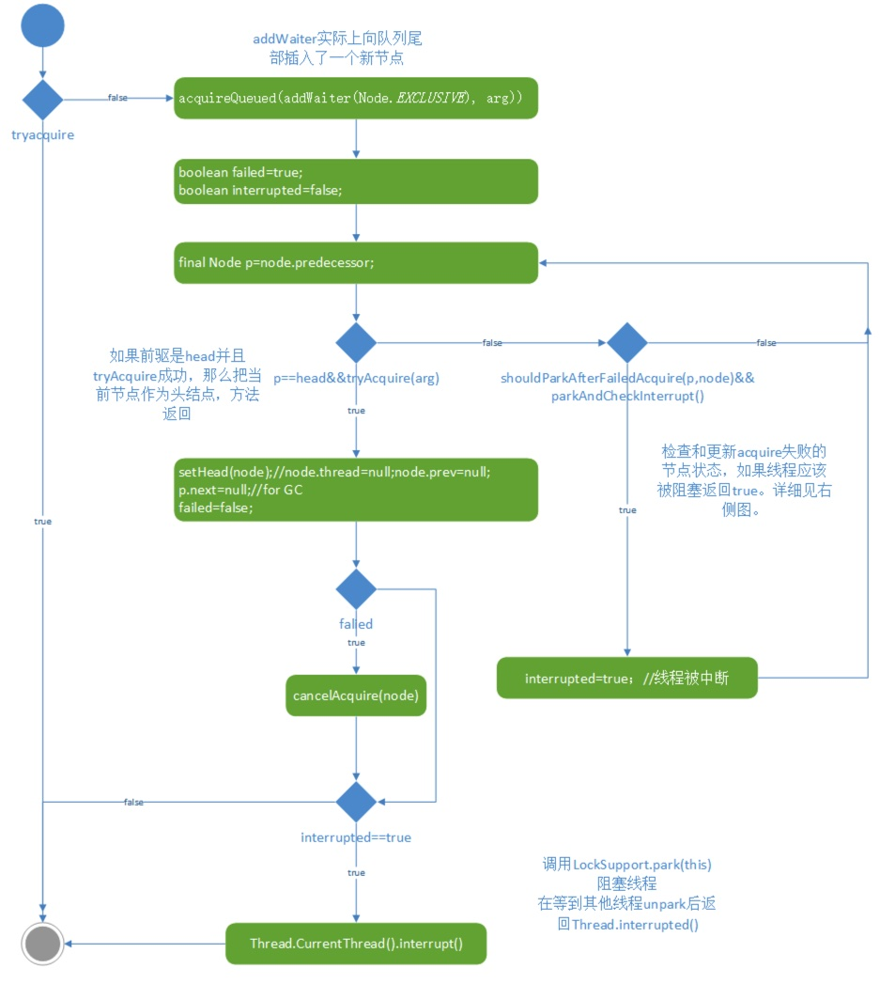


##### 12.4.14.8.4 parkAndCheckInterrupt <a id="12.4.14.8.4"></a>

parkAndCheckInterrupt 挂起线程使用的是上文介绍过的 LockSupport 类的park方法，并将当前同步器作为阻塞对象。在 park 返回后，使用 Thread.interrupted 方法获取并清零中断状态，并直接返回它的返回值。

```java
private final boolean parkAndCheckInterrupt() {
    LockSupport.park(this);
    return Thread.interrupted();
}
```

这里park的返回原因可能有3种，可查看 LockSupport 部分的讲解。


##### 12.4.14.8.5 shouldParkAfterFailedAcquire <a id="12.4.14.8.5"></a>

shouldParkAfterFailedAcquire 方法判断通过自旋 tryAcquire 失败的线程是否要阻塞。

那么当前线程说明情况下需要阻塞呢？我们知道，等待队列是 FIFO 的队列，只有头结点的后继结点才需要去尝试获取同步状态。因此，我们判断头结点的前驱结点 pred 的等待状态来决定是否阻塞当前线程：

+ 前驱结点为 SIGNAL 状态。 那么前驱结点可能正在执行或也在等待获取同步状态，但可以保证的是在前驱结点执行完任务释放同步状态后，它会唤醒其后继结点，因此当前结点可以直接挂起。返回 true。

+ 前驱结点为 CONCELLED 状态。此时，前驱结点不会被执行，我们需要一直向前找到第一个没有被取消的结点，将中间的结点踢出队列。之后返回false，当前线程可以再自旋一次，尝试获取同步状态。

+ 前驱结点为 PROPAGATE 状态。这种情况只有在共享锁中会出现，暂时不讨论。

+ 前驱结点为 0 状态。这是结点的初始状态和结束状态，有两种情况：

    + pred 是初始状态为0。即本来 pred 是 tail，没有后继结点。此时需要将 pred 的状态置为 SIGNAL，相当于告诉它有了后继结点，且后继结点准备挂起，当pred释放同步状态时要记得唤醒后继结点。完成 CAS 操作后，返回false，在下一次自旋时，如果前驱结点仍然没有释放同步状态，那 shouldParkAfterFailedAcquire 将判断出 pred 为 SIGNAL状态，从而使得当前线程阻塞。

    + pred 不是初始状态的 0。那么它只能是从 SIGNAL 变为 0，这只能是头结点刚执行完任务，释放锁时会被置为0(见unparkSuccessor)。此时说明 head 刚刚释放同步状态，我们不需要阻塞当前线程，直接返回false即可。这种情况下，下一次自旋一定会获得同步变量，因此将pred设置为SIGNAL的操作显得多余。因为 pred 将 SIGNAL 改为 0 的目的就是让后继结点在自旋时先不进入休眠。此处可以直接返回 false。

        不过，在实现代码时，没必要将这两种 0 状态区分开来（事实上也难以区分），直接设置前驱为 SIGNAL，并返回false即可。如果设置完直接返回 true，我认为也不会导致当前线程永久挂起，因为前驱总是会唤醒后继结点。只不过此时没必要挂起，因为前驱很有可能已经释放了同步变量，我们可以再自旋一次后再挂起，因此返回 false 的效率会更高。

综上所述，shouldParkAfterFailedAcquire 方法只有在确保前驱是 SIGNAL 状态是才会返回 true。

```java
private static boolean shouldParkAfterFailedAcquire(Node pred, Node node) {
    int ws = pred.waitStatus;
    if (ws == Node.SIGNAL) // 前驱为 SIGNAL，可以放心挂起
        return true;
    if (ws > 0) {
 		// 前驱结点的等待状态是 CANCELLED ，需要一直向前找到第一个没有被取消的结点，中间的结点踢出队列。
        do {
            node.prev = pred = pred.prev;
        } while (pred.waitStatus > 0);
        pred.next = node;
    } else {
        // 前驱结点的等待状态是 0 或 PROPAGATE。在独占锁下，只能是0。设置前驱为SIGNAL并返回false。
        compareAndSetWaitStatus(pred, ws, Node.SIGNAL);
    }
    return false;
}
```

shouldParkAfterFailedAcquire 方法的流程图如下所示：

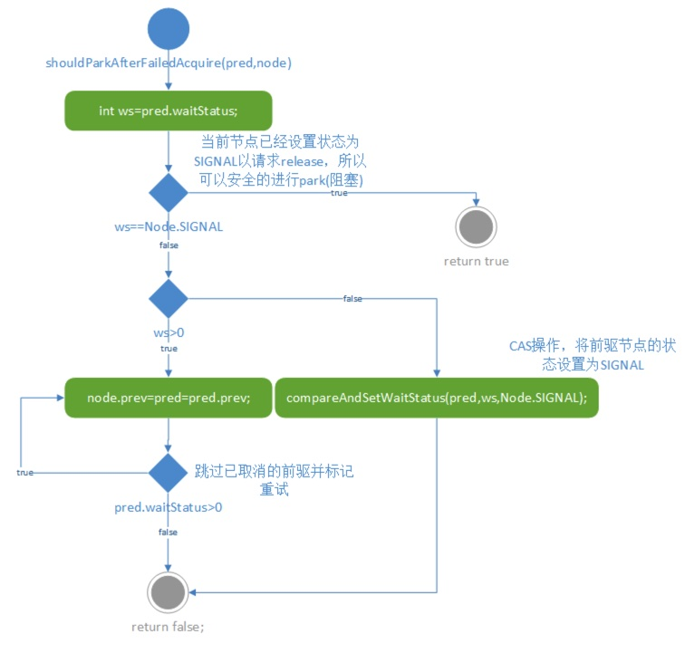

至此，AQS 的获取同步变量、入队、阻塞等操作的实现已经全部介绍。下面介绍释放同步变量和唤醒后继结点的相关实现。


##### 12.4.14.8.6 release <a id="12.4.14.8.6"></a>

release 是工作于独占模式的线程调用acquire获取同步状态后释放时要调用的方法。

```java
public final boolean release(int arg) {
    if (tryRelease(arg)) {
        Node h = head;
        if (h != null && h.waitStatus != 0) // 如果当前线程在队列中且有后继结点在等待
            unparkSuccessor(h);
        return true;
    }
    return false;
}
```

release 调用钩子函数 tryRelease，这是由子类同步器重写的方法。如果尝试释放同步状态失败，则release将直接返回 false（这与acquire不同，acquire会阻塞直到成功）。如果释放成功，那么此时有两种情况：

1. 当前线程不在阻塞队列中，即 head 为 null，那么直接返回释放结果 true 即可。
2. 当前线程在阻塞队列中，那么当前线程一定是队列头。此时需要根据结点的等待状态 waitStatus 判断是否有后继结点在等待获取同步状态。正在运行的线程结点(队列头)的等待状态只有两种可能，0或SIGNAL。当waitStatus为SIGNAL时(h.waitStatus!=0)，就需要调用uparkSuccessor唤醒后继结点。


##### 12.4.14.8.7 unparkSuccessor <a id="12.4.14.8.7"></a>

如果指定结点有后继结点，unparkSuccessor 方法将后继结点唤醒。为什么需要强调如果有后继结点呢？上一小节在 release 方法中不是检测到有后继结点才调用 unparkSuccessor 的吗？这是因为在 release 中检测时有后继，但在执行到 unparkSuccessor 时这个后继可能已经被取消了 CANCELLED。

```java
private void unparkSuccessor(Node node) {
    // 用于防止后继结点此时挂起，先将自己的等待状态设置为0，
    // 这样后继结点如果尚未挂起，那它执行 shouldParkAfterFailedAcquire 将返回false。 
    int ws = node.waitStatus;
    if (ws < 0)
        compareAndSetWaitStatus(node, ws, 0);

	// 唤醒后继结点，如果后继为 CANCELLED 或 null，需要从tail反向向前搜索
    Node s = node.next;
    if (s == null || s.waitStatus > 0) {
        s = null;
        for (Node t = tail; t != null && t != node; t = t.prev)
            if (t.waitStatus <= 0)
                s = t;
    }
    if (s != null)
        LockSupport.unpark(s.thread);
}
```

unparkSuccessor 方法首先将当前结点的等待状态设置为0。这样做的原因是，如果后继结点此时还未挂起，那么我们可以防止它挂起，因为后继结点在挂起前会调用 shouldParkAfterFailedAcquire，检测到头结点等待状体是0的话就会继续自旋。

在唤醒后继结点是，如果当前结点的后继结点是 null，可能只是另一个线程尚未来得及修改当前结点的后继引用（见addWaiter方法），此时需要从tail反向向前搜索。

如果后继结点被取消，状态为 CANCELLED，也要继续找第一个等待的结点，由于仍然可能遇到null，所以直接采取从后向前搜索，肯定不会错。

最后，使用 LockSupport 类的unpark唤醒后继结点包装的线程。

至此，独占式且中断不敏感的上锁/释放的全流程已经讲解完毕。


#### 12.4.14.9 AQS 模版方法-独占式&非超时&响应中断

##### 12.4.14.9.1 acquireInterruptibly

acquireInterruptibly 是与 acquire 方法并列的方法。二者都是独占式非超时获取同步状态。唯一区别在于 acquire 不响应中断，而 acquireInterruptibly 响应中断（即可能抛出InterruptedException）。子类在实现同步器时可以自由选择使用二者。

```java
public final void acquireInterruptibly(int arg) 
    throws InterruptedException {
    if (Thread.interrupted())
        throw new InterruptedException();
    if (!tryAcquire(arg))
        doAcquireInterruptibly(arg);
}
```

方法首先判断是否被中断，然后调用 tryAcquire 尝试获得同步状态，如果失败则调用 doAcquireInterruptibly 将结点加入等待队列，进行自旋，反复尝试获得同步状态。


##### 12.4.14.9.2 doAcquireInterruptibly

该方法将结点加入等待队列，通过自旋反复尝试独占式获取同步状态，不超时，有可能会挂起线程，如果线程收到中断信号，它将抛出 InterruptedException 异常。

```java
private void doAcquireInterruptibly(int arg) 
    throws InterruptedException {
    final Node node = addWaiter(Node.EXCLUSIVE);
    boolean failed = true;
    try {
        for (;;) {
            final Node p = node.predecessor();
            if (p == head && tryAcquire(arg)) {
                setHead(node);
                p.next = null; // help GC
                failed = false;
                return;
            }
            if (shouldParkAfterFailedAcquire(p, node) &&
                parkAndCheckInterrupt())
                throw new InterruptedException();
        }
    } finally {
        if (failed)
            cancelAcquire(node);
    }
}
```

对比中断不敏感的 acquireQueued(addWaiter(Node.EXCLUSIVE), arg) 调用，该方法有下面几个不同点：

1. 将 addWaiter 调用放入了 doAcquireInterruptibly 方法内部。这里我认为放在内部外部本质上没有什么区别，只是编程习惯吧。
2. 在 try 子句中，取消了记录中断信号的变量 interrupted，而是一旦发现 parkAndCheckInterrupt 方法返回了 true，即收到了中断信号，就直接抛出 InterruptedException。
3. 在 finally 子句中的 cancelAcquire 方法此时可能会被执行（在中断不敏感方式中，我们分析过，永远不会执行到cancelAcquire方法）。这里如果线程在 try 子句中抛出异常（在挂起时收到中断信号），那么failed字段为false，最后在 finally 子句中将执行 cancelAcquire。


##### 12.4.14.9.3 addWaiter

见 [12.4.14.8.2](#12.4.14.8.2) 节。


##### 12.4.14.9.4 parkAndCheckInterrupt

见 [12.4.14.8.4](#12.4.14.8.4) 节。


##### 12.4.14.9.5 shouldParkAfterFailedAcquire

见 [12.4.14.8.5](#12.4.14.8.5) 节。


##### 12.4.14.9.6 cancelAcquire <a id="12.4.14.9.6"></a>

在线程（Node节点）阻塞的过程意外退出时，则会调用cancelAcquire。

方法入参node即为待取消的节点， 整体看下来主要有两个作用：

- 修改node的状态，thread置为null，ws置为Node.CANCELLED。
- node节点出队（将当前取消节点的前置非取消节点和后置非取消节点"链接"起来）。

```java
private void cancelAcquire(Node node) {
    // 如果不存在则忽略
    if (node == null)
        return;

    node.thread = null;

    // 跳过被取消的前驱
    Node pred = node.prev;
    while (pred.waitStatus > 0)
        node.prev = pred = pred.prev;

    // pred是当前我们认为的前置非取消结点，preNext 是其后继。
    // 这里采取的策略是，如果我们后续的CAS操作失败了，说明在当
    // 前线程处理过程中，有新的结点插入或有其他结点被取消了，而
    // 且其他线程先于当前线程作出修改，那当前线程可以直接退出，
    // 因为最先完成操作的那个线程会处理好队列的。
    Node predNext = pred.next;
	// 将当前结点的状态设置为被取消，这样其他结点如果先于当前结
    // 点操作，就可以跳过当前结点。
    node.waitStatus = Node.CANCELLED;

    // 当前结点是 tail，要把前驱设置为tail，并把前驱的next设
    // 置为null。
    if (node == tail && compareAndSetTail(node, pred)) { 
        // 此处CAS失败则说明新结点插入，tail被修改。新的tail在 
        // shouldParkAfterFailedAcquire 方法中判断到这个结
        // 点的ws>0，就会自行将这个结点踢出队列。因此当前线程可以
        // 什么都不用做了，直接退出即可。
        compareAndSetNext(pred, predNext, null); 
        // 此处失败说明在我们将tail设置为前驱后，有新结点插入，那
        // 么tail的next就不归我们处理了，直接退出即可。
    } else {

        int ws;
        if (pred != head &&
            ((ws = pred.waitStatus) == Node.SIGNAL ||
             (ws <= 0 && compareAndSetWaitStatus(pred, ws, Node.SIGNAL))) &&
            pred.thread != null) {
            // 前面有正在等待的结点，将前驱的next设置为自己的next，
            // 使得它直接唤醒后面的结点。如果next也被取消了也不要紧，
            // 唤醒时会跳过被取消结点的。
            Node next = node.next;
            if (next != null && next.waitStatus <= 0)
                compareAndSetNext(pred, predNext, next);
        } else { // 前面没有在等待的结点了，自己主动唤醒后继，后继结点会将自己跳过。
            unparkSuccessor(node);
        }

        node.next = node; // help GC
    }
}
```

总体上，我们的出队逻辑是，某个结点A取消了，如果它前面有正等待唤醒的结点B，就把唤醒后面节点的任务交给B，如果自己已经是最前面的了，就要主动唤醒。

在实现上，除非当前结点是tail，否则并不真正的出队，只是修改结点的状态和队列中前驱结点的后继，使得前驱结点的后继跳过自己。我们的原则是并不修改其他结点的prev引用，保证任意时刻可以从队列的tail结点向前遍历。凡是修改prev引用，一定是因为前驱结点被取消，而且每个线程只能修改自己的prev。具体情况我们按照Node在队列中的位置分类讨论：

1. node 是尾结点，如下图所示，N2结点调用了cancelAcquire。此时只需要修改N2结点的Thread引用和waitStatus。然后使用CAS操作将 tail 设置为非取消前驱pred，如果成功，再使用CAS操作将这个pred的next引用置为null。这两个CAS都有可能失败，原因是在判断完node==tail之后，队列中插入了其他线程，此时结点就不再是tail，那么直接退出即可，让当前结点留在队列中，因为当前结点的ws为CANCELLED，其他结点会自行跳过当前结点。另外，node的前驱可以不用修改，它也会被垃圾回收。

    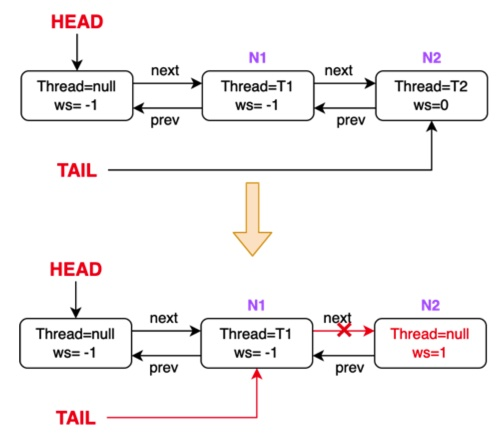

2. node 不是尾结点。那么此时我们需要查找前面是否有正在等待唤醒的结点。

    1. 前面有正在等待的结点，即node不是头结点要唤醒的直接结点如下图所示。N2结点调用了cancelAcquire。

        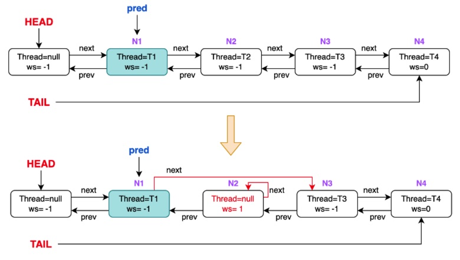

        此时我们把前驱的next引用到当前结点的后继，使得前驱在唤醒后继时跳过当前结点。注意这里N3对N2的prev指针并没有断开，即此时N2并没有完全出队，也不会被GC回收。这里衍生出两个问题，prev指针为什么没有断开以及是不是一直都不会断开？其实，这里的prev指针最终的断开有两种可能：

        + 后继结点也调用了取消逻辑。在下图中，N2取消后，其后继N3也调用了取消逻辑。N3执行cancelAcquire时查找非取消前驱的那三行代码，会将这个prev断开。

            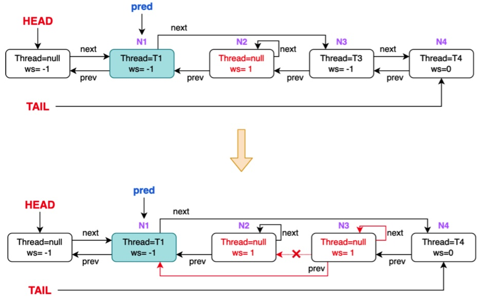

        + 后继结点没调用取消逻辑。在下图中，N3取消后，其后继N4没调用取消逻辑。N3的真正出队，是在N1（已经是获取了同步状态的头结点）释放同步状态唤醒其next节点（即N4）时。注意N4被唤醒后prev并不是head节点仍是N3，因此还会走到shouldParkAfterFailedAcquire 的逻辑中，在这个方法中N4线程将其节点的prev指向了N1（随后尝试获取同步状态），至此N3彻底出队。

            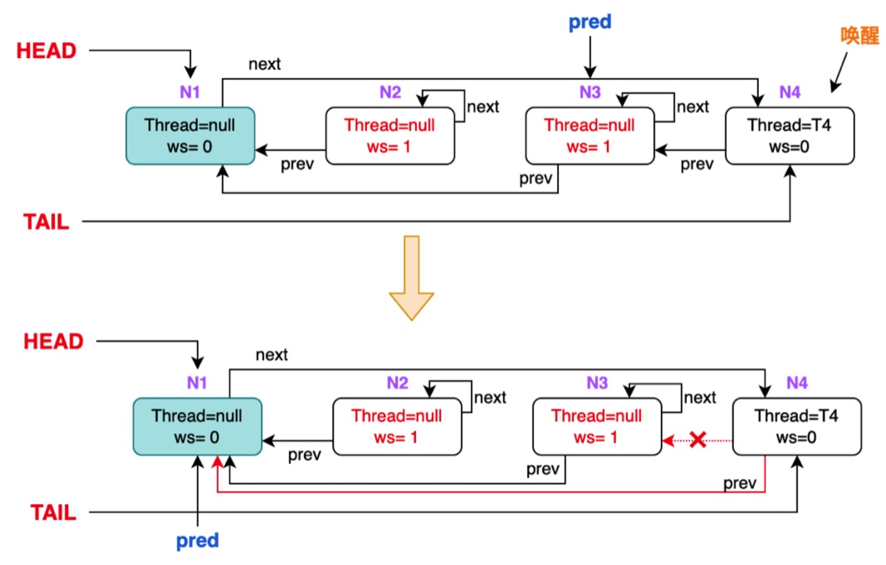

        总结一下：取消节点并不是调用cancleAcquire之后就彻底出队，而是保留了指向自己的prev指针，以保证后面节点一旦取消，能通过prev遍历到前面的待唤醒节点。而取消节点的真正出队有两个入口，一个是其后继节点的取消，另一个是其后继节点的唤醒。

    2. 前面没有正在等待的结点，node是头结点的后继。此时我们必须主动唤醒后继结点。

        >为什么需要主动唤醒后继呢？检查头结点的ws，如果为-1就将头结点的next指向node.next，从而使得头结点直接唤醒node.next不行吗？
        >
        >答案是不可以。在头结点执行完任务，使用 unparkSuccessor 时，在下面这个代码段中：
        >
        >```java
        >Node s = node.next;
        >if (s == null || s.waitStatus > 0) {
        >    s = null;
        >    for (Node t = tail; t != null && t != node; t = t.prev)
        >        if (t.waitStatus <= 0)
        >            s = t;
        >}
        >if (s != null)
        >    LockSupport.unpark(s.thread);
        >```
        >
        >可以看到，如果头结点在获取next结点 s 后，s结点尚未被取消，那么头结点将决定对 s 结点使用unpark，而如果在调用unpark之前，s 调用了取消逻辑，那么头结点的唤醒操作等于白做。此时 s 如果只是把头结点的next指向 s.next，那么s.next将不会被唤醒。因此 s 作为头结点的后继，必须主动唤醒自己的后继。

        node 唤醒后继的逻辑如下图所示：

        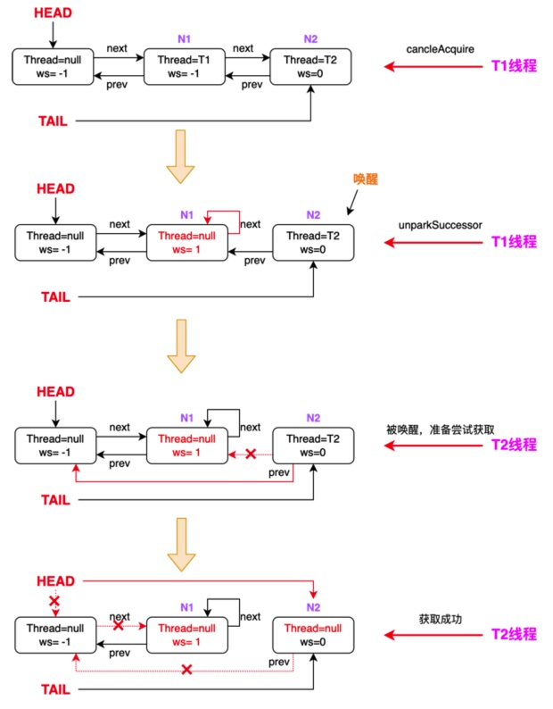

        首先，T1线程调用 cancelAcquire，发现其前驱结点中没有在等待的结点，即自己是头结点的后继，于是调用unparkSuccessor唤醒自己的后继结点N2。N2被唤醒后，参考N4前面被唤醒的情况，会断开其到N1的prev，将prev指向head，由于前驱节点已经是head，因此可以尝试获取同步状态。如果N2获取同步状态失败，说明此时head还未释放同步状态，那么N2可以正常的进行shouldParkAfterFailedAcquire调用，而不会出现head唤醒了错误的后继这种情况，因为等到head要唤醒后继时，N1已经是被取消结点了，head将从tail向前找到N2并唤醒。N2获取到同步状态后，更改head节点为N2，同时一行极其神奇的代码，将原head指向N1的next指针断开，至此N1才彻底出队。这一行神奇的代码就是之前在 acquireQueued 方法中我们提到的用于帮助GC的：

        ```java
        p.next = null; // help GC
        ```

        还有个问题，如果N1在判断要唤醒的后继时，N2还在等待，当N1决定要唤醒N2后，N2又被取消了怎么办？此时，之前的场景将又一次上演，N2向前查找第一个非取消前驱，发现自己是头结点的后继（N1已经被取消），于是N2会唤醒N3，唤醒信号得以传递。


##### 12.4.14.9.7 release

见 [12.4.14.8.6](#12.4.14.8.6) 节。


##### 12.4.14.9.8 unparkSuccessor

见 [12.4.14.8.7](#12.4.14.8.7) 节。


至此，独占式、非超时、响应中断的加解锁方法已经全部介绍。


#### 12.4.14.10 AQS 模版方法-独占式&超时&响应中断

##### 12.4.14.10.1 tryAcquireNanos

tryAcquireNanos(int arg, long nanosTimeout) 独占式获取锁，它响应中断，最多等待nanosTimeout纳秒，超时后也会返回。返回值为表示是否获得同步状态。

```java
public final boolean tryAcquireNanos(int arg, long nanosTimeout) throws InterruptedException {
    if (Thread.interrupted())
        throw new InterruptedException();
    return tryAcquire(arg) ||
        doAcquireNanos(arg, nanosTimeout);
}
```

首先判断是否产生中断，如果产生则抛出 InterruptedException 。注意这里 Thread.interrupted() 会自行清除中断标识位。

如果还没产生中断，则先调用 tryAcquire 试图获取同步状态，如果成功则直接返回，如果失败则调用 doAcquireNanos，它会阻塞直到成功获取同步状态或超时，也有可能抛出InterruptedException。


##### 12.4.14.10.2 doAcquireNanos

doAcquireNanos(int arg, long nanosTimeout) 获取独占锁，最多阻塞nanosTimeout纳秒，返回值代表是否获得同步状态，可能抛出InterruptedException 。

```java
private boolean doAcquireNanos(int arg, long nanosTimeout) throws InterruptedException {
    if (nanosTimeout <= 0L)
        return false;
    final long deadline = System.nanoTime() + nanosTimeout;
    final Node node = addWaiter(Node.EXCLUSIVE);
    boolean failed = true;
    try {
        for (;;) {
            final Node p = node.predecessor();
            if (p == head && tryAcquire(arg)) {
                setHead(node);
                p.next = null; // help GC
                failed = false;
                return true;
            }
            nanosTimeout = deadline - System.nanoTime();
            if (nanosTimeout <= 0L)
                return false;
            if (shouldParkAfterFailedAcquire(p, node) &&
                nanosTimeout > spinForTimeoutThreshold)
                LockSupport.parkNanos(this, nanosTimeout);
            if (Thread.interrupted())
                throw new InterruptedException();
        }
    } finally {
        if (failed)
            cancelAcquire(node);
    }
}
```

doAcquireNanos 与 doAcquireInterruptibly 的区别是增加了超时限制。因此源代码有以下区别：

1. 首先判断等待时间如果小于等于0，那么直接返回false。

2. 计算出方法必须返回的最晚期限，即系统当前时间加最长等待时间 ：final long deadline = System.nanoTime() + nanosTimeout;

3. 在判断是否要挂起当前线程前，计算出挂起的最长时间：nanosTimeout = deadline - System.nanoTime();

4. 如果判断出需要挂起，切挂起时间大于阈值spinForTimeoutThreshold，那么就调用 LockSupport 将线程挂起 nanosTimeout 纳秒。

    >这里为什么要有一个阈值 spinForTimeoutThreshold 呢？它在 AQS 类中的定义为：
    >
    >```java
    >static final long spinForTimeoutThreshold = 1000L;
    >```
    >
    >这是为了系统效率考虑。如果挂起的时间太短，那么就没必要挂起，直接让线程自旋即可，因为频繁挂起和唤醒线程有很大的开销。


##### 12.4.14.10.3 addWaiter

见 [12.4.14.8.2](#12.4.14.8.2) 节。


##### 12.4.14.10.4 parkAndCheckInterrupt

见 [12.4.14.8.4](#12.4.14.8.4) 节。


##### 12.4.14.10.5 shouldParkAfterFailedAcquire

见 [12.4.14.8.5](#12.4.14.8.5) 节。


##### 12.4.14.10.6 cancelAcquire

见 [12.4.14.9.6](#12.4.14.9.6) 节。


##### 12.4.14.10.7 release

见 [12.4.14.8.6](#12.4.14.8.6) 节。


##### 12.4.14.10.8 unparkSuccessor

见 [12.4.14.8.7](#12.4.14.8.7) 节。


#### 12.4.14.11 AQS 模版方法-共享式

AQS的共享式的获取锁方法有以下3种：

```java
void acquireShared(int arg)
void acquireSharedInterruptibly(int arg)
void tryAcquireSharedNanos(int arg, long nanos)
```

释放锁的方法为：

```java
boolean releaseShared(int arg)
```

有了上面独占式的基础，我们介绍共享式的非超时、不响应中断模式，另外两种只是修改了部分代码，与独占式模式的修改基本相同。


##### 12.4.14.11.1 acquireShared

acquireShared 是共享式、非超时、不响应中断模式获取同步状态的入口函数。它调用了子类同步器重写的方法 tryAcquireShared 方法，如果成功则直接返回，失败则调用 doAcquireShared，将当前结点入队阻塞。这与 acquire 方法的逻辑是相同的。它与独占式获取的主要区别是:

+ 在同一时刻可以有多个线程获取到同步状态。
+ selfInterrupt 在 doAcquireShared 方法内部，而不是在该方法中。

```java
public final void acquireShared(int arg) {
    if (tryAcquireShared(arg) < 0)
        doAcquireShared(arg);
}
```


##### 12.4.14.11.2 doAcquireShared

doAcquireShared 方法将线程构造成结点加入队列，可能会阻塞线程。

```java
private void doAcquireShared(int arg) {
    final Node node = addWaiter(Node.SHARED);
    boolean failed = true;
    try {
        boolean interrupted = false;
        for (;;) {
            final Node p = node.predecessor();
            if (p == head) {
                int r = tryAcquireShared(arg);
                if (r >= 0) {
                    setHeadAndPropagate(node, r);
                    p.next = null; // help GC
                    if (interrupted)
                        selfInterrupt();
                    failed = false;
                    return;
                }
            }
            if (shouldParkAfterFailedAcquire(p, node) &&
                parkAndCheckInterrupt())
                interrupted = true;
        }
    } finally {
        if (failed)
            cancelAcquire(node);
    }
}
```

它与独占式的 addWaiter&acquireQueued 的区别是，

1. 在尝试获得同步状态时，它获得的返回值是int变量。

    > 这里说明一下 tryAcquireShared 方法的返回值。返回值分3种可能：
    >
    > 1. 小于0：获取同步状态失败。
    > 2. 等于0：获取同步状态成功，且没有多余资源。
    > 3. 大于0：获取同步状态成功，且剩余的资源数为返回值的大小。

    根据返回值，调用 setHeadAndPropagte 方法。因为当前方法是共享式，所以需要唤醒可能能够获取同步状态的后继。

2. 在返回前检测是否发生中断，并设置中断标识位。


##### 12.4.14.11.3 setHeadAndPropagate & releaseShared

在Java的早期版本中，这两个方法是很简单的。当时Node类也没有PROPAGATE这个状态。之所以要引入它是为了解决一个[bug(JDK-6801020)](https://bugs.openjdk.org/browse/JDK-6801020) 。这个bug在Java 7中被修复。

我们先来看修改之前的简单版本，并分析为什么会有bug，以及应该如何修复。

```java
// bug
private void setHeadAndPropagate(Node node, int propagate) {
	setHead(node);
    if (propagate > 0 && node.waitStatus != 0) {
        Node s = node.next;
        if (s == null || s.isShared())
            unparkSuccessor(node);
    }
}

public final boolean releaseShared(int arg) {
    if (tryReleaseShared(arg)) {
        Node h = head;
        if (h != null && h.waitStatus != 0)
            unparkSuccessor(h);
        return true;
    }
    return false;
}
```

可以看到，简单的实现是，在传播多余的同步状态时，先将头结点设置为当前结点，这样头结点就可以出队（因为头结点已经得到同步状态并在处理任务）。然后，检测同步状态余量和当前结点的等待状态，如果同时满足有余量和有等待线程，就使用 unparkSuccessor 唤醒后继。

在 releaseShared 方法中，如果检测到头结点的等待状态是-1，即(不等于0，此时不会是取消状态)，那么就唤醒一个后继。

这样的实现无法安全并行释放资源。可以想象这样一种场景：假如说当前 CLH 队列中有一个空节点和两个被阻塞的节点（t1 和 t2 想要获取信号量但获取不到被阻塞在 CLH 队列中（state 初始为 0））：head->t1->t2（tail）。

- **时刻 1：**t3 调用 release->releaseShared->tryReleaseShared，将 state+1 变为 1，同时发现此时的 head 节点不为 null 并且 waitStatus 为 - 1，于是继续调用 unparkSuccessor 方法，在该方法中会将 head 的 waitStatus 改为 0。
- **时刻 2：**t1 被上面 t3 调用的 unparkSuccessor 方法所唤醒，调用了 tryAcquireShared，将 state-1 又变为了 0。注意，此时还没有调用接下来的 setHeadAndPropagate 方法。
- **时刻 3：**t4 调用 release->releaseShared->tryReleaseShared，将 state+1 变为 1，同时发现此时的 head 节点虽然不为 null，但是 waitStatus 为 0，所以就不会执行 unparkSuccessor 方法。
- **时刻 4：**t1 执行 setHeadAndPropagate->setHead，将头节点置为自己。但在此时 propagate 也就是剩余的 state 已经为 0 了（propagate 是在时刻 2 时通过传参的方式传进来的，那个时候 - 1 后剩余的 state 是 0），所以也不会执行 unparkSuccessor 方法。

现在CLH队列达到这样一种状态：有两个线程释放了同步状态，但只有一个线程被唤醒。t2只有等到t1释放资源后才能被t1唤醒，这显然与共享锁的设计初衷是不同的。

现在我们来看修复后的代码：

```java
private void setHeadAndPropagate(Node node, int propagate) {
    Node h = head; // Record old head for check below
    setHead(node);
    if (propagate > 0 || h == null || h.waitStatus < 0 ||
        (h = head) == null || h.waitStatus < 0) {
        Node s = node.next;
        if (s == null || s.isShared())
            doReleaseShared();
    }
}

public final boolean releaseShared(int arg) {
    if (tryReleaseShared(arg)) {
        doReleaseShared();
        return true;
    }
    return false;
}

private void doReleaseShared() {
    for (;;) {
        Node h = head;
        if (h != null && h != tail) {
            int ws = h.waitStatus;
            if (ws == Node.SIGNAL) {
                if (!compareAndSetWaitStatus(h, Node.SIGNAL, 0))
                    continue;            // loop to recheck cases
                unparkSuccessor(h);
            }
            else if (ws == 0 &&
                     !compareAndSetWaitStatus(h, 0, Node.PROPAGATE))
                continue;                // loop on failed CAS
        }
        if (h == head)                   // loop if head changed
            break;
    }
}
```

下面分析为什么要这样修改：

假设两个线程A和B同时进行 releaseShared。假设A先执行，A在doReleaseShared方法中将head的ws从-1改为0。然后A执行unparkSuccessor 唤醒N1，N1在doAcquireShared方法中醒来，tryAcquireShared获取同步状态，将返回值r作为参数调用setHeadAndPropagate。现在有两种情况：

1. 在N1获取同步状态之前，线程B调用了releaseShared。那么N1得到的返回值r包括了线程B刚释放的同步状态，因此当它进入setHeadAndPropagate方法后，可以判断出同步状态是否有余量，从而唤醒后继结点。此时线程B虽然唤醒的是已经被唤醒的N1，但它已经把同步状态增加的信息传递给N1了。

2. 在N1获取同步状态之后，调用setHeadAndPropagate中的setHead之前，线程B调用了releaseShared，且获得了旧的队列头。此时N1的到的同步状态余量不是真实的，缺少了线程B刚释放的部分，它将不再唤醒后继。而线程B将重复唤醒N1。如果不采取特殊措施，这种情况将导致两个线程A和B释放同步状态，却只唤醒了N1。为了解决这个问题，JDK采取的办法是让doReleaseShared方法将ws已经是0的头结点，改成ws=-3(PROPAGATE)。在setHeadAndPropagate 方法中，检测旧头结点的ws，如果为-3，则再次调用doReleaseShared。

    **这里我有个疑问，如果线程B在将旧的头结点的ws设置为-3之前，N1就完成了if判断，发现ws=0，那么它仍然不会调用doReleaseShared。这个bug不是依然存在吗？希望日后能解决这个疑惑。**

3. 在N1调用了setHead之后，线程B调用releaseShared且获得了新的队列头。那么线程B将通过设置N1的结点状态，试唤醒N1的后继N2，这是合规的行为，线程A和B分别唤醒了N1和N2。

以上就是共享式、非超时、不响应中断的获取/释放同步状态的相关代码。


#### 12.4.14.12 AQS 子类举例

前面我们介绍了AQS的模版方法，下面介绍部分使用AQS框架实现的锁。

##### 12.4.14.12.1 ReentrantLock

前面我们已经介绍过可重入锁的使用方法，现在来看它是怎么实现的。

ReentrantLock 有两个继承了AQS的内部类，FairSync和NonfairSync，分别实现了公平和非公平的同步器。ReentrantLock还有一个抽象内部类，是FairSync和NonfairSync的直接父类，也是通过它继承了AQS。

ReentrantLock 的同步状态的含义有点特殊：

+ state==0：代表此时没有线程占有同步状态。
+ state>0：代表此时有线程独占同步状态，且数值为它获取的个数。

我们来看 FairSync 的 tryAcquire 方法：

```java
protected final boolean tryAcquire(int acquires) {
    final Thread current = Thread.currentThread();
    int c = getState();
    if (c == 0) {
        if (!hasQueuedPredecessors() &&
            compareAndSetState(0, acquires)) {
            setExclusiveOwnerThread(current);
            return true;
        }
    }
    else if (current == getExclusiveOwnerThread()) {
        int nextc = c + acquires;
        if (nextc < 0)
            throw new Error("Maximum lock count exceeded");
        setState(nextc);
        return true;
    }
    return false;
}
```

首先，因为我们要实现的是可重入锁，所以可能获得该锁的情况有两种：

1. c==0，即此时没有线程占有同步变量。因为公平锁是先来先服务，所以在争取同步线程前要判断前面是否有线程在排队。如果没有，则用CAS操作更改同步状态。如果这两个操作都能实现，那么将锁的占有者设置为当前线程。
2. c!=0。此时如果自己是同步变量的占有者，那么它可以重复获得该锁。

再来看看释放锁的 tryRelease 方法：

```java
protected final boolean tryRelease(int releases) {
    int c = getState() - releases;
    if (Thread.currentThread() != getExclusiveOwnerThread())
        throw new IllegalMonitorStateException();
    boolean free = false;
    if (c == 0) {
        free = true;
        setExclusiveOwnerThread(null);
    }
    setState(c);
    return free;
}
```

释放锁时，如果自己不是锁的占有者，则抛出IllegalMonitorStateException异常。然后根据自己释放的数量，修改同步状态的值。因为是独占式的，所以在修改状态时，不需要同步控制。

可重入锁对外的使用接口是 lock 和 unlock，在公平锁中，它们直接调用了 acquire 和 release。

以上就是公平的可重入锁的实现。


## 12.5 线程安全的集合

如果多个线程并发地修改一个数据结构，可能会造成其内部数据结构被破坏。当然我们可以通过加锁将这些操作串行化，但标准库帮我们实现了一些线程安全的集合数据结构，使用起来会更加容易。

首先，在第9章中介绍的集合中线程安全的有：

+ Vector
+ Stack
+ Hashtable
+ Enumeration

以上集合在实现时将内部操作全部同步了，多线程操作时只会一个一个地访问，所以是线程安全的。但以上数据结构已经不太推荐使用了，它们的效率不高。

下面介绍一些专门为多线程环境准备的集合，它们的关系图如下所示。

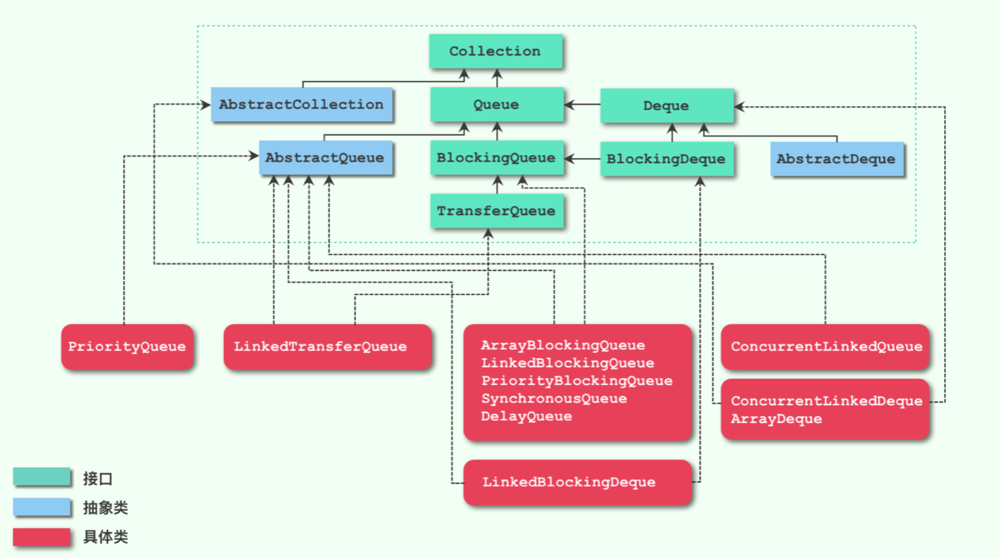


### 12.5.1 阻塞队列 BlockingQueue

阻塞队列接口要求所有队列操作都是线程安全的。此外，它还声明了两个新方法。put方法在队列已经满载的情况下将线程阻塞；take方法在队列为空的情况下将线程阻塞。这在生产者-消费者场景下很常用。

1. BlockingQueue 位于 java.util.concurrent 包下面，是一个为了应对并发情况的队列的接口，阻塞队列(BlockingQueue)接口继承了普通队列(Queue)接口。其实现类都是线程安全的。
2. 阻塞队列接口对批操作没有要求原子性。因此，除去集合类提供的批量操作，addAll、containsAll、retainAll、removeAll，这些方法的原子性可以由实现类自行决定以外，其他操作一定都是原子性的。因此，当一个阻塞队列进行批量加入元素(addAll)时，它可能在加入了部分元素之后抛出异常，此时 BlockingQueue 中已经添加了部分元素，这个是允许的，取决于具体的实现。
3. BlockingQueue 不接受 null 元素，如果尝试插入（add、put、offer）null 元素，将会抛出空指针异常。因为在 poll 方法中，null 值被认为是操作失败时的返回值。
4. BlockingQueue 可能是有容量限制的，如果没有定义指定的容量，则其容量应为 Integer.MAX_VALUE(21亿多)。通常我们说的无界并不是真正意义上的无界，而是它的容量是 Integer.MAX_VALUE。
5. 当阻塞队列操作失败时(例如满载时插入元素)，它提供了4种不同的策略：

    + 抛出异常：add，remove，element。当阻塞队列满时，再往队列里插入元素，会抛出IllegalStateException("Queue full") 异常。当队列为空时，从队列里获取元素时会抛出NoSuchElementException 异常 。

    + 返回特殊值：offer，poll，peek。插入方法会返回是否成功，成功则返回true。移除/取方法，则是从队列里拿出一个元素，如果没有则返回null。

    + 一直阻塞：put，take。当阻塞队列满时，如果生产者线程往队列里put元素，队列会一直阻塞生产者线程，直到拿到数据，或者响应中断退出。当队列空时，消费者线程试图从队列里take元素，队列也会阻塞消费者线程，直到队列可用。

    + 超时退出：offer(e, time, unit), poll(time, unit)。当队列不满足操作条件时，队列会阻塞线程一段时间，直到超过一定的时间。offer返回true或false，poll返回元素或null。
6. 子接口：TransferQueue, BlockingDeque, 下文介绍。
7. 实现类：7个。下文介绍。

    + ArrayBlockingQueue ：一个由数组结构组成的有界阻塞队列。
    + LinkedBlockingQueue ：一个由链表结构组成的有界阻塞队列。
    + LinkedBlockingDeque：一个由链表结构组成的双向阻塞队列。
    + PriorityBlockingQueue ：一个支持优先级排序的无界阻塞队列。
    + DelayQueue：一个使用优先级队列实现的无界阻塞队列。
    + SynchronousQueue：一个不存储元素的阻塞队列。
    + LinkedTransferQueue：一个由链表结构组成的无界阻塞队列。

```java
package java.util.concurrent;
import java.util.Collection;
import java.util.Queue;

public interface BlockingQueue<E> extends Queue<E> {
    boolean add(E e);
    boolean offer(E e);
    void put(E e) throws InterruptedException;
    boolean offer(E e, long timeout, TimeUnit unit) throws InterruptedException;
    E take() throws InterruptedException;
    E poll(long timeout, TimeUnit unit) throws InterruptedException;
    int remainingCapacity();
    boolean remove(Object o);
    public boolean contains(Object o);
    int drainTo(Collection<? super E> c);
    int drainTo(Collection<? super E> c, int maxElements);
}

```


#### 12.5.1.1 TransferQueue 接口

TransferQueue 是 BlockingQueue 的子接口。它提供了一种新的阻塞方式，即可以生产者可以等待消费者。

实现类：LinkedTransferQueue。

```java
package java.util.concurrent;
public interface TransferQueue<E> extends BlockingQueue<E> {
    // 如果存在消费者已经等待接收它（在 take 或 timed poll（long，TimeUnit）poll）中，则立即传送指定的元素，否则返回 false。
    boolean tryTransfer(E e);

    // 如果存在一个消费者已经等待接收它（在 take 或 timed poll（long，TimeUnit）中），则立即传送指定的元素，否则等待直到元素由消费者接收。
    void transfer(E e) throws InterruptedException;

    // 上面方法的基础上设置超时时间
    boolean tryTransfer(E e, long timeout, TimeUnit unit) throws InterruptedException;

    // 如果至少有一位消费者在等待，则返回 true
    boolean hasWaitingConsumer();

    // 返回等待消费者人数的估计值
    int getWaitingConsumerCount();
}
```


#### 12.5.1.2 BlockingDeque 接口

与 BlockingQueue 基本一样，这里仅介绍它与 BlockingQueue 的不同点。

1. 继承了 BlockingQueue 接口与 Deque 接口。
2. 相比于 BlockingQueue 中的方法，BlockingDeque 中的方法增加了后缀 First 和 Last，例如 putFirst，pollLast。
3. 实现类：LinkedBlockingDeque 。


#### 12.5.1.3 ArrayBlockingQueue

ArrayBlockingQueue 是 BlockingQueue 接口的有界队列实现类。

+ 底层采用数组来实现。
+ 有界，创建后无法更改容量。
+ 继承 AbstractQueue，实现 BlockingQueue。
+ 含有一个 ReentrantLock。可重入锁可指定公平锁或非公平锁，默认使用非公平锁。
+ 含有两个 Condition。
+ 构造函数有3个参数，后两个可选：
    + int capacity：指定队列的容量。
    + boolean fair：指明是否使用公平锁，默认为false。
    + Collection<? extends E> c：可以指定用一个集合来初始化，将此集合中的元素在构造方法期间就先添加到队列中。


#### 12.5.1.4 LinkedBlockingQueue

LinkedBlockingQueue 是 BlockingQueue 接口的无界队列实现类。

+ 底层使用单向链别实现。
+ 无界(默认为容量为Integer.MAX_VALUE)，但也可以指定容量。
+ 继承 AbstractQueue，实现 BlockingQueue。
+ 链接队列的吞吐量通常要高于基于数组的对列(ArrayBlockingQueue)，但是在大多数并发应用程序中，其可预知的性能要低；
+ 含有两个 ReentrantLock。
+ 含有两个 Condition。
+ 3种构造函数：
    + 无参数，使用默认容量。
    + 一个参数，int capacity：指定容量。
    + 一个参数，Collection<? extends E> c：使用集合c中的元素初始化队列，容量使用默认值。


#### 12.5.1.5 LinkedBlockingDeque

LinkedBlockingDeque 是 BlockingDeque 接口的实现类。

+ 底层使用双向链表实现。
+ 无界(默认为容量为Integer.MAX_VALUE)，但也可以指定容量。
+ 继承 AbstractQueue，实现 BlockingDeque。
+ 3种构造函数：
    + 无参数，使用默认容量。
    + 一个参数，int capacity：指定容量。
    + 一个参数，Collection<? extends E> c：使用集合c中的元素初始化队列，容量使用默认值。


#### 12.5.1.6 PriorityBlockingQueue

PriorityBlockingQueue 是 BlockingQueue 接口的带排序实现。

+ 底层使用数组实现的堆结构；

+ 无界，默认大小为11，最大容量为 Integer.MAX_VALUE-8。

+ 继承 AbstractQueue，实现 BlockingQueue。

+ 元素需要实现Comparable接口，或者提供一个比较器。每次出队都返回优先级最好或者最小的元素，内部是平衡二叉树堆的实现。

+ 含有一个 ReentrantLock。

+ 含有一个 Condition。

+ 含有一个自旋锁 private transient volatile int allocationSpinLock，用以确保只有一个线程将队列扩容。

+ 四种构造函数：

    + 无参数，使用默认容量，默认比较器。

    + int initialCapacity：指定容量，默认比较器。

    + int initialCapacity, Comparator<? super E> comparator：指定容量，指定比较器。
      
    + Collection<? extends E> c：使用集合c中的元素初始化队列，容量为c的大小，如果c是有序集合，使用它的比较器。


#### 12.5.1.7 DelayQueue

DelayQueue 是 BlockingQueue 接口的带延迟期限的实现，该队列中的每个元素在入队时都设置了一个过期时间（可能不同），加入队列后只有达到该时间后才可出队。

+ 底层使用非线程安全的 PriorityQueue 存储元素。

+ 无界。

+ 继承 AbstractQueue，实现 BlockingQueue，元素需要实现 Delayed 接口。

    >Delayed 接口只有一个 getDelay 方法，返回剩余的延迟时间。
    >
    >```java
    >package java.util.concurrent;
    >
    >public interface Delayed extends Comparable<Delayed> {
    >    long getDelay(TimeUnit unit);
    >    //这个接口返回元素是否到期，小于等于 0 表示元素已到期，大于 0 表示元素未到期
    >}
    >```
    >
    >Delayed 接口继承了 Comparable 接口，其中只有一个 compareTo 方法。
    >
    >因此，Delayed 接口的实现类需要有这两个方法。实际上，Delayed 实现类的 compareTo 是使用getDelay 得到的结果进行比较，默认越早过期的元素越小。因此如果把 Delayed 实现类的对象放入优先队列，默认使用它们的自然顺序（即使用compareTo），那么过期时间越小，元素的优先级越高。


+ 延迟队列内部使用一个优先队列存储元素，优先队列的队列头是最先过期的元素，这个元素可能是已经过期了，也可能尚未过期。每次从延迟队列弹出元素时，就是取内部的优先队列的队头，因此一定是最先过期的元素。

+ 含有一个 ReentrantLock，用以同步不同线程的操作。

+ 含有一个 Condition，用以管理阻塞在第一个元素上的线程。当有线程要从延迟队列中取元素，但是延迟队列中最先过期的元素都尚未过期，那么线程就取不出任何元素，于是线程就会在该条件变量上等待。

+ 含有一个 Thread 变量(名为leader)。

    >DelayQueue 使用 Leader-Follower 模式优化阻塞通知。
    >
    >之前我们说过，如果有很多元素要从队列中取元素，而队列中元素还未到过期时间，那么这些线程就要在条件对象上等待。因为我们通过队列头的getDelay方法获取剩余的延迟时间，因此我们可以使用下面的调用，让线程挂起相同的时间，这样当操作系统唤醒这个线程时，队列头元素也正好过期。
    >
    >```java
    >available.awaitNanos(nanos); // available是条件对象
    >```
    >
    >但是如果这样做的话，先来的线程阻塞后会释放重入锁，其他线程此时可以获取队列头数据，它们也会阻塞在队列头，于是当许多线程阻塞在条件对象上时，每一个都挂起直到队列头过期，等到队列头过期时，它却只能被一个线程取走，其他被唤醒的线程竞争新的队列头，如果新队列头还未过期，这将导致其他线程再次阻塞。因此之前将它们唤醒的操作就是浪费时间和资源的行为。
    >
    >Leader-Follower 模式就是为了改进这个问题而采取的措施。
    >
    >我们把第一个阻塞在队列头的线程称为 leader，后来的所有线程称为 follower。
    >
    >当第一个线程来取队列头时，如果队列头已经过期，那它可以直接取走。如果尚未过期，我们让它成为leader，并调用上面的方法，挂起指定的时间。
    >
    >当后来的线程查看队列头的过期时间时，有两种情况：
    >
    >1. 队列头已经过期，可以直接取走数据。这是一种少见情况。这里需要注意，leader不是已经在等待队列头了吗？当队列头过期时 leader 不是应该已经取走它吗？实际上这是不一定的，因为我们只是让 leader 挂起指定的时间，但操作系统并不一定在时间一到就立刻唤醒 leader，而是可能正在执行其他线程，如果这个线程刚好此时去取队列头，那么它将先取走队列头（这是不公平的策略，但可以提高吞吐量。leader线程是先来的，但它只能等待下一个队列头了）。
    >2. 队列头尚未过期，需要阻塞等待。这是大多数情况。现在这些线程都是 follwer， 使用下面的调用直接挂起（等到 leader 取到元素后会唤醒它们获取下一个队列头）。
    >
    >```java
    >available.await();
    >```
    >
    >这里放上 DelayQueue 的 take 方法的源代码及注释说明，以便于理解。
    >
    >```java
    >public E take() throws InterruptedException {
    >    // 获取锁。每个延迟队列内聚了一个重入锁。
    >    final ReentrantLock lock = this.lock;
    >    // 获取可中断的锁。
    >    lock.lockInterruptibly();
    >    try {
    >        for (;;) {
    >            // 尝试从优先级队列中获取队列头部元素
    >            E first = q.peek();
    >            if (first == null)
    >                // 无元素，当前线程节点加入等待队列，并阻塞当前线程
    >                available.await();
    >            else {
    >                // 通过延迟任务的 getDelay 方法获取延迟时间
    >                long delay = first.getDelay(NANOSECONDS);
    >                if (delay <= 0)
    >                    // 延迟时间到期，获取并删除头部元素。
    >                    return q.poll();
    >                first = null; // don't retain ref while waiting
    >                // 存在leader线程，则其他的线程进入时，直接进入等待 
    >                if (leader != null)
    >                    available.await();
    >                else {
    >                    // 获取当前线程 说明线程变了
    >                    Thread thisThread = Thread.currentThread();
    >                    leader = thisThread;
    >                    try {
    >                        // 线程节点进入等待队列 x 纳秒。
    >                        available.awaitNanos(delay);
    >                    } finally {
    >                        // 等待完了，该线程则设置为null
    >                        if (leader == thisThread)
    >                            leader = null;
    >                    }
    >                }
    >            }
    >        }
    >    } finally {
    >        // 若还存在元素的话，则将等待队列头节点中的线程节点唤醒继续获取对头元素。
    >        if (leader == null && q.peek() != null)
    >            available.signal();
    >        lock.unlock();
    >    }
    >}
    >```
    >
    >如此一来，就可以只让操作系统按时唤醒 leader 线程，而不用频繁唤醒众多的 follower。
    >
    >另外，向队列中加入已经过期的元素时，如果新插入的元素变成了队列头，而且此时正好有线程在等待队列头，那么我们需要从 availble 条件对象的等待集中随机选一个线程唤醒（不一定是leader），并将leader变量置为空。被唤醒的线程将取得新插入的队列头，它取走后会再从等待集中随机唤醒下一个线程。代码如下：
    >
    >```java
    >public boolean offer(E e) {
    >    // 获取到重入锁
    >    final ReentrantLock lock = this.lock;
    >    lock.lock();
    >    try {
    >        q.offer(e);
    >        if (q.peek() == e) {
    >            // 刚添加的元素成为头节点
    >            // 那之前的头结点就直接废掉
    >            leader = null;
    >            // 唤醒take等待的线程，重新竞争新加入元素
    >            available.signal();
    >        }
    >        return true;
    >    } finally {
    >        lock.unlock();
    >    }
    >}
    >```


+ 2种构造函数：
    + 无参数。
    + Collection<? extends E> c：使用集合c中的元素初始化队列。
+ 使用场景：
    + 缓存系统的设计：可以用DelayQueue保存缓存元素的有效期，使用一个线程循环查询DelayQueue，一旦能从DelayQueue中获取元素时，表示缓存有效期到了。
    + 定时任务调度。使用DelayQueue保存当天将会执行的任务和执行时间，一旦从DelayQueue中获取到任务就开始执行，比如TimerQueue就是使用DelayQueue实现的。
    


#### 12.5.1.8 SynchronousQueue

SynchronousQueue 是 BlockingQueue 接口的实现类。前面所介绍的阻塞队列都是线程把要入队的元素数据存储到队列中然后继续运行，取元素的线程和队列进行交互。同步线程则很特殊，它不存储数据元素，而是把所有生产者和消费者记录下来，一旦可以匹配，同时让一个生产者和一个消费者完成信息交换，如果没有可以匹配的线程，则当前线程将阻塞等待。因此，同一时刻所有阻塞在一个同步队列的线程一定都是生产者或都是消费者。

+ 无界。

+ 继承 AbstractQueue，实现 BlockingQueue。

+ 同步队列可以配置为使用公平的机制或非公平的机制。底层实现了两个数据结构分别实现：

    + TransferStack：负责实现非公平机制。即如果有多个线程阻塞，那他们将被放置在一个栈中，而当一个可以匹配的线程到来时，同步队列将弹出栈顶来与之匹配。由此可见，后来的线程反而先得到满足，所以说这是非公平的。
    + TransferQueue：负责实现公平机制。每次 put 数据的时候，都 put 到队尾上，而每次拿数据时，并不是直接从堆头拿数据，而是从队尾往前寻找第一个被阻塞的线程，这样就会按照顺序释放被阻塞的线程。

    同步队列使用 Transferer 抽象静态内部类来统一这两种不同的实现，它唯一的 tansfer 方法作为包装后对外的接口。

    ```java
    // 堆栈和队列共同的接口，负责执行 put or take
    abstract static class Transferer<E> {
        // e 为空的，会直接返回特殊值，不为空会传递给消费者
        // timed 为 true，说明会有超时时间
        abstract E transfer(E e, boolean timed, long nanos);
    }
    
    // 堆栈 后入先出 非公平， Scherer-Scott 算法
    static final class TransferStack<E> extends Transferer<E> {
    }
    
    // 队列 先入先出 公平
    static final class TransferQueue<E> extends Transferer<E> {
    }
    
    private transient volatile Transferer<E> transferer;
    
    // 无参构造器默认为非公平的
    public SynchronousQueue(boolean fair) {
        transferer = fair ? new TransferQueue<E>() : new TransferStack<E>();
    }
    ```

    从源码可见，共同接口的 Transferer 的方法 transfer 承担 put 和 take 的双重功能。


+ 是一个没有数据缓冲的BlockingQueue，容量为0，它不会为队列中元素维护存储空间，它只是多个线程之间数据交换的媒介。避免队列里缓冲数据，这样在系统异常关闭时，就能排除因为阻塞队列丢消息的可能。非常适合传递性场景做交换工作。
+ 具体的实现细节很复杂，这里不详细介绍，可以参考：https://cloud.tencent.com/developer/article/2144751。


#### 12.5.1.9 LinkedTransferQueue

LinkedTransferQueue 是一个由链表结构实现 TransferQueue 接口的队列。

+ 基于链表实现。
+ 无界。
+ 相对于其他阻塞队列，LinkedTransferQueue 多了 tryTransfer 和 transfer 方法。
+ 继承 AbstractQueue，实现 TransferQueue 接口。
+ 可以算是 LinkedBolckingQueue 和 SynchronousQueue 和合体。
    + 和 SynchronousQueue 相比，LinkedTransferQueue可以存储实际的数据。
    + 和其它阻塞队列相比，LinkedTransferQueue 直接用无锁算法实现，性能有所提升。
+ 基于 CAS 无锁算法实现。


### 12.5.2 高效的映射、集和队列

java.util.concurrent 包提供了映射、有序集和队列的高效实现：ConcurrentHashMap、ConcurrentSkipListMap(Set)、 和 ConcurrentLinkedQueue(Deque)。

这些集合使用复杂的算法，通过允许并发地访问数据结构的不同部分尽可能减少竞争。

与大多数集合不同，这些类的 size 方法不一定在常量时间内完成操作。确定这些集合的当前大小通常需要遍历。


### 12.5.3 映射条目的原子更新

ConcurrentHashMap 原来的版本只有为数不多的方法可以实现原子更新，这使得编程有些麻烦。假设我们希望统计观察到某些特性的频度。作为一个简单的例子，假设多个线程会遇到单词，我们想统计它们的频率。

可以使用 ConcurrentHashMap<String, Long> 吗？考虑让计数自增的代码。显然，下面的代码不是线程安全的：

```java
Long oldValue = map.get(word);
Long newValue = oldValue == null ? 1: oldValue + 1;
map.put(word, newValue);// ERROR--might not replace oldValue
```


可能会有另一个线程在同时更新同一个计数。

>这里需要注意，ConcurrentHashMap 不是线程安全的吗，为什么这样更新不行呢？
>
>其实，它的线程安全性是指，即使有多个线程同时对它调用 set 等方法，它也会串行化这些操作，而不会导致数据结构被破坏，即我们可以认为它的方法是原子操作。
>
>但是，上面的例子中，我们先使用get得到值计算出newValue，在第3行代码执行时，其旧值可能已经被其他线程改变，因此放入的新值会覆盖其他线程的修改，导致出错。简而言之，concurrent 包中的数据结构只能提供单个操作的原子性，但上面的代码是一个操作序列，序列不是原子性的，所以结果不可预知。

在老版本的 Java 中，必须使用 replace 操作，它会以原子方式用一个新值替换原值，前提是之前没有其他线程把原值替换为其他值。必须一直这么做，直到替换成功：

```java
do
{
	oldValue = map.get(word);
    newValue = oldValue == null ? 1: oldValue + 1；
}
while(!map.replace(word, oldValue, newValue))；
```

或者，可以使用一个 ConcurrentHashMap<String, AtomicLong>，以及以下更新代码：

```java
map.putIfAbsent(word, new AtomicLong());
map.get(word).incrementAndGet();
```

很遗憾，这会为每个自增构造一个新的 AtomicLong，而不管是否需要。

如今，Java API 提供了一些新方法，可以更方便地完成原子更新。调用 compute 方法时可以提供一个键和一个计算新值的函数。这个函数接收键和相关联的值（如果没有值，则为null)，它会计算新值。例如，可以如下更新一个整数计数器的映射：
```java
map.compute(word, (k, v)->v == null ?1:v + 1);
```

另外还有 computelfPresent 和 computelfAbsent 方法，它们分别只在已经有原值的情况下计算新值，或者只在没有原值的情况下计算新值。


### 12.5.4 对并发散列映射的批操作

Java API 为并发散列映射提供了批操作，即使有其他线程在处理映射，这些操作也能安全地执行。批操作会遍历映射，处理遍历过程中找到的元素。这里不会冻结映射的当前快照。除非你恰好知道批操作运行时映射不会被修改，否则就要把结果看作是映射状态的一个近似。

有3种不同的操作：

+ search（搜索）为每个键或值应用一个函数，直到函数生成一个非 null 的结果。然后搜索终止，返回这个函数的结果。
+ reduce（归约）组合所有键或值，这里要使用所提供的一个累加函数。
+ forEach 为所有键或值应用一个函数。

每个操作都有 4个版本：

+ operationkeys： 处理键。
+ operationValues：处理值。
+ operation：处理键和值。
+ operationEntries: 处理 Map. Entry 对象。

对于上述各个操作，需要指定一个参数化阈值（parallelism threshold)。如果映射包含的元素多于这个阈值，就会并行完成批操作。如果希望批操作在一个线程中运行，可以使用 Long.MAX VALUE。如果希望用尽可能多的线程运行批操作，可以使用1。

例如，search方法有以下版本：

```java
U searchkeys(Long threshold, BiFunction<？ super K, ？ extends U> f) 
U searchValues(long threshold, BiFunction<？ super V, extends U> f)
U search(Long threshold, BiFunction<？ super K, ？ super V, ? extends U> f) 
U searchEntries(Long threshold, BiFunction<Map. Entry<K，V>， ？ extends U> f)
```

例如，假设我们希望找出第一个出现次数超过1000 次的单词。需要搜索键和值：
```java
String result = map.search(threshold, (k,v）-> V>1000 ？ k:nulL);
```

result 会设置为第一个匹配的单词，或者如果搜索两数对所有输人都返回 null，则返回 null。


### 12.5.5 并发集视图

假设你想要的是一个很大的线程安全的集而不是映射。并没有 ConcurrentHashSet 类，而且你肯定不想自己创建这样一个类。当然，可以使用包含“假”值的 ConcurrentHashMap，不过这会得到一个映射而不是集，而且不能应用 Set 接口的操作。

静态 newkeySet 方法会生成一个 Set\<K\>，这实际上是 ConcurrentHashMap<K, Boolean> 的一个包裝
器。（所有映射值都为 Boolean.TRUE，不过因为只是要把它用作一个集，所以并不关心映射值。）

```java
Set<String> words = ConcurrentHashMap.<String>newKeySet();
```

当然，如果原来有一个映射，keyset 方法可以生成这个映射的键集。这个集是可更改的。如果删除这个集的元素，键（以及相应的值）也会从映射中删除。不过，向键集增加元素没有意义，因为没有相应的值可以增加。ConcurrentHashMap 还有第二个 keyset 方法，它包含一个默认值，为集增加元素时可以使用这个方法：
```java
Set<String> words = map.keySet(1L);
words.add("Java")；
```


如果“Java" 在 words 中不存在，现在它会有一个值 1。


### 12.5.6 写数组的拷贝

CopyOnWriteArrayList 和 CopyOnWriteArraySet 是线程安全的集合，其中所有更改器会建立底层数组的一个副本。如果迭代访问集合的线程数超过更改集合的线程数，这样的安排是很有用的。当构造一个迭代器的时候，它包含当前数组的一个引用。如果这个数组后来被更改了，送代器仍然引用旧数组，但是，集合的数组已经替换。因而，原来的迭代器可以访问一致的(但可能过时的视图，而且不存在任何同步开销。


### 12.5.7 并行数组算法

Arrays 类提供了大量并行化操作。例如，静态 Arrays.parallelSort 方法可以对一个基本类型值或对象的数组排序。

```java
Arrays.parallelSort(words);
```

也可以提供一个 Comparator。

```java
Arrays.parallelSort(words, Comparator.comparing(String::length));
```

对于所有方法都可以提供一个范围的边界，如：

```java
values.parallelSort(values.length / 2, values.length); // sort the upper half
```

如果有足够多的处理器，并行计算会胜过直接的线性计算。这些算法在特殊用途的硬件上很常用。


### 12.5.8 较早的线程安全集合

从Java 的初始版本开始，Vector 和 Hashtable 类就提供了动态数组和散列表的线程安全的实现。现在这些类被认为已经过时，而被 ArrayList 和 Hashvap 类所取代。不过，那些类不是线程安全的，实际上，集合库中提供了一种不同的机制。任何集合类都可以通过使用同步包装器（synchronization wrapper）变成线程安全的：

```java
List<E> synchArrayList = Collections.synchronizedList(new ArrayList<E>()); Map<K, V> synchHashMap = Collections.synchronizedMap(new HashMap<K, V>());
```

结果集合的方法使用锁加以保护，可以提供线程安全的访问。应该确保没有任何线程通过原始的非同步方法访问数据结构。要确保这一点，最容易的方法是确定不保存原始对象的任何引用，简单地构造一个集合并立即传递给包装器，像我们的例子中所做的那样。

如果希望迭代访问一个集合，那么仍然需要使用“客户端”锁定，因为如果不锁定它，其他线程有可能同时修改这个集合。

```java
synchronized(synchHashMap)
{
	Iterator<k> iter = synchHashMap.keySet().iterator();
	while(iter.hasNext())
    {
        ...
    }
}
```

通常最好使用 java.util.concurrent 包中定义的集合，而不是同步包装器。特别是，ConcurrentHashMap 经过了精心实现，假如多个线程访问的是不同的桶，它们都能访问而不会相互阻塞。经常更改的数组列表是一个例外。在这种情况下，同步的 Arraylist 要胜过 CopyOnWriteArraylist。

```java
java.util.Collections
static <E> Collection<E> synchronizedCollection(Collection<E> c)
static <E> List synchronizedList(List<E> c)
static <E> Set synchronizedSet(Set<E> c)
static <E> SortedSet synchronizedSortedSet(SortedSet<E> c)
static <K, V> Map<K, V> synchronizedMap(Map<k, V> c)
static <K, V> SortedMap<K, V> synchronizedSortedMap(SortedMap<K, V> c)
//构造集合视图，其方法是同步的。
```


## 12.6 任务和线程池

构造一个新的线程开销有些大，因为这涉及与操作系统的交互。如果你的程序中创建了大量的生命期很短的线程，那么不应该把每个任务映射到一个单独的线程，而应该使用线程池(thread pool)。线程池中包含许多准备运行的线程。为线程池提供一个 Runnable，就会有一个线程调用 run 方法。当 run 方法退出时，这个线程不会死亡，而是留在池中准备为下一个请求提供服务。


### 12.6.1 Callable与Future

Runnable 接口封装一个异步运行的任务，可以把它想象成一个没有参数和返回值的异步方法。

Callable 接口与 Runnable 类似，但是有返回值。Callable 接口是一个参数化的类型，只有一个方法 call。类型参数是返回值的类型。call 方法会阻塞调用线程，直到出现下面的情况：

+ 新线程计算完成，获得返回值。
+ 超时。
+ 新线程抛出异常。

```java
public interface Callable<V>
{
	V call() throws Exception;
}
```

Future 接口保存异步计算的结果。可以启动一个计算，将 Future 对象交给某个线程。这个 Future 对象的所有者在结果计算好之后，我们可以在这个对象上调用get方法获得结果。Future\<V\> 接口有下面的方法：
```java
V get() // 会阻塞，直到计算完成
V get(long timeout, TimeUnit unit) // 阻塞，若超时抛出 TimeoutException 异常
void cancel(boolean mayInterrupt) // 不阻塞，取消计算。如果计算已经开始，mayInterrupt 参数为true 才取消
boolean isCancelled() // 不阻塞，返回计算是否被取消
boolean isDone() // 不阻塞，返回计算是否完成
```

执行 Callable 的一种方法是使用 FutureTask 类，它实现了 Future 和 Runnable 接口，所以可以构造一个线程来运行这个任务：

```java
Callable<Integer> task =...
var futureTask = new FutureTask<Integer>(task);
var t = new Thread(futureTask); // it's a Runnable
t.start();
...
Integer result = task.get(); // it's a Future
```


更常见的情况是，可以将一个 Callable 传递到一个执行器。这个主题将在下一节介绍。


### 12.6.2 执行器

前面我们已经介绍了创建线程的方法。但是如果在实际场景中每次都用上面的方法创建新线程，有很多缺点，比如代码繁琐、易出错、难以管理多个线程及CPU资源、反复创建销毁线程浪费资源等等。


#### 12.6.2.1 线程池

可以使用 线程池(Thread Pool) 解决上面的问题。线程池就是把一个或多个线程通过统一的方式进行调度，并进行重复使用，减少了因为线程过多而带来使用上的开销。

在JDK中rt.jar包下 JUC(java.util.concurrent) 有两个类可以用来创建线程池：ThreadPoolExecutor 和 Executors，其中 ThreadPoolExecutor 通过构造函数创建线程池， Executors 可以通过静态工厂方法创建 6 种不同的线程池类型。


##### 12.6.2.1.1 ThreadPoolExecutor

ThreadPoolExecutor 类继承了 AbstractExecutorService 类，这个父类实现了ExecutorService接口，而这个接口继承了Executor接口。

Executor 接口只有一个 execute 方法。 

```java
package java.util.concurrent;
public interface Executor {
    void execute(Runnable command);
}
```

Executor 接口只能运行没有返回值的 Runnable，且不能对任务进行管理。而 ExecutorService 接口则提供了运行 Callable 任务的方法和许多管理任务的方法。

```java
package java.util.concurrent;
import java.util.List;
import java.util.Collection;

public interface ExecutorService extends Executor {

    void shutdown();

    List<Runnable> shutdownNow();

    boolean isShutdown();

    boolean isTerminated();

    boolean awaitTermination(long timeout, TimeUnit unit)
        throws InterruptedException;

    <T> Future<T> submit(Callable<T> task);

    <T> Future<T> submit(Runnable task, T result);

    Future<?> submit(Runnable task);

    <T> List<Future<T>> invokeAll(Collection<? extends Callable<T>> tasks)
        throws InterruptedException;

    <T> List<Future<T>> invokeAll(Collection<? extends Callable<T>> tasks,
                                  long timeout, TimeUnit unit)
        throws InterruptedException;

    <T> T invokeAny(Collection<? extends Callable<T>> tasks)
        throws InterruptedException, ExecutionException;

    <T> T invokeAny(Collection<? extends Callable<T>> tasks,
                    long timeout, TimeUnit unit)
        throws InterruptedException, ExecutionException, TimeoutException;
}

```

ThreadPoolExecutor 的一个构造方法如下：

```java
public ThreadPoolExecutor(int corePoolSize,
                          int maximumPoolSize,
                          long keepAliveTime,
                          TimeUnit unit,
                          BlockingQueue<Runnable> workQueue,
                          ThreadFactory threadFactory,
                          RejectedExecutionHandler handler) {
    if (corePoolSize < 0 ||
        maximumPoolSize <= 0 ||
        maximumPoolSize < corePoolSize ||
        keepAliveTime < 0)
        throw new IllegalArgumentException();
    if (workQueue == null || threadFactory == null || handler == null)
        throw new NullPointerException();
    this.acc = System.getSecurityManager() == null ?
            null :
            AccessController.getContext();
    this.corePoolSize = corePoolSize;
    this.maximumPoolSize = maximumPoolSize;
    this.workQueue = workQueue;
    this.keepAliveTime = unit.toNanos(keepAliveTime);
    this.threadFactory = threadFactory;
    this.handler = handler;
}
```

它的参数的含义如下：

+ corePoolSize: 线程池中用来工作的核心的线程数量。
+ maximumPoolSize：最大线程数，线程池允许创建的最大线程数。
+ keepAliveTime：当线程池中的线程数超过corePoolSize时，空闲线程等待新任务的最长时间，超过这个时间将被回收销毁。另外，如果 allowCoreThreadTimeOut 成员变量为true，那么即使线程数少于corePoolSize，只要空闲时间大于 keepAliveTime 也会被回收。
+ unit：keepAliveTime 的时间单位。
+ workQueue：任务队列，是一个阻塞队列，当线程数已达到核心线程数，会将任务存储在阻塞队列中。
+ threadFactory：线程池内部创建线程所用的工厂。
+ handler：拒绝策略，当任务队列已满并且线程数量达到最大线程数量时，会调用该方法处理该任务。


##### 12.6.2.1.2 线程池运行原理

刚创建的线程池中只有一个构造时传入的阻塞队列，此时里面并没有的任何线程，但是如果你想要在执行之前已经创建好核心线程数，可以调用 prestartAllCoreThreads 方法来实现，默认是没有线程的。

线程池的运行流程图如下所示：

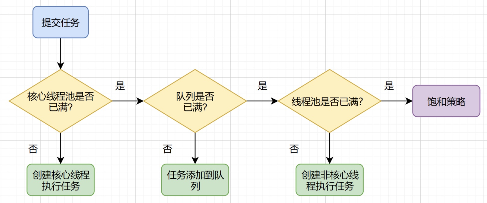

当有线程通过 execute 方法提交了一个任务，首先会去判断当前线程池中的线程数是否小于核心线程数 corePoolSize：

+ 如果线程数小于 corePoolSize，直接通过 ThreadFactory 创建一个线程来执行这个任务。当这个任务执行完之后，线程不会退出，而是去从阻塞队列获取任务。这里需要注意，即使此时有空闲的线程，只要线程数量未达到 corePoolSize，都是直接创建新线程执行任务。

+ 如果线程数大于等于 corePoolSize，那么它将尝试将这个任务加入阻塞队列。此时有两种情况：
    + 入队成功。如果阻塞队列尚未装满，那么任务将放入队列，等待线程取走它。
    
    + 入队失败。如果阻塞队列已满，那么就会判断此时总线程数是否小于最大线程数：
        + 如果线程数小于 maximumPoolSize，那么仍然会创建一个非核心线程来执行它。注意，这里新创建的线程直接执行当前任务，而不是从满载的任务队列中取任务。由此可见，先提交的任务不一定先执行。
        
        + 如果线程数等于 maximumPoolSize，此时线程池选择拒绝策略。也就是使用构造时传入的 RejectedExecutionHandler 对象，handler来处理这个任务。
        
            >JDK自带的 RejectedExecutionHandler 实现有4种：
            >
            >+ AbortPolicy：丢弃任务，抛出运行时异常。不指定拒绝策略时的默认策略。
            >+ CallerRunsPolicy：由提交任务的线程来执行。
            >+ DiscardPolicy：丢弃这个任务，不抛出异常。
            >+ DiscardOldestPolicy：从队列中弹出最先进入队列的任务，然后再次提交任务。


##### 12.6.2.1.3 execute 方法

函数 execute 就是实现了上一小节的工作流程，函数流程图如下：

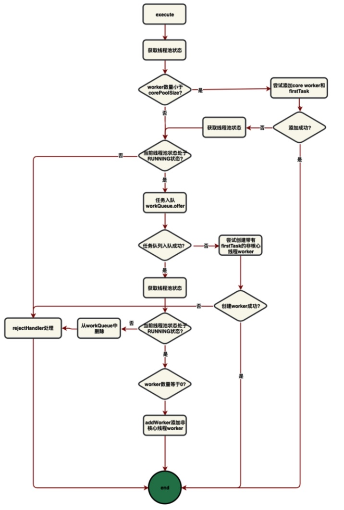

它的源代码如下，注释部分解释了代码的逻辑。代码中使用的变量和函数的相关说明在代码块之后。

```java
public void execute(Runnable command) {
    if (command == null) // command 是提交的任务
        throw new NullPointerException();
    int c = ctl.get();  // 变量c是一个 AtomicInteger，获取它的值
    if (workerCountOf(c) < corePoolSize) { 
        // 线程数量小于 corePoolSize， 尝试创建核心线程执行cmd，至于线程池的状态是否为RUNNING，addWorker方法会自行判断，如果不是RUNNING状态，它会返回false。
        if (addWorker(command, true))
            return;
        // 到达这里手则说明核心线程创建失败，即addWorker返回false。
        // 有3种可能：
		// 1.在判断线程数量小于corePoolSize后，此线程进入当前if语句块，但在从 addWorker 函数返回之前，若存在其他线程先创建了一个核心线程，且刚好达到（或超过）corePoolSize，那么我们就不能再创建核心线程了；
        // 2.在判断线程数量小于corePoolSize后，此线程进入当前if语句块，但线程池调用了shutdown等方法，线程池不再是RUNNING状态，那么就不能再接受新任务，因此也不能再创建线程了。
        // 3.因为其他原因，创建线程失败（具体取决于addWorker内部的代码）。
        // 无论如何，此时我们应该更新 c 的值，然后去尝试将任务加入阻塞队列。
        c = ctl.get();
    }
    if (isRunning(c) && workQueue.offer(command)) {
		// 判断线程池在运行状态后，尝试把任务加入阻塞队列。
        int recheck = ctl.get();
        // 这里需要再次判断线程池是否为RUNNING状态。如果是的话，那么任务已经成功加入阻塞队列。如果不是的话，那么我们要把刚才加入阻塞队列的任务取出，即调用remove方法，然后再对任务采取拒绝策略。为什么这里要判断remove方法是否执行成功呢？原因还是在多线程条件下，当该线程将任务加入阻塞队列后，在线程池变为非RUNNING状态前，可能有一个线程将这个刚加入队列的任务取走了，那这个任务可能会被执行完成(SHUTDOWN状态)或被中断(STOP)状态，无论是哪一种，我们都不需要在此处采取拒绝策略。
        if (! isRunning(recheck) && remove(command))
            reject(command);

        // 到这里，说明线程池在RUNNING状态，且任务也成功加入了阻塞队列。但该函数还不能退出。考虑如果我们的线程池设置了 corePoolSize 为0的情况。那么第一个到来的任务就会运行到此处，而且线程池中没有任何工作的线程。或者，已经创建的线程由于某种原因被终止了，也可能导致线程池中没有线程。因此，我们需要判断一下，如果线程数为0，那么就使用addWorker创建一个线程。由于我们已经将任务加入了阻塞队列，所以不需要为新线程指定任务（使用null），它会自动去阻塞队列中取任务。另外，我们也不需要判断addWorker是否成功，因为我们只要保证有线程会去完成我们刚加入的任务即可，如果此处添加失败，说明线程池中线程数量已经达到 maximumPoolSize，自然可以不用理会。
        else if (workerCountOf(recheck) == 0)
            addWorker(null, false);
    }
    else if (!addWorker(command, false)) // 最终，再尝试创建线程，如果失败只能采用拒绝策略
        reject(command);
}
```

对上面的代码进行说明如下：

ThreadPoolExecutor 中有一个重要的成员变量ctl，定义如下：

```java
private final AtomicInteger ctl = new AtomicInteger(ctlOf(RUNNING, 0));
```

先忽略 AtomicInteger 构造参数中的函数调用，之后会解释。先来看 ctl 变量的作用。它具有双重功能：

1. 记录有效的线程数量，即 workerCount。
2. 记录线程池的状态，即runState。

这里说一下线程池的状态，一共有5种，RUNNING，SHUTDOWN，STOP，TIDYING，TERMINATED。用二进制来表示，一共需要3位。由于 ctl 是int类型的包装类，一共有32位，因此它的最高3位用来表示线程池的状态，低29位用来表示线程数量。线程数量最大值为 $2^{29}-1$ 。

与 ctl 变量相关的方法和变量有：

```java
private static final int COUNT_BITS = Integer.SIZE - 3;
private static final int CAPACITY   = (1 << COUNT_BITS) - 1;

// runState is stored in the high-order bits
private static final int RUNNING    = -1 << COUNT_BITS;
private static final int SHUTDOWN   =  0 << COUNT_BITS;
private static final int STOP       =  1 << COUNT_BITS;
private static final int TIDYING    =  2 << COUNT_BITS;
private static final int TERMINATED =  3 << COUNT_BITS;

// Packing and unpacking ctl
private static int runStateOf(int c)     { return c & ~CAPACITY; }
private static int workerCountOf(int c)  { return c & CAPACITY; }
private static int ctlOf(int rs, int wc) { return rs | wc; }

/*
 * Bit field accessors that don't require unpacking ctl.
 * These depend on the bit layout and on workerCount being never negative.
 */
private static boolean runStateLessThan(int c, int s) { return c < s;}
private static boolean runStateAtLeast(int c, int s) { return c >= s;}
private static boolean isRunning(int c) { return c < SHUTDOWN;}
```

对这写变量和方法进行说明：

+ COUNT_BITS 是指 workerCount 所占的位数，等于29。

+ CAPACITY 是指最大线程容量，即workerCount的最大值，等于$(1<<COUNT\_BITS)-1$。

+ 下面是5种线程池状态：-1、0、1、2、3分别左移29位，占据高3位。可以看到，源码中是用11100000，00000000，00100000，01000000，01100000来表示5种状态的。（注：应该是32位，为了省事没有全写出来，剩下的24位全部为0）。状态之间的转换关系即每一种状态代表的含义如下：

    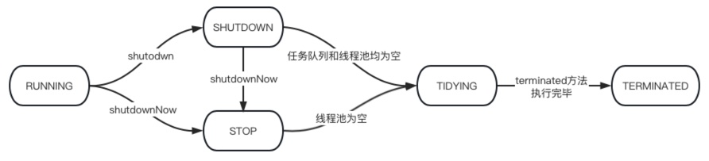

    + RUNNING：线程池可以接收新的任务和执行已添加的任务。刚创建的线程池的初始状态。
    + SHUTDOWN：不再接收新任务，但能处理已添加到阻塞队列的任务。当一个线程池调用 shutdown 方法时，线程池将由 RUNNING 状态变为 SHUTDOWN 状态。
    + STOP：不接收新任务，不处理已添加到阻塞队列的任务，并且会尝试中断正在执行的任务。当一个线程池调用 shutdownNow 方法时，线程池将由 RUNNING 状态变为 STOP 状态。
    + TIDYING：当所有的任务已终止，workerCount为0，线程池会从SHUTDOWN或STOP状态变为 TIDYING 状态，然后执行钩子函数 terminated。
    + TERMINATED：线程池彻底终止，当钩子函数 terminated 被执行完成之后，就从 TIDYING 状态变成TERMINATED状态。

+ runStateOf 方法是通过 ctl 变量的值获取线程池状态，将ctl变量的低29位清零即可。

+ workerCountOf 方法是通过 ctl 变量的值获取线程数，将ctl变量的高3位清零即可。

+ ctlOf 方法是通过线程池状态和线程数量构造ctl变量。

+ 下面是直接比较线程池状态的3种方法，他们的原理是5种线程池状态分别是由 -1，0，1，2，3 左移29位得到的，位移之后他们之间的大小关系与位移以前相同。这也就可以解释为什么要定义RUNNING是-1左移29位，而不是从0开始。因为如果从0开始，那TERMINATED状态就是4左移29位，变成了 100···，左移后变成了负数，破坏了它们左移之前的相对大小关系。

    + runStateLess 方法是比较两个线程池状态 c 和 s 的方法。
    + runStateAtLeast 方法返回线程池状态 c 是否大于 s。
    + isRunning 方法返回线程池状态是否为 RUNNING，即 c 是否小于 SHUTDOWN。

在 ThreadPoolExecutor 定义 ctl 成员变量时，使用 ctlOf 方法构造了初始状态下的ctl变量，即线程池状态为 RUNNING，线程数量为0。

现在结合 execute 源代码中的注释，我们可以理解它是如何实现线程池的了。


##### 12.6.2.1.4 addWorker 方法

在上一节中，我们知道 execute 方法调用 addWorker 方法创建新线程，本节介绍 addWorker 方法的实现。

addWorker 方法完成了两件事：

1. 使用循环CAS(Compare And Swap)将线程池中的线程数量加一。
2. 新建一个线程 worker，添加到workers中并启用。

addWorker 方法的源代码及注释如下，详细的逻辑分析在代码之后。注意，这里使用的是 JDK8 中的代码，其中有一个bug，说明见下文。

```java
private boolean addWorker(Runnable firstTask, boolean core) {
    retry:
    for (;;) {
        int c = ctl.get();
        int rs = runStateOf(c);

        // 状态逻辑，如果不满足创建线程的状态条件就直接返回false。
        if (rs >= SHUTDOWN &&
            ! (rs == SHUTDOWN &&
               firstTask == null &&
               ! workQueue.isEmpty()))
            return false;

        for (;;) {
            // 容量逻辑，如果已经达到线程数量最大值，那么直接返回false。
            int wc = workerCountOf(c);
            if (wc >= CAPACITY ||
                wc >= (core ? corePoolSize : maximumPoolSize))
                return false;
            // CAS操作将线程数量加一
            if (compareAndIncrementWorkerCount(c))
                break retry; //成功，那么直接去执行创建线程的工作。

            // CAS操作失败了，说明存在其他线程同时修改了线程数量，因此我们需要重新进行CAS操作。但是在自旋之前，要判断一下线程池的状态是否发生改变，如果改变了就要从retry标签重新开始执行。
            c = ctl.get();  // Re-read ctl
            if (runStateOf(c) != rs)
                continue retry;
        }
    }

    boolean workerStarted = false; // 表示线程是否启动。
    boolean workerAdded = false; // 表示线程是否加入了workers哈希表。
    Worker w = null; // 即将创建的 Worker 对象的引用。
    try {
        w = new Worker(firstTask); // 使用firstTask创建一个Worker
        final Thread t = w.thread; // 获得Worker的成员，即用来执行任务的新线程
        if (t != null) {
            // 如果用户传入的 ThreadFactory 有问题，那么使用它创建的线程t可能是null。为避免空指针异常，此处进行了判断。

            // 有了新Worker，接下来要修改成员哈希表了，所以要获取全局锁。
            final ReentrantLock mainLock = this.mainLock;
            mainLock.lock();
            try {
                // 检查线程池的状态是否允许创建线程，其实就是状态逻辑。这里为什么只判断状态逻辑，不判断容量逻辑呢？因为线程池的状态随时可能会被主线程调用shutdown等方法而改变，而线程池的容量是使用CAS操作来改变的，该Worker在创建前就已经将线程数量加一，其他线程的增减不会影响到这个动作的生效。
                int rs = runStateOf(ctl.get());
                if (rs < SHUTDOWN ||
                    (rs == SHUTDOWN && firstTask == null)) {

                    // 这里是一个bug，但不影响程序的正确运行，后文有具体分析。
                    if (t.isAlive()) //
                        throw new IllegalThreadStateException();
                    workers.add(w);

                    // 更新最大线程数量
                    int s = workers.size();
                    if (s > largestPoolSize)
                        largestPoolSize = s;
                    workerAdded = true;
                }
            } finally {
                mainLock.unlock();
            }
            if (workerAdded) {
                t.start(); // 启动新线程，这里需要注意，在启动新线程之前，worker已经被加入了workers，且已经释放了 mainLock。因此如果此时主线程遍历workers发送信号，这个即将启动的线程是收不到的。这个场景在后面会用到。
                workerStarted = true;
            }
        }
    } finally {
        if (! workerStarted)
            addWorkerFailed(w); //线程启动失败，需要回滚操作，包括终止新线程，将线程数量减一和从workers中删除当前Worker。
    }
    return workerStarted;
}
```

addWorker 方法的两个参数：

1. Runnable 类型的 firstTask 表示 execute 方法调用addWorker时指定的该worker要完成的第一个任务。
2. booelan 类型的 core 表示试图创建的线程的类型，core 为true代表核心线程，core为false代表非核心线程。

首先来看该方法完成的第一件事：将线程数量加一。需要注意的是，前面我们提到过，addWorker 方法需要判断线程池是否能创建线程，如果创建成功返回 true，否则返回false。因此这一步需要判断是否能新建线程，如果可以，再尝试使用原子操作将线程数加一。

我们把判断 addWorker 方法是否能成功创建线程的逻辑分为状态逻辑和容量逻辑。

1. 状态逻辑根据线程池的状态判断是否允许创建新线程。

    + 当线程池状态 rs>SHUTDOWN，一定不能创建。此时线程池状态为STOP，TIDYING，TERMINATED中的一种，它们都拒绝执行任何任务，包括已经加入到阻塞队列中的任务。因此一定不会创建新线程。

    + 当线程池状态为 SHUTDOWN，只有当firstTask为null且阻塞队列非空时才能创建。当线程池状态为SHUTDOWN时，线程池不会接受新的任务，只会处理已经加入到阻塞队列中的任务。结合 execute 方法的处理逻辑可以知道，只有当且仅当要处理队列中的任务时会令 firstTask 为null且队列非空。

    + 当线程池状态为 RUNNING，可以创建。次状态的线程池接受新任务和阻塞队列中的任务。

2. 容量逻辑根据线程池是否已经达到线程容量上限来判断是否允许创建新线程。

    + core 参数为 true 时，创建核心线程，容量上限为 corePoolSize。
    + core 参数为 false 时，创建非核心线程，容量上限为 maximumPoolSize。

在实现第一件事时，我们先判断状态逻辑，在状态逻辑满足条件的情况下，再判断容量逻辑。二者都满足则使用CAS操作将线程数量加一并进行第二件事，否则直接返回false。在多线程环境下，由于线程池的状态随时可能会发生变化，因此我们使用一个 for 循环进行自旋，在其内部进行逻辑的判断。如果线程池的状态在我们判断状态逻辑和容量逻辑的过程中发生了变化，就跳回到 for 循环的开头重新开始判断。在判断完容量逻辑后，我们使用CAS操作将线程数加一，但如果此时有其他线程更改了线程数，CAS操作将失败，此时我们要检查线程池状态是否发生改变，如果未改变则需要更新线程数，再次进行容量逻辑判断，然后重新进行CAS操作。因此，我们将容量逻辑判断、CAS操作、线程池状态改变的判断放在一个for循环中进行自旋。

CAS操作使用函数 compareAndIncrementWorkerCount，其源代码如下：

```java
private boolean compareAndIncrementWorkerCount(int expect) {
    return ctl.compareAndSet(expect, expect + 1);
}
```

由于 ctl 是一个 AtomicInteger 对象，所以可以直接调用它的 CAS 方法完成原子操作。


第二件事是创建新线程，加入线程池 workers 并启动。首先看这3个变量的含义：

+ workerStarted：表示创建的worker是否已经启动。

+ workerAdded：表示创建的worker是否已经加入 ThreadPoolExecutor 的成员变量 workers。

    workers 是成员为 Worker 对象的哈希表，存储了该线程池中的所有线程。

    ```java
    private final HashSet<Worker> workers = new HashSet<>();
    ```

+ w：即将创建的 Worker 的引用。

在第一个 try-finally 语句块中，会创建新线程并将新创建的Worker加入workers，在finaly子句中判断如果线程没有成功运行，那么调用 addWorkerFailed 进行回滚操作，完成三件事：删除workers中加入的Worker，将线程数量减一，终止新线程。

```java
private void addWorkerFailed(Worker w) {
    // 设计到修改成员变量，加锁
    final ReentrantLock mainLock = this.mainLock; 
    mainLock.lock();
    try {
        if (w != null)
            workers.remove(w);  // 删除workers中加入的Worker
        decrementWorkerCount(); // 将线程数量减一
        tryTerminate(); // 终止线程
    } finally {
        mainLock.unlock();
    }
}
```

在第二个 try-finally 语句块中，在将Worker加入workers之前，为什么要判断新线程是否可以调用start并抛出异常呢？因为如果不抛出异常且新线程的状态不支持调用 start，那么之后调用 t.start() 会抛出异常，导致无法进行相关的回滚操作。因此这里的 try-finally 语句块还是很有必要的。

上面的代码来自 JDK8， 这里判断线程是否可以调用start的代码是一个bug。条件“!t.isAlive()"和"线程可以调用start方法"并不是等价的，例如处于 terminated 状态的线程，isAlive方法会返回false，而且也不可以调用start。但是这个bug不影响程序的正确运行，因为如果调用t.start时抛出异常，会被最外层的 try 块捕捉，并进行回滚操作。该bug在后续的Java版本中被修复。参考：https://bugs.openjdk.org/browse/JDK-8221892。在JDK14中，相关的代码改为：

```java
if (t.getState() != Thread.State.NEW)
    throw new IllegalThreadStateException();
```

现在，结合 addWorker 代码中的注释，我们可以理解它是如何新建 Worker 来完成工作的了。


##### 12.6.2.1.5 Worker类

在上一节中，我们知道 addWorker 方法是通过创建 Worker 类的实例对象来管理新线程的。本节介绍 Worker 类。

Worker 是 ThreadPoolExecutor 类的私有内部类，它继承了 AbstractQueuedSynchronizer，实现了 Runnable 接口。源代码如下：

```java
private final class Worker
    extends AbstractQueuedSynchronizer
    implements Runnable
{
    private static final long serialVersionUID = 6138294804551838833L;
    final Thread thread;
    Runnable firstTask;
    volatile long completedTasks;
 
    Worker(Runnable firstTask) {
        setState(-1); // inhibit interrupts until runWorker
        this.firstTask = firstTask;
        // 使用Worker本身创建线程，因为Worker也实现了Runnable接口，它的run方法调用了 ThreadPoolExecute 类的 runWorker 方法。
        this.thread = getThreadFactory().newThread(this);
    }

    public void run() {
        runWorker(this); // 每个worker工作起来后就是不停地获取任务，然后执行。
    }

    protected boolean isHeldExclusively() {
        return getState() != 0;
    }

    protected boolean tryAcquire(int unused) {
        if (compareAndSetState(0, 1)) {
            setExclusiveOwnerThread(Thread.currentThread());
            return true;
        }
        return false;
    }

    protected boolean tryRelease(int unused) {
        setExclusiveOwnerThread(null);
        setState(0);
        return true;
    }

    public void lock()        { acquire(1); }
    public boolean tryLock()  { return tryAcquire(1); }
    public void unlock()      { release(1); }
    public boolean isLocked() { return isHeldExclusively(); }

    void interruptIfStarted() {
        Thread t;
        if (getState() >= 0 && (t = thread) != null && !t.isInterrupted()) {
            try {
                t.interrupt();
            } catch (SecurityException ignore) {
            }
        }
    }
}
```

Worker 类的成员变量的说明：

+ serialVersionUID：虽然 Worker 类有序列化版本号，但Worker永远不会序列化，这里只是为了避免 javac warning。
+ thread：这是用来运行 Worker 的线程。
+ firstTask：addWorker指定的该Worker要首先完成的任务，之后再去阻塞队列中取任务。
+ completedTasks：该Worker累计完成的任务数量。

Worker 类继承了 AQS，所以其内部有同步状态等特性。

+ 可以看到，Worker 的 lock 和 unlock 分别直接调用了 acquire 和 release，这是独占式、非超时、不响应中断的同步模式。

+ 在 Worker 的构造方法中，设置了同步状态的初始值为 -1。这样，初始状态的 Worker 是不能获取同步状态的，直到调用 unlock。

    > 这样做的原因是，线程池有时候需要给所有线程发送中断信号，而有时候只需要给空转(还未从workQueue拿到任务)的任务发送中断信号。为了区别这两种信号，引入了 Worker 的独占锁。每次 Worker 在执行一个任务之前，它先获取自己的同步状态(给自己上锁)，在完成任务后释放同步状态(解锁)。这样当线程池要给Worker发送中断信号时，可以调用 tryLock 与之抢夺同步状态，从而跳过正在执行任务的 Worker。

+ Worker 类继承AQS的唯一目的就是为了避免正在完成任务的线程被中断。那么为什么不简单的使用 ReentrantLock，而是重新实现了一个不可重入的锁呢？原因是Worker类是ThreadPoolExecutor 的内部类，可以访问其成员，如果线程在完成任务期间，调用了线程池的控制方法，例如 setCorePoolSize，那么它将对 workers 哈希表进行操作，有可能中断空转线程，而此时它如果能再次得到自己的同步状态，那么将会错误的把自己当成空转worker。因此，我们要实现的是不可重入锁。

在 addWorker 方法中，Worker 成功加入哈希表workers 之后，会调用 t.start 运行 Worker 中的成员 Thread。而这个线程接受的Runnable就是这个Worker自己，所以它将运行这个 Worker 的 run方法。run 方法只有一行代码，调用 runWork(this)。


##### 12.6.2.1.6 runWorker 方法

runWorker 的作用是让指定 Worker 完成firstTask后不断从阻塞队列中取任务并完成。

```java
final void runWorker(Worker w) {
    Thread wt = Thread.currentThread();
    Runnable task = w.firstTask;
    w.firstTask = null;
    w.unlock(); // 在开始循环完成任务之前，先将同步状态置为0，从次开始这个worker的state>=0，也意味着这个worker初始化完成，正式开始工作了
    boolean completedAbruptly = true; // Worker是否已经将线程计数器减一
    try {
        while (task != null || (task = getTask()) != null) {
            w.lock();
            // If pool is stopping, ensure thread is interrupted;
            // if not, ensure thread is not interrupted.  This
            // requires a recheck in second case to deal with
            // shutdownNow race while clearing interrupt
            if ((runStateAtLeast(ctl.get(), STOP) ||
                 (Thread.interrupted() &&
                  runStateAtLeast(ctl.get(), STOP))) &&
                !wt.isInterrupted())
                wt.interrupt();
            try {
                beforeExecute(wt, task); // 钩子方法，留给子类实现
                Throwable thrown = null;
                try {
                    task.run(); // 运行任务。如果运行期间检测到中断标识位，是否抛出异常由任务自行决定。
                } catch (RuntimeException x) {
                    thrown = x; throw x;
                } catch (Error x) {
                    thrown = x; throw x;
                } catch (Throwable x) {
                    thrown = x; throw new Error(x);
                } finally {
                    afterExecute(task, thrown); // 钩子方法
                }
            } finally {
                task = null;
                w.completedTasks++;
                w.unlock();
            }
        }
        // 当getTask()返回null时，说明当前线程应该执行退出逻辑了 
        completedAbruptly = false;
    } finally {
        // task.run() 抛出异常，直接从w.unlock那里跳到这一行
		//  正常退出：completedAbruptly = false
		//  异常退出：completedAbruptly = true
        processWorkerExit(w, completedAbruptly);
    }
}
```

在 runWorker 中，首先将 Worker 解锁，然后通过while循环不断从任务队列中获取任务。在这里，while循环的条件语句中调用 getTask方法，这个方法通常来讲会返回从阻塞队列取到的任务，而如果阻塞队列中没有任务，它将阻塞等待。而它返回null的唯一原因，就是这个worker要退出了。关于worker需要退出的原因在后文讲解。

这里 completedAbruptly 变量表示的是 worker 是否因为getTask返回了null而退出。这关系到修改线程计数器 ctl 的时机。在 getTask 返回null之前，它会把计数器减一，因此如果 runWorker 获得了getTask的null返回值，它就不再需要将计数器减一。而如果getTask获得了任务，线程是在while循环中，即task.run方法中抛出了异常，那么就需要将 completedAbruptly 设置为true，从而在processWorkerExit 中将计数器减一。之后，这个task.run抛出的异常将继续向上层抛出。

线程池可以处理 Callable和Runnable，为什么这里只有 task.run（没有返回值）呢？其实 ThreadPoolExecutor 只负责执行 Runnable，其继承的 AbstractExecutorService 提供了 submit 方法，可以处理 Callable，返回Future对象。本质上，submit是将Callble封装成Runnable，然后调用execute方法执行。

一旦 w.lock() 执行完，线程就属于正在执行任务了。我们知道，如果线程池状态变成 STOP，那么对于正在执行任务的线程，也要为其设置标识位。我们知道，线程池在变为STOP状态时，会向workers中的所有worker的线程发送中断信号。那为什么在runWorker方法中还要检测线程池状态呢？这不是多此一举吗？考虑在新创建一个worker时，为其从线程工厂创建一个新线程，并将其加入了workers，但尚未调用t.start()，而线程池此时从RUNNIGN状态变为STOP状态，那么此时这个worker的线程还没有start，自然收不到中断信号，它会忽略这个信号。这也是 Worker类的方法 InterruptIfStarted 的名字的由来，只有这个worker新建了线程才可以收到中断信号。这里判断worker是否start，临界点就是runWorker方法调用unlock将worker的同步状态从-1设置为0。由于在这个临界点之前这个worker是收不到中断信号的，所以我们需要在临界点之后再对线程池状态进行检测，这样就万无一失。

根据线程池的原则，即使线程池调用了 shutdownNow 变成 STOP 状态，对于已经在执行任务的线程也只是设置中断标识位。具体是否退出以及如何退出由线程任务自行决定。因此，下面这段代码设置了中断标识位：

```java
if ((runStateAtLeast(ctl.get(), STOP) ||
     (Thread.interrupted() &&
      runStateAtLeast(ctl.get(), STOP))) &&
    !wt.isInterrupted())
    wt.interrupt();
```

这个 if 条件语句的最上层可以拆成两部分：A && !wt.isInterrupted()。当二者均满足时，调用 interrupt 设置中断标识位。

+ A代表需要中断线程。子句A可以分解为 B || (C && D)。子句 B 和 (C&&D) 任意一个成立就需要中断线程。
    + B = runStateAtLeast(ctl.get(), STOP)。 即如果线程池为 STOP及其之后的状态，那么就需要中断。
    + C && D 由两个子句，二者均满足则需要中断。
        + C = Thread.interrupted() 。
        + D = runStateAtLeast(ctl.get(), STOP) 。
+ !wt.isInterrupted 代表尚未设置标识位。

**这里我仍然有一个疑惑，为什么在判断是否需要中断时，还调用了 Thread.interrupted()方法？以及为什么要检测两遍 runStateAtLeast(ctl.get(), STOP)？希望日后可以解决这个疑惑。**


##### 12.6.2.1.7 getTask 方法

从任务队列中获取一个任务，阻塞等待直到获取到任务，或者在满足以下任一情况时直接返回null：

1. 线程池中现有线程数量大于 maximumPoolSize。这是因为线程池使用setMaximumPoolSize方法修改了配置，导致maximumPoolSize变小。
2. 线程池状态为 STOP。此时不再获取任务。
3. 线程池状态为 SHUTDOWN 且 任务队列为空。
4. 线程超时条件 和 线程池不空条件 同时满足。
    1. 线程超时条件满足有两种情况，任意一种就算满足。
        1. allowCoreThreadTimeOut 为 false，线程数量超过corePoolSize 且 当前线程空闲时间大于 keepAliveTime 。
        2. allowCoreThreadTimeOut 为 true，且 当前线程空闲时间大于 keepAliveTime 。
    2. 线程池不空条件满足有两种情况，任意一种就算满足。
        1. 线程池中线程数量大于1。
        2. 任务队列为空。

这些情况中，情况四的 线程池不空 条件有点奇怪。其实这主要是为了避免线程池最后一个在任务队列非空时退出，这将导致任务队列中的任务一直没有线程完成。例如，线程池只有一个线程且corePoolSize为1，allowCoreThread为true时，这个唯一的线程在等待任务超时后，马上要退出，但还尚未退出，此时来了一个新任务，加入了阻塞队列。如果不设置 线程池不空条件的话，这个线程将由于超时而退出，而刚加入的任务将不会被线程取走。

```java
private Runnable getTask() {
    boolean timedOut = false; // 上一次等待是否超时
    for (;;) {
        int c = ctl.get();
        int rs = runStateOf(c);

        // 情况2和情况3
        if (rs >= SHUTDOWN && (rs >= STOP || workQueue.isEmpty())) {
            decrementWorkerCount();
            return null;
        }

        int wc = workerCountOf(c);
		// timed表示是否要对线程等待时间计时
        boolean timed = allowCoreThreadTimeOut || wc > corePoolSize;

        // 情况1 和 情况4
        if ((wc > maximumPoolSize || (timed && timedOut))
            && (wc > 1 || workQueue.isEmpty())) {
            if (compareAndDecrementWorkerCount(c))
                return null;
            continue;
        }

        try {
            // 如果要计时，就调用阻塞队列的超时poll，最迟在超时后返回
            // 如果不计时，就调用阻塞队列的take
            Runnable r = timed ?
                workQueue.poll(keepAliveTime, TimeUnit.NANOSECONDS) :
                workQueue.take();
            if (r != null)
                return r;
            timedOut = true;
        } catch (InterruptedException retry) {
            timedOut = false;
        }
    }
}
```

方法的代码就是在判断是否要返回null（退出线程），在不退出的情况下，阻塞获得任务队列里的任务。

注意，getTask时，worker并没有上锁，所以如果线程池状态变成了SHUTDOWN或STOP，会向当前线程发送中断信号。这会导致阻塞在 poll 或 take 方法中的线程抛出InterruptedException异常，然后被catch子句捕捉。这时候getTask方法仅仅继续自旋，因为下一轮自旋时会根据线程池状态决定是否要退出。


##### 12.6.2.1.8 processWorkerExit 方法

processWorkerExit 处理线程退出时的收尾工作，完成5件事：

1. 如果线程是异常退出，即在线程执行任务时抛出了 InterruptedException（这可能是因为线程完成的任务，也可能是因为线程池的shutdownNow向它发送的中断信号被线程任务检测到了），那么completedAbruptly为true，意味着getTask没有更新线程计数器，所以要将线程计数器减一。
2. 将这个线程完成的任务数量累加到线程池总共完成的任务数。
3. 从 workers 中移除当前 worker。
4. 调用 tryTerminate。因为一个worker的退出可能导致线程池状态从SHUTDOWN或STOP变成TIDYING，从而转向TERMINATED。具体是否会变，其中的逻辑由tryTerminate决定。
5. 如果线程池状态小于STOP，即为RUNNING或SHUTDOWN时，发生以下情况中的一种时，要补上一个worker：
    1. completedAbruptly 为true。即这个线程退出是因为任务异常。
    2. 当队列中还有任务时，起码留一个线程，所以这里会补一个worker。
    3. allowCoreThreadTimeOut 为false 且 当前线程数 < corePoolSize，此时会创建线程，从而维护线程池数量在corePoolSize个。

```java
private void processWorkerExit(Worker w, boolean completedAbruptly) {
    if (completedAbruptly) // If abrupt, then workerCount wasn't adjusted
        decrementWorkerCount(); //事件1

    final ReentrantLock mainLock = this.mainLock;
    mainLock.lock();
    try {
        completedTaskCount += w.completedTasks; // 事件2
        workers.remove(w); // 事件3
    } finally {
        mainLock.unlock();
    }

    tryTerminate(); // 事件4

    // 事件5
    int c = ctl.get();
    if (runStateLessThan(c, STOP)) {
        if (!completedAbruptly) {
            // 这里min代表线程池最低需要持有的数量，如果少于min就要补worker
            int min = allowCoreThreadTimeOut ? 0 : corePoolSize;
            if (min == 0 && ! workQueue.isEmpty())
                min = 1;
            if (workerCountOf(c) >= min)
                return;
        }
        addWorker(null, false);
    }
}
```


##### 12.6.2.1.9 shutdown 方法

将线程池状态变为 SHUTDOWN 状态，不再接受新任务，但可以完成已经加入任务队列的任务。如果线程池已经是 SHUTDOWN 状态，那么该方法不产生任何作用。

```java
public void shutdown() {
    final ReentrantLock mainLock = this.mainLock;
    mainLock.lock();
    try {
        checkShutdownAccess(); // 检查线程权限，如果通过则可以shutdown，不通过会抛出AccessControlException
        advanceRunState(SHUTDOWN); // 将线程池状态变为 SHUTDOWN
        interruptIdleWorkers(); // 尝试中断所有空闲线程
        onShutdown(); // 留给 ScheduledThreadPoolExecutor 的钩子函数
    } finally {
        mainLock.unlock();
    }
    tryTerminate(); // 有可能关闭线程池，调用tryTerminate
}
```

其中，advanceRunState 的作用是将线程池状态变为指定状态。如果线程池本来的状态大于等于指定状态，则什么也不做。

```java
private void advanceRunState(int targetState) {
    for (;;) {
        int c = ctl.get();
        if (runStateAtLeast(c, targetState) ||
            ctl.compareAndSet(c, ctlOf(targetState, workerCountOf(c))))
            break;
    }
}
```


##### 12.6.2.1.10 interruptIdleWorkers 方法

interruptIdleWorkers 方法中断空闲线程，并忽略SecurityException。所谓空闲线程是指未上锁（可以获取同步状态）的 worker，例如正在 getTask 方法中的worker。interruptIdleWorkers 有一个带参数版本，不带参数的版本调用了这个有参数版本：

```java
private void interruptIdleWorkers() {
    interruptIdleWorkers(false);
}
```

带参数版本的参数是 boolean 类型变量 onlyOne。当 onlyOne 为 true 时，最多只中断一个空闲线程。

```java
private void interruptIdleWorkers(boolean onlyOne) {
    final ReentrantLock mainLock = this.mainLock;
    mainLock.lock();
    try {
        for (Worker w : workers) { // 遍历workers
            Thread t = w.thread;
            if (!t.isInterrupted() && w.tryLock()) { // 如果线程未被设置中断标识，且未上锁，则获得锁并中断它
                try {
                    t.interrupt();
                } catch (SecurityException ignore) {
                } finally {
                    w.unlock();
                }
            }
            if (onlyOne)
                break;
        }
    } finally {
        mainLock.unlock();
    }
}
```


##### 12.6.2.1.11 shutdownNow 方法

该方法将线程池状态转变为 STOP，并立即向所有已经启动的worker发送中断信号。同时，处于任务队列中的任务将会被转移到一个新的 List\<Runnable\>，方法将这个list作为返回值。注意，方法试图中断所有线程，包括正在完成任务的线程，但已经在完成任务的线程如何处理中断信号取决于它们的任务自身，因此线程有可能拒绝结束。

```java
public List<Runnable> shutdownNow() {
    List<Runnable> tasks;
    final ReentrantLock mainLock = this.mainLock;
    mainLock.lock();
    try {
        checkShutdownAccess(); // 权限检查
        advanceRunState(STOP); // 设置状态
        interruptWorkers(); // 中断所有线程
        tasks = drainQueue(); // 转移任务队列中的任务
    } finally {
        mainLock.unlock();
    }
    tryTerminate(); // 有可能关闭线程池，调用tryTerminate
    return tasks;
}
```


##### 12.6.2.1.12 interruptWorkers 方法 

interruptWorkers 中断线程池中的所有已经启动的worker，包括正在执行任务的worker。

```java
private void interruptWorkers() {
    final ReentrantLock mainLock = this.mainLock;
    mainLock.lock();
    try {
        for (Worker w : workers)
            w.interruptIfStarted();
    } finally {
        mainLock.unlock();
    }
}
```

方法遍历 workers，调用每一个worker的 interruptIfStarted 方法。对于一个worker，标识它的线程启动的临界点就是它在 runWorker 方法中调用 unlock 将同步状态从 -1 设置为 0 。

```java
void interruptIfStarted() {
    Thread t;
    if (getState() >= 0 && (t = thread) != null && !t.isInterrupted()) {
        try {
            t.interrupt();
        } catch (SecurityException ignore) {
        }
    }
}
```

注意，如果遍历workers时worker刚加入，但它尚未解锁，那么这些worker是收不到中断信号的。应对措施是在runWorker和getTask中都对线程池状态进行检测，查看是否需要退出线程。


##### 12.6.2.1.13 tryTerminate 方法

尝试将线程池从 SHUTDOWN 或 STOP 状态向TIDYING 和 TERMINATED 状态转移。在所有可能导致这种转变的地方都要调用 tryTerminate，包括线程数量减少时和在SHUTDOWN状态减少任务队列中的任务时。

在以下几种情况下肯定不会发生转移，直接返回即可：

1. 线程池状态是 RUNNING 。
2. 线程池状态大于等于TIDYING，即为TIDYING或TERMINATED，这是已经转移过了。
3. 线程池状态为SHUTDOWN且任务队列非空。

```java
final void tryTerminate() {
    for (;;) {
        int c = ctl.get();
       	
        if (isRunning(c) || //情况1 
            runStateAtLeast(c, TIDYING) || // 情况2
            (runStateOf(c) == SHUTDOWN && ! workQueue.isEmpty())) // 情况3
            return;
        
        // 到此处，线程池处于STOP或(shutdown且队列为空)的状态。所以只要线程池空了，就可以转变状态了。
        // 如果线程池非空，则尝试中断一个空转线程再返回。
        if (workerCountOf(c) != 0) { // Eligible to terminate
            interruptIdleWorkers(ONLY_ONE);
            return;
        }

        // 到此处，就是需要转变状态了。
        final ReentrantLock mainLock = this.mainLock;
        mainLock.lock();
        try {
            if (ctl.compareAndSet(c, ctlOf(TIDYING, 0))) { // ctlOf方法通过TIDYING状态和0个线程两个条件构造ctl变量，从而进行CAS操作。
                try {
                    terminated();
                } finally {
                    ctl.set(ctlOf(TERMINATED, 0)); // terminated方法执行完毕，线程池状态变为 TERMINATED。
                    termination.signalAll(); // 唤醒阻塞在条件对象 termination 上的线程。
                }
                return;
            }
        } finally {
            mainLock.unlock();
        }
        // else retry on failed CAS
    }
}
```

首先根据线程池状态判读是否需要转变状态到 TERMINATED。

在线程池处于 STOP 或 (SHUTDOWN且任务队列为空) 的状态时，只需要线程数为0就可以进行状态转移。因此，下面的流程通过判断线程数是否为0而分流。

当线程数大于0，那么不能进行状态转变。这里说明一下为什么需要使用 interruptIdleWorkers(ONLY_ONE) 唤醒一个空闲线程。考虑线程池为SHUTDOWN状态时，两个核心线程A和B，当A在进入 getTask 时，判断出任务队列此时还有任务，于是它继续向下执行。在A调用take取任务前，线程B取走了任务。那么线程A将阻塞在take方法上。而线程池此时在SHUTDOWN状态，所以不会有新的任务加入队列。那么线程A就必须依赖其他线程唤醒。这里线程B在完成任务后，会再次进入getTask方法，它判断出任务队列为空后就会退出，并执行 tryTerminate 方法。这就是为什么需要 interruptIdleWorkers(ONLY_ONE)。线程B将唤醒A（或与A一样在阻塞的线程），然后被唤醒的线程再次执行 getTask，又会重复线程A的动作。于是这个中断信号会一个个传播给所有在阻塞的线程，最终导致线程池清空。

如果线程数已经为0，那么下一步就是要将当前状态先转变为TIDYING，然后再调用 terminated 方法。当 terminated 方法执行完毕，即可将线程池状态改为 TERMINATED。最后把阻塞在条件对象 termination 的线程全部唤醒。当然，在多线程环境下修改线程池状态，需要自旋并使用CAS操作。

terminated 方法是钩子函数，默认实现是空的，子类可以实现。

至此，线程池的基本运作流程已经讲解完毕。


##### 12.6.2.1.14 线程池的监控

在项目中使用线程池的时候，一般需要对线程池进行监控，方便出问题的时候进行查看。线程池本身提供了一些方法来获取线程池的运行状态。

- getCompletedTaskCount：已经执行完成的任务数量
- getLargestPoolSize：线程池里曾经创建过的最大的线程数量。这个主要是用来判断线程是否满过。
- getActiveCount：获取正在执行任务的线程数据
- getPoolSize：获取当前线程池中线程数量的大小


#### 12.6.2.2 Executor

Java的线程既是工作单元，也是执行机制。从JDK 5开始，把工作单元与执行机制分离开来。工作单元包括Runnable和Callable，而执行机制由Executor框架提供。

在HotSpot VM的线程模型中，Java线程被一对一映射为本地操作系统线程。Java线程启动时会创建一个本地操作系统线程；当该Java线程终止时，这个操作系统线程也会被回收。操作系统会调度所有线程并将它们分配给可用的CPU。在上层，Java多线程程序通常把应用分解为若干个任务，然后使用用户级的调度器（Executor框架）将这些任务映射为固定数量的线程；在底层，操作系统内核将这些线程映射到硬件处理器上。应用程序通过Executor框架控制上层的调度；而下层的调度由操作系统内核控制，下层的调度不受应用程序的控制。如下图所示。

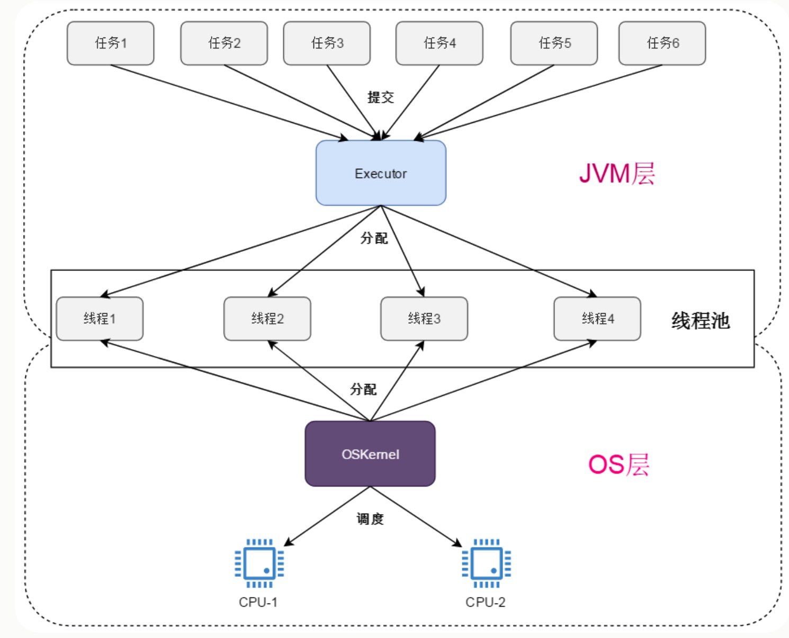

Executor 是一个接口，它将任务的提交与任务的执行分离开来，定义了一个接收 Runnable 对象的方法 execute。Executor 是 Executor 框架中最基础的一个接口，类似于集合中的 Collection 接口。

```java
public interface Executor {
    void execute(Runnable command);
}
```


##### 12.6.2.2.1 Executor框架组成

Executor框架主要由3大部分组成如下:

1. 任务： `Runnable` 或 `Callable` 接口及其实现类。
2. 任务执行器： 主要是 `Executor` 及扩展Executor的 `ExecutorService` 接口的一些实现类。Executor框架有两个重要的实现类，一个是线程池执行器 `ThreadPoolExecutor` ，另一个是定时任务执行器 `ScheduledThreadPoolExecutor` 。
3. 任务的结果:  `Future `接口及其默认实现 `FutureTask` 。

框架的使用示意图如下：

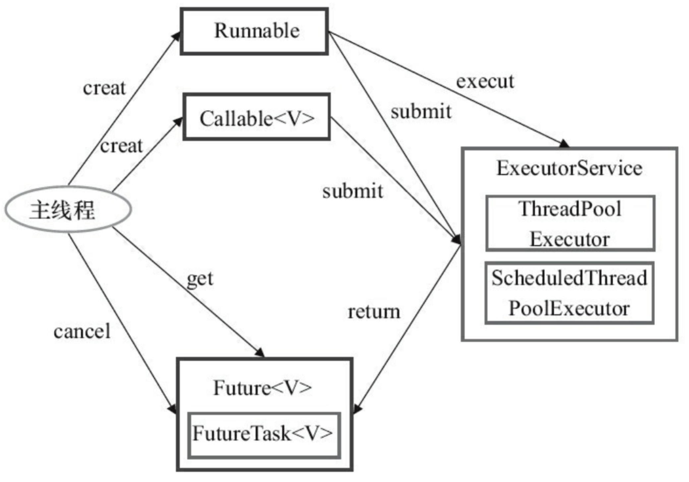

ExecutorService继承了Executor，是一个比 Executor 使用更广泛的子类接口。定义了终止任务、提交任务、跟踪任务返回结果等方法。一个 ExecutorService 是可以关闭的，关闭之后它将不能再接收任何任务，对于不在使用的 ExecutorService，应该将其关闭以释放资源。

```java
public interface ExecutorService extends Executor {

	// 关闭执行器，但之前提交的任务可以完成。
    void shutdown();

    // 关闭执行器，尝试终止正在完成的任务，并返回正在等待执行的任务列表。
    List<Runnable> shutdownNow();

    // 如果执行器已经关闭则返回true，否则返回false。
    boolean isShutdown();

    // 只有在shutdown之后且所有任务都已经终止才返回true。
    boolean isTerminated();

    // 阻塞等待执行器终止。返回的可能原因有：执行器终止，超时，线程被中断。如果是因为执行器终止则返回true。
    boolean awaitTermination(long timeout, TimeUnit unit)
        throws InterruptedException;

    // 向执行器提交一个有返回值的任务，执行器返回一个 Future 对象，可以通过该对象访问计算结果。
    <T> Future<T> submit(Callable<T> task);

  
    // 向执行器提交一个无返回值的任务，执行器返回一个 Future 对象，通过该对象的get方法可以获取到result对象。
    <T> Future<T> submit(Runnable task, T result);

	// 向执行器提交一个无返回值的任务，执行器返回 null。
    Future<?> submit(Runnable task);

    // 向执行器提交一组有返回值的任务，当任务全部执行完后，执行器返回对应的Future对象的列表。
    <T> List<Future<T>> invokeAll(Collection<? extends Callable<T>> tasks)
        throws InterruptedException;

    // 向执行器提交一组有返回值的任务，当任务全部执行完或超时后，执行器返回对应的Future对象的列表。未完成的任务将被取消。
    <T> List<Future<T>> invokeAll(Collection<? extends Callable<T>> tasks,
                                  long timeout, TimeUnit unit)
        throws InterruptedException;

    // 向执行器提交一组有返回值的任务，当任一任务执行完后，执行器返回对应的Future对象。未完成的任务将被取消。
    <T> T invokeAny(Collection<? extends Callable<T>> tasks)
        throws InterruptedException, ExecutionException;

    // 向执行器提交一组有返回值的任务，当任一任务执行完或超时后，执行器返回对应的Future对象。未完成的任务将被取消。
    <T> T invokeAny(Collection<? extends Callable<T>> tasks,
                    long timeout, TimeUnit unit)
        throws InterruptedException, ExecutionException, TimeoutException;
}
```


##### 12.6.2.2.2 Runnable 和 Callable

Runnable 接口和 Callable 接口的实现类，都可以被 ThreadPoolExecutor 或 ScheduledThreadPoolExecutor 执行。它们之间的区别是 Runnable 没有返回值，无法判断任务是否完成，而 Callable 有一个返回结果。

除了可以自己创建实现 Callable接口 的对象外，还可以使用工厂类 Executors 将一个 Runnable 包装成一个 Callable。

` callable(Runnable)` 方法包装不需要结果的Runnable任务，任务完成后 `Future.get()` 会获取一个null值。而 `callable(Runnable,T)` 可以包装一个需要结果的Runnable任务，结果可以通过参数result指定，任务完成后`Future.get()`可以获得这个结果 result。

```java
public static Callable<Object> callable(Runnable task) 
public static <T> Callable<T> callable(Runnable task, T result)
```


##### 12.6.2.2.3 Executors

`ThreadPoolExecutor` 是 `ExecutorService` 最重要的实现类，`ThreadPoolExecutor` 不直接实现 `ExecutorService` 接口，它直接继承 `AbstractExecutorService` 抽象类， `AbstractExecutorService` 对 `ExecutorSerivice`接口中的一些方法做过的默认实现 。

前文已经对使用构造方法创建线程池做过详细说明，这里介绍使用工厂类 `Executors` 来创建线程池。工厂类 `Executors` 提供的一些静态工厂方法，可以以此方便地创建一些常用配置的线程池。Executors 可以创建3种类型的 ExecutorService，它们都是使用 ThreadPoolExecutor 的构造方法来创建的。

+ FixedThreadPool：固定线程的数量的线程池。
+ SingleThreadExecutor：只有一个线程的线程池。
+ CachedThreadPool：可根据实际情况调整线程数量的线程池。


##### 12.6.2.2.4 固定线程池

newFixedThreadPool 系列方法创建固定线程数的线程池。它适用于为了满足资源管理的需求，而需要限制当前线程数量的应用场景，适用于负载比较重的服务器。

```java
// 创建固定线程数的线程池
public static ExecutorService newFixedThreadPool(int nThreads) {
    return new ThreadPoolExecutor(nThreads, nThreads, 0L, TimeUnit.MILLISECONDS,
            new LinkedBlockingQueue<Runnable>());
}
// 创建固定线程数的线程池，并且提供指定的线程工厂
public static ExecutorService newFixedThreadPool(int nThreads, ThreadFactory threadFactory) {
    return new ThreadPoolExecutor(nThreads, nThreads, 0L, TimeUnit.MILLISECONDS,
            new LinkedBlockingQueue<Runnable>(), threadFactory);
 }
```

+ 固定线程数的线程池实际上是核心线程数和最大线程数均为参数 nThreads 的线程池。
+ keepAliveTime为非核心线程等待新任务的最长时间，超过这个时间后的这些线程将被终止。corePoolSize 和 maximumPoolSize 参数设置为相同值,表示线程池中所有线程均是核心线程, 那么 keepAliveTime 参数就是无意义的，因此这里使用了 0。
+ 使用 `LinkedBlockingQueue<Runnable>` 作为存放任务的阻塞队列。
+ 处理任务流程说明：
    1. 当线程池中的线程数小于corePoolSize时，线程池会创建新线程去执行任务。
    2. 在经过一段时间预热后，线程数达到了corePoolSize（因为maximumPoolSize与corePoolSize相同，此时也达到了最大线程数，以后不会再创建线程），开始将任务放入工作队列中。
    3. 此后有新任务到达就放入工作队列（LinkedBlockingQueue无参构造方法，创建的队列容量是Integer.MAX_VALUE ,这种队列几乎不可能容量爆满，不会拒绝任务，拒绝策略不起作用），若有线程处于空闲状态则从工作队列中获取任务并执行。


##### 12.6.2.2.5 单线程池

newSingleThreadExecutor 系列方法创建单个线程的线程池。它适用于保证任务按顺序执行，并且在任何时候最多只有一个活动(正在执行)的线程的场景。

```java
//创建单个线程的线程池
public static ExecutorService newSingleThreadExecutor() {
    return new FinalizableDelegatedExecutorService
            (new ThreadPoolExecutor(1, 1, 0L, TimeUnit.MILLISECONDS, new 											LinkedBlockingQueue<Runnable>()));
}

public static ExecutorService newSingleThreadExecutor(ThreadFactory threadFactory) {
    return new FinalizableDelegatedExecutorService
            (new ThreadPoolExecutor(1, 1, 0L, TimeUnit.MILLISECONDS, new 											LinkedBlockingQueue<Runnable>(),threadFactory));
}

```

+ `newSingleThreadExecutor` 方法不是直接返回 `ThreadPoolExecutor` 对象，它将 `ThreadPoolExecutor` 对象进行包装成 `FinalizableDelegatedExecutorService` 对象，但实际的业务处理还是委托给 `ThreadPoolExecutor` 去实现。
+ 这类线程池的 corePoolSize 和 maximumPoolSize 都被设为1，线程池中最多有一个线程，同样地这里的 keepAliveTime 参数是无意义的。
+ 使用 `LinkedBlockingQueue<Runnable>` 作为存放任务的阻塞队列。
+ 单线程执行器对千性能分析很有帮助。如果临时用一个单线程池替换缓存或固定线程 池，就能测量不使用并发的情况下应用的运行速度会慢多少。
+ 处理任务流程说明：
    1. 当线程池中无任何线程时，线程池会创建一个线程去执行任务。
    2. 当线程池中有一个线程时，开始将任务放入工作队列中。
    3. 此后有新任务到达就放入工作队列，若线程池中的唯一线程处于空闲状态则从工作队列中取出任务并执行。


##### 12.6.2.2.6 缓存线程池

newCachedThreadPool 系列方法创建的线程池对线程数没有限制，会按需创建新线程，适用于执行很多的短期异步任务的小任务，或者是负载较轻的服务器。

```java
//根据需要创建新线程的线程池
public static ExecutorService newCachedThreadPool() {
    return new ThreadPoolExecutor(0, Integer.MAX_VALUE, 60L, TimeUnit.SECONDS,
                                  new SynchronousQueue<Runnable>());
}
public static ExecutorService newCachedThreadPool(ThreadFactory threadFactory) {
    return new ThreadPoolExecutor(0, Integer.MAX_VALUE, 60L, TimeUnit.SECONDS,
                                  new SynchronousQueue<Runnable>(),threadFactory);
}
```

+ 这种线程池的corePoolSize为零，maximumPoolSize为Integer.MAX_VALUE，表明线程池中没有核心线程，所有线程均是非核心线程，且可允许的最大线程数是近乎无限大。
+ keepAliveTime参数设为60，单位是秒，表明空闲线程最多等待60秒就被终止。
+ 使用 `SynchronousQueue<Runnable>` 存放任务。这种队列是没有容量的（当尝试排队时，只有正好有空闲线程正在等待接受任务时才会入队成功），但可允许创建的最大线程数是无限大的。这意味着如果主线程提交任务的速度大于任务处理的速度，线程池就会创不断建新线程，这样可能导致创建的线程过多，系统资源被耗尽、程序崩溃。
+  处理任务流程说明：
    1. 因为核心线程数为0，所以线程池在启动时核心线程池就已经满了。在主线程提交第一个任务时，线程池就要将尝试此任务入队，由于 `SynchronousQueue` 的特殊性，只有当此时空闲线程也正在出队，入队与出队两者恰好匹配时，主线程会把任务交给空闲线程去执行。否则将进入下一步。
    2. 当线程池中无任何线程或无空闲线程时，将没有线程执行出队操作。此时execute 方法中在workQueue上调用的poll方法会直接返回false，于是线程池会创建建一个新线程执行任务。
    3. 上一步中创建的新线程在执行完的任务后，会调用 SynchronousQueue.poll 等待任务出队。这个空闲线程最多等待60秒时间，若主线程在60秒内提交了一个新任务，此空闲线程将获取到这个任务并执行。若等待60秒后，还没等到新任务到达，这个线程将被终止。


##### 12.6.2.2.7 ScheduledExecutorService

`ScheduledExecutorService` 接口继承 `ExecutorService` 接口，除了提供原生的线程池功能外，还支持定时处理任务的功能。

```java
package java.util.concurrent;

public interface ScheduledExecutorService extends ExecutorService {
    
    // 提交一个在delay时间后开始的动作
    public ScheduledFuture<?> schedule(Runnable command,
                                       long delay, TimeUnit unit);
    
    // 提交一个在delay时间后开始的动作，立即返回一个ScheduledFuture对象
    public <V> ScheduledFuture<V> schedule(Callable<V> callable,
                                           long delay, TimeUnit unit);
   
    // 提交一个在initialDelay时间后开始的动作，然后每隔period时间都再执行一遍，循环不断直到：
    // 1. 某次执行抛出了异常
    // 2. 动作被取消
    // 3. 执行器被关闭
    // 如果某次执行时间超过period，那么下一个周期任务将在上一个执行完毕之后马上执行。
    public ScheduledFuture<?> scheduleAtFixedRate(Runnable command,
                                                  long initialDelay,
                                                  long period,
                                                  TimeUnit unit);

    // 提交一个在initialDelay时间后开始的动作，然后每次执行完毕后经过delay时间再执行一遍，循环不断直到：
    // 1. 某次执行抛出了异常
    // 2. 动作被取消
    // 3. 执行器被关闭
    public ScheduledFuture<?> scheduleWithFixedDelay(Runnable command,
                                                     long initialDelay,
                                                     long delay,
                                                     TimeUnit unit);
}
```

这里 schedule 方法返回 `ScheduledFuture` 对象。`ScheduledFuture<V>` 接口继承 `Delayed` 接口和 `Future<V>` 接口，没有声明任何其他的方法。

```java
package java.util.concurrent;
public interface ScheduledFuture<V> extends Delayed, Future<V> {}
```


##### 12.6.2.2.8 ScheduledThreadPoolExecutor

定时任务执行器 `ScheduledThreadPoolExecutor` 类是JDK提供的 `ScheduledExecutorService` 接口的默认实现类。它可以通过构造方法创建，也可通过工厂类Executors的静态方法创建。

+ 实现 `ScheduledExecutorService` 接口，继承 `ThreadPoolExecutor` 类。

+ 内部类 `ScheduledFutureTask<V>` 继承 `FutureTask<V>` ，实现 `RunnableScheduledFuture<V>` ，其实例作为schedule方法的返回值。

+ 内部类 `DelayedWorkQueue` ，继承 `AbstractQueue<Runnable>` ，实现 `BlockingQueue<Runnable>` ，其实例作为线程池存放任务的阻塞队列。

+ `Executors` 工厂类可以创建两种类型的 `ScheduledExecutorService`，分别由 newSingleThreadScheduledExecutor 和 newScheduledThreadPool 方法创建，二者均由 `ScheduledThreadPoolExecutor` 实现。

+ 4个构造函数，都是通过调用父类 ThreadPoolExecutor 的构造函数完成。

    ```java
    public ScheduledThreadPoolExecutor(int corePoolSize) {
        super(corePoolSize, Integer.MAX_VALUE, 0, NANOSECONDS, new DelayedWorkQueue());
    }
    
    public ScheduledThreadPoolExecutor(int corePoolSize, ThreadFactory threadFactory) {
        super(corePoolSize, Integer.MAX_VALUE, 0, NANOSECONDS,new DelayedWorkQueue(), threadFactory);
    }
    
    public ScheduledThreadPoolExecutor(int corePoolSize,  RejectedExecutionHandler handler) {
        super(corePoolSize, Integer.MAX_VALUE, 0, NANOSECONDS,  new DelayedWorkQueue(), handler);
    }
    
    public ScheduledThreadPoolExecutor(int corePoolSize, ThreadFactory threadFactory,
    RejectedExecutionHandler handler) {
        super(corePoolSize, Integer.MAX_VALUE, 0, NANOSECONDS, new DelayedWorkQueue(), threadFactory, handler);
    }
    ```


##### 12.6.2.2.9 单线程定时任务执行器

newSingleThreadScheduledExecutor 系列方法用于创建单个线程的定时任务执行器。它适用于按照固定顺序执行周期性的定时任务，且最多同时执行一个任务的情况。

```java
// 单线程的定时任务执行器
public static ScheduledExecutorService newSingleThreadScheduledExecutor() {
    return new DelegatedScheduledExecutorService
        (new ScheduledThreadPoolExecutor(1));
}

public static ScheduledExecutorService newSingleThreadScheduledExecutor(ThreadFactory threadFactory) {
        return new DelegatedScheduledExecutorService
            (new ScheduledThreadPoolExecutor(1, threadFactory));
}
```


##### 12.6.2.2.10 多线程定时任务执行器

newScheduledThreadPool 系列方法用于创建给定个数线程的定时任务执行器。它适用于需要多个线程执行周期任务，同时又要限制线程数、防止创建线程过多耗费资源的情况。

```java
// 多线程的定时任务执行器
public static ScheduledExecutorService newScheduledThreadPool(int corePoolSize) {
    return new ScheduledThreadPoolExecutor(corePoolSize);
}

public static ScheduledExecutorService newScheduledThreadPool(
        int corePoolSize, ThreadFactory threadFactory) {
    return new ScheduledThreadPoolExecutor(corePoolSize, threadFactory);
}
```


##### 12.6.2.2.11 任务窃取执行器

在Java 8中，引入了一种新型的适合“fork-join”（见12.6.4节）任务的线程池，使用newWorkStealingPool()来创建。WorkStealingPool 通过工作窃取的方式，使得多核的 CPU 不会闲置，总会有活着的线程让 CPU 去运行。顾名思义，它基于工作窃取算法，其中任务可以生成其他较小的任务，这些任务将添加到并行处理线程的队列中。如果一个线程完成了工作并且无事可做，则可以从另一线程的队列中“窃取”工作。

```java
public static ExecutorService newWorkStealingPool(int parallelism) {
    return new ForkJoinPool
        (parallelism,
         ForkJoinPool.defaultForkJoinWorkerThreadFactory,
         null, true);
}
public static ExecutorService newWorkStealingPool() {
    return new ForkJoinPool
        (Runtime.getRuntime().availableProcessors(),
         ForkJoinPool.defaultForkJoinWorkerThreadFactory,
         null, true);
}
```


### 12.6.3 控制任务组

我们已经了解了如何使用一个执行器服务作为线程池来提高任务执行的效率。有时，使用执行器有更策略性的原因：需要控制一组相关的任务。例如，可以在执行器中使用 shutdownNow 方法取消所有的任务。

invokeAny 方法提交一个 Callable 对象集合中的所有对象，该方法会阻塞，返回某个已完成任务的结果。我们不知道返回的究竟是哪个任务的结果，这往往是最快完成的那个任务。对于搜索问题，如果我们愿意接受任何一种答案，就可以使用这个方法。例如，假定需要对一个大整数进行因数分解，这是 RSA 解码时需要完成的一种计算。可以提交很多任务，每个任务尝试对不同范围内的数进行分解。只要其中一个任务得到了答案，计算就可以停止了。

invokeAll 方法提交一个 Callable 对象集合中的所有对象，这个方法会阻塞，直到所有任务都完成，并返回表示所有任务答案的一个 Future对象列表。

下面是一个使用 invokeAny 搜索指定路径下任一包含指定单词的文件程序。这里使用 invokeAny 并行化搜索，但是要注意任务的建立。一旦有任务返回，invokeAny 方法就会终止，因此，对于那些没有搜索到的线程，我们不希望它们返回，所以可以让它们抛出异常。另外，当一个线程成功时，其他任务就要取消，所以我们要监视中断标识，可以在被中断后打印消息然后退出。

```java
public static Callable<Path> searchForTask(String word, Path path)
{
    return ()->{
        try(var in = new Scanner(path))
        {
            while(in.hasNext())
            {
                if(in.next().equals(word)) return path;
                if(Thread.currentThread().isInterrupted())
                {
                    System.out.println("Search in "+path+" canceled.");
                    return null;
                }
            }
            throw new NoSuchElementException;
        }
    }
}

public static void main(String[] args)
{
    System.out.print ("Enter base directory (e.g. /opt/jdk-9-src)：");
	String start = in.nextLine();
	System.out.print ("Enter keyword (e.g. volatile)：");
	String word = in.nextLine();

    ExecutorService executor = Executors.newCachedThreadPool();    
    Set<Path> files descendants(Path.of (start));
    var searchTasks = new ArrayList<Callable<Path>>();
	for (Path file:files)
		searchTasks.add(searchForTask(word, file));
	Path found = executor.invokeAny(searchTasks);
	System.out.println (word + " occurs in " + found);
}
```


### 12.6.4 fork-join 框架

有些应用使用了大量线程，但其中大多数都是空闲的。举例来说，一个 Web 服务器可能会为每个连接分别使用一个线程。另外一些应用可能对每个处理器内核分别使用一个线程，以完成计算密集型任务，如图像或视频处理。Java 7 中新引入了 fork-join 框架，专门用来支持后一类应用。假设有一个处理任务，它可以很自然地分解为子任务，如下所示：

```
if( problemSize < threshold )
     solve problem directly
else
{
    break problem into subproblems
    recursively solve each subproblem
    combine the results
}
```

图像处理就是这样一个例子。要增强一个图像，可以变换上半部分和下部部分。如果有足够多空闲的处理器，这些操作可以并行运行（除了分解为两部分外，还需要做一些额外的工作，不过这属于技术细节，我们不做讨论)。

在这里，我们将讨论一个更简单的例子。假设想统计一个数组中有多少个元素满足某个特定的属性。可以将这个数组一分为二，分别对这两部分进行统计，再将结果相加。

要使用 fork-join 框架完成这种递归计算，需要：

1. 如果递归计算有返回值，需要提供一个扩展 `RecursiveTask<T>` 的类；如果递归计算没有返回值，需要提供一个扩展 `RecursiveAction` 的类。
2. 在我们提高的类中，覆盖父类的 compute 方法，在其中生成并调用子任务，然后合并其结果。
3. 生成一个 `ForkJoinPool` ，在这个线程池上调用 invoke 方法启动我们的扩展类对象。
4. 在对象上调用 join 方法合并并返回计算结果。

在后台，fork-join 框架使用了一种有效的智能方法来平衡可用线程的工作负载，这种方法称为工作窃取(work stealing)。每个工作线程都有一个双端队列（deque）来完成任务。一个工作线程将子任务压入其双端队列的队头。（只有一个线程可以访问队头，所以不需要加
锁。）一个工作线程空闲时，它会从另一个双端队列的队尾“窃取”一个任务。由于大的子任务都在队尾，这种窃取很少出现。

下面是一个例子，统计一个数组中大于0.5的数字的个数。

```java
package forkJoin；

import java.util.concurrent.*;
import java.util.function.*;

public class ForkJoinTest
{
    public static void main(String[] args)
	{
        final int SIZE = 10000000;
        var numbers = new double[SIZE];
        for (int i = 0; i<SIZE; i++) 
            numbers[i] = Math.random();
        var counter = new Counter(numbers, O, numbers. length, × -> x> 0.5);
        var pool = new ForkJoinPool();
        pool.invoke(counter);
        System.out.println(counter. join());
    }
}

class Counter extends RecursiveTask<Integer>
{
    public static final int THRESHOLD = 1000;
    private double[]] values;
    private int from;
    private int to;
    private DoublePredicate filter;

    public Counter (double[] values, int from, int to, DoublePredicate filter)
    {
        this.values = yalues;
        this.from = from;
        this.to = to;
        this.filter = filter;
    }

    protected Integer compute()
    {
        if(to - from ＜ THRESHOLD)
        {
            int count = 0;
            for (int i = from; i < to; i++)
            {
	            if (filter.test(values[i])) count++;
            }
            return count;
        }
        else
        {
			int mid =(from + to)/2;
            var first = new Counter(values, from, mid, filter);
            var second = new Counter(values, mid, to, filter);
            invokeAll(first, second);
            return first.join() + second.join();
        }
    }
}
```


## 12.7 异步计算

到目前为止，我们的并发计算方法都是先分解一个任务，然后等待，直到所有部分都已经完成。不过等待并不总是个好主意。在接下来几节中，你会了解如何实现无等待或异步的计算。


### 12.7.1 CompletableFuture

当有一个 Future 对象时，需要调用 get 来获得值，这个方法会阻塞，直到值可用。CompletableFuture 类实现了 Future 接口，它提供了获得结果的另一种机制。你可以注册一个回调函数，一旦Future对象的结果可用，就会（在某个线程中）利用该结果调用这个回调函数。

```java
CompletableFuture<String> f = ...
f.thenAccept(s -> Process the result string s);
```

通过这种方式，无须阻塞就可以在结果可用时对结果进行处理。


#### 12.7.1.1 实例化CompletableFuture

可以直接使用无参的构造函数：

```java
CompletableFuture<String> completableFuture = new CompletableFuture<String>();
```

于是，可以在一个异步线程中进行计算，计算完成后 complete 方法为这个对象指定计算结果。

```java
var f = new CompletableFuture<Integer>();
executor.execute(() ->
	{ int n = workHard (arg);
     f.complete(n);
    });

executor.execute(() ->
	{ int n = workHard (arg);
     f.complete(n);
    });
```

上面的代码中，启动了两个线程计算workHard函数，其中先完成的线程将结果赋值给 CompletableFuture 对象，主线程可以使用get等方法获取结果，也可以为其指定回调函数。

也可以使用CompletableFuture的静态方法更加快捷的生成实例对象。其中 supply 系列用于执行有返回值的任务，run 系列用于执行没有返回值的任务。每个系列都有两个方法，其中不带执行器参数的将使用默认的系统级公共线程池 ForkJoinPool，且这些线程都是守护线程。我们在编程的时候需要谨慎使用守护线程，如果将我们普通的用户线程设置成守护线程，当我们的程序主线程结束，JVM中不存在其余用户线程，那么CompletableFuture的守护线程会直接退出，造成任务无法完成的问题，其余的包括守护线程阻塞问题我就不在本篇赘述。

```java
public static <U> CompletableFuture<U> supplyAsync(Supplier<U> supplier);
public static <U> CompletableFuture<U> supplyAsync(Supplier<U> supplier, Executor executor);

public static CompletableFuture<Void> runAsync(Runnable runnable);
public static CompletableFuture<Void> runAsync(Runnable runnable, Executor executor);
```


#### 12.7.1.2 同步获取结果

同步获取结果的方法将阻塞当前线程，直到任务计算完成。

```java
public T    get()
public T    get(long timeout, TimeUnit unit)
public T    getNow(T valueIfAbsent)
public T    join()
```

**join()** 与 **get()** 区别在于 **join()** 返回计算的结果或者抛出一个unchecked异常(CompletionException)，而**get()** 返回一个具体的异常。


#### 12.7.1.3 后续操作

可以为 CompletableFuture 对象指定回调函数。

```java
public CompletableFuture<T> whenComplete(BiConsumer<? super T,? super Throwable> action)
public CompletableFuture<T> whenCompleteAsync(BiConsumer<? super T,? super Throwable> action)
public CompletableFuture<T> whenCompleteAsync(BiConsumer<? super T,? super Throwable> action, Executor executor)
public CompletableFuture<T> exceptionally(Function<Throwable,? extends T> fn)
```

方法1和2的区别在于是否使用异步处理，2和3的区别在于是否使用自定义的线程池，前三个方法都会提供**一个返回结果和可抛出异常**，我们可以使用lambda表达式来接收这两个参数，然后自己处理。 方法4，接收一个可抛出的异常，且必须return一个返回值。

>这里带“Async”后缀的方法和不带后缀的方法区别在于谁去执行任务。如果使用 whenCompleteAsync，那么执行的线程是从 ForkJoinPool.commonPool() 或者自己定义的线程池中取线程去执行。如果使用 whenComplete，又分两种情况，如果 supplyAsync 方法执行速度特别快，那么 whenComplete 任务就使用主线程执行，如果 supplyAsync 执行速度特别慢，就是和 supplyAsync 执行线程一样。

这些方法的返回值都是T为参数类型的CompletableFuture。还有一组handle系列方法，可以指定参数类型的方法：

```java
public <U> CompletableFuture<U> handle(BiFunction<? super T,Throwable,? extends U> fn)
public <U> CompletableFuture<U> handleAsync(BiFunction<? super T,Throwable,? extends U> fn)
public <U> CompletableFuture<U> handleAsync(BiFunction<? super T,Throwable,? extends U> fn, Executor executor)
```

handle 系列方法会给出异常，但 apply 系列方法只有一个返回结果，如果异常了，会被直接抛出，交给上一层处理。 如果不想每个链式调用都处理异常，那么可以使用 apply。

```java
public <U> CompletableFuture<U> thenApply(Function<? super T,? extends U> fn)
public <U> CompletableFuture<U> thenApplyAsync(Function<? super T,? extends U> fn)
public <U> CompletableFuture<U> thenApplyAsync(Function<? super T,? extends U> fn, Executor executor)
```

上面的方法都返回了 CompletableFuture，因此可以在其上继续追加后续操作。而 accept 系列方法则是最后一步，它的返回对象的类型参数是空。

```java
public CompletableFuture<Void>  thenAccept(Consumer<? super T> action)
public CompletableFuture<Void>  thenAcceptAsync(Consumer<? super T> action)
public CompletableFuture<Void>  thenAcceptAsync(Consumer<? super T> action, Executor executor)
```


### 12.7.2 组合CompletableFuture

上一节介绍的 CompletableFuture 的追加回调函数的方法的参数都是普通的方法函数。`在一个 CompletableFuture<T>` 上调用 thenApply 方法，会生成一个新的对象 `CompletableFuture<U>` ，而 thenApply 的参数 fn，就是一个接受参数类型为 T ，返回类型为 U 的方法。

thenCompose 系列方法提供了一种更加自由的设置回调函数的方法。下面是它的声明：

```java
public <U> CompletableFuture<U> thenCompose(
    Function<? super T, ? extends CompletionStage<U>> fn) {
    return uniComposeStage(null, fn);
}

public <U> CompletableFuture<U> thenComposeAsync(
    Function<? super T, ? extends CompletionStage<U>> fn) {
    return uniComposeStage(asyncPool, fn);
}

public <U> CompletableFuture<U> thenComposeAsync(
    Function<? super T, ? extends CompletionStage<U>> fn,
    Executor executor) {
    return uniComposeStage(screenExecutor(executor), fn);
}
```

可以发现，它与 thenApply 系列方法的不同之处在于，函数 fn 的返回值类型不再是 `? extends U`，而是 `? extends CompletionStage<U>` 。也就是说，thenCompose 设置的回调函数的返回值可以是一个 CompletableFuture。这样一来，在我们的指令流中，就可以组合不同的 CompletableFuture 方法了。

例如，考虑从一个给定 URL 读取一个 Web 页面的动作。不用提供以下阻塞方法:

```java
public String blockingReadPage(URL url)
```

更精巧的做法是让方法返回一个 future:
```java
public CopmletableFuture<String> readPgae(URL url)
```

这样就可以用 thenCompose 把这个方法与其方法组合起来。

```java
CompletableFuture.completedFuture(url)
    .thenComposeAsync(this::readPage, executor);
```


### 12.7.3 用户界面回调中的长时间运行任务

在程序中使用线程的理由之一是提高程序的响应性能。当应用程序有用户界面时，这一点尤其重要。当程序需要做某些耗时的工作时，不能在用户界面线程完成这些工作，否则用户界面会冻结。应该启动另一个工作线程。

不过，不能直接从执行长时间运行任务的工作线程更新用户界面。Swing、JavaFX 或 Android 等用户界面都不是线程安全的。不能从多个线程操纵用户界面元素，否则它们会被破坏。实际上，JavaFX 和 Android 会检查这一点，如果试图从 UI线程以外的某个线程访问用户界面，会抛出一个异常。

关于用户界面的具体细节，本资料不涉及。


## 12.8 进程

到目前为止，我们已经了解了如何在同一个程序的不同线程中执行 Java 代码。有时你还需要执行另一个程序。为此，可以使用 `ProcessBuilder` 和 `Process` 类。`Process` 类在一个单独的操作系统进程中执行一个命令，允许我们与标准输人、输出和错误流交互。`ProcessBuilder` 类则允许我们配置 `Process` 对象。


### 12.8.1 建立一个进程

#### 12.8.1.1 ProcessBuilder

首先指定你想要执行的命令。可以提供一个 `List<string>`，或者直接提供命令字符串。

```java
var builder = new ProcessBuilder("gcc", "myapp.c");
```

>注意，第一个宇符串必须是一个可执行的命令，而不是一个 Shel 内置命令。例如，要在 Windows 中运行 dir 命令，就需要提供字符串"cnd.exe"，"/C" 和"dir"来建立进程。


#### 12.8.1.2 配置工作目录

每个进程都有一个工作目录，用来解析相对目录名。默认情况下，进程的工作目录与虚拟机相同，通常是启动 java 程序的那个目录。可以用 directory 方法改变工作目录：

```java
builder = builder.directory(path.toFile());
```

>注意，配置 ProcessBuilder 的各个方法都返回其自身，所以可以把命令串起来。
>
>```java
>Process p = new ProcessBuilder(command).directory(file).start():
>```


#### 12.8.1.3 配置IO

接下来，要指定如何处理进程的标准输人、输出和错误流。默认情况下，它们分别是一个管道，可以用以下方法访问：

```java
OutputStream processIn = p.getOutputStream(); // 返回与进程的标准输入相关联的输出流。
InputStream processOut = p.getInputStream(); // 返回与进程的标准输出相关联的输入流。
InputStream processErr = p.getErrorStream(); // 返回与进程的标准错误输出相关联的输入流。
```

注意，进程的输入流是JVM的一个输出流。我们会写入这个流，而我们写的内容会成为进程的输入。与之相反，我们会读取进程的输出流和错误流的内容。对我们来说，它们都是输入流。可以指定新进程的输入、输出和错误流与JVM相同。如果用户在一个控制台运行 JVM,
所有用户输入都会转发到进程，而进程的输出将显示在控制台上。可以调用下面的方法为这 3 个流建立这个设置。

```java
builder.redirectIO()
```

如果你只想继承某些流，例如，可以把一个新的 Redirect 对象传入 redirectInput 方法。每一个 Redirect 对象都是下面的一种：

+ 特殊值[`Redirect.PIPE`](https://www.runoob.com/manual/jdk1.6/java.base/java/lang/ProcessBuilder.Redirect.html#PIPE)：表示子进程I / O将通过管道连接到当前Java进程。 这是子进程标准I / O的默认处理。
+ 特殊值[`Redirect.INHERIT`](https://www.runoob.com/manual/jdk1.6/java.base/java/lang/ProcessBuilder.Redirect.html#INHERIT)：表示子进程I / O源或目标将与当前进程的相同。 这是大多数操作系统命令解释程序（shell）的正常行为。
+ 特殊值[`Redirect.DISCARD`](https://www.runoob.com/manual/jdk1.6/java.base/java/lang/ProcessBuilder.Redirect.html#DISCARD)：表示将丢弃子进程输出。 典型的实现通过写入操作系统特定的“空文件”来丢弃输出。
+ 重定向从文件读取，由调用[`Redirect.from(File)`](https://www.runoob.com/manual/jdk1.6/java.base/java/lang/ProcessBuilder.Redirect.html#from(java.io.File))创建。
+ 重定向到写入文件，由调用[`Redirect.to(File)`](https://www.runoob.com/manual/jdk1.6/java.base/java/lang/ProcessBuilder.Redirect.html#to(java.io.File))创建。
+ 重定向附加到文件，由调用[`Redirect.appendTo(File)`](https://www.runoob.com/manual/jdk1.6/java.base/java/lang/ProcessBuilder.Redirect.html#appendTo(java.io.File))创建。

例如，通过提供 File 对象，可以将进程流重定向到文件：

```java
builder.redirectInput(inputFile)
	.redirectOutput(outputFile)
	.redirectError(errorFile);
```

合并输出和错误流通常很有用，这样就能按进程生成这些消息的顺序显示输出和错误消息。可以调用下面的方法启用合并。如果这样做，就不能再在 ProcessBuilder上调用 redirectError, 也不能在 Process上调用getErrorStream。

```java
builder.redirectErrorStream(true)
```

如果希望利用管道将一个进程的输出作为另一个进程的输入（类似于 shell 中的|操作符)，Java 9提供了一个 startPipeline 方法。可以传入一个进程构建器列表，并从最后一个进程读取结果。下面给出一个例子，这里会枚举一个目录树中的各个扩展：

```java
List<Process> processes = ProcessBuilder.startPipeline(List.of(
	new ProcessBuilder("find", " /opt/jdk-9"),
    new ProcessBuilder("grep", "-o","\\.[^./]*$"),
    new ProcessBuilder("sort"),
    new ProcessBuilder("uniq")
));
Process last = processes.get(processes.size()-1)；
var result = new String(last.getInputStream().readAllBytes()); // 注意，这里使用 getInputStream 获取与最后一个进程的标准输出流相关联的输入流。
```


#### 12.8.1.3 配置环境变量

你可能还想修改进程的环境变量。在这里，构建器的串链语法就不能用了。你需要得到构建器的环境（由运行 JVM的那个进程的环境变量初始化)，然后加入或删除环境变量条目。

```java
Map<String, String> env = builder.enviromment();
env.put("LANG","fr_FR");
env.remove("JAVA_HOME");
Process p = builder.start();
```


### 12.8.2 运行一个进程

配置了构建器之后，要调用它的 start 方法启动进程。如果把输入、输出和错误流配置为管道，现在可以写输人流，并读取输出和错误流。例如，

```java
Process process = new ProcessBuilder(" /bin/Ls"，"-1")
    .directory(Path.of("/tmp"). toFile())
    .start();
try (var in = new Scanner(process.getInputStream()))
{ 
    while (in.hasNextLine())
        System.out.printLn(in.nextLine());
}
```

>警告：进程流的缓冲空间是有限的。不能写入大多输入，而且要及时读取输出。如果有大量输入和输出，可能需要在单独的线程中生产和消费这些输入输出。

要等待进程完成，可以调用：

```java
int result = process.waitFor();
```

或者，如果不想无限期地等待，可以这样做：

```java
Long delay = ...;
if (process.waitfor(delay, TimeUnit.SECONDS)) {
	int result = process.exitValue();
    ...
}
else {
	process.destroyForcibly();
}
```

没有参数的 waitFor 返回过程的退出值（按惯例，0 表示成功，或者返回一个非0的错误码）。指定超时时间的 waitFor 返回是否超时然，如果没有超时则返回 true。返回后可以调用 exitValue 方法获取退出值。

你可能并不会等待进程结束，而只是让它继续运行，不时调用 isALive 来查看进程是否仍存活。要杀死这个进程，可以调用 destroy 或 destroyForcibly。这两个调用之间的区别取决于平台。在 UNIX上，前者会以 SIGTERM 终止进程，后者会以 SIGKILL 终止进程。如果 destroy 方法可以正常终止进程，SupportsNormalTermination 方法将返回 true。

最后进程完成时可以接收到一个异步通知。调用 process.onExit() 会得到一个 `CompletableFuture<Process>`，可以为其设置回调函数。

```java
process.onExit().thenAccept(
	p -> System.out.println("Exit value:" + p.exitValue()));
```


### 12.8.3 进程句柄

要获得程序启动的一个进程的更多信息，或者想更多地了解你的计算机上正在运行的任何其他进程，可以使用 `ProcessHandle` 接口。可以用4种方式得到一个 `ProcessHandle`:
1. 给定一个 `Process` 对象 p，p. toHandle() 会生成它的 `ProcessHandle`。
2. 给定一个 Long 类型的操作系统进程 ID， ProcessHandle.of(id) 可以生成这个进程的句柄。
3. Process.current () 是运行这个 Java 虚拟机的进程的句柄。
4. ProcessHandle.allProcesses() 可以生成对当前进程可见的所有操作系统进程的 `Stream<ProcessHandle>`。

给定一个进程句柄，可以得到它的进程 ID、父进程、子进程和后代进程：

```java
Long = pid = handle.pid();
Optional<ProcessHandle> parent = handle.parent();
Stream<ProcessHandle> children = handle.children();
Stream<ProcessHandle> descendants = handle.descendants();
```

>注意，allProcesses，children 和 descendants 方法返回的 `Stream<ProcessHandle>` 实例只是当时的快照。流中的任何进程在你看到它们的时候可能已经终上了，而且可能已经启动了其他进程，那些新启动的进程不在流中。

info 方法可以生成一个 Processhandle.Info 对象，它提供了一些方法来获得进程的有关信息。

```java
Optional<String[]> arguments()
Optional<String> command()
Optional<String> commandLine()
Optional<String> startInstant()
Optional<String> totalCpuDuration()
Optional<String> user()
```

所有这些方法都返回 Optional 值，因为可能某个特定的操作系统不能报告这个信息。

要监视或强制进程终止，与 Process 类一样，ProcessHandle 接口也有 isAlive、 supportsNormalTermination、 destroy、 destroyForcibly 和 onExit 方法。不过，没有对应 waitFor 的方法。

现在你已经读完了《Java核心技术第11版》的卷I。这一卷涵盖了 Java 程序设计语言的基础知识以及大多数编程项目所需要的标准库中的部分内容。有关高级主题，如 Java 平台模块系统、网络、高级用户界面和图形编程、安全性以及国际化，请阅读卷II。
