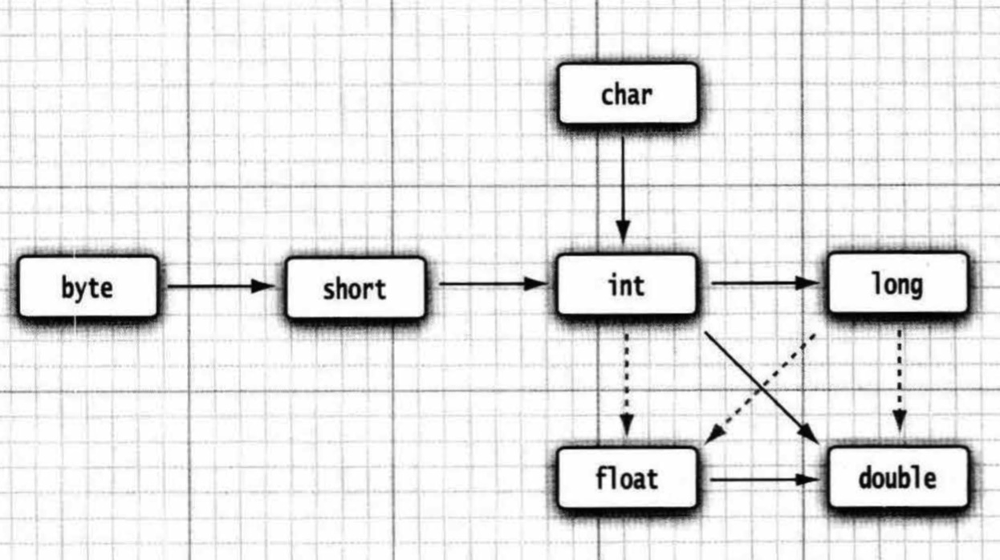
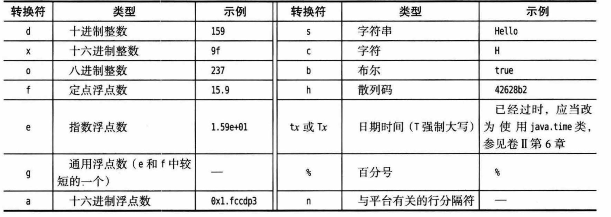
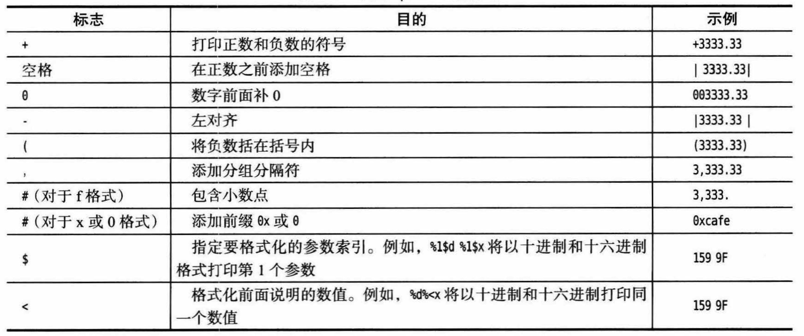
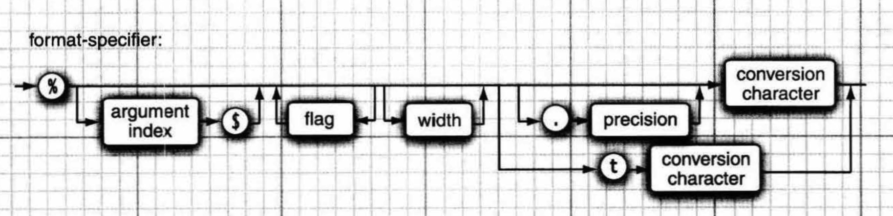

# 3. Java的基本程序设计结构

[TOC]


## 3.1 一个简单的Java程序

```java
public class FirstSample
{
    public static void main(String[] args)
    {
        System.out.println("Hello World");
    }
}
```

源代码的文件名必须与公共类的名字相同，并用.java 作为扩展名。


## 3.2 注释

Java 中，有 3 种标记注释的方式。

1. 最常用的方式是使用//,其注释内容从//开始到本行结尾。
2. 可以使用/\*和\*/注释界定符将一段比较长的注释括起来。
3. 第 3 种注释可以用来自动地生成文档。这种注释以/\*\*开始，以*/结束。


## 3.3 数据类型

java一共有8种基本数据类型(primitive type), 其中4种整型 byte，short，int，long，2种浮点类型float，double，1种字符类型char，还有boolean。


### 3.3.1 整型

byte，short, int, long 分别为1，2，4，8字节，与机器无关。

Java没有任何无符号数。

长整型数值有一个后缀 L 或 l (如 4000000000L)。十六进制数值有一个前缀 0x 或 0X (如 0xCAFE)。八进制有一个前缀 0, 例如， 010 对应十进制中的 8。前缀 0b 或 0B 表示二进制数。例如， 0b1001 就是 9。另外还可以为数字字面量加下划线，如用 1_000_000 (或0b1111_0100_0010_0100_0000) 表示100万。


### 3.3.2 浮点类型

 float占4字节，double占8字节。float类型的数值有一个后缀 F 或f (例如， 3.14F)。没有后缀 F 的浮点数值(如 3.14) 总是默认为 double 类型。当然，也可以在浮点数值后面添加后缀 D 或 d (例如3.14D)。

所有的浮点数值计算都遵循 IEEE 754 规范。具体来说，下面是用于表示溢出和出错情况的三个特殊的浮点数值:

+ 正无穷大

+ 负无穷大

+ NaN

例如，一个正整数除以 0 的结果为正无穷大。计算 0/0 或者负数的平方根结果为 NaN。


### 3.3.3 char类型

char的大小为2字节。char类型的字面量值要用单引号括起来。例如:' A'是编码值为 65 的字符常量。它与 "A" 不同，"A" 是包含一个字符 A 的字符串。 char类型的值可以表示为十六进制值，其范围从 \u0000 到\uFFFF。例如，\u2122 表示商标符号(TM), \u03C0 表示希腊字母 $\pi$。

\u表示unicode转义序列。

除了转义序列\u之外，还有一些用于表示特殊字符的转义序列，如下表所示。所有这些转义序列都可以出现在加引号的字符字面量或字符串中。

| 转移序列 | 名称   | Unicode值 |
| :--------: | :------: | :---------: |
| \b       | 退格   | \u0008    |
| \t       | 制表   | \u0009    |
| \n       | 换行   | \u000a    |
| \r       | 回车   | \u000d    |
| \\"      | 双引号 | \u0022    |
| \\'      | 单引号 | \u0027    |
| \\\\     | 反斜杠 | \u005c    |


### 3.3.4 Unicode和char类型

在Java中， char类型描述了 UTF-16编码中的一个代码单元。JVM中内码采用UTF16。早期，UTF16采用固定长度2字节的方式编码，两个字节可以表示65536种符号（其实真正能表示要比这个少），足以表示当时unicode中所有字符。但是随着unicode中字符的增加，2个字节无法表示所有的字符，UTF16采用了2字节或4字节的方式来完成编码。Java为应对这种情况，考虑到向前兼容的要求，Java用一对char来表示那些需要4字节的字符。所以，java中的char是占用两个字节，只不过有些字符需要两个char来表示。

>- java中内码（运行内存）中的char使用UTF16的方式编码，一个char占用两个字节，但是某些字符需要两个char来表示。所以，一个字符会占用2个或4个字节。
>- java中外码（外部文件、序列化后的String等）中char使用UTF8的方式编码，一个字符占用1～6个字节。
>- UTF16编码中，英文字符占两个字节；绝大多数汉字（尤其是常用汉字）占用两个字节，个别汉字（在后期加入unicode编码的汉字，一般是极少用到的生僻字）占用四个字节。
>- UTF8编码中，英文字符占用一个字节；绝大多数汉字占用三个字节，个别汉字占用四个字节。


### 3.3.5 boolean类型

boolean (布尔)类型有两个值:false 和true, 用来判定逻辑条件。整型值和布尔值之间不能进行相互转换。


## 3.4 变量与常量

### 3.4.1 声明变量

在Java 中，每个变藉都有一个类型(type)。在声明变量时，先指定变量的类型，然后是变量名。变量名必须是一个以字母开头并由字母或数字构成的序列。需要注意，与大多数程序设计语言相比，Java 中“字母”和“数字”的范围更大。字母包括 'A'~'Z' 、 'a'~'z' 、'_'、'$' 或在某种语言中表示字母的任何 Unicode字符。


### 3.4.2 变量初始化

声明一个变量之后，必须用赋值语句对变量进行显式初始化，也可以将变量的声明和初始化放在同一行中。在Java 中，变量的声明尽可能地靠近变量第一次使用的地方，这是一种良好的程序编写风格。

>从Java10开始，对于局部变量，如果可以从变量的初始值推断出它的类型， 就不再需要声明类型。只常要使用关键宇 var 而无须指定类型:
>
>```java
>var vacationDays = 12; // vacationDays is an int
>var greeting = "Hello"; // greeting is a String
>```

>*C++注释*：C和C++区分变量的声明与定义。例如:
>
>```c
>int i=18; //是一个定义
>extern int i; //是一个声明
>```
>在Java 中，并不区分变量的声明和定义。


### 3.4.3 常量

在Java 中，利用关键字final 指示常量。

```java
final double CM_PER_INCH = 2.54;
```

关键字final 表示这个变量只能被赋值一次。一旦被赋值之后，就不能够再更改了。习惯上，常量名使用全大写。

>*C++注释*：const是Java保留的关键字，但目前并没有使用。在Java中，必须使用final 定义常量。


### 3.4.4 枚举类型

有时候，变最的取值只在一个有限的集合内。针对这种情况，可以自定义枚举类型。枚举类型包括有限个命名的值。

```java
enum Size {SMALL, MEDIUM, LARGE, EXTRALARGE};
Size s = Size.MEDIUM;
```

Size类型的变量只能存储这个类型声明中给定的某个枚举值，或者特殊值 null。


## 3.5 运算符

### 3.5.1 算数运算符

在Java 中，使用算术运算符+、-、*、/表示加、减、乘、除运算。

>可移植性是Java语言的设计目标之一。无论在哪个虚拟机上运行，同一运算应该得到同样的结果。对于浮点数的算术运算，实现这样的可移植性是相当困难的。double类型使用 64位存储一个数值，而有些处理器则使用 80位浮点寄存器。这些寄存器增加了中间过程的计算精度，导致运算结果可能与始终使用 64位寄存器的处理器计算的结果不一样。因此，Java虚拟机 的最初规范规定所有的中间计算都必须进行截断。这种做法遭到了数字社区的反对。
>
>现在，在默认情况下，虚拟机设计者允许对中间计算结果采用扩展的精度。但对于使用 strictfp 关键字标记的方法必须使用严格的浮点计算。
>
>例如，可以把 main 方法标记为：
>
>```java
>public static strictfp void main(String[] args)
>```
>
>那么， main 方法中的所有指令都将使用严格的浮点计算。如果将一个类标记为 strictfp,这个类中的所有方法都要使用严格的浮点计算。


### 3.5.2 数学函数与常量

在 Math类中，包含了各种各样的数学函数。

在Java 中，没有幂运算，因此需要借助于 Math类的pow方法。

```java
// pow方法的两个参数均为double类型，返回值也为double
double y = Math.pow(x,a);

double a = Math.sqrt(4.0); // a=2.0
```

Math 类提供了一些常用的三角函数,指数函数：

```java
Math.sin()
Math.cos() 
Math.tan() 
Math.atan()
Math.log()
```

最后，Java 还提供了两个用于表示 $\pi$ 和 e 常量的最接近的近似值:

```java
Math.PI 
Math.E
```


### 3.5.3 数值类型之间的转换

下图给出了数值类型之间的合法转换。实线箭头表示无信息丢失的转换，虚线箭头表示可能有精度损失的转换。




当用一个二元运算符连接两个值时(例如 n + f, n 是整数，f是浮点数)，先要将两个操作数转换为同一种类型，然后再进行计算。

+ 如果两个操作数中有一个是 double类型，另一个操作数就会转换为 double类型。 
+ 否则，如果其中一个操作数是float类型，另一个操作数将会转换为float类型。 
+ 否则，如果其中一个操作数是 long类型，另一个操作数将会转换为 long类型。 
+ 否则，两个操作数都将被转换为int类型。

注意，当操作数是short，byte，char时，也会先提升为int，在进行计算。


### 3.5.4 强制类型转换

强制类型转换的语法格式是在圆括号中给出想要转换的目标类型，后面紧跟待转换的变量名。

将浮点类型强制转换为整型时，Java将截断小数部分。如果想要进行舍入运算，可以使用Math.round方法。

```java
//Math.round()的原理是对传入的参数+0.5之后，再向下取整。返回的结果为long类型。
//“向下取整”实际上就是Math.floor()方法，注意Math.floor()返回的值为double类型的。 
//类似地，还有一个Math.ceil()方法，表示“向上取整”，得到的结果是比参数大的第一个整数或者和参数相等的数，返回值也是double类型的。 
Math.round(-1.0); // -1
Math.round(-1.4); // -1
Math.round(-1.5); // -1 
Math.round(-1.6); // -2
```

>*C++注释* : 不要在 boolean 类型与任何数值类型之间进行强制类型转换。


### 3.5.5 结合赋值和运算符

可以在赋值中使用二元运算符，这是一种很方便的简写形式。

```java
x += 4;
```

>如果运算符得到一个值，其类型与左侧操作数的类型不同，就会发生强制类型 转换。例如，如果 x是一个int,则以下语句是合法的，它等价于 x = (int) (x+3.5)。
>
>```java
>x += 3.5;
>```


### 3.5.6 自增与自减运算符

Java 中，借鉴了 C 和 C++中的做法，也提供了自增、自减运算符，具有前缀和后缀形式。


### 3.5.7 关系和boolean运算符

关系运算符："==", "!=", "<", "<=", ">", ">="。

"&&"和"||"是逻辑运算符，按照“短路”方法求值；"!"是逻辑非运算。

Java支持三元操作服"? : ,"。


### 3.5.8 位运算符

位运算符：& ("and") I ("or")  ^ ("xor") ~ ("not") 。

Java中的">>"和""<<""为算数运算，"">>>""为逻辑运算，没有""<<<""。需要注意的是，java的移位运算的操作数只能是int或long。因此对byte，short，char进行移位操作时，会先进行符号位扩展至32位，之后再进行移位。

```java
byte x=(byte)0b10000000;
System.out.println(x); // -128
System.out.println(x>>1); // -64
System.out.println(x>>>1); // 2147483584
System.out.println(0b01111111_11111111_11111111_11000000); // 2147483584
```

> 移位运算符的右操作数要完成模 32 的运算(除非左操作数是 long类型，在这种情况下需要对右操作数模64)。例如， 1<<35的值等同于1<<3。

>*c++注释*: 在C, C++中，不能保证>>是完成算术移位(扩展符号位)还是逻辑移位(填充 0)。实现者可以选择其中更高效的任何一种做法。这意味着C，C++中的>>运算符对于负数生成的结果可能会依赖于具体的实现。Java 则消除了这种不确定性。


### 3.5.9 括号与运算符级别

同一个级别的运算符按照从左到右的次序进行计算(但右结合运算符除外。

>*C++注释* : 与C，C++不同，Java 不使用逗号运算符。不过，可以在for语句的第 1 和第 3 部分中使用逗号分隔表达式列表。


|                       运算符                         | 结合性   |
| :----------------------: | :-----------------: |
|                   [] . ()(方法调用)                    | 从左向右 |
| ! ~ ++ -- +(一元运算) -(一元运算) ()(强制类型转换) new | 从右向左 |
|                         * / %                          | 从左向右 |
|                          + -                           | 从左向右 |
|                       << >> >>>                        | 从左向右 |
|                  < <= > >= instanceof                  | 从左向右 |
|                         == !=                          | 从左向右 |
|                           &                            | 从左向右 |
|                           ^                            | 从左向右 |
|                           \|                           | 从左向右 |
|                           &&                           | 从左向右 |
|                          \|\|                          | 从左向右 |
|                           ?:                           | 从右向左 |
|        = += -= *= /= %= &= \|= ^= <<= >>= >>>=         | 从右向左 |


## 3.6 字符串

Java字符串就是 Unicode字符序列。如，字符串''Java\u2122" 由 5个Unicode字符J、 a、 v、 a和TM组成。

Java没有内置的字符串类型，而是在标准Java类库中 提供了一个预定义类，很自然地叫做 String。每个用双引号括起来的字符串都是 String类的 一个实例。

### 3.6.1 子串

```java
String greeting = "Hello"; 
String s = greeting.substring(1, 3); //"el"
//substring的参数为两个下标，包括第一个，不包括第二个。
```


### 3.6.2 拼接

Java 语言允许使用+号连接(拼接)两个字符串。当将一个字符串与一个非字符串的值进行拼接时，后者会转换成字符串(任何一个J ava 对象都可以转换成字符串)。

如果需要把多个字符串放在一起，用一个界定符分隔，可以使用静态join方法:

```java
String all = String.join("/", "S", "H", "L", "XL"); // "S/H/L/XL"
```

Java11还提供了repeat方法：

```java
String repeated = "Java".repeat(3); // "JavaJavaJava"
```


### 3.6.3 不可变字符串 (immutable)

String类没有提供修改字符串中某个字符的方法。可以提取想要保留的子串，再与希望替换的字符拼接。

>在C程序员第一次接触Java字符串的时候，常常会感到迷惑，因为他们 总将字符串认为是字符数组:
>
>```c++ 
>char greeting[] = "Hello";
>```
>
>这种认识是错误的，Java 字符串大致类似于 char*指针，
>
>```java
>char* greeting  = "Hello";
>```
>
>当把greeting替换为另一个字符串的时候，Java 代码大致进行下列操作:
>
>```java
>char temp=malloc(6);
>strncpy(temp, greeting, 3); 
>strncpy(temp + 3, "p!", 3);
>greeting = teap; 
>```
>
>现在greeting指向的字符串为"Help!"
>另外，Java 自动进行垃圾回收。


### 3.6.4 检测字符串是否相等

```java
//equals 方法检测两个字符串是否相等
"Hello".equals(greeting)
//不区分大小写
"Hello".equalsIgnoreCase("hello")
```

空串是长度为 0 的字符串。可以调用以下代码检查一个字符串是否为空串：

```java
if (str.length() == 0)
if (str.equals(""))
```

String变量还可以存 放一个特殊的值，名为 null, 表示目前没有任何对象与该变量关联。

```java
if( str==null )
```

>*c++注释*: 对于习惯使用C++的 string类的人来说，在进行相等性检测的时候一定要特别小心。 C++的 string类重载了=运算符以便检测字符串内容的相等性。可惜Java没有采用这种方式，它的字符串“外观”看起来就像数值一样，但进行相等性测试时，表现得又类似于指针。Java 语言的设计者本来也可以像对 + 那样进行特殊处理，为字符串重新定义 = 运算符。当然，每一种语言都会存在一些不太一致的地方。C 程序员从不使用=对字符串进行比较，而是使用strcmp函数。Java 的 compareTo 方法完全类似于 strcmp,因此，可以如下这样使用:
>
>```java
>if(greeting.compareTp("Hello")==0)
>```
>
>不过，使用 equals 看起来更为清晰。


### 3.6.5 空串与Null串

空串""是长度为 0 的字符串。

空串是一个Java 对象，有自己的串长度( 0) 和内容(空)。不过， String变量还可以存放一个特殊的值，名为 null, 表示目前没有任何对象与该变量关联。


### 3.6.6 码点与代码单元

Java 字符串由 char 值序列组成。char 数据类型是一个采用 UTF-16 编码表示 Unicode 码点的代码单元。最常用的 Unicode 字符使用一个代码单元就可以表示， 而辅助字符需要一对代码单元表示。
length 方法将返回采用 UTF-16 编码表示给定字符串所需要的代码单元数量(char的数量)。

```java
String greeting = "Hello";
int n=greeting.length(); // n is 5
```

要想得到实际的长度，即码点数量，可以调用:

```java
int cpCount = greeting.codePointCount(0, greeting.length());
```

调用 s.charAt(n) 将返回位置 n 的代码单元。

```java
char first = greeting.charAt(0); // 'H'
char last = greeting.charAt(4); // 'o'
```

要想得到第i个码点，应该使用下列语句。

```java
int index = greeting.offsetByCodePoints(0, i); 
int cp = greeting.codePointAt(index);
```

考虑字符串"🍺 is an emoji."

使用 UTF-16 编码表示字符 🍺(U+1F37A) 需要两个代码单元。调用 char ch=sentence.charAt(1)返回的不是一个空格，而是🍺的第二个代码单元。

若要遍历一个字符串的码点，可以生成一个int值的“流”, 每个int值对应一个码点，再完成遍历。

```java
int[] codePoints = str.codePoints().toArray();
```

反之，要把一个码点数组转换为一个字符串，可以使用构造器。

```java
String str =new String(codePionts, 0, codePoints.length);
```

>Java虚拟机不一定把字符串实现为代码单元序列。在Java 9 中，只包含单字节代码单元的字符串使用 byte数组实现，所有其他宇符串使用 char数组。


### 3.6.7 String API

```java
char charAt(int index);

int codePointAt(int index);

//返回从索引startIndex开始，cpCount个码点后的码点的索引；注意，这里索引表示代码单元的索引，即返回值为第startIndex个代码单元后cpCount个码点的索引
int offsetByCodePoints(int startIndex, int cpCount);
//e.g.
String str="🍺🍺abcd";
int index = str.offsetByCodePoints(2, 1); // index==4

int compareTo(String other);

//将这个字符串的码点作为一个流返回。调用toArray将它们放在一个数组中
IntStream codePoints(); 

//用数组中从offset开始的count个码点构造一个字符串
new String(int[] codePoints, int offset, int count);

//如果字符串为空，返回true
boolean isEmpty();

//如果字符串由空白字符组成，返回true
boolean isBlank();

boolean equals(String other);

boolean equalsIgnoreCase(String other);

boolean startsWith(String prefix);

boolean endsWith(String suffix);

int indexOf(String str);

int indexOf(String str, int startIndex);

int indexOf(int codePoint);

int indexOf(int  codePoint, int startIndex);

int lastIndexOf(String str);

int lastIndexOf(String str, int startIndex);

int lastIndexOf(int codePoint);

int lastIndexOf(int codePoint, int startIndex);

//返回字符串中代码单元的个数
int length();

//返回 startIndex 和 endIndex-1 之间的码点个数
int codePointCount(int startIndex, int endIndex);

String replace(CharSqeuence oldString, CharSqeuence newString);

String substring(int beginIndex);

String substring(int beginIndex, int endIndex);

String toLowerCase();

String toUpperCase();

//去除字符串前后的半角空白字符
String trim();

//去除字符串前后的全角和半角空白字符
String strip();

//返回一个新字符串，用给定的定界符连接所有元素
String join(CharSqeuence delimiter, CharSqeuence... elemetns);

String repeat(int count);
```

>在 API注释中，有一些 CharSequence类型的参数。这是一种接口类型，所有字符串都属于这个接口。


### 3.6.8 阅读联机API文档

学会使用联机 API 文档十分重要，从中可以查阅标准类库中的所有类和方法。可以从 Oracle 下载 API 文档，并保 存在本地。也可以在浏览器中访问 http://docs.oracle.com/javase/9/docs/api。


### 3.6.9 构建字符串

有些时候需要由较短的字符串构建字符串。如果采用字符串拼接的方式来达到这个目的，效率会比较低。每次拼接字符串时，都会构建一个新的 String对象，既耗时，又浪费空间。使用 StringBuilder类就可以避免这个问题的发生。

```java
StringBuilder builder = new StringBuilder();
builder.append(ch);
builder.append(str);
String completedString = builder.toString();
```

StringBuilder类的常用方法有：

```java
//返回构建器中代码单元的数量
int length();

StringBuilder append(String str);

StringBuilder append(char ch);

//追加一个码点，将其转换为一个或两个代码单元并返回this
StringBuilder appendCodePoint(int cp);

//将第i个代码单元设置为ch
void setCharAt(int i, char ch);

//在offset位置插入一个字符串并返回this
StringBuilder insert(int offset, String str);

StringBuilder insert(int offset, char ch);

//删除偏移量从 startIndex 到 endIndex-1 的代码单元并返回this
StringBuilder delete(int startIndex, int endIndex);

//返回一个与构建器内容相同的字符串
String toString();
```


## 3.7 输入与输出

### 3.7.1 读取输入

要想通过控制台进行输入，首先需要构造一个与“标准输入流“System.in关联的 Scanner对象。

```java
Scanner in = new Scanner(System.in);
```

现在，就可以使用 Scanner类的各种方法读取输入了。例如，nextline方法将读取一行输入。

```java
System.out.println("What is your name?");
String name = in.nextline();
```

在这里，使用 nextline方法是因为在输入行中有可能包含空格。要想读取一个单词(以空白字符作为分隔符)，可以调用next方法。

```java
String firstname = in.next();
```

要想读取一个整数，就调用 nextInt方法。

```java
System.out.println("How old are you?");
int age = in.nextInt();
```

与此类似，要想读取下一个浮点数，就调用 nextFloat, nextDouble方法。

Scanner 类定义在j ava.util包中。当使用的类不是定义在基本Java.lang包中时，一定要使用import指令导入相应的包。

>由于输入是可见的，所以Scanner类不适用于控制台读取密码。Java6特别引入了Console类来实现这个目的。要想读区一个密码，可以使用下列代码。
>
>```java
>Console cons = System.console();
>String username = cons.readLine("User name: ");
>char[] passwd = cons.readPasssword("Password: ");
>```
>
>使用Console类需要import java.io.Console。此外，使用Console类的代码不能通过IDE运行，需要在终端启动运行。

Scanner类API：

```java
//用给定的输入流创建一个Scanner对象
Scanner(InputStream in);

//读取输入的下一行内容
String nextLine();

//读取输入的下一个单词（以空白字符为分界）
String next();

byte nextByte();
short nextShort();
int nextInt();
long nextLong();
float nextFloat();
double nextDouble();

//检测输入中是否还有单词
boolean hasNext();

boolean hasNextByte();
boolean hasNextShort();
boolean hasNextInt();
boolean hasNextLong();
boolean hasNextFloat();
boolean hasNextDouble()
```


### 3.7.2 格式化输出

可以使用语句 System.out.print(x) 将数值 x 输出到控制台。这条命令将以 x 的类型所允许 的最大非 0数位个数打印输出 x。

在早期的Java 版本中，格式化数值曾引起过一些争议。庆幸的是，Java 5 沿用了 C 语言函数库中的printf方法。

```java
System.out.printf("Hello, %s. Next year, you'll be %d.\n", name, age);
```

每一个以%字符开始的格式说明符都用相应的参数替换。格式说明符尾部的转换符指示要格式化的数值的类型。下表列出了所有转换符。



另外，还可以指定控制格式化输出外观的各种标志。如下表所示。



>可以使用%s转换符格式化任意的对象。对于实现了Formattable接口的任意对象将调用这个对象的formatTo方法；否则调用toString方法将这个对象转换为字符串。在第5章中将讨论toString方法，在第6章中将讨论接口。

基于完整性考虑，需要说明printf方法中日期与时间的格式化选项。对于新的代码，应当使用卷II第6章中介绍的java.time方法。不过你可能会在遗留代码中看到Date类和相关的格式化选项。这个格式包括两个字母，以t开始。具体的两个字母此处省略。

可以使用静态的String.format方法创建一个格式化的字符串，而不打印输出。

```java
String message = String.foramt("Hello, %s. Next year, you'll be %d", name, age);
```

当字符串中需要多次使用相同的参数时，可以使用参数索引指定参数，而不必多次重复参数。索引必须紧跟在%后面，并以$终止。

```java
System.out.printf("%1$s %2$tB %2$te, %2$tY", "Due date:", new Date());
//Due date: Februayr 9, 2815
```

还可以选择使用<标志。它指示前面格式说明中的参数将被再次使用。

```java
System.out.printf("%s %<tB %<te, %<tY", "Due date:", new Date());
//Due date: Februayr 9, 2815
```

>警告：参数索引值从1开始，而不是从0开始，1$…对第1个参数格式化。这就避免了与0标志混淆。

现在，我们已经了解了printf方法的所有特性。下图给出了格式说明符的语法图。




### 3.7.3 文件输入与输出

要想读取一个文件，需要构造一个Scanner对象。

```java
Scanner in = new Scanner(Path.of("myfile.txt"), StandardCharsets.UTF_8);
```

如果文件名中包含反斜杠符号，就要记住在每个反斜杠之前再加一个额外的反斜杠转义："c:\\\\mydirectory\\\\myfile.txt"。

现在，就可以利用前面介绍的任何一个Scanner方法对文件进行读取。

要想写入文件，就需要构造一个PrintWriter对象。在构造器(constructor)中，需要提供文件名和字符编码。

```java
PrintWriter out = new PrintWriter("myfile.txt", StandardCharsets.UTF_8);
```

如果文件不存在，函数将创建该文件。可以像输出到System.out一样使用print、println以及printf命令。

需要注意的是，如果用一个不存在的文件构造一个Scanner,或者用一个无法创建的文件名构造一个PrintWriter，就会产生异常。Java编译器认为这些异常比“被零除”异常更严重。在第7章中，将会学习各种处理异常的方式。至于现在，只需要告诉编译器：你已经知道有可能出现“输入/输出”异常。这需要在main方法中用throws子句标记，如下所示：

```java
public static void main(String[]args) throws IOException{
	Scanner in new Scanner(Path.of("myfile.txt"), StandardCharsets.UTF_8);
}
```
输入输出API：

```java
import java.util.Scanner
Scanner(Path p, String encoding);

//构造一个从给定字符串读取数据的Scanner
Scanner(String data);

import java.io.PrintWriter
PrintWriter(String filename);
PrintWriter(String filename, String encoding);

import java.nio.file.Path
static Path of(String pathname);
```


## 3.8 控制流程

Java的控制流程结构与C和C++的控制流程结构一样，只有很少的例外情况。Java中没有goto语句，但break语句可以带标签，可以利用它从内层循环跳出。此外java还有一种变形的for循环，它有点类似于C++中基于范围的for循环和C#中的foreach循环。

### 3.8.1 块作用域

块（即复合语句）是指由若干条Java语句组成的语句，并用一对大括号括起来。块确定了变量的作用域。一个块可以嵌套在另一个块中，但是不能在嵌套的两个块中声明同名的变量。

>*C++注释*: 在C++中，内层定义的变量会覆盖外层定义的变量。Java中不允许这样做。


### 3.8.2 条件语句

在Java中，条件语句的形式为：*if (condition) statement* 。此处，statement可以使用块语句代替。

更一般的形式为：*if (condition) statement1 else statement2* 。也可以反复使用if ... else if... 。


### 3.8.3 循环

两种形式如下：

+ *while (condition) statement*
+ *do statement while (condition)*


### 3.8.4 确定循环

for循环语句是支持迭代的一种通用结构，由一个计数器或类似的变量控制迭代次数，每次迭代后这个变量将会更新。

for语句的第1部分通常是对计数器初始化；第2部分给出每次新一轮循环执行前要检测的循环条件；第3部分指定如何更新计数器。


### 3.8.5 多重选择：switch语句

Java有一个与C和C++完全一样的switch语句。

case标签可以是：

+ 类型为char，byte，short或int的常量表达式
+ 枚举常量
+ 字符串字面量

当在switch语句中使用枚举常量时，不必在每个标签中指明枚举名，可以由switch的表达式值推导得出。例如：

```java
Size sz=...;
switch(sz)
{
    case SMALL: //no need to use Size.SMALL
        ...
        break;
}
```


### 3.8.6 中断控制流程的语句

+ 不带标签的break语句

+ 带标签的break语句

    ```java
    read_data:
    while(...)
    {
        for(...)
        {
            ...
            if(condition)
                break read_data;
        }
    }
    ```

+ continue语句


## 3.9 大数

java.math包中有两个类：BigInteger和BigDecimal，分别支持任意精度的整数运算浮点数运算。

使用静态的valueOf方法可以将普通数值转换为大数，也可以使用构造器。

```java
BigInteger a = BigInteger.valueOf(100);
BigInteger b = new BigInteger("1234567890987654321234567890987654321");
```

一些常量：

```java
BigInteger.ZERO
BigInteger.ONE
BigInteger.TEN
```

遗憾的是不能直接使用算数运算符操作大数，需要使用固定的API。

```java
import java.math.BigInteger
BigInteger add(BigInteger other);
BigInteger subtract(BigInteger other);
BigInteger multiply(BigInteger other);
BigInteger divide(BigInteger other);
BigInteger mod(BigInteger other);
BigInteger sqrt();
int compareTo(BigInteger other);
static BigInteger valueOf(long x);

import java.math.BigDecimal
BigDecimal add(BigDecimal other);
BigDecimal subtract(BigDecimal other);
BigDecimal multiply(BigDecimal other);
//如果商是个无限循环小数，第一个divide方法会抛出一个异常
BigDecimal divide(BigDecimal other);
//RoundingMode.HALF_UP是在学校中学习的四舍五入方式（即，0到4舍去，5到9进位）。
BigDecimal divide(BigDecimal other, RoundingMode mode);
int compareTo(BigDecimal other);
static BigDecimal valueOf(long x);
```


## 3.10 数组

### 3.10.1 声明数组

java的数组只能存储同一类型的值。

声明数组时，需要指出数组类型（数据元素类型+[]）和数组变量的名字。

```java
//只声明变量a，未初始化为一个真正的数组
int[] a;
//使用new创建数组
int[] a = new int[100];// or var a = new int[100];
```

数组长度不要求是常量，可以使用new int[n]。

数组长度不能修改，如果需要修改，需要使用另一种数据结构，数组列表（array list）。

> 可以使用两种形式定义一个数组变量。
>
> ```java
> int[] a;
> int a[];
> ```
>
> 大多数java程序员喜欢使用第一种，因为它将类型与变量名分离。

在Java中，提供了一种创建数组对象并同时提供初始值的简写形式。该语法无需使用new，也无需指定长度。这种语法也可以用来创建匿名数组。

```java
int[] smallPrimes =  {2,3,5,7,11,13};
//创建匿名数组
new int[] {2,3,5,7,11,13};
//使用匿名数组初始化一个数组
int [] a;
a = new int[] {1,2,3};
```

>Java允许有长度为0的数组，两种创建方法如下：
>
>```java
>int[] a = new int[0];
>int[] a = new int[] {};
>```


### 3.10.2 访问数组元素

创建一个数字数组时，元素自动初始化为0，boolean数组初始化为false，对象数组的元素则初始化为null。

>访问数组下标越界将引发"array index out of bounds"异常。

array.length方法可以获得数组元素个数。

```java
int length = a.length();
for( int i=0; i<lenth; i++)
	System.out.println(a[i]);
```


### 3.10.3 for each循环

for each是一种增强的for循环语句格式，可以用来依次处理数组中的每个元素，而不必指定下标。

for(variable : collection) statement

它定义一个变量variable用于暂存集合中的每一个元素，并执行相应的语句（当然，也可以是语句块)。collection这一集合表达式必须是一个数组或者是一个实现了Iterable接口的类对象(例如ArrayList)。

```java
for(int element: a)
	System.out.println(element);
```

 >注意，for each循环语句遍历数组的每个元素，而不是下标值。

> 提示：有一个更加简单的方式可以打印数组中的所有值，即利用Arrays类的toString方法。调用Arrays.toString(a)，返回一个包含数组元素的字符串，这些元素包围在中括号内，并用逗号分隔，例如，"[2,3,5,7,11,13]"。要想打印数组，只需要调用
>
> ```java
> System.out.println(Arrays.toString(a));
> ```


### 3.10.4 数组拷贝

在Java中，允许将一个数组变量拷贝到另一个数组变量。这时，两个变量将引用同一个数组。也叫“浅复制”。

```java
int[] luckyNumbers = smallPrimes;
luckyNumbers[5] = 1; // now smallPrimes[5] is also 1
```

如果希望将一个数组的所有值拷贝到一个新的数组中去，就要使用Arrays类的copyOf方法：

```java
int[] copiedLuckyNumbers = Arrays.copyOf(luckyNumbers, luckyNumbers.length);
//第二个参数是要复制的长度。Java中数组的长度可以使用length属性获得，无需加括号。
//这个方法常被用来增加数组的长度。如果数组元素是数值型，那么额外的元素将被赋值为0；如果数组元素是布尔型，则将赋值为false。相反，如果长度小于原始数组的长度，则只拷贝前面的值。
lucyNumbers = Arrays.copyOf(luckyNumbers, 2*luckyNumbers.length);
```

>*C++注释*:Java的数组与C++的栈上的数组不同，基本上与C++堆上的数组相同。
>
>Java中的[]运算符被预定义为会完成越界检查，而且没有指针运算，即不能通过a加1得到数组中的下一个元素。


### 3.10.5 命令行参数

与C和C++不同，在Java应用程序的main方法中，程序名并没有存储在args数组中。例如当从命令行使用以下命令运行程序时，

```java
java Message -h world
```

args[0]是"-h"，而不是"Message"或"java"。args[1]是"world"。


### 3.10.6 数组排序

要想对数值型数组进行排序，可以使用Arrays类中的sort方法。这个方法使用了优化的快速排序（QuickSort）算法，默认从小到大。

```java
int[] a = new int[100];
···
Arrays.sort(a);
```

Arrays类API:

```java
//返回包含a中元素的一个字符串，这些元素用中括号包围，并用逗号分隔。在这个方法以及后面的方法中，数组元素类型elementType可以是byte, short, int, long, float, double, boolean, char。
static String toString(elementType[] a);

static elementTypep[] copyOf(elementType[] a, int end);
static elementTypep[] copyOfRange(elementType[] a, int start, int end);

static void sort(elementType[] a);

//使用二分查找算法在有序数组a中查找值v。如果找到v,则返回相应的下标；否则，返回一个负数值r。-r-1是v应插入的位置（为保持a有序）。
static int binarySearch(elementType[] a, int start, int end, elementType v);

//将数组的所有元素设置为v
static void fill(elementType[] a, elementType v);

boolean equals(elementType[] a, elementType[] b);
```


### 3.10.7 多维数组

例如声明一个二维数组。

```java
int[][] a = new int[10][100];
```

此时，a.length为第一维的长度，即a.length是10。

>for each循环语句不能自动处理二维数组的每一个元素。它会循环处理行，而这些行本身就是一维数组。要想访问二维数组a的所有元素，需要使用两个嵌套的循环，如下所示：
>
>```java
>for (double[] row : a)
>    for (double value : row)
>        do something with value
>```

>要想快速打印一个二维数组，可以使用：
>
>```java
>System.out.println(Arrays.deepToString(a));
>```


### 3.10.8 不规则数组

Java实际上没有多维数组，只有一维数组。多维数组被解释为“数组的数组”。

如下的方法声明了一个二维数组a，有ROWN行，第i行有i个元素。

```java
int[][] a = new int[ROWN][];
for(int i=0; i<ROWN; i++)
    a[i] = new int[i];
```

> *C++注释*：
>
> 在Java中声明
>
> ```java
> double[][] a  = new double[10][6]; //Java
> ```
>
> 不同于C++中的
>
> ```c++
> double a[10][6]; //C++
> ```
>
> 也不同于
>
> ```C++
> double (*a)[6] = new double[10][6]; //C++
> ```
>
> 而是分配了一个包含10个指针的数组，每一个指针指向一个包含6个数字的数组：
>
> ```C++
> for(int i; i<10; i++)
>     a[i] = new double[6];
> ```
