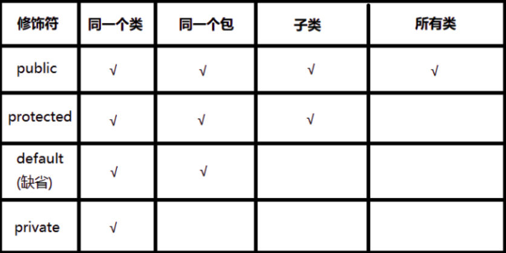
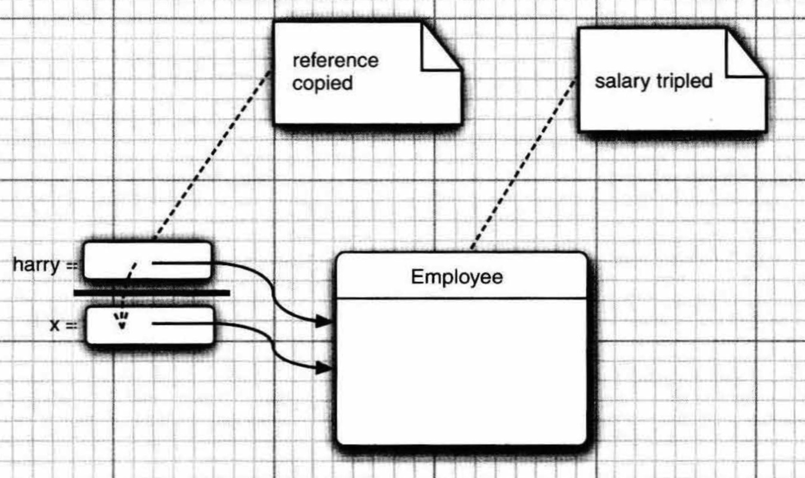

# 4. 对象与类

[TOC]

## 4.1 面向对象程序设计概述

面向对象程序设计(object-oriented programming,OOP)是当今主流的程序设计范型，它取代了20世纪70年代的“结构化”或过程式编程技术。

### 4.1.1 类

类(class)是构造对象的模板或蓝图。我们可以将类想象成制作小甜饼的模具，将对象想象为小甜饼。由类构造(construct)对象的过程称为创建类的实例(instance)。

封装(encapsulation,有时称为数据隐藏)是处理对象的一个重要概念。从形式上看，封装就是将数据和行为组合在一个包中，并对对象的使用者隐藏具体的实现方式。对象中的数据称为实例字段(instance field),操作数据的过程称为方法(method)。作为一个类的实例，特定对象都有一组特定的实例字段值。这些值的集合就是这个对象的当前状态(state)。无论何时，只要在对象上调用一个方法，它的状态就有可能发生改变。

实现封装的关键在于，绝对不能让类中的方法直接访问其他类的实例字段。

OOP的另一个原则会让用户自定义Java类变得更为容易，这就是：可以通过扩展其他类来构建新类。事实上，在Java中，所有的类都源自一个“神通广大的超类”，它就是Object。所有其他类都扩展自这个Object类。在扩展一个已有的类时，这个扩展后的新类具有被扩展的类的全部属性和方法。你只需要在新类中提供适用于这个新类的新方法和数据字段就可以了。通过扩展一个类来建立另外一个类的过程称为继承(inheritance)。


### 4.1.2 对象

要想使用OOP，一定要清楚对象的三个主要特性：

+ 对象的行为(behavior)。可以对对象完成哪些操作，或者可以对对象应用哪些方法？
+ 对象的状态(state)。当调用那些方法时，对象会如何响应？
+ 对象的标识(identity)。如何区分具有相同行为与状态的不同对象？


### 4.1.3 识别类

传统的过程式程序中，必须从顶部的main函数开始编写程序。在面向对象程序设计时没有所谓的“顶部”。学习OOP的初学者因而常常会感觉无从下手。答案是：首先从识别类开始，然后再为各个类添加方法。

识别类的一个简单经验是在分析问题的过程中寻找名词，而方法对应着动词。


### 4.1.4 类之间的关系

在类之间最常见的关系有：

+ 依赖（"use-a"）：A类的方法使用或操作B类的对象，则A类依赖B类。
+ 聚合（"has-a"）：A类的对象包含B类的对象。
+ 继承（"is-a"）：A类由扩展B类而来。


## 4.2 使用预定义类

### 4.2.1 对象与对象变量

在Java程序设计语言中，要使用构造器(constructor,或称构造函数)构造新实例。构造器是一种特殊的方法，用来构造并初始化对象。

构造器的名字应与类名相同。

注意区分变量与对象。在构造器构造之前，变量只是一个对象变量，只有引用了对象才可以调用对象的方法。在Java中，任何对象变量的值都是对存储在另外一个地方的某个对象的引用。new操作符的返回值也是一个引用。Java的对象变量类似于C++中的对象指针。

在Java中，必须使用clone方法获得对象的完整副本。


### 4.2.2 Java类库中的LocalDate类

Java标准类库中的Date类可以用于表示时间，Date类的实例有一个状态，即特定的时间点。尽管在使用Date类时不必知道这一点，但时间是用距离一个固定时间点的毫秒数（可正可负）表示的，这个时间点就是所谓的纪元(epoch),它是UTC时间1970年1月1日00:00:00。UTC就是Coordinated Universal Time（国际协调时间），与大家熟悉的GMT（即
Greenwich Mean Time，格林尼治时间）一样，是一种实用的科学标准时间。

但是，Date类对于处理人类记录日期的日历信息并不是很有用，如“December 3l,1999”。这种特定的日期描述遵循了世界上大多数地区使用的Gregorian阳历。但是，同样的这个时间点采用中国或希伯来的阴历来描述就很不一样了，倘若我们有来自火星的顾客，基于他们使用的火星历来描述这个时间点就更不一样了。	

类库设计者决定将保存时间与给时间点命名分开。所以标准Java类库分别包含了两个类：一个是用来表示时间点的Date类；另一个是用大家熟悉的日历表示法表示日期的LocalDate类。将时间度量与日历分开是一种很好的面向对象设计。通常，最好使用不同的类表示不同的概念。

不要使用构造器来构造LocalDate类的对象。实际上，应当使用静态工厂方法(factory method)，它会代表你调用构造器。下面的表达式会构造一个新对象，表示构造这个对象时的日期。

```java
LocalDate.now();
```

可以提供年、月、日来构造一个特定日期的对象。

```java
LocalDate newYearsEve = LocalDate.of(1999, 12, 31);
```

有了LocalDate对象，可以获得年、月、日。plusDays方法可以得到一个新的LocalDate对象。

```java
LocalDate aThousandDaysLater = newYearsEve.plusDays(1000);
int year = aThousandDaysLater.getYear();//2002
int month aThousandDaysLater.getMonthValue();//09
int day = aThousandDaysLater.getDayofMonth();//26
```


### 4.2.3 更改器方法与访问器方法

再来看上一节中的plusDays方法调用：

```java
LocalDate aThousandDaysLater = newYearsEve.plusDays(1000);
```

plusDays方法会生成一个新的LocalDate对象，然后把这个新对象赋给aThousandDaysLater变量。原来的对象不做任何改动。我们说plusDays方法没有更改调用这个方法的对象。（这类似于第3章中见过的String类的toUpperCase方法。在一个字符串上调用toUpperCase时，这个字符串仍保持不变，会返回一个将字符大写的新字符串。)

Java库的一个较早版本曾经有另一个处理日历的类，名为GregorianCalendar。与LocalDate.plusDays方法不同，GregorianCalendar.add方法是一个更改器方法(mutator method)。调用这个方法后，someDay对象的状态会改变。

相反，只访问对象而不修改对象的方法有时称为访问器方法(accessor method)。例如，LocalDate.getYear和GregorianCalendar.get就是访问器方法。

>*C++注释*: 在C++中，带有const后缀的方法是访问器方法，其他的方法默认为更改器方法。但是在Java中，二者在语法上没有明显的区别。

LocalDate类API：

```java
import java.time.LocalDate
import java.time.DayOfWeek
    
//构造一个表示当前日期的对象
static LocalDate now();

//构造一个表示给定日期的对象
static LocalDate of(int year,int month,int day)

int getYear();
int getMonthValue();
int getDayofMonth();

//得到当前日期是星期几，返回一个DayOfWeek类的实例。可调用getValue来得到1~7之间的一个数，表示这是星期几，1表示星期一，7表示星期日。
DayOfWeek getDayOfWeek();
int getValue(); //DayOfWeek对象方法

//生成当前日期之后n天的日期
LocalDate plusDays(int n)
    
//生成当前日期之前n天的日期
LocalDate minusDays(int n)
```


## 4.3 用户自定义类

### 4.3.1 Employee类

在Java中，最简单的类定义形式为：

```java
class className
{
	field1
	field2
	constructor1
	constructor2
	Method1
	method2
}
```

下面看一个非常简单的Employee类和它的测试类EmplyeeTest。

```java
import java.time.*;
/**
* This program tests the Employee class.
* @version1.132018-04-10
* @author Cay Horstmann
*/
public class EmployeeTest
{
    public static void main(String[]args)
    {
        //fill the staff array with three Employee objects
        Employee[] staff = new Employee[3];
        staff[0] = new Employee("Carl Cracker",75000,1987,12,15);
        staff[1] = new Employee("Harry Hacker",50000,1989,10,1);
        staff[2] = new Employee("Tony Tester",40000,1990,3,15);
        //raise everyone's salary by 5%
        for (Employee e:staff)
            e.raiseSalary(5);
        //print out information about all Employee objectsfor (Employee e staff)
     	System.out.println("name="e.getName() + "salary="e.getSalary() + ",hireDay=" + e.getHireDay());
    }
}


class Employee
{
//instance fields
	private String name;
    private double salary;
    private LocalDate hireDay;
//constructor
	public Employee(String n,double s,int year,int month,int day)
    {
		name = n;
        salary = s;
		hireDay = LocalDate.of(year,month,day);
    }
	public String getName()
    {
		return name;
    }
	public double getSalary()
    {
		return salary;
    }
	public LocalDate getHireDay()
    {
		return hireDay;
    }
    public void raiseSalary(double byPercent)
    {
		double raise = salary * byPercent / 100;
        salary +raise;
	}
}
```

在这个示例程序中包含两个类：Employee类和带有public访问修饰符的EmployeeTest类。EmployeeTest类包含了main方法。
源文件名是EmployeeTest.java，这是因为文件名必须与public类的名字相匹配。在一个源文件中，只能有一个公共类，但可以有任意数目的非公共类。
接下来，当编译这段源代码的时候，编译器将在目录下创建两个类文件：EmployeeTest.class和Employee.class。
将程序中包含main方法的类名提供给字节码解释器，以启动这个程序：

```shell
java EmployeeTest
```

字节码解释器开始运行EmployeeTest类的main方法中的代码。在这段代码中，先后构造了3个新Employee对象，并显示它们的状态。


### 4.3.2 多个源文件的使用

在上一节中，一个源文件包含了两个类。许多程序员习惯于将每一个类存放在一个单独的源文件中。例如，将Employee类存放在文件Employee.java中，将EmployeeTest类存放在文件EmployeeTest.java中。
如果喜欢这样组织文件，可以有两种编译源程序的方法。一种是使用通配符调用Java编译器：

```shell
javac Employee*.java
```

这样一来，所有与通配符匹配的源文件都将被编译成类文件。或者键入以下命令：

```shell
javac EmployeeTest.java
```

使用第二种方式时并没有显式地编译Employee.java。不过，当Java编译器发现EmployeeTest.java使用了Employee类时，它会查找名为Employee.class的文件。如果没有找到，就会自动地搜索Employee.java进行编译。更重要的是，如果Employee.java版本较已有的Employee.class文件版本更新，Java编译器就会自动地重新编译这个文件。


### 4.3.3 剖析Employee类

Employee类包含1个构造器和4个方法。这个类的所有方法都被标记为public，意味着任何类的任何方法都可以调用这些方法。

Employee类的实例中有3个字段，被标记为private，确保只有Employee类自身的方法能够访问这些字段。


### 4.3.4 从构造器开始

+ 构造器与类同名。
+ 每个类可以有一个以上的构造器。
+ 构造器可以有0个、1个或多个参数。
+ 构造器没有返回值。
+ 构造器总是伴随着new操作符一起调用。

>*C++注释*：Java构造器的工作方式与C++一样。但是，要记住所有的Java对象都是在堆中构造的，构造器总是结合new操作符一起使用。C++程序员最易犯的错误就是忘记new操作符：
>
>```java
>//这条语句在C++中能够正常运行，但在Java中却不行
>Employee number007("James Bond",100000,1950,1,1); //C++, not Java
>```


### 4.3.5 用var声明局部变量

在Java10中，如果可以从变量的初始值推导出它们的类型，那么可以用var关键字声明局部变量，而无须指定类型。例如，可以不这样声明：

```java
Employee harry =  new Employee("Harry Hacker",50000,1989,10,1);
```

只需要写以下代码：

```java
var harry =  new Employee("Harry Hacker",50000,1989,10,1);
```

这一点很好，因为这样可以避免重复写类型名Employee。倘若无须了解任何Java API就能从等号右边明显看出类型，都可以使用var表示法。

注意var关键字只能用于方法中的局部变量。参数和字段的类型必须明确声明。


### 4.3.6 使用null引用

一个对象变量包含一个对象引用或者null。

如果对null值应用一个方法，会产生一个NullPointerException异常。

定义一个类时，最好清楚地知道哪些字段可能为null。当一个参数为null时，构造器构造的对象可能有某个变量为null。对此，有两种解决办法。

“宽容型”方法是把null参数转换为一个适当的非null值。

```java
if( n==null )
    name = "unknown";
else
    name = n;
```

在Java9中，Objects类对此提供了一个便利方法。

```java
name = Objects.requireNonNullElse(n, "unknown");
```

“严格型”方法是直接拒绝null参数，否则就产生NullPointerException。

```java
Objects.requireNonNull(n, "The name cannot be null");
name = n;
```


### 4.3.7 隐式参数和显示参数

类的方法有两类参数。隐式参数没有出现在参数列表中。在每一个方法中，关键字this指示隐式参数。显示参数则显示的列在方法声明中。

```java
//有些程序员更偏爱这样的风格，因为这样可以将实例字段与局部变量明显地区分开来
public void raiseSalary(double byPercent)
{
	double raise =  this.salary * byPercent / 100;
    this.salary +raise;
}
```

>*C++注释*：在C++中，通常在类的外面定义方法：
>
>```C++
>void Employee:raiseSalary(double byPercent) //C++,not Java
>{
>    ···
>}
>```
>
>如果在类的内部定义方法，这个方法将自动成为内联(inline)方法。
>
>```C++
>class Employee
>{
>    int getName(){return name;} //inline in C++
>}
>```
>
>
>在Java中，所有的方法都必须在类的内部定义，但并不表示它们是内联方法。是否将某个方法设置为内联方法是Java虚拟机的任务。即时编译器会监视那些简短、经常调用而且没有被覆盖的方法调用，并进行优化。


### 4.3.8 封装的优点

上文提到的getName、getSalary和getHireDay方法都是典型的访问器方法，由于它们只返回实例字段值，因此又称为字段访问器。

有些时候，可能想要获得或设置实例字段的值。那么你需要提供下面三项内容：

+ 一个私有的数据字段；
+ 一个公共的字段访问器方法；
+ 一个公共的字段更改器方法。

这比直接提供公有的数据字段更好，因为可以改变内部实现，而其他代码不受影响，而且更改器方法可以完成错误检查。

>注意：不要编写返回可变对象引用的访问器方法。因为访问器的本意是不修改对象的状态，但是若返回可变对象的引用，对象的状态可能在外部被改变。在前几节中Employee类就违反了这个设计原则，其中的getHireDay方法返回了一个Date类对象。对该对象引用的操作改变了原对象的状态。
>
>```java
>Employee harry =...
>Date d = harry.getHireDay();
>double tenYearsInMilliSeconds = 10*365.25*24*60*60*1000;
>d.setTime(d.getTime()-(long)tenYearsInMilliSeconds);
>//let's give Harry ten years of added seniority
>```
>解决办法是在返回前，应首先对它进行克隆。
>
>```java
>class Employee
>{
>    ···
>    public Date getHireDay
>    {
>        return (Date)hireDay.clone();
>    }
>    ···
>}
>```


### 4.3.9 基于类的访问权限

从前面已经知道，方法可以访问调用这个方法的对象的私有数据。其实，一个方法可以访问所属类的所有对象的私有数据。

```java
class Employee
{
	public boolean equals(Employee other)
    {
		return name.equals(other.name); //访问了另一个对象的私有字段
    }
}
```

>*C++注释*：C++也有同样的原则。方法可以访问所属类的所有对象的私有数据，而不局限于隐式参数。

在Java中，类的权限有两种：

+ 包访问权限
+ public

包访问权限 < public权限。拥有包访问权限的类，对同一个包内的其他类，可以看做表现为"public"，而对包外部的类，则可以看做表现为"private"。

数据成员的权限有4种：

+ public
+ protected
+ default
+ private




### 4.3.10 私有方法

有时，你可能希望将一个计算代码分解成若干个独立的辅助方法。通常，这些辅助方法不应该成为公共接口的一部分，最好将这些方法设计为私有。


### 4.3.11 final实例字段

可以将实例字段定义为final，则该字段必须在构造对象时初始化，且以后不能再修改。final修饰符对于类型为基本类型或者不可变类的字段尤其有用。

对于可变的类，final关键字表示一个对象变量不会指示另一个不同的对象，但是这个对象本身可以更改。


## 4.4 静态字段和静态方法

### 4.4.1 静态字段

如果将一个字段定义为static，则每个类只有一个这样的字段，即使没有这样的对象，静态字段也存在。而对于非静态的字段，每个对象都有一个副本。


### 4.4.2 静态常量

类的公共字段可以被每个对象修改，但公共常量无法被修改。如System.out。


### 4.4.3 静态方法

可以认为静态方法是没有this参数的方法。

> 也可以使用对象调用静态方法。


### 4.4.4 工厂方法

静态方法还有另一种常见的用途，使用静态工厂方法来构造对象。

使用构造器的缺点：

+ 无法命名构造器，构造器必须与类名相同。
+ 使用构造器时，无法改变构造对象的类型。而使用工厂方法，可以返回子类的对象。


### 4.4.5 main方法

main方法也是一个静态方法，因此不需要实例化对象即可调用main方法。

> 每一个类可以有一个main方法。这是常用于对类进行测试的技巧。如果想要独立的测试类Employee，只需要执行如下命令。
>
> ```shell
> java Employee
> ```
>
> 如果Employee类是一个更大的应用程序的一部分，则运行该程序时，Employee的main方法将不会被执行。


## 4.5 方法参数

明确两种方法调用的两个术语：

+ 按值调用：方法接收参数提供的值。
+ 按引用调用：方法接收参数的地址。

Java总是采用按值调用。但是Java有两种参数类型：

+ 基本数据类型
+ 对象引用

因此Java的方法不可能修改基本数据类型的参数。但可以通过对象引用对参数变量所引用的对象进行修改。

如以下代码的执行过程：

```java
harry = new Employee();
tripleSalary(harry);
```



许多程序设计语言提供了按值调用和按引用调用两种方式，例如C++。关于Java的函数调用，很多人有一个误区是，认为Java对对象是采用按引用调用。但其实Java对所有参数采用按值调用，只是对象是引用的拷贝。下面用一个例子来说明这其中的区别。

首先编写一个交换两个Employee对象的方法。

```java
public static void swap(Employee x, Employee y)
{
    Employee temp=x;
    x = y;
    y = temp;
}
```

如果Java采用按引用调用，那下面这段代码就应该能实现两个对象的交换。

```java
var a = new Employee("Alice", ···);
var b = new Employee("Bob", ···);
swap(a, b);
```

但实际上，这个方法并没有改变变量a和b所指向的对象。原因是，swap内部其实交换的是a和b的副本，并没有对a和b这两个参数本身进行修改。

总结一下，Java中对方法参数可以做什么和不能做什么。

+ 方法不能修改基本数据类型的参数。
+ 方法可以对象参数的状态（通过对象的引用的副本）。
+ 方法不能让一个对象参数引用另一个对象。


## 4.6 对象构造

### 4.6.1 重载

有些方法有多个构造器，这种现象叫重载。如果多个方法具有相同的名字，不同的名字，便实现了重载。编译器选则正确的方法的过程称为**重载解析**（overloading resolution）。

> 要完整的确定一个方法，必须指定方法的名字和参数类型，这叫做方法的**签名**（signatrue）。
>
> 注意，返回值类型不是签名的一部分，因此不能有两个名字和参数相同，但返回值不同的方法。


### 4.6.2 默认字段初始化

如果在构造器中没有显示的对字段进行初始化，那么这些字段就会自动被初始化为0、false或null。

>这是字段与局部变量的一个重要区别。方法中的局部变量必须明确的初始化。


### 4.6.3 无参数的构造器

如果写一个类时，没有编写构造器，那么编译器会提供一个无参数的构造器，将所有字段初始化为默认值。但若编写一个类时，提供了构造器，但没有提供无参数的构造器，编译器也不会提供无参数的构造器。


### 4.6.4 显式字段初始化

可以在类定义中直接为字段赋值。

```java
class Employee
{
    private String name = "";
}
```

在构造对象时，执行构造器之前就将完成这个赋值操作。

```java
class Employee
{
    private static int 	nextId;
    private int id = assignId();
    private static int assignd()
    {
        int r = nextId;
        nextId++;
        return r;
    }
}
```

>*C++注释*: 在C++中不能直接初始化类的字段，所有的字段必须在构造器中设置。


### 4.6.5 参数名

一个常用的技巧，有些程序员喜欢在构造器的参数名所初始化的字段前面加上一个"a"作为参数名。

```java
public Employee(String aName, double aSalary)
{
    name = aName;
    salary = aSalary;
}
```

还有一种技巧，使用与字段同名的参数名，并用this指定字段。

```java
public Employee(String name, double salary)
{
    this.name = name;
    this.salary = salary;
}
```


### 4.6.6 调用另一个构造器

关键字this指示一个方法的隐式参数，不过，当构造器的第一个语句形如*this()*，则这个构造器将调用同一个类的另一个构造器。

```java
public Employee(double s)
{
    this("Employee #"+nextId, s);
    nextId++;
}
```


### 4.6.7 初始化块

Java的三种初始化数据字段的方法已经介绍了两种，下面介绍第三种。

+ 在构造器中设置值。
+ 在声明中赋值。
+ 初始化块（initialization block）。

在一个类的声明中，可以包含任意多个代码块，只要构造这个类的对象，这些代码块就会被执行。也可以用static关键字标志代码块，该代码块在类加载时执行一次，用来初始化类的静态字段。另外，代码块初始化的字段可以在代码块之后声明，但仍然是声明之后才执行代码块。

```java
class Employee
{
    private static int nextId;
    private int id;
    private String name;
    private double salary;
    
    static
    {
        var generator = new Random();
        nextId = generator.nextInt(10000);
    }
    
    {
        id = nextId;
        nextId++;
    }
}
```

在构造类的对象时，字段的初始化顺序是，先进行声明时的初始化，然后进行代码块的初始化，最后进行构造器的初始化，后进行的工作会覆盖之前的工作。


### 4.6.8 对象析构与finalize方法

由于Java会自动进行垃圾回收，所以不支持析构器。当然，如果使用了内存之外的其他资源，可以提供一个close方法，在对象使用完时调用close方法。第7章将介绍如何确保自动调用这个方法。

>注意，不要使用finalize方法来清理。这个方法原本要在垃圾回收器清理对象之前调用，但你并不能知道这个方法到底什么时候调用，而且该方法已经被废弃。


## 4.7 包

Java允许使用**包**（package）将类组织在一个集合中。

### 4.7.1 包名

为了保证包名的唯一性，约定使用英特网域名的逆序作为包名，在其后增加一个工程名。如com.horstmann.corejava。


### 4.7.2 类的导入

一个类可以使用所属包中的所有类，以及其他包中的公共类。

可以采用两种方式访问另一个包中的公共类，第一种是使用**完全限定名**（fully qualified name），即包名后面跟着类名。

```java
java.time.LocalDate today = java.time.LocalDate.now();
```

另一种是使用import语句。import语句可以导入一个特定的类或整个包。

```java
import java.util.ArrayList;
import java.time.*;
```

注意，只能使用星号导入一个包，不能使用import java.\*导入所有以java为前缀的包。

如果导入的包中有相同的类名，可以在程序中使用该类时加上完整的包名前缀。

>*C++注释*: import语句与C++中的include语句不同。在C++中，必须使用include语句加载外部特性的声明，因为除了正在编译和在头文件中包含的文件，C++编译器无法查看其他文件的内部。Java编译器则不同，可以查看其他文件的内部。因此在Java中，通过显式给出类名，如java.util.Date，可以完全避免使用import机制。可以认为，Java的包机制类似C++中的命名空间特性类似。


### 4.7.3 静态导入

可以导入静态方法和静态字段，而不是类。例如，在源文件顶部添加如下的指令：

```java
import static java.lang.System.*;
```

 就可以使用System类的静态方法和静态字段，而不必加类名前缀。

```java
out.println("Good\n");
```

也可以导入特定的方法和字段：

```java
import static java.lang.System.out;
```


### 4.7.4 在包中增加类

将包的名字放在源文件的开头即可将文件中的类加入包。

```java
package com.horstmann.corejava;
```

如果不加入任何包，这个源文件就属于**无名包**（unnamed package）。

将源文件放到与完整包名匹配的子目录中。例如，PackageTest类属于无名包，在基目录，导入Employee类，该类在目录com/horstmann/corejava/中。要想编译运行这个程序，只需切换到基目录，运行javac PackageTest.java。

更一般的情况下，不使用无名包。仍然要从基目录编译和运行类: javac com/mycompany/PayrollApp.java。

编译器在编译时不检查目录结构，但是如果类位置与包名结构不同，在运行时会导致虚拟机找不到目标类。


### 4.7.5 包访问

对于顶级类（外部类）来说，只有两种修饰符：public和默认（default）。public修饰的顶级类可以被任意类访问，而默认的类可以被同一个包中所有方法访问。因此，默认情况下包不是封闭的实体。由于任何人都可以向包中添加更多的类，因此可能有人利用包的可见性添加一些能修改变量的代码。现在，JDK明确禁止加载包名以java.开头的用户自定义类。

类中还可以定义类，称为内部类。内部类有四种访问权限，对应不同的权限修饰符：本类（private）、同包（default）、父子类（protected）、任何位置（public）。


### 4.7.6 类路径

类存储在文件系统的子目录中。类的路径必须与包名相匹配。

另外，类文件也可以存储在JAR（Java归档）文件中。在JAR文件中，可以包含多个压缩形式的类文件和子目录。

>JAR文件使用ZIP格式组织文件和子目录。可以使用任何ZIP工具查看JAR文件

为了使类能够被多个程序共享，需要做到：

1. 把类文件放到一个目录中，例如/home/user/classdir，这个目录是包树状结构的基目录。
2. 将JAR文件放在一个目录中，例如/home/user/archives。
3. 设置类路径。类路径是所有包含类文件的路径的集合。

在UNIX环境中，类路径中的各项用冒号分隔，在Windows环境中，用分号分隔。

类路径包括：

1. 基目录/home/user/classdir或c:\classes；
2. 当前目录 .
3. JAR文件/home/user/archives/archives.jar或c:\archives\archives.jar

从Java6开始，可以在JAR文件目录中使用通配符。

由于虚拟机总是会搜索JavaAPI类，因此不必在类路径中包含JavaAPI。假定虚拟机要搜寻 com.horstmann.corejava. Employee类的类文件。它首先要查看Java API类。显然，在那里找不到相应的类文件，所以转而查看类路径。然后查找以下文件:

+ /home/user/classdir/com/horstmann/corejava/Employee.class
+ com/horstmann/corejava/Employee.class (从当前目录开始)
+ com/horstmann/corejava/Employee.class (/home/user/archives/archive.jar中)


### 4.7.7 设置类路径

最好使用 -classpath（或-cp，或者Java 9 中的 --class-path）选项指定类路径:

```shell
# UNIX
java -classpath /home/user/classdir:.:/home/user/archives/archive.jar MyProg 
```

```shell
# Windows
java -classpath c:\classdir;.;c:\archives\archive.jar MyProg
```

利用 -classpath选项设置类路径是首选的方法，也可以通过设置 CLASSPATH环境变量来指定。具体细节依赖于所使用的 shell。在 Bourne Again shell (bash )中和在Windows Shell中命令分别如下:

```shell
export CLASSPATH=/home/user/classdir:.:/home/user/archives/archive.jar
```

```shell
set CLASSPATH=c:\classdir;.;c:\archives\archive.jar
```


## 4.8 JAR文件

### 4.8.1 创建JAR文件

可以使用jar 工具制作JAR文件（在默认的JDK安装中，这个工具位于jdk/bin目录下)。创建一个新JAR文件最常用的命令使用以下语法：

```shell
jar cvf jarFileName file1 file2
```

jar命令的选项：

| 选项 |                             说明                             |
| :--: | :----------------------------------------------------------: |
|  c   |                     创建一个新的存档文件                     |
|  C   |            临时改变目录，切换到该目录以增加类文件            |
|  e   |                  在清单文件中创建一个入口点                  |
|  f   | 指定JAR文件名作为第二个命令行参数。如果没有这个参数，jar命令会将结果写至标准输出（创建JAR 文件时）或者从标准输人读取（在解压或者列出JAR 文件内容时） |
|  i   |                         简历索引文件                         |
|  m   |                将一个清单文件加入到JAR文件中                 |
|  M   |                     不为条目创建清单文件                     |
|  t   |                          显示内容表                          |
|  u   |                    更新一个已有的JAR文件                     |
|  v   |                      生成详细的输出结果                      |
|  x   |                           解压文件                           |
|  0   |                    存储，但不进行ZIP压缩                     |


### 4.8.2 清单文件

除了类文件、图像和其他资源外，每个JAR文件还包含一个**清单文件**（manifest），用于描述归档文件的特殊特性。清单文件被命名为MANIFEST.MF，它位于JAR文件的一个特殊的META-INF子目录中。符合标准的最小的清单文件极其简单：

```
Manifest-Version：1.0
```

复杂的清单文件可能包含更多条目。这些清单条目被分成多个节。第一节被称为主节（main section）。它作用于整个JAR 文件。随后的条目用来指定命名实体的属性，如单个文件、包或者URL。它们都必须以一个Name条目开始。节与节之间用空行分开。例如:

```
Manifest-Version: 1.0
lines describing this archive

Name: Woozle.class
lines describing this file 
Name: com/mycompany/mypkg/ 
lines describing this package
```

要想编辑清单文件，需要将希望添加到清单文件中的行放到一个文本文件中，然后运行:

```shell
jar cfm jarFileName manifestFileName className ...
```

要想更新一个已有的JAR 文件的清单，则需要将增加的部分放置到一个文本文件中，然后执行以下命令:

```shell
jar ufm MyArchive.jar manifest-additions.mf
```


### 4.8.3 可执行JAR文件

可以使用jar命令中的e选项指定程序的入口点，即通常需要在调用java程序启动器时指定的类:

```shell
jar cvfe MyProgram.jar com.mycompany.mypkg.MainAppClass files-to-add
```

或者，可以在清单文件中指定程序的主类，包括以下形式的语句:

```shell
Main-Class: com.mycompany.mypkg.MainAppClass
```

然后，用户可以使用如下的命令启动程序：

```shell
java -jar MyProgram.jar
```


### 4.8.4 多版本JAR文件

Java9引入了**多版本JAR**（Multirelease JAR），其中可以包含面向不同Java版本的类文件。

在支持多版本的JAR文件中，MANIFEST.MF 文件新增了一个属性：

```
Multi-Release: true
```

然后 META-INF 目录下还新增了一个 versions 目录，如果是要支持 java9，则在 versions 目录下有 9 的目录。

```
multirelease.jar
├── META-INF
│   └── versions
│       └── 9
│           └── multirelease
│               └── Helper.class
├── multirelease
    ├── Helper.class
    └── Main.class
```

Java8完全不知道META-INF/versions目录的存在，它只会加载遗留的类。Java9读取这个JAR文件时，则会使用新版本。要创建同时支持Java7和Java9的JAR文件，可使用如下命令：

```shell
jar -c -f test.jar -C java7 . --release 9 -C java9 .
```


### 4.8.5 关于命令行选项的说明

JDK的命令行选项一直以来使用单个短横线加多字母选项名的形式。但jar命令是个例外，这个命令遵循经典的tar命令选项格式，没有短横线。

从Java9开始，Java工具开始转向一种更常用的选项格式，多字母选项名前加两个短横线。例如，Java9中可以使用--version而不是-version，可以使用--class-path而不是-classpath

作者提出要标准化选项参数，带--和多字母的选项的参数用空格或者一个等于号分隔。单字母选项的参数可以用空格分隔，或者直接跟在选项后面。

```
javac --class-path /home/user/classdir/...
javac --class-path=/home/user/classdir/...
javac -p moduledir...
```


## 4.9 文档注释

JDK包含一个很有用的工具，叫做**javadoc**，它可以由源文件生成一个html文档。如果在源文件中使用/\*\*进行注释，就可以生成一个文档。

### 4.9.1 注释的插入

javadoc从以下几项中提取信息：

+ 模块
+ 包
+ 公共类和接口
+ 公共的和受保护的手段
+ 公共的和受保护的构造器及方法。

应该为以上各个特性编写注释。

每个/\*\*...*/文档注释包含标记以及之后紧跟着的**自由格式文本**（free-form text），标记从@开始，如@since，@param。自由格式文本的第一句应该是一个概要性的句子，javadoc自动将他们提取出来，生成概要页。

如果文档中有到其他文件的链接，如图片，就应该将这些文件放到包含源文件的目录的一个子目录doc-files中。javadoc工具将从源目录将doc-files目录及其内容拷贝到文档目录中。


### 4.9.2 类注释

类注释必须放在import语句后，类定义之前。

```java
/**
	A doc comment
*/
public class Card···
```


### 4.9.3 方法注释

每一个方法注释必须放在所描述的方法之前。除了通用标记之外，还可以使用下面的标记。

+ @param *variable description*

    该标记将给当前方法的"parameters"部分添加一个条目。这个描述可以使用HTML标记。一个方法的所有@param标记必须放在一起。

+ @return *description*

    该标记将给当前方法添加"returns"部分。可使用HTML标记。

+ @throws *class description*

    该标记将添加一个注释，表示该方法可能抛出异常。

```java
/**
* Raises the salary of an employee.
* @param byPercent the percentage by which to raise the salary(e.g. 10 means 10%)
* @return the amount of the raise
*/
public double raiseSalary(double byPercent)
{
    double raise = salary*byPercent/100;
    salary += raise;
    return raise;
}
```


### 4.9.4 字段注释

只需要对公共字段（通常指的是静态常量）建立文档。

```java
/**
* The "Hearts" card suit
*/
public static final int HEARTS = 1;
```


### 4.9.5 通用注释

标记@since *text* 会建立一个"since"(始于)条目。text（文本）可以是引入这个特性的版本的任何描述。例如，@since 1.7.1。

下面的标记可以用在类文档注释中。

+   @author *name*

    该标记将产生一个"author"条目。可以使用多个@author标记。

+   @version *text*

    该标记将产生一个"version"条目。文本可以是对当前版本的任何描述。

通过@see和@link标记，可以使用超链接，链接到javadoc文档的相关部分或外部文档，只需要提供类、方法或变量的名字，使用#分隔类名与方法名或类名与变量名。

```java
@see com.horstmann.corejava.Employee#raiseSalary(double)
```

这会建立一个链接到com.horstmann.corejava.Employee类的raiseSalary(double)方法的超链接。

```java
@see <a href="www.horstmann.com/corejava.html">The Core Java home page</a>
```

这会建立一个指向特定网页的链接。

```java
@see "Core Java 2 volume 2"
```

该文本会显示在"see alse"部分。


### 4.9.6 包注释

要想产生包注释，需要在每一个包目录中添加一个单独的文件。有两种选择：

1.   提供一个名为package-info.java的Java文件。这个文件必须包含一个初始的以/\*\*和\*/界定的Javadoc注释，后面是一个package语句。它不能包含更多的代码或注释。

2.   提供一个名为package.html的HTML文件。它会抽取<body>...</body>之间的所有文本。

     

### 4.9.7 注释抽取

假设你希望将生成的HTML文件放在名为docDirectory的目录下。执行以下步骤：

1.   切换到包含想要生成文档的源文件的目录。

2.   如果是一个包，运行：

     ```shell
     javadoc -d docDirectory nameOfPackage
     ```

     如果要为多个包生成文档：

     ```java
     javadoc -d docDirectory nameOfPackage1 nameOfPackage2 ...
     ```

     如果文件在无名包中：

     ```shell
     javadoc -d docDirectory *.java
     ```

如果省略了 -d 选项，那么HTML文件会被提取到当前目录下。


## 4.10 类设计技巧

1.   一定要保证数据私有
2.   一定要对数据进行初始化
3.   不要在类中使用过多的基本类型
4.   不是所有的字段都需要单独的字段访问器和字段更改器
5.   分解有过多职责的类
6.   类名和方法名要能够体现它们的职责
7.   优先使用不可变的类


