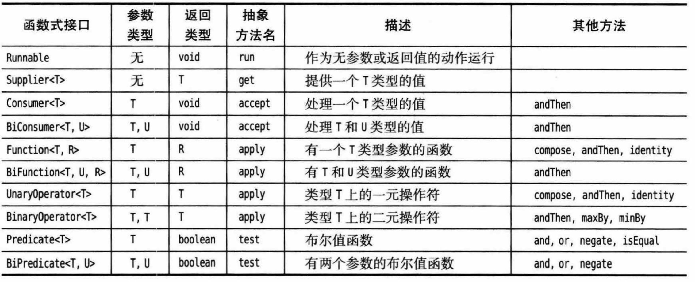
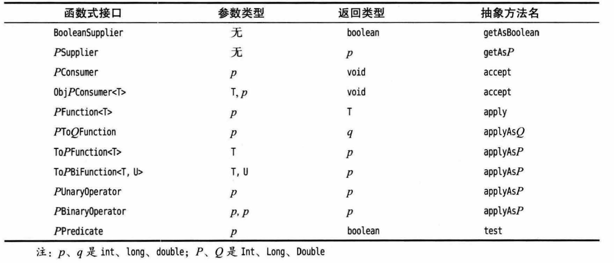
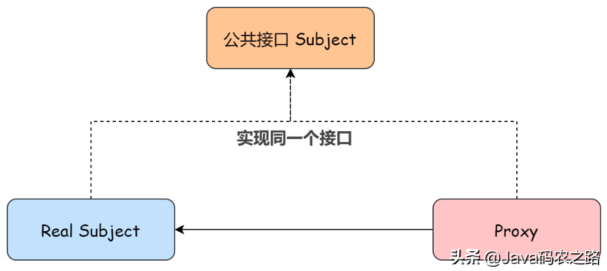
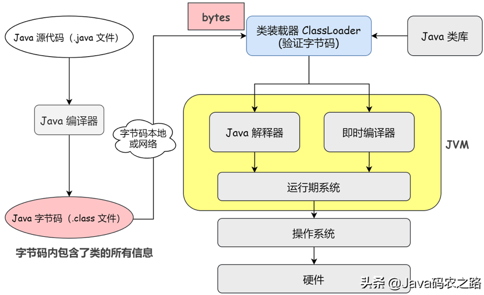
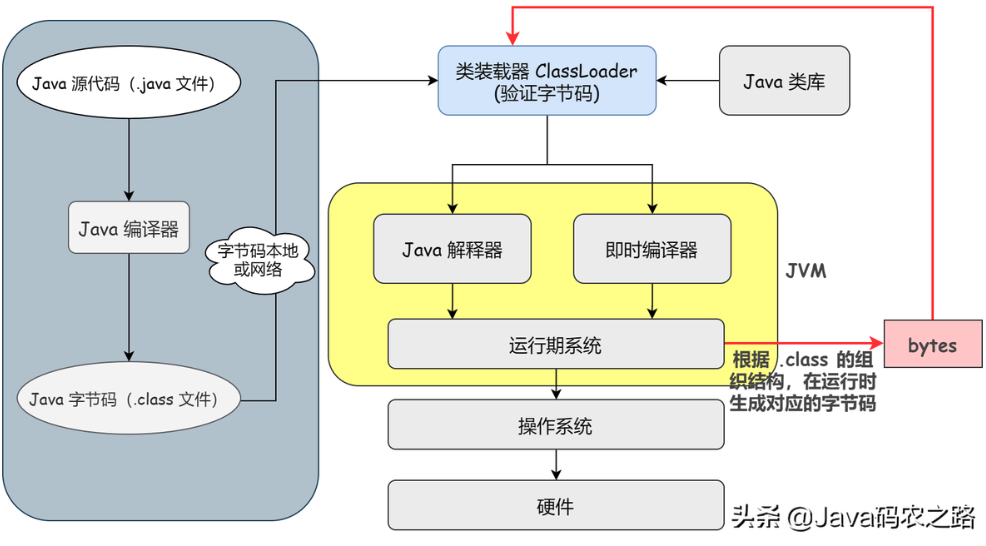
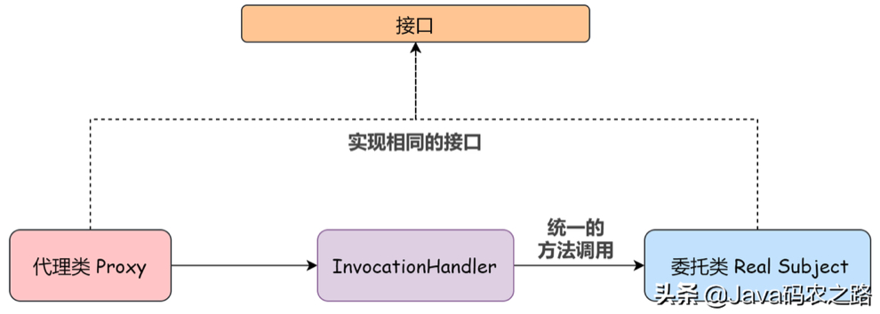

# 6.接口、lambda表达式与内部类

[TOC]

## 6.1 接口

### 6.1.1 接口的概念

接口不是类，而是对希望符合这个接口的类的一组需求。

Arrays类中的sort方法承诺可以对对象数组进行排序，但要求对象所属的类必须实现Comparable接口。下面是Comparable接口的代码。

```java
public interface Comparable
{
    int compareTo(Object other);
}
```

这说明任何实现Comparable接口的类都需要包含compareTo方法。

接口中的所有方法都自动是public的，因此在接口中声明方法是，不必提供public关键字。

接口还可以定义常量， 接口中的字段总是public static final，但绝对不会有实例字段，因为接口没有实例。

为了让类实现一个接口，需要两个步骤：

1. 使用implements关键字将类声明为实现给定的接口；
2. 对接口中的所有方法提供定义。

> 在接口声明中，不用提供public，因为接口默认所有方法public。但在实现接口时，必须把方法声明为public。

```java
class Employee implements Comparable<Employee>
{
    public int compareTo(Employee other)
    {
        return Double.compare(salary, other.salary);
    }
    ···
}
```

> Comparable接口的文档建议compareTo方法应当与equals方法兼容，即当x.equals(y)时，x.compareTo(y)就应当等于0。JavaAPI中大多数实现Comarable接口的类都遵从了这个建议，不过有一个重要的例外，就是BigDecimal。考虑x=new BigDecimal("1.0")和y=new BigDecimal("1.00")，这里x.equals(y)为false，因为两个数精度不同，但是x.compareTo(y)为0。

为什么不能在Employee类中直接实现compareTo方法，而必须实现Comparable接口呢？原因是Java是一种强类型语言，在调用方法时，编译器要能检查这个方法确实存在。如果sort方法要操作的类的对象实现了comparable接口，则可以保证它们具有compareTo方法。


### 6.1.2 接口的属性

尽管不能构造接口的对象，却能声明接口的变量。接口变量必须引用实现了这个接口的类对象。

```java
Comparable x;
x = new Employee();
```

接口可以继承多个接口，使用extends关键字。

```java
public interface m extends interface1, interface2
```

尽管每个类只能有一个超类，但却可以实现多个接口。

```java
class Employee implments Cloneable, Comparable
```


### 6.1.3 接口与抽象类

有些程序设计语言，尤其是C++，允许一个类有多个超类，这个特性称为**多重继承**（multiple inheritance）。Java选择了不支持多重继承，原因是它会使语言变得非常复杂，效率也会降低。实际上，接口可以提供多重继承的绝大多数好处。


### 6.1.4 静态和私有方法

在Java8中开始允许在接口中增加静态方法和默认方法。只是这有违于接口作为抽象规范的初衷。

目前为止，通常的做法是将静态方法放在伴随类中。如Collection/Collections或Path/Paths。

在Java11中，Path接口提供了等价的方法，这样一来，Paths类就不再是必要的了。

```java
public interface path
{
    public static Path of(URI uri){...}
    public static Path of(String first, String... more){...}
    ...
}
```

在Java9中，接口支持private方法，可以作为接口中其他方法的辅助方法。


### 6.1.5 默认方法

可以为接口方法提供一个默认实现，用default修饰符标记。default方法为非静态方法，通过实例调用。

```java
public interface Comparable<T>
{
    default int compareTo(T other)
    {
        return 0;
    }
}
```

Comparable的每个具体实现都会覆盖这个方法。但有些情况下，默认方法可能有用。实现接口的类可以不实现接口的默认方法，而使用接口的默认实现。

例如，很久以前Bag类实现了Collection接口。后来，这个接口增加了stream方法。为了能够重新编译Bag类，必须将stream方法声明为默认方法，因为Bag类没有实现stream。此外，如果不重新编译Bag类，在Bag实例上调用stream方法，将调用Collections.stream方法。

> 总结：
>
> 1、接口默认方法、静态方法可以有多个。
> 2、默认方法通过实例调用，静态方法通过接口名调用。
> 3、default默认方法关键字只能用在接口中。
> 4、默认方法可以被继承，如果继承了多个接口，多个接口都定义了多个同样的默认方法，实现类需要重写默认方法不然会报错。
> 5、静态方法不能被继承及覆盖override（与class的静态方法不同），所以只被具体所在的接口调用。


### 6.1.6 解决默认方法冲突

如果一个接口中将一个方法定义为默认方法，然后又在超类或另一个接口中定义同样的方法，则调用的优先级为：

1. 超类优先。超类中同名且参数类型相同的方法将覆盖接口中的方法。

2. 接口冲突。如果两个接口定义了同名且参数类型相同的方法，且其中至少有一个默认方法，则程序员必须在类中编写相同的方法覆盖二者。

    ```java
    interface Person
    {
        default String getName(){return "";}
    }
    
    interface Named
    {
        default String getName(){return getClass.getName()+"_"+hashCode();}
    }
    
    class Student implements Person, Named
    {
        public String gerName()
        {
            return Person.super.getName();
        }
    }
    ```

>调用父接口的static方法只能通过 *父接口名.方法名* 来调用。
>
>调用父接口的default方法可以通过 *父接口名.super.方法名* 来调用，在没有二义性的情况下，可以直接使用方法名调用。


### 6.1.7 接口与回调

**回调**（callback）是一种常见的程序设计模式。在这种模式中，可以指定某个特定事件发生时应该采取的动作。

在java.swing包中有一个类Timer类，它可以每经过一定时间间隔就完成特定的操作。可以向定时器传入一个对象，这个对象需要实现java.awt.event包中的ActionListener接口。当到达指定时间间隔时，定时器就会调用传入对象实现的actionPerformed(ActionEvent event)方法。

```java
public interface ActionListener
{
    void actionPerformed(ActionEvent event);
}
```

假设希望每隔1秒打印一条消息，那么可以定义一个实现ActionListener接口的类。

```java
class TimePrinter implements ActionListener
{
    public void actionPerformed(ActionEvent event)
    {
        System.out.println("hello, it is"+Instant.ofEpochMilli(event.getWhen()));
    }
}
```

actionPerformed方法的参数可以调用event.getWhen方法，返回这个事件的时间。接下来，构造这个类的一个对象，并将它传递给Timer构造器。

```java
var listener = new TimePrinter();
Timer t = new Timer(1000, listener);
t.start();
```

```java
//构造一个定时器，每经过interval毫秒通知listener一次
Timer(int interval, ActionListener listener);

//启动定时器，定时器将调用监听器的actionPerformed方法
void start();

//停止定时器
void stop();
```


### 6.1.8 Comparator接口

假设我们需要按长度对String对象进行排序。但String对象的compareTo方法是按字典序比较，因此不能使用默认的排序方法。

好在Arrays.sort还有第二个版本，接受一个数组和一个比较器（comparator）作为参数。比较器是实现了Comparator接口的类的实例。

```java
public interface Comparator<T>
{
    int compare(T first, T second);
}
```

要按字符串长度排序，我们可以实现一个比较器类：

```java
class LengthComparator implements Comparator<String>
{
    public int compare(String first, String second)
    {
        return first.length() - second.length();
    }
}
```

具体比较时，先实例化一个比较器，再进行比较。

```java
String[] friends = {"Peter", "Paul", "Mary"};
Arrays.sort(friends, new LengthComparator());
```


### 6.1.9 对象克隆

克隆对象时要考虑“浅克隆”和“深克隆”的问题。

对于每一个类，需要确定：

1.   默认的clone方法是否满足要求；
2.   是否可以在可变的子对象上调用clone来修补默认的clone方法；
3.   是否不该使用clone。

实际上第3项是默认选项。如果选择第1或者第2项，类必须：

1.   实现Cloneable接口；
2.   重新定义clone方法，并指定public访问修饰符。

>Object类中的clone方法声明为protected，所以你的代码不能直接调用anObject.clone()。必须重新定义clone为public。
>
>这里有一个易错点，如果一个类不实现Cloneable接口，它可以直接在自己的方法中使用继承来的clone方法来克隆它自己吗？注意，虽然子类可以访问超类的protected方法，但此处调用clone方法仍然不行。
>
>Object类没有实现Cloneable接口，但提供了默认的clone方法，这个方法是浅复制，而且是native方法（用其他语言实现，如C语言），因此我们看不到Java源代码，但可以发现如下注解，表明此类不支持Cloneable接口的话就会报错。所以当子类直接调用超类的clone方法时，会抛出异常。
>
>```java
>@exception  CloneNotSupportedException  if the object's class does not
>     * support the {@code Cloneable} interface. Subclasses
>     * that override the {@code clone} method can also
>     * throw this exception to indicate that an instance cannot
>     * be cloned.
>```
>
>查看Clonebale接口，空的。
>
>```java
>public interface Cloneable {
>}
>```
>
>Cloneable接口是Java提供的少数**标记接口**（tagging interface）之一。标记接口不包含任何方法，但是它可支持instanceof方法。
>
>```java
>if( obj instanceof Cloneable) ...
>```

在理解了Java的对象复制机制后，我们再来看看对其的批评：

1. Cloneable接口没有声明任何函数，所以该接口的引用变量无法调用clone方法，违背了面向对象的编程思想。
    1. clone方法与Cloneable接口的分离造成了不必要的混乱，因为是否能调用clone方法是由一个完全独立的Cloneable接口决定的（如果在一个对象上调用clone，但这个对象没有实现Cloneable接口，Object类的clone方法就会抛出一个CloneNotSupportedException异常)。

2. clone方法返回的是Object类型，开发人员必须使用类型转换。
3. 当在一个类中实现了自定义的clone方法后，它的成员变量不可定义为final，因为它们会在clone方法中依次赋值。


## 6.2 lambda表达式

### 6.2.1 为什么引入lambda表达式

到目前为止，在Java中传递一个代码段并不容易，你不能直接传递，必须先构造一个对象，这个对象的类需要一个方法包含所需的代码。例如传给定时器Timer对象的ActionListener对象，传给Arrays.sort方法的Comparator对象。

lambda表达式是一个可传递的代码段，可以在以后执行一次或多次。


### 6.2.2 lambda表达式的语法

考虑上一节讨论的排序例子，我们传入代码来检查一个字符串是否比另一个字符串短，这里要计算：

```java
first.length() - second.length()
```

Java是一种强类型语言，所以我们还要指定它们的类型：

```java
(String first, String second) -> first.length() - second.length()
```

这就是一个lambda表达式。lambda表达式就是一个代码块，以及必须必须传入代码的变量规范。

你已经见过lambda表达式的一种形式：参数，箭头以及一个表达式。如果一个表达式不够，可以像写方法一样，将代码放在{}中，并包含return语句。

```java
(String first, String second) ->
{
    if(first.length() < second.length()) return -1;
    else if( first.length() > second.length()) return 1;
    else return 0;
}
```

Lambda表达式的语法：(parameters) -> expression 或 (parameters) ->{ statements; }

以下是一些省略版本：

1. 如果可以推导出lambda表达式参数的类型，则可以忽略其类型；
2. 如果方法只有一个参数，而且这个参数的类型可以推导得出，则可以省略parameters的小括号。
3. 无需指定lambda表达式的返回类型，它总是可推导得出的。

> lambda表达式可以视为一个函数。如果一个lambda表达式在某些分支返回一个值，而另外一些分支不返回值，这是不合法的。例如(int x) -> {if(x>0) return 1;}。

**可以这样理解，Lambda表达式就是一个函数式接口的实例。**


### 6.2.3 函数式接口

对于只有一个抽象方法的接口，需要这种接口的对象时，可以提供一个lambda表达式。这种有且只有一个抽象方法（的接口称为**函数式接口**（functional interface）。

注意：

+ 函数式接口里可以定义默认方法：默认方法有方法体,不是抽象方法,符合函数式接口的定义要求。
+ 函数式接口里可以定义静态方法：静态方法也不是抽象方法,是一个有具体方法实现的方法,同样也符合函数式接口的定义的。
+ 函数式接口里可以定义Object里的public方法（改成抽象方法）：虽然它们是抽象方法，却不需要覆盖重写，因为所有接口的实现类都是Object类的子类，而在Object类中有这些方法的具体的实现。

```java
修饰符 interface 接口名称
{
    //抽象方法
    public abstract 返回值类型 方法名称(可选参数信息)；

    //默认方法
    public default 返回值类型 方法名称(可选参数信息) {
        //代码...        
    }
    
    //静态方法
    public static 返回值类型 方法名称(可选参数信息) {
        //代码...        
    }
    
    //Object类的public方法变成抽象方法
    public abstract boolean equals(Object obj);
    public abstract String toString();    
}
//接口中的public abstract可以省略
```

例如，Comparator接口就是只有一个抽象方法的接口，因此可以用lambda表达式代替。

```java
Arrays.sort( words, (first, second) -> first.length()-second.length());
```

实际上，在Java中对lambda表达式能做的也只是转换为函数式接口。不能把lambda表达式赋给类型为Object的变量，只能将其赋给相同类型的函数式接口变量。在赋值时，函数式接口中的唯一抽象方法将lambda表达式作为其具体实现。当有一个需要函数式接口参数的方法时，我们就可以给其传递一个对应的lambda表达式作为参数。执行该接口的抽象方法时就会自动执行传递过去的lambda表达式。

```java
@FunctionalInterface
interface MyInterface
{ 
    int method(int x);
}

public class Myclass
{
    public static void main(String[] args)
    {
        MyInterface my = (int x)-> x*2;
        System.out.println(my.method(2)); // print 4
    }
}
```

我们在某个接口上声明了 @FunctionalInterface 注解，那么编译器就会按照函数式接口的定义来要求该接口，这样如果有两个抽象方法，程序编译就会报错的。所以，从某种意义上来说，只要你保证你的接口中只有一个抽象方法，你可以不加这个注解。加上就会自动进行检测。


### 6.2.4 方法引用

有时，lambda表达式涉及一个方法。例如，假设你希望只要出现一个定时器就打印这个事件对象，可以调用：

```java
var timer = new Timer(1000, event->System.out.println(event));
```

但是，也可以直接println方法传递到Timer构造器。

```java
var timer = new Timer(1000, System.out::println);
```

表达式System.out::prinln是一个**方法引用**（method reference），它指示编译器生成一个函数式接口的实例，覆盖这个接口的抽象方法来调用给定的方法。在这个例子中，会生成一个ActionListener，它的actionPerformed（ActionEvent e）方法要调用System.out.println(e)。

当要传递给Lambda体的操作，已经有实现好的方法了，就可以使用方法引用。换句话说，方法引用就是Lambda表达式，也就是函数式接口的一个实例，通过方法的名字来指向一个方法，可以认为是Lambda表达式的一个语法糖。使用方法引用的要求是实现接口的抽象方法的参数列表和返回值类型，必须与方法引用的方法的参数列表和返回值类型保持一致。

方法引用需要用::运算符分隔方法名与对象或类名。有3种情况：

1. object::instanceMethod

    方法引用等价于向方法传递参数的lambda表达式。对于System.out::println，对象是System.out，所以方法表达式等价于x -> System.out.prinln(x)。

2. Class::instanceMethod

    第1个参数会成为方法的隐式参数。例如，String::compareToIgnoreCase等同于(x, y)-> x.compareToIgnoreCase(y)。

3. CLass::staticMethod

    所有参数都传递到静态方法，Math::pow等价于(x, y) -> Math.pow(x, y)。

可以在方法引用中使用this，super参数，例如，this::equals 等价于 x->this.equals(x)。


### 6.2.5 构造器引用

构造器引用是一种特殊的 *类::静态方法* 引用，只不过这里的静态方法是构造函数。构造器引用的格式为：类::new。

lambda表达式/函数式接口的形参，对应构造函数的形参。并且编译器会根据形参的个数和类型，推断出正确的构造函数进行引用。由于构造函数一定会返回实例对象，所以对应lambda表达式也有返回值。

```java
//函数式接口：
public interface Function<T, R>
{
    R apply(T t);
}

//lambda表达式：
(t) -> {return new Date(T);}

//方法引用
Date::new
    
//被引用方法：
public Date(long date)
{
    fastTime = date;
}
```

如果需要创建数组对象，可以引用数组的构造函数。需要注意的是，此时必须传入一个参数，作为数组的长度。此外，这种方式无法为每个值赋值，因此最终得到的数组值都为`null`。

```java
//函数式接口：
public interface Function<T, R>
{
    R apply(T t);
}

//lambda表达式：
(t) -> {return new Date[t];}

//方法引用
Date[]::new
    
//被引用方法：
new Date[t]
```


### 6.2.6 变量作用域

lambda表达式中可以访问外围方法或类中的变量。

lambda表达式有3个部分：

1. 一个代码块；
2. 参数；
3. 自由变量的值，这是指非参数而且不在lambda表达式中定义的变量。

```java
public static void repeatMessage (String text, int delay) 
{
    ActionListener listener = event -> 
    {
        System.out.println(text); 
        Toolkit.getDefaultToolkit().beep();
    }
    new Timer(delay, listener).start();
}
```

这个例子中，lambda表达式中有一个自由变量text。这表明lambda表达式的数据结构必须存储自由变量的值，我们说它被lambda表达式捕获(captured)。（下面来看具体的实现细节，例如可以把一个lambda表达式转换为包含一个方法的对象，这样自由变量的值就会复制到这个对象的实例变量中。）

这里有一条规则，lambda表达式中捕获的变量必须实际上是**事实最终变量**(effectively final)，即这个变量不会再为它赋新的值。

lambda表达式的代码体与嵌套块有相同的作用域。在如下的例子中，lambda表达式中声明了与一个局部变量同名的参数，这是不合法的。

```java
Path first = Path.of("usr/bin");
Comparator<String> comp = (first, second)->first.length()-second.length();
//Error: Variable first already defined
```

在一个lambda表达式中使用this关键字时，是指创建这个lambda表达式的方法的this参数。在如下代码中，表达式this.toString()会调用Application对象的toString方法，而不是ActionListener实例的方法。lambda表达式的作用域嵌套在init方法中，与出现在这个方法中的其他位置一样。

```java
public class Application
{
    public void init() 
    {
        ActionListener listener = event ->
        {
            System.out.println(this.toString());
            ···
        }
        ···
    }
}
```


### 6.2.7 处理lambda表达式

使用lambda表达式的重点是**延迟执行**（deferred execution）。之所以要延迟执行，有很多原因，比如：

+ 在一个单独的线程中运行代码；
+ 多次运行代码
+ 在算法的适当位置运行代码（例如排序中的比较操作）
+ 发生某种情况时执行代码（例如点击了一个按钮）
+ 只在必要时才运行的代码

例如想要重复一个动作n次，可以将这个动作传递到一个repeat方法。

```java
repeat(10, ()->System.out.println("Hello, world!"));
```

要接受这个lambda表达式，需要选择（有时需要提供）一个函数式接口。下图列出了Java API中提供的最重要的函数式接口。在这里可以使用Runnable接口：

```java
public static void repeat(int n, Runnable action)
{
    for(int i=0; i<n; i++) action.run();
}
```



也有一些基本类型的函数式接口，比通用接口更高效。




### 6.2.8 再谈Comparator

>Comparable接口与Comparator接口的比较：
>
>1. Comparable接口位于java.lang包下，Comparator位于java.util包下；
>2. Comparable接口只提供了一个compareTo()方法；Comparator接口不仅提供了compare()方法（两个参数），还提供了其他默认方法，如reversed()、thenComparing()，使我们可以按照更多的方式进行排序；
>3. Comparator相对于Comparable来说更加的灵活，耦合度低；
>4. 如果要用Comparable接口，则必须实现这个接口，并重写compareTo()方法；但是Comparator接口可以在类外部使用，通过将该接口的一个匿名类对象当做参数传递给Collections.sort()方法或者Arrays.sort()方法实现排序；
>5. Comparator体现了一种策略模式，即可以不用把比较方法嵌入到类中，而是可以单独在类外部使用，这样我们就不用改变类本身的代码而实现对类对象进行排序；
>6. 当调用集合排序方法的时候，如果直接传入list就会自行调用对象的compareTo()方法来实现对象的比较。如果传入list和comparator的话，就会调用实现了Comparator接口的类的实例的compare()方法

Comparator接口还有许多其他静态函数。

#### 6.2.8.1 Comparator.comparing

有时候实现Comparator的compare函数较为麻烦，comparing函数是辅助程序员更快生成比较器（实现了Comparator接口的实例）的函数。它有两种形式。

>关于comparing函数的介绍和使用，可参考博客：https://blog.csdn.net/qq_31635851/article/details/120286722

1. 我们需要传递一个函数，它将从一个类型`T`中提取一个可比较的排序键，并返回一个通过该键的CompareTo函数的比较结果对`T`进行比较的比较器。

>关于<？extends T>和<? superT>的含义，可参考博客：https://blog.csdn.net/weixin_43823808/article/details/127226459

```java
//函数原型
static <T,U extends Comparable<? super U>> Comparator<T> comparing(Function<? super T,? extends U> keyExtractor)
//使用举例
Comparator<Student> nameComparator = Comparator.comparing(Student::getName); 
```

2. 我们需要传递一个函数(`Function `)和一个比较器(`Comparator`)。该方法将从一个类型`T`中提取一个排序键，并返回一个比较器，使用指定的比较器对该排序键进行比较。

```java
//函数原型
static <T,U> Comparator<T> comparing(Function<? super T,? extends U> keyExtractor, Comparator<? super U> keyComparator) 
//使用举例
Comparator<Student> nameComparator = Comparator.comparing(Student::getName, (s1, s2)-> s2.compareTo(s1));
```

 

#### 6.2.8.2 Comparator.thenComparing

可以和comparing串联使用，来处理第一个comparing的比较结果相同的情况。

```java
Arrays.sort(people, Comparator.comparing(Person::getLastName).thenComparing(Person::getFirstName));
```


#### 6.2.8.3 Comparator.comparingInt

参数是从类型`T`映射到int类型的函数 ，并返回一个Comparator ，通过该int值进行比较。

```java
static <T> Comparator<T> comparingInt(ToIntFunction<? super T> keyExtractor)
```


#### 6.2.8.4 Comparator.nullsFirst

方法返回一个对 null 友好的比较器，该比较器认为 null 小于非 null。Comparator.nullsLast相反。

```java
//函数原型
static <T> Comparator<T> nullsFirst(Comparator<? super T> comparator)
//使用举例
Collections.sort(list, Comparator.nullsFirst(Comparator.comparing(Student::getName)));
```

+ null 元素被认为小于非 null。

+ 当两个元素都为空时，它们被认为是相等的。

+ 当两个元素都不为空时，指定的 `Comparator` 确定顺序。

+ 如果指定的比较器为空，则返回的比较器将所有非空元素视为相等。

    

#### 6.2.8.5 Comparator.naturalOrder

方法返回一个比较器，该比较器以自然顺序比较可比较对象。`reverseOrder`将提供自然顺序的逆序。

```java
//函数原型
static <T extends Comparable<? super T>> Comparator<T> naturalOrder() 
//使用举例，注意naturalOrder的类型可以推导得出
Arrays.sort (people, comparing (Person::getMiddleName, nullsFirst(naturalOrder())));
```


## 6.3 内部类

内部类是指定义在另一个类中的类。使用内部类的原因主要有两个：

1. 内部类可以对同一个包中的其他类隐藏；
2. 内部类方法可以访问定义这个类的作用域中的数据，包括原本私有的数据。

>Java的内部类与C+的嵌套类的区别是，Java的内部类的对象会有一个隐式引用，指向实例化这个对象的外部类对象（静态内部类除外），通过这个指针，它可以访问外部对象的全部状态。

广泛意义上的内部类一般来说包括这四种：**成员内部类**、**局部内部类**、**匿名内部类**和**静态内部类**。下面就先来了解一下这四种内部类的用法。

### 6.3.1 使用内部类访问对象状态

**成员内部类**是最普通的内部类。成员内部类是指定义在一个类的内部，方法之外的非静态类，作为外部类的一个成员存在。成员内部类可以无条件访问外部类的所有成员属性和成员方法（包括private成员和静态成员）。当成员内部类拥有和外部类同名的成员变量或者方法时，会发生隐藏现象，即默认情况下访问的是成员内部类的成员。如果要访问外部类的同名成员，需要以下面的形式进行访问：

*外部类.this.成员变量*

*外部类.this.成员方法*

```java
public class TalkingClock
{
    private int interval;
    private boolean beep;
    
    public TalkingClock(int interval, boolean beep){···}
    public void start(){···}
    
    public class TimePrinter implements ActionListener
    {
        //an inner class
        public void actionPerformed(ActionEvent event)
        {
            System.out.println(Instant.ofEpochMilli(event.getWhen()));
            if(beep)
                Toolkit.getDefaultToolkit().beep();
        }
    }
}
```

在上例中，TimePrinter类位于TalkingClock类内部。这并不意味着每个TalkingClock都有一个TimePrinter实例字段。TimePrinter对象实际上是由TalkingClock类的方法构造的。

值得注意的是，TimePrinter类没有beep实例字段，但是它可以访问它的外围类对象的数据字段。实际上，编译器会修改所有的内部类构造器，添加一个对应外围类引用的参数。

```java
public TimePrinter(TalkingClock clock);
```

总结一下：

1. 成员内部类可直接使用外部类的私有成员变量或方法，外部类对内部类是可见的；
2. 外部类中可以创建私有内部类对象；
3. 外部类可通过内部类的对象调用内部类的私有成员变量或方法；
4. 当内部类与外部类有同名成员变量和方法时，内部类可通过Outer.this方式来引用外部类成员；
5. 必须先创建外部类才能创建成员内部类；
6. 成员内部类不能含有static的变量和方法。因为成员内部类需要先创建外部类，才能创建它自己的。 
7.  成员内部类可以定义方法，属性，构造器等。可以用final修饰。可以用abstract修饰，可以用访问权限限定符修饰。


### 6.3.2 内部类的特殊语法规则

上一节提到，内部类有一个外围类的引用，使用方法是：`OuterClass.this`。例如，可以这样编写TimePrinter内部类中的actionPerformed方法：

```java
public void actionPerformed(ActionEvent event)
{
    if(TalkingClock.this.beep)
        Toolkit.getDefaultToolkit().beep();
}
```

成员内部类是依附于外部类而存在的，要创建成员内部类的对象，必须存在一个外部类的对象。创建成员内部类的方式一般有两种：

```java
class Outter
{
    private Inner inner = null;
    public Outter(){}
    public Inner getInnerInstance()
    {
        if(inner == null)
            inner = new Inner();
        return inner;
    }
    class Inner
    {
        public Inner(){}
    }
}


public class Test
{
    public static void main(String[] args)
    {
        //第一种方式
        Outter outter = new Outter();
        Outter.Inner inner = outter.new Inner(); //必须通过外部类对象创建
        
        //第二种方式
        Outter.Inner inner1 = outter.getInnerInstance(); //getInnerInstance函数由自定义
    }
}
```

>内部类中声明的所有静态字段都必须是final，并初始化为一个编译时常量。内部类不能有static方法。Java语言规范对这个限制没有做解释。


### 6.8.3 内部类是否有用、必要和安全

通过增加看似精巧有趣，实属没必要的特性，Java是不是也开始走上了让许多语言饱受折磨的毁灭性道路？需要指出，内部类是一个编译器现象，与虚拟机无关。编译器会把内部类转换为常规的类文件，用 $符号分隔外部类名和内部类名，而虚拟机对此一无所知。

例如，TalkingClock类内部的TimePrinter类将被转换为类文件TalkingClock\$TimePrinter.class。

既然内部类实际上被转换为常规类了，那内部类如何获得外部类的私有成员的访问权限的呢？实际上，在上面的例子中，编译器在外部类TalkingClock中添加了静态方法`access$0`（具体名称取决于编译器），内部类将调用这个方法访问外部类的成员。

```java
static boolean access$0(TalkingClock);
```

这种做法是有一定安全风险的。任何人都可以通过调用access\$0方法读取到TalkingClock的私有字段beep。虽然access\$0不是Java的合法方法名，但是熟悉类文件结构的黑客可以使用十六进制编辑器创建一个类文件，利用虚拟机指令调用那个方法。由于隐秘方法需要拥有包可见性，所以攻击代码需要与被攻击类放在同一个包中。

总之，如果内部类访问了私有数据字段，就有可能通过外围类所在包中增加的其他类访问那些字段。但程序员不可能无意之中就获得了对类的访问权限，必须刻意构建或修改类文件才有可能达成这个目的。


### 6.3.4 局部内部类

局部内部类是定义在一个方法或者一个作用域里面的类，它和成员内部类的区别在于局部内部类的访问仅限于方法内或者该作用域内。声明局部类不能有访问限定符，除了所在的方法，对外部世界完全隐藏。

在之前的例子中，TimePrinter只在start函数中出现过，因此可以在这个方法中局部地定义这个类。

```java
public void start()
{
    class TimePrinter implements ActionListener
    {
        public void actionPerformed(ActionEvent event)
        {
            System.out.println(Instant.ofEpochMilli(event.getWhen()));
            if(beep) Toolkit.getDefaultToolkit().beep();
        }
    }
    var listener = new TimePrinter(); 
    var timer = new Timer(interval, listener); 
    timer.start();
}
```


### 6.3.5 由外部方法访问变量

与其他内部类相比较，局部内部类不仅能访问外部类的字段，还可以访问局部变量。不过，这些变量必须是事实最终变量（effectively final）。在上一节中，TalkingClock类的start方法中的内部类引用了其外部类的成员变量beep。实际上，TalkingClock类不需要声明实例变量beep，可以将其作为start函数的参数。因为，局部类可以访问局部变量。

```java
public void start(int interval, boolean beep)
{
    class TimePrinter implements ActionListener
    {
        public void actionPerformed(ActionEvent event)
        {
            System.out.println(Instant.ofEpochMilli(event.getWhen()));
            if(beep) Toolkit.getDefaultToolkit().beep();
        }
    }
    var listener = new TimePrinter(); 
    var timer = new Timer(interval, listener); 
    timer.start();
}
```

这可能看起来没什么特殊的，考虑整个控制流程。

1. 调用start方法；
2. 调用内部类TimePrinter的构造器，以便初始化对象变量listener；
3. 将listener引用传递给Timer构造器，定时器开始计时，start方法退出。此时，start方法的beep参数变量不复存在；
4. 1秒之后，actionPerformed方法执行if(beep)。

为了让actionPerformed方法正常工作，TimePrinter类在beep参数消失之前必须将beep字段复制为TimePrinter的实例变量。实际上，编译器为局部类合成名字TalkingClock$TimePrinter后，自动将需要捕获的局部变量声明为实例变量，在创建对象时将局部变量的值复制到这些实例字段。

```java
class TalkingClock$1TimePrinter
{
    TalkingClock$1TimePrinter(TalkingClock, boolean);
    
    public void actionPerformed(java.awt.event.ActionEvent);
    
    final boolean val$beep;
    final TalkingClock this$0;
}
```


### 6.3.6 匿名内部类

使用局部内部类时，有时可以再进一步。当我们指向创建这个类的一个对象，不需要为类指定名字时，可以使用匿名内部类（anonymous inner class）。由于构造器的名字必须与类名相同，而匿名内部类没有类名，所以它成为了唯一一种没有构造器的类。

使用匿名内部类时，将直接构造一个对象，其语法如下所示，其中`SuperType`可以是接口或者类。如果是接口，就要实现这个接口，如果是类，就要扩展这个类，因此它不能是抽象类。匿名内部类必须继承一个父类，或实现一个接口，但最多只能继承一个父类，或实现一个接口。

1. 当通过接口来创建匿名内部类时，匿名内部类不能显式创建构造器，因此匿名内部类里只有一个隐式的无参构造器，故new接口名后的括号里不能传入参数值。
2. 当通过继承超类来创建匿名内部类时，匿名内部类将拥有和超类相似的构造器，即拥有相同的形参列表，因为构造参数要传递给超类的构造器。

 ```java
 //格式：
 new SuperType(construction parameters)
 {
     //inner class methods and data
 }
 
 //使用举例，通过接口来创建匿名内部类
 public void start(int interval, boolean beep)
 {    
     var listener = new ActionListener()
     {
         public void actionPerformed(ActionEvent event)
         {
             System.out.println(Instant.ofEpochMilli(event.getWhen()));
             if(beep) Toolkit.getDefaultToolkit().beep();
         }
     }
     var timer = new Timer(interval, listener); 
     timer.start();
 }
 ```
多年来，Java程序员习惯使用匿名内部类实现事件监听器和其他回调。如今最好还是使用lambda表达式。

>
>尽管匿名内部类不能有构造器，但可以提供一个对象初始化块:
>
>```java
>var count = new Person("Dracula")
>{
>{initialization}
>···
>}
>```
>下面的技巧称为“双括号初始化”（double brace initialization），利用了匿名内部类的语法。假设现在需要构造一个数组列表并将其传递给一个方法：
>
>```java
>var friends = new ArrayList<String>();
>friends.add("Harry");
>friends.add("Tony");
>invite(friends);
>```
>
>如果不再需要这个数组列表，则可以让它成为一个匿名列表。
>
>```java
>invite(new ArrayList<String>(){{add("Harry"), add("Tony");}});
>```
>
>注意这里的双括号，外层括号建立了一个ArrayList的匿名子类，内层括号则是一个对象初始化块。
>
>另外，建立一个类的匿名子类通常会很方便，但对于equals方法要特别小心，因为`if(getClass()!=other.getClass()) return false;`测试会失败。


### 6.3.7 静态内部类

有时候使用内部类只是为了把一个类隐藏在另一个类的内部，并不需要内部类有外围类对象的一个引用。此时，可以把内部类声明为static，这样就不会生成该引用。

假设ArrayAlg类中的一个函数需要同时返回数组中的最大值和最小值，为此可以定义一个Pair类，包含最小值和最大值两个实例变量。由于这个Pair类只在此处有用，可以声明为内部类。又由于在该Pair对象中不需要ArrayAlg对象的引用，可以声明为静态内部类。此外，minmax函数为静态函数，因此该函数中申请的Pair类型必须声明为静态内部类，否则编译器将报错没有可用的隐式ArrayAlg类型对象来初始化内部类对象。

```java
class ArrayAlg
{
	public static class Pair 
    { 
        private double first; 
        private double second; 
        public Pair (double f, double s) 
        {
            first = f; 
            second = S;
        }
        public double getFirst() { return first; }
        public double getSecond() { return second; }
    }
    
    public static Pair minmax(double[] values)
    {
        ···
        return new Pair(min, max);
    }
}
```

>与其他非static内部类不同，静态内部类可以有静态字段和方法。非static的内部类，在外部类加载的时候，并不会加载它，所以它里面不能有静态变量或者静态方法。关于静态属性或方法，我们知道有以下两个事实：
>
>1. static类型的属性和方法，在类加载的时候就会存在于内存中。
>2. 要使用某个类的static属性或者方法，那么这个类必须要加载到jvm中。
>
>如果内部类没有static的话，就需要实例化内部类才能调用，说明非static的内部类不是自动跟随主类加载的，而是被实例化的时候才会加载。而static的语义，就是主类能直接通过内部类名来访问内部类中的static方法，而非static的内部类又是不会自动加载的，所以这时候内部类也要static，否则会前后冲突。
>
>另外，在接口中声明的内部类自动是static和public。


## 6.4 服务加载器

有时会开发采用一个服务架构的应用。JDK提供了一个加载服务的简单机制，由Java平台模块系统提供支持。

加载器加载的是接口的实现类（或超类的扩展类）。定义一个接口（或超类），其中包含服务的各个实例应当提供的方法。例如，假设我们现在需要一个加密服务。

```java
package serviceLoader;
public interface Cipher
{
    byte[] encrypt(byte[] source, byte[] key);
    byte[] decrypt(byte[] source, byte[] key);
    int strength();
}
```

服务提供者可以提供一个或多个实现这个服务的类，例如：

```java
package serviceLoader.impl; 
public class CaesarCipher implements Cipher 
{ 
    public byte[] encrypt(byte[] source, byte[] key) 
    {
        var result = new byte[source.length]; 
        for (int i = O; i < source. length; i++) 
            result[i] = (byte) (source[i] + key[0]); 
        return result;
    }
    public byte[] decrypt (byte[] source, byte[] key) 
    { 
        return encrypt(source, new byte[] { (byte) -key[0] }); 
    }
    public int strength () { return 1; }
}
```

实现类不一定在服务接口所在的包。每个实现类必须有一个无参数构造器。

现在我们需要把这些实现类的类名添加到 `META-INF/services` 目录下的一个UTF-8编码的文本文件中，文件名必须与服务的完全限定类名一致。在我们的例子中，文件 `META-INF/services/serviceLoader.Cipher` 必须包含这样一行：

`serviceLoader.impl.CaesarCipher`

在这个例子中，我们只提供了一个实现类，还可以提供多个实现类，以后可以从中选择。

在使用时，程序可以如下初始化一个服务加载器：

```java
public static ServiceLoader<Cipher> cipherLoader = ServiceLoader.load(Cipher.class);
```

服务加载器的`iterator`方法会返回一个迭代器，可以处理所有提供服务的实现。例如使用for循环遍历这些服务。

```java
public static Cipher getCipher(int minStrength) 
{
    for (Cipher cipher : cipherLoader) // implicitly calls cipherLoader.iterator() 
    {
        if (cipher.strength() >= minStrength) 
            return cipher;
    }
    return null;
}
        
```

如果想要得到任何服务实例，只需要调用findFirst：

```java
Optional<Cipher> cipher = cipherLoader.findFirst();
```


## 6.5 代理

在本章的最后，我们来讨论代理（proxy）。利用代理可以在运行时创建实现了一组给定接口的新类。只有在编译时期无法确定需要实现哪个接口时才有必要使用代理。对于编写应用程序的程序员来说，这种情况很少见，所以如果对这种高级技术不感兴趣，可以跳过本节内容。不过，对于某些系统应用程序，代理带来的灵活性可能十分重要。

本节内容主要参考博客：https://www.jianshu.com/p/8e87263a8f0f。

### 6.5.1 常规编码方式

在学习代理之前，先回顾我们的常规编码方式：所有interface类型的变量总是向上转型并指向某个实例。

1. 首先定义一个接口

    ```java
    public interface SmsService{
        String send(String message);
    }
    ```

2. 然后编写其实现类

    ```java
    public class SmsServiceImpl implements SmsService{
        public String send(String message){
            System.out.println("send message"+message);
            return message;
        }
    }
    ```

3. 最后创建该实现类的实例，转型为接口并调用

    ```java
    SmsService s = new SmsServiceImpl();
    s.send("Java");
    ```


### 6.5.2 代理模式概述

简单来说，代理模式就是使用代理对象来代替对真实对象的访问，这样就可以在不修改原目标对象的前提下，提供额外的功能操作，扩展目标对象的功能。代理模式大致有三种角色：

1. Real Subject：真实主体，也就是被代理类，委托类。它是真正完成业务服务功能的类。
2. Proxy：代理类。将自身的请求用Real Subject对应的功能来实现。
3. Subject：定义RealSubject和Proxy角色都应该实现的接口。



通俗来说，代理模式的主要作用是扩展目标对象的功能，比如说在目标对象的某个方法执行前后你可以增加一些额外的操作，并且不用修改这个方法的原有代码。

代理模式有静态代理和动态代理两种实现方式。


### 6.5.3 静态代理

先来看静态代理的实现步骤：

1. 定义一个接口（Subject）
2. 创建一个委托类（Real Subject）实现这个接口
3. 创建一个代理类（Proxy）同样实现这个接口
4. 将委托类 Real Subject 注入代理类 Proxy，在代理类的方法中调用 Real Subject 中的对应方法。这样的话，我们就可以通过代理类屏蔽对目标对象的访问，并且可以在目标方法执行前后做一些自己想做的事情。

从实现和应用角度来说，静态代理中，我们对目标对象的每个方法的增强都是手动完成的，非常不灵活（比如接口一旦新增加方法，目标对象和代理对象都要进行修改）且麻烦（需要对每个目标类都单独写一个代理类）。 实际应用场景非常非常少，日常开发几乎看不到使用静态代理的场景。

从 JVM 层面来说，静态代理在编译时就将接口、委托类、代理类这些都变成了一个个实际的 .class 文件。

```java
//定义发送短信的接口
public interface SmsService{
    String send(String message);
}

//创建一个委托类实现这个接口
public class SmsServiceImpl implements SmsService {
    public String send(String message) {
        System.out.println("send message:" + message);
        return message;
    }
}
//创建一个代理类（Proxy）同样实现这个接口，将委托类 Real Subject 注入进代理类 Proxy，在代理类的方法中调用 Real Subject 中的对应方法。这样的话，我们就可以通过代理类屏蔽对目标对象的访问，并且可以在目标方法执行前后做一些自己想做的事情。
public class SmsProxy implements SmsService {
    // 将委托类注入进代理类
    private final SmsService smsService;

    public SmsProxy(SmsService smsService) {
        this.smsService = smsService;
    }

    @Override
    public String send(String message) {
        // 调用委托类方法之前，我们可以添加自己的操作
        System.out.println("before method send()");
        // 调用委托类方法
        smsService.send(message); 
        // 调用委托类方法之后，我们同样可以添加自己的操作
        System.out.println("after method send()");
        return null;
    }
}

//使用增强后的send方法
public class Main {
    public static void main(String[] args) {
        SmsService smsService = new SmsServiceImpl();
        SmsProxy smsProxy = new SmsProxy(smsService);
        smsProxy.send("Java");
    }
}
//控制台打印出：
//before method send()
//send message:java
//after method send()
```

静态代理存在一定的弊端。假如说我们现在新增了一个委托类实现了 SmsService 接口，如果我们想要对这个委托类进行增强，就需要重新写一个代理类，然后注入这个新的委托类，非常不灵活。也就是说静态代理是一个委托类对应一个代理类，能不能将代理类做成一个通用的呢？为此，动态代理应用而生。


### 6.5.4 Java字节码生成框架

在讲解动态之前，我们有必要详细说一下 .class 字节码文件这个东西。动态代理机制和 Java 字节码生成框架息息相关。在反射相关的章节中我们提到，一个 Class 类对应一个 .class 字节码文件，也就说字节码文件中存储了一个类的全部信息。字节码其实是二进制文件，内容是只有 JVM 能够识别的机器码。

解析过程这样的：JVM 读取 .class 字节码文件，取出二进制数据，加载到内存中，解析字节码文件内的信息，生成对应的 Class 类对象：



那么，由于JVM 是通过 .class 字节码文件（也就是二进制信息）加载类的，如果我们在运行期遵循 Java 编译系统组织 .class 字节码文件的格式和结构，生成相应的二进制数据，然后再把这个二进制数据加载转换成对应的类。这样，我们不就完成了在运行时动态的创建一个类。这个思想其实也就是动态代理的思想。



在运行时期按照 JVM 规范对 .class 字节码文件的组织规则，生成对应的二进制数据。当前有很多开源框架可以完成这个功能，如

+ ASM
+ CGLIB
+ Javassist


### 6.5.5 动态代理

代理类无非是在调用委托类方法的前后增加了一些操作。委托类的不同，也就导致代理类的不同。

那么为了做一个通用性的代理类出来，我们把调用委托类方法的这个动作抽取出来，把它封装成一个通用性的处理类，于是就有了动态代理中的 InvocationHandler 角色（处理类）。

于是，在代理类和委托类之间就多了一个处理类的角色，这个角色主要是对代理类调用委托类方法的这个动作进行统一的调用，也就是由 InvocationHandler 来统一处理代理类调用委托类方法这个操作。看下图：



从 JVM 角度来说，动态代理是在运行时动态生成 .class 字节码文件 ，并加载到 JVM 中的。这个我们在 Java 字节码生成框架中已经提到过。

虽然动态代理在我们日常开发中使用的相对较少，但是在框架中的几乎是必用的一门技术。学会了动态代理之后，对于我们理解和学习各种框架的原理也非常有帮助，Spring AOP、RPC 等框架的实现都依赖了动态代理。

就 Java 来说，动态代理的实现方式有很多种，比如：

- JDK 动态代理
- CGLIB 动态代理
- Javassit 动态代理


### 6.5.6 JDK动态代理机制

先来看下 JDK 动态代理机制的使用步骤：

1. 定义一个接口（Subject）；

2. 创建一个委托类（Real Subject）实现这个接口；

3. 创建一个处理类并实现 InvocationHandler 接口，重写其 invoke 方法（在 invoke 方法中利用反射机制调用委托类的方法，并自定义一些处理逻辑），并将委托类注入处理类；

    ```java
    public interface InvocationHandler{
        public Object invoke(Object proxy, Method method, Object[] args) throws Throwable;
    }
    ```

    该方法有下面三个参数：

    - proxy：代理类对象。通过这个参数，我们可以在invoke方法中访问到代理类对象的成员和函数。
    - method：我们可以通过它利用反射机制来调用委托类的方法。
    - args：传给委托类方法的参数列表。

4. 创建代理对象（Proxy）：通过 Proxy.newProxyInstance() 创建委托类对象的代理对象

    ```java
    public static Object newProxyInstance(ClassLoader loader,
                                         Class<?>[] interfaces,
                                         InvocationHandler h)
        throws IllegalArgumentException;
    ```

    这个方法需要 3 个参数：

    - 类加载器 ClassLoader
    - 委托类实现的接口数组，至少需要传入一个接口进去
    - 调用的 InvocationHandler 实例处理接口方法（也就是第 3 步我们创建的类的实例）

    也就是说：我们在通过 Proxy 类的 newProxyInstance() 创建的代理对象在调用方法的时候，实际会调用到实现了 InvocationHandler 接口的处理类的 invoke()方法，可以在 invoke() 方法中自定义处理逻辑，比如在方法执行前后做什么事情。
    
    接下来看一个例子。

```java
package myproxy
//定义一个接口
public interface SmsService {
    String send(String message);
}

//创建一个委托类（Real Subject）实现这个接口
public class SmsServiceImpl implements SmsService {
    public String send(String message) {
        System.out.println("send message:" + message);
        return message;
    }
}

//创建一个处理类并实现 InvocationHandler 接口，重写其 invoke 方法（在 invoke 方法中利用反射机制调用委托类的方法，并自定义一些处理逻辑），并将委托类注入处理类
import java.lang.reflect.InvocationHandler;
import java.lang.reflect.InvocationTargetException;
import java.lang.reflect.Method;

public class DebugInvocationHandler implements InvocationHandler {

    // 将委托类注入处理类（这里我们用 Object 代替，方便扩展）
    private final Object target;

    public DebugInvocationHandler(Object target) {
        this.target = target;
    }

    // 重写 invoke 方法
    @Override
    public Object invoke(Object proxy, Method method, Object[] args) throws InvocationTargetException, IllegalAccessException {
        //调用方法之前，我们可以添加自己的操作
        System.out.println("before method " + method.getName());
        Object result = method.invoke(target, args);
        //调用方法之后，我们同样可以添加自己的操作
        System.out.println("after method " + method.getName());
        return result;
    }
}

//定义一个创建代理对象（Proxy）的工厂类：通过 Proxy.newProxyInstance() 创建委托类对象的代理对象
public class JdkProxyFactory {
    public static Object getProxy(Object target) {
        return Proxy.newProxyInstance(
                target.getClass().getClassLoader(),
                target.getClass().getInterfaces(),
                new DebugInvocationHandler(target)
        );
    }
}

//实际使用
SmsService smsService = (SmsService) JdkProxyFactory.getProxy(new SmsServiceImpl());
smsService.send("Java");
```

>为什么我们在代理类上调用方法，都会跳转到调用处理器的invoke方法呢？
>
>在创建代理类时，我们调用Proxy类的newProxyInstance方法，传入了代理类需要实现的所有接口。该函数在创建代理类时，实现了这些接口中的方法，具体实现就是利用反射机制调用传入的InvocationHandler的invoke方法。例如，在本文的例子中，newProxyInstance为代理类生成的字节码反编译后可能是这样的：
>
>```java
>public final class ProxySmsService extends Proxy implements SmsService
>{
>    //委托类的每个接口中的每个方法都对应此处的一个Method成员。此处只实现了一个接口中的一个方法，因此只有m0， 否则可能还有m1,m2···
>    private static Method m0; 
>    
>    //类的静态初始化块，在类被加载时执行
>    static
>    {
>        try
>        {
>            //利用反射机制将所有要实现的接口中的方法保存到成员变量中
>            //m0对应于SmsService接口中的send方法，newProxyInstance方法会将SmsService接口名，send方法名，send参数类型写入生成的代理类的字节码，这样代理类加载时就能将m0对应到该方法
>            m0 = Class.forName("myproxy.SmsService").getMethod("send", new Class[] { Class.forName("java.lang.String") })；
>                return;
>        }
>        catch (NoSuchMethodException localNoSuchMethodException)
>        {
>            throw new NoSuchMethodError(localNoSuchMethodException.getMessage());
>        }
>        catch (ClassNotFoundExceptionlocalClassNotFoundException)
>        {
>            throw new NoClassDefFoundError(localClassNotFoundException.getMessage());
>        }
>    }
>    
>    //代理类继承自Proxy，Proxy类中有成员变量InvocationHandler，此处newProxyInstance方法在创建代理类时，将其参数InvocationHandler传入代理类的构造器，代理类将InvocationHandler保存到其超类的成员变量中
>    public ProxySmsService(InvocationHandler paraInvocationHandler)
>    {
>        super(paraInvocationHandler);
>    }
>    
>    //实现Object类的方法, equals, hashCode等
>    public final boolean equals(Object paramObject)
>    {
>        ···
>    }
>    ···
>        
>    //实现代理的接口中的函数，该例子中只有send函数
>    public final String send(String paramString)
>    {
>        try
>        {
>            //此处是代理类的重点，所有要实现的方法都调用InvocationHandler的invoke方法。处理器类实例h是newProxyInstance函数的参数，已经保存到代理类的实例变量h中了，因此可以直接用this.h.invoke进行调用。invoke方法有3个参数，第一个是代理类对象，此处是this。第二个是Method，send函数已经对应到m0。第三个是方法的参数，此处用Object数组传递。
>            return (String)this.h.invoke(this, m0, new Object[]{paramString})
>        }
>        catch (Error|RuntimeException localError)
>        {
>            throw localError;
>        }
>        catch (Throwable localThrowable)
>        {
>            throw new UndeclaredThrowableException(localThrowable);
>        }
>    }
>}
>```

总结一下JDK动态代理的实现原理（可参考博客https://blog.csdn.net/jiankunking/article/details/52143504）：
1. 通过实现 InvocationHandler 接口创建自己的调用处理器；
2. 通过为 Proxy 类指定 ClassLoader 对象和一组 interface 来创建动态代理类；
3. 通过反射机制获得动态代理类的构造函数，其唯一参数类型是调用处理器接口类型；
4. 通过构造函数创建动态代理类实例，构造时调用处理器对象作为参数被传入。

