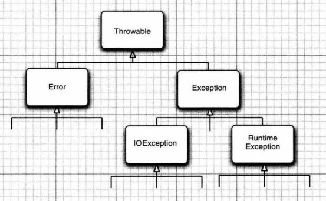

# 7.异常、断言和日志

[TOC]


为了降低程序遇到错误时对用户造成的损失，至少应该做到：

+ 向用户通知错误；

+ 保存所有工作；

+ 妥善地退出程序。

Java使用了一种称为异常处理（exception handing）的错误捕获机制。在测试期间，需要大量的检查，这些检查完成后也没有必要保留。本章第2节将介绍如何使用断言高效地进行检查。最后，第3节将讨论标准Java日志框架。


## 7.1 处理错误

程序中可能会出现的错误：

1. 用户输入错误；
2. 设备错误；例如，打印机在工作途中被关闭；
3. 物理限制；例如，磁盘已满；
4. 代码错误；例如，计算一个无效的数组索引。

对于方法中的错误，传统的做法是使用错误码，例如返回-1或null。但并不是所有情况都能返回错误码，例如-1是一个合法的结果时。于是，Java提供了抛出异常的解决办法，即抛出（throw）一个封装了错误信息的对象。抛出异常后，这个方法会立刻退出，并不返回任何值。然后，异常处理器将搜索能处理这种异常的异常处理器（exception handler）。

### 7.1.1 异常分类

在Java中，异常对象都是派生于Throwable类的一个类实例。异常类可分为两个分支：Error和Exception，如下图所示。



Error类描述了Java运行时系统的内部错误和资源耗尽错误。我们不应该抛出这类错误，如果出现，除了通知用户，并尽力妥，终止程序之外，我们几乎无能为力。

Exception类分为IOException和RuntimeException。

一般规则是，由编程错误导致的异常属于RuntimeException，例如：

+ 错误的强制类型转换；
+ 数组访问越界；
+ 访问null指针。

由I/O错误和其他错误导致的属于IOExcption，例如：

+ 试图超越文件末尾继续读取数据；
+ 试图打开一个不存在的文件；
+ 试图根据给定的字符串查找Class对象，而这个类并不存在。

为什么一定要进行异常处理呢？例如文件不存在的情况下，为什么不检查后再打开文件呢？实际上，这类错误是不可检查的，因为可能我们检查文件存在后，文件立即就被删除了。因此，这完全取决于环境，与代码无关。

我们将Error类和RuntimeException类的所有异常称为**非检查型**(unchecked)异常，IOexception异常称为**检查型**(checked)异常。编译器将检查程序是否为所有的检查型异常提供了异常处理器。


### 7.1.2 声明检查型异常

在声明一个方法时，方法不仅需要告诉编译器将要返回什么值，还要告诉编译器有可能发生什么错误。要在方法的首部指出这个方法可能抛出的检查型异常。

```java
public FileInputStream(String name) throws FileNotFoundException
```

在编写自己的方法时，不必声明这个方法可能抛出的所有异常。需要记住遇到下面4种情况会抛出异常：

1. 调用了一个抛出检查型异常的方法，例如，FileInputStream构造器。
1. 检测到一个错误，并且利用throw语句抛出一个检查型异常
1. 程序出现错误，例如a[-1]=0会抛出一个非检查型异常（这里会抛出ArrayIndexOutOfBoundsException）。
1. Java虚拟机或运行库出现内部错误。

前两种情况必须告诉调用这个方法的程序员有可能抛出异常。因为如果抛出异常而没有处理器捕获这个异常，线程将终止。

有些 Java 方法包含在对外提供的类中，应该通过方法首部的异常规范（exception specification）声明这个方法可能抛出异常。如果该方法可能抛出多个检查型异常，每个异常类之间用逗号隔开。

```java
class MyAnimation
{
    public Image loadImage(String s) throws FileNotFoundException, EOFException
        ···
}
```

但是，不需要声明 Java 的内部错误，即从 Error 继承的异常。任何程序代码都有可能抛出那些异常，而我们对此完全无法控制。同样，也不应该声明从 RuntimeException 继承的那些非检查型异常，例如ArrayIndexOutOfBoundsExcption。

>如果在子类中覆盖了超类的一个方法，子类方法中声明的检查型异常不能比超类方法中声明的异常更通用（子类方法可以抛出更特定的异常，或者根本不抛出任何异常）。特别需要说明的是，如果超类方法没有抛出任何检查型异常，子类也不能抛出任何检查型异常。如果一个方法声明它可能抛出一个异常，那么它实际抛出的异常有可能是声明的异常的子类的实例对象。
>

>*C++注释*：Java 中的 throws 说明符与 C++中的 throw 说明符基本类似，但有一点重要的区别。在 C++中，throw 说明符在运行时执行，而不是在编译时执行。也就是说，C++编译器将不处理任何异常规范。但是，如果函数抛出的异常没有出现在 throw 列表中，就会调用 unexpected 函数，默认情况下，程序会终止。
>
>另外，在 C++中，如果没有给出 throw 说明，函数可能会抛出任何异常。而在 Java 中，没有 throws 说明符的方法将根本不能抛出任何检查型异常。


### 7.1.3 如何抛出异常

首先要决定抛出什么类型的异常。例如，EOFException指示输入过程中意外遇到了EOF。

```java
throw new EOFException();
```

EOFException 类还有一个带一个字符串参数的构造器。可以更细致地描述异常。

```JAVA
String gripe = "EOF";
throw new EOFException(gripe);
```

如果一个已有的异常类能够满足要求，抛出这个异常非常容易。在这种情况下：

1. 找到一个合适的异常类。
2. 创建这个类的一个对象。
3. 将对象抛出。

>*C++注释*：Java中只能抛出Throwable子类的对象，而在C++中，可以抛出任何类型的值。


### 7.1.4 创建异常类

我们可能会遇到任何标准异常类都无法描述清楚的问题。在这种情况下，可以创建自己的异常类，需要做的只是定义一个派生于 Exception 的类，或者派生于 Exception 的某个子类，如 IOException。习惯做法是，自定义的这个类应该包含两个构造器，一个是默认的构造器，另一个是包含详细描述信息的构造器（超类 Throwable 的 toString 方法会返回一个字符串，其中包含这个详细信息，这在调试中非常有用）。

```java
class FileFormatException extends IOExcption
{
    public FileFormatException(){}
    public FileFormatException(){String gripe}
    {
        super(gripe);
    }
}
```

```java
import java.lang.Throwable

//构造一个新的Throwable对象
Throwbale()
    
//构造一个新的Throwable对象，带有指定的详细描述信息
Throwable(String message)
    
//获得Throwable对象的详细描述信息
String getMessage()
```


## 7.2 捕获异常

### 7.2.1 捕获异常

如果发生了某个异常，但没有在任何地方捕获这个异常，程序就会终止。要想捕获一个异常，需要设置try/catch语句块。最简单的try语句块如下所示：

```java
try
{
    //code
}
catch(ExceptionType e)
{
    //handler for this type
}
```

如果 try 语句块中的任何代码抛出了 catch 子句中指定的一个异常类，那么 

1. 程序将跳过 try 语句块的其余代码。
2. 程序将执行 catch 子句中的处理器代码。

如果try语句块没有抛出异常，那么程序将跳过catch子句。如果方法中的代码抛出了catch子句中没有声明的一个异常类型，那么这个方法就会立即退出（希望它的调用者提供了这种类型的异常处理器）。

编译器严格地执行 throws 说明符。如果调用了一个抛出检查型异常的方法，就必须处理这个异常，或者继续传递这个异常。一般经验是，要捕获那些你知道如何处理的异常，而继续传播那些你不知道怎样处理的异常。如果想传播一个异常，就必须在方法的首部添加一个 throws 说明符，提醒调用者这个方法可能会抛出异常。


### 7.2.2 捕获多个异常

一个try语句块可以捕获多个异常类型。

```java
try
{
    //code
}
catch (FileNotFoundException e)
{
    //action
}
catch (UnknownHostException e)
{
    //action
}
```


### 7.2.3 再次抛出异常与异常链

可以在catch子句中抛出一个异常。通常，为了改变异常的类型时会这样做。例如，下面的代码对SQL异常进行包装，向上传递。

```java
try
{
    //access the databaseN
}
catch(SQLException original)
{
    var e = new ServletException("database error");
    e.initCause(original);
    throw e;
}
```

捕获到这个异常时，可以使用下面这条语句获取原始异常。

```java
Throwable original = caughtException.getCause();
```

经过这种处理，我们在代码的高层可以获得高层的异常，同时不丢失最原始的异常细节。


### 7.2.4 finally子句

代码抛出一个异常时，就会停止处理这个方法中剩余的代码，并退出这个方法。如果这个方法已经获得了只有它自己知道一些本地资源，而且这些资源必须清理，这就会有问题。一种解决方案是捕获所有异常，完成资源的清理，再重新抛出异常。但是，这种解决方案比较烦琐，这是因为需要在两个地方清理资源分配。一个在正常的代码中；另一个在异常代码中。finally 子句可以解决这个问题。

不管是否有异常被捕获，finally子句中的代码最后都会被执行。

```java
var in = new FileInputStream(...);
try
{
    //1
    //code that might throw exceptions
    //2    
}
catch(IOException e)
{
    //3
    //exception handler
    //4
}
finally
{
    //5
    in.close();
}
//6
```

该程序的几种可能：

1. 代码没有抛出异常。在这种情况下，程序首先执行 try 语句块中的全部代码，然后执行 finally 子句中的代码。随后，继续执行 finally 子句之后的第一条语句。执行的顺序是 1、2、5、6。
2. 代码抛出一个异常，并在一个 catch 子句中捕获。在上面的示例中就是 IOException 异常。在这种情况下，程序将执行 try 语句块中的所有代码，直到抛出异常为止。此时，将跳过 try 语句块中的剩余代码，转去执行与该异常匹配的 catch 子句中的代码，最后执行 finally 子句中的代码。
    + 如果 catch 子句没有抛出异常，程序将执行 finally 子句之后的第一条语句。在这种情况下，执行顺序是 1、3、4、5、6。
    + 如果 catch 子句抛出了一个异常，程序将直接从异常处跳到finally子句，执行完finally子句后异常将被抛回到这个方法的调用者。执行顺序则只是 1, 3, 5.

3. 代码抛出了一个异常，但没有任何 catch 子句捕获这个异常。在这种情况下，程序将执行 try 语句块中的所有语句，直到抛出异常为止。此时，将跳过 try 语句块中的剩余代码，然后执行 finally 子句中的语句，并将异常抛回给这个方法的调用者。在这里，执行顺序只是 1, 5.

另外，try语句可以只有finally子句，而没有catch子句。此时finally子句执行完后异常将抛给上层方法。

```java
InputStream in = ...;
try
{
    code that might throw exceptions
}
finally
{
    in.close();
}
```

>警告：当finally子句包含return语句时，将产生意想不到的结果。
>
>假设利用return语句从try语句块中间退出。在方法返回前，会执行finally子句块，如果finally子句块也有一个return语句，那么新的返回值将会遮蔽原来的返回值。
>
>```java
>public static int parseInt(String s)
>{
>    try
>    {
>        return Integer.parseInt(s);
>    }
>    finally
>    {
>        return 0;
>    }
>}
>```
>
>在parseInt("42")调用中，try语句块会返回42，但在这个方法真正返回之前，会执行finally子句，使得最后的返回值变为0。
>
>更糟糕的是，考虑调用parseInt("zero")。try语句块抛出一个NumberFormatException异常，本来该异常将被抛出到上层方法，但在抛出之前，程序执行finally子块的return语句，直接“吞掉”了这个异常。
>
>总而言之，finally子句用于资源清理，不要把改变控制流的语句放在finally子句中。


### 7.2.5 try-with-Resources语句

现在每次打开资源都需要这样编写代码：

```java
open a resource
try
{
    work with the resource
}
finally
{
    close the resource
}
```

Java为这种代码模式提供了一个很有用的快捷方式。只需要资源实现了AutoCloseable接口。

```java
try (Resource res=...)
{
    work with res
}
```

try块正常退出或抛出异常时，都会自动调用res.close()，就好像使用了finally块一样。

```java
try( var in = new Scanner(new FileInputStream("~/words"), StandardCharsets.UTF_8);
   	var out = new PrintWrinter("out.txt", StandardCharsets.UTF_8))
{
    while(in.hasNext())
        out.println(in.next().toUpperCase());
}
```

不管这个块如何退出，in和out都会关闭。如果采用常规方式，则需要编写两个嵌套的try/finally语句。

如果 try 块抛出一个异常，而且 close 方法也抛出一个异常，这就会带来一个难题。try- with-resources 语句可以很好地处理这种情况。原来的异常会重新抛出，而 close 方法抛出的异常会“被抑制”。这些异常将自动捕获，并由 addSuppressed 方法增加到原来的异常。如果对这些异常感兴趣，可以调用 getSuppressed 方法，它会生成从 close 方法抛出并被抑制的异常数组。

你肯定不想采用这种常规方式编程。只要需要关闭资源，就要尽可能使用 try-with-resources 语句。

>异常抑制机制（可参考博客：https://blog.csdn.net/qiyan2012/article/details/116173807）：
>
>我们在对异常进行处理的时候，有时候在finally和catch中也会出现异常，还需要在catch或者finally中再对新的异常进行处理。可是在catch或者finally中抛出的异常会把try代码块中的异常给覆盖掉。但我们最需要的异常信息其实是try代码块中抛出的异常。在下面这个例子中，本来程序抛出ArithmeticException，但是我们在catch子句中处理时提供的x可能会引发新的NullPointerException，最后程序返回的异常时NullPointerException，其实并不是我们想要的：
>
>java.lang.NullPointerException
>	at com.springlearn.qiyan.base.ThrowTest.test(ThrowTest.java:26)
>
>```java
>public Integer getX(){
>    Random random = new Random();
>    boolean b = random.nextBoolean();
>    if(b){
>        return null;
>    }else{
>        return 1;
>    }
>}
>
>@Test
>public void test() {
>    int a;
>    Integer x = getX();
>    try {
>        a = 3 / 0;
>        System.out.println(a);
>    } catch (ArithmeticException zero) {
>        try {
>            a = 3 / x;
>            System.out.println(a);
>        } catch (NullPointerException nullPoint) {
>            nullPoint.printStackTrace();
>        }
>
>    }
>}
>```
>
>这时候就可以使用Throwable中的addSuppressed方法去实现对两个异常的捕获，得到真正的异常：
>
>java.lang.ArithmeticException: / by zero
>	at com.springlearn.qiyan.base.ThrowTest.test3(ThrowTest.java:85)
>	Suppressed: java.lang.NullPointerException
>		at com.springlearn.qiyan.base.ThrowTest.test3(ThrowTest.java:89)
>
>```java
>@Test
>public void test3() {
>    int a;
>    Integer x = getX();
>    try {
>        a = 3 / 0;
>        System.out.println(a);
>    } catch (ArithmeticException zero) {
>        try {
>            a = 3 / x;
>            System.out.println(a);
>        } catch (NullPointerException nullPoint) {
>            zero.addSuppressed(nullPoint);
>            zero.printStackTrace();
>        }
>    }
>}
>```
>其实，try-with-resources语句块的内部实现就是将本来应该在finally子句中关闭资源的代码可能抛出的异常添加到捕捉到的异常的抑制列表中。


### 7.2.6 分析堆栈轨迹元素

堆栈轨迹(stack trace)是程序执行过程中某个特定点上所有挂起的方法调用的一个列表。当Java程序因为一个未捕获的异常而终止时，就会显示堆栈轨迹。

可以调用Throwable类的printStackTrace方法访问堆栈轨迹的文本描述信息。

```java
var t = new Throwable();
var out = new StringWriter();
t.printStaceTrace(new PrintWriter(out));
String description = out.toString();
```

一种更灵活的方法是使用StackWalker类。它会生成一个StackWalker.StackFrame实例流，其中每个实例分别描述一个栈帧。可以利用以下调用迭代处理这些栈帧：

```java
StackWalker walker = StackWalker.getInstance();
walker.forEach{frame -> work with frame}
```
> 在Java 9 之前，Throwable.getStackTrace 方法会生成一个 StackTraceElementl] 数組，其中包含与 Stackwalker.StackFrame 实例流类似的信息。不过，这个调用的效率不高，因为它要得到整个堆栈，即使调用者可能只需要几个栈帧。另外它只九许访问桂起方法的类名，而不能访问类对象。

```java
import lava.lang.Throwable

Throwable (Throwable cause)

Throwable (String message, Throwable cause)
//用给定的 cause（原因）构造一个 Throwable 对象。
    
Throwable initCause (Throwable cause)
//为这个对象设置原因，如果这个对象已经有原因，则抛出一个异常。返回 this。
    
Throwable getCause ()
//获得设置为这个对象的原因的异常对象。如果没有设置原因，则返回 null。
    
StackTraceElement[] getStackTrace () 
//获得构造这个对象时调用堆栈的轨迹。
    
void addSuppressed (Throwable t)
//为这个异常增加一个“抑制的”异常。这出现在 try-with-resources 语句中，其中 t 是 close 方法抛出的一个异常。
    
Throwable [] getSuppressed ()
//得到这个异常的所有“抑制的”异常。一般来说，这些是 try-with-resources 语句中 close 方法抛出的异常。
    
    
import java.lang.Exception

Exception(Throwable cause)
    
Exception(String message, Throwable cause)
//用给定的cause构造一个Exception对象。
    
    
import java.lang.RuntimeException

RuntimeException(Throwable cause)
    
RuntimeException(String message, Throwable cause)
//用给定的cause构造一个RuntimeException对象。


import java.lang.StackWalker

static StackWalker getInstance()
static StackWalker getInstance(StackWalker.Option option)
static StackWalker getInstance(Set<StackWalker.Option> options)
//得到一个StackWalker实例。选项包括StackWalker.Option枚举中的RETAIN_CLASS_REFERENCE,SHOW_HIDDEN_FRAMES和SHOW_REFLECT_FRAMES。
    
forEach(Consumer<? super StackWalker.StackFrame> action)
//在每个栈帧上完成给定的动作，从最近调用的方法开始
    
walk(Function<? super Stream<StackWalker.StackFrame>, ? extends T> function)
//对一个栈帧流应用给定的函数，返回这个函数的结果
    
    
import java.lang.StackWalker.StackFrame
String getFileName()
//得到包含该元素执行点的源文件的文件名，如果这个信息不可用则返回 null。
  
int getLineNumber()
//得到包含该元素执行点的源文件的行号，如果这个信息不可用则返回 -1。

String getCLassName()
//得到方法包含该元素执行点的类的完全限定名。

String getDeclaringClass()
//得到方法包含该元素执行点的类的 Class 对象。如果这个栈遍历器（stack walker）不是用 RETAIN_CLASS_REFERENCE 选项构造的，则会抛出一个异常。

String getMethodName ()
//得到包含该元素执行点的方法的方法名。构造器的方法名为 <init>。静态初始化器的方法名为 <linit>。无法区分同名的重载方法。

boolean isNativeMethod()
//如果这个元素的执行点在一个原生方法中，则返回 true。

String toString()
//返回一个格式化字符串，包含类和方法名、文件名以及行号（如果这些信息可用)。
    
    
import java.lang.StackTraceElement

String getFileName()
//得到包含该元素执行点的源文件的文件名，如果这个信息不可用则返回 null.

int getLineNumber()
//得到包含该元素执行点的源文件的行号，如果这个信息不可用则返回 -1。

String getClassName()
//得到包含该元素执行点的类的完全限定名。

String getMethodName()
//得到包含该元素执行点的方法的方法名。构造器的方法名为 xinit>。静态初始化器的方法名为 <init>。无法区分同名的重载方法。

boolean isNativeMethod()
//如果这个元素的执行点在一个原生方法中，则返回 true。

String toString()
//返回一个格式化字符串，包含类和方法名、文件名以及行号（如果这些信息可用)。
```


## 7.3 使用异常的技巧

1. 异常处理不能代替简单的测试
    在我们的测试机器上，以下的例子中使用isempty的版本运行时间为646毫秒，而使用捕获异常EmptyStackException的版本运行时间为21739毫秒。

    ```java
    //推荐的正常测试
    if(!s.empty()) s.pop();
    
    //捕获异常
    try
    {
        s.pop();
    }
    catch(EmptyStackException e)
    {
    }
    ```

2. 不要过分细化异常
    推荐把一个任务一起放在try语句块中，而不是每一条语句都单独在一个try语句块。下面的例子中的代码就显得非常冗余。

    ```java
    for(i=0; i<100; i++)
    {
        try
        {
            n = s.pop();
        }
        catch (EmptyStackException e)
        {
            //...
        }
        try
        {
            out.writeInt(n);
        }
        catch(IOException e)
        {
            //..
        }
    }
    ```

3. 充分利用异常层次结构

    不要只抛出 RuntineException 异常。应该寻找一个适合的子类或创建自己的异常类。
    不要只捕获 Throvable 异常，否则，这会使你的代码更难读、更难维护。
    考虑检查型异常与非检查型异常的区别。检查型异常本来就很庞大，不要为逻辑错误抛出这些异常。(例如，反射库的做法就不正确。调用者经常需要捕获那些早已知道不可能发生的异常。）

4. 不要压制异常

    在Java 中，往往非常希望关闭异常。如果你编写了一个方法要调用另一个方法，而那个方法有可能100 年才抛出一个异常，但是，如果没有在你的方法的 throws列表中声明这个异常，编译器就会报错。你不想把它放在 throws 列表中，因为这样一来，编译器会对调用了你的方法的所有方法报错。因此，你可能会像下面这样将异常关闭。但这给代码留下了潜在的隐患。

    ```java 
    public Image loadImage(String s)
    {
    	try
        {
            //code that threatens to throwu checked exceptions
        }
    	catch (Exception e)
    	{} // so there
    }
    ```

5. 在检测错误时，苛刻要比放任更好

    当检测到错误的时候，有些程序员对抛出异常很担心。在用无效的参数调用一个方法时，返回一个虚拟值是不是比抛出一个异常更好？例如，当栈为空时，Stack.pop 是该返回一个null，还是要抛出一个异常？我们认为，最好在出错的地方抛出一个 EnptystackException 异常，这要好于以后抛出一个 NullPointerException 异常。

6. 懂得传递异常

    有时候没有必要捕获所有的异常。例如下面的readStuff函数，调用了FileInputStream函数，最好的做法就是把他可能抛出的异常向上传递。

    ```java
    public void readStuff(String filename) throws IOException
    {
        var in = new FileInputStream(filename, StandardCharsets.UTF_8);
    }
    ```


## 7.4 使用断言

### 7.4.1 断言的概念

假设确信某个属性符合要求，并且代码的执行依赖于这个属性。例如，需要计算 double y = Math. sqrt(x)；你确信这里的x是一个非负数。原因是：×是另外一个计算的结果，而这个结果不可能是负值。为了不让计算中潜入NaN浮点值，我们可以抛出一个异常，但异常检测的代码在生产代码中还会留存，导致程序运行速度降低。

断言机制运行在测试期间向代码中插入一些检查，而在生产代码中会自动删除这些检查。

Java语言引入了关键字assert，有两种形式：

```java
assert condition;
```

```java
assert condition : expression;
```

这两个语句都会计算条件，如果结果为 false，则抛出一个 AssertionError 异常。在第二个语句中，表达式将传入AssertionError 对象的构造器，并转换成一个消息字符串。

>*C++注释*：C语言中的 assert 宏将断言中的条件转换成一个字符串。当断言失败时，就会打印这个宇行串。例如，若 assert(x >=0) 失败，那么将打印出失败条件“x=0”。在Java 中，条件并不会自动地成为错误报告中的一部分。如果希望看到这个条件，就必须将它以宇符串的形式传递给 AssertionError 对象：assert ×≥0:"x= 0"。


### 7.4.2 启用和禁用断言

在默认情况下，断言是禁用的。可以在运行程序时用 -enableassertions 或-ea 选项启用断言：

```shell
java -enableassertions MyApp
```

需要注意的是，不必重新编译程序来启用或禁用断言。启用或禁用断言是类加载器（ class loader）的功能。禁用断言时，类加载器会去除断言代码，因此，不会降低程序运行的速度。

也可以在某个类或包中启用断言。

```shell
java -ea:MyClass -ea:com.mycompany.mylib MyApp
```

也可以在某个类或包中禁用断言。

```shell
java -ea:... -da:MyClass MyApp
```

不过，启用和禁用所有断言的-ea 和-da开关不能应用到那些没有类加载器的“系统类”上。对于这些系统类，需要使用 -enablesystemassertions/-esa 开关启用断言。


### 7.4.3 使用断言完成参数检查

Java提供了3种处理系统错误的机制：

1. 抛出一个异常
2. 日志
3. 使用断言

需要注意的是，断言失败是致命的、不可恢复的错误。断言只在开发和测试阶段打开。

是否应该使用断言来检查方法的参数呢？具体取决于这个方法的文档。文档可能指出如果使用了错误的下标值，方法将抛出一个异常，那么就不合适使用断言。如果规定参数必须不为null，那么就可以使用断言。

计算机科学家将这种约定称为前置条件（Precondition)。最初的方法对参数没有前置条件，即承诺在任何情况下都有正确的行为。修改后的方法有一个前置条件，即a非null。如果调用者在调用这个方法时没有满足这个前置条件，断言会失败，这个方法就能“为所欲为"。事实上，由于有这个断言，当方法被非法调用时，它的行为将是难以预料的。有时候
会抛出一个断言错误，有时候会产生一个 null指针异常，这完全取决于类加载器的配置。


### 7.4.4 使用断言提供假设

很多程序员使用注释来提供假设。例如下面的例子：

```java
if(i%3==0)
    ···
else if(i%3==1)
   	···
else //（i%3==2）
    ···
```

在这个例子中，使用断言会更好

```java
if(i%3==0)
    ···
else if(i%3==1)
   	···
else
{
    assert i%3==2;
    ···
}
```

当然，如果仔细地考虑这个问题，会发现一个更有意思的内容。13的值会是什么？如果i是正值，那么余数肯定是0、1或2。如果i是负值，余数可以是-1和-2。因此，实际的假设是i是非负值，因此，最好是在 计f语句之前使用以下断言：

```java
assert i>=0
```


## 7.5 日志

我们经常在有问题的代码中插入一些 System.out.println 方法调用来帮助观察程序的行为。当然，一旦发现问题的根源，就要将这些 print 语句从代码中删去。如果接下来又出现了问题，就需要再插人几个调用 System.out.println 方法的语句。日志 API 就是为了解决这个问题而设计的。有很多应用会使用其他功能更加强大的日志框架，本文将只介绍标准Java日志框架。

### 7.5.1 基本日志

要生成简单的日志记录，可以使用全局日志记录器（global logger）并调用其 info 方法：

```java
Logger.getGlobal().info("File- >0pen menu iten selected");
```

在默认情况下，会如下打印这个记录：

```java\
Hay 10, 2013 10:12:15 PM LoggingImageviewer file0pen 
INFO: File->0pen menu item selected
```

但是，如果在适当的地方（如 main 的最前面）调用如下方法，将会取消所有日志。 

```java
Logger.getGlobal().setLevel(Level.0FF);
```


### 7.5.2 高级日志

下面来看更高级的行业级日志。在一个专业的应用程序中，将所有的日志都记录到一个全局日志记录器中是很糟糕的。你可以定义自己的日志记录器。

可以调用 getLogger 方法创建或获取日志记录器：

```java
private static final Logger myLogger = Logger.getLogger("com.mycompany.myapp")；
```

>提示：未被任何变量引用的日志记录器可能会被垃圾回收。为了防止这种情况，要使用静态变量存储日志记录器的引用。

与包名类似，日志记录器名也具有层次结构。事实上，与包相比，日志记录器的层次性更强。对于包来说，包与父包之间没有语义关系，但是日志记录器的父与子之间将共享某些属性。例如，如果对日志记录器“com.mycompany”设置了日志级别，它的子日志记录器也会继承这个级别。通常，有以下7个日志级别：

+ SEVERE
+ WARNING
+ INFO
+ CONFIG
+ FINE
+ FINER
+ FINEST

在默认情况下，实际上只记录前3个级别。另外，也可以设置级别为Level.ALL开启所有级别的日志记录，或者使用Level.OFF关闭所有级别的日志记录。

默认的日志记录将显示根据调用堆栈得出的包含日志调用的类名和方法名。不过，如果虚拟机对执行过程进行了优化，就得不到准确的调用信息。此时，可以使用 1ogp 方法获得调用类和方法的确切位置，这个方法的签名为：

```java
void logp(Level l, String className, String methodName, String message)
```

由一些用来跟踪执行流的便利方法：

```java
void entering(String className, String methodName) 
void entering(String classNane, String methodName, Object param) 
void entering(String className, String methodName, Object[] params)
void exiting(String className, String methodName) 
void exiting(String classlame, String methodName, Object result)
```

例如这些调用将生成以字符串ENTRY和RETURN开头的日志记录

```java
int read (String file, String pattern) 
{
    logger.entering(*"com.mycompany.mylib.Reader", " read" , new Object [] { file, pattern });
    ···
    logger.exiting ("com.mycompany.mylib.Reader", "read", count); 
    return count;
}
```

记录日志的常见用途是记录那些预料之外的异常。可以使用下面两个便利方法在日志记录中包含异常的描述。

```java
void throwing(String className, String nethodNane, Throwable t);
void Log(Level l, String message, Throwable t);
```

典型的用法：

```java
if(···)
{
    var e = new IOException("···")；
	Logger.throwing ("com.mycompany .mylib.Reader", "read", e); 
    throw e;
}

try
{
    ···
}
catch(IOException e)
{
    Logger.getLogger("com.mycompany.myapp").log(Level.WARNING, "Reading image", e);
}
```


### 7.5.3 修改日志管理器配置

可以通过编辑配置文件来修改日志系统的各个属性。在默认情况下，配置文件位于：
conf/logging.properties

要想使用另一个配置文件，可以将java.util.logging.config.file属性设置为那个文件的位置，为此要用以下命令启动应用程序：

```shell
java -Djava.util.logging.config.file=configFile Mainclass
```

要修改默认的日志级别，需要编辑配置文件：

```
.level=INFO
```

可以通过添加下面这一行来指定自定义日志记录器的日志级别（在日志记录器名后面追加.level）：

```
com.mycompany.myapp.level=FINE
```

稍后可以看到，日志记录器并不将消息发送到控制台，那是处理器的任务。处理器也有级别。要想在控制台上看到 FINE 级别的消息，就需要进行以下设置：

```
java.util.logging.ConsoleHandler.level=FINE
```

>注意，日志管理器配置中的属性设置不是系统属性，因此，用-Dcom.mycompany.myapp.level= FTNE 启动程序不会对日志记录器产生任何影响。

日志管理器在虚拟机启动时初始化，也就是在 main 方法执行前。如果想要定制日志属性，但是没有用 -Djava.util.logging.config.file命令行选项启动应用，可以在程序中调用 

```java
System.setProperty("java.util.Logging.config.file", file);
```

不过，这样一来，你还必须调用下面的方法重新初始化日志管理器。

```java
LogManager.getLogManager().readConfiguration();
```


### 7.5.4 本地化

你可能希望将日志消息本地化，以便全球用户都可以阅读。

本地化的应用程序包含资源包(resource bundle） 中的本地特定信息。资源包包括一组映射，分别对应各个本地化环境（locale，如美国或德国)。例如，一个资源包可能将字符串"readingFile"映射成英文的 "Reading file" 或者德文的 "Achtung! Datei wird eingelesen"。

一个程序可以包含多个资源包，例如一个用于菜单，另一个用于日志消息。每个资源包都有一个名字（如"com.mycompary.Logmessages")。要想为资源包增加映射，需要对应每个本地化环境提供一个文件。英文消息映射位于 com/mycompany/Logmessages_en.properties 文件中；德文消息映射位于 com/myconpany /Lognessages de.properties 文件中。（en 和 de是语言编码。）。可以将这些文件与应用程序的类文件放在一起，以便 ResourceBundle 类自动找到它们。这些文件都是纯文本文件，包含如下所示的条目：

```
readingFile=Achtung! Datei wird eingelesen
renamingFile=Datei wird umbenannt
```

请求一个日志记录器时，可以指定一个资源包：

```java
Logger logger = Logger.getLogger(loggerName, "com.myconpany.Logmessages");
```

然后，为日志消息指定资源包的键，而不是实际的日志消息字符串。

```java
Logger.info("readingFile");
```

通常需要在本地化的消息中增加一些参数，因此，消息可能包括占位符{0}、{1}等。例如，要想在日志消息中包含文件名，可以如下使用占位符：

```
Reading file {0}.
Achtung! Datei {0} wird eingelesen.
```

然后，通过调用下面的一个方法向占位符传递具体的值：

```java
Logger.log(Level.INFO, "readingFile", fileName);
Logger.Log(Level.INFO, "renamingFile", new Object [] { oldName, newName });
```

>这是唯一一个使用可变参数表示消息参数的日志记录方法。


### 7.5.5 处理器

在默认情况下，日志记录器将记录发送到 ConsoleHandler，并由它输出到 System.err 流。具体地，日志记录器会把记录发送到父处理器，而最终的祖先处理器(名为""，对就是为空字符串)有一个ConsoleHandler。

与日志记录器一样，处理器也有日志级别。对于一个要记录的日志记录，它的日志级别必须高于日志记录器和处理器二者的國值。日志管理器配置文件将默认的控制台处理器的日志级别设置为

```
java.util.logging.ConsoleHandler.level=INFO
```

要想记录 FINE 级别的日志，就必须修改配置文件中的默认日志记录器级别和处理器级别。另外，还可以绕过配置文件，安装自己的处理器。

```java
Logger logger = Logger.getLogger("com.mycompany.myapp"); 
Logger.setLevel(LeveL.FINE)； 
Logger.setuseParentHandlers(false); 
var handler = new ConsoleHandler()；
handler.setLevel(Level.FINE)；
Logger.addHandler (handler);
```

要想将日志记录发送到其他地方，就要添加其他的处理器。日志 API 为此提供了两个很有用的处理器，一个是 FileHandler；另一个 是 SocketHandler。SocketHandler 将记录发送到指定的主机和端口。FileHandler可以将记录收集到文件中。可以如下直接将记录发送到默认文件处理器：

```java
var handler = new FileHandler()；
Logger.addHandler(handler)；
```

这些记录被发送到用户主目录的 javan.log 文件中，n是保证文件唯一的一个编号。默认情况下，记录会格式化为 XML。


### 7.5.6 过滤器

在默认情况下，会根据日志记录的级别进行过滤。每个日志记录器和处理器都有一个可选的过滤器来完成附加的过滤。要定义一个过滤器，需要实现 Filter 接口并定义以下方法：

```java
boolean isLoggable(LogRecord record);
```

在这个方法中对那些应该包含在日志中的记录返回 true。例如，某个过滤器可能只对 entering 方法和 exiting 方法生成的消息感兴趣，这个过滤器就可以调用 record.getMessage()方法，并检查消息是否以 ENTRY 或 RETURN 开头。
要想将一个过滤器安装到一个日志记录器或处理器中，只需要调用 setFilter 方法就可以了。注意，同一时刻最多只能有一个过滤器。


### 7.5.7 格式化器

ConsoleHandler 类和 FiletHandler 类可以生成文本和XML格式的日志记录。不过，你也可以自定义格式。这需要扩展 Formatter 类并覆盖下面这个方法：

```java
String format(LogRecord record);
```

可以根据自己的需要以任何方式对记录中的信息进行格式化，并返回结果字符串。在format 方法中，可能会调用下面这个方法：

```java
String formatMessage(LogRecord record);
```

这个方法对记录中的消息部分进行格式化，将替换参数并应用本地化处理。
很多文件格式(如 XML)需要在已格式化的记录的前后加上一个头部和尾部。为此，要覆盖下面两个方法：

```java
String getHead(Handler h);
String getTail(Handler h);
```


最后，调用 setFormatter 方法将格式化器安装到处理器中。


### 7.5.8 日志技巧

1. 对一个简单的应用，选择一个日志记录器。可以把日志记录器命名为与主应用包一样的名字，例如，com.nycompany.myprog，这是一个好主意。
2. 默认的日志配置会把级别等于或高于 INFO 的所有消息记录到控制台。用户可以覆盖这个默认配置。但是正如前面所述，改变配置的过程有些复杂。因此，最好在应用中安装一个更合适的默认配置。
3. 现在，可以记录自己想要的内容了。但需要牢记：所有级别为 INFO、 WARNING 和 SEVERE的消息都将显示到控制台上。因此，最好只将对程序用户有意义的消息设置为这几个级别。将程序员想要的日志消息设定为 FINE 级别是一个很好的选择。


### 7.6 调试技巧

1. 打印或记录任意变量的值：System.out.println("x=" + x); 或Logger.getGlobal().info("x=" + x);

2. 可以在每一个类中放置一个单独的 main 方 法。这样就可以提供一个单元测试桩（stub)，能够独立地测试类。

3. 如果喜欢使用前面介绍的那个技巧，就应该到http://junit.org 网站上查看 JUnit。JUnit 是一个非常流行的单元测试框架，利用它可以很容易地组织测试用例套件。只要对类做了修改，就需要运行测试。一旦发现 bug，还要再补充另一个测试用例。

4. 日志代理（1ogging proxy）是一个子类的对象，它可以截获方法调用，记录日志，然后调用超类中的方法。例如，如果在调用 Randon 类的 nextDouble 方法时出现了问题，就可以如下创建一个代理对象，这是一个匿名子类的实例：

    ```java
    var generator = new Random()
    {
     	public double nextDouble()
        {
            double result = super.nextDouble()；
    		Logger.getGlobal().info("nextDouble:" + result)；   
    		return result; 
        }
    }
    ```

5. 利用 Throwable 类的 printStackTrace 方法，可以从任意的异常对象获得堆栈轨迹。

6. 一般来说，堆栈轨迹显示在 System.err上。如果想要记录或显示堆栈轨迹，可以如下将它捕获到一个字符串中：

    ```java
    var out = new StringWriter()；
    new Throwable().printStackTrace(new PrintWriter(out))； 
    String description = out.toString()；
    ```

7. 通常，将程序错误记入一个文件会很有用。不过，错误会发送到 System.err，而不是System.out。

8. 在 System.err 中显示未捕获的异常的堆栈轨迹并不是一个理想的方法。如果最终用户碰巧看到了这些消息，就会很慌乱，而且在真正需要诊断错误原因时却又无法得到这些消息。更好的方法是将这些消息记录到一个文件中。可以用静态方法 Thread.setDefaultUncaughtExceptionHandler 改变未捕获异常的处理器：

    ```java
    Thread. setDefaultUncaughtExceptionHandler(
    	new Thread. UncaughtExceptionHandler()
    	{
    		public void uncaughtException(Thread t, Throwable e)
    		{
    			//save inforation in log file
    		};
    	})；
    ```

9. 要想观察类的加载过程，启动 Java虚拟机时可以使用 -verbose 标志。

10. -XLint 选项告诉编译器找出常见的代码问题，可以找出代码中有问题但不违背语法规则的构造。

11. Java 虚拟机增加了对 Java 应用程序的监控(monitoring)和管理(management)支持，
    允许在虚拟机中安装代理来跟踪内存消耗、线程使用、类加载等情况。

12. Java 任务控制器(Java Mission Control)是一个专业级性能分析和诊断工具，包含在Oracle JDK 中，可以免费用于开发。如果在生产环境使用则需要有商业授权。

