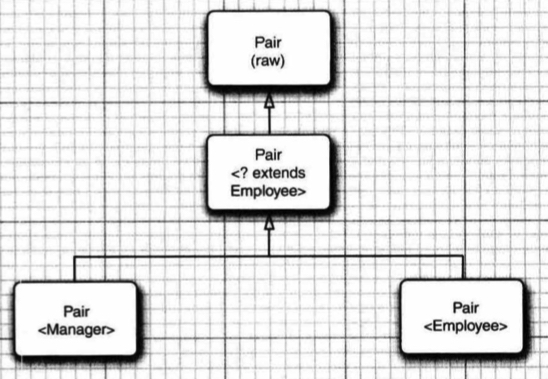

# 8.泛型程序设计
[TOC]

泛型类和泛型方法有类型参数，这使得它们可以准确地描述用特定类型实例化时会发生什么。在有泛型类之前，程序员必须使用 Object 编写适用于多种类型的代码。这很烦琐，也很不安全。随着泛型的引人，Java 有了一个表述能力很强的类型系统，允许设计者详细地描述变量和方法的类型要如何变化。


## 8.1 为什么要使用泛型程序设计

泛型程序设计（generic programming） 意味着编写的代码可以对多种不同类型的对象重用。 Arraylist 类就可以收集任何类的对象，这就是泛型程序设计的一个例子。实际上，在 Java 有泛型类之前已经有一个 Arraylist类。下面来研究泛型程序设计的机制是如何演变的。


### 8.1.1 类型参数的好处

在Java 中增加泛型类之前，泛型程序设计是用继承实现的。ArrayList 类只维护一个Object 引用的数组：

```java
public class Arraylist // before generic classes
{
    private Object[] elementData;
    ···
    public Object get (int i){...}
	public void add(Object o){...}
}
```

这种方法存在两个问题，1.当获取一个值时必须进行强制类型转换；2.没有错误检查，可以向数组列表中添加任何类的值。

泛型提供了一个更好的解决方法：**类型参数**（type parameter）。ArrayList类有一个类型参数用来指示元素的类型：

```java
var files = new ArrayList<String>();
```

>如果用一个明确的类型而不是 var 声明一个变量，则可以通过使用“菱形"语法省略构造器中的类型参数：
>
>```java
>ArrayList<String> files = new ArrayList<>();
>```
>
>
>省略的类型可以从变量的类型推断得出。

编译器也可以充分利用这个类型信息。调用 get 的时候，不需要进行强制类型转换。编译器知道返回值类型为 String，而不是 Object。编译器也知道add方法有一个类型为String的参数，可以进行类型检查。


### 8.1.2 谁想成为泛型程序员

使用泛型类很容易，但实现起来却很难。Arraylist 类有一个方法 addALL，用来添加另一个集合的全部元素。一个程序员可能想要将一个 Arraylist\<manager\> 中的所有元素添加到一个 ArrayList\<Enployee\> 中去。不过，当然反过来就不行了。如何允许前一个调用，而不允许后一个调用呢？Java 语言的设计者发明了一个具有独创性的新概念来解决这个问题，即通配符类型（wildcard type）。利用通配符类型，构建类库的程序员可以编写出尽可能灵活的方法。

应用程序员很可能不会编写太多的泛型代码。JDK 开发人员已经做出了很大的努力，为所有的集合类提供了类型参数。凭经验来说，如果代码中原本涉及大量通用类型（如 Object或 Comparable 接口）的强制类型转换，只有这些代码才会因使用类型参数而受益。


## 8.2 定义简单泛型类

泛型类（generic class） 就是有一个或多个类型变量的类。本章使用一个简单的 Pair类作为例子。这个类使我们可以只关注泛型，而不用为数据存储的细节而分心。下面是泛型 Pair类的代码：

```java
public class Pair<T>
{
	private T first;
	private T second;

	public Pair() { first = null; second = null;}
	public Pair(T first, T second) { this.first = first; this.second = second; }
    public T getFirst() { return first;}
	public T getSecond() { return second;}
	public void setFirst(T newValue) { first = newValue; }
	public void setSecond (T newValue) { second = newValue; }
}
```

Pair类引入了一个类型变量T，用尖括号括起来，放在类名的后面。泛型类可以有多个类型变量。例如，可以定义 Pair类，其中第一个字段和第二个字段使用不同的类型：

```java
public class Pair<T, U> {...}
```

类型变量在整个类中用于指定方法的返回类型以及字段和局部变量的类型。

>注释：常见的做法是类型变量使用大写宇母，而且很简短。Java 库使用变量E表示集合的元素类型，K和V分别表示表的键和值的类型。T（必要时还可以用相邻的宇母U和S)）表示任意类型。

可以用具体的类型替换类型变量来实例化泛型类型。

```java
Pair<String> pair = new Pair<>(firstString, secondString);
```

换句话说，泛型类相当于普通类的工厂。


## 8.3 泛型方法

可以定义带有类型参数的方法。

```java
class ArrayAlg
{
    public static <T> T getMiddle(T... a)
    {
        return a[a.length/2];
    }
}
```

这个方法是在普通类中定义的，而不是在泛型类中。不过，这是一个泛型方法，可以从尖括号和类型变量看出这一点。注意，类型变量放在修饰符（这里的修饰符就是 public static) 的后面，并在返回类型的前面。

泛型方法可以在普通类中定义，也可以在泛型类中定义。

当调用一个泛型方法时，可以把具体的类型包围在尖括号中，放在方法名前面：

```java
String middle = ArrayAlg.<String>getMiddle("John", "Q.", "Public");
```

在这种情况下（实际也是大多数情况下），方法调用中可以省略 String 类型参数。编译器有足够的信息推断出你想要的方法。它将参数的类型与泛型类型T进行匹配，推断出T一定是 String。也就是说，可以简单地调用

```java
String middle = ArrayAlg.getMiddle(" John", "Q.", "Public");
```

几乎在所有情况下，泛型方法的类型推导都能正常工作。偶尔，编译器也会提示错误，此时你就需要解译错误报告。考虑下面这个示例：

```java
double middle = ArrayAlg.getMiddle(3.14, 1729, 0);
```

错误消息以晦涩的方式指出（不同的编译器给出的错误消息可能有所不同）：解释这个代码有两种方式，而且这两种方式都是合法的。简单地说，编译器将把参数自动裝箱为1个Double 和2 个 Integer 对象，然后寻找这些类的共同超类型。事实上，它找到了2个超类型：Nunber 和 Comparable 接口，Comparable接口本身也是一个泛型类型。在这种情况下，可以采取的补救措施是将所有的参数都写为 double 值。

>*C++注释*：在C++中，要将类型参数放在方法名后面。这有可能会导致解析的二义性。例如，g(f<a,b>(c)) 可以理解为，用f<a，b>(c)的结果调用g，或者理解为用两个布尔值f<a和 b>(c) 调用g。


## 8.4 类型变量的限定

有时，类或方法需要对类型变量加以约束。例如，在方法中使用了对象T的compareTo方法，那么就要限制T实现了Comoparable接口。可以通过对类型变量T设置一个**限定**（bound）来实现这一点：

```java
public static <T extends Comparable> T min(T[] a) ...
```

实际上 Comparable 接口本身就是一个泛型类型。目前，我们忽略其复杂性以及编译器产生的警告。8.8节会讨论如何在 Comparable 接口中适当地使用类型参数。

现在，泛型方法 min 只能在实现了 Comparable 接口的类（如 String、 LocalDate 等）的数组上调用。

在这里有一个值得注意的地方，我们为什么使用关键字 extends 而不是 inplements？毕竟，Comparable 是一个接口。其实，这样的记法 `<T extends BoundingType>` 表示T应该是**限定类型**（bounding type）的**子类型**（subtype）。T和限定类型可以是类，也可以是接口。选择关键字 extends 的原因是它更接近子类型的概念，并且 Java 的设计者也不打算在语言中再添加一个新的关键字（如 sub）。

一个类型变量或通配符可以有多个限定，例如：`extends Comparable & Serializable` ，限定类型用“&”分隔，而逗号用来分隔类型变量。在 Java 的继承中，可以根据需要拥有多个接口超类型，但最多有一个限定可以是类。如
果有一个类作为限定类型，它必须是限定列表中的第一个限定。


## 8.5 泛型代码和虚拟机

虚拟机没有泛型类型对象——所有对象都属于普通类。在泛型实现的早期版本中，甚至能够将使用泛型的程序编译为在1.0 虚拟机上运行的类文件！在下面的小节中你会看到编译器如何“擦除”类型参数，以及这个过程对 Java 程序员有什么影响。


### 8.5.1 类型擦除

无论何时定义一个泛型类型，都会自动提供一个相应的原始类型（raw type）。这个原始类型的名字就是去掉类型参数后的泛型类型名。类型变量会被擦除（erased），并替换为其限定类型（或者，对于无限定的变量则替换为 Object）。
例如，Pair\<T\> 的原始类型如下所示：

```java
public class Pair
{
	private Object first;
    private Object second;
	public Pair(Object first, Object second)
	{
		this.first = first
		this.second = second；
    }
	public Object getFirst() { return first;}
	public Object getSecond() { return second;}
	public void setFirst(Object newValue) { first = newValue;}
	public void setSecond(Object newValue) { second = newValue;}
}

```

因为T是一个无限定的变量，所以直接用 Object 替换。结果是一个普通的类，就好像 Java 语言中引入泛型之前实现的类一样。在程序中可以包含不同类型的 Pair，例如，Pair\<Stringr\> 或 Pair\<LocalDate\>。不过擦除类型后，它们都会变成原始的 Pair 类型。

> *C++注释*：就这点而言，Java泛型与C++模板有很大的区别。C++会为每个模板的实例化产生不同的类型，这一现象称为"模板代码膨胀"。Java 不存在这个问题的困扰。

原始类型用第一个限定来替换类型变量，或者，如果没有给定限定，就替换为 Object。例如，类 Pair\<T\> 中的类型变量没有显式的限定，因此，原始类型用 Object 替换T。假定我们声明了一个稍有不同的类型：

```java
public class Interval<T extends Comparable & Serializable>  implements Serializable
{
    private T lower;
	private T upper;
    public Interval(T first, T second)
    {
        if (first.compareTo(second) <= 0) { lower = first; upper = second;}
		else { Lower = second; upper = first; }
    }
	
}   
```

原始类型 Interval 如下所示:

```java
public class Interval implements Serializable
{
	private Comparable Lower;
	private Comparable upper;
	...
    public Interval(Comparable first, Comparable second) {... ]    
}

```


### 8.5.2 转换泛型表达式

编写一个泛型方法调用时，如果擦除了返回类型，编译器会插入强制类型转换，例如，对于下面这个语句序列：

```java
Pair<Emplory> buddies = ...;
Employee buddy = buddies.getFirst();
```

getFirst擦除类型后的返回类型是Object。编译器自动插入转换到Employee的强制类型转换。也就是说，编译器自动把这个方法调用转换为两条虚拟机指令：

+ 对原始方法Pair.getFirst的调用
+ 将返回的Object类型强制类型转换为Employee类型

当访问一个泛型字段时也要插入强制类型转换。例如`Employee buddy=buddies.first`这个表达式，也会在结果字节码中插入强制类型转换。


### 8.5.3 转换泛型方法

类型擦除也会出现在泛型方法中。程序员通常认为下面的泛型方法是一组方法：

```java
public static <T extends Comparable> T min(T[] a)
```

而类型擦除后，只剩下一个方法：

```java
public static Comparable min(Comparable[] a)
```

注意，类型参数T已经被擦除了，只留下了限定类型Comparable。

方法的擦除带来两个复杂的问题。看下面的示例：

```java
class DateInterval extends Pair<LocalDate>
{
    public void setSecond(LocalDate second)
    {
        if(second.compareTo(getFirst()>=0))
           super.setSecond(second);
    }
    ...
}
```

日期区间是一对LocalDate对象，而且我们需要覆盖Pair的setSecond方法来确保第二个值永远不小于第一个值。这个类擦除后变成了：

```java
class DateInterval extends Pair
{
    public void setSecond(LocalDate second){...}
    ...
}
```

这个类还有一个从Pair继承下来的setSecond方法，即：

```java
public void setSecond(Object second)
```

这两个方法显然不同。当我们把一个DateInterval的实例引用赋给一个Pair类型的变量，在该变量上调用setSecond方法。

```java
var interval = new DateInterval(...);
Pair<LocalDate> pair = interval;
pair.setSecond(aDate);
```

此时类型Pair只有setSecond(Object)方法，在pair引用的对象DateInterval上调用setSecond(LocalDate)，本来由于多态机制应该调用子类的方法，但这里Pair类型没有setSecond(LocalDate)方法，无法使用多态。总结一下，这里由于类型擦除，造成超类的方法参数改变，无法实现子类重写方法，从而与多态机制冲突。

为解决此问题，编译器在DateInterval类中生成一个**桥方法**（bridge method），该桥方法可以实现重写被类型擦除的泛型方法，实现多态：

```java
public void setSecond(Object second)
{
    setSecond((LocalDate) second);
}
```

这样虚拟机在变量pair引用的对象上调用setSecond(Object)，这个方法是编译器合成的桥方法，它会调用DateInterval.setSecond(LocalDate)。

上面的例子是方法的泛型变量参数被类型擦除引发的问题，接下来看方法的返回值被类型擦除的情况。

DateInterval类可能也覆盖了getSecond方法：

```java
class DateInterval extends Pair<LocalDate>
{
    public LocalDate getSecond()
    {
        return (LocalDate) super.getSecond();
    }
}
```

这里，Pair\<LocalDate\>泛型类被类型擦除后，具有返回值为Object类型的getSecond方法，由于子类DateInterval重写getSecond方法后，返回值为LocalDate为Object的子类，这符合重写的规则（可以只改变方法的返回值，但子类方法的返回值必须是超类方法的返回值的子类），虚拟机可以处理这种情况。

总结Java泛型的转换：

1. 虚拟机中没有泛型，只有普通的类和方法；
2. 所有的类型参数都会替换为他们的限定类型；
3. 会合成桥方法来保持多态；
4. 为保持类型安全性，必要时会插入强制类型转换。


### 8.5.4 调用遗留代码

设计 Java 泛型时，主要目标是允许泛型代码和遗留代码之间能够互操作。下面看有关遗留代码的一个具体示例。Swing用户界面工具包提供了一个 JSlider 类，它的“刻度”(tick)可以定制为包含文本或图像的标签。这些标签用以下调用设置：

```java
void setLabelTable(Dictionary table)
```

Dictionary类将整数映射到标签。在Java 5之前，这个类实现为一个Object映射。现在Dictionary是一个泛型类，但JSlider却一直没有更新。因此我们将一个泛型类作为参数调用setLabelTable时存在兼容问题，编译器会发出一个警告。毕竟，编译器无法确定setLableTable会对Dictionary对象做什么操作。但我们清楚JSlider只读取这个信息，因此可以忽略这个警告。


## 8.6 限制与局限性

下面讨论使用Java泛型时需要考虑的一些限制，他们大多数是由类型擦除引起的。

### 8.6.1 不能用基本类型实例化类型参数

没有Pair\<double\>只有Pair\<Double\>。原因在于类型擦除，擦除之后Pair类含有Object字段，而double并不是Object的子类。

这得确不太方便，但这样做与Java语言中基本类型的独立状态相一致。


### 8.6.2 运行时类型检查只适用于原始类型

由于编译器的类型擦除，虚拟机中的对象总有一个特定的非泛型类型，无法在运行时跟踪特定的泛型类，所以下面的类型查询将导致编译器报错。

```java
if (a instanceof Pair<string>) // ERROR
if (a instanceof Pair<T>) // ERROR
```

实际上，可以查询 a是否为任意一种Pair泛型类，下面的查询是允许的。

```java
if (a instanceof Pair)
```

同样的道理，getClass方法返回的是Pair的原始类型Pair.class。


### 8.6.3 不能创建参数化类型的数组

不能实例化参数化类型的数组，原因在于数组被类型擦除后，不能保证存储的都是声明时的类型的对象。

```java
var table = new Pair<String>[10]; // ERROR
```

如上例，假设table可以被创建，则被类型擦除后table的类型是Pair[]。如果我们存储另一个参数实例化的Pair类型将也能成功，因为他们的类型都是Pair。

```java
table[0] = new Pair<Employee>();
```

这破坏了数组的存储检查机制，本来应该抛出ArrayStoreException，这里却并不能检查到这个错误。因此，编译器禁止我们创建参数化类型的数组。

> 然而，声明参数化类型数组的变量是允许，例如Pair\<String\>[]。因此，可以先声明通配类型的数组，然后进行强制类型转换达到创建数组的目的。
>
> ```java
> var table = (Pair<String>[]) new Pair<?>[10];
> ```
>
> 但这样做是不安全的，如果我们在table[0]中存储一个Pair\<Employee\>,调用table[0].getFirst().String()将得到一个ClassCastException。


### 8.6.4 Varargs警告

上一节中己经了解到，Java 不支持泛型类型的数组。这一节中我们再来讨论一个相关的问题：向参数个数可变的方法传递一个泛型类型的实例。

考虑下面这个简单的方法，它的参数个数是可变的：

```java
public static <T> void addAll(Collection<T> coll, T... ts)
{
    for(T t:ts) coll.add(t);
}
```

实际上参数ts是一个数组，包含提供的所有实参。

考虑以下调用：

```java
Collection<Pair<String>> table = ...;
Pair<String> pair1 = ...;
Pair<String> pair2 = ...;
addAll(table, pair1, pair2);
```

为了调用这个方法，Java 虚拟机必须建立一个 Pair\<String\> 数组，这就违反了前面的规则。不过，对于这种情况，规则有所放松，你只会得到一个警告，而不是错误。 可以采用两种方法来抑制这个警告。一种方法是为包含 addAll 调用的方法增加注解`@SuppressWarnings("unchecked")`。或者在 Java 7中，还可以用` @SafeVarargs` 直接注解 addAll 方法,它告诉编译器在可变长参数中的泛型是类型安全的。

```java
@SafeVarargs
public static <T> void addAll(Collection<T> coll, T... ts)
```

现在就可以提供泛型类型来调用这个方法了。对于任何只需要读取参数数组元素的方法，都可以使用这个注解。

注意，@SafeVarargs注解只能用于static方法、final方法或构造器，因为这些方法是不能被继承的，因此也不会被覆盖。而其他方法有可能被继承后重写（private方法也不会被继承，为什么不能使用这个注解还不清楚）。


### 8.6.5 不能实例化类型变量

不能在类似 new T(...) 的表达式中使用类型变量。例如：

```java
public Pair() {first = new T(); second = new T();} //ERROR
```

原因在于类型擦除后，T变成了Object，显然我们不是为了实例化Object。

在Java8之后，最好的解决办法是让调用者提供一个构造器表达式，例如：

```java
Pair<String> p = Pair.makePair(String::new);
```

makePair方法接受一个Supplier\<T\>，这是一个函数式接口，表示一个无参数而且返回类型为T的函数。

```java
public static <T> Pair<T> makePair(Supplier<T> constr)
{
    return new Pair<>(constr.get(), constr.get());
}
```

比较传统的方法是通过反射调用Constructor.newInstance方法来构造泛型对象，但遗憾的是不能调用以下方法：

```java
first = T.class.getConstructor().newInstance(); //ERROR
```

表达式T.class不合法，因为它会被擦除为Object.class。因此必须适当地设计API以便得到一个Class对象：

```java
public static <T> Pair<T> makrPair(Class<T> cl)
{
    try{
        return new Pair<>(cl.getConstructor().newInstance(), cl.getConstructor().newInstance());
    }
    catch (Exception e) { return null;}
}
```

如此一来，这个方法可以这样调用：

```java
Pair<String> p = Pair.makePair(String.class);
```

注意，Class类本身是泛型的。例如，String.class 是一个 Class\<string\> 的实例（事实上，它是唯一的实例）。因此，makePair 方法能够推断出所建立的pair的类型。


### 8.6.6 不能构造泛型数组

就像不能实例化泛型实例一样，也不能实例化数组。不过原因有所不同，毕竟数组可以填充 null 值，看上去好像可以安全地构造。不过，数组本身也带有类型，用来监控虚拟机中的数组存储。这个类型会被擦除。例如，考虑下面的例子：

```java
public static <T extends Comparable> T[] minmax(T... a)
{
    T[] mm = new T[2]; //ERROR
}
```

类型擦除会让这个方法总是构造Comparable[2]数组，显然接口是不能实例化的。

解决办法是让调用者提供一个数组的构造器：

```java
String[] names = ArrayAlg.minmax(String[]::new, "Tom", "Dick", "Harry");
```

构造器String[]::new指示一个函数，给定所需长度，构造一个String数组。

minmax方法使用这个参数生成一个有正确类型的数组：

```java
public static <T extends Comparable> T[] minmax(IntFunction<T[]> constr, T... a)
{
    T[] result = constr.apply(2);
    ···
}
```

这里由于实例化的是Strin[]，所以result即使是Comparable[]类型的引用，但实际上引用的对象是String[]类型的，调用者可以直接用String[]类型的变量接收方法的返回值。

另一种老式的方法是利用反射，调用Array.newInstance：

```java
public static <T extends Comparable> T[] minmax(T... a)
{
    var result = (T[]) Array.newInstance(a.getClass().getComponentType(), 2);
    ···
}
```


### 8.6.7 泛型类的静态上下文中类型变量无效

不能在静态字段或方法中引用类型变量。例如下面的代码：

```java
public class Singleton<T>
{
    private static T singleInstance; // ERROR
    
    public static T getSingleInstance() // ERROR
    {
        ...
    }
}
```

在类型擦除后，只存在一个Singleton类，而一个类只有一份静态变量，也就是说Singleton\<String\>和Singleton\<Int\>其实是一个类，这样singleInstance就不能根据T的类型具有不同类型的成员变量了，因此禁止使用带有类型变量的静态字段和方法。


### 8.6.8 不能抛出或捕获泛型类的实例

既不能抛出也不能捕获泛型类的对象。实际上，泛型类扩展 Throwable 甚至都是不合法的。例如，以下定义就不能正常编译：

```java
public class Problem<T> extends Exception {...} // ERROR
```

catch子句中不能使用类型变量。

```java
catch (T e) // ERROR can not catch type variable
```

原因是异常是在运行时捕获和抛出的，而在编译时泛型信息会被擦除掉，擦除后T可能变成了Object。也不能在 catch 子句中使用泛型变量，因为泛型信息在编译时已经替换为原始类型（譬如 catch(T) 在限定符情况下会变为原始类型Throwable，如果可以在 catch 子句中使用则违背了异常的捕获优先级顺序。


### 8.6.9 可以取消对检查型异常的检查

**看到本节内容时，我还没有理解作者的意思，暂时记录在此。**

Java 异常处理的一个基本原则是，必须为所有检查型异常提供一个处理器。不过可以利用泛型取消这个机制。关键在于以下方法：

```java
@SuppressWarnings("unchecked")
static <T extends Throwable> void throwAs(Throwable t) throws T
{
	throw (T) t;
}
```

假设这个方法包含在接口Task中，如果有一个检查型异常e，并调用 `Task.<RuntimeException>throwsAs(e);` ，编译器就会认为e是一个非检查型异常。以下代码会把所有异常都转换为非检查型异常：

```java
try
{
	...
}
catch (Throwable t)
{
	Task.<RuntimeException>throwAs(t);
}
```

下面使用这个技术解决一个问题。要在一个线程中运行代码，需要把代码放在一个实现了`Runnable`接口的类的`run`方法中，不过这个方法不允许抛出检查型异常。下面提供一个从`Task`到`Runnable`的适配器，它的`run`方法可以抛出任意异常：

```java
interface Task
{
	void run() throws Exception;

	@SuppressWarnings("unchecked")
	static <T extends Throwable> void throwAs(Throwable t) throws T
	{
		throw (T) t;
	}

	static Runnable asRunnable(Task task)
	{
		return () ->
		{
			try
			{
				task.run();
			}
			catch (Exception e)
			{
				Task.<RuntimeException>throwAs(e);
			}
		};
	}
}
```

`Task`接口的用法如下所示：

```java
public class Test
{
	public static void main(String[] args)
	{
		Thread thread = new Thread(Task.asRunnable(() ->
			{
				Thread.sleep(1000);
				System.out.println("Hello World");
				throw new Exception("Check this out!");
			}));
		thread.start();
	}
}
```

正常情况下，必须捕获`Runnable`接口的`run`方法中的所有检查型异常，把它们包装到非检查型异常中，因为`run`方法声明为不抛出任何检查型异常。不过在这里并没有做这种包装，只是抛出异常，并将它转换成非检查型异常。


### 8.6.10 注意擦除后的冲突

当泛型类型被擦除后，不允许创建引发冲突的条件。下面来看一个示例。假定为 Pair类增加一个 equals 方法，如下所示：

```java
public class Pair<T>
{
	public boolean equals(T value) { return first.equals(value) && second.equals(value);
	...
}
```

该equals方法在被类型擦除后变成 `boolean equals(Object)` ，与从Objet继承来的 `boolean equals(Object)` 冲突。

>注意，此处的equals方法并没有重写Object的方法。如果将此处的equals方法的类型参数T改为Obejct，则将重写Object的方法。

泛型规范说明还引用了另外一个原则：若两个接口类型是同一接口的不同参数化，一个类或类型变量就不能同时作为这两个接口类型的子类。例如，下述代码是非法的：

```java
class Employee implements Comparable <Employee> {...}
class Manager extends Employee implements Comparable<Manager>{...} // ERROR
```

Manager 会实现 `Comparable<Employee> `和 `Comparable<Manager>`，这是同一接口的不同参数化。
这一限制与类型擦除的关系并不十分明显。毕竟，以下非泛型版本是合法的。

```java
class Employee implements Comparable{ .. . } 
class Manager extends Employee implements Comparable {...}
```

其原因非常微妙，是因为合成的桥方法产生冲突。实现了` Conparable<x>`的类会获得一个桥方法：

```java
public int compareTo(Object other) 
{ return compareTo( (X) other); }
```

不能对不同的类型X有两个这样的方法。


## 8.7 泛型类型的继承规则

考虑一个类和子类，如Employee和Manager，问`Pair<Manager>`是`Pair<Employee>`的子类吗？答案为不是。无论S与T是什么关系，`Pair<S>`与`Pair<T>` 都没有任何关系。

>Java泛型和数组之间的一个区别就是，Manager[]数组可以赋给一个类型为Employee[]的变量。

总是可以将参数化类型转换为一个原始类型。例如，`Pair<Employee>` 是原始类型` Pair` 的一个子类型。在与遗留代码交互时，这个转换非常必要。

```java
var managerBuddies = new Pair<Manager>(ceo, cfo);
Pair rawBuddies = managerBuddies; // OK
```

最后，泛型类可以扩展或实现其他的泛型类，这与普通的类没有什么区别。例如，`ArrayList<T>`类实现了`List<T>`接口，所以一个`ArrayList<Manager>`可以转换为一个`List<Manager>`。但是，如前所述，`ArrayList<Manager>`不能转换为`ArrayList<Employee>`或`List<Employee>`。


## 8.8 通配符类型

严格的泛型类型系统使用起来并不那么令人愉快，类型系统的研究人员知道这一点已经有一段时间了。Java 的设计者发明了一种巧妙的（但很安全的）“解决方案”：通配符类型。

### 8.8.1 通配符概念

在通配符类型中，允许类型参数发生变化。例如：

```java
Pair<? extends Employee>
```

表示任何泛型Pair类型，它的类型参数是Employee的子类，如`Pair<Manager>`。

假设现在要编写一个打印员工对的方法：

```java
public static void printBuddies(Pair<Employee> p)
{
    Employee first = p.getFirst()； 
    Employee second = p.getSecond();
	System.out.println(first.getName() + " and " + second.getName() + "are buddies.");
}
```

如果按照上面的方式实现，则不能将`Pair<Manager>`传递给这个方法。对此，可以使用一个通配符类型：

```java
public static void printBuddies(Pair<? extends Employee> p)
```

`Pair<Manager>`是`Pair<? extends Employee>`的子类型。这些类型的关系如下图所示：



既然允许通过`Pair<? extends Employee>`操作`Pair<Manager>`，那么将会存在引起破坏的问题。实际上，我们只能操作访问器，而不能操作修改器。即可以通过一个`Pair<? extends Employee>`变量在`Pair<Manager>`对象上调用getFirst方法，但不能调用setFirst方法。

```java
? extends Employee getFirst()
void setFirst(? extends Employee)
```

编译器只知道setFirst方法的参数是Employee类的子类，但不知道具体的类型，它拒绝传递任何特定的类型，因为你无论传递什么类型（除了null），都不能保证它符合参数类型。

但是将getFirst方法的返回值赋给一个Employee引用是完全合法的，因为无论方法返回的是Employee的哪个子类，它都是一种Employee，可以用Employee变量引用。因此可以调用getFirst。

总结一下，子类型限定主要用来安全地访问数据，可以访问被限定类型及其子类型。

这就是引入有限定的通配符的关键之处。现在已经有办法区分安全的访问器方法和不安全的更改器方法了。


### 8.8.2 通配符的超类型限定

通配符限定与类型变量限定十分类似，但是，还有一个附加的能力，即可以指定一个超类型限定 （supertype bound）, 如下所示:

```java
? super Manager
```

带有超类型限定的通配符的行为与 8.8.1节介绍的相反，它表示类型的下界。例如上面的限定符表示一个Manager类型的超类，但具体是哪个超类不得而知。可以为方法提供参数，但不能使用返回值。例如， `Pair<? super Manager>`有如下方法:

```java
void setFirst(? super Manager)
? super Manager getFirst()
```

编译器无法知道 setFirst方法的具体类型，因此不能接受参数类型为 Employee或 Object的方法调用。因为假如接受参数为Employee，那么Object显然不是一个Employee，所以传递失败。但我们能保证的是，可以传递 Manager或者Manager的子类型的对象。因为无论接受的参数是Manager的哪个超类，Manager和Manager的子类都可以通过向上类型转换成为参数的类型。

如果调用getFirst，由于不能保证返回对象的类型。只能把它赋给一个 Object。

总结一下，超类型限定主要用来安全地写入数据，可以写入被限定类型及其子类型。

> 直观地讲，带有超类型限定的通配符允许你写入一个泛型对象，而带有子类型限定的通 配符允许你读取一个泛型对象。
>
> 我的理解是，类型限定符表明了类（方法）将要对该类型所做的操作是在哪个类中的。例如超类型限定一个类A，那么表明该方法对A只会调用A或者A的超类的方法，那么传入一个A的子类则可以保证具有这些方法。


### 8.8.3 无限定通配符

还可以使用根本无限定的通配符，例如， `Pair<?>`。类型 `Pair<?>`有以下方法:

```java
? getFirst()
void setFirst(?)
```

getFirst的返回值只能赋给一个 Object。 setFirst方法不能被调用(除了setFirst(null))，甚至不能用 Object调用。

为什么要使用这样一个脆弱的类型？它对于很多简单操作非常有用。例如，下面这个方法可用来测试一个对组是否包含一个 null 引用，它不需要实际的类型。

```java
public static boolean hasNulls(Pair<?> p)
{
    return p.getFirst()==null || p.getSecond()==null;
}
```

通过将 hasNulls 转换成泛型方法，可以避免使用通配符类型，但是带有通配符的版本可读性更好。

```java
public static <T> boolean hasNulls(Pair<T> p)
```


### 8.8.4 通配符捕捉

下面编写一个方法来交换对组的元素:

```java
public static void swap(Pair<?> p)
```

通配符不是类型变量，因此，不能在编写代码中使用”?”作为一种类型。这是一个问题，因为在交换的时候必须临时保存第一个元素。幸运的是，这个问题有一个有趣的解决方案。我们可以写一个辅助方法 swapHelper, 如下所示:

```java
public static <T> void swapHelper(Pair<T> p)
{
	T t = p.getFirst()；
	p.setFirst(p.getSecond());
    p.setSecond(t);    
}
```

注意， swapHelper是一个泛型方法，而 swap不是，它有一个固定的 Pair<?>类型的参数。 现在可以由 swap调用 swapHelper:

```java
public static void swap(Pair<?>p) { swapHepler(p); }
```


## 8.9 反射和泛型

反射允许你在运行时分析任意对象。如果对象是泛型类的实例，关于泛型类型参数你将得不到太多信息，因为它们已经被擦除了。

### 8.9.1 泛型Class类

现在， Class 类是泛型的。例如， String.class 实际上是一个 `Class<String>`类的对象(事实上，是唯一的对象)。

类型参数十分有用，这是因为它允许`Class<T>` 方法的返回类型更加具有特定性。 以下方法就使用了类型参数：

```java
T newInstance()
T cast(Object obj)
T[] getEnumConstants() 
Classe<? super T> getSuperclass() 
Constructor<T> getConstructor(Class.... parameterTypes) 
Constructor<T> getDeclaredConstructor(Class... parameterTypes)
```

newInstance 方法返回这个类的一个实例，由无参数构造器获得。它的返回类型现在被声明为T，其类型与 `Class<T>` 描述的类相同，这样就免除了类型转换。


### 8.9.2 使用Class\<T\>参数进行类型匹配

匹配泛型方法中 `Class<T>`参数的类型变量有时会很有用。下面是一个标准的示例:

```java
public static <T> Pair<T> makePair(Class<T> c) throws InstantiationException,
IllegaLAccessException
{
	return new Pair<>(c.newInstance(), c.newInstance());    
}
```

将Employee.class作为参数调用该方法，Employee.class 将是一个 `Class<Employee>`类型的对象。 makePair方法的类型参数 T 同 Employee 匹配，编译器可以推断出这个方法将返回一个 `Pair<Employee>`。


### 8.9.3 虚拟机中的泛型类型信息

Java 泛型的突出特性之一是在虚拟机中擦除泛型类型。令人奇怪的是，擦除的类仍然保留原先泛型的微弱记忆。例如，原始的Pair类知道它源于泛型类 `Pair<T>`。

类似地，考虑以下方法:

```java
public static Comparable min(Copmarable[] a) 
```

这是擦除以下泛型方法得到的:

```java
public static <T extends Copmarable<? super T>> T min(T[] a)
```

可以使用反射 API 来确定:

+ 这个泛型方法有一个名为 T 的类型参数。
+ 这个类型参数有一个子类型限定，其自身又是一个泛型类型。
+ 这个限定类型有一个通配符参数。 
+ 这个通配符参数有一个超类型限定。 
+ 这个泛型方法有一个泛型数组参数。

为了表述泛型类型声明，可以使用j ava.lang.reflect包中的接口 Type。这个接口包含以下 子类型:

+ Class 类，描述具体类型。
+ TypeVariable 接口，描述类型变量(如 T extends Comparable<? super T>)。
+ WildcardType 接口，描述通配符(如? super T)。
+ ParameterizedType接口，描述泛型类或接口类型(如 Comparable<? super T>)。
+ GenericArrayType接口，描述泛型数组(如 T[])。


### 8.9.4 类型字面量

**看到这里时，我尚未理解本节中的技巧。本节略**


