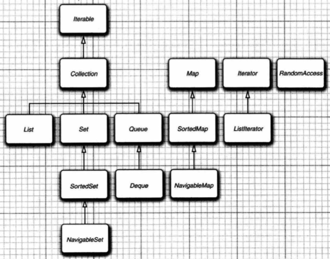
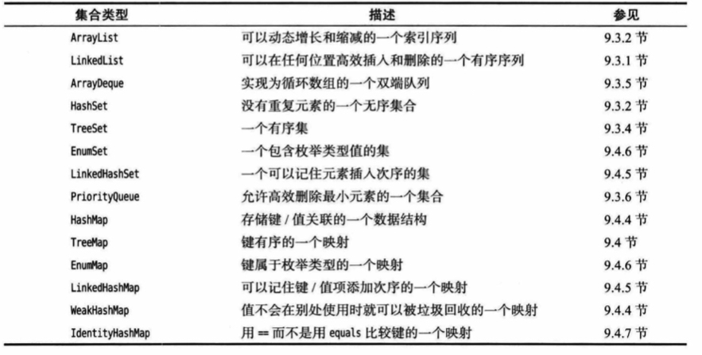
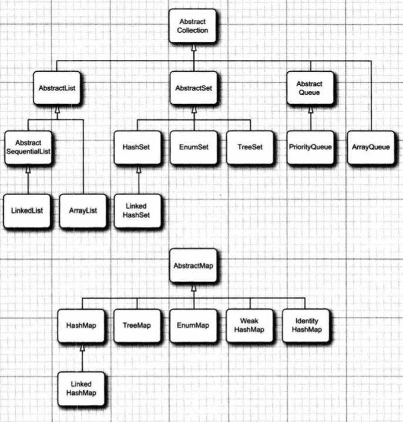
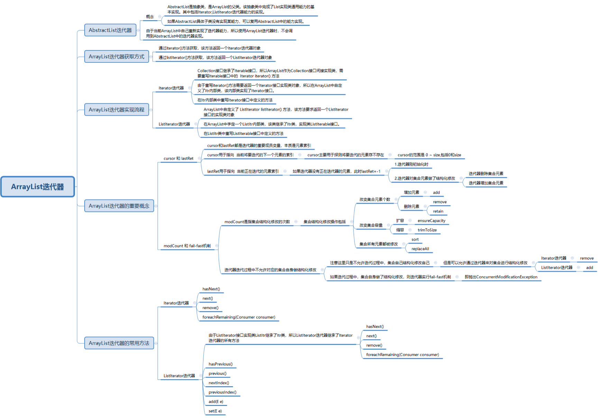
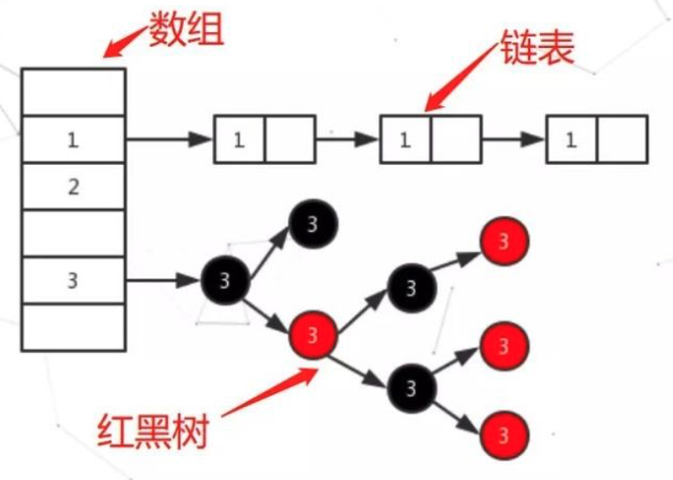
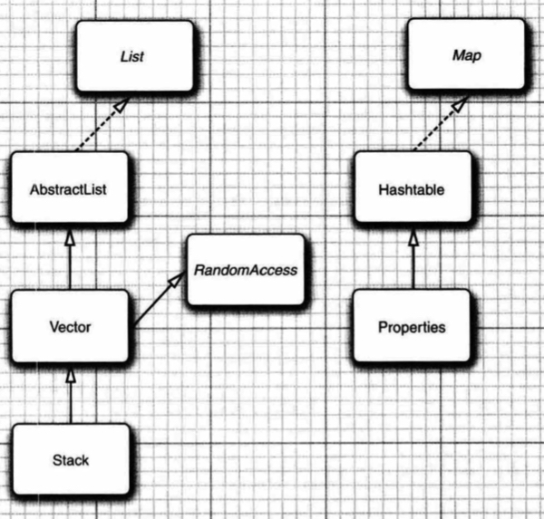

# 9.集合

[TOC]


本章将介绍如何利用Java类库帮助我们在程序设计中实现传统的数据结构。

## 9.1 Java集合框架

Java 最初的版本只为最常用的数据结构提供了很少的一组类。随着Java 1.2 的问世，设计人员感到是推出一组功能完善的数据结构的时候了。他们希望将传统的类融入新的框架中。与所有的集合类库设计者一样，他们必须做出 一些艰难的选择，于是，在这个过程中，他们做出了一些独具特色的设计决定。


### 9.1.1 集合接口与实现分离

与现代的数据结构类库的常见做法一样，Java集合类库也将接口(interface) 与实现 (implementation) 分离。下面利用我们熟悉的数据结构—队列(queue) 来说明是如何分离的。

队列接口指出可以在队列的尾部添加元素，在队列的头部删除元素，并且可以查找队列中元素的个数。当需要收集对象，并按照“先进先出“方式检索对象时就应该使用队列。

队列接口的最简形式可能类似下面这样：

```java
public interface Queue<E>
{
    void add(E element);
    E remove();
    int size();
}
```

这个接口并没有说明队列是如何实现的。队列通常有两种实现方式，一种是使用循环数组，另一种是使用链表。

当在程序中使用队列时，一旦已经构造了集合，就不需要知道究竟使用了哪种实现。因此，只有在构造集合对象时，才会使用具体的类。可以使用接口类型存放集合引用。

```java
Queue<Cutsomre> expresslane = new CircularArrayQueue<>(l00); 
expresslane.add(new Cutsomer("Harry"));
```

为什么选择这种实现，而不选择那种实现呢？接口本身并不能说明哪种实现的效率究竟如何。循环数组要比链表更高效，因此多数人优先选择循环数组。不过，通常来讲，这样做 也需要付出一定的代价。循环数组是一个有界集合，即容量有限。如果程序中要收集的对象数量没有上限，就最好使用链表来实现。

在研究 API 文档时，会发现另外一组名字以 Abstract开头的类，例如， AbstractOueue。这些类是为类库实现者而设计的。如果想要实现自己的队列类(也许不太可能)，会发现扩展AbstractQueue类要比实现Queue接口中的所有方法轻松的多。


### 9.1.2 Collection接口

在Java类库中，集合类的基本接口是Collection接口。

```java
public interface Collection<E> extends Iterable<E> {
    int size();

    boolean isEmpty();

    boolean contains(Object var1);

    Iterator<E> iterator();

    Object[] toArray();

    <T> T[] toArray(T[] var1);

    default <T> T[] toArray(IntFunction<T[]> generator) {
        return this.toArray((Object[])generator.apply(0));
    }

    boolean add(E var1);

    boolean remove(Object var1);

    boolean containsAll(Collection<?> var1);

    boolean addAll(Collection<? extends E> var1);

    boolean removeAll(Collection<?> var1);

    default boolean removeIf(Predicate<? super E> filter) {
        Objects.requireNonNull(filter);
        boolean removed = false;
        Iterator each = this.iterator();

        while(each.hasNext()) {
            if (filter.test(each.next())) {
                each.remove();
                removed = true;
            }
        }

        return removed;
    }

    boolean retainAll(Collection<?> var1);

    void clear();

    boolean equals(Object var1);

    int hashCode();

    default Spliterator<E> spliterator() {
        return Spliterators.spliterator(this, 0);
    }

    default Stream<E> stream() {
        return StreamSupport.stream(this.spliterator(), false);
    }

    default Stream<E> parallelStream() {
        return StreamSupport.stream(this.spliterator(), true);
    }
}
```

从这个接口的源代码可以看到，Collection是一个抽象程度很高的接口。它只定义了基本的size, isempty, contains, add(E), remove(Object)等方法。

例如，add 方法用于向集合中添加元素。如果添加元素确实改变了集合就返回 true；如果集合没有发生变化就返回 false。例如，如果试图向集（set）中添加一个对象，而这个对象在集中已经存在，这个 add 请求就没有实效，因为集合中不允许有重复的对象。

iterator方法用于返回一个实现了 Iterator接口的对象。可以使用这个迭代器对象依次访问集合中的元素。


### 9.1.3 迭代器

Iterator接口包含 4个方法:

```java
public interface Iterator<E>
{
    E next();
    boolean hasNext();
    void remove();
    default void forEachRemaining(Consumer<? super E> action);
}
```

通过反复调用 next方法，可以逐个访问集合中的每个元素。但是，如果到达了集合的末尾， next方法将抛出一个 NoSuchElementException。因此，需要在调用 next之前调用 hasNext方法。如果迭代器对象还有多个可以访问的元素，这个方法就返回true。如果想要查看集合中的所有元素，就请求一个迭代器，当 hasNext返回true时就反复地调用 next方法。例如:

```java
Collectione<String> c=...
Iterator<String> iter = c.iterator();
while (iter.hasNext())
{
	String element = iter.next();
	//do something with element  
}
```

或者使用for each循环，编译器简单地将for each循环转换为带有迭代器的循环。

```java
for(String element : c)
{
    // do something with element
}
```

for each循环可以处理任何实现了Iterable接口的对象，这个接口只包含一个抽象的方法：

```java
public interface Iterable<E>
{
    Iterator<E> iterator();
}
```

Collection 接口扩展了Iterable 接口。因此，对于标准类库中的任何集合都可以使用for each循环。

也可以不写循环，而是调用forEachRemaining方法并提供一个 lambda 表达式(它会处理一个元素)。将对迭代器的每一个元素调用这个 lambda 表达式，直到再没有元素为止。

```java
iterator.forEachRemaining(element-> do something with element);
```

访问元素的顺序取决于集合类型。如果迭代处理一个 Arraylist,迭代器将从索引 0 开始， 每迭代一次，索引值加 1。不过，如果访问 HashSet中的元素，会按照一种基本上随机的顺序 获得元素。虽然可以确保在迭代过程中能够遍历到集合中的所有元素，但是无法预知访问各 元素的顺序。这通常并不是什么问题，因为对于计算总和或统计匹配之类的计算，顺序并不 重要。

Java集合类库中的迭代器与其他类库中的迭代器在概念上有着重要的区别。在传统的集 合类库中，例如， C++的标准模板库，迭代器是根据数组索引建模的。如果给定这样一个迭 代器，可以查找存储在指定位置上的元素，就像如果知道数组索引i,就可以查找数组元素 a[i]。不需要查找元素，也可以将迭代器向前移动一个位置。这与不需要执行查找操作而通 过调用i++将数组索引向前移动一样。但是，Java迭代器并不是这样处理的。查找操作与位 置变更紧密耦合。查找一个元素的唯一方法是调用 next,而在执行查找操作的同时，迭代器的位置就会随之向前移动。

可以认为Java迭代器位于两个元素之间。当调用next时，迭代器就越过下一个元素，并返回刚刚越过的元素的引用。

Iterator接口的 remove方法将会删除上次调用 next方法时返回的元素。在大多数情况下，这是有道理的，在决定删除某个元素之前应该先看一下这个元素。不过，如果想要删除指定位置上的元素，仍然需要越过这个元素。例如删除字符串集合的第一个元素：

```java
Iterator<String> it = c.iterator();
it.next();
it.remove();
```

更重要的是， next方法和 remove方法调用之间存在依赖性。如果调用 remove之前没有调用 next，将是不合法的。如果这样做，将会抛出一个 IllegalStateException 异常。

如果想删除两个相邻的元素，也不能直接连续调用两次remove，必须在每次调用remove之前使用next越过将要删除的元素。


### 9.1.4 泛型实用方法

由千 Collection与Iterator都是泛型接口，这意味着你可以编写处理任何集合类型的实用方法。例如，下面是一个检测任意集合是否包含指定元素的泛型方法：

```java
public static <E> boolean contains(Collection<E> c, Object obj)
{
    for( E element :c )
        if(element.equals(obj))
            return true;
    return false;
}
```

Java类库的设计者认为这些实用方法中有一些非常有用，应该将它们提供给用户使用。这样，类库的使用者就不必自己重新构建这些方法了。 contains 就是这样一个实用方法。事实上， Collection 接口声明了很多有用的方法，所有的实现类都必须提供这些方法，本节最后列出其中的一部分。

当然，如果实现 Collection接口的每一个类都要提供如此多的实用方法，这将是一件很烦人的事情。为了能够让实现者更容易地实现这个接口，Java类库提供了一个类 AbstractCollection, 它保持基础方法 size和iterator仍为抽象方法，但是为实现者实现了其他实用方法。这样一来，具体集合类可以扩展AbstractCollection类，且 contains等方法巳由 AbstractCollection超类提供。不过，如果子类有更加高效的方式 实现 contains 方法，也完全可以由子类提供 contains 方法。

```java
pubLic abstract class AbstractCollection<E> implements Collectione<E>
{
	...
    public abstract Iterator<E> iterator();

	public boolean contains(Object obj)
    {
        for (E element : this) // calls iterator()
			if (element.equals(obj))
				return true;
		return false;    
    }
	...
}

```

这种做法现在有些过时了，现在的做法最好是 Collection接口提供默认方法。

```java
// java.util.Collection<E>

Iterator<E> iterator()
//返回一个用于访问集合中各个元素的迭代器。

int size()
//返回当前存储在集合中的元素个数。

boolean isEmpty()
//如果集合中没有元素，返回 true。

boolean contains(Object obj)
//如果集合中包含了一个与 obj 相等的对象，返回 true。

boolean containsALL(Collection<?> other)
//如果这个集合包含 other 集合中的所有元素，返回 true。

boolean add (E element)
//将一个元素添加到集合中。如果由于这个调用改变了集合，返回 true。

boolean addAll(Collection<? extends E> other)
//将 other 集合中的所有元素添加到这个集合。如果由于这个调用改变了集合，返回 true。

boolean remove (Object obj)
//从这个集合中删除等于 obj的对象。如果有匹配的对象被删除，返回 true。

boolean removeAll (Collection<?> other)
//从这个集合中删除 other 集合中存在的所有元素。如果由于这个调用改变了集合，返回 true。

default boolean removeIf(Predicate<? super E> filter)
//从这个集合删除 filter返回 true 的所有元素。如果由于这个调用改变了集合，则返回 true。

void clear()
//从这个集合中删除所有的元素。

boolean retainAll(Collection<?> other)
//从这个集合中删除所有与 other 集合中元素不同的元素。如果由于这个调用改变了集合，返回 true。

Object[] toArray()
//返回这个集合中的对象的数组。

<T> T[] toArray(T[] arrayToFill)
//返回这个集合中的对象的数组。如果 arrayToFill 足够大，就将集合中的元素填入这个数组中。剩余空间填补 null；否则，分配一个新数组，其成员类型与 arrayToFill 的成员类型相同，其长度等于集合的大小， 并填充集合元素。
```


## 9.2 集合框架中的接口

Java集合框架为不同类型的集合定义了大量接口。



集合有两个基本接口: Collection 和 Map。我们已经看到，可以用以下方法在集合中插入元素：

```java
boolean add(E element)
```

不过，由于映射包含键值对，所以要用put方法插入：

```java
V put(K key, V value)
```

要从集合读取元素，可以用迭代器访问元素。不过，从映射中读取值则要使用get方法：

```java
V get(K key)
```

List是一个**有序集合** (ordered collection)。元素会增加到容器中的特定位置。可以采用两种方式访问元素：使用迭代器访问，或者使用一个整数索引来访问。后面这种方法称为**随机访问**( random access)， 因为这样可以按任意顺序访问元素。与之不同，使用迭代器访问时，必须顺序地访问元素。

List接口定义了多个用于随机访问的方法：

```java
void add(int index, E element)
void remove(int index)
E get(int index)
E set(int index, E element)
```

Listlterator接口是 Iterator 的一个子接口。它比Iterator接口多定义了如下的方法：

```java
boolean hasPrevious()
E previous()
int previousIndex()
int nextIndex()
void set(E element)
void add(E element)
```

坦率地讲，集合框架的这个方面设计得很不好。实际上有两种有序集合，其性能开销有很大差异。由数组支持的有序集合可以快速地随机访问，因此适合使用 List方法并提供一个整数索引来访问。与之不同，链表尽管也是有序的，但是随机访问很慢，所以最好使用迭代器来遍历。

>为了避免对链表完成随机访问操作，Java 1.4 引入了一个标记接口 RandomAccess。 这个接口不包含任何方法，不过可以用它来测试一个特定的集合是否支持高效的随机访问：
>
>```java
>if( c instanceof RandomAccess)
>{
>    //use random access algorithm
>}
>else
>{
>    //use sequential access algorithm
>}
>```

Set接口等同于Collection接口，不过其方法的行为有更严谨的定义。集 (set)的add方法不允许增加重复的元素。要适当地定义集的 equals方法：只要两个集包含同样的元素就认 为它们是相等的，而不要求这些元素有同样的顺序。 hashCode 方法要保证包含相同元素的两个set会得到相同的散列码。

既然方法签名是一样的，为什么还要建立一个单独的接口呢？从概念上讲，并不是所有集合（Collection）都是集（Set）。建立一个 Set 接口可以允许程序员编写只接受集的方法。

Sortedset 和 SortedMap 接口会提供用于排序的比较器对象，这两个接口定义了可以得到集合子集视图的方法。有关内容将在9.5 节讨论。


## 9.3 具体集合

下表展示了Java类库中的集合，并简要描述了每个集合类的用途(为简单起见，省略了将在第 12 章中介绍的线程安全集合)。在表中，除了以 Map结尾的类之外，其他类都实现了 Collection接口，而以 Map结尾的类实现了 Map接口。集合框架中的类如下图所示。





>勘误，上图最右侧为ArrayDeque，而不是ArrayQueue。


### 9.3.1 链表 LinkedList

前文已经有很多示例使用过数组和ArrayList了，但他们都有一个重大缺陷，那就是从数组中间删除或增加一个元素，需要O(n)的时间复杂度。链表（linked list）解决了这个问题。数组是在连续的存储位置上存放对象引用，而链表则是将每个对象存放在单独的链接中。每个链接还存放着序列中下一个链接的引用。在Java 中，所有链表实际上都是双向链接的 (doubly linked)，每个链接还存放着其前驱的引用。Java提供了LinkedList类完成链表的功能。

链表是一个有序集合，add方法将对象添加到链表的尾部。要将元素添加到链表的中间位置，需要使用迭代器的add方法。这与下一节要讨论的set不同，它的元素是无序的，因此它的迭代器没有add方法。

实际上，集合类库提供了一个子接口ListIterator，其中包含add方法：

```java
interface ListIterator<E> extends Iterator<E>
{
    void add(E element);
    ...
}
```

与 Collection.add不同，这个方法不返回 boolean类型的值，它假定 add操作总会改变链表。

另外， ListIterator 接口有两个方法可以用来反向遍历链表。

```java
E previous()
boolean hasPrevious()
```

LinkedList类的listIterator方法返回一个实现了 ListIterator接口的迭代器对象。

```java
ListIterator<String> iter = staff.listIterator();
```

add 方法在迭代器位置之前添加一个新对象。例如，下面的代码将越过链表中的第一个元素，在第二个元素之前添加"Juliet"。

```java
LinkedList<String> staff = new LinkedList<>();
staff.add("Amy");
staff.add("Bob");
staff.add("Carl");
ListIterator<String> iter = staff.listIterator();
iter.next();
iter.add("Juliet");
```

当用一个刚由listlterator方法返回并指向链表表头的迭代器调用 add 操作时，新添加的元素将变成列表的新表头。当迭代器越过链表的最后一个元素（(即 hasNext返回false）, 添加的元素将成为列表的新表尾。如果链表有 n 个元素，会有 n + 1 个位置可以添加新元素。

当调用remove操作时，将删除迭代器最后一次越过的元素。如果迭代器最后一次移动是使用了next，那么移除迭代器左侧的元素，如果最后一次移动是使用了previous，那么移除迭代器右侧的元素。也正因此，不能连续两次调用remove，因为第一次remove后，迭代器已经没有最后一次越过元素的记录了。

set方法同理，将最后一次移动越过的元素修改为一个新元素。例如如下代码将替换链表的第一个元素：

```java
ListIterator<String> iter = list.listIterator();
String oldValue = iter.next();
iter.set(newValue);
```

> 链表形式上有两种迭代器，分别是iterator()方法和listIterator()返回的对象。第一种iterator方法在LinkedList中并没有实现，因此实际上调用的是直接超类AbstractSequentialList中定义的iterator()方法，而这个方法是调用this.listIterator()，由于多态机制的存在，最终返回了与直接在LinkedList上调用listIterator方法同样的对象。但有一个区别，iterator()方法定义的源头是超类实现的Colletion接口继承的Iterable接口，该接口没有previous等方法，因此即使在LinkedList上调用iterator()实际上返回了listIterator，但它的类型依旧是Iterator，只能使用Iterator变量引用返回值，且无法使用listIterator特有的方法。
>
> 第二种迭代器来自LinkedList继承的超类AbstractList的listIterator()方法，它调用了this.listIterator(int) 方法，由于LinkedList重写了带int参数的listIterator方法，因此最后调用了LinkedList实现的listIterator(int)，它返回了LinkedList的内部类ListItr的实例对象。那么为什么LinkedList和超类AbstractList都不约而同有一个listIterator方法呢？原因是它们都实现了List接口，而listIterator方法最初就是定义在List接口中。
>
> 总结一下，iterator方法定义在Iterable接口中，Collection接口继承了Iterable接口，因此所有Collection类型的对象都有iterator方法。而listIterator方法定义在List接口中，所有List类型的对象都有listIterator方法，典型的包括抽象类AbstractList，AbstractSequentialList，实例类LinkedList，ArrayList。

可以想象，如果在某个迭代器修改集合时，另一个迭代器却在遍历这个集合，那么一定会出现混乱。链表迭代器设计为可以检测到这种修改，如果一个迭代器发现它的集合被另一个迭代器修改了，或是被某个方法修改了，就会抛出一个ConcurrentModificationException异常。例如下面的代码，由于iter2检测出这个链表从外部修改了，所以对iter2.next的调用抛出一个 ConcurrentModificationException 异常。

```java
ListIterator<String> iter1 = list.listIterator();
ListIterator<String> iter2 = list.listIterator();
iter1.next();
iter1.remove();
iter2.next(); // throws ConcurrentModificationException
```

一种简单的检测并发修改的方法是，集合可以跟踪更改操作（诸如添加或删除元素）的次数。每个迭代器都会为它负责的更改操作维护一个单独的更改操作数。在每个迭代器方 法的开始处，迭代器会检查它自己的更改操作数是否与集合的更改操作数相等。如果不一致，就抛出一个 ConcurrentModificationException 异常。

>注意，这里的并发修改检测是指对列表结构性的修改，例如添加和删除节点。set方法不视为结构性修改。

在 9.2 节已经看到， Collection 接口还声明了操作链表的很多其他有用的方法。其中大部分方法都是在 LinkedList类的超类 AbstractCollection 中实现的，例如toString，contains方法等。

链表不支持快速随机访问。如果要查看链表中的第 n 个元素，就必须从头开始，越过 n - 1 个元素。没有捷径可走。 鉴于这个原因，需要按整数索引访问元素时，程序员通常不选用链表。

不过，LinkedList类还是提供了一个用来访问第n个元素的get方法。当然这个方法的效率是O(n)，通常我们非常不建议使用这个虚假的随机访问方法。

```java
LinkedList<String> list = ...;
String obj = list.get(n);
```

>注释：get方法做了一个微小的优化，如果索引大于等于size()/2，就从链表尾端开始搜索元素，但这并没用什么用，没有改变O(n)的时间复杂度。

链表迭代器接口还有一个方法，可以告诉你当前位置的索引。实际上，由于Java迭代器指向两个元素之间的位置，所以可以有两个索引：nextlndex方法返回下一次调用 next方法时所返回元素的整数索引；previousIndex方法返回下一次调用previous方法时所返回元素的整数索引。当然，这个索引只比 nextlndex返回的索引值小一。这两个方法的效率非常高，因为迭代器保持着当前位置的计数值。

最后需要说明一点，如果有一个整数索引 n，那么`list.listlterator(n)` 将返回一个迭代器，这个迭代器指向索引为 n 的元素前面的位置。当然，这里listIterator也是通过从链表头或者链表尾遍历链表来将迭代器移动到指定位置的。

```java
// java.util.List<E>

ListIterator<E> ListIterator()
//返回一个链表送代器，用来访问列表中的元素。

ListIterator<E> ListIterator(int index)
//返回一个链表迭代器，用来访问列表中的元素，第一次调用这个迭代器的 next 会返回给定索引的元素。

void add(E element)
//在链表末尾添加一个元素
    
void add(int i, E element)
//在给定位置添加一个元素。链表可以存储多个null，LinkedList和ArrayList都可以实现。

void addAll(int i, Collection<? extends E> elements)
//将一个集合中的所有元素添加到给定位置。

E remove(int i)
//删除并返回给定位置的元素。

E get(int i)
//获取给定位置的元素。对于LinkedList来说复杂度是O(n)。

E set(int i, E element)
//用一个新元素替换给定位置的元素，并返回原来那个元素。对于LinkedList来说复杂度是O(n)。

int indexOf (Object element)
//返回与指定元素相等的元素在列表中第一次出现的位置，如果没有这样的元素将返回-1。对于LinkedList来说复杂度是O(n)。

int lastIndexOf(Object element)
//返回与指定元素相等的元素在列表中最后一次出现的位置，如果没有这样的元素将返回-1。对于LinkedList来说复杂度是O(n)。
    
    
// java.util.ListIterator<E>
    
void add(E newElement)
//在当前位置前添加一个元素。

void set(E newELement)
//用新元素替换 next 或 previous 访问的上一个元素。如果在上一个 next 或 previous 调用之后列表结构被修改了，将抛出一个 TllegalStateException 异常。

boolean hasPrevious()
//当反向迭代列表时，如果还有可以访问的元素，返回 true。

E previous()
//返回前一个对象。如果已经到达了列表的头部，就抛出一个 NoSuchELementException异常。

int nextIndex()
//返回下一次调用 next 方法时将返回的元素的索引。

int previousIndex()
//返回下一次调用 previous 方法时将返回的元素的素引。
    
    
// java.util.LinkedList<E>
    
LinkedList()
//构造一个空链表。

LinkedList (Collection<? extends E> elements)
//构造一个链表，并将集合中所有的元素添加到这个链表中。
//除了实现了List接口中定义的方法，还实现了Deque接口，后文会介绍该接口。
```


### 9.3.2 数组列表 ArrayList

List接口用于描述一个有序集合，并且集合中每个元素的位置很重要。有两种访问元素的协议：一种是通过迭代器，另一种是通过get和set方法随机地访问每个元素。上一节介绍的链表LinkedList是采用迭代器的类。集合类库为另一种方法提供了一种大家熟悉的 Arraylist类，这个类也实现了 List 接口。Arraylist封装了一个动态再分配的对象数组。

>注释：对于一个经验丰富的 Java 程序员来说，在需要动态数组时，可能会使用 Vector类。那么什么时候使用Vector，什么时候使用ArrayList呢？Vector 类的所有方法都是同步的，可以安全地从两个线程访问一个 Vector 对象。但是，如果只从一个线程访问 Vector(这种情沉更为常见)，代码就会在同步操作上白白浪费大量的时问。而与之不同，ArrayLst 方法不是同步的，因此，建议在不需要同步时使用 ArrayList，需要同步时使用 Vector。

ArrayList提供了三个构造函数来对elementData数组初始化：

```java
//无参构造函数，先设置为一个大小为0的数组，添加元素时再扩大
public ArrayList() 
{
        this.elementData = DEFAULTCAPACITY_EMPTY_ELEMENTDATA;
}

//指定容量的构造函数，直接初始化数组为指定的大小
public ArrayList(int initialCapacity) 
{
    if (initialCapacity > 0) 
    {
    	this.elementData = new Object[initialCapacity];
    } else {
     	if (initialCapacity != 0) {
        	throw new IllegalArgumentException("Illegal Capacity: " + initialCapacity);
    	}

    	this.elementData = EMPTY_ELEMENTDATA;
    }
}

//带有一个集合参数的构造函数，把指定集合中的数据通过Arrays.copyOf拷贝到elementData中，容量和指定集合容量相同
public ArrayList(Collection<? extends E> c) 
{
    Object[] a = c.toArray();
    if ((this.size = a.length) != 0) {
        if (c.getClass() == ArrayList.class) {
            this.elementData = a;
        } else {
            this.elementData = Arrays.copyOf(a, this.size, Object[].class);
        }
    } else {
        this.elementData = EMPTY_ELEMENTDATA;
    }
}
```

由于ArrayList是基于数组实现的，因此添加元素时它使用`ensureCapacityInternal`方法保证容量足够。容量不够时使用`grow`方法扩容。新容量的默认大小为`oldCapacity + (oldCapacity>>1)`	，也就是旧容量的1.5倍，如果还不够大会继续扩容。由于扩容后需要调用`Arrays.copyOf`将原数组复制到新数组中，这个操作的复杂度为O(n)。

当我们调用remove(index)时，将调用内部的fastRemove方法，把index之后的元素全部向前移动一个位置，最后一个位置置空。当调用remove(Object)时，将先遍历数组查找它，然后再调用fastRemove。

由于ArrayList也是AbstractList的子类（实现了List接口），它也拥有iterator和listIterator两种迭代器。但是与LinkedList不同的是，它将这两种方法均重写了。ArrayList有两个内部类Itr和ListItr，两种迭代器方法分别返回他们的一个实例对象。下图对ArrayList的迭代器进行了总结，来源https://blog.csdn.net/qfc_128220/article/details/115184215。



**疑问待解决：关于ArrayList的迭代器类实现，为什么要写两个内部类Itr和ListItr，为什么不像LinkedList那样调用iterator时直接返回一个ListItr？**

这里重点讲解ArrayList.Itr的remove操作。该方法首先会检查lastRet是否为-1，如果是表明迭代器没有越过任何元素或者刚刚已经调用过remove，不能连续两次调用，因此会抛出IllegalStateException。在lastRet>=0的情况下，先检查checkForComodification，然后调用外部类的remove方法ArrayList.this.remove(this.lastRet)，删除刚跃过的元素。因为被删元素之后的元素都向前移动了一个位置，因此要执行`this.cursor = this.lastRet;`将cursor退回一个位置，并执行`this.lastRet = -1;`将remove置为不可执行状态。

同理，ListItr的add方法也调用了ArrayList.add(int，E)，故也调整了cursor和lastRet。

由于ArrayList类的元素是线性存储的，所以它实现了 RandomAccess接口。具体的随机访问函数，则是实现了List接口中声明的方法。

```java
public class ArrayList<E> extends AbstractList<E>
        implements List<E>, RandomAccess, Cloneable, java.io.Serializable
```


### 9.3.3 散列集

#### 9.3.3.1 Set

链表和数组允许你根据意愿指定元素的次序。但是，如果想要查看某个指定的元素，却又不记得它的位置，就需要访问所有元素，直到找到为止。如果不在意元素的位置，那么可以使用Java类库提供的散列集Set。它可以快速查找元素，具体元素存储位置由数据结构自己组织。Java类库中的Set接口直接继承Collection，除了一些用于构造Set的Of方法，它没有声明新的特有方法（因为List引入了元素之间的顺序，所以许多方法都多了索引参数）。

```java
// java.util.Set<E>
public interface Set<E> extends Collection<E> {
    int size();

    boolean isEmpty();

    boolean contains(Object var1);

    Iterator<E> iterator();

    Object[] toArray();

    <T> T[] toArray(T[] var1);

    boolean add(E var1);

    boolean remove(Object var1);

    boolean containsAll(Collection<?> var1);

    boolean addAll(Collection<? extends E> var1);

    boolean retainAll(Collection<?> var1);

    boolean removeAll(Collection<?> var1);

    void clear();

    boolean equals(Object var1);

    int hashCode();

    default Spliterator<E> spliterator() {
        return Spliterators.spliterator(this, 1);
    }
}
```

#### 9.3.3.2 HashSet

散列表（hash table）是一种众所周知的数据结构。它为每个对象计算一个整数，称为散列码（hash code）。散列码是由对象的实例字段计算得出的，通常通过调用类的hashCode方法得到。

如果我们定义自己的类，就要负责实现自己的 hashCode方法。这个方法应该与 equals方法兼容，即如果 a.equals(b) 为true，那么 a与 b 必须有相同的散列码。

在Java 中，散列表用链表数组实现。每个列表被称为桶 （bucket）。要想查找表中对象的位置，就要先计算它的散列码，然后与桶的总数取余，所得到的结果就是保存这个元素的桶的索引。当桶中已经有对象时，称为发生了散列冲突（hash collision）。这时将新对象与桶中所有对象逐一比较，即可知道该对象是否已经存在。

如果大致知道最终会有多少个元素要插入到散列表中，就可以设置桶数。通常，将桶数 设置为预计元素个数的 75%~150%。标准类库使用的桶数是 2 的幕，默认值为 16。当然，并不总是能够知道需要存储多少个元素，也有可能最初的估计过低。如果散列表太满，就需要再散列 （rehash）。装填因子 (load factor）可以确定何时对散列表进行再散列。例如，如果装填因子为 0.75，说明表中已经填满了75%以上。

Java集合类库提供了一个 HashSet类，它实现了基于散列表的集。可以用 add方法添加元素。contains 方法已经被重新定义，用来快速查找某个元素是否已经在集中。它只查看一个桶中的元素，而不必查看集合中的所有元素。

散列集迭代器将依次访问所有的桶。由于散列将元素分散在表中，所以会以一种看起来随机的顺序访问元素。只有不关心集合中元素的顺序时才应该使用 HashSet。

总结一下：

+ HashSet内部使用HashMap的key存储元素，以此来保证元素不重复；
+ HashSet是无序的，因为HashMap的key是无序的；
+ HashSet中允许有一个null元素，因为HashMap允许key为null；
+ HashSet是非线程安全的；
+ HashSet是没有get()方法的；

```java
// java.util.HashSet<E>
public class HashSet<E> extends AbstractSet<E> implements Set<E>, Cloneable, Serializable {
    static final long serialVersionUID = -5024744406713321676L;
    private transient HashMap<E, Object> map;
    // HashSet 內部使用HashMap来存储元素，因此本质上是HashMap
    private static final Object PRESENT = new Object();
	// 虚拟对象，用来作为value放到map中(在HashSet底层的HashMap中，Key为要存储的元素，Value统一为PRESENT)
    
    public HashSet() {
        this.map = new HashMap();
    }

    public HashSet(Collection<? extends E> c) {
        this.map = new HashMap(Math.max((int)((float)c.size() / 0.75F) + 1, 16));
        this.addAll(c);
    }

    public HashSet(int initialCapacity, float loadFactor) {
        this.map = new HashMap(initialCapacity, loadFactor);
    }

    public HashSet(int initialCapacity) {
        this.map = new HashMap(initialCapacity);
    }
	
	//注意：这里未用public修饰，主要是给LinkedHashSet使用的
    HashSet(int initialCapacity, float loadFactor, boolean dummy) {
        this.map = new LinkedHashMap(initialCapacity, loadFactor);
    }

    public Iterator<E> iterator() {
        return this.map.keySet().iterator();
    }

    public int size() {
        return this.map.size();
    }

    public boolean isEmpty() {
        return this.map.isEmpty();
    }

    //Set中没有get(）方法，不像List那样可以按index获取元素，但可以检查元素是否在Set中
    public boolean contains(Object o) {
        return this.map.containsKey(o);
    }

    public boolean add(E e) {
        return this.map.put(e, PRESENT) == null;
    }

    public boolean remove(Object o) {
        //注意：map的remove返回是删除元素的value，而Set的remove返回的是boolean类型
        return this.map.remove(o) == PRESENT;
    }

    public void clear() {
        this.map.clear();
    }

    public Object clone() {
        try {
            HashSet<E> newSet = (HashSet)super.clone();
            newSet.map = (HashMap)this.map.clone();
            return newSet;
        } catch (CloneNotSupportedException var2) {
            throw new InternalError(var2);
        }
    }

    private void writeObject(ObjectOutputStream s) throws IOException {
		...
    }

    private void readObject(ObjectInputStream s) throws IOException, ClassNotFoundException {
        ...
    }

    public Spliterator<E> spliterator() {
        return new KeySpliterator(this.map, 0, -1, 0, 0);
    }
}
```


### 9.3.4 树集

树集TreeSet类与散列集十分类似，不过，它比散列集有所改进。树集是一个有序集合（sorted collection）。可以以任意顺序将元素插入到集合中。在对集合进行遍历时，值将自动按照排序后的顺序呈现。

TreeSet与HashSet都是没有重复元素的集合，继承了AbstractSet类，但TreeSet是有序的，它实现了NavigableSet接口。NavigableSet称为可导航集，它继承了SortedSet接口，SortedSet接口又继承了Set接口。它的行为类似于SortedSet，除了SortedSet的排序机制之外，我们还有可用的导航方法。例如，NavigableSet接口可以以相反的顺序导航集合。可以按升序或降序访问和遍历NavigableSet。

#### 9.3.4.1 SortedSet

下面首先介绍SortedSet接口。Set本身不具备排序的功能，SortedSet接口提供了排序的操作。因此，SortedSet中的元素必须是可以比较的。实现类可以使用Comparator的compare方法比较，也可以用元素的自然顺序，即Comparable接口的compareTo来比较（**存疑：实际上如果两者都不提供，Java可能会按照其成员变量的大小来比较？**）。

```java
// java.util.SortedSet<E>
public interface SortedSet<E> extends Set<E> {
	
    //返回用于对该集合中的元素进行排序的比较器。如果元素用 Comparable 接口的 compareTo 方法进行比较则返回 null。
    Comparator<? super E> comparator();   
    
    //返回该集合的部分的视图，其元素的范围var1（包含）到 var2（不包含）
    SortedSet<E> subSet(E var1, E var2);
	
	//返回该集合的部分的视图，其元素严格小于var1。
    SortedSet<E> headSet(E var1);
	
	//返回该集合的部分的视图，其元素大于或等于var1。
    SortedSet<E> tailSet(E var1);
	
	//返回此集合中当前的第一个（最低，最小）元素。 
    E first();
	
	//返回此集合中当前的最后一个（最高，最大）元素。   
    E last();	

    default Spliterator<E> spliterator() {
        return new IteratorSpliterator<E>(this, 21) {
            public Comparator<? super E> getComparator() {
                return SortedSet.this.comparator();
            }
        };
    }
}
```

​	

#### 9.3.4.2 NavigableSet

NavigableSet接口继承了SortedSet接口，除了对SortedSet的方法进行了重载外，还增加了一些提供在集合元素之间导航的功能（可以理解为从一个元素寻找到另一个元素）。

```java
// java.util.NavigableSet<E>
public interface NavigableSet<E> extends SortedSet<E> {

    //返回小于指定元素的那些元素中最大的元素，如果没有符合要求的元素则返回null	
    E lower(E e);

    //返回小于或等于指定元素的那些元素中最大的元素    
    E floor(E e);
 	
    //返回大于或等于指定元素的那些元素中的最小元素
    E ceiling(E e);
    
	//返回大于指定元素的那些元素中的最小元素
    E higher(E e);

 	//返回并从集合中删除第一个元素
   	E pollFirst();
    
    //返回并从集合中删除最后一个元素
	E pollLast();
    
    //返回一个按照升序访问元素的迭代器。这里需要注意，SortedSet没有单独声明迭代器，因此它继承了Set接口的迭代器，而Set接口是不保证访问顺序的。
    Iterator<E> iterator();
	
    //返回一个NavigableSet，其中的元素被逆序排列
    NavigableSet<E> descendingSet();
    
    //返回一个逆序访问的迭代器
    Iterator<E> descendingIterator();
    
    //重载了SortedSet方法，boolean参数如果为true，表明结果中应包含fromElement/toElement，返回的是NavigableSet。如果不写boolean参数，那么返回的是SortedSet。
    NavigableSet<E> subSet(E fromElement, boolean fromInclusive,
                           E toElement,   boolean toInclusive);    
    NavigableSet<E> headSet(E toElement, boolean inclusive);
	NavigableSet<E> tailSet(E fromElement, boolean inclusive); 
     
    SortedSet<E> subSet(E fromElement, E toElement);
    SortedSet<E> headSet(E toElement);
    SortedSet<E> tailSet(E fromElement);
}
```


#### 9.3.4.3 TreeSet

TreeSet 是一个有序的集合，它的作用是提供有序的Set集合。它继承于AbstractSet抽象类，实现了NavigableSet, Cloneable, Serializable接口。TreeSet 继承于AbstractSet，所以它是一个Set集合，具有Set的属性和方法。TreeSet 实现了NavigableSet接口，意味着它支持一系列的导航方法。比如查找与指定目标最匹配的项。注意，虽然TreeSet是有序的，但TreeSet只能高效的找到距离某个元素最近的元素，要想直接访问集合中第k大的元素，只能通过迭代器顺序访问k次。

TreeSet实际上是用TreeMap实现的。当我们构造TreeSet时，若使用不带参数的构造函数，则TreeSet的使用自然比较器（即Comparable接口的compareTo方法），若用户需要使用自定义的比较器（Comparator接口的compare方法），则需要使用带比较器的参数。

```java
// java.util.TreeSet<E>
public class TreeSet<E> extends AbstractSet<E>
    implements NavigableSet<E>, Cloneable, java.io.Serializable
{
    private transient NavigableMap<E,Object> m;
   
    //NavigableMap的键是TreeSet的元素集合，值统一为PRESENT。    
	private static final Object PRESENT = new Object();

    TreeSet(NavigableMap<E,Object> m) {
        this.m = m;
    }

    //构造一个空树，按照自然排序，元素必须实现Comparable接口
    public TreeSet() {
        this(new TreeMap<E,Object>());
    }
    
	//构造一个空树，元素按照比较器comparator排序  
    public TreeSet(Comparator<? super E> comparator) {
        this(new TreeMap<>(comparator));
    }
    
	//构造一个空树，按照自然排序，并将c中元素全部插入
    public TreeSet(Collection<? extends E> c) {
        this();
        addAll(c);
    }

	//构造一个空树，采用与s相同的比较方式，并将s中的元素全部插入
    public TreeSet(SortedSet<E> s) {
        this(s.comparator());
        addAll(s);
    }

	//升序迭代器
    public Iterator<E> iterator() {
        return m.navigableKeySet().iterator();
    }

    //降序（逆序）迭代器
    public Iterator<E> descendingIterator() {
        return m.descendingKeySet().iterator();
    }

    //返回一个逆序的可导航集
    public NavigableSet<E> descendingSet() {
        return new TreeSet<>(m.descendingMap());
    }

    public int size() {
        return m.size();
    }

    public boolean isEmpty() {
        return m.isEmpty();
    }

	//这里注意包含的条件是存在一个e，(e和o均为null) 或者 (o.equals(e)为true)
    public boolean contains(Object o) {
        return m.containsKey(o);
    }

    //如果e不在集合则插入
    public boolean add(E e) {
        return m.put(e, PRESENT)==null;
    }

    public boolean remove(Object o) {
        return m.remove(o)==PRESENT;
    }

    public void clear() {
        m.clear();
    }

    public  boolean addAll(Collection<? extends E> c) {
        // Use linear-time version if applicable
        if (m.size()==0 && c.size() > 0 &&
            c instanceof SortedSet &&
            m instanceof TreeMap) {
            SortedSet<? extends E> set = (SortedSet<? extends E>) c;
            TreeMap<E,Object> map = (TreeMap<E, Object>) m;
            Comparator<?> cc = set.comparator();
            Comparator<? super E> mc = map.comparator();
            if (cc==mc || (cc != null && cc.equals(mc))) {
                map.addAllForTreeSet(set, PRESENT);
                return true;
            }
        }
        return super.addAll(c);
    }

    public NavigableSet<E> subSet(E fromElement, boolean fromInclusive,
                                  E toElement,   boolean toInclusive) {
        return new TreeSet<>(m.subMap(fromElement, fromInclusive,
                                       toElement,   toInclusive));
    }

    public NavigableSet<E> headSet(E toElement, boolean inclusive) {
        return new TreeSet<>(m.headMap(toElement, inclusive));
    }

    public NavigableSet<E> tailSet(E fromElement, boolean inclusive) {
        return new TreeSet<>(m.tailMap(fromElement, inclusive));
    }

    public SortedSet<E> subSet(E fromElement, E toElement) {
        return subSet(fromElement, true, toElement, false);
    }

    public SortedSet<E> headSet(E toElement) {
        return headSet(toElement, false);
    }

    public SortedSet<E> tailSet(E fromElement) {
        return tailSet(fromElement, true);
    }

    //返回比较元素使用的比较器，如果采用自然序则返回null
    public Comparator<? super E> comparator() {
        return m.comparator();
    }

    public E first() {
        return m.firstKey();
    }

    public E last() {
        return m.lastKey();
    }

    public E lower(E e) {
        return m.lowerKey(e);
    }

    public E floor(E e) {
        return m.floorKey(e);
    }

    public E ceiling(E e) {
        return m.ceilingKey(e);
    }

    public E higher(E e) {
        return m.higherKey(e);
    }

    public E pollFirst() {
        Map.Entry<E,?> e = m.pollFirstEntry();
        return (e == null) ? null : e.getKey();
    }

    public E pollLast() {
        Map.Entry<E,?> e = m.pollLastEntry();
        return (e == null) ? null : e.getKey();
    }

    @SuppressWarnings("unchecked")
    public Object clone() {
        TreeSet<E> clone;
        try {
            clone = (TreeSet<E>) super.clone();
        } catch (CloneNotSupportedException e) {
            throw new InternalError(e);
        }

        clone.m = new TreeMap<>(m);
        return clone;
    }
    
    private void writeObject(java.io.ObjectOutputStream s)
        throws java.io.IOException {
        // Write out any hidden stuff
        s.defaultWriteObject();

        // Write out Comparator
        s.writeObject(m.comparator());

        // Write out size
        s.writeInt(m.size());

        // Write out all elements in the proper order.
        for (E e : m.keySet())
            s.writeObject(e);
    }

    private void readObject(java.io.ObjectInputStream s)
        throws java.io.IOException, ClassNotFoundException {
        // Read in any hidden stuff
        s.defaultReadObject();

        // Read in Comparator
        @SuppressWarnings("unchecked")
            Comparator<? super E> c = (Comparator<? super E>) s.readObject();

        // Create backing TreeMap
        TreeMap<E,Object> tm = new TreeMap<>(c);
        m = tm;

        // Read in size
        int size = s.readInt();

        tm.readTreeSet(size, s, PRESENT);
    }

    public Spliterator<E> spliterator() {
        return TreeMap.keySpliteratorFor(m);
    }

    private static final long serialVersionUID = -2479143000061671589L;
}
```

总结一下HashSet和TreeSet的区别：

1. HashSet基于HashMap实现，无序集合
    TreeSet基于TreeMap实现，有序集合
2. HashSet可以存放一个null
    TreeSet不可以存放null
3. HashSet区分元素使用HashCode和equals方法
    TreeSet比较元素使用compareTo或compare方法
4. HashSet的add，remove，contains方法的时间复杂度是O(1)
    TreeSet的add，remove，contains方法的时间复杂度是O(logn)


### 9.3.5 队列与双端队列

#### 9.3.5.1 Queue

Java类库的 Queue 接口继承了 Collection 接口， 用于保存将要按FIFO(先进先出)顺序处理的元素。它是一个有序的对象列表，其用途仅限于在列表末尾插入元素和从列表开头删除元素，遵循先进先出原则。它支持有容量限制和无容量限制的队列，分别对应一组方法，有容量限制的通常在操作失败时返回null或false，无容量限制的通常在操作失败时抛出异常。

```java
// java.util.Queue<E>
public interface Queue<E> extends Collection<E> {

    //add和offer都是向队列尾部增加元素。区别在于add是继承Collection的方法，如果队列有大小限制且已经满载，add方法将抛出异常，而offer方法会返回false。
    boolean add(E e);
    boolean offer(E e);

    //remove和poll都是弹出队列头部的元素。区别在于如果队列为空， 那么remove方法将抛出异常，poll方法会返回null。注意，这里的remove不是继承Collection的方法，Collection只有带参数Object的remove。
    E remove();
    E poll();

	//获取但不弹出队列头部元素。区别在于当队列为空时，element抛出异常，peek返回null。
    E element();
    E peek();
}
```


#### 9.3.5.2 Deque

我们知道，Queue是队列，只能队列尾进，队列头出。

如果把条件放松一下，允许两头都进，两头都出，这种队列叫双端队列（Double Ended Queue），即Deque。Java集合提供了接口Deque，支持有容量限制和无容量限制的两种双端队列。它的功能是：既可以添加到队尾，也可以添加到队首；既可以从队首获取，又可以从队尾获取。

```java
// java.util.Deque<E>
public interface Deque<E> extends Queue<E> {
	
    //在队列头部插入一个元素，失败时抛出异常。
    void addFirst(E e);
    //在队列尾部插入一个元素，失败时抛出异常。
    void addLast(E e);
    //返回并弹出头部元素，队列为空时抛出异常。
    E removeFirst();
    //返回并弹出尾部元素，队列为空时抛出异常。
    E removeLast();
    //返回但不弹出头部元素，队列为空时抛出异常。
    E getFirst();
	//返回但不弹出尾部元素，队列为空时抛出异常
    E getLast();
    
    //在队列头部插入一个元素，失败时返回false。
	boolean offerFirst(E e);   
	//在队列尾部插入一个元素，失败时返回false。
    boolean offerLast(E e);
    //返回并弹出头部元素，队列为空时返回null。
    E pollFirst();   
    //返回并弹出尾部元素，队列为空时返回null。
    E pollLast();
    //返回但不弹出头部元素，队列为空时返回null。
    E peekFirst();
    //返回但不弹出尾部元素，队列为空时返回null。
    E peekLast();

    //删除队列中第一个与o相等的对象，如果存在，返回true。
    boolean removeFirstOccurrence(Object o);

    //删除队列中最后一个与o相等的对象，如果存在，返回true。
    boolean removeLastOccurrence(Object o);

   
    // *** Queue methods ***
    boolean add(E e);
    boolean offer(E e);
    E remove();
    E poll();
    E element();
    E peek();


    // *** Stack methods ***
    //栈顶（队列头）插入元素，失败则抛出异常。该方法与addFirst相同。
    void push(E e);
    //弹出栈顶（队列头，失败则抛出异常。该方法与removeFirst相同。
    E pop();


    // *** Collection methods ***
 	//与removeFirstOccurrence(Object)相同。
    boolean remove(Object o);
    boolean contains(Object o);
    public int size();
    Iterator<E> iterator();
    Iterator<E> descendingIterator();
}
```


#### 9.3.5.3 ArrayDeque

Deque接口有许多实现类，常见的有LinkedList，ArrayDeque。

LinkedList已经在讲解List接口时介绍过，毕竟它主要的特征和功能还是链表，只是可以作为双端队列使用。

ArrayDeque是JDK对双端队列的线性实现，具有如下特点：

+ 它直接继承自AbstractCollection，没有继承AbstractQueue

    >关于为什么ArrayDeque没有从AbstractQueue继承，而是直接继承了AbstractCollection，查阅到的资料猜测，设计者可能并不想把ArrayDeque仅仅用作一个双端队列。ArrayList与ArrayDeque在实现上非常相似，他们都具备同时实现List和Queue接口的能力，只不过后者牺牲了随机访问，加入了循环存储机制。因此，如果有一天需要一个既实现List又实现Queue的接口，或许可以从ArrayDeque处继承而来。

+ 实现了Deque，Cloneable，Serializeable接口

+ 没有容量限制

+ 非线程安全，无同步策略

+ 不能存储null（这与LinkedList作为双端队列不同），原因是 ArrayDeque 需要根据某个位置是否为 NULL 来判断元素的存在。

+ 具有fail-fast特征

    >**fail-fast 机制是**Java集合(Collection)中的一种错误机制。当多个线程对同一个集合的内容进行操作时，就可能会产生fail-fast事件。例如：当某一个线程A通过iterator去遍历某集合的过程中，若该集合的内容被其他线程所改变了；那么线程A访问集合时，就会抛出ConcurrentModificationException异常，产生fail-fast事件。需要注意的是，当方法检测到对象的并发修改，单线程也可能会抛出异常。

+ 支持双向迭代器遍历

```java
// java.util.ArrayDeque
public class ArrayDeque<E> extends AbstractCollection<E>
                           implements Deque<E>, Cloneable, Serializable
{
    //该数组用于存储队列元素，且是大小总是2的幂次方。这个数组不会满容量，会在add方法中扩容，使得头head和tail不会缠绕在一起
    transient Object[] elements; // non-private to simplify nested class access

    //双端队列的头位置
    transient int head;

    //双端队列的尾位置
    transient int tail;

	//最小的初始化容量
    private static final int MIN_INITIAL_CAPACITY = 8;

    // ******  Array allocation and resizing utilities ******

    private static int calculateSize(int numElements) {
        int initialCapacity = MIN_INITIAL_CAPACITY;
        // Find the best power of two to hold elements.
        // Tests "<=" because arrays aren't kept full.
        if (numElements >= initialCapacity) {
            initialCapacity = numElements;
            initialCapacity |= (initialCapacity >>>  1);
            initialCapacity |= (initialCapacity >>>  2);
            initialCapacity |= (initialCapacity >>>  4);
            initialCapacity |= (initialCapacity >>>  8);
            initialCapacity |= (initialCapacity >>> 16);
            initialCapacity++;

            if (initialCapacity < 0)   // Too many elements, must back off
                initialCapacity >>>= 1;// Good luck allocating 2 ^ 30 elements
        }
        return initialCapacity;
    }

    //为numElements个元素分配足够大的存储空间
    private void allocateElements(int numElements) {
        elements = new Object[calculateSize(numElements)];
    }

    //使队列的容量倍增
    private void doubleCapacity() {
        assert head == tail;
        int p = head;
        int n = elements.length;
        int r = n - p; // number of elements to the right of p
        int newCapacity = n << 1;
        if (newCapacity < 0)
            throw new IllegalStateException("Sorry, deque too big");
        Object[] a = new Object[newCapacity];
        System.arraycopy(elements, p, a, 0, r);
        System.arraycopy(elements, 0, a, r, p);
        elements = a;
        head = 0;
        tail = n;
    }
	
    //将队列中的元素复制到数组a中
    private <T> T[] copyElements(T[] a) {
        if (head < tail) {
            System.arraycopy(elements, head, a, 0, size());
        } else if (head > tail) {
            int headPortionLen = elements.length - head;
            System.arraycopy(elements, head, a, 0, headPortionLen);
            System.arraycopy(elements, 0, a, headPortionLen, tail);
        }
        return a;
    }

    //创建一个初始容量为16的空队列
    public ArrayDeque() {
        elements = new Object[16];
    }

   	//创建一个初始容量大于numElements且为2的幂的空队列
    public ArrayDeque(int numElements) {
        allocateElements(numElements);
    }

    //创建一个容量大于集合c的空队列，并将集合c的全部元素按照迭代器访问顺序入队
    public ArrayDeque(Collection<? extends E> c) {
        allocateElements(c.size());
        addAll(c);
    }

    
    // *** Queue methods ***

    public void addFirst(E e) {
        if (e == null)
            throw new NullPointerException();
        elements[head = (head - 1) & (elements.length - 1)] = e;
        if (head == tail)
            doubleCapacity();
    }

    public void addLast(E e) {
        if (e == null)
            throw new NullPointerException();
        elements[tail] = e;
        if ( (tail = (tail + 1) & (elements.length - 1)) == head)
            doubleCapacity();
    }

    public boolean offerFirst(E e) {
        addFirst(e);
        return true;
    }

    public boolean offerLast(E e) {
        addLast(e);
        return true;
    }

    public E removeFirst() {
        E x = pollFirst();
        if (x == null)
            throw new NoSuchElementException();
        return x;
    }

    public E removeLast() {
        E x = pollLast();
        if (x == null)
            throw new NoSuchElementException();
        return x;
    }

    public E pollFirst() {
        int h = head;
        @SuppressWarnings("unchecked")
        E result = (E) elements[h];
        // Element is null if deque empty
        if (result == null)
            return null;
        elements[h] = null;     // Must null out slot
        head = (h + 1) & (elements.length - 1);
        return result;
    }

    public E pollLast() {
        int t = (tail - 1) & (elements.length - 1);
        @SuppressWarnings("unchecked")
        E result = (E) elements[t];
        if (result == null)
            return null;
        elements[t] = null;
        tail = t;
        return result;
    }

    public E getFirst() {
        @SuppressWarnings("unchecked")
        E result = (E) elements[head];
        if (result == null)
            throw new NoSuchElementException();
        return result;
    }

    public E getLast() {
        @SuppressWarnings("unchecked")
        E result = (E) elements[(tail - 1) & (elements.length - 1)];
        if (result == null)
            throw new NoSuchElementException();
        return result;
    }

    @SuppressWarnings("unchecked")
    public E peekFirst() {
        // elements[head] is null if deque empty
        return (E) elements[head];
    }

    @SuppressWarnings("unchecked")
    public E peekLast() {
        return (E) elements[(tail - 1) & (elements.length - 1)];
    }

    public boolean removeFirstOccurrence(Object o) {
        if (o == null)
            return false;
        int mask = elements.length - 1;
        int i = head;
        Object x;
        while ( (x = elements[i]) != null) {
            if (o.equals(x)) {
                delete(i);
                return true;
            }
            i = (i + 1) & mask;
        }
        return false;
    }

    public boolean removeLastOccurrence(Object o) {
        if (o == null)
            return false;
        int mask = elements.length - 1;
        int i = (tail - 1) & mask;
        Object x;
        while ( (x = elements[i]) != null) {
            if (o.equals(x)) {
                delete(i);
                return true;
            }
            i = (i - 1) & mask;
        }
        return false;
    }

    // *** Queue methods ***

    public boolean add(E e) {
        addLast(e);
        return true;
    }
    public boolean offer(E e) {
        return offerLast(e);
    }
    public E remove() {
        return removeFirst();
    }
    public E poll() {
        return pollFirst();
    }
    public E element() {
        return getFirst();
    }
    public E peek() {
        return peekFirst();
    }

    // *** Stack methods ***
    public void push(E e) {
        addFirst(e);
    }
    public E pop() {
        return removeFirst();
    }

    
    private void checkInvariants() {
        assert elements[tail] == null;
        assert head == tail ? elements[head] == null :
            (elements[head] != null &&
             elements[(tail - 1) & (elements.length - 1)] != null);
        assert elements[(head - 1) & (elements.length - 1)] == null;
    }

    //删除位置i的元素，不是用remove是为了强调与List的remove(int)不同
    private boolean delete(int i) {
        checkInvariants();
        final Object[] elements = this.elements;
        final int mask = elements.length - 1;
        final int h = head;
        final int t = tail;
        final int front = (i - h) & mask;
        final int back  = (t - i) & mask;

        // Invariant: head <= i < tail mod circularity
        if (front >= ((t - h) & mask))
            throw new ConcurrentModificationException();

        // Optimize for least element motion
        if (front < back) {
            if (h <= i) {
                System.arraycopy(elements, h, elements, h + 1, front);
            } else { // Wrap around
                System.arraycopy(elements, 0, elements, 1, i);
                elements[0] = elements[mask];
                System.arraycopy(elements, h, elements, h + 1, mask - h);
            }
            elements[h] = null;
            head = (h + 1) & mask;
            return false;
        } else {
            if (i < t) { // Copy the null tail as well
                System.arraycopy(elements, i + 1, elements, i, back);
                tail = t - 1;
            } else { // Wrap around
                System.arraycopy(elements, i + 1, elements, i, mask - i);
                elements[mask] = elements[0];
                System.arraycopy(elements, 1, elements, 0, t);
                tail = (t - 1) & mask;
            }
            return true;
        }
    }

    // *** Collection Methods ***

    public int size() {
        return (tail - head) & (elements.length - 1);
    }
    public boolean isEmpty() {
        return head == tail;
    }
    public Iterator<E> iterator() {
        return new DeqIterator();
    }
    public Iterator<E> descendingIterator() {
        return new DescendingIterator();
    }
    
    
    private class DeqIterator implements Iterator<E> {
        /**
         * Index of element to be returned by subsequent call to next.
         */
        private int cursor = head;

        /**
         * Tail recorded at construction (also in remove), to stop
         * iterator and also to check for comodification.
         */
        private int fence = tail;

        /**
         * Index of element returned by most recent call to next.
         * Reset to -1 if element is deleted by a call to remove.
         */
        private int lastRet = -1;

        public boolean hasNext() {
            return cursor != fence;
        }

        public E next() {
            if (cursor == fence)
                throw new NoSuchElementException();
            @SuppressWarnings("unchecked")
            E result = (E) elements[cursor];
            // This check doesn't catch all possible comodifications,
            // but does catch the ones that corrupt traversal
            if (tail != fence || result == null)
                throw new ConcurrentModificationException();
            lastRet = cursor;
            cursor = (cursor + 1) & (elements.length - 1);
            return result;
        }

        public void remove() {
            if (lastRet < 0)
                throw new IllegalStateException();
            if (delete(lastRet)) { // if left-shifted, undo increment in next()
                cursor = (cursor - 1) & (elements.length - 1);
                fence = tail;
            }
            lastRet = -1;
        }

        public void forEachRemaining(Consumer<? super E> action) {
            Objects.requireNonNull(action);
            Object[] a = elements;
            int m = a.length - 1, f = fence, i = cursor;
            cursor = f;
            while (i != f) {
                @SuppressWarnings("unchecked") E e = (E)a[i];
                i = (i + 1) & m;
                if (e == null)
                    throw new ConcurrentModificationException();
                action.accept(e);
            }
        }
    }

    private class DescendingIterator implements Iterator<E> {
        /*
         * This class is nearly a mirror-image of DeqIterator, using
         * tail instead of head for initial cursor, and head instead of
         * tail for fence.
         */
        private int cursor = tail;
        private int fence = head;
        private int lastRet = -1;

        public boolean hasNext() {
            return cursor != fence;
        }

        public E next() {
            if (cursor == fence)
                throw new NoSuchElementException();
            cursor = (cursor - 1) & (elements.length - 1);
            @SuppressWarnings("unchecked")
            E result = (E) elements[cursor];
            if (head != fence || result == null)
                throw new ConcurrentModificationException();
            lastRet = cursor;
            return result;
        }

        public void remove() {
            if (lastRet < 0)
                throw new IllegalStateException();
            if (!delete(lastRet)) {
                cursor = (cursor + 1) & (elements.length - 1);
                fence = head;
            }
            lastRet = -1;
        }
    }

    public boolean contains(Object o) {
        if (o == null)
            return false;
        int mask = elements.length - 1;
        int i = head;
        Object x;
        while ( (x = elements[i]) != null) {
            if (o.equals(x))
                return true;
            i = (i + 1) & mask;
        }
        return false;
    }

    public boolean remove(Object o) {
        return removeFirstOccurrence(o);
    }

    public void clear() {
        int h = head;
        int t = tail;
        if (h != t) { // clear all cells
            head = tail = 0;
            int i = h;
            int mask = elements.length - 1;
            do {
                elements[i] = null;
                i = (i + 1) & mask;
            } while (i != t);
        }
    }

    public Object[] toArray() {
        return copyElements(new Object[size()]);
    }

    @SuppressWarnings("unchecked")
    public <T> T[] toArray(T[] a) {
        int size = size();
        if (a.length < size)
            a = (T[])java.lang.reflect.Array.newInstance(
                    a.getClass().getComponentType(), size);
        copyElements(a);
        if (a.length > size)
            a[size] = null;
        return a;
    }

    // *** Object methods ***

    public ArrayDeque<E> clone() {
        try {
            @SuppressWarnings("unchecked")
            ArrayDeque<E> result = (ArrayDeque<E>) super.clone();
            result.elements = Arrays.copyOf(elements, elements.length);
            return result;
        } catch (CloneNotSupportedException e) {
            throw new AssertionError();
        }
    }

    private static final long serialVersionUID = 2340985798034038923L;


    private void writeObject(java.io.ObjectOutputStream s)
            throws java.io.IOException {
        s.defaultWriteObject();

        // Write out size
        s.writeInt(size());

        // Write out elements in order.
        int mask = elements.length - 1;
        for (int i = head; i != tail; i = (i + 1) & mask)
            s.writeObject(elements[i]);
    }

    private void readObject(java.io.ObjectInputStream s)
            throws java.io.IOException, ClassNotFoundException {
        s.defaultReadObject();

        // Read in size and allocate array
        int size = s.readInt();
        int capacity = calculateSize(size);
        SharedSecrets.getJavaOISAccess().checkArray(s, Object[].class, capacity);
        allocateElements(size);
        head = 0;
        tail = size;

        // Read in all elements in the proper order.
        for (int i = 0; i < size; i++)
            elements[i] = s.readObject();
    }

    public Spliterator<E> spliterator() {
        return new DeqSpliterator<E>(this, -1, -1);
    }

    static final class DeqSpliterator<E> implements Spliterator<E> {
        private final ArrayDeque<E> deq;
        private int fence;  // -1 until first use
        private int index;  // current index, modified on traverse/split

        /** Creates new spliterator covering the given array and range */
        DeqSpliterator(ArrayDeque<E> deq, int origin, int fence) {
            this.deq = deq;
            this.index = origin;
            this.fence = fence;
        }

        private int getFence() { // force initialization
            int t;
            if ((t = fence) < 0) {
                t = fence = deq.tail;
                index = deq.head;
            }
            return t;
        }

        public DeqSpliterator<E> trySplit() {
            int t = getFence(), h = index, n = deq.elements.length;
            if (h != t && ((h + 1) & (n - 1)) != t) {
                if (h > t)
                    t += n;
                int m = ((h + t) >>> 1) & (n - 1);
                return new DeqSpliterator<>(deq, h, index = m);
            }
            return null;
        }

        public void forEachRemaining(Consumer<? super E> consumer) {
            if (consumer == null)
                throw new NullPointerException();
            Object[] a = deq.elements;
            int m = a.length - 1, f = getFence(), i = index;
            index = f;
            while (i != f) {
                @SuppressWarnings("unchecked") E e = (E)a[i];
                i = (i + 1) & m;
                if (e == null)
                    throw new ConcurrentModificationException();
                consumer.accept(e);
            }
        }

        public boolean tryAdvance(Consumer<? super E> consumer) {
            if (consumer == null)
                throw new NullPointerException();
            Object[] a = deq.elements;
            int m = a.length - 1, f = getFence(), i = index;
            if (i != fence) {
                @SuppressWarnings("unchecked") E e = (E)a[i];
                index = (i + 1) & m;
                if (e == null)
                    throw new ConcurrentModificationException();
                consumer.accept(e);
                return true;
            }
            return false;
        }

        public long estimateSize() {
            int n = getFence() - index;
            if (n < 0)
                n += deq.elements.length;
            return (long) n;
        }

        @Override
        public int characteristics() {
            return Spliterator.ORDERED | Spliterator.SIZED |
                Spliterator.NONNULL | Spliterator.SUBSIZED;
        }
    }

}
```


### 9.3.6 优先队列 PriorityQueue

优先队列是Queue接口的一个实现类，它的数据结构是最小（大）堆。其特点如下：

+ 继承自AbstractQueue
+ 间接实现了Queue接口，直接实现了Serializable接口
+ 不允许存放null
+ 本质上是一个完全二叉树实现的小顶堆，底层是现实是数组
+ 优先队列的作用是能保证每次取出的元素都是队列中权值最小的（Java的优先队列每次取最小元素，C++的优先队列每次取最大元素）。元素的比较方式可以是自然序（compareTo）或者比较器（compare）。
+ `offer`, `poll`, `remove()`, `add`的时间复杂度是O(logn)
+ `remove(Object)`,` contains(Object) `的时间复杂度是O(n)
+ `peek`,` element`,` size`的时间复杂度是O(1)
+ PriorityQueue没有重写remove()方法，继承了AbstractQueue的方法，即先调用poll，如果得到的是null，则抛出异常。但是PQ重写了add函数，调用offer，不会抛出因为容量限制而添加失败的异常，原因是PQ没有容量限制。

```java
// java.util.PriorityQueue<E>
public class PriorityQueue<E> extends AbstractQueue<E>
    implements java.io.Serializable {

    private static final long serialVersionUID = -7720805057305804111L;

    private static final int DEFAULT_INITIAL_CAPACITY = 11;

    //存储完全二叉树的数组。最小的元素位于queue[0]，下标为n的元素，其子节点为2n+1和2n+2，其父节点为n/2
    transient Object[] queue; // non-private to simplify nested class access

    private int size = 0;

	//如果为null，则使用元素的自然序来比较大小
    private final Comparator<? super E> comparator;

    transient int modCount = 0; // non-private to simplify nested class access

	//创建一个优先队列，初始容量为默认的11，采用自然序
    public PriorityQueue() {
        this(DEFAULT_INITIAL_CAPACITY, null);
    }

    //创建一个优先队列，初始容量为initialCapacity，采用自然序
    public PriorityQueue(int initialCapacity) {
        this(initialCapacity, null);
    }

    //创建一个优先队列，初始容量为默认的11，采用比较器comparator
    public PriorityQueue(Comparator<? super E> comparator) {
        this(DEFAULT_INITIAL_CAPACITY, comparator);
    }

	//创建一个优先队列，初始容量为initialCapacity，采用比较器comparator
    public PriorityQueue(int initialCapacity,
                         Comparator<? super E> comparator) {
        // Note: This restriction of at least one is not actually needed,
        // but continues for 1.5 compatibility
        if (initialCapacity < 1)
            throw new IllegalArgumentException();
        this.queue = new Object[initialCapacity];
        this.comparator = comparator;
    }
    
    //根据Collection创建优先队列
    @SuppressWarnings("unchecked")
    public PriorityQueue(Collection<? extends E> c) {
        if (c instanceof SortedSet<?>) {
            SortedSet<? extends E> ss = (SortedSet<? extends E>) c;
            this.comparator = (Comparator<? super E>) ss.comparator();
            initElementsFromCollection(ss);
        }
        else if (c instanceof PriorityQueue<?>) {
            PriorityQueue<? extends E> pq = (PriorityQueue<? extends E>) c;
            this.comparator = (Comparator<? super E>) pq.comparator();
            initFromPriorityQueue(pq);
        }
        else {
            this.comparator = null;
            initFromCollection(c);
        }
    }

    //根据PriorityQueue创建优先队列
    @SuppressWarnings("unchecked")
    public PriorityQueue(PriorityQueue<? extends E> c) {
        this.comparator = (Comparator<? super E>) c.comparator();
        initFromPriorityQueue(c);
    }

    //根据SortedSet创建优先队列
    @SuppressWarnings("unchecked")
    public PriorityQueue(SortedSet<? extends E> c) {
        this.comparator = (Comparator<? super E>) c.comparator();
        initElementsFromCollection(c);
    }

    private void initFromPriorityQueue(PriorityQueue<? extends E> c) {
        if (c.getClass() == PriorityQueue.class) {
            this.queue = c.toArray();
            this.size = c.size();
        } else {
            initFromCollection(c);
        }
    }

    private void initElementsFromCollection(Collection<? extends E> c) {
        Object[] a = c.toArray();
        if (c.getClass() != ArrayList.class)
            a = Arrays.copyOf(a, a.length, Object[].class);
        int len = a.length;
        if (len == 1 || this.comparator != null)
            for (int i = 0; i < len; i++)
                if (a[i] == null)
                    throw new NullPointerException();
        this.queue = a;
        this.size = a.length;
    }

    private void initFromCollection(Collection<? extends E> c) {
        initElementsFromCollection(c);
        heapify();
    }

    private static final int MAX_ARRAY_SIZE = Integer.MAX_VALUE - 8;

    private void grow(int minCapacity) {
        int oldCapacity = queue.length;
        // Double size if small; else grow by 50%
        int newCapacity = oldCapacity + ((oldCapacity < 64) ?
                                         (oldCapacity + 2) :
                                         (oldCapacity >> 1));
        // overflow-conscious code
        if (newCapacity - MAX_ARRAY_SIZE > 0)
            newCapacity = hugeCapacity(minCapacity);
        queue = Arrays.copyOf(queue, newCapacity);
    }

    private static int hugeCapacity(int minCapacity) {
        if (minCapacity < 0) // overflow
            throw new OutOfMemoryError();
        return (minCapacity > MAX_ARRAY_SIZE) ?
            Integer.MAX_VALUE :
            MAX_ARRAY_SIZE;
    }

    public boolean add(E e) {
        return offer(e);
    }

    public boolean offer(E e) {
        if (e == null)
            throw new NullPointerException();
        modCount++;
        int i = size;
        if (i >= queue.length)
            grow(i + 1);
        size = i + 1;
        if (i == 0)
            queue[0] = e;
        else
            siftUp(i, e);
        return true;
    }

    @SuppressWarnings("unchecked")
    public E peek() {
        return (size == 0) ? null : (E) queue[0];
    }

    private int indexOf(Object o) {
        if (o != null) {
            for (int i = 0; i < size; i++)
                if (o.equals(queue[i]))
                    return i;
        }
        return -1;
    }

    public boolean remove(Object o) {
        int i = indexOf(o);
        if (i == -1)
            return false;
        else {
            removeAt(i);
            return true;
        }
    }

    boolean removeEq(Object o) {
        for (int i = 0; i < size; i++) {
            if (o == queue[i]) {
                removeAt(i);
                return true;
            }
        }
        return false;
    }

    public boolean contains(Object o) {
        return indexOf(o) != -1;
    }

    public Object[] toArray() {
        return Arrays.copyOf(queue, size);
    }

    @SuppressWarnings("unchecked")
    public <T> T[] toArray(T[] a) {
        final int size = this.size;
        if (a.length < size)
            // Make a new array of a's runtime type, but my contents:
            return (T[]) Arrays.copyOf(queue, size, a.getClass());
        System.arraycopy(queue, 0, a, 0, size);
        if (a.length > size)
            a[size] = null;
        return a;
    }

    public Iterator<E> iterator() {
        return new Itr();
    }

    private final class Itr implements Iterator<E> {

        private int cursor = 0;
        private int lastRet = -1;
        private ArrayDeque<E> forgetMeNot = null;
        private E lastRetElt = null;
        private int expectedModCount = modCount;

        public boolean hasNext() {
            return cursor < size ||
                (forgetMeNot != null && !forgetMeNot.isEmpty());
        }

        @SuppressWarnings("unchecked")
        public E next() {
            if (expectedModCount != modCount)
                throw new ConcurrentModificationException();
            if (cursor < size)
                return (E) queue[lastRet = cursor++];
            if (forgetMeNot != null) {
                lastRet = -1;
                lastRetElt = forgetMeNot.poll();
                if (lastRetElt != null)
                    return lastRetElt;
            }
            throw new NoSuchElementException();
        }

        public void remove() {
            if (expectedModCount != modCount)
                throw new ConcurrentModificationException();
            if (lastRet != -1) {
                E moved = PriorityQueue.this.removeAt(lastRet);
                lastRet = -1;
                if (moved == null)
                    cursor--;
                else {
                    if (forgetMeNot == null)
                        forgetMeNot = new ArrayDeque<>();
                    forgetMeNot.add(moved);
                }
            } else if (lastRetElt != null) {
                PriorityQueue.this.removeEq(lastRetElt);
                lastRetElt = null;
            } else {
                throw new IllegalStateException();
            }
            expectedModCount = modCount;
        }
    }

    public int size() {
        return size;
    }
    
    public void clear() {
        modCount++;
        for (int i = 0; i < size; i++)
            queue[i] = null;
        size = 0;
    }

    @SuppressWarnings("unchecked")
    public E poll() {
        if (size == 0)
            return null;
        int s = --size;
        modCount++;
        E result = (E) queue[0];
        E x = (E) queue[s];
        queue[s] = null;
        if (s != 0)
            siftDown(0, x);
        return result;
    }

    @SuppressWarnings("unchecked")
    private E removeAt(int i) {
        // assert i >= 0 && i < size;
        modCount++;
        int s = --size;
        if (s == i) // removed last element
            queue[i] = null;
        else {
            E moved = (E) queue[s];
            queue[s] = null;
            siftDown(i, moved);
            if (queue[i] == moved) {
                siftUp(i, moved);
                if (queue[i] != moved)
                    return moved;
            }
        }
        return null;
    }

    private void siftUp(int k, E x) {
        if (comparator != null)
            siftUpUsingComparator(k, x);
        else
            siftUpComparable(k, x);
    }

    @SuppressWarnings("unchecked")
    private void siftUpComparable(int k, E x) {
        Comparable<? super E> key = (Comparable<? super E>) x;
        while (k > 0) {
            int parent = (k - 1) >>> 1;
            Object e = queue[parent];
            if (key.compareTo((E) e) >= 0)
                break;
            queue[k] = e;
            k = parent;
        }
        queue[k] = key;
    }

    @SuppressWarnings("unchecked")
    private void siftUpUsingComparator(int k, E x) {
        while (k > 0) {
            int parent = (k - 1) >>> 1;
            Object e = queue[parent];
            if (comparator.compare(x, (E) e) >= 0)
                break;
            queue[k] = e;
            k = parent;
        }
        queue[k] = x;
    }
    
    private void siftDown(int k, E x) {
        if (comparator != null)
            siftDownUsingComparator(k, x);
        else
            siftDownComparable(k, x);
    }

    @SuppressWarnings("unchecked")
    private void siftDownComparable(int k, E x) {
        Comparable<? super E> key = (Comparable<? super E>)x;
        int half = size >>> 1;        // loop while a non-leaf
        while (k < half) {
            int child = (k << 1) + 1; // assume left child is least
            Object c = queue[child];
            int right = child + 1;
            if (right < size &&
                ((Comparable<? super E>) c).compareTo((E) queue[right]) > 0)
                c = queue[child = right];
            if (key.compareTo((E) c) <= 0)
                break;
            queue[k] = c;
            k = child;
        }
        queue[k] = key;
    }

    @SuppressWarnings("unchecked")
    private void siftDownUsingComparator(int k, E x) {
        int half = size >>> 1;
        while (k < half) {
            int child = (k << 1) + 1;
            Object c = queue[child];
            int right = child + 1;
            if (right < size &&
                comparator.compare((E) c, (E) queue[right]) > 0)
                c = queue[child = right];
            if (comparator.compare(x, (E) c) <= 0)
                break;
            queue[k] = c;
            k = child;
        }
        queue[k] = x;
    }

    @SuppressWarnings("unchecked")
    private void heapify() {
        for (int i = (size >>> 1) - 1; i >= 0; i--)
            siftDown(i, (E) queue[i]);
    }

    public Comparator<? super E> comparator() {
        return comparator;
    }

    private void writeObject(java.io.ObjectOutputStream s)
        throws java.io.IOException {
        // Write out element count, and any hidden stuff
        s.defaultWriteObject();

        // Write out array length, for compatibility with 1.5 version
        s.writeInt(Math.max(2, size + 1));

        // Write out all elements in the "proper order".
        for (int i = 0; i < size; i++)
            s.writeObject(queue[i]);
    }

    private void readObject(java.io.ObjectInputStream s)
        throws java.io.IOException, ClassNotFoundException {
        // Read in size, and any hidden stuff
        s.defaultReadObject();

        // Read in (and discard) array length
        s.readInt();

        SharedSecrets.getJavaOISAccess().checkArray(s, Object[].class, size);
        queue = new Object[size];

        // Read in all elements.
        for (int i = 0; i < size; i++)
            queue[i] = s.readObject();

        // Elements are guaranteed to be in "proper order", but the
        // spec has never explained what that might be.
        heapify();
    }

    public final Spliterator<E> spliterator() {
        return new PriorityQueueSpliterator<E>(this, 0, -1, 0);
    }

    static final class PriorityQueueSpliterator<E> implements Spliterator<E> {
        /*
         * This is very similar to ArrayList Spliterator, except for
         * extra null checks.
         */
        private final PriorityQueue<E> pq;
        private int index;            // current index, modified on advance/split
        private int fence;            // -1 until first use
        private int expectedModCount; // initialized when fence set

        /** Creates new spliterator covering the given range */
        PriorityQueueSpliterator(PriorityQueue<E> pq, int origin, int fence,
                             int expectedModCount) {
            this.pq = pq;
            this.index = origin;
            this.fence = fence;
            this.expectedModCount = expectedModCount;
        }

        private int getFence() { // initialize fence to size on first use
            int hi;
            if ((hi = fence) < 0) {
                expectedModCount = pq.modCount;
                hi = fence = pq.size;
            }
            return hi;
        }

        public PriorityQueueSpliterator<E> trySplit() {
            int hi = getFence(), lo = index, mid = (lo + hi) >>> 1;
            return (lo >= mid) ? null :
                new PriorityQueueSpliterator<E>(pq, lo, index = mid,
                                                expectedModCount);
        }

        @SuppressWarnings("unchecked")
        public void forEachRemaining(Consumer<? super E> action) {
            int i, hi, mc; // hoist accesses and checks from loop
            PriorityQueue<E> q; Object[] a;
            if (action == null)
                throw new NullPointerException();
            if ((q = pq) != null && (a = q.queue) != null) {
                if ((hi = fence) < 0) {
                    mc = q.modCount;
                    hi = q.size;
                }
                else
                    mc = expectedModCount;
                if ((i = index) >= 0 && (index = hi) <= a.length) {
                    for (E e;; ++i) {
                        if (i < hi) {
                            if ((e = (E) a[i]) == null) // must be CME
                                break;
                            action.accept(e);
                        }
                        else if (q.modCount != mc)
                            break;
                        else
                            return;
                    }
                }
            }
            throw new ConcurrentModificationException();
        }

        public boolean tryAdvance(Consumer<? super E> action) {
            if (action == null)
                throw new NullPointerException();
            int hi = getFence(), lo = index;
            if (lo >= 0 && lo < hi) {
                index = lo + 1;
                @SuppressWarnings("unchecked") E e = (E)pq.queue[lo];
                if (e == null)
                    throw new ConcurrentModificationException();
                action.accept(e);
                if (pq.modCount != expectedModCount)
                    throw new ConcurrentModificationException();
                return true;
            }
            return false;
        }

        public long estimateSize() {
            return (long) (getFence() - index);
        }

        public int characteristics() {
            return Spliterator.SIZED | Spliterator.SUBSIZED | Spliterator.NONNULL;
        }
    }
}
```


## 9.4 映射

集是一个集合，允许你快速地查找现有的元素。但是，要查找一个元素，需要有所要查找的那个元素的准确副本。这不是一种常见的查找方式。通常，我们知道某些关键信息，希望查找与之关联的元素。映射（map）数据结构就是为此设计的。映射用来存放键/值对。如果提供了键，就能够查找到值。

### 9.4.1 基本映射操作

Java 类库为映射提供了两个通用的实现: HashMap和 TreeMap。这两个类都实现了 Map接口。散列映射对键进行散列，树映射根据键的顺序将元素组织为一个搜索树。散列或比较函数只应用于键。与键关联的值不进行散列或比较。

要想检索一个对象，必须使用键。如果映射中没有存储与给定键对应的信息，get将返回null。

```java
var id = "987";
Employee e = staff.get(id);
```

null 返回值可能并不方便。有时对于没有出现在映射中的键，可以使用一个好的默认值。然后使用g etOrDefault方法。

```java
Map<String, Integer> scores = ...;
int score = scores.getOrDefault(id, 0); // get 0 if the id is not present
```

键必须是唯一的。不能对同一个键存放两个值。如果对同一个键调用两次put方法，第二个值就会取代第一个值。实际上，put将返回与这个键参数关联的上一个值。

remove 方法从映射中删除给定键对应的元素。 size 方法返回映射中的元素数。

要迭代处理映射的键和值，最容易的方法是使用forEach 方法。可以提供一个接收键和值的 lambda 表达式。映射中的每一项会依序调用这个表达式。

```java
scores.forEach((k,v)->System.out.println("key="+k+",value="+v))
```


### 9.4.2 更新映射条目

处理映射的一个难点就是更新映射条目。正常情况下，可以得到与一个键关联的原值， 完成更新，再放回更新后的值。不过，必须考虑一个特殊情况，即键第一次出现。下面来看一个例子，考虑使用映射统计一个单词在文件中出现的频度。看到一个单词 (word) 时，我们将计数器增1，如下所示:

```java
count.put(word, counts.get(word)+1);
```

但这会有个问题，当第一次看到word时，get会返回null，造成NullPointerException。一种简单的措施是：

```java
counts.put(word, counts.getOrDefault(word, 0)+1);
```

或者使用：

```java
counts.putIfAbsent(word, 0);
counts.put(word, counts.get(word)+1);
```

其实，merge方法可以简化这个操作。即如果word不在映射中，则将它对应的值置为1，如果在word在映射中，则将map.get(word)和1作为参数传递给sum方法，返回值作为新值。

```java
counts.merge(word, 1, Integer::sum);
```


### 9.4.3 映射视图

集合框架不认为映射本身是一个集合(其他数据结构框架认为映射是一个键/值对集合，或者是按键索引的值集合)。不过，我们可以得到映射的视图 (view)，这是实现了 Collection 接口或某个子接口的对象。

有三种视图，键集、值集合、键/值对集。集(Set)中没有重复元素，集合中可以有重复元素。下面的方法分别返回这三个视图。

```java
Set<K> keySet()
Collection<V> values()
Set<Map.Entry<K, V>> entrySet()
```

需要说明的是， keySet不是 HashSet或 TreeSet，而是实现了Set接口的另外某个类的对象。

如果在键集视图上调用迭代器的 remove方法，实际上会从映射中删除这个键和与它关联的值。不过，不能向键集视图中添加元素。映射条目集视图有同样的限制，只能输出条目，不能增加条目。为什么不能通过视图增加元素呢？原因是视图都是无序的，增加元素后无法保证后续不会再次访问到该元素，容易导致死循环等问题。总之，非线性的数据结构在遍历过程中添加元素的需求不合理，因此set和map的迭代器都没有add方法。


#### 9.4.3.1 Map

Map是与Collection同级的接口。Collection中的元素是孤立存在的。Map中的元素由键与值两部分组成，通过键可以找到所对应的值。

```java
// java.util.Map<K,V>
public interface Map<K,V> {

    // Query Operations
    int size();

    boolean isEmpty();

    //若存在键k满足 (key==null ? k==null : key.equals(k))，则返回true
    boolean containsKey(Object key);
    
	//若存在值v满足 (value==null ? v==null : value.equals(v))，则返回true
    boolean containsValue(Object value);

    //返回key对应的值，若map中没有key则返回null
    V get(Object key);

    // Modification Operations

    //将key对应的值置为value；若key本来就存在则返回旧值，若本不存在则返回null
    V put(K key, V value);

    //将key对应的entry删除；若key本来存在则返回旧值，若本不存在则返回null
    V remove(Object key);


    // Bulk Operations
    void putAll(Map<? extends K, ? extends V> m);
    void clear();


    // Views

    Set<K> keySet();

    Collection<V> values();

    Set<Map.Entry<K, V>> entrySet();

    interface Entry<K,V> {

        K getKey();

        V getValue();
        
        V setValue(V value);

        boolean equals(Object o);

        int hashCode();

        //返回一个使用key的自然序比较Map.Entry的比较器
        public static <K extends Comparable<? super K>, V> Comparator<Map.Entry<K,V>> comparingByKey() {
            return (Comparator<Map.Entry<K, V>> & Serializable)
                (c1, c2) -> c1.getKey().compareTo(c2.getKey());
        }
		
        //返回一个使用value的自然序比较Map.Entry的比较器
        public static <K, V extends Comparable<? super V>> Comparator<Map.Entry<K,V>> comparingByValue() {
            return (Comparator<Map.Entry<K, V>> & Serializable)
                (c1, c2) -> c1.getValue().compareTo(c2.getValue());
        }

        //返回一个使用cmp比较Map.Entry的key的比较器
        public static <K, V> Comparator<Map.Entry<K, V>> comparingByKey(Comparator<? super K> cmp) {
            Objects.requireNonNull(cmp);
            return (Comparator<Map.Entry<K, V>> & Serializable)
                (c1, c2) -> cmp.compare(c1.getKey(), c2.getKey());
        }

        //返回一个使用cmp比较Map.Entry的value的比较器
        public static <K, V> Comparator<Map.Entry<K, V>> comparingByValue(Comparator<? super V> cmp) {
            Objects.requireNonNull(cmp);
            return (Comparator<Map.Entry<K, V>> & Serializable)
                (c1, c2) -> cmp.compare(c1.getValue(), c2.getValue());
        }
    }

    // Comparison and hashing

    boolean equals(Object o);

    int hashCode();

    // Defaultable methods

    default V getOrDefault(Object key, V defaultValue) {
        V v;
        return (((v = get(key)) != null) || containsKey(key))
            ? v
            : defaultValue;
    }

    default void forEach(BiConsumer<? super K, ? super V> action) {
        Objects.requireNonNull(action);
        for (Map.Entry<K, V> entry : entrySet()) {
            K k;
            V v;
            try {
                k = entry.getKey();
                v = entry.getValue();
            } catch(IllegalStateException ise) {
                // this usually means the entry is no longer in the map.
                throw new ConcurrentModificationException(ise);
            }
            action.accept(k, v);
        }
    }
    
    default void replaceAll(BiFunction<? super K, ? super V, ? extends V> function) {
        Objects.requireNonNull(function);
        for (Map.Entry<K, V> entry : entrySet()) {
            K k;
            V v;
            try {
                k = entry.getKey();
                v = entry.getValue();
            } catch(IllegalStateException ise) {
                // this usually means the entry is no longer in the map.
                throw new ConcurrentModificationException(ise);
            }

            // ise thrown from function is not a cme.
            v = function.apply(k, v);

            try {
                entry.setValue(v);
            } catch(IllegalStateException ise) {
                // this usually means the entry is no longer in the map.
                throw new ConcurrentModificationException(ise);
            }
        }
    }

    //如果不存在key，则put（keu，value）
    default V putIfAbsent(K key, V value) {
        V v = get(key);
        if (v == null) {
            v = put(key, value);
        }

        return v;
    }

    //如果存在（key，value），则remove（key）
    default boolean remove(Object key, Object value) {
        Object curValue = get(key);
        if (!Objects.equals(curValue, value) ||
            (curValue == null && !containsKey(key))) {
            return false;
        }
        remove(key);
        return true;
    }

    //如果存在（key，oldValue），则put（keu，newValue）
    default boolean replace(K key, V oldValue, V newValue) {
        Object curValue = get(key);
        if (!Objects.equals(curValue, oldValue) ||
            (curValue == null && !containsKey(key))) {
            return false;
        }
        put(key, newValue);
        return true;
    }

    //如果存在key，则put（key，value）
    default V replace(K key, V value) {
        V curValue;
        if (((curValue = get(key)) != null) || containsKey(key)) {
            curValue = put(key, value);
        }
        return curValue;
    }

    default V computeIfAbsent(K key,
            Function<? super K, ? extends V> mappingFunction) {
        Objects.requireNonNull(mappingFunction);
        V v;
        if ((v = get(key)) == null) {
            V newValue;
            if ((newValue = mappingFunction.apply(key)) != null) {
                put(key, newValue);
                return newValue;
            }
        }
        return v;
    }

    default V computeIfPresent(K key,
            BiFunction<? super K, ? super V, ? extends V> remappingFunction) 	{
        Objects.requireNonNull(remappingFunction);
        V oldValue;
        if ((oldValue = get(key)) != null) {
            V newValue = remappingFunction.apply(key, oldValue);
            if (newValue != null) {
                put(key, newValue);
                return newValue;
            } else {
                remove(key);
                return null;
            }
        } else {
            return null;
        }
    }

    default V compute(K key,
            BiFunction<? super K, ? super V, ? extends V> remappingFunction) 	{
        Objects.requireNonNull(remappingFunction);
        V oldValue = get(key);

        V newValue = remappingFunction.apply(key, oldValue);
        if (newValue == null) {
            // delete mapping
            if (oldValue != null || containsKey(key)) {
                // something to remove
                remove(key);
                return null;
            } else {
                // nothing to do. Leave things as they were.
                return null;
            }
        } else {
            // add or replace old mapping
            put(key, newValue);
            return newValue;
        }
    }

    default V merge(K key, V value,
            BiFunction<? super V, ? super V, ? extends V> remappingFunction) 	{
        Objects.requireNonNull(remappingFunction);
        Objects.requireNonNull(value);
        V oldValue = get(key);
        V newValue = (oldValue == null) ? value :
                   remappingFunction.apply(oldValue, value);
        if(newValue == null) {
            remove(key);
        } else {
            put(key, newValue);
        }
        return newValue;
    }
}
```


#### 9.4.3.2 HashMap

HashMap是Java中最常用的集合类之一。它的特点如下：

+ 在JDK1.8中，HashMap 是由哈希表+链表+红黑树构成（1.7版本是数组+链表）。
    当一个值要存储到HashMap中的时候会根据Key的值来计算出他的hash，通过hash值来确认存放到数组中的位置，如果发生hash冲突就以链表的形式存储。当链表长度大于阈值（或者红黑树的边界值，默认为 8 ）并且当前数组的长度大于 64 时，此时此索引位置上的所有数据改为使用红黑树存储。如图所示：
    
    
+ table数组中存放指向链表的引用。默认初始容量为16，默认负载因子为0.75。
    threshold =数组长度 \* loadFactor，当元素个数大于等于threshold(容量阈值)时，HashMap会进行扩容操作（容量增大为原来的2倍）。

    > 为什么加载因子是0.75？（面试题）这个值是根据空间和时间，通过泊松分布算法得到的一个折中的值。加载因子越大，填满的元素越多，空间利用率越高，但发生冲突的机会变大了，容易导致链表长度过长。加载因子越小，填充的元素越少，虽然发生哈希碰撞的概率变小了，但是空间利用率降低了。综合权衡后，类库设计者选择了0.75。

+ 当一个哈希表的位置上存储多个元素时，默认是链表长度达到 8 就调用treeifyBin（如果哈希表长度小于64则进行扩容，否则就将这个哈希表位置上的桶bin存储的链表变成红黑树），而当长度降到 6（且是一棵红黑树） 就转换回去，这体现了时间和空间平衡的思想。TreeNode占用的空间是普通的Node的2倍。当链表长度较小时，O(n)和O(logn)的时间复杂度差别并不大，采取链表更好，当长度更大时，采取红黑树更快。

    > 事实上，链表长度超过 8 就转为红黑树的设计，更多的是为了防止用户自己实现了不好的哈希算法时导致链表过长，从而导致查询效率低，而此时转为红黑树更多的是一种保底策略，用来保证极端情况下查询的效率。 
    >
    > 如果 hashCode 分布良好，也就是哈希算法足够好，计算出来的哈希值散离散程度高，那么很少出现哈希冲突和链表很长的情况，红黑树这种形式也就很少会被用到。在理想情况下，链表长度符合泊松分布，各个长度的命中概率依次递减，当长度为 8 的时候，概率仅为 0.00000006。这是一个小于千万分之一的概率，通常我们的 Map 里面是不会存储这么多的数据的，所以通常情况下，并不会发生从链表向红黑树的转换。如果在调试过程中发现HashMap中的链表结构经常转换为红黑树进行存储，那么这时候应该注意下哈希函数是不是出现问题了。

+ 键和值的位置都可以是null

+ 元素无序

+ 如果使用HashMap的key是自定义类，需要重写hashcode方法和equals方法

    >当向HashMap中存入k1的时候，首先会调用Key这个类的hashcode方法，计算它的hash值，随后把k1放入hash值所指引的内存位置，在Key这个类中没有定义hashcode方法，就会调用Object类的hashcode方法，而Object类的hashcode方法返回的hash值是对象的地址。这时用k2去拿也会计算k2的hash值到相应的位置去拿，由于k1和k2的内存地址是不一样的，所以用k2拿不到k1的值。
    >
    >重写hashcode方法仅仅能够k1和k2计算得到的hash值相同，调用get方法的时候会到正确的位置去找，但当出现散列冲突时，在同一个位置有可能用链表或红黑树存放冲突元素，这时候就需要用到equals方法去对比了，由于没有重写equals方法，它会调用Object类的equals方法，Object的equals方法判断的是两个对象的内存地址是不是一样，由于k1和k2都是new出来的，k1和k2的内存地址不相同，所以这时候用k2还是达不到k1的值。

+ HashMap是非线程安全的


#### 9.4.3.3 SortedMap

SortedMap是集合框架中的一个接口。该接口扩展了Map接口，并提供了其元素的总排序(可以按键的排序顺序遍历元素)。实现这个接口的类是TreeMap(通过实现NavigableMap)。

```java
package java.util;

public interface SortedMap<K,V> extends Map<K,V> {
	//返回用于比较键的比较器，如果使用自然序则返回null
    Comparator<? super K> comparator();
	
    //返回当前SortedMap中键值大于等于fromKey，小于toKey的entry组成的子集
    SortedMap<K,V> subMap(K fromKey, K toKey);
    
    //返回当前SortedMap中键值小于toKey的entry组成的子集
    SortedMap<K,V> headMap(K toKey);
    
    //返回当前SortedMap中键值大于等于fromKey的entry组成的子集
    SortedMap<K,V> tailMap(K fromKey);
    
    K firstKey();
    K lastKey();
    
    Set<K> keySet();
    Collection<V> values();
    Set<Map.Entry<K, V>> entrySet();
}
```


#### 9.4.3.4 NavigableMap

NavigableMap与SortedMap的关系可以类比NavigableSet与SortedSet的关系。

```java
package java.util;

public interface NavigableMap<K,V> extends SortedMap<K,V> {
    Map.Entry<K,V> lowerEntry(K key);
    Map.Entry<K,V> floorEntry(K key);
    Map.Entry<K,V> ceilingEntry(K key);
    Map.Entry<K,V> higherEntry(K key);
    K lowerKey(K key);
    K floorKey(K key);
    K ceilingKey(K key);
    K higherKey(K key);

    Map.Entry<K,V> firstEntry();
    Map.Entry<K,V> lastEntry();
    
    Map.Entry<K,V> pollFirstEntry();
    Map.Entry<K,V> pollLastEntry();

    NavigableMap<K,V> descendingMap();
    NavigableSet<K> navigableKeySet();
    NavigableSet<K> descendingKeySet();

    NavigableMap<K,V> subMap(K fromKey, boolean fromInclusive,
                             K toKey,   boolean toInclusive);
    NavigableMap<K,V> headMap(K toKey, boolean inclusive);       	
    NavigableMap<K,V> tailMap(K fromKey, boolean inclusive);
    SortedMap<K,V> subMap(K fromKey, K toKey);
    SortedMap<K,V> headMap(K toKey);
    SortedMap<K,V> tailMap(K fromKey);
}
```


#### 9.4.3.5 TreeMap

前面已经介绍了实现了Map接口的HashMap，它保证了以O(1)的时间复杂度进行增、删、改、查，从存储角度考虑，这种数据结构是非常优秀的。但是HashMap还是有自己的局限性，它不具备统计性能，或者说它的统计性能时间复杂度并不是很好，所有的统计必须遍历所有Entry，因此时间复杂度为O(N)。

此时我们可以使用TreeMap。TreeMap的Key按照自然顺序进行排序或者根据创建映射时提供的Comparator接口进行排序。TreeMap为增、删、改、查这些操作提供了logN的时间开销，从存储角度而言，这比HashMap的O(1)时间复杂度要差些；但是在统计性能上，TreeMap同样可以保证logN的时间开销，这又比HashMap的O(N)时间复杂度好不少。

下面是TreeMap的特点：

1. 存储K-V键值对，通过红黑树（R-B Tree）实现；
2. 继承自AbstractMap类，是一种保持顺序的特殊的Map；
3. 实现了NavigableMap接口，NavigableMap接口继承了SortedMap接口，可支持一系列的导航定位以及导航操作的方法；
4. 实现了Cloneable接口，可被克隆；
5. 实现了Serializable接口，可序列化；
6. TreeMap因为是通过红黑树实现，红黑树结构天然支持排序，默认情况下通过Key值的自然顺序进行排序；

TreeMap实现的方法基本就是Navigable中声明的方法，但其实现是基于红黑树算法，较为复杂。


### 9.4.4 弱散列映射 WeakHashMap

如果有一个值，它对应的键已经不在程序中的任何地方使用，只有映射中保留了这个键/值对，那么由于映射对象是活动的，所以垃圾回收器不会回收它的键值对。弱散列映射WeakHashMap就是为这种情况设计的。它使用弱引用保存键，当对这个键的唯一引用是该map的弱引用时，垃圾回收器也会将这个对象加入回收队列。


### 9.4.5 链接散列集与映射 LinkedHashSet/LinkedHashMap

LinkedHashSet 和 LinkedHashMap 分别是 HashSet 和 HashMap 的子类，它们会记住插入元素项的顺序。这样就可以避免散列表中的项看起来顺序是随机的。在表中插入元素项时，就会并入到双向链表中。

LinkedHashMap是继承于HashMap的，底层数据结构为数组+链表，但是与HashMap不同的是LinkedHashMap维持了一个双向链表，将里面的元素通过双向链表链接起来以实现有序。构造方法与HashMap相比，多了一个：

```java
LinkedHashMap<Object, Object> linkedHashMap4 = new LinkedHashMap<>(8,0.8f,true);
```

其true代表的使用插入顺序，false代表的是访问顺序。.在LinkedHashMap里面每个键值对比HashMap里面都多了两个属性before和after,用来链接前一个元素和后一个元素。LinkedHashMap里面还有一个head和tail属性，表示双向链表的头节点和尾节点。
>这里插入顺序表示键值对插入散列映射的顺序，访问顺序表示从散列表出发，逐个访问每个桶及桶中的链表的顺序。

对于插入顺序，访问元素不会改变它们之间的顺序，因为它们的插入顺序没有改变。但是对于访问顺序，每次使用get或put访问一个元素，都会将这个元素从双向链表中删除，然后加入链表末尾。因此，LinkedHashMap的访问顺序可以用来做LRU缓存，可以删掉最久一次没有使用的元素，即头元素。


### 9.4.6 枚举集与映射 EnumSet/EnumMap

EnumSet和EnumMap分别是AbstractSet和AbstractMap的子类。

EnumSet是一个枚举类型元素集的高效实现。由于枚举类型只有有限个实例，所以 EnumSet 内部用位序列实现。如果对应的值在集中，则相应的位被置为 1。

EnumSet类没有公共的构造器。要使用静态工厂方法构造这个集:

```java
enum Weekday{ Monday, Tuesday, Wednesday, Thursday, Friday, Saturday, Sunday}; 
EnumSet<Weekday> always = EnumSet.allOf(Weekday.class);
EnumSet<Weekday> never = EnumSet.noneOf(Weekday.class);
EnumSet<Weekday> workday = EnumSet.range(Weekday.Monday, Weekday.Friday); 
EnumSet<Weekday> mwf = EnumSet.of(Weekday.Monday, Weekday.Wednesday);
```

可以使用 Set接口的常用方法来修改 EnumSet。

EnumMap是一个键类型为枚举类型的映射。它可以直接且高效地实现为一个值数组。需要在构造器中指定键类型:

```java
var personInCharge = new EnumMap<Weekday, Employee>(Weekday.class);
```


### 9.4.7 标识散列映射 IdentityHashMap

IdentityHashMap是AbstractMap的子类（不是HashMap的子类）。在这个类中，键的散列值不是用 hashCode 函数计算的， 而是用 System.identityHashCode方法计算的。这是 Object.hashCode根据对象的内存地址计算散列码时所使用的方法。而且，在对两个对象进行比较时，IdentityHashMap类使用==，而不使用 equals。

也就是说，不同的键对象即使内容相同，也被视为不同的对象。在实现对象遍历算法 (如对象串行化)时，这个类非常有用，可以用来跟踪哪些对象已经遍历过。


## 9.5 视图与包装器

可以使用视图 (view) 获得其他实现了 Collection 接口或 Map接口的对象。你已经见过使用映射类的keySet方法的一个例子。初看起来，好像这个方法创建了一个新集，并填入映射中的所有键，然后返回这个集。但是，情况并非如此。实际上，keySet方法返回一个实现了Set接口的类对象，由这个类的方法操纵原映射。这种集合称为视图。


### 9.5.1 小集合

Java 9 引入了一些静态方法，可以生成给定元素的集或列表，以及给定键/值对的映射。

```java
List<String> names = List.of("Peter", "Paul", "Mary");
Set<Integer> numbers = Set.of(2, 3, 5);
Map<String, Integer> scores = Map.of("Peter", 2, "Paul", 3, "Mary", 5);
```

List 和 Set 接口有 11个方法，分别有 0到 10 个参数，另外还有一个参数个数可变的 of 方法。提供这种特定性是为了提高效率。对千 Map接口，则无法提供一个参数可变的版本，因为参数类型会在键和值类型之间交替。不过它有一个静态方法 ofEntries, 能接受任意多个 Map.Entry<K, V>对象(可以用静态方法 entry 创建这些对象)。

of 和 ofEntries 方法可以生成某些类的对象，这些类对于每个元素会有一个实例变量，或者有一个后备数组提供支持。这些集合对象是不可修改的。如果试图改变它们的内容，会导致一个 UnsupportedOperationException 异常。

如果需要一个可更改的集合，可以把这个不可修改的集合传递到构造器：

```java
var names = new ArrayList<>(List.of("Peter", "Paul", "Mary"));
```

Collections.nCopies(n, anObject) 方法会创建一个实现了List接口的不可变对象，其中有n个元素，每个元素都是一个anObject。例如，下面的调用将创建一个包含100个字符串的List，每个串都是“Default”。

```java
List<String> settings = Collections.nCopies(100, "Default");
```


### 9.5.2 子范围

可以为很多集合建立子范围 (subrange) 视图。例如，假设有一个列表 staff,想从中取出第10个到第19个元素。可以使用 sublist 方法来获得这个列表子范围的视图。

```java
List<Employee> group2 = staff.subList(10, 20);
```

第一个索引包含在内，第二个索引则不包含在内。这与 String 类的 substring 操作中的参数情况相同。

可以对子范围应用任何操作，而且操作会自动反映到整个列表。例如，可以删除整个子范围:

```java
group2.clear();
```

现在，元素会自动从staff列表中清除，并且group2为空。

对于有序集和映射，可以使用排序顺序而不是元素位置建立子范围。例如SortedSet接口声明的3个方法：

```java
SortedSet<E> subSet(E from, E to)
SortedSet<E> headSet(E to)
SortedSet<E> tailSet(E from)
```


### 9.5.3 不可修改的视图

Collections 类还有几个方法，可以生成集合的不可修改视图 (unmodifiable view)。这些视图对现有集合增加了一个运行时检查。如果发现试图对集合进行修改，就抛出一个异常，集合保持不变。

可以使用下面 8 个方法来获得不可修改视图:

```java
Collections.unmodifiableCollection
Collections.unmodifiableList
Collections.unmodifiableSet
Collections.unmodifiableSortedSet
Collections.unmodifiableNavigableSet
Collections.unmodifiableMap
Collections.unmodifiableSortedMap
Collections.unmodifiableNavigableMap
```

这些方法将返回一个实现对应接口的类对象。其访问器方法将从集合中获取值。但是所有的更改器方法(例如， add) 已经被重新定义为抛出一个 UnsupportedOperationException 异常，而不是将调用传递给底层集合。

注意，这里的不可修改指的是不可调用集合的更改器，而不是元素的。我们仍然可以通过访问器获得元素，然后对元素调用更改器。

另外，方法返回的类只含有对应接口的方法。例如，使用Collections.unmodifiableList 方法获得一个LinkedList的不可变试图，那么只能在该视图上调用List接口的方法，而不能调用LinkedList的addFirst等方法。

>警告，unmodifiableCollection方法返回的集合不适用底层集合的equals方法，而是使用Object类的equals方法，即检测两个对象是否是同一个对象，而不是检测内容是否相同。
>
>不过，unmodifiableSet 和 unmodifiableList 方法仍会使用底层集合的equals方法和hashCode方法。


### 9.5.4 同步视图

如果从多个线程访间集合，就必须确保集合不会被意外地破坏。例如，如果一个线程试图将元素添加到散列表中，同时另一个线程正在对元素进行再散列，其结果将是灾难性的。

类库的设计者使用视图机制来确保常规集合是线程安全的，而没有实现线程安全的集合类。例如，Collections 类的静态 synchronizedMap 方法可以将任何一个映射转换成有同步访问方法的 Map:

```java
var map = Collections.synchronizedMap(new HashMap<String, Employee>());
```

现在就可以从多线程访问这个 map对象了。类似get和put等方法都是同步的，即每个方法调用必须完全结束，另一个线程才能调用另一个方法。第12章将会详细地讨论同步访问数据结构的问题。


### 9.5.5 检查型视图

检查型视图用来对泛型类型可能出现的问题提供调试支持。如同第 8 章中所述，实际上将错误类型的元素混入泛型集合中的清况极有可能发生。例如:

```java
var strings = new ArrayList String(); 
ArrayList rawList = strings; // warning only, not an error,I/ for compatibility with legacy code 
rawList.add (new Date()); // now strings contains a Date object!
```

这个错误的 add命令在运行时检测不到。实际上，只有当另一部分代码调用get方法，并将结果强制转换为 String时，才会出现一个类强制转换异常。

检查型视图可以探测这类问题。下面定义了一个安全列表:

```java
List<String> safestrings = Collections.checkedList(strings, String.class);
```

这个视图的 add方法将检查插入的对象是否属于给定的类。如果不属于给定的类，就立即抛出一个 ClassCastException。这样做的好处是会在正确的位置报告错误:

```java
rawList.add(new Date()); // checkedlist throws a ClassCastExcpetion
```


### 9.5.6 关于可选操作的说明

通常，视图有一些限制，可能只读，可能无法改变大小，或者可能只支持删除而不支持插入(如映射的键视图)。如果试图执行不恰当的操作，受限制的视图就会抛出一个 UnsupportedOperationException。

因此，在集合和迭代器接口的 API 文档中，许多方法描述为“可选操作"。这看起来与接口的概念有冲突。毕竟，接口的设计目的难道不就是明确一个类必须实现的方法吗?确实，从理 论的角度看，这种安排不太令人满意。一个更好的解决方案是为只读视图和不能改变集合大小的视图建立单独的接口。不过，这将会使接口的数量增至原来的三倍，这让类库设计者无法接受。

我们认为不应该把类库设计者的这种方法应用到自己的代码中。类库设计者希望类库应该易于学习、使用方便、彻底泛型化、面向通用性，同时又与手写算法一样高效，这些条件太过于严苛，而我们在编程时极少遇到这种情况，不应该依赖“可选”接口操作这种极端做法。


## 9.6 算法

除了实现集合类，Java 集合框架还提供了一些有用的算法。

### 9.6.1 为什么使用泛型算法

泛型集合接口有一个很大的优点，即算法只需要实现一次。现在假设要实现取最大值的算法。考虑为了高效实现这个算法所需要的最小集合接口。为了找到最大值，我们只需要遍历所有元素即可，而Collection接口声明了迭代器方法，因此可以将max方法实现为能够接受任何实现了Collection接口的对象。

```java
public static <T extends Comparable> T max(Collection<T> c)
{
    if(c.isEmpty()) throw new NoSuchElementException();
    Iterator<T> iter = c.iterator();
    T largest = iter.next();
    while(iter.hasNext())
    {
        T next = iter.next();
        if(largest.comparaTo(next)<0)
            largest = next;
    }
    return largest;
}
```

现在就可以使用一个方法计算链表、数组列表或数组中的最大元素了。这是一个功能很强大的概念。事实上，标准 C开类库已经有几十种非常有用的算法，每个算法都应用于泛型集合。Java 类库中的算法没有如此丰富，但是确实包含了一些基本的算法:排序、二分查找和一些实用算法。


### 9.6.2 排序与混排

Collections类中的sort方法可以对实现了List接口的集合进行排序。

```java
Collection.sort(staff);
```

这个方法假定列表元素实现了 Comparable 接口。如果想采用其他方式对列表进行排序，可以使用 List 接口的 sort方法并传入一个 Comparator 对象。

如果想按照降序排序，可以使用静态方法 Collections.reverseOrder() 。也可以给List的sort方法传入一个逆序的比较器对象。

```java
staff.sort(Comparator.reverseOrder());
```

你可能会对 sort 方法如何排序感到好奇。通常，在查看有关算法书籍中的排序算法时，会发觉介绍的都是有关数组的排序算法，而且使用的是随机访问方式。但是，链表的随机访问效率很低。实际上，可以使用一种归并排序对链表高效地排序。不过，Java 程序设计语言并不是这样做的。它只是将所有元素转入一个数组，对数组进行排序，然后，再将排序后的序列复制回列表。

在JDK1.6以前，集合类库使用的排序算法是归并排序，因为它是稳定的。但由于它的空间复杂度高，在JDK1.7之后，集合类库使用了归并排序的变种TimSort，它融合了归并算法和二分插入排序算法，时间复杂度 $O(nlogn)$ 。

Collections类有一个shuffle算法，它会随机地混排列列表中的元素。如果提供的列表没有实现RandomAccess接口，shuffle方法会将元素复制到数组中，操作完成后再复制回列表。时间复杂度是 $O(n)$ 。


### 9.6.3 二分查找

Collections 类的 binarySearch 方法实现了这个算法。注意，集合必须是有序的，否则算法会返回错误的答案。要想查找某个元素，必须提供集合(这个集合要实现List接口，下面还会更加详细地介绍这个问题)以及要查找的元素。如果集合没有采用 Comparable 接口的 compareTo 方法进行排序，那么还要提供一个比较器对象。

```java
i = Collections.binarySearch(c, element);
i = Collections.binarySearch(c, element, comparator);
```

如果 binarySearch 方法返回一个非负的值，这表示匹配对象的索引。也就是说，c.get(i) 等于在这个比较顺序下的 element。如果返回负值，则表示没有匹配的元素，且如果把元素插入 -i-1 的位置处，仍可以保持有序。注意，这里要求列表中没有重复元素，否则无法保证返回的索引是第几个，而且返回负值时插入 -i-1的位置也不能保证有序。

此外，如果传入的列表没有实现随机访问，那么算法会退化成线性搜索。


### 9.6.4 简单算法

Collections类中包含几个简单但很有用的算法。前面介绍的查找最大值就是其中一个，除此之外还有：将一个列表中的元素复制到另外一个列表中；用一个常量值填充容器；逆置一个列表的元素顺序。

下面列举一些常用的算法：

```java
java.util.Collections
static <T extends Comparable<? super T>> T min(Collection<T> elements)
static <T extends Comparable<? super T>> T max(Collection<T> elements)
static <T> min(Collection<T> elements, Comparator<? super T> c)
static <T> max(Collection<T> elements, Comparator<? super T> c)
static <T> void copy(List<? super T> to, List<T> from)
static <T> boolean addAll(Collection<? super T> c, T... values)
static <T> boolean replaceAll(List<T> l, T oldValue, T newValue)
static void swap(List<?> l, int i, int j)
static void reverse(List<?> l)
default boolean removeIf(Predicate<? super E> filter)
default void replaceAll(UnaryOperator<E> op)
```


### 9.6.5 批操作

很多操作会成批复制或删除元素。例如

```java
coll1.removeAll(coll2);
```

将从coll1中删除coll2中出现的所有元素。

```java
coll1.retainAll(coll2);
```

将从coll1中删除coll2中没有的元素。

假设有一个映射，将员工ID映射到员工对象，还有一个不在聘用的所有员工的ID集。那么可以通过如下操作删除终止聘用的员工。

```java
Map<String, Employee> staffMap = ...;
Set<String> terminatedIDs = ...;
staffMap.keySet().removeAll(terminatedIDs);
```

由于键集是映射的一个视图，所以键和相关联的员工名会自动从映射中删除。


### 9.6.6 集合与数组的转换

由于Java平台API的大部分内容都是在集合框架创建之前设计的，所以有时候需要在传统的数组和更现代的集合之间进行转换。

如果需要把一个数组转换为集合， List.of包装器可以达到这个目的。例如:

```java
String[] values = ...;
var staff = new HashSet<>(List.of(values));
```

从集合得到数组会更困难一些。当然，可以使用toArray方法：

```java
Obeject[] values = staff.toArray();
```

不过这样做得到的结果是一个对象数组，尽管我们知道集合中包含的对象的类型，我们也不能使用强制类型转换。

toArray方法返回的数组为Object[]数组。实际上，我们可以使用toArray方法的一个变体，提供一个指定类型且长度为0的数组，这样它返回的数组就是对应的数组类型。

```java
String[] values = staff.toArray(new String[0]);
```

如果愿意，也可以提供存放目标的大小正确的数组，这样toArray方法就不用自己创建新数组：

```java
String[] values = new String[staff.size()];
staff.toArray(values);
```


### 9.6.7 编写自己的算法

如果编写自己的算法(实际上，或者是以集合作为参数的任何方法)，应该尽可能地使用接口，而不要使用具体的实现。在处理集合元素时，尽可能使用更加通用的类型，例如如果顺序很重要，可以考虑使用List，如果顺序不重要，可以考虑使用Collection。


## 9.7 遗留的集合

从Java第 1 版问世以来，在集合框架出现之前已经存在大量”遗留的"容器类。这些类已经集成到集合框架中，如下图 所示。下面各节将简要介绍这些遗留的集合类。



### 9.7.1 Hashtable类

经典的 Hashtable类与 HashMap类的作用一样，实际上，接口也基本相同。与Vector类的方法一样， Hashtable方法也是同步的。如果对与遗留代码的兼容性没有任何要求，就应该使用 HashMap。如果需要并发访问，则要使用 ConcurrentHashMap,参见第12章。


### 9.7.2 枚举

遗留的集合使用 Enuneration 接口遍历元素序列。Enumeration 接口有两个方法，即 hasHoreElements和nextElement。这两个方法完全类似于Iterator接口的hasNext方法和next方法。如果发现遗留的类实现了这个接口，可以使用 Collections.list将元素收集到一个 Arraylist中：

```java
ArrayList<String> loggerNames = Collections.list(LogManager.getLoggerNames());
```

或者在Java9中，可以把枚举转换为一个迭代器：

```java
default Iterator<E> asIterator()
```

此外，Collections集合也有操作枚举的方法：

```java
static <T> Enumeration<T> enumeration(Collection<T> c)
//返回一个枚举，可以枚举c的元素
    
public static <T> ArrayList<T> list(Enumeration<T> e)
//返回一个数组列表，其中包含e枚举的元素
```


### 9.7.3 属性映射

属性映射（property map）是一个特殊类型的映射结构，它是Hashtable的子类。它有下面3个特性：

+ 键与值都是字符串
+ 这个映射可以很容易地保存到文件以及从文件加载
+ 有一个二级表存放默认值

实现属性映射的Java平台类名为 Properties 。属性映射对于指定程序的配置选项很有用。

```java
var settings = new Properties();
settings.setProperty("width", "600.0");
```

可以使用 store 方法将属性映射列表保存到一个文件中。在这里，我们将属性映射保存在文件 program.properties 中。第二个参数是包含在这个文件中的注释。

```java
var out = new FileOutputStream("program.properties");
settings.store(out, "Program Properties");
```

要从文件加载属性，可以使用：

```java
var in = new FileInputStream("program.properties");
settings.load(in);
```

System.getProperties 方法会生成 Properties 对象描述系统信息。例如，主目录包含键"user.home"。可以用 getProperty 方法读取这个信息，它将值作为一个字符串返回：

```java
String userDir = System.getProperty("user.home");
```

Properties 类有两种提供默认值的机制。第一种方法是，只要查找一个字符串的值，可以指定一个默认值，这样当键不存在时就会自动使用这个默认值。

```java
String filename = settings.getProperty("filename", "");
```

第二种方法是把所有默认值放在一个二级属性映射中，并在主属性映射的构造器中提供这个二级映射。

```java
var defaultSettings = new Properties();
defaultSettings.setProperty("width", "600");
...
var settings = new Properties(defaultSettings);
```

属性是没有层次结构的简单表格。通常会用类似 window.main.color、 window.main.title等引入一个假想的层次结构。不过 Properties类没有方法来帮助组织这样一个层次结构。

```java
java.util.Properties
    
Properties()
Properties(Properties defaults)
String getProperty(String key)
String getProperty(String key, string defaultValue)
Object setProperty(String key, String value)
void load(InputStream in) throws IOException
void store(OutputStream out, String header)
    
java.lang.System

Properties getProperties()
String getProperty(String key)
```


### 9.7.4 栈

从1.0版开始，标准类库中就包含了 Stack类，其中有大家熟悉的push方法和pop方法。

但是， Stack类扩展了 Vector类，从理论角度看， Vector类并不太令人满意，你甚至可以使用并非栈操作的insert和 remove方法在任何地方插入和删除值，而不只是在栈顶。

```java
java.util.Stack<E>
    
E push(E item)
E pop()
E peek()
```


### 9.7.5 位集

Java 平台的 Bitset 类用于存储一个位序列（它不是数学上的集，如果称为位向量或位数组可能更为合适)。如果需要高效地存储位序列（例如，标志)，就可以使用位集。由于位集将位包装在字节里，所以使用位集要比使用 Boolean 对象的 ArrayList 高效得多。

BitSet 类提供了一个便于读取、设置或重置各个位的接口。使用这个接口可以避免掩码和其他调整位的操作，如果将位存储在 int 或 long 变量中就必须做这些烦琐的操作。

```java
java.util.BitSet

BitSet(int initialCapacity)
int length() //返回集的逻辑长度
boolean get(int bit) //获得一个位
void set(int bit) //设置一个位
void clear(int bit) //清除一个位
void and(BitSet set) //与另一个位集进行逻辑与
void or(BitSet set)
void xor(BitSet set)
void andNot(BitSet set)
```


