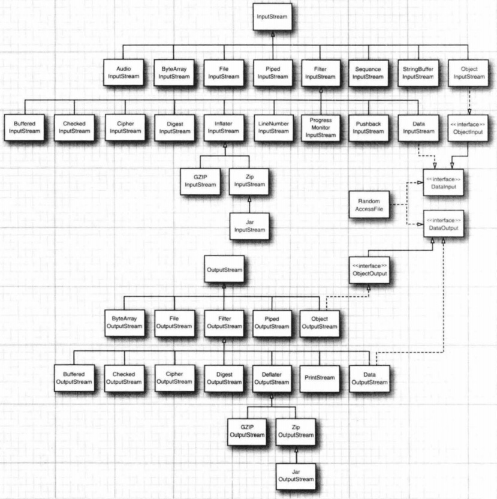
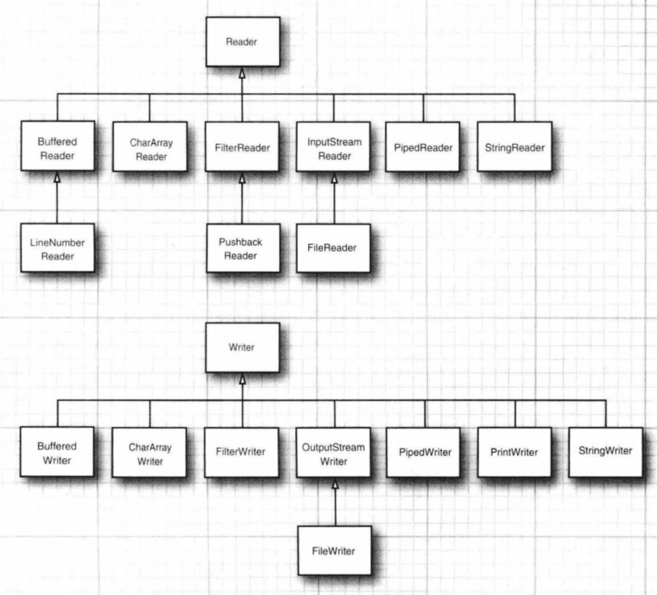
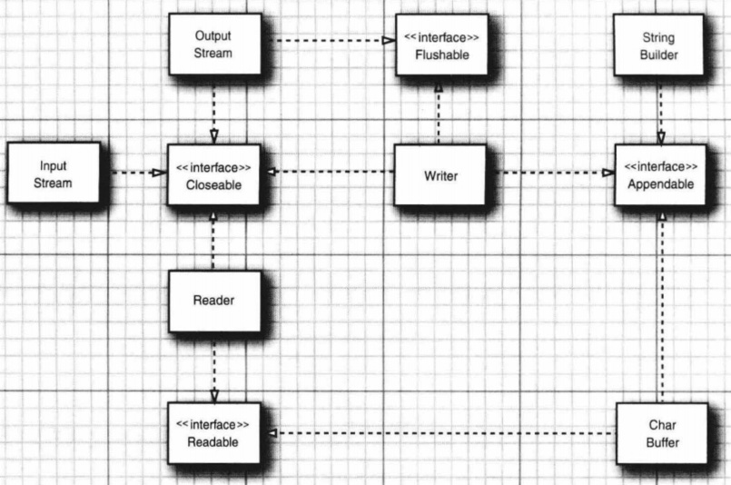
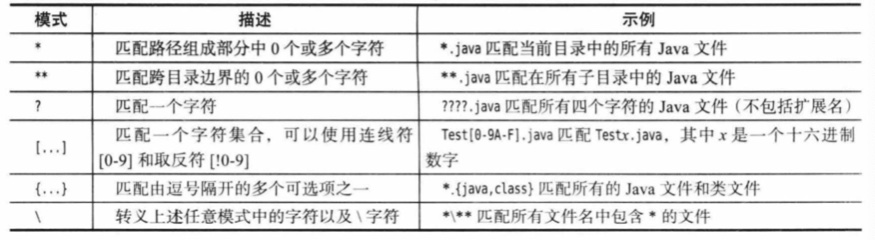
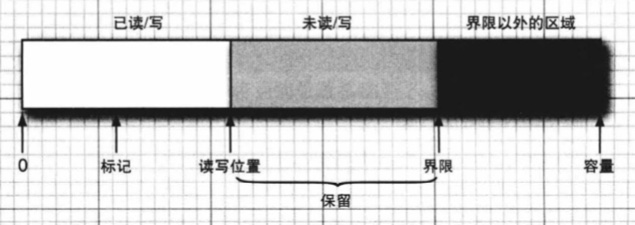

#  2.输入与输出 

[TOC]


本章将介绍 Java 中用于输入和输出的各种应用编程接口(API)。你将要学习如何访问文件与目录，以及如何以二进制格式和文本格式来读写数据。本章还将展示对象序列化机制，它可以使存储对象像存储文本和数值数据一样容易。然后，我们将介绍如何使用文件和目录。最后，本章将讨论正则表达式，尽管这部分内容实际上与输人和输出并不相关，但是我们确实也找不到更合适的地方来处理这个话题。很明显，Java 设计团队在这个问题的处理上和我们一样，因为正则表达式 API 的规格说明隶属于“新IO”特性的规格说明。


## 2.1 输入输出流

在 Java API 中，可以从其中读入一个字节序列的对象称作输入流，而可以向其中写入一个字节序列的对象称作输出流。这些字节序列的来源地和目的地可以是文件，而且通常都是文件，但是也可以是网络连接，甚至是内存块。抽象类 InputStream 和 OutputStream 构成了输入/输出（I/0）字节流类层次结构的基础。

>注意，这些输人/输出流与在前一章中看到的流没有任何关系。为了清楚起见，只要是讨论用于输入和输出的流，我们都将使用术语输入流、输出流或输入/输出流。

Java API 还提供一类用于读取和写出字符流的对象。抽象类 Reader 和 Writer 构成了字符流类层次结构的基础。


### 2.1.1 读写字节和读写字符

Java 的输入流与输出流类别繁多，他们的公共祖先是 InputStream 和OutputStream。字符流的公共祖先是 Reader 和 Writer。

#### 2.1.1.1 InputStream

```java
package java.io;

public abstract class InputStream implements Closeable {

    private static final int MAX_SKIP_BUFFER_SIZE = 2048;

    public abstract int read() throws IOException;

    public int read(byte b[]) throws IOException {
        return read(b, 0, b.length);
    }

    public int read(byte b[], int off, int len) throws IOException {
        if (b == null) {
            throw new NullPointerException();
        } else if (off < 0 || len < 0 || len > b.length - off) {
            throw new IndexOutOfBoundsException();
        } else if (len == 0) {
            return 0;
        }

        int c = read();
        if (c == -1) {
            return -1;
        }
        b[off] = (byte)c;

        int i = 1;
        try {
            for (; i < len ; i++) {
                c = read();
                if (c == -1) {
                    break;
                }
                b[off + i] = (byte)c;
            }
        } catch (IOException ee) {
        }
        return i;
    }

    public long skip(long n) throws IOException {

        long remaining = n;
        int nr;

        if (n <= 0) {
            return 0;
        }

        int size = (int)Math.min(MAX_SKIP_BUFFER_SIZE, remaining);
        byte[] skipBuffer = new byte[size];
        while (remaining > 0) {
            nr = read(skipBuffer, 0, (int)Math.min(size, remaining));
            if (nr < 0) {
                break;
            }
            remaining -= nr;
        }

        return n - remaining;
    }

    
    public int available() throws IOException {
        return 0;
    }

    public void close() throws IOException {}

    public synchronized void mark(int readlimit) {}

    public synchronized void reset() throws IOException {
        throw new IOException("mark/reset not supported");
    }
 
    public boolean markSupported() {
        return false;
    }
}
```

InputStream 是抽象类，实现了 Closeable 接口。


##### 2.1.1.1.1 read 方法

```java
public abstract int read() throws IOException
public int read(byte b[]) throws IOException
public int read(byte b[], int off, int len) throws IOException
```

InputStream 类具有一个抽象方法 int read()，子类需要实现。该方法从输入流读取一个字节。read 方法是阻塞方法，阻塞直到发生以下事件：

1. 读取成功。返回该字节，即0到255的int类型。
2. 输入流到达末尾。返回-1。
3. 抛出异常。

方法 int read(byte b[]) 将尽可能读取输入流中的字节，并写入数组b。方法为阻塞方法。返回值为实际读取的字节数，最小值为-1，表示输入流到达末尾，最大值为b的长度。注意，如果成功读取，则读取的字节数至少为1，只有在b的长度为0时方法才会返回0。

方法 int read(byte b[], int off, int len) 是 read(byte b[]) 实际调用的方法。参数 off 表示从数组b的偏移量off处(即b[off])开始写入读取的数据。len 表示从输入流读取的最大字节数。实际读取的字节数可能小于len，通过返回值可以查看。该方法的默认实现是反复调用 read() 方法，每次读取一个字节。建议子类采取更高效的实现。


##### 2.1.1.1.2 skip 方法

```java
public long skip(long n) throws IOException
```

skip 方法使得输入流跳过最多n个字节(读取然后丢弃)。当参数n小于0时，方法返回0且不跳过字节。否则，方法返回实际跳过的字节数，该值可能小于n，甚至可能是0，最大是MAX_SKIP_BUFFER_SIZE = 2048。这里返回值小于n的原因有很多种，例如中途到达输入流末尾、n大于2048等等。

skip的默认实现是阻塞的，因为它调用了read方法。鼓励子类采取更高效的实现。


##### 2.1.1.1.3 available 方法

```java
public int available() throws IOException
```

available 方法返回可以从输入流读取的字节数的估计值。该方法不阻塞。如果 available 方法返回值为n，表示现在输入流中有 n 个字节可以读取，此时调用 read 或 skip，如果指定读取少于n个字节，那么这两个方法将不会阻塞。但是仍然有可能实际读取到的字节数更小。

方法默认实现直接返回0，需要子类根据具体情况实现。


##### 2.1.1.1.4 mark, reset 和 markSupported 方法

```java
public synchronized void mark(int readlimit)
public synchronized void reset() throws IOException
public boolean markSupported()
```

mark 和 reset 是一对配套方法。当 markSupported 方法返回 true 时，表示该输入流支持 mark 和 reset 机制。

mark 表示在输入流的当前位置做个标记，然后程序可能继续读取输入流，之后某个时刻调用了 reset 方法，则输入流将回退到最近一次调用 mark 时的位置。这样一来，在mark之后读取的字节就好像没被读取一样，又重新回到了输入流中。这里 readlimit 限制了回退的最多字节数。如果在调用 reset 时，从未调用过 mark 方法，或者已经读取了超过 readlimit 的字节数，那么方法有可能抛出 IOException，但具体动作取决于子类实现。

如果 markSupported 方法返回 false，则 mark 和 reset 调用的动作由子类决定。有可能会导致输入流陷入特殊状态。

InputStream 默认不实现 mark 和 reset，markSupported 直接返回 false。


##### 2.1.1.1.5 close 方法

close 方法需要释放输入流所占有的系统资源。


##### 2.1.1.1.6 Java9之后的新方法

```java
int readNBytes (byte[] b, int off, int len)
// 如果未阻塞（read)，则读入由 len 指定数量的字节，或者阻塞至所有的值都被读入。读入的值将置于b中从 off 开始的位置。返回实际读入的字节数，或者在碰到输人流的结尾时返回-1。

byte[] readAllBytes()
// 产生一个数组，包含可以从当前流中读入的所有字节。

long transferTo(OutputStream out)
//将当前输入流中的所有字节传送到给定的输出流，返回传递的字节数。这两个流都不应该处于关闭状态。
```


#### 2.1.1.2 OutputStream

```java
package java.io;

public abstract class OutputStream implements Closeable, Flushable {

    public abstract void write(int b) throws IOException;

    public void write(byte b[]) throws IOException {
        write(b, 0, b.length);
    }

    public void write(byte b[], int off, int len) throws IOException {
        if (b == null) {
            throw new NullPointerException();
        } else if ((off < 0) || (off > b.length) || (len < 0) ||
                   ((off + len) > b.length) || ((off + len) < 0)) {
            throw new IndexOutOfBoundsException();
        } else if (len == 0) {
            return;
        }
        for (int i = 0 ; i < len ; i++) {
            write(b[off + i]);
        }
    }

    public void flush() throws IOException {
    }

    public void close() throws IOException {
    }

}
```

OutputStream 是抽象类，实现了 Closeable 和 Flushable 接口。


##### 2.1.1.2.1 write 方法

```java
public abstract void write(int b) throws IOException
public void write(byte b[]) throws IOException
void write(byte b[], int off, int len) throws IOException
```

void write(int b) 是一个抽象方法，子类需要实现。该方法将 int 变量的低 8 位写入输出流，忽略高 24 位。如果输出流已经被关闭，那么该方法可能会抛出 IOException。

void write(byte b[]) 方法将字节数组b中的全部字节写入输出流，该方法等价于 write(b, 0, b.length)。

void write(byte b[], int off, int len) 方法字节数组中偏移量off处开始，将b的len个字节写入输出流。

+ 默认实现是对每个字节调用 write(int b)，子类应该选择更高效的实现。
+ 当 b 为 null 时，抛出 NullPointerException。
+ 当 off<0 或 len<0 或 off+len-1>=b.length 时，抛出 IndexOutOfBoundsException。


##### 2.1.1.2.2 flush 方法

flush 方法来源于 OutputStream 扩展的 Flushable 接口。

```java
package java.io;
import java.io.IOException;

public interface Flushable {
    void flush() throws IOException;
}
```

flush 方法将刷新输出流的缓冲区，将之前写入输出流，但滞留在缓冲区的字节全部写出到目的地。


##### 2.1.1.2.3 close 方法

释放输出流所占有的系统资源。


#### 2.1.1.3 Reader

```java
package java.io;

public abstract class Reader implements Readable, Closeable {

    protected Object lock;

    protected Reader() {
        this.lock = this;
    }

    protected Reader(Object lock) {
        if (lock == null) {
            throw new NullPointerException();
        }
        this.lock = lock;
    }

    public int read(java.nio.CharBuffer target) throws IOException {
        int len = target.remaining();
        char[] cbuf = new char[len];
        int n = read(cbuf, 0, len);
        if (n > 0)
            target.put(cbuf, 0, n);
        return n;
    }

    public int read() throws IOException {
        char cb[] = new char[1];
        if (read(cb, 0, 1) == -1)
            return -1;
        else
            return cb[0];
    }

    public int read(char cbuf[]) throws IOException {
        return read(cbuf, 0, cbuf.length);
    }

    abstract public int read(char cbuf[], int off, int len) throws IOException;

    private static final int maxSkipBufferSize = 8192;

    private char skipBuffer[] = null;


    public long skip(long n) throws IOException {
        if (n < 0L)
            throw new IllegalArgumentException("skip value is negative");
        int nn = (int) Math.min(n, maxSkipBufferSize);
        synchronized (lock) {
            if ((skipBuffer == null) || (skipBuffer.length < nn))
                skipBuffer = new char[nn];
            long r = n;
            while (r > 0) {
                int nc = read(skipBuffer, 0, (int)Math.min(r, nn));
                if (nc == -1)
                    break;
                r -= nc;
            }
            return n - r;
        }
    }

    public boolean ready() throws IOException {
        return false;
    }

    public boolean markSupported() {
        return false;
    }

    public void mark(int readAheadLimit) throws IOException {
        throw new IOException("mark() not supported");
    }

    public void reset() throws IOException {
        throw new IOException("reset() not supported");
    }

    abstract public void close() throws IOException;
}

```

Reader 与 InputStream 的逻辑基本相似，下面仅介绍不同的地方。


##### 2.1.1.3.1 构造函数

```java
protected Reader()
protected Reader(Object lock) 
```

Reader 提供了两种构造函数，区别在于一个使用自身的对象内部锁进行同步，另一个使用给定对象的内部锁进行同步。


##### 2.1.1.3.2 read 方法

```java
public int read(java.nio.CharBuffer target) throws IOException
public int read() throws IOException 
public int read(char cbuf[]) throws IOException
abstract public int read(char cbuf[], int off, int len) throws IOException
```

Reader 方法具有三个和 InputStream 含义相同的 read 方法，只不过读取的单位是字符，而不是字节。一个字符是一个Unicode码点，是一个0-65536的整数。

Reader 还有第四个read 方法，来源于扩展的 Readable 接口。

```java
package java.lang;
import java.io.IOException;

public interface Readable {
    public int read(java.nio.CharBuffer cb) throws IOException;
}
```

这个方法接受一个 `java.nio.CharBuffer` 类型的参数，这是一个字符缓冲区，此处先不具体介绍。read 方法会将字符流的字符读入该字符缓冲区。


##### 2.1.1.3.3 ready 方法

```java
public boolean ready() throws IOException
```

ready 方法返回字符流中是否有至少一个字符。如果该方法返回true，那么调用 read() 一定不会阻塞。但是注意，如果ready返回false，调用read也不一定阻塞，因为可能调用完ready后字符流中有了字符。


##### 2.1.1.3.4 close 方法

与 InputStream 不同，Reader 的 close 方法变成了抽象方法，非抽象子类必须实现。


#### 2.1.1.4 Writer

```java
package java.io;

public abstract class Writer implements Appendable, Closeable, Flushable {

    private char[] writeBuffer;

    private static final int WRITE_BUFFER_SIZE = 1024;
    
    protected Object lock;

    protected Writer() {
        this.lock = this;
    }
    
    protected Writer(Object lock) {
        if (lock == null) {
            throw new NullPointerException();
        }
        this.lock = lock;
    }

    public void write(int c) throws IOException {
        synchronized (lock) {
            if (writeBuffer == null){
                writeBuffer = new char[WRITE_BUFFER_SIZE];
            }
            writeBuffer[0] = (char) c;
            write(writeBuffer, 0, 1);
        }
    }

    public void write(char cbuf[]) throws IOException {
        write(cbuf, 0, cbuf.length);
    }

    abstract public void write(char cbuf[], int off, int len) throws IOException;

    public void write(String str) throws IOException {
        write(str, 0, str.length());
    }

    public void write(String str, int off, int len) throws IOException {
        synchronized (lock) {
            char cbuf[];
            if (len <= WRITE_BUFFER_SIZE) {
                if (writeBuffer == null) {
                    writeBuffer = new char[WRITE_BUFFER_SIZE];
                }
                cbuf = writeBuffer;
            } else {    // Don't permanently allocate very large buffers.
                cbuf = new char[len];
            }
            str.getChars(off, (off + len), cbuf, 0);
            write(cbuf, 0, len);
        }
    }

    public Writer append(CharSequence csq) throws IOException {
        if (csq == null)
            write("null");
        else
            write(csq.toString());
        return this;
    }

    public Writer append(CharSequence csq, int start, int end) throws IOException {
        CharSequence cs = (csq == null ? "null" : csq);
        write(cs.subSequence(start, end).toString());
        return this;
    }

    public Writer append(char c) throws IOException {
        write(c);
        return this;
    }

    abstract public void flush() throws IOException;

    abstract public void close() throws IOException;
}
```

Writer 与 OutputStream 的逻辑基本相似，下面仅介绍不同的地方。


##### 2.1.1.4.1 构造函数

```java
protected Writer()
protected Writer(Object lock)
```

Writer 提供了两种构造函数，区别在于一个使用自身的对象内部锁进行同步，另一个使用给定对象的内部锁进行同步。


##### 2.1.1.4.2 write 方法

```java
public void write(int c) throws IOException
public void write(char cbuf[]) throws IOException
abstract public void write(char cbuf[], int off, int len) throws IOException;
public void write(String str) throws IOException
public void write(String str, int off, int len) throws IOException
```

前3个 write 方法与 OutputStream 中的逻辑相同，只不过单位不同。

Writer 中新增了两个参数为 String 的 write 方法，用于将制定的字符串写入字符流。


##### 2.1.1.4.3 append 方法

Writer 提供了3个 append 方法。这三个方法来源于它扩展的 Appendable 接口。

```java
package java.lang;
import java.io.IOException;

public interface Appendable {
    Appendable append(CharSequence csq) throws IOException;
    Appendable append(CharSequence csq, int start, int end) throws IOException;
    Appendable append(char c) throws IOException;
}
```

这三个方法将指定的字符(char)或字符序列(CharSequence)写入到字符流中。由于方法返回了Writer对象自身，所以可以串联调用。

对于 CharSequence，方法内部先使用它的 toString 方法将其转换为String，然后再调用 write 方法写入该字符串。因此，具体写入的内容取决于 CharSequence 的 toString 方法返回的字符串。


##### 2.1.1.4.4 close 方法

与 OutputStream 不同，Writer 的 close 方法变成了抽象方法，非抽象子类必须实现。


### 2.1.2 完整的流家族

与C语言只有单一类型 FILE* 包打天下不同，Java 拥有一个流家族，包含各种输入/输出流类型，其数量超过60个！具体见下图。





我们把输入/输出流家族中的成员按照它们的使用方法来进行划分，这样就形成了处理字节和字符的两个单独的层次结构。正如所见，InputStream 和 OutputStream 类可以读写单个字节或字节数组。要想读写字符串和数字，就需要功能更强大的子类，例如，DataInputStream 和 DataOutputStream 可以以二进制格式读写所有的基本 Java 类型；ZipInputstream 和 ZipOutputStream 可以以我们常见的 ZIP 压缩格式读写文件。

另一方面，对于 Unicode 文本，可以使用抽象类 Reader 和 Writer 的子类。

此外，4个附加的接口：Closeable，Flushable，Readable，Appendable 的关系如下图所示。



在学习具体的输入/输出流之前，我们介绍一个概念，即节点流和处理流(包装流)的区别：

+ 节点流是最底层的流，它直接与数据源相接，例如 FileInputStream，ByteArrayInputStream 等。
+ 处理流（包装流），用于包装节点流，它通过调用节点流的方法获取源数据，同时自己额外提供一些附加功能，例如 BufferedInputStream，ObjectInputStream 等。


#### 2.1.2.1 AudioInputStream

音频输入流是具有指定音频格式和长度的输入流。长度用示例帧表示，不用字节表示。支持 mark/reset。


#### 2.1.2.2 ByteArrayInputStream & ByteArrayOutputStream

字节数组输入流是指定数据源为一个 `byte[]` 的 InputStream。

```java
public ByteArrayInputStream bArray = new ByteArrayInputStream(byte [] a)
public ByteArrayInputStream bArray = new ByteArrayInputStream(byte []a, int off, int len)
```

在构造函数中传入一个字节数组，ByteArrayInputStream 并不复制数组的元素，而是复制数组的引用。可以指定从字节数组的off偏移处开始读取，也可以指定读取的最多字节数。

字节数组输入流支持 mark/reset。

由于数据源是一个字节数组，所以该输入流并不会发生阻塞。


字节数组输出流在内部维护一个 `byte[]` 用于写入数据，当缓冲区容量不够时，它自动对缓冲区进行扩容。当写入长度大于缓冲区原有长度时，就会调用grow()方法, 先扩容为2倍，如果size还是不够，就直接扩容到目标大小。

字节数组提供了一些方法用于处理写出到缓冲区的数据。

```java
public ByteArrayOutputStream()
public ByteArrayOutputStream(int size)
```

构造函数可以指定缓冲区的初始大小，如果不指定默认为32字节。

ByteArrayOutputStream中的其他方法如下：

```java
public synchronized void writeTo(OutputStream out) throws IOException
```

writeTo 方法将已经写入到缓冲区的字节全部写入指定的输出流out中。

```java
public synchronized void reset()
```

reset 方法将丢弃已经写入缓冲区中的所有数据。

```java
public synchronized byte toByteArray()[]
```

toByteArrayt 方法创建一个新分配的 byte 数组。其大小是此输出流的缓冲区中已有数据的大小，并且缓冲区的有效内容已复制到该数组中。

```java
public synchronized int size()
```

size 方法返回当前缓冲区数据的字节数。

```java
public synchronized String toString()
```

toString 方法使用平台默认的字符集，通过解码字节将缓冲区内容转换为字符，构造为一个String并返回。


#### 2.1.2.3 FileInputStream & FileOutputStream

文件输入流是指定数据源为一个二进制文件的 InputStream，按照字节流读取该文件。

```java
public FileInputStream(String name) throws FileNotFoundException
public FileInputStream(File file) throws FileNotFoundException
public FileInputStream(FileDescriptor fdObj)
```

FileInputStream 具有3个构造函数。

1. 接受文件的路径名，打开指定文件。
2. 接受与文件相关联的 File 对象。
3. 接受与文件相关联的 FileDescriptor 对象。

此外，它有两个特殊的方法：

```java
public FileChannel getChannel() // 返回与此文件输入流相关联的唯一的FileChanne1对象。
public final FileDescriptor getFD() throws IOException // 返回表示与此 FileInputstream 正在使用的文件系统中实际文件相关联的 FileDescriptor 对象。
```

由于数据源是一个文件，所以该输入流并不会发生阻塞。

文件输入流不支持 mark/reset 。


文件输出流是指定写入目的为一个二进制文件的 OutputStream。

```java
public FileOutputStream(String name) throws FileNotFoundException
public FileOutputStream(String name, boolean append)
public FileOutputStream(File file) throws FileNotFoundException
public FileOutputStream(File file, boolean append)
public FileOutputStream(FileDescriptor fdObj)
```

FileOutputStream 具有5个构造函数。

1. 通过指定路径名获取文件。如果文件名为目录名、文件不存在但无法创建 或 文件无法打开等，那么方法抛出 FileNotFoundException。
2. 通过指定路径名获取文件，并且如果文件已经存在，则从其末尾开始写入，即追加模式。
3. 通过 File 对象获取文件。
4. 通过 File 对象获取文件，且采取追加模式。
5. 通过 FileDescriptor 对象获取文件。

FileOutputStream 同样具有 FileChannel 和 FileDescriptor 方法。

文件输出流使用 OutputStream 的3个write接口写入数据。


#### 2.1.2.4 PipedInputStream & PipedOutputStream

PipedInputStream 和 PipedOutputStream 分别是管道输入流和管道输出流。它们的作用是让多线程可以通过管道进行线程间的通讯。在使用管道通信时，必须将 PipedOutputStream 和 PipedInputStream 配套使用。

使用管道通信时，大致的流程是：我们在线程A中向 PipedOutputStream 中写入数据，这些数据会自动的发送到与 PipedOutputStream 对应的 PipedInputStream 中，进而存储在 PipedInputStream 的缓冲中；此时，线程B通过读取 PipedInputStream 中的数据。就可以实现线程A和线程B的通信。

```java
public PipedInputStream(PipedOutputStream src) throws IOException
public PipedInputStream(PipedOutputStream src, int pipeSize)
public PipedInputStream()
public PipedInputStream(int pipeSize)

public PipedOutputStream(PipedInputStream snk)  throws IOException
public PipedOutputStream()
```

创建 PipedInputStream 时，可以直接指定配对的 PipedOutputStream，也可以不指定，后续再进行连接。构造函数中也可以指定管道输入流的缓冲区大小。

创建 PipedOutputStream 时，可以直接指定配对的 PipedInputStream，也可以不指定。

```java
public void connect(PipedOutputStream src) throws IOException
public synchronized void connect(PipedInputStream snk) throws IOException
```

如果创建时未指定对应的管道输出流，那么可以调用 connect 指定。

管道输入/输出流不支持 mark/reset 。

管道输入/输出流可能会发生阻塞。


#### 2.1.2.5 SequenceInputStream

序列输入流可以把多个字节输入流整合成一个。它从一个有序的输入流集合开始，从第一个读取到输入流末尾，然后从第二个输入流开始读取，依此类推，直到最后一个输入流达到末尾。 

```java
public SequenceInputStream(Enumeration<? extends InputStream> e)
public SequenceInputStream(InputStream s1, InputStream s2)
```

SequenceInputStream 具有两个构造函数。

1. 接受一个由 InputStream 对象构成的枚举集合，将其中的输入流序列化。
2. 先读取 s1 中的字节，再读取 s2 中的字节。

序列输入流不支持 mark/reset 。

序列输入流是否阻塞取决于它序列化的输入流。


#### 2.1.2.6 StringBufferInputStream

该类已经被弃用。

该类和 ByteArrayInputStream 类似，只不过数据来源是字符串 String。

```java
public StringBufferInputStream(String s)
```

该类只有一个构造函数，接受一个String，读取它的字符，只读取每个字符的低8位。


#### 2.1.2.7 ObjectInputStream & ObjectOutputStream

对象输入/输出流通常是成对使用的。它们的作用是将Java对象序列化然后写入某个输出流或从某个输入流读取字节后反序列化为对象。

ObjectOutputStream 用于将对象序列化后写入指定输出流。

```java
public ObjectOutputStream(OutputStream out) throws IOException
protected ObjectOutputStream() throws IOException, SecurityException
```

ObjectOutputStream 有2个构造函数：

1. 接受一个 OutputStream，之后会将Java对象序列化后写入该输出流。
2. 提供了一个无参数版本构造函数，为子类重新实现提供更多样的选择。

这里介绍最主要的功能，将一个对象写入输出流：

```java
public final void writeObject(Object obj) throws IOException
```

这里写入的对象要求实现 Serializable 接口。

也可以使用下面的系列方法写入基本数据类型。

```java
public void writeBoolean(boolean val) throws IOException
public void writeByte(int val) throws IOException
public void writeShort(int val)  throws IOException
public void writeChar(int val)  throws IOException
public void writeInt(int val)  throws IOException
public void writeLong(int val)  throws IOException
public void writeFloat(float val)  throws IOException
public void writeDouble(double val) throws IOException
public void writeBytes(String str) throws IOException
public void writeChars(String str) throws IOException
public void writeUTF(String str) throws IOException
```

这些方法在写入数据时，首先会写入一个header(具体内容略)，然后再从高字节到低字节写入数据内容。例如，writeInt 方法将先写入一个header，然后将一个int变量的4个字节从高到低分别写入输出流。

还有一些其他机制暂时跳过。


ObjectInputStream 从指定输入流中读取数据，反序列化为对象。

```java
public ObjectInputStream(InputStream in) throws IOException
protected ObjectInputStream() throws IOException, SecurityException
```

ObjectInputStream 有2个构造函数：

1. 接受一个输入流，从其中读取数据。
2. 无参数版本方便子类的其他实现。

主要的读取方法如下：

```java
public final Object readObject()
public boolean readBoolean() throws IOException
public byte readByte() throws IOException
public int readUnsignedByte()  throws IOException
public char readChar()  throws IOException
public short readShort()  throws IOException
public int readUnsignedShort() throws IOException
public int readInt()  throws IOException
public long readLong()  throws IOException
public float readFloat() throws IOException
public double readDouble() throws IOException
```


#### 2.1.2.8 FilterInputStream & FilterOutputStream

FilterInput/OutputStream 与其他 InputStream 不同，它不直接提供特殊的输入/输出操作，而是对基础的输入/输出流附加额外的功能。

这个类采用**装饰器**模式(Decorator Pattern)，允许向一个现有的对象添加新的功能，同时又不改变其结构。这种类型的设计模式属于结构型模式，它是作为现有的类的一个包装。具体的，FilterInputStream 类内部维护一个 InputStream，它的所有读入操作都是调用这个 InputStream 来完成的。因此，可以把装饰器看成一种中间层。

FilterInputStream 没有提供额外的功能，但是它有许多子类，这些子类可以为之前介绍的各种 InputStream 提供额外的功能。FilterOutputStream 同理。

下面仅介绍几组最常用的子类。

##### 2.1.2.8.1 BufferedInputStream & BufferedOutputStream

BufferedInputStream 是缓冲输入流，是 FilterInputStream 的子类，属于处理流的一种。它提供缓存作用，从而加快数据的读取速度。例如在使用 FileInputStream 读取文件时，如果程序频繁地操作一个资源，则性能会很低，此时为了提升性能，就可以将一部分数据暂时读入到内存的一块区域中，以后直接从此区域中读取数据即可，因为读内存速度比较快，所以可以提高性能。

```java
public BufferedInputStream(InputStream in)
public BufferedInputStream(InputStream in, int size)
```

BufferedInputStream 具有2个构造函数，接受一个需要装饰的输入流，同时可以选择指定缓冲区的大小。

BufferedInputStream 提供了 mark/reset 操作，因此如果包装了一个不支持该操作的输入流，那么我们就获得了附加功能。例如，使用 BufferedInputStream 包装一个 PipedInputStream。


BufferedOutputStream 是缓冲输出流，是FilterOutputStream 的子类，属于处理流的一种。

```java
public BufferedOutputStream(OutputStream out)
public BufferedOutputStream(OutputStream out, int size)
```

BufferedOutputStream 提供的功能可以类比 BufferedInputStream，为输出流提供缓冲加速功能。


##### 2.1.2.8.2 DataInputStream & DataOutputStream

DataInputStream 与 DataOutputStream 通常是成对使用的，它可以用来读取/写入Java的基本类型。

前面我们提到，ObjectInputStream 可以从底层流中读取Java对象，它也可以读取基本数据类型。这里 DataInputStream 则只能读取基本数据类型。因此，可以认为后者的功能比前者少。

DataInputStream 读取基本类型的接口与 ObjectInputStream 基本相同，唯一的区别在于这写方法被申明为 final，即不能被子类重写。

```java
public final boolean readBoolean() throws IOException
public final boolean readBoolean() throws IOException
public final byte readByte() throws IOException
public final int readUnsignedByte()  throws IOException
public final char readChar()  throws IOException
public final short readShort()  throws IOException
public final int readUnsignedShort() throws IOException
public final int readInt()  throws IOException
public final long readLong()  throws IOException
public final float readFloat() throws IOException
public final double readDouble() throws IOException
```

>这里我有个疑惑，为什么 ObjectInputStream 和 ObjectOutputStream 没有选择继承 FilterInputStream？
>
>它和 DataInputStream 的区别只是可以读取Java对象。


##### 2.1.2.8.3 PushbackInputStream

PushbackInputStream 是 FilterInputStream 的子类，它的作用是允许我们试探性的读取数据流，如果不是我们想要的则可以返还回去，它的实现原理是内部维护了一个Pushback buffer缓冲区，读取流的时候先读这个缓冲区，回退的时候就把数据放置到这个缓冲区中。

```java
public PushbackInputStream(InputStream in, int size)
public PushbackInputStream(InputStream in)
```

该类提供的回退操作与 mark/reset 机制的区别在于，它返还的数据可能不是读取时读到的数据，而是经过修改的。下面是退回操作的3种方法：

```java
public void unread(int b) throws IOException
public void unread(byte[] b) throws IOException
public void unread(byte[] b, int off, int len) throws IOException
```

这三个方法分别回退整型b的低8位、字节数组b 和 字节数组b的指定部分。

该类不支持 mark/reset 操作。


##### 2.1.2.8.4 PrintStream

PrintStream 是 FilterOutputStream 的子类，它的作用是方便我们按照数据的打印方式输出。例如，如果用打印数字97，如果直接用未经过装饰的 OutputStream，那么97将被写入一个字节，从而变成字母'a'。PrintStream 可以帮我们将97转变为由字符'9'和字符'7'构成的字符串，然后再调用底层输出流进行输出。

```java
public PrintStream(OutputStream out)
public PrintStream(OutputStream out, boolean autoFlush)
public PrintStream(OutputStream out, boolean autoFlush, String encoding)
    throws UnsupportedEncodingException
public PrintStream(String fileName) throws FileNotFoundException
public PrintStream(String fileName, String csn) 
    throws FileNotFoundException, UnsupportedEncodingException
public PrintStream(File file) throws FileNotFoundException
public PrintStream(File file, String csn)
    throws FileNotFoundException, UnsupportedEncodingException
```

PrintStream 有7个构造函数，可以分为3类：

1. 底层输出流是一个 OutpurStream。可选的autoFlush参数指明是否自动对缓冲区进行刷新。可选的 encoding 参数指明字符编码集。
2. 底层输出流是一个文件，参数为文件名。
3. 底层输出流是一个文件，参数为File对象。

在输出时，除了write方法，PrintStream 提供了打印基本类型和Java对象的方法，分别具有print，println和printf系列方法。println只是在print后再输出一个换行符。

```java
public void print(boolean b)
public void print(char c)
public void print(int i)
public void print(long l)
public void print(float f)
public void print(double d)
public void print(char s[])
public void print(String s)
public void print(Object obj)
public PrintStream printf(String format, Object ... args)
```

只有用print系列方法，才可以按照打印方式输出，write方法并不会做转换。

这里需要注意，PrintStream 将需要打印的数据转换为String后输出，将String输出时采用平台模式或指定的字符编码方式，例如指定用"UTF-8"。

如果设置了自动刷新，那么 PrintStream 在发生以下情况之一时会自动调用 flush 方法：

1. 写入了一个字节数组。
2. 调用了 println 的系列方法。
3. 写入了一个换行符 '\n'。

学到这里可以发现，其实我们经常使用的 System.out 就是一个 PrintStream 对象。


#### 2.1.2.9 BufferedReader & BufferedWriter

与 BufferedInputSteram & BufferedOutputStream 的功能相同，只不过以 char 为单位读取/写入。

```java
public BufferedReader(Reader in, int sz)
public BufferedReader(Reader in)
public BufferedWriter(Writer out, int sz)
public BufferedWriter(Writer out)
```


#### 2.1.2.10 CharArrayReader & CharArrayWriter

与 ByteArrayInputStream & ByteArrayOutputStream 的功能相同，只不过以 char 为单位读取/写入。

```java
public CharArrayInputStream(byte buf[])
public CharArrayInputStream(byte buf[], int offset, int length)
public CharArrayWriter()
public CharArrayWriter(int initialSize)
```

相比于 ByteArrayOutputStream，CharArrayWriter 也有 writeTo、reset、toCharArray、size、toString、flush 方法。此外，它还有3个append方法。

```java
public CharArrayWriter append(CharSequence csq)
public CharArrayWriter append(CharSequence csq, int start, int end)
public CharArrayWriter append(char c)
```

append 方法可以把指定的字符或字符序列加到 CharArrayWriter的末尾。


#### 2.1.2.11 InputStreamReader & OutputStreamWriter

InputStreamReader类是从字节流到字符流的桥接器，它使用指定的字符集读取字节并将它们解码为字符(Java内码，即UTF-16编码)。 它使用的字符集可以通过名称指定，也可以明确指定，或者可以接受平台的默认字符集。每次调用一个InputStreamReader的read方法都可能导致从底层字节输入流中读取一个或多个字节。 为了实现字节到字符的有效转换，可以从基础流中提取比满足当前读取操作所需的更多字节。为了获得最高效率，请考虑在BufferedReader中包装InputStreamReader。

InputStreamReader 有4个构造函数。

```java
public InputStreamReader(InputStream in)
public InputStreamReader(InputStream in, String charsetName) 
    throws UnsupportedEncodingException
public InputStreamReader(InputStream in, Charset cs)
public InputStreamReader(InputStream in, CharsetDecoder dec)
```

1. 不指定字符集，使用默认字符集。
2. 指定使用名称为 charsetName 的字符集。
3. 指定使用字符集 cs。
4. 指定使用字符解码器 dec。

此外，InputStream 还有 getEncoding 方法，可以返回使用的字符集的名称。

```java
public String getEncoding()
```

>InputStreamReader 可以将指定的输入流从一种编码方式转换为UTF-16编码方式。System.in 是一种 InputStream，它获取的是由键盘输入的字符经过UTF-8编码后形成的字节流。因此，我们可以使用InputStreamReader 包装 System.in ，从而获取标准输入的字符。
>
>```java
>InputStreamReader inputStreamReader = new InputStreamReader(
>    System.in, StandardCharsets.UTF_8);
>char[] ch = new char[1];
>inputStreamReader.read(ch);
>System.out.println(ch);
>```


OutputStreamWriter 使用指定的字符集将写入其中的字符编码为字节。它使用的字符集可以通过名称指定，也可以明确指定，或者可以接受平台的默认字符集。

OutputStreamWriter 也具有4个构造函数。

```java
public OutputStreamWriter(OutputStream out)
public OutputStreamWriter(OutputStream out, String charsetName)
        throws UnsupportedEncodingException
public OutputStreamWriter(OutputStream out, Charset cs)
public OutputStreamWriter(OutputStream out, CharsetEncoder enc)
```

1. 不指定字符集，使用默认字符集。
2. 指定使用名称为 charsetName 的字符集。
3. 指定使用字符集 cs。
4. 指定使用字符编码器 enc。

下面是 OutputStreamWriter 的源代码，重点关注它可以写出 char，char[] 和 String 的方法。

```java
package java.io;
import java.nio.charset.Charset;
import java.nio.charset.CharsetEncoder;
import sun.nio.cs.StreamEncoder;


public class OutputStreamWriter extends Writer {

    private final StreamEncoder se;

    public OutputStreamWriter(OutputStream out, String charsetName)
        throws UnsupportedEncodingException
    {
        super(out);
        if (charsetName == null)
            throw new NullPointerException("charsetName");
        se = StreamEncoder.forOutputStreamWriter(out, this, charsetName);
    }

    public OutputStreamWriter(OutputStream out) {
        super(out);
        try {
            se = StreamEncoder.forOutputStreamWriter(out, this, (String)null);
        } catch (UnsupportedEncodingException e) {
            throw new Error(e);
        }
    }

    public OutputStreamWriter(OutputStream out, Charset cs) {
        super(out);
        if (cs == null)
            throw new NullPointerException("charset");
        se = StreamEncoder.forOutputStreamWriter(out, this, cs);
    }

    public OutputStreamWriter(OutputStream out, CharsetEncoder enc) {
        super(out);
        if (enc == null)
            throw new NullPointerException("charset encoder");
        se = StreamEncoder.forOutputStreamWriter(out, this, enc);
    }

    public String getEncoding() {
        return se.getEncoding();
    }

    void flushBuffer() throws IOException {
        se.flushBuffer();
    }

    public void write(int c) throws IOException {
        se.write(c);
    }

    public void write(char cbuf[], int off, int len) throws IOException {
        se.write(cbuf, off, len);
    }

    public void write(String str, int off, int len) throws IOException {
        se.write(str, off, len);
    }

    public void flush() throws IOException {
        se.flush();
    }

    public void close() throws IOException {
        se.close();
    }
}
```


#### 2.1.2.12 FileReader & FileWriter

FileReader 和 FileWriter 分别继承自 InputStreamReader 和 OutputStreamWriter。该类从文件读取/写入字符。

FileReader 只有3个构造函数，没有申明和重写其他方法。

```java
package java.io;
public class FileReader extends InputStreamReader {
    
    public FileReader(String fileName) throws FileNotFoundException {
        super(new FileInputStream(fileName));
    }
    public FileReader(File file) throws FileNotFoundException {
        super(new FileInputStream(file));
    }
    public FileReader(FileDescriptor fd) {
        super(new FileInputStream(fd));
    }
}
```

从源码可见，FileReader 其实就是包装了 FileInputStream 的 InputStreamReader。由于 FileInputStream 有3种构造函数，所以 FileReader 也有对应的3种构造函数。

从 FileReader 读取的方法就调用其父类 InputStreamReader 即可。


FileWriter 只有5个构造函数，没有申明和重写其他方法。

```java
package java.io;
public class FileWriter extends OutputStreamWriter {

    public FileWriter(String fileName) throws IOException {
        super(new FileOutputStream(fileName));
    }

    public FileWriter(String fileName, boolean append) throws IOException {
        super(new FileOutputStream(fileName, append));
    }

    public FileWriter(File file) throws IOException {
        super(new FileOutputStream(file));
    }

    public FileWriter(File file, boolean append) throws IOException {
        super(new FileOutputStream(file, append));
    }

    public FileWriter(FileDescriptor fd) {
        super(new FileOutputStream(fd));
    }
}
```

从源码可见，FileWriter 其实就是包装了 FileOutputStream 的 OutputStreamWriter。由于 FileOutputStream 有5种构造函数，所以 FileWriter 也有对应的5种构造函数。

向 FileWriter 写入的方法就调用其父类 FileOutputStream 即可。


#### 2.1.2.13 PipedReader & PipedWriter

PipedReader & PipedWriter 的功能可以参考 PipedInputStream & PipedOutputStream。它们的区别仅在于前者的读写单位是 char。


#### 2.1.2.14 StringReader & StingWriter

StringReader 的功能可以参考 StringBufferInputStream(Deprecated)。但是StringReader是以char为单位读取。

StringWriter 的功能是在字符串缓冲区中收集输出的字符流，可用于构造字符串。该类很特殊，关闭流无效，关闭后调用其他方法不会报异常

```java
public StringWriter()
public StringWriter(int initialSize)
```

StringWriter 有6种写入方法。

```java
public void write(int c)
public void write(char cbuf[], int off, int len)
public void write(String str)
public void write(String str, int off, int len)
public StringWriter append(char c)
public StringWriter append(CharSequence csq)
public StringWriter append(CharSequence csq, int start, int end)
```

可以通过以下2种方法获取写入的字符串。

```java
public String toString() { return buf.toString();} // 获取字符串
public StringBuffer getBuffer() { return buf;} // 获取字符串缓冲区本身
```

另外，该类的 close 方法为空。


#### 2.1.2.15 FilterReader & FilterWriter

FilterReader & FilterWriter 的功能可以参考 FilterInputStream & FilterOutputStream。


#### 2.1.2.16  PushbackReader

PushbackReader 是 FilterReader 的子类，它的功能可以参考 PushbackInputSream。


#### 2.1.2.17 PrintWriter

PrintWriter 是 Writer 的子类，它的功能可以参考 PrintStream，它们的区别在于 PrintWriter 使用的是字符流。

```java
public PrintWriter(Writer out)
public PrintWriter(Writer out, boolean autoFlush) 
public PrintWriter(OutputStream out)
public PrintWriter(OutputStream out, boolean autoFlush)
public PrintWriter(String fileName) throws FileNotFoundException
public PrintWriter(String fileName, String csn)
public PrintWriter(File file) throws FileNotFoundException
public PrintWriter(File file, String csn) 
    throws FileNotFoundException, UnsupportedEncodingException
```

注意，PrintWrtier 的构造器中放入的可能是输出字符的Writer，也可能是输出二进制的 OutputStream。其实，在 PrintWriter 内部，它持有一个私有Writer用来完成实际的输出操作，PrintWriter本身只负责将数据转换为字符，即char序列，然后由内部Writer写出char序列。因此，当构造器中放入的就是Writer，那么PrintWriter将直接把它作为内部的Writer，而如果构造器中只放入了OutputStream，它会用这个OutputStream作为参数生成一个 BufferedWriter，并将这个 BufferedWriter 作为内部的 Writer。

例如，要打印一个数字 123，调用 PrintWriter.print(int i) 方法。这个方法会将int类型的123转换为3个字符的序列，即字符串"123"，然后委托内部的Writer写出这个字符串。

虽然 PrintWriter 使用字符流，但最终转换为字节时也是使用指定的字符集，因此这方面和 PrintStream 没什么区别。但是，PrintStream 的write方法使用的是未转换的字节流，而PrintWriter的write方法使用的是经过字符集编码的char。因此，对于需要使用 raw bytes 的应用，还是需要使用 PrintStream。

除此之外，二者还有一个区别。如果设置了自动刷新，PrintWriter 只在下面的情况之一发生时自动调用 flush：

1. 调用了 println 方法。
2. 调用了 printf 方法。
3. 调用了 format 方法。

而且，这些方法使用平台的特定换行符，而不是固定的'\n'。


### 2.1.3 组合输入/输出流

上一节介绍了许多输入输出流，它们各自有着不同的功能。它们有的可以从文件或其他外部位置上获取数据，有的则可以将原始字节组装到更有用的数据类型中。Java程序员可以对二者进行组合。例如，为了从文件中读取数字，可以先创建一个 FileInputStream，然后用 DataInputStream 包装它：

```java
var fin = new FileInputStream("employee.dat");
var din = new DataInputStream(fin);
double x = din.readDouble();
```

我们可以通过嵌套过滤器来添加多重功能。例如，输人流在默认情况下是不被缓冲区绶存的，也就是说，每个对 read 的调用都会请求操作系统再分发一个字节。相比之下，请求一个数据块并将其置于缓冲区中会显得更加高效。如果我们想使用缓冲机制和用于文件的数据输入方法，那么可以使用下面的构造起序列：

```java
var din = new DataInputStream(
	new BufferedInputStream(
    	new FileInputStream("employee.dat")));
```

注意，我们把 Datalnputstream 置于构造器链的最后，这是因为我们希望使用 DatalnputStream 的方法，并且希望它们能够使用带缓冲机制的 read 方法。

在嵌套使用不同的输入流包装器时，有一个细节需要注意。例如我们可以要实现可退回地从文件读取基本数据类型。显然，节点流应该使用 FileInputStream。此外，PushbackInputStream 可以实现回退操作，DataInputStream 可以实现读取基本数据类型。但是 PushbackInputStream 和 DataInputStream 哪个在外层，哪个在内层呢？假如最外层使用 PushbackInputStream，那么这个对象就没有 readDouble 等方法，而假如最外层使用 DataInputStream，这个对象又没有 unread 方法。这里的解决办法是，保留中间输入流对象的引用，直接在中间对象上调用功能。

例如，在上个例子中，我们可以先构造 PushbackInputStream，并保存其引用 pbin。

```java
PushbackInputStream pbin = new PushbackInputStream(new FileInputStream("1.dat"));
```

然后再使用 DataInputStream 包装它。

```java
DataInputStream din = new DataInputStream(pbin);
```

现在，如果我们要读取一个double，则可以在 din 上调用 readDouble。

```java
double d = din.readDouble();
```

如果要退回一个double，要注意不能直接用pbin退回d，因为unread方法不接受double类型的参数。因此需要先把已经读取的double转换为8个字节，然后在pbin上调用unread将其退回。

```java
byte[] doubleAsBytes = new byte[8];
ByteBuffer.wrap(doubleAsBytes).putDouble(d);
pbin.unread(doubleAsBytes);
```

这样我们就实现了 PushbackInputStream 和 DataInputStream 的嵌套使用。


### 2.1.4 文本输入与输出

在存储文本字符串时，需要考虑字符编码（character encoding) 方式。 Java 内码使用的UTF-16 编码方式，但是，许多程序都希望文本文件按照其他的编码方式编码。例如 UTF-8。

OutputStreamWriter 类将使用选定的字符编码方式，把 Unicode 码元的输出流转换为字节流。而InputStreamReader 类将包含字节（用某种字符编码方式表示的字符）的输入流转换为可以产生 Unicode 码元的读入器。因此，在 InputStreamReader 的构造器中应该指定一种具体的编码方式。例如：

```java
var in = new InputStreamReader(new FileInputStream("1.dat"), StandardCharset.UTF_8);
```


### 2.1.5 如何写出文本输出

对于文本输出，可以使用 PrintWriter。这个类拥有以文本格式打印字符串和数字的方法。为了打印文件、需要用文件名和字符编码方式构建一个 PrintStream 对象：

```java
var out = new PrintWriter("employee. txt", StandardCharsets.UTF_8);
```

为了输出到打印写出器，需要使用与使用 System.out 时相同的 print、 println 和 printf 方法。你可以用这些方法来打印数字（int、 short、 Long、 float、 double)、字符、boolean 值、字符串和对象。


### 2.1.6 如何读入文本输入

文本输入是指数据是以文字编码的。那么我们就不能按照二进制数据的方式读取。例如，当我们要读取一个int时，DataInputStream.readInt()按照二进制数据，会读取四个字节，按照先填入int的高字节，后填入低字节的顺序，将4个字节填入int变量，然后将其值返回。但是一个文本数据的int是逐个字符编码的。例如数字 23，采用UTF-8编码(Java外码的编码方式)，那么其数据将是两个字节，大小分别为 50 和 53。于是，我们需要专门读取文本数据的类。

最简单的处理任意文本的方式就是使用在卷1中我们广泛使用的 Scanner 类。我们可以从任何输入流中构建 Scanner 对象。

```java
Scanner(InputStream in);
```

然后，就可以使用Scanner的API来读取输入了。

或者，我们也可以将短小的文本文件像下面这样读入到一个字符串中：

```java
var content = (Files.read(String path), charset);
```

但是，如果想要将这个文件一行行地读入，那么可以调用：

```java
List<String> Lines = Files.readAllLines(path, charset);
```

如果文件太大，那么可以将行情性处理为一个 `Stream<String>` 对象：
```java
try (Stream<String> Lines = Files.lines(path, charset)) {...}
```

另外，也可以使用 InputStreamReader，指定原始字符为UTF-8编码，然后将字符读取到char数组中，成为UTF-16编码，再通过char数组构造String。

>这个过程可以概括为：
>
>1. 读取字节序列：首先，使用UTF-8字符流（如InputStreamReader）读取字节序列。
>
>2. 将字节序列转换为Unicode码点：接下来，字符流将UTF-8编码的字节序列解码为Unicode码点。UTF-8编码使用变长编码，每个字符可以占用1到4个字节。解码过程会将字节序列正确地映射到相应的Unicode码点。
>3. 将Unicode码点转换为UTF-16编码：由于Java的String对象使用UTF-16编码存储字符，因此需要将Unicode码点转换为UTF-16编码。对于基本多文种平面（BMP）中的字符，UTF-16编码与码点相同。对于辅助平面中的字符，需要将码点转换为代理对（surrogate pair）。
>4. 将UTF-16编码的字符存储到String对象中：最后，将转换为UTF-16编码的字符存储在Java的String对象中。此时，可以在程序中对这些字符进行处理和操作。
>
>而我们使用 InputStreamReader 就是完成了第1-3步，使用char构造String就是第4步。


### 2.1.7 以文本格式存储对象

假设我们要将一个 Employee 记录数组存储成了一个文本文件，其中每条记录都保存成单独的一行，而实例字段彼此之间使用分隔符分离开，这里我们使用竖线（｜）作为分隔符。这里假设不会发生“｜”在要存储的字符串中存在的情况。

下面是一个记录及的样本：

```java
Harry Hacker|35500|1989-10-01
Carl Cracker|75000|1987-12-15
Tony Tester|38000|1990-03-15
```

写出记录相当简单，因为是要写出到一个文本文件中，所以我们使用 Printwriter 类。我们直接写出所有的字段，每个字段后面跟着一个竖线，而最后一个字段的后面跟着一个换行符。这项工作是在下面这个我们添加到 Employee 类中的 writeEnployee 方法里完成的：

```java
public static void writeEnployee(PrintWriter out, Employee e)
{
	out.println(e.getName()+"|"+e.getSalary() +"|"+ e.getHireDay());    
}
```

为了读人记录，我们每次读入一行，然后分离所有的字段。我们使用一个扫描器来读入每一行，然后用 String.split 方法将这一行断开成一组标记。

```java
public static Employee readEmployee(Scanner in)
{
    String line = in.nextLine();
    String[] tokens  = line.split("\\|");
    String name = tokens[0]);
    double salary = Double.parseDouble(tokens[1]);
    LocalDate hireDate = LocalDate.parse(tokens[2]);
    int year = hireDate.getYear();
    int month = hireDate.getMonthValue();
    int day = hireDate.getDayofMonth();
    return new Employee(name, salary, year, month, day);
}
```


### 2.1.8 字符编码方式

输入和输出流都是用于字节序列的，但是在许多情况下，我们希望操作的是文本，即字符序列。于是，字符如何编码成字节就成了问题。

Java 针对字符使用的是 Unicode 标准。每个字符或“编码点”都具有一个21位的整数。有多种不同的字符编码方式，也就是说，将这些21位数字包装成字节的方法有多种。最常见的编码方式是 UTF-8，它会将每个 Unicode 编码点编码为1到4个字节的序列。UTF-8 的好处包含了英语中用到的所有字符，且 ASCII 字符集中的每个字符都只会占用一个字节。

另一种常见的编码方式是 UTF-16。 它会将每个 Unicode 编码点编码为1个或2个16位值。这是一种在 Java 字符串中使用的编码方式。实际上，有两种形式的UTF-16，被称为大端序和小端序。考虑一下16位值 0x2122。在大端序格式中，高位字节会先出现：8x21后面跟着 8x22。但是在小端序格式中，是另外一种排列方式：0x22 0x21。为了表示使用的是哪一种格式，文件可以以**字节顺序标记(Byte-Order Mark,BOM)**开头，这个标记为16 位数值 0xFEFF(或0xFFEF)。读入器可以使用这个值来确定字节顺序，然后丢弃它。具体的，0xFEFF表示大端序(Big-Endian)，0xFFEF表示小端序(Little-Endian)。

>注意，Java采用的是网络字节序，即大端序(Big-Endian)。因此，DataInputStream.readInt() 方法读取的4个字节是返回值int的从高到低的4个字节。

>注意：有些程序，包括 Microsoft Notepad (微软记事本）在内，都在 UTF-8编码的文件开头处添加了一个字节顺序标记。很明显，这并不需要，因为在 UTF-8中，并不存在字节顺序的问题。但是 Unicode 标准允许这样做，甚至认为这是一种好的做法，因为这样做可以使编码机制不留疑惑。遺憾的是，Java 并没有这么做，有关这个问题的缺陷报告最终是以“will not fix”（不做修正）关闭的。对你来说，最好的做法是将输
>入中发现的所有先导的 \uFEFF 都丢弃。

除了 UTF 编码方式，还有一些编码方式，它们各自都涵盖了适用于特定用户人群的字符范围。例如，ISO 8859-1 是一种单字节编码，它包含了西欧各种语言中用到的带有重音符号的字符。

`StandardCharsets` 类具有类型为 `Charset` 的静态变量，用于表示每种 Java 虚拟机都必须支持的字符编码方式：

```java
StandardCharsets.UTF_8
StandardCharsets.UTF_16
StandardCharsets.UTF_16BE
StandardCharsets.UTF_16LE
StandardCharsets.ISO_8859_1
StandardCharsets.US_ASCII
```

为了获得其他编码方式的 Charset，可以使用静态的 forName 方法：
```java
Charset shiftJIs = Charset.forName("Shift- JIS");
```

平台使用的编码方式可以由静态方法 Charset.defaultCharset 返回。

在读入或写出文本时，应该使用 Charset 对象。例如，我们可以像下面这样将一个字节数组转换为字符串：

```java
var str = new String(bytes, StandardCharsets.UTF_8);
```


## 2.2 读写二进制数据

文本格式对于测试和调试而言会显得很方便，因为它是人类可阅读的，但是在处理数据时并不像二进制格式那样高效。


### 2.2.1 DataInput 和 DataOutput 接口

DataInput 和 DataOutput 接口定义了一些以二进制格式读写数组、字符、boolean 值和字符串的方法。

```java
package java.io;
public interface DataInput {
    void readFully(byte b[]) throws IOException;

    void readFully(byte b[], int off, int len) throws IOException;

    int skipBytes(int n) throws IOException;

    boolean readBoolean() throws IOException;

    byte readByte() throws IOException;

    int readUnsignedByte() throws IOException;

    short readShort() throws IOException;

    int readUnsignedShort() throws IOException;

    char readChar() throws IOException;

    int readInt() throws IOException;

    long readLong() throws IOException;

    float readFloat() throws IOException;

    double readDouble() throws IOException;

    String readLine() throws IOException;

    String readUTF() throws IOException;
}

public interface DataOutput {
    void write(int b) throws IOException;

    void write(byte b[]) throws IOException;

    void write(byte b[], int off, int len) throws IOException;

    void writeBoolean(boolean v) throws IOException;

    void writeByte(int v) throws IOException;

    void writeShort(int v) throws IOException;

    void writeChar(int v) throws IOException;

    void writeInt(int v) throws IOException;

    void writeLong(long v) throws IOException;

    void writeFloat(float v) throws IOException;

    void writeDouble(double v) throws IOException;

    void writeBytes(String s) throws IOException;

    void writeChars(String s) throws IOException;

    void writeUTF(String s) throws IOException;
}
```

例如，writeInt 总是将一个整数写出为4字节的二进制数量值，而不管它有多少位，writeDouble 总是将一个 double 值写出为8字节的二进制数量值。这样产生的结果并非人可阅读的，但是对于给定类型的每个值，使用的空间都是相同的，而且将其读回速度也比解析文本要更快。

>注意，Java使用的是网络字节序，即Big-Endian，因此写出字节时按照高字节到低字节的顺序。

有一个 writeUTF 方法比较特殊，它使用经过修改的UTF-8转换格式写出字符串。这里经过修改的UTF-8与标准的UTF-8略有不同，具体细节不展开。

DataInputStream 实现了 DataInput 接口，DataOutputStream 实现了 DataOutput 接口。


### 2.2.2 随机访问文件

RandomAccessFile 类可以在文件中的任何位置查找或写入数据。磁盘文件都是随机访问的，但是与网络套接字通信的输入/输出流却不是。你可以打开一个随机访问文件，只用于读入或者同时用于读写，可以通过使用字符串“r”（用于读入访问)或“rw”（用于读入/写出访问）作为构造器的第二个参数来指定这个选项。

```java
var in = new RandomAccessFile("1.dat", "r");
var inOut = new RandomAccessFile("1.dat", "rw");
```

随机访问文件有一个表示下一个将被读入或写出的字节所处位置的文件指针，seek 方法可以用来将这个文件指针设置到文件中的任意字节位置，seek的参数是一个 Long 类型的整数，它的值位于0到文件按照字节来度量的长度之间。getFilePointer 方法将返回文件指针的当前位置。length 方法可以返回文件的字节数。

RandomAccessFile 类同时实现了 DataInput 和 Dataoutput 接口。为了读写随机访问文件，可以使用在前面小节中讨论过的诸如 readInt/writeInt 和 readChar/writeChar 之类的方法。

```java
public RandomAccessFile(String name, String mode) 
    throws FileNotFoundException
public RandomAccessFile(File file, String mode)
    throws FileNotFoundException
public native long getFilePointer() throws IOException
public void seek(long pos) throws IOException
public native long length() throws IOException
```


### 2.2.3 ZIP文档

ZIP 文档（通常）以压缩格式存储了一个或多个文件，每个ZIP 文档都有一个头，包含诸如每个文件名字和所使用的压缩方法等信息。在 Java 中，可以使用 `ZipInputStream` 来读入 ZIP 文档。你可能需要浏览文档中每个单独的项，getNextEntry 方法就可以返回一个描述这些项的 `ZipEntry` 类型的对象，然后调用 closeEntry 来读入下一项。在读入最后一项之前，不要关闭 zin。下面是典型的通读 Z1P 文件的代码序列：

```java
var zin = new ZipInputStream(new FileInputStream(zipname));
ZipEntry entry;
while ((entry = Zin.getNextEntry() != null))
{
    // read the contents of zin
    zin.closeEntry();    
}
zin.close();
```

要写出到ZIP文件，可以使用 `ZipOutputStream`，而对于你希望放入到ZIP 文件中的每一项，都应该创建一个 `ZipEntry` 对象，并将文件名传递给 `ZipEntry` 的构造器，它将设置其他诸如文件日期和解压缩方法等参数。如果需要，你可以覆盖这些设置。然后，你需要调用 ZipOutputStream 的 putNextEntry 方法来写出新文件，并将文件数据发送到ZIP输出流中。当完成时，需要调用 closeEntry。然后，你需要对所有希望存储的文件都重复这个过程。下面是代码框架：

```java
var fout = new FileOutputStream("test.zip");
var zout = new ZipOutputStream(fout);
for all files
{
    var ze = new ZipEntry(filename);
    zout.putNextEntry(ze);
    // send data to Zout
    zout.closeEntry();
}
zout.close();
```

>注释：JAR文件（在卷1第4章中讨论过）只是带有一个特殊项的 ZIP 文件，这个项称作清单。你可以使用 JarInputStream 和 JarOutputStream 类来读写清单项。

下面是ZipEntry的一些方法：

```java
java.util.zip.ZipEntry
    
ZipEntry(String name)
// 用给定的名字构建一个 ZIP 项。

Long getCrc()
// 返回用于这个 ZipEntry 的 CRC32 校验和的值。

String getName()
// 返回这一项的名字。

Long getSize()
// 返回这一项未压缩的尺寸，或者在未压缩的尺寸不可知的情况下返回-1。

boolean isDirectory()
// 当这一项是目录时返回 true。

void setMethod(int method)
// 设置用于这一项的压缩方法，必须是 DEFLATED 或 STORED。

void setSize(long size)
// 设置这一项的尺寸，只有在压缩方法是 STORED 时才是必需的。

void setCrc(long crc)
// 给这一项设置 CRC32 校验和，这个校验和是使用 CRC32 类计算的。只有在压缩方法是 STORED 时才是必需的。
```


## 2.3 对象输入/输出流与序列化

当你需要存储相同类型的数据时，使用固定长度的记录格式是一个不错的选择。但是，在面向对象程序中创建的对象很少全部都具有相同的类型。例如，你可能有一个称为 staff 的数组，它名义上是一个 Enployee 记录数组，但是实际上却包含诸如 Manager这样的子类实例。我们当然可以自己设计出一种数据格式来存储这种多态集合，但是幸运的是，我们并不需要这么做。Java 语言支持一种称为**对象序列化 (object serialization）**的非常通用的机制，它可以将任何对象写出到输出流中，并在之后将其读回。

### 2.3.1 保存和加载序列化对象

可以使用 ObejctInputStream 和 ObjectOutputStream 来读写Java对象。前提是要读写的对象实现了 Serializable 接口。

Serializable 接口没有任何方法，我们不需要对这些类做任何改动。在这一点上，它与在卷1第6章中讨论过的 Cloneable 接口很相似。但是，为了使类可克隆，我们需要覆盖 Object 类中的 clone 方法，而为了使类可序列化，我们不需要做任何事。

实际上，ObjectOutputStream 在序列化对象时，挨个浏览对象的每个成员，并存储它们的内容。例如，当写出一个 Employee 对象时，其名字、日期和薪水域都会被写出到输出流中。

这里有一个问题，如果某个成员是一个其他对象的引用该怎么办呢？我们不能简单的保存这个引用，因为它只是一个地址，当我们恢复它时拿到一个地址将是毫无意义的。那是否可以递归的读取对象，将引用的内容也输出呢？这也是不可行的，因为可能存在循环引用的情况，递归读取将导致死循环。而且如果多个对象引用了同一个对象，我们也无法保存这种关系。因此，保存这样的对象网络是一种挑战。

Java 采取的是序列化对象机制。每个对象都用一个**序列号(serial number)**来保存。

在写入输出流时：

1. 每一个要序列化的对象都关联一个序列号。
2. 对于每个对象，第一次遇到时，保存其对象数据到输出流中。
3. 如果某个对象之前已经保存过，那么只记录之前与之对应的那个序列号。

在读取输入流时：

1. 对于对象输入流中的对象，在第一次遇到其序列号时，构建它，并使用流中数据来初始化它，然后记录这个顺序号和新对象之间的关联。
2. 当遇到“与之前保存过的序列号为x的对象相同”这一标记时，获取与这个序列号相关联的对象引用。


这里注意一个细节，在读取对象输入流时，在第一次遇到某个序列号时构建它，并使用流中的数据来初始化它。那么具体是如何构建它的呢，是调用构造函数吗？这里其实调用的是该对象的第一个没实现Serializable的父类的无参数构造方法。例如，我们要序列化 Child 类的对象，Child 类实现了 Serializable 接口，而 Child 继承了 Parent 类， Parent 类没有实现 Serializable 接口。那么在反序列化时，ObjectInputStream 将调用 Parent 类的无参数构造函数，如果 Parent 类没有无参数构造函数，反序列化将失败。创建完成后，将从对象的父类到子类，逐个初始化，即先读取 Parent 类，再读取 Child 类。在读取某个类时，如果这个类有 readObject 方法，那么就调用它的方法，如果没有，就调用 defaultReadObject 方法。无论是哪个方法，都要完成的工作是对这个类的成员变量进行读取。在读取成员变量时，如果成员变量也是Java对象，那么会递归调用读取对象的方法。即先检查它的序列号是否已经遇到过，如果没有，则从头开始创建这个对象。

>Java specification says,
>
>"For serializable objects, the no-arg constructor for the first non-serializable supertype is run. For serializable classes, the fields are initialized to the default value appropriate for its type. Then the fields of each class are restored by calling class-specific readObject methods, or if these are not defined, by calling the defaultReadObject method. Note that field initializers and constructors are not executed for serializable classes during deserialization.”

注意，这里虽然调用的是对象的父类的无参数构造器，但对象的内存空间还是分配了的，只是初始化工作就不用对象自身的构造器了，而是用输入流中的数据来初始化。

如果还不明白为什么反序列化时不调用对象的构造函数，可以参考：https://javabypatel.blogspot.com/2017/05/why-default-constructor-not-called-in-deserialization-java.html。


### 2.3.2 对象序列化的文件格式

对象序列化是以特殊的文件格式存储对象数据的，当然，我们不必了解文件中表示对象的确切字节序列，就可以使用 writeObject/readObject 方法。但是，我们发现研究这种数据格式对于洞察对象流化的处理过程非常有益。

每个文件都是以下面这两个字节的“魔数(Magic Number)”开始的：AC ED，后面紧跟着两字节的对象序列化的版本号，目前是00 05。接下来是它包含的对象序列。对于每个对象，写入顺序如下：

1. 将对象实例相关的类元描述数据写入。
2. 递归地写入类的超类类元描述直到不再有超类。
3. 类元描述数据写完以后，开始从最顶层的超类开始写入对象实例成员的数据(先写基本类型，在写引用类型)。
4. 从上至下(父类到子类)递归写入实例的成员数据。

具体的序列化细节可以查看**对象序列化流协议[(Object Serialization Stream Protocol)](https://docs.oracle.com/javase/8/docs/platform/serialization/spec/protocol.html#a10258)**，这里不展开介绍，仅提供一张总结图。


### 2.3.3 修改默认的序列化机制

某些数据城是不可以序列化的，例如，只对本地方法有意义的存储文件句柄或窗口句柄的整数值，这种信息在稍后重新加载对象或将其传送到其他机器上时都是没有用处的。事实上，这种值如果处理的不恰当，还会引起本地方法崩溃。Java 拥有一种很简单的机制来防止这种域被序列化，那就是将它们标记成 transient 的。如果这些城属于不可序列化的类，你也需要将它们标记成 transient 的。

Java在序列化对象时，默认的机制是不写入对象的静态变量和被transient修饰的变量。对于transient实例变量，读入时会构造为默认值。具体的，对象类型的将初始化为null，数值类型的将初始化为0，boolean类型的将初始化为false。

#### 2.3.3.1 default 方法配合 transient 关键字

在上一节我们知道，在使用JDK的自动序列化机制时，ObjectOutputStream 的 writeObject 方法会先输出类元数据，再输出成员变量的值。这里JDK提供了一种自定义序列化成员变量的方法。那就是在需要定制序列化的类中实现下面的两个 private 方法：

```java
private void readObject(ObjectInputStream in)
    throws IOException, ClassNotFoundException
private void writeObejct(ObjectOutputStream out)
	throws IOException
```

如果实现了这两个方法，那么 ObjectOutputStream.writeObject(obj) 在输出/读取完类元数据后，输出/读取成员变量的数据时，将调用这个类自己的write/readObject方法。

>你可能会疑惑，我们自定义的readObject和writeObject 都是private方法，而且这个类的其他方法也没有调用这两个方法，那么ObjectOutputStream是如何调用它们的？实际上，ObjectOutputStream 是通过反射机制调用的，这可以绕过private的访问权限限制。如果检测到对象具有自定义的序列化方法，那么它就会调用这个自定义的方法，而不是去执行默认的机制。

上面这个自定义序列化方法在使用时可能并不方便。因为大多数情况下我们可能只是想自定义某一个成员变量的序列化方式，而一旦自定义了上述两个私有方法，我们就需要负责对象的所有成员变量的序列化。为了解决这个问题，我们可以调用 ObjectOutputStream/ObjectInputStream 的 defaultWriteObject/defaultReadObject 方法，它会按照默认的机制读写成员变量。此时，我们只需要把需要自定义序列化方式的成员声明为 transient，那么默认机制就会跳过它，然后我们就可以自己实现它的序列化。

举个例子。在 java.awt.geom 包中有大量的类都是不可序列化的，例如 Point2D.Double。现在假设我们想要序列化一个 LabeledPoint 类，它存储了一个 String 和一个 Point2D.Double。由于PointD.Double 没有实现 Serilizable，它不可以进行默认的序列化，因此我们需要对它进行自定义序列化。首先，我们将Point2D.Double 标记成 transient，以避免抛出 NotSerializableException。然后，我们在 LabeledPoint 类中实现 writeObject 和 readObject 方法。对于PointD.Double的序列化，我们简单的调用DataOutput和DataInput接口的方法写出/读入它的X和Y坐标。

```java
public class LabeledPoint implements Serializable
{
    private String Label;
    private transient Point2D.Double point;    
    ...
    
	private void writeObject(ObjectOutputStream out)
        throws IOException
    {
        out.defaultWriteObject();
        out.writeDouble(point.getX());
        out.writeDouble(point.getY());
    }
    
    private void readObject(ObjectInputStream in)
        throws IOException
    {
        in.defaultReadObject();
        double x = in.readDouble();
        double y = in.readDouble();
        point = new Point2D.Double(x, y);
    }
}
```

>谨记，read0bject 和 writeObject 方法只需要保存和加载它们的数据城，而不需要关心超类数据和任何其他类的信息。

在实现Serializable接口时，可以显示定义serialVersionUID常量，也可以不定义。在不定义的情况下，在编译期间默认会根据类名、方法名、成员变量名等通过一定算法自动生成一个。它是用来识别类的版本的。假设我们在序列化后对原本的类作了修改，如果serialVersionUID是显示定义的，那反序列化还是可以正常进行，因为UID没变。否则，在修改了类、方法、成员变量名的情况下，自动生成的UID就跟序列化时不一样了，这时候反序列化会失败。

#### 2.3.3.2 Externalizable

上一节我们通过实现Serializable接口，借助Java的序列化机制自动完成序列化和反序列化过程，亦可以自定义部分序列化过程，但是主要序列化过程还是需要ObjectOutputStream.defaultWiteObject 和 ObjectInputStream.defaultReadObject默认操作来完成。

使用Serializable序列化有一些缺点是无法避免的：

+ Serializable序列化的自定义过程范围狭窄，主要功能还是完全由默认序列化完成，在某些业务场景下，无法取得更好的灵活性。
+ Serializable序列化过程是完全递归，且相对较缓慢。
+ 对于需要自定义序列化的变量，需要增加transient关键字修饰，对于属性变量较多的类，操作较复杂。
+ 无法控制自动序列化字段的序列化和反序列化方式。
+ Serializable序列化过程在创建对象时不会调用构造方法，因此会缺失构造方法内的逻辑。

Externalizable是Serializable的子类，若要使用Externalizable序列化方式，只需让序列化类继Externalizable接口，并实现两个公有方法，writeExternal和readExternal方法。这种方式可以完全自定义序列化过程，并不依赖JVM任何自动化过程。

```java
package java.io;
import java.io.ObjectOutput;
import java.io.ObjectInput;

public interface Externalizable extends java.io.Serializable {
    void writeExternal(ObjectOutput out) throws IOException;
    void readExternal(ObjectInput in) throws IOException, ClassNotFoundException;
}
```

在使用方式上，Externalizable 接口的类也与使用自动序列化方式不同，它有两种使用方式：

1. 我们需要在要序列化的对象上调用 writeExternal，并把输出流作为参数传递给它。在writeExternal方法中，它会把需要序列化的数据写入这个输出流。因此，需要写出哪些数据已经如何写出数据都由我们自己决定。在读取对象时，我们先构造一个目标类型的对象，然后调用 readExternal 方法。该方法会使用输入流中的数据来设置我们构造的对象。
2. 保持与 Serializable 接口一样，我们在 ObejctOutputStream.writeOject 方法中传入要序列化的对象。然后，方法会自动调用对象实现的 writeExternal，并把输出流作为参数传递给这个方法。使用这种方法时需要注意，由于 readObject 方法在调用对象的 readExternal 之前需要创建一个对象，它调用的是公共无参数构造器，因此我们的对象必须有一个公共无参构造器。

注意，第一种使用方式并不推荐，因为它直接读写数据，而没有类元数据等处理步骤，也没有对象引用的处理步骤。而第二种方式是推荐使用方式，ObjectOutputStream 负责写出类元数据，然后具体的成员数据的写出由对象的 writeExternal 完成。注意，writeExternal 需要对所有成员，包括其父类的成员。在写出基本数据时，可以直接调用 out.writeDouble 等方法，在写出成员对象时，调用 out.writeObject，由它来负责将引用写入输出流，这样才能正确保存对象之间的引用网络。

>注意：readObject 和 writeObject 方法是私有的，并且只能被序列化机制调用。与此不同的是，readExternal 和 writeExternal 方法是公共的。特别是，readExternal 还潜在地允许修改现有对象的状态，只需要在一个现有对象上调用 readExternal 即可。

总结一下，要自定义序列化的两种方式，以写出为例：

1. 实现 Serializable 接口，提供 private writeObject 方法，并将需要自定义的成员用 transient 修饰，在writeObject中调用defaultWriteObject 方法来序列化不需要自定义的成员。
2. 实现 Externalizable 接口，提供 public writeExternal 方法，自定义所有成员的序列化，并提供公共无参构造函数。

如果在第1种方式中将全部成员用 transient 修饰，然后在 writeObject 中进行序列化，或者在writeObject中不调用defaultWriteObject，那么与第2种方法是否相同了呢？答案是否。第1种方式只能做到对该类成员自定义，对父类还是会检查是否有 writeObject 方法，如果父类没有提供，还是会调用defaultWriteObject来写出父类声明的成员。


### 2.3.4 序列化单例(Singletons)和类型安全的枚举(Typesafe Enumerations)

在前两节中我们知道在序列化对象时，ObjectOutputStream 会处理对象之间的引用网络。它的原理是在如果是第一次写出某个对象，就写出其数据，之后如果再次需要写出该对象时，就会写出其序列号。这样在 ObjectInputStream 读取对象时，对于第一个遇到的序列号，它会创建一个该类的对象。注意，这里没有调用该对象的构造器（调用了父类的构造器），但是却创建了该类的一个实例。

如果该类是采用单例模式的类，那么反序列化将破坏单例模式。

让我们回顾一下最简单的单例模式，在下面的代码中，LazySingleTon 是一个单例类，它的构造函数被申明为 private，从而阻止其他类创建实例。

```java
import java.io.*;
 
public class LazySingleTon implements Serializable {
    private LazySingleTon(){
    }
    
    public static  LazySingleTon getInstance(){
        return  InnerClass.lazySingleTon;
    }
    
    private static class InnerClass{
        private  static LazySingleTon lazySingleTon = new LazySingleTon();
    }
    
    public static void main(String[] args) throws IOException, ClassNotFoundException {
        ObjectOutputStream oos = new ObjectOutputStream(new FileOutputStream("tempFile"));
        LazySingleTon oldInstance = LazySingleTon.getInstance();
        oos.writeObject(oldInstance);
        File file = new File("tempFile");
        ObjectInputStream ois =  new ObjectInputStream(new FileInputStream(file));
        LazySingleTon newInstance = (LazySingleTon) ois.readObject();
        //判断是否是同一个对象
        System.out.println(newInstance);
        System.out.println(LazySingleTon.getInstance());
        System.out.println(newInstance == LazySingleTon.getInstance());
    }
 }
```

上面的代码会输出 false，即从输入流中反序列化得到的 newInstance 与调用单例类获得的单例不是同一个对象。这是因为，反序列化机制通过分配内存空间，创建它的父类，然后再用输入流中的数据初始化了它的成员对象。也就是说，无论如何，反序列化在第一次遇到这个对象的序列号时，都会创建出一个该类的对象。而如果对于单例类，类内部创建了唯一存在的那个对象，这个新对象将破坏单例。

>注意，在上面的代码中，我们比较的是 LazySingleTon.getInstance 获得的对象与newInstance，而不是比较之前创建的 oldInstance 与 newInstance。虽然在这个代码中，这两个对象是同一个，但 oldInstance 代表的是旧环境下的对象，我们需要比较的是新环境下的对象。因为，在反序列化时，我们默认是在新环境下执行的，所以遇到的第一个序列号将被认为在当前系统中是不存在的，所以会创建一个新的对象。也就是说，即使不是单例模式，下面的代码也一定会输出 false。
>
>```java
>oos.writeObject(oldInstance)；
>newIntance = (ObjectType)ois.readObject();
>System.out.println(oldInstance, newIntance);
>```


那么应该如何反序列化单例对象呢？

造成问题的原因是反序列化机制创建了多余的对象，那么解决办法很简单，我们只需要在反序列化返回对象前增加一步，如果这是个单例对象，那么就直接调用这个类的方法获取那个单例并返回，丢弃刚才创建的那个对象。

具体的，我们约定，只给单例类实现一个名为 readResolve 的方法，并在其中返回单例对象。反序列化机制在返回对象前，只需要判断该对象是否实现了 readResolve 方法，如果实现了，就返回 readResolve 方法提供的返回值即可。

因此，在上面的代码中，只需要为 LazySingleTon 类添加如下 readResolve 方法即可。

```java
public class LazySingleTon implements Serializable {
    //其他方法，略
    /**
     * 解决序列化、反序列化破坏单例
     */
    public Object readResolve(){
        return getInstance();
    }
 }
```


关于类型安全的枚举的序列化，它的问题本质其实与单例相同。

如果你使用 Java 语言的 enum 结构，那么你就不必担心序列化，它能够正常工作。但在 JDK1.5 以前，Java 没有枚举enum关键字。因此，如果你要处理一些古早代码，那么很有可能遇到下面这种风格的枚举：

```java
public class Orientation
{
    public static final Orientation HORIZONTAL = new Orientation(1);
    public static final Orientation VERTICAL = new Orientation(2);

    private int value;

    private Orientation (int v) { value = v;}
}                               
```

这种风格在枚举被添加到 Java 语言中之前是很普遍的。注意，其构造器是私有的。因此，不可能创建出超出 Orientatlon.HORIZONTAL 和 Orientation.VERTICAL 之外的对象。所以，你可以使用==操作符来测试对象的等同性：

```java
if (orientation == Orientation.HORIZONTAL) ...
```

显然，这种模式的对象如果被序列化，在反序列化后将成为一个新的对象，而不是类内部的静态对象。

解决办法同理，加上 readResolve 方法即可：

```java
protected Object readResolve() throws ObjectStreamException
{
    if (value = 1) return Orientation.HORIZONTAL;
	if (value == 2) return Orientation.VERTICAL;
	throw new ObjectStreamException(); // this shouldn't happen
}
```

综上，总结一下，如果在反序列化时，我们不希望新建对象，那么就需要为对象提供 readResolve 方法。


### 2.3.5 版本管理

如果使用序列化来保存对象，就需要考虑在程序演化时会有什么问题。例如，1.1版本的程序可以读入1.0版本的序列化对象吗？仍旧使用1.0版本的用户可以读入新版本产生的文件吗？显然，如果对象文件可以处理类的演化问题，那就方便多了。

乍一看，这好像是不可能的。无论类的定义产生了什么样的变化，它的 SHA 指纹也会跟着变化，而我们知道对象输入流将拒绝读入具有不同指纹的对象。但是，类可以表明它对其早期版本保持兼容，要想这样做，就必须首先获得这个类的早期版本的指纹。

我们可以使用 JDK 中的单机程序 serialver 来获得这个数字，例如，运行下面的命令：

```shell
serial Employee
```

那么将会打印出：

```
Employee: static final long serialVersionUID = -1814239825517340645L;
```

这个类的所有较新的版本如果都把 serialVersionUID 常量定义为与最初版本的指纹相同，那么它们就可以互相兼容。

```java
class Employee implements Serializable // version 1.1
{
	public static final Long serialVersionUTD = -1814239825517340645L;
}
```

如果一个类具有名为 serialVersionUID 的静态数据成员，它就不再需要人工计算指纹，而只需直接使用这个值。一旦这个静态数据成员被置于某个类的内部，那么序列化系统就可以读人这个类的对象的不同版本。

如果这个类只有方法产生了变化，那么在读入新对象数据时是不会有任何问题的。但是，如果数据域产生了变化，那么就可能会有问题。例如，旧文件对象可能比程序中的对象具有更多或更少的数据域，或者数据域的类型可能有所不同。在这些情况中，对象输入流将尽力将流对象转换成这个类当前的版本。

具体的，对象输入流会将这个类当前版本的数据域与被序列化的版本中的数据域进行比较，当然，只考虑非瞬时和非静态的数据域。有以下几种情况：

1. 如果这两部分数据域之间名字匹配而类型不匹配，那么对象输入流不会尝试将一种类型转换成另一种类型，因为这两个对象不兼容。
2. 如果被序列化的对象具有在当前版本中所没有的数据城，那么对象输人流会忽略这些额外的数据域。
3. 如果当前版本具有在被序列化的对象中所没有的数据域，那么这些新添加的域将被设置为默认值。具体的，如果是对象则设置为 null，如果是数字则为0，如果是 boolean 值则是 false。

这种处理是安全的吗？视情况而定。丢掉数据域看起来是无害的，因为接收者仍旧拥有它知道如何处理的所有数据，但是将数据域设置为 null 却有可能并不那么安全。许多类都费尽心思地在其所有的构造器中将所有的数据域都初始化为非 null 的值，以使得其各个方法都不必去处理 null 数据。因此，这个问题取决于类的设计者是否能够在 readObject 方法中实现额外的代码去订正版本不兼容问题，或者是否能够确保所有的方法在处理 null 数据时都足够健壮。

>这里也能说明为什么我们要时刻注意处理null值。即使所有的构造器都将对象的数据域设置为非null，但也会有其他可能导致出现数据域为null的对象。


### 2.3.6 为克隆使用序列化

序列化机制有一种很有趣的用法：即提供了一种克隆对象的简便途径，只要对应的类是可序列化的即可。其做法很简单：直接将对象序列化到输出流中，然后将其读回。这样产生的新对象是对现有对象的一个深拷贝（deep copy)。在此过程中，我们不必将对象写出到文件中，因为可以用 ByteArrayoutputstream将数据保存到字节数组中。

尽管这个方法很灵巧，但是通常会比显式地构建新对象并复制或克隆数据域的克隆方法慢得多。

```java
public Object clone() throws CLoneNotSupportedException
{
	try
    {
	// Save the object to a byte array
		var bout = new ByteArrayOutputStream();
		try (var out = new ObjectOutputStream(bout))
		{
			out.writeObject(this)；
        }
		// read a clone of the object from the byte array
		try (var bin = new ByteArrayInputStream(bout. toByteArray()))
		{
			var in = new ObjectInputStream(bin);
			return in.readDbject();
        }
    catch (IOException | ClassNotFoundException e)
    {
        var e2 = new CloneNotSupportedException();
        e2.initCause(e);
        throw e2;
    }
}
```


## 2.4 操作文件

现在我们已经学习了如何从文件中读写数据，然而文件管理的内涵远远比读写要广。`Path` 和 `Files` 类封装了在用户机器上处理文件系统所需的所有功能。例如，Files 类可以用来移除或重命名文件，或者查询文件最后被修改的时间。换句话说，输入/输出流类关心的是文件的内容，而我们在此处要讨论的类关心的是文件在磁盘上的存储。

Path 接口和 Files 类是在 Java 7 中新添加进来的，它们用起来比自 JDK 1.0 以来就一直使用的 File 类要方便得多。


### 2.4.1 Path

Path（路径）表示的是一个目录名序列，其后还可以跟着一个文件名。路径中的第一个部件可以是根部件，例如 / 或 C:\ ，而允许访问的根部件取决于文件系统。以根部件开始的路径是绝对路径；否则，就是相对路径。

#### 2.4.4.1 Paths.get

例如，我们要分别创建一个绝对路径和一个相对路径，其中，对于绝对路径，我们假设计算机运行的是类 UNIX 的文件系统：

```java
Path absolute = Paths.get("/home","harry");
Path relative = Paths.get("myprog", "conf", "user.properties");
```

静态的 Paths.get 方法接受一个或多个字符串，并将它们用默认文件系统的路径分隔符（类 UNIX 文件系统是 /，Windows是 \ ）连接起来。然后它解析连接起来的结果，如果其表示的不是给定文件系统中的合法路径，那么就抛出 InvalidPathException 异常。这个连接起来的结果就是一个 Path 对象。

>注释：路径不必对应着某个实际存在的文件，它仅仅是一个抽象的名字序列。在接下来的小节中将会看到，当你想要创建文件时，首先要创建一个路径，然后才调用方法去创建对应的文件。

#### 2.4.4.2 resolve 方法

假设 p 和 q 均为 Path 对象，那么 p.resolve(q) 方法将按照下列规则返回一个 Path：

+ 如果q是绝对路径，则结果就是q。
+ 否则，根据文件系统的规则，将“p后面跟着q”作为结果。

例如，假设你的应用系统需要查找相对于给定基目录的工作目录，其中基目录是从配置文件中读取的：

```java
Path workRelative = Paths.get("work");
Path workPath = basePath.resolve(workRelative);
```

resolve 方法有一种快捷方式，它接受一个字符串而不是路径：

```java
Path workPath = basePath.resolve("work");
```

#### 2.4.4.3 resolveSibling 方法

还有一个很方便的方法 resolveSibling. 它通过解析指定路径的父路径产生其兄弟路径。例如，如果 workPath 是 /opt/myapp/work，那么下面的调用将创建 /opt/myapp/temp。

```java
Path tempPath = workPath.resolveSibLing("temp");
```

#### 2.4.4.4 relativize 方法

resolve 的对立面是 relativize。p和q均为Path对象，调用 p.relativize(q) 将产生路径从路径p到路径q的相对路径。例如，在路径“/home/harry"上调用relativize，参数为“/home/fred/input.txt”，则返回的Path为“../fred/input.txt”，其中，我们假设.表示文件系统中的父目录。

#### 2.4.4.5 normalize 方法

normalize 方法将移除所有冗余的.和..（或者文件系统认为冗余的所有部件）。例如，规范化"/home/harry/.. /fred/./input.txt" 将产生 ""/home/fred/input.txt"。

#### 2.4.4.6 toAbsolutPath 方法

toAbsolutePath 方法将产生给定路径的绝对路径，该绝对路径从根部件开始，例如 “/home/fred/input. txt” 或 “c:\Users\fred\input. txt"。

#### 2.4.4.7 getParent 方法

getParent 方法返回父路径，或者在该路径没有父路径时，返回 null。

#### 2.4.4.8 getFilename 方法

getFilename 方法返回该路径的最后一个部件，或者在该路径没有任何部件时，返回 null。

#### 2.4.4.9 getRoot 方法

getRoot 方法返回该路径的根部件，或者在该路径没有任何根部件时，返回 null。

#### 2.4.4.10 toFile 方法

toFile 方法从该路径中创建一个 File 对象。另外，File对象也有一个toPath方法，可以从该文件创建一个Path对象。


### 2.4.2 读写文件

之前介绍的输入流和输出流可以用来读写文件。Files 类具有如下的静态方法，可以根据指定 Path 生成输入/输出流。

```java
InputStream in = Files.newInputStream(path);
Outputstream out = Files.newOutputStream(path);
Reader in = Files.newBufferedReader(path, charset); 
Writer out = Files.newBufferedWriter(path, charset);
```

此外，Files 类也提供了一些简便方法，当要读写的文件很小时，可以调用这些简便方法。

#### 2.4.2.1 readAllBytes 方法

```java
// 读取File文件的所有内容
byte[] bytes = Files.readAllBytes(path);
```
#### 2.4.2.2 readAllLines 方法
```java
// 但是如果希望将文件当作行序列读入，那么可以调用：
List<string> Lines = Files. readAllLines(path, charset);
```
#### 2.4.2.3 write 方法

```java
// 相反，如果希望写出到文件中，可以如下调用，其中content是byte[]
Files.write(path, content);
// 向指定文件追加内容，可以调用：
Files.write(path, content, StandardOpenOption.APPEND);
```


### 2.4.3 创建文件和打开目录

#### 2.4.3.1 createDirectory 方法

创建新目录可以调用

```java
Files.createDirectory(path);
```

其中，路径中除最后一个部件外，其他部分都必须是已存在的。

#### 2.4.3.2 createDirectories 方法

要创建路径中的中间目录，应该使用:

```java
Files.createDirectories(path);
```

#### 2.4.3.3 createFile 方法

可以使用下面的语句创建一个空文件，如果文件已经存在了，那么这个调用就会抛出异常。如果文件不存在，该文件就会被创建，并且其他程序在此过程中是无法执行文件创建操作的。

```java
Files.createFile(path);
```

在创建文件或目录时，可以指定属性，例如文件的拥有者和权限。但是，指定属性的细节取决于文件系统，在此不做讨论。


### 2.4.4 复制、移动和删除文件

#### 2.4.4.1 copy 和 move 方法

将文件从一个位置复制到另一个位置可以直接调用 copy 方法。

```java
Files.copy(fromPath, toPath);
```

移动文件（即复制并删除原文件）可以调用 move 方法。
```java
Files.move(fromPath, toPath);
```

如果目标路径已经存在，那么复制或移动将失败。如果想要覆盖已有的目标路径，可以使用 REPLACE_EXISTING 选项。如果想要复制所有的文件属性，可以使用 COPY_ATTRIBUTES 选项。也可以像下面这样同时选择这两个选项：

```java
Files.copy(fromPath, toPath, StandardCopyOption.REPLACE_EXISTING,
StandardCopyOption.COPY_ATTRIBUTES);
```

可以将移动操作定义为原子性的，这样就可以保证要么移动操作成功完成，要么源文件继续保持在原来位置。具体可以使用 ATOMIC_MOVE 选项来实现：

```java
Files.move(fromPath, toPath, StandardCopyOption.ATOMIC_MOVE);
```

还可以将一个输入流复制到 Path 中，这表示想要将该输入流存储到硬盘上。类似地，也可以将一个 Path 复制到输出流中。可以使用下面的调用：
```java
Files.copy(inputStream, toPath);
Files.copy(fromPath, outputStream);
```

至于其他对 copy 的调用，可以根据需要提供相应的复制选项。


#### 2.4.4.2 delete 方法

删除文件可以调用 delete 方法。
```java
Files.delete(path);
```

如果要删除的文件不存在，这个方法就会抛出异常。如果不想抛出异常，可使用 deleteIfExists 方法。
```java
boolean deleted = Files.deletelfExists(path);
```

该删除方法还可以用来移除空目录。


### 2.4.5 获取文件信息

#### 2.4.5.1 boolean系列方法

下面的静态方法都返回一个boolean值，表示检查路径的某个属性的结果：

+ exists
+ isHidden
+ isReadable, isWritable, isExecutable
+ isRegularFile, isDirectory, isSymboliclink

#### 2.4.5.2 size 方法

size 方法返回文件的字节数。

```java
long fileSize = File.size(path);
```

#### 2.4.5.3 getOwner 方法

getowner 方法将文件的拥有者作为 java.nio.file.attribute.UserPrincipal 的一个实例返回。


#### 2.4.5.4 BasicFileAttributes 接口

所有的文件系统都会报告一个基本属性集，它们被封装在 BasicFileAttributes 接口中，这些属性与上述信息有部分重叠。基本文件属性包括：

+ 创建文件、最后一次访问以及最后一次修改文件的时间，这些时间都表示成 java.nio.file.attribute.FileTime。
+ 文件是常规文件、目录还是符号链接，或这三者都不是。
+ 文件尺寸。
+ 文件主键，这是某种类的对象，具体所属类与文件系统相关，有可能是文件的唯一标识符，也可能不是。

要获取这些属性，可以调用

```java
BasicFileAttributes attributes = Files.readAttributes(path, BasicFileAttributes.class);
```

如果用户的文件系统兼容 POSIX，那么可以获取一个 PosixFileAttributes 实例：

```java
PosixFileAttributes attributes = Files.readAttributes(path, PosixFileAttributes.class);
```

然后从中找到组拥有者，以及文件的拥有者、组和访问权限。这里不详细讨论其细节，因为这种信息中很多内容在操作系统之间并不具备可移植性。


### 2.4.6 访问目录中的项

#### 2.4.6.1 Files.list 方法

静态的 Files.list 方法会返回一个可以读取目录中各个项的 `Stream<Path>` 对象。目录是被惰性读取的，这使得处理具有大量项的目录可以变得更高效。

因为读取目录涉及需要关闭的系统资源，所以应该使用 try 块：

```java
try(Stream<Path> entries = Files.list(pathToDirectory)) 
{
    ...
}
```

#### 2.4.6.1 Files.walk 方法

list 方法不会递归进入子目录。如果要进入所有子目录，需要使用 File.walk 方法。

```java
try (Stream<Path> entries = Files.walk(pathToRoot))
{
	// Contains all descendants, visited in depth-first order    
}
```

在方法遍历目录项时，只要遍历的项是目录，那么在继续访问它的兄弟项之前，会先进入它。

可以通过调用 File.walk(pathToRoot, depth) 来限制想要访问的树的深度。

下面这段代码使用了 Files.walk 方法来将一个目录复制到另一个目录：

```java
Files.walk(source).forEach(p ->
	{
		try
		{
			Path q = target.resolve(source.relativize(p));
			if (Files.isDirectory(p))
				Files.createDirectory(q);
			else
				Files.copy(p, q);
        }
        catch (IOException ex)
		{
			throw new UncheckedTOException(ex);
        }
    }
);
```

遗憾的是，我们无法很容易地使用 Files.walk 方法来删除目录树，因为在删除父目录之前需要先删除子目录。下一节将展示如何克服此问题。


### 2.4.7 使用目录流

#### 2.4.7.1 Files.newDirectorySream 方法

正如在前一节中所看到的，Files.walk 方法会产生一个可以遍历目录中所有子孙的 `Stream<Path>` 对象。有时，需要对遍历过程进行更加细粒度的控制。在这种情况下，应该使用 Files.newDirectoryStream 方法，它会产生一个 `DirectoryStream`。注意，它不是 java.util.stream.Stream 的子接口，而是专门用于目录遍历的接口。它是 Iterable 的子接口，因此可以在 for 循环中使用目录流。下面是其使用模式：

```java
try (DirectoryStreame<Path> entries = Files.newDirectoryStream(dir))
{
    for (Path entry: entries)
		// Process entries
}
```

带资源的 try 语句块用来确保目录流可以被正确关闭。访问目录中的项并没有具体的顺序。

可以用 glob 模式来过滤文件：
```java
try (DirectoryStreamePath> entries = Files.newDirectoryStream(dir, "*.java"))
```

>glob 模式是指shell所使用的简化了的正则表达式，全称 global command。



#### 2.4.7.2 Files.walkFileTree 方法

walkFileTree 方法用于递归遍历目录树，方法参数接收一个 `Path` 对象和一个 `FileVisitor` 对象，Path对象指向需要遍历的目录，`FileVisitor` 在遍历的时候自动调用。

`FileVisitor`接口定义如下。

```java
package java.nio.file;
import java.nio.file.attribute.BasicFileAttributes;
import java.io.IOException;

public interface FileVisitor<T> {

    // 在处理一个目录前调用
    FileVisitResult preVisitDirectory(T dir, BasicFileAttributes attrs)
        throws IOException;

    // 处理一个文件调用
    FileVisitResult visitFile(T file, BasicFileAttributes attrs)
        throws IOException;

    // 在试图访问文件错误时调用
    FileVisitResult visitFileFailed(T file, IOException exc)
        throws IOException;

    // 在处理完一个目录后调用
    FileVisitResult postVisitDirectory(T dir, IOException exc)
        throws IOException;
}
```

上面的四个方法都返回一个 FileVisitResult 的枚举类型。我们的实现时可以指定返回以下的枚举类型之一，每一种类型都会导致 walkFileTree 采取不同的措施。

+ CONTINUE：继续遍历。
+ TERMINATE：立即终止遍历。
+ SKIP_SIBLINGS：跳过当前目录下的兄弟文件继续遍历。
+ SKIP_SUBTREE：跳过当前目录继续遍历，这个只能在preVisitDirectory()方法中返回，在其他方法中返回和CONTINUE效果一样。

当有任何方法抛出异常时，就会终止访问，而这个异常会从 walkFileTree 方法中抛出。

便捷类 `SimpleFileVisitor` 实现了 `FileVisitor` 接口，但是其除 visitFilefailed 方法之外的所有方法并不做任何处理而是直接继续访问，而 visitFilefailed 方法会抛出由失败导致的异常，并进而终止访问。

```java
package java.nio.file;
import java.nio.file.attribute.BasicFileAttributes;
import java.io.IOException;
import java.util.Objects;

public class SimpleFileVisitor<T> implements FileVisitor<T> {

    protected SimpleFileVisitor() {
    }

    @Override
    public FileVisitResult preVisitDirectory(T dir, BasicFileAttributes attrs)
        throws IOException
    {
        Objects.requireNonNull(dir);
        Objects.requireNonNull(attrs);
        return FileVisitResult.CONTINUE;
    }

    @Override
    public FileVisitResult visitFile(T file, BasicFileAttributes attrs)
        throws IOException
    {
        Objects.requireNonNull(file);
        Objects.requireNonNull(attrs);
        return FileVisitResult.CONTINUE;
    }

    @Override
    public FileVisitResult visitFileFailed(T file, IOException exc)
        throws IOException
    {
        Objects.requireNonNull(file);
        throw exc;
    }

    @Override
    public FileVisitResult postVisitDirectory(T dir, IOException exc)
        throws IOException
    {
        Objects.requireNonNull(dir);
        if (exc != null)
            throw exc;
        return FileVisitResult.CONTINUE;
    }
}
```

有了这个便捷类，在使用 walkFileTree 时，我们就不需要构造一个新的 FileVisitor 类了，而是直接实现一个 SimpleFileVisitor 类的子类，并重写覆盖我们需要的方法即可。

例如，下面的代码递归删除目录及其目录中所有文件，`Files.delete()`只能删除空目录或者文件，当目中包含文件的时候无法直接删除，只能删除目录下所有文件后才能删除目录，`walkFileTree`可以在`visitFile()`方法中删除文件，然后在`postVisitDirectory()`删除目录实现递归删除目录。

```java
Path start = Paths.get("D:/test/io");
try {
	Files.walkFileTree(start, new SimpleFileVisitor<Path>(){
    	@Override
        public FileVisitResult visitFile(Path file, BasicFileAttributes attrs)
            throws IOException 
        {
            System.out.println("delete file:" + file);
            Files.delete(file);
            return FileVisitResult.CONTINUE;
         }

        @Override
        public FileVisitResult postVisitDirectory(Path dir, IOException exc) 
            throws IOException 
        {
            System.out.println("delete dir:" + dir);
            Files.delete(dir);
            return FileVisitResult.CONTINUE;
        }
        });
    } 
	catch (IOException e) 
    {
        e.printStackTrace();
    }
}
```


### 2.4.8 ZIP 文件系统

Paths 类会在默认文件系统中查找路径，即在用户本地磁盘中的文件。你也可以有别的文件系统，其中最有用的之一是 ZIP 文件系统。如果 zipname 是某个 ZIP文件的名字，那么下面的调用将建立一个文件系统，它包含 ZIP 文档中的所有文件。如果知道文件名，那么从ZIP 文档中复制出这个文件就会变得很容易。

```java
FileSystem fs = FileSystems.newFileSystem(Paths.get(zipname), null);
Files.copy(fs.getPath(sourceName), targetPath);
```

要列出 ZIP 文档中的所有文件，可以遍历文件树：

```java
FileSystem fs = FileSystems.newFileSystem(Paths.get(zipname), nulL); 
Files.walkFileTree(fs.getPath("/"), new SinpleFileVisitor<Path>()
	{
		public FilevisitResult visitFile(Path file, BasicFileAttributes attrs)
            throws IOException
        {
            System.out.printin(file);
            return FileVisitResult.CONTINUE;
        }
}); 
```

这比 2.2.3 节中描述的 API 要好用，后者使用的是多个专门处理 ZIP 文档的新类。


## 2.5 内存映射文件

大多数操作系统都可以利用虚拟内存实现来将一个文件或者文件的一部分“映射”到内存中。然后，这个文件就可以被当作内存数组一样地访问，这比传统的文件操作要快得多。

### 2.5.1 内存映射文件的性能

内存映射比使用带缓冲的顺序输入要稍微快一点， 但是比使用 RandomAccessFile快很多。

java.nio 包使内存映射变得十分简单，下面就是我们需要做的。

首先，从文件中获得一个通道（channel)，通道是用于磁盘文件的一种抽象，它使我们可以访问诸如内存映射、文件加锁机制以及文件间快速数据传递等操作系统特性。

```java
FileChannel channel = FileChannel.open(path, options);
```

然后，可以通过 FileChannel 类的 map 方法从这个通道获得一个 ByteBuffer。

```java
public abstract MappedByteBuffer map(MapMode mode, long position, long size)
    throws IOException;
```

其中，MapMode 可以指定映射模式，有以下3种：

+ FileChannel.MapMode.READ_ONLY：所产生的缓冲区是只读的，任何对该缓冲区写入的尝试都会导致 ReadOnlyBufferException 异常。
+ FileChannel.MapMode.READ_WRITE：所产生的缓冲区是可写的，任何修改都会在某个时刻写回到文件中。注意，其他映射同一个文件的程序可能不能立即看到这些修改，多个程序同时进行文件映射的确切行为是依赖于操作系统的。
+ FileChanneL.MapMode.PRIVATE：所产生的缓冲区是可写的，但是任何修改对这个缓冲区来说都是私有的、不会传播到文件中。

positon 和 size 参数表示需要映射的文件的起始位置和大小。

返回值 MappedByteBuffer 是一个抽象类，它继承了ByteBuffer，ByteBuffer继承了Buffer。因此可以使用这两个超类的方法读写数据。

ByteBuffer 支持顺序和随机访问，它有一个可以通过 get 和 put 方法来移动的位置。例如，可以像下面这样顺序遍历 ByteBuffer 的所有字节。

```java
while( buffer.hasRemaining() )
{
    byte b = buffer.get();
    ...
}
```

或者像下面这样随机访问：

```java
for(int i=0; i<buffer.limit(); i++)
{
    byte b = buffer.get(i);
    ...
}
```

此外，还可以用下面的方法来读写 ByteBuffer：

```java
getInt getChar
getLong getFloat
getShort getDouble
putInt putChar
putLong putFloat
putShort putDouble
```

这写方法默认在文件中存储着二进制值的基本类型值。正如我们提到的，Java 对二进制数据使用高位在前的排序机制，但是，如果需要以低位在前的排序方式处理包含二进制数字的文件，那么只需调用
```java
buffer.order(ByteOrder.LITTLE_ ENDTAN);
```

要查询缓冲区内当前的字节顺序，可以调用：

```java
ByteOrder b = buffer.order();
```

至此，我们已经学习了以下几种访问文件的方式：普通输入流、带缓冲的输入流、随机访问文件、内存映射文件。


### 2.5.2 缓冲区数据结构

在使用内存映射时，我们创建了单一的缓冲区横跨整个文件或我们感兴趣的文件区城。我们还可以使用更多的缓冲区来读写大小适度的信息块。

本节将简要地介绍 Buffer 对象上的基本操作。缓冲区是由具有相同类型的数值构成的数组，Buffer 类是一个抽象类，它有众多的具体子类，包括 ByteBuffer、 CharBuffer、 DoubleBuffer、IntBuffer、LonaBuffer 和 ShortBuffer。

>注意，StringBuffer 类与这些缓冲区没有关系。

在实践中，最常用的是 ByteBuffer 和 CharBuffer。如下图所示，每个缓冲区都具有：

+ 一个容量，它永远不能改变。
+ 一个读写位置，下一个值将在此进行读写。
+ 一个界限，超过它进行读写是没有意义的。
+ 一个可选的标记，用于重复一个读入或写出操作。



这些值满足下面的条件：0≤标记≤读写位置≤界限≤容量

使用缓冲区的主要目的是执行“写，然后读入”循环。假设我们有一个缓冲区，在一开始，它的位置为0，界限等于容量。我们不断地调用 put 将值添加到这个缓冲区中，这会使读写位置不断向后移动。当我们耗尽所有的数据或者写出的数据量达到容量大小时，就该切换到读入操作了。

这时调用 flip 方法将界限设置到当前位置，并把位置复位到0。现在在 remaining 方法返回正数时（它返回的值是界限-位置)，不断地调用 get。在我们将缓冲区中所有的值都读入之后，调用 clear 使缓冲区为下一次写循环做好准备。clear 方法将位置复位到0，并将界限复位到容量。

如果你想重读缓冲区，可以使用 rewind 或 mark/reset 方法。

remind 方法通过将读写位置复位到0，并保持界限不变，使这个缓冲区为重新读入相同的值做好准备。返回 this。

mark 方法将这个缓冲区的标记设置到读写位置，返回 this。

reset 方法将这个缓冲区的读写位置设置到标记，从而允许被标记的部分再次被读入或写出，返回this。

要获取缓冲区，可以调用诸如 ByteBuffer.allocate 或 ByteBuffer.wrap 这样的静态方法。然后，可以用来自某个通道的数据填充缓冲区，或者将缓冲区的内容写出到通道中。例如：

```java
ByteBuffer buffer = ByteBuffer.allocate(RECORD_SIZE);
channel.read(buffer);
buffer.flip();
channel.write(buffer);
```


这是一种非常有用的方法，可以替代随机访问文件。


## 2.6 文件加锁机制

考虑一下多个同时执行的程序需要修改同一个文件的情形，很明显，这些程序需要以某种方式进行通信，不然这个文件很容易被损坏。文件锁可以解决这个问题，它可以控制对文件或文件中某个范围的字节的访问。

假设你的应用程序将用户的偏好存储在一个配置文件中，当用户调用这个应用的两个实例时，这两个实例就有可能会同时希望写配置文件。在这种情况下，第一个实例应该锁定文件，当第二个实例发现文件被锁定时，它必须决策是等待直至文件解锁，还是直接跳过这个写操作过程。

要锁定一个文件，可以调用 FileChannel 类的 lock 或 tryLock 方法：
```java
FileChannel = FileChannel.open(path);
FileLock Lock = channel.lock();
// 或 FileLock lock = channel. tryLock();
```

第一个调用会阻塞直至可获得锁，而第二个调用将立即返回，要么返回锁，要么在锁不可获得的情况下返回 null。这个文件将保持锁定状态，直至通道关闭，或者在锁上调用了 release 方法。

还可以通过下面的调用锁定文件的一部分：

```java
FileLock lock(Long start, Long size, boolean shared)
FileLock tryLock(long start, Long size, boolean shared)
```

如果 shared 标志为 false，则锁定文件的目的是读写；而如果为 true，则这是一个共享锁，允许多个进程从文件中读入，并阻止任何进程获得独占的锁。并非所有的操作系统都支持共享锁，因此你可能会在请求共享锁的时候得到独占的锁。调用 FileLock 类的 isShared 方法可以查询所持有的锁的类型。

要确保在操作完成时释放锁，与往常一样，最好在一个带资源的 try语句中执行释放锁的操作：

```java
try (FileLock lock = channel.lock())
{
	// yd access the locked file or segment
}
```

请记住，文件加锁机制是依赖于操作系统的，下面是需要注意的几点：

1. 在某些系统中，文件加锁仅仅是建议性的，如果一个应用未能得到锁，它仍旧可以向被另一个应用并发锁定的文件执行写操作。
2. 在某些系统中，不能在锁定一个文件的同时将其映射到内存中。
3. 文件锁是由整个 Java 虚拟机持有的。如果有两个程序是由同一个虚拟机启动的（例如 Applet 和应用程序启动器)，那么它们不可能每一个都获得一个在同一个文件上的锁。
4. 在一些系统中，关闭一个通道会释放由 Java 虚拟机持有的底层文件上的所有锁。因此，在同一个锁定文件上应避免使用多个通道。
5. 在网络文件系统上锁定文件是高度依赖于系统的，因此应该尽量避免。


## 2.7 正则表达式

正则表达式(regular expression)用于指定字符串的模式，可以在任何需要定位匹配某种特定模式的字符串的情况下使用正则表达式。例如，要来定位HTML文件中的所有超链接，即查找 \<a href="…"\> 模式的字符串。

当然，在指定模式时，省略号标记法并不够精确。需要精确地指定什么样的字符序列才是合法的匹配，这就要求无论何时，当你要描述一个模式时，都需要使用某种特定的语法。

本部分暂时不介绍。


