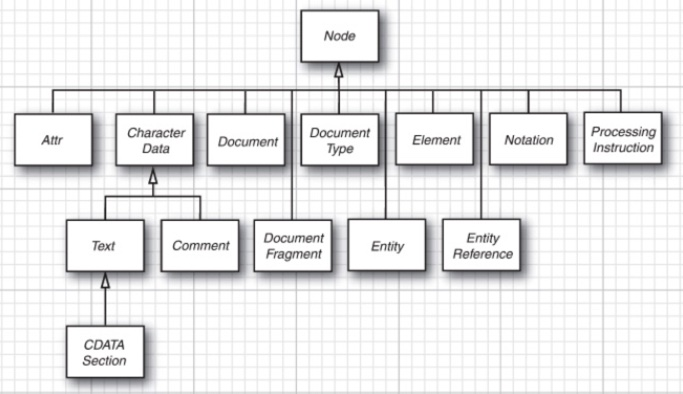
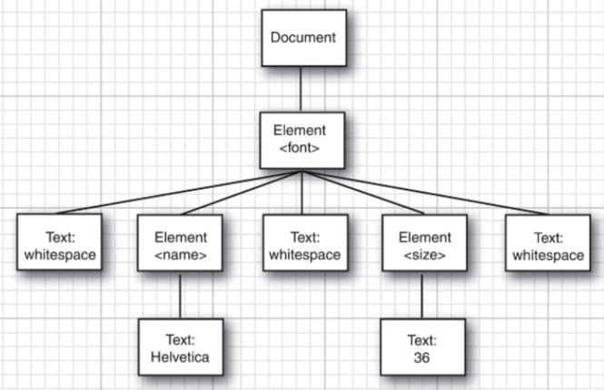
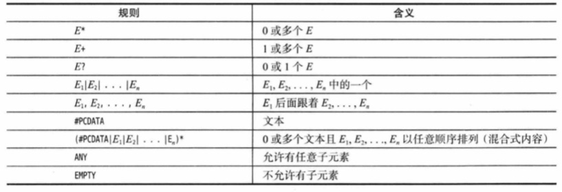
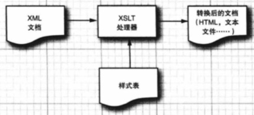

# 3.XML

[TOC]


**可扩展标记语言(Extensible Markup Language, XML)** 是一种非常有用的描述结构化信息的技术。XML工具使处理和转化信息变得十分容易。但是，XML并不是万能药，我们需要领城相关的标准和代码库才能有效地使用 XML。从20 世纪90年代末以来，IBM、Apache 和其他许多公司一直在帮助开发用于 XML 处理的高质量 Java 库，其中大部分重要的代码库都整合到了 Java 平台中。


## 3.1 XML 概述

在第1卷第7章种，我们使用过属性文件(property file)来描述程序配置。属性文件包含了一组名/值对。可以用 Properties 类读入这样的属性文件。但是在许多情况下，想要描述的信息结构较为复杂，属性文件并不能很好的处理。例如，要描述一种字体，它的标题和正文采取不同的格式和大小，那么属性文件通常是这样描述的：

```java
title.fontname = Helvetica
title.fontsize = 36
body.fontname = Times Roman
body.fontsize = 12
```

属性文件的另一个缺点是它的键是唯一的，如果要存放一个数组，那么就需要使用一种变通方法：

```java
menu.item.1 = Times Toman
menu.item.2 = Helvetica
menu.item.3 = ...
```

XML格式解决了这些问题，因为它能够表示层次结构，这比属性文件的平面表结构更灵活。

描述程序配置的 XML 文件可能会像这样：

```java
<config>
	<entry id="title">
		<font>
			<name>Helvetica</name>
			<size>36</size>
		</font>
	</entry>
	<entry id="body">
		<font>
			<name>Times Roman</name>
			<size>12</size>
		</font>
	</entry>
	<entry id="background">
		<color>
			<red>0</red>
			<green>50</green>
			<blue>100</blue>
		</color>
	</entry>
</config>
```

XML 格式能够表达层次结构，并且重复的元素不会被曲解。

正如上面看到的，XML文件的格式非常直观，它与 HTML 文件非常相似。这是有原因的，因为 XML 和 HTML 格式是古老的标准通用标记语言（Standard Generalized Markup Language, SGML) 的行生语言。

尽管 HTML 和 XML 同宗同源，但是两者之间存在着重要的区别：

+ 与HTML不同，XML 是大小写敏感的。例如，\<H> 和 \<h1\> 是不同的 XML 标签。
+ 在 HTML中，如果从上下文中可以分清哪里是段落或列表项的结尾，那么结束标签(如\</p\>）就可以省略，而在XML中结束标签绝对不能省略。
+ 在XML中，只有单个标签而没有相对应的结束标签的元素必须以/结尾，比如 \。这样，解析器就知道不需要查找 \</img\> 标签了。
+ 在XML中，属性值必须用引号括起来。在HTML中，引号是可有可无的。例如，\<applet code="MyApplet.class" width=300 height=300\> 对 HTML 来说是合法的、但是对 XML 来说则是不合法的。在XML中，必须使用引号，比如，width="300"。
+ 在 HTML 中，属性名可以没有值。例如，<input type="radio" name="language" value="Java"
    checked\>。在 XML中，所有属性必须都有属性值。比如，checked="true" 或 checked="checked"。


## 3.2 XML 文档的结构

### 3.2.1 文档头

XML 文档应当以一个**文档头**开始，例如：

```
<?xml version="1.0"?>
```

或者
```
<?xml version="1.0" encoding="UTF-8”?>
```

严格来说，文档头是可选的，但是推荐使用文档头。

### 3.2.2 文档类型定义

文档头之后通常是**文档类型定义 (Document Type Definition, DTD)**，例如：
```
<!DOCTYPE web-app PUBLIC
	"-//Sun Microsystems, Inc.//DTD Web Application 2.2//EN"
	"http://java.sun.com/j2ee/dtds/web-app_2_2.dtd">
```

文档类型定义是确保文档正确的一个重要机制，但是它不是必需的。我们将在本章的后面讨论这个问题。

### 3.2.3 文档正文

最后，XML文档的正文包含根元素，根元素包含其他元素。元素可以有子元素（child element)、文本或两者皆有。在下面的例子中，font 元素有两个子元素，它们是 name 和 size。name 元素包含文本 "Helvetica"。

```
<?xml version="1.0"?>
<!DOCTYPE config ...>
<config>
	<entry id="title">
		<font>
			<name>Helvetica</name>
			<size>36</size>
		</font>
	</entry>
	...
</config>
```

>提示：在设计XML文档结杓时，最好让元素要么包含子元素，要么包含文本。换句话说，你应该避免下面的情况：
>```
><font>
>	Helvetica
>	<size>36</size>
></font>
>```
>
>
>在XML 规范中，这叫作混合式内容(mixed content)。在本章中，稍后你将会看到，如果避免了混合式内客，就可以简化解析过程。

XML 元素可以包含属性，例如：
```
<size unit="pt">36</size>
```

何时用元素，何时用属性，在 XML设计人员中存在一些分歧。例如，将 font 做如下描述：
```
<font name= "Helvetica" size="36"/>
```

似乎比下面的描述更简单一些：
```
<font>
	<name>Helvetica</name>
	<size>36</size>
</font>
```

但是，属性的灵活性要差很多。假设你想把单位添加到 size 的值中去，如果使用属性，那么就必须把单位添加到属性值中去：
```
<font name="Helvetica" size="36 pt"/>
```

现在必须对字符串"36 pt"进行解析，而这正是 XML 被设计用来避免的那种麻烦。

而向 size 元素中添加一个属性看起来会清晰得多：
```
<font>
	<name>Helvetica</name>
	<size unit="pt">36</size>
</font>
```


一条常用的经验法则是，属性只应该用来修改值的解释，而不是用来指定值。

>注释：在 HTML 中，属性的使用规则很简单：凡是不显示在网页上的都是属性。例如在下面的超链接中：
>```
><a href="http://java.sun.con">Java Technologye</a>
>```
>
>
>宇符串 Java Technology 要在网页上显示，但是这个链接的 URL 并不是显示页面的一部分。然而，这个规则对于大多数XML并不那么管用，因为 XML 文件中的数据并非像通常意义那样是让人浏览的。

元素和文本是 XML 文档主要的支撑要素，你可能还会遇到的其他一些标记，说明如下：

+ 字符引用(character reference) 的形式是 "&#十进制值" 或 "&#x十六进制值"。例如，字
+ 实体引用(entity reference) 的形式是 &name。 例如 &lt,&gt 的含义分别为小于，大于。
+ CDATA 部分(CDATA Section) 用 \<![CDATA[ 和 ]]\>来限定其界限。它们是字符数据的一种特殊形式。术语 CDATA 指的是不应由 XML 解析器进行解析的文本数据(Unparsed Character Data)。在 XML 元素中，"<" 和 "&" 是非法的。"<" 会产生错误，因为解析器会把该字符解释为新元素的开始。"&" 也会产生错误，因为解析器会把该字符解释为字符实体的开始。因此，如果字符串中有这两种字符，就可以使用CDATA来表示。例如：\<![CDATA[< & > are my favorite delimiters]]\> 。另外，CDATA 部分不能包含字符串"]]>"，因为这是CDATA结束的标志。使用这一特性时要特别小心，因为它常用来当作将遗留数据偷偷纳入 XML文档的一个后门。
+ 处理指令(processing instruction) 是那些专门在处理 XML文档的应用程序中使用的指令，它们由＜? 和 ?> 来限定其界限，例如：\<?xml-stylesheet href="mystyle.css" type="text/css"?\> 。
+ 注释(comment)用 <!- 和 --> 限定其界限，例如：\<!--This is a comment.--\> 。注释不应该含有字符串"--"。注释只能是给文档的读者提供的信息，其中绝不应该含有隐藏的命令，命令应该是用处理指令来实现。


## 3.3 解析 XML 文档

要处理 XML 文档，就要先解析(parse)它。解析器是这样一个程序：它读入一个文件，确认这个文件具有正确的格式，然后将其分解成各种元素，使得程序员能够访问这些元素。

Java 库提供了两种 XML 解析器：

+ 像 **文档对象模型(Document Object Model,DOM) **解析器这样的**树型解析器(tree
    parser)**，它们将读入的 XML 文档转换成树结构。
+ 像 **XML简单API(Simple API for XML, SAX)** 解析器这样的**流机制解析器(streaming
    parser)**，它们在读入 XML 文档时生成相应的事件。


DOM 解析器对于实现我们的大多数目的来说都更容易一些，所以我们首先介绍它。如果要处理很长的文档，用它生成树结构将会消耗大量内存，或者如果想要获取某些元素，而不关心它们的上下文，那么在这些情况下应该考虑使用流机制解析器。更多的信息可以查看3.7节。

DOM 解析器的接口已经被 W3C 标准化了。org.w3c.dom 包中包含了这些接口类型的定义，比如：Document 和 Element 等。不同的提供者，比如 Apache 组织和 IBM，都编写了实现这些接口的 DOM 解析器。**Java XML 处理 API (Java API for XML Processing, JAXP)** 库使得我们可以以插件形式使用这些解析器中的任意一个。但是 JDK 中也包含了从 Apache 解析器导出的 DOM 解析器。


### 3.3.1 DocumentBuilder

要读入一个 XML 文档，首先需要一个 DocumentBuilder 对象，可以从 DocumentBuilderFactory 中得到这个对象。

```java
DocumentBuilderFactory factory = DocumentBuilderFactory.newInstance();
DocumentBuilderFactory builder = factory.newDocumentBuilder();
```

### 3.3.2 Document

#### 3.3.2.1 Document 的获取

现在，可以从一个 DocumentBuilder 读入一个文档。

```java
File f = ...;
Document doc = builder.parse(f);
```

或者，可以用一个URL：

```java
URL u = ...;
Document doc = builder.parse(u);
```

甚至可以指定任意一个输入流：

```java
InputStrea in = ...;
Document doc = builder.parse(in);
```

>注意，如果使用输入流作为输入源，那么对于那些以该文档的位置为相对路径而被引用的文档，解析器将无法定位，比如在同一个目录中的 DTD。但是，可以通过安装一个“实休解析器”(entity resolver） 来解决这个问题。具体略。

Document 对象是 XML 文档的树型结构在内存中的表示方式，它由实现了 Node 接口及其各种子接口的类的对象构成。下图显示了各个子接口的层次结构。




#### 3.3.2.2 getDocumentElement 方法

可以通过调用 getDocumentElement 方法来启动对文档内容的分析，它将返回根元素。
```java
Element root = doc.getDocumentElement();
```

例如，如果要处理下面的文档：
```
<?xml version="1.0"?>
<font>
	...
</font>
```

那么，调用 getDocumentElenent 方法可以返回 font 元素。

#### 3.3.2.3 getTagName 方法

getTagName 方法可以返回元素的标签名。在前面这个例子中，root.getTagName() 返回字符串"font"。


#### 3.3.2.4 getChildNodes 方法

如果要得到该元素的子元素(可能是元素、文本、注释或其他节点)，可以使用 get.ChildNodes 方法，这个方法会返回一个类型为 NodeList 的集合。这个类型在标准的 Java 集合类创建之前就已经被标准化了，因此它具有一种不同的访问协议；item 方法将得到指定索引值的项；getLength 方法则提供了项的总数。因此，我们可以像下面这样枚举所有子元素：

```java
NodeList children = root.getChildNodes();
for (int i = 0; i<children.getLength(); i++)
{
	Node child = children.item(i);
    ...
}
```

分析子元素时要很仔细。例如，假设我们正在处理以下文档：
```
<font>
	<name>Helvetica</name>
	<size>36</size>
</font>
```

我们预期 font 有两个子元素，但是实际上解析器甚至会解析标签之间的空白字符，因此它会报告说有5个：

+ \<font\> 和 \<name\> 之间的空白字符
+ name 元素
+ \</name\> 和 \<size\> 之间的空白字符
+ size 元素
+ \</size\> 和\</font\> 之间的空白字符

下图显示了其 DOM 树：



如果只希望得到子元素，那么可以忽略空白字符，下面的代码可以过滤空白字符构成的元素。

```java
for (int i = 0; i < children.getLength(); i++)
{
	Node child = children.item(i);
	if (child instanceof Element)
    {
        var childElement = (Element) child;
        ...
    }
}
```

在下一节中将介绍，如果你的文档有 DTD，那么你就可以做得更好。这时，解析器知道哪些元素没有文本节点的子元素，而且它会帮你剔除空白字符。

#### 3.3.2.5 getFirstChild & getData 方法

在分析 name 和 size 元素时，你肯定想获取它们包含的文本字符串。这些文本字符串本身都包含在 Text 类型的子节点中。既然知道了这些 Text 节点是唯一的子元素，就可以用 getFirstChild 方法而不用再遍历另一个 NodeList。然后可以用 getData 方法获取存储在 Text 节点中的字符串。

```java
for (int i 0; i < children.getLength(); i++)
{
    Node child = children.item(i);
	if (child instanceof Element)
	{
		var childElement = (Element) child;
		var textNode = (Text)childElement.getFirstChild();
		String text = textNode.getData().trim();
		if (childElenent.getTagNane().equals("name"))
            name = text;
		else if (childElement.getTagName().equals("size"))
			size = Integer.parseInt(text);
    }
}
```

>提示：对 getData 的返回值调用 trim 方法是个好主意。如果 XML 文件的作者将起始和结束的标签放在不同的行上，例如：
>```
><Size>
>36
></size>
>```
>
>那么，解析器将会把所有的换行符和空格都包含到文本节点中去。调用 trin方法可以把位于实际数据前后的空白字符删掉。


#### 3.3.2.6 getLastChild & getNextSibling 方法

也可以用 getLastChild 方法得到最后一项子元素，用 getNextSibling 得到下一个兄弟节点。这样，另一种遍历子节点集的方法就是：

```java
for(Node childNode = element.getFirstChild(); childNode != null;
	childNode = childNode.getNextSibling())
{
    ...
}
```


#### 3.3.2.7 getAttributes 方法

如果要枚举节点的属性，可以调用 getAttributes 方法。它返回一个 NamedNodelMap 对象，其中包含了描述属性的 Node 对象。可以用和遍历 NodeList 一样的方式在 NamedNodeMap 中遍历各子节点。然后，调用 getNodeName 和 getNodeValue 方法可以得到属性名和属性值。

```java
NamedNodeMap attributes = element.getAttributes(); 
for (int i= 0; i< attributes.getLength); i++)
{
    Node attribute = attributes.item(i);
	String name = attribute.getNodeName();
	String value = attribute.getNodeValue();
    ...
}
```

或者，如果知道属性名，则可以直接获取相应的属性值：
```java
String unit = element.getAttribute("unit");
```


## 3.4 验证 XML 文档

在前一节中，我们了解了如何遍历 DOM 文档的树形结构。然而，如果仅仅按照这种方法来操作，会发现需要大量冗长的编程和错误检查工作。不但需要处理元素间的空白字符，还要检查该文档包含的节点是否和期望的一样。

幸好，XML 解析器的一个很大的好处就是它能自动校验某个文档是否具有正确的结构。这样，解析就变得简单多了。例如，如果知道 font 片段已经通过了验证，那么不用进一步检查就能得到其两个孙节点，并把它们转换成 Text 节点，得到它们的文本数据。

如果要指定文档结构，可以提供一个文档类型定义(DTD)或一个 XML Schema 定义。DTD 或 schema 包含了用于解释文档应如何构成的规则，这些规则指定了每个元素的合法子元素和属性。例如，某个 DTD 可能含有一项规则：

```
<!ELEMENT font (name,size)>
```

这项规则表示，一个 font 元素必须总是有两个子元素，分别是 name 利 size。

将同样的约束用 XML Schema 表示如下：
```
<xsd:element name="font">
	<xsd:sequence>
		<xsd:element name="name" type="xsd:string"/>
		<xsd:element name="size" type="xsd:int"/>
	</xsd:sequence>
</xsd:element>
```


与 DTD 相比，XML Schema 可以表达更加复杂的验证条件（比如 size 元素必须包含一个整数）。与 DTD 语法不同，XML Schema 自身使用的就是 XML，这为处理 Schema 文件带来了方便。


### 3.4.1 文档类型定义 DTD

提供 DTD 的方式有多种。可以像下面这样将其直接纳入到 XML 文档中：
```
<?xml version="1.0"?>
<!DOCTYPE config [
	<!ELEMENT config ...>
	... more rules
]>
<config>
...
</config>
```

在XML 文档内部提供 DTD 不是很普遍，因为 DTD 会使文件长度变得很长。把 DTD存储在外部会更好，SYSTEM 声明可以用来实现这个目标。可以指定一个包含 DTD 的 URL 例如：

```
<!DOCTYPE config SYSTEM "config.dtd">
<!DOCTYPE config SYSTEM "http://myserver.com/config.dtd">
```

既然知道解析器怎样定位 DTD 了，那么下面就让我们来看看不同种类的规则。

ELEMENT 规则用于指定某个元素可以拥有什么样的子元素。可以指定一个正则表达式，它由下图中所示的组成部分构成。



下面是一些简单而典型的例子。下面的规则声明了 menu 元素包含0或多个 item 元素：
```
<!ELEMENT menu (item)*>
```

下面这组规则声明 font 是用一个 name 后跟一个 size 来描述的，它们都包含文本：
```
<!ELEMENT font (name,size)>
<!ELEMENT name （#PCDATA)>
＜!ELEMENT size (#PCDATA)>
```

>注释：实际上，在 DTD 规则中并不能为元素指定任意的正则表达式，XML 解析器会拒绝某些导致非确定性的复杂规则。例如，正则表达式((x,y)｜(x,z)）就是非确定性的。当解析器看到x时，它不知道在两个选择中应该选取哪一个。这个表达式可以改写成确定性的形式，如(x,(ylz))。然而，有一些表达式不能被改写，如（(x,y)*|x?)。JavaXML 库中的解析器在遇到有歧义的 DTD 时，不会给出警告。在解析时，它仅仅在两者中选取第一个匹配项，这将导致它会拒绝一些正确的输入。当然，解析器有权这么做，因为 XML 标准允许解析器假设 DTD 都是非二义性的。

还可以指定描述合法的元素属性的规则，这里不展开介绍。

假设我们的 DTD 已经写好了文档规范，现在我们可以让解析器利用它了。

首先，通知文档生成工厂打开验证特性。

```java
factory.setValidating(true);
```

这样，该工厂生成的所有文档生成器都将根据 DTD 来验证它们的输入。验证的最大好处是可以忽略元素内容中的空白字符。例如，一旦 DTD 指定了 font 的子元素是 (name, size)，解析器就知道它们之间的空白字符不是文本。调用下面的代码，生成器将不会报告文本结点中的空白字符。

```java
factory.setIgnoringElementContentWhitespace(true);
```

如此一来，访问 font 节点的代码就简单多了：

```java
var nameELement = (ELement) children.item(0); 
var sizeElement = (Element) children.item(1);
```

当解析器报告错误时，应用程序希望对该错误执行某些操作。例如，记录到日志中，把它显示给用户，或是抛出一个异常以放弃解析。因此，只要使用验证，就应该安装一个错误处理器，这需要提供一个实现了ErrorHandler 接口的对象。

```java
package org.xml.sax;
public interface ErrorHandler {
    
    public abstract void warning (SAXParseException exception)
        throws SAXException;

    public abstract void error (SAXParseException exception)
        throws SAXException;

    public abstract void fatalError (SAXParseException exception)
        throws SAXException;

}
```

可以通过 DocumentBuilder 类的 setErrorHandler 方法来安装错误处理器：
```java
builder.setErrorHandler(handler);
```


### 3.4.2 XML Schema

因为 XML Schema 比起 DTD 语法要复杂许多，所以我们只涉及其基本知识。更多信息请参考 http://www.w3.org/TR/xmlschema-0 上的指南。

如果要在文档中引用 Schema 文件，需要在根元素中添加属性，例如：
```
<?xml version="1.0"?>
<config xmlns:xsi="http://www.w3.org/2001/XMLSchema-instance"
	xsi:noNamespaceSchemaLocation="config.xsd">
	...
</config>
```

这个声明说明 Schema 文件 config.xsd 会被用来验证该文档。如果使用命名空间，语法就更加复杂了。详情请参见 XML Schema 指南（前缀 xsi是一个命名空间别名 (namespace alias)，请查看3.6节以了解更多信息）。

Schema 为每个元素和属性都定义了类型。类型中的简单类型是对内容有限制的字符串，其他都是复杂类型。具有简单类型的元素可以没有任何属性和子元素。否则，它就必然是复杂类型。与此相反，属性总是简单类型。一些简单类型已经被内建到了 XML Schema 内，包括：

```
xsd:string
xsd:int
xsd:boolean
```

>我们用前缀 xsd：来表示 XSL Schema 定义的命名空间。一些作者代之以xs:。

在定义元素时，可以指定它的类型：

```
<xsd:element name="name" type="xsd:string"/>
<xsd:element name="size" type="xsd:int"/>
```

更多的内容不再展开。


## 3.5 使用 XPath 来定位信息

如果要定位某个 XML 文档中的一段特定信息，那么，通过遍历 DOM树的众多节点来进行查找会显得有些麻烦。XPath 使得访问树节点变得很容易。例如，假设有如下HTML 文档：

```
<html>
	<head>
		...
		<title>...</title
		...
	</database>
	...	
</html>
```

可以通过对 XPath 表达式 "/html/head/title/text()" 求值来得到标题的文本。

XPath 可以描述 XML 文档中的一个节点集，例如，XPath "/html/body/form" 描述了 XHTML 文件中 body 元素的子元素中所有的 fom 元素。可以用[ ]操作符来选择特定元素："/html/body/form[1]" 。这表示的是第一个 form(索引号从1开始)。

使用@操作符可以得到属性值。XPath 表达式 "/html/body/form[1]/@action" 描述了第一个表中的 action 属性。XPath 表达式 "/html/body/form/@action" 描述了 body 元素的子元素中所有 form 元素的所有 action 属性节点。

要计算 XPath 表达式，首先需要从 XPathFactory 创建一个 XPath 对象，然后调用 evaluate 方法来计算 XPath 表达式，可以用同一个 XPath 对象来计算多个表达式。

```java
XPathFactory xpfactory = XPathFactory.newInstance();
path = xpfactory.newXPath();
String username = path.evaluate("/html/head/title/text()", doc);
```


## 3.6 使用命名空间

Java 语言使用包来避免名字冲突。程序员可以为不同的类使用相同的名字，只要它们不在同一个包中即可。XML 也有类似的命名空间(namespace)机制，可以用于元素名和属性名。

名字空间是由统一资源标识符(Uniform Resource Identifier，URI) 来标识的，比如：
```
http://ww.w3.org/2001/XMLSchema
uuid:1c759aed-b748-475c-ab68-10679700c4f2
urn:com:books-r-us
```

HTTP 的 URL 格式是最常见的标识符。注意，URL只用作标识符字符串，而不是一个文件的定位符。例如，名字空间标识符：

```
http://www.horstmann.com/corejava
```

只是表示了一个命名空间，XML解析器不会尝试去该处查找任何东西。然而，为了给可能会遇到不熟悉的命名空间的程序员提供一些帮助，人们习惯于将解释该命名空间的文档放在 URL 位置上。例如，如果用浏览器搜索XML Schema 的命名空间 URL (http://ww.w3.org/2001/XMLSchema)，就会发现一个描述 XML Sehema 标准的文档。

在使用时，只需要把名字空间标识符放入元素的 xmlns 属性即可。

```
<element xmlns="namespaceURI">
	children
</element>
```

现在，该元素和它的子元素都是给定名字空间的一部分了。

另外，名字空间可以嵌套。

第二种使用名字空间的方法是，定义一个前缀来代替完整的名字空间标识符。

```
<xsd:schema xmlns:xsd="http://ww.w3.org/2001/XMLSchema">
<xsd:/schema>
```

这里，xmlns:xsd="http://ww.w3.org/2001/XMLSchema" 表示为这个名字空间起了前缀别名 xsd，而这个xsd被用在了 schema 标签上，这个标签是 XML Schema 的根元素，所以整个 XML Schema 都在名字空间 xsd 下。


## 3.7 流机制解析器

DOM 解析器会完整地读入 XML 文档，然后将其转换成一个树形的数据结构。对于大多数应用，DOM 都运行得很好。但是，如果文档很大，并且处理算法又非常简单，可以在运行时解析节点，而不必看到完整的树形结构，那么 DOM 可能就会显得效率低下了。在这种情况下，我们应该使用流机制解析器(streaming parser)。

在下面的小节中，我们将讨论 Java 类库提供的流机制解析器：老而弥坚的SAX解析器和添加到 Java 6 中的更现代化的 StAX 解析器。

### 3.7.1 使用 SAX 解析器

SAX 解析器在解析 XML输入数据的各个组成部分时会报告事件，但不会以任何方式存储文档，而是由事件处理器建立相应的数据结构。实际上，DOM 解析器是在SAX 解析器的基础上构建的，它在接收到解析器事件时构建 DOM树。

在使用 SAX 解析器时，需要一个处理器来为各种解析器事件定义事件动作。ContentHandler 接口定义了若干个在解析文档时解析器会调用的回调方法。下面是最重要的几个：

+ startElement 和 endElenent 在每当週到起始或终止标签时调用。
+ characters 在每当遇到字符数据时调用。
+ startDocument 和 endDocument 分别在文档开始和结束时各调用一次。

例如，在解析以下片段时：
```
<font>
	<name>Helvetica</name>
	<size units="pt">36</size>
</font>
```


解析器会产生以下回调：

1. startElement，元素名：font
2. startElement. 元素名：name
3. characters，内容：Helvetica
4. endELement，元素名：name
5. startElement，元素名：size，属性：units="pt"
6. characters，内容：36
7. endELement，元素名：Size
8. endElement，元素名：font

处理器必须覆盖这些方法，让它们执行在解析文件时我们想要让它们执行的动作。例如，一个爬虫程序可能只关心所有链接 \<a href="..."\>，那么就可以在 startElement 方法中检查带有 href 属性的 a 元素。

下面是如何得到 SAX 解析器的代码：

```java
SAXParserFactory factory = SAXParserFactory.newInstance(); 
SAXParser parser = factory.newSAXParser();
```

现在可以处理文档了：

```java
parser.parse(source, handler);
```

这里的 source 可以是一个文件、一个 URL 字符串或者是一个输入流。handler属于 DefaultHandler 的一个子类，DefaultHandler 类为以下四个接口定义了空的方法：

+ ContentHandler
+ DTDHandler
+ EntityResolver
+ ErrorHandler

下面的代码定义了一个处理器，它覆盖了 ContentHandler 接口的 startElement 方法，以观察带有 href 属性的a元素。 

```java
var handler = new DefaultHandler()
{
	public void startElement(String namespaceURI, String lname, String qnane,
    	Attributes attrs) throws SAXException
    {
		if (lname.equalsIgnoreCase("a") && attrs != null)
		{
			for (int i=0; i < attrs.getLength(); i++)
            {
                String aname = attrs.getLocalName(i):
				if (aname.equalsIgnoreCase("href"))
					System.out.println(attrs.getValue(i));
            }
        }
    }
);
```

startElement 方法有3个描述元素名的参数，其中 qname 参数以 prefix:localname 的形式报告限定名。如果命名空间处理特性已经打开，那么 namespaceURI 和 lnane 参数提供的就是命名空间和本地（非限定）名。


### 3.7.2 使用 StAX 解析器

StAX 解析器是一种“拉解析器”(pull parser)，与安装事件处理器不同，你只需使用下面这样的基本循环来迭代所有的事件：

```java
InputStream in = url.openStream();
XMLInputFactory factory = XMLInputFactory.newInstance();
XMLStreamReader parser = factory.createXMLStreamReader(in);
while(parser.hasNext())
{
	int event = parser.next();
	// Call parser methods to obtain event details
}
```

例如，在解析下面的片段时
```
<font>
	<name>Helvetica</name>
	<size units="pt">36</size)
</font>
```


解析器将产生下面的事件：

1. START_ELEMENT， 元素名：font
2. CHARACTERS， 内容：空白字符
3. START_ELEMENT，元素名：name
4. CHARACTERS，内容：Helvetica
5. END_ELEMENT， 元素名：name
6. CHARACTERS， 内容：空白字符
7. START_ELEMENT，元素名：size
8. CHARACTERS， 内容：36
9. END_ELEMENT，元素名： size
10. CHARACTERS，内容：空白字符
11. END_ELEMENT，元素名：font

要分析这些属性值，需要调用 XMLStreamReader 类中恰当的方法，例如：
```
String units = parser.getAttributeValue(null, "units")；
```


## 3.8 生成 XML 文档

现在我们已经知道怎样编写读取 XML 的 Java 程序了。下面让我们开始介绍它的反向过程，即输出 XML 文档。当然，你可以直接通过一系列 print 调用，打印出各元素、属性和文本内容，以此来编写 XML 文件，但这并不是一个好主意。这样的代码会非常元长复杂。更好的方式是用文档的内容构建一棵 DOM 树，然后再写出该树的所有内容。下面的小节将讨论其细节。


### 3.8.1 不带命名空间的文档

要建立一棵 DOM树，可以从一个空的文档开始。通过调用 DocumentBuilder 类的 newDocument 方法可以得到一个空文档。

```java
Docunent doc = builder.newDocument();
```

使用 Document 类的 createElement 方法可以构建元素结点，使用 appendChild 方法可以为元素增加子元素，使用 createTextNode 方法可以构建文本结点。使用 Element 元素的setAttribute 方法可以为元素设置属性。

```java
Element rootElement = doc.createElement(rootName); // 创建一个元素
Element childElement = doc.createElement(childName);  // 创建一个元素
Text textNode = doc.createTextNode(textContents); // 创建一个文本结点
doc.appendChild(rootElement); // 给文档添加一个根元素
rootElement.appendChild(childElement); // 给根元素添加一个子元素
childElement.appendChild(textNode); // 给子元素再添加一个子文本结点
rootElement.setAttribute(name, value); // 为根元素设置属性，名称为name，值为value
```


### 3.8.2 带命名空间的文档

如果要使用命名空间，那么创建文档的过程就会稍微有些差异。首先需要将生成器工厂设置为是命名空间感知的，然后创建生成器：

```java
DocumentBuilderFactory factory = DocumentBuilderFactory.newInstance);
factory.setNamespaceAware(true);
builder = factory.newDocumentBuilder();
```

再使用 createElementNS 而不是 createElement 来创建所有节点：
```java
String namespace = "http://www.w3.org/2000/swg";
Elenent rootELement = doc.createElementhS(namespace,"svg");
```

如果需要设置元素属性的名字位于命名空间中，那么可以使用 Element 类的 setAttributeNS 方法：
```java
// qualifiedName 为属性名，value 为属性值
rootElement.setAttributeNS(namespace, qualifiedName, value);
```


### 3.8.3 写出文档

有些奇怪的是，把DOM树写出到输出流中并非一件易事。最容易的方式是使用可扩展的样式表语言转换(Extensible Stylesheet Language Transformations, XSLT) API。关于 XSLT的更多信息请参见 3.9节。

本节我们使用 Transformer 类进行输出。

```java
Transformer t = TransformerFactory.newInstance().newTransformer();
// set output properties to get a DOCTYPE node
t.setOutputProperty(OutputKeys.DOCTYPE_SYSTEM, systemIdentifier); t.setOutputProperty(OutputKeys.DOCTYPE_PUBLIC, publicIdentifier); 
// set indentation
t.setOutputProperty(OutputKeys.INDENT,"yes");
t.setOutputProperty(OutputKeys.METHOD, "xml");
t.setOutputProperty("{http://xmL.apache.org/xslt}indent-amount","2");
// apply the do-nothing transformation and send the output to file
t.transform(new DOMSource(doc), new StreamResult(new FileOutputStream(file)));
```


### 3.8.4 使用 StAX 写出文档

在前一节中，你看到了如何通过写出 DOM树的方法来产生 XML文件。如果这个 DOM 树没有其他任何用途，那么这种方式就不是很高效。StAX API使我们可以直接将 XML 树写出，这需要从某个 OutputStream 中构建一个XMLStreamwriter，就像下面这样：

```java
XMLOutputFactory factory = XMLOutputFactory.newInstance();
XMLStreamWriter writer = factory.createXMLStreamWriter(out);
```

要产生 XML 文件头，需要调用：

```java
writer.writeStartDocument()
```

要添加元素，需要调用：

```java
writer.writeStartElement(name);
```

此时，我们处在新建的元素中，要添加属性则调用：

```java
writer.writeAttribute(name, value);
```

现在，可以通过再次调用 writeStartElement 添加新的子节点，或者用下面的调用写出字符：
```java
writer.writeCharacters(text);
```

在写完所有子节点之后，可以如下关闭元素：
```java
writer.writeEndELement();
```


这会导致当前元素被关闭。

要写出没有子节点的元素（例如 \), 可以使用下面的调用：
```java
writer.writeEmptyElement(name);
```

在文档的结尾，调用：
```java
writer.writeEndDocument();
```

最后，需要关闭 XMLStreamWriter，并且需要人为关闭它，因为 XMLStreamWriter 接口没有扩展 AutoCloseable 接口。 


## 3.9 XSL 转换

XSL转换(XSLT)机制可以指定将 XML文档转换为其他格式的规则，例如，转换为纯文本、XHTML 或任何其他的XML格式。XSLT 通常用来将某种机器可读的 XML 格式转译为另一种机器可读的 XML格式，或者将 XML 转译为适于人类阅读的表示格式。

使用XSL转换需要提供 XSLT 样式表，它描述了 XML文档向某种其他格式转换的规则。XSLT 处理器将读入 XML 文档和这个样式表，并产生所要的输出。如下图所示：



XSLT规范很复杂，已经有很多的相关资料，这里不详细展开。


