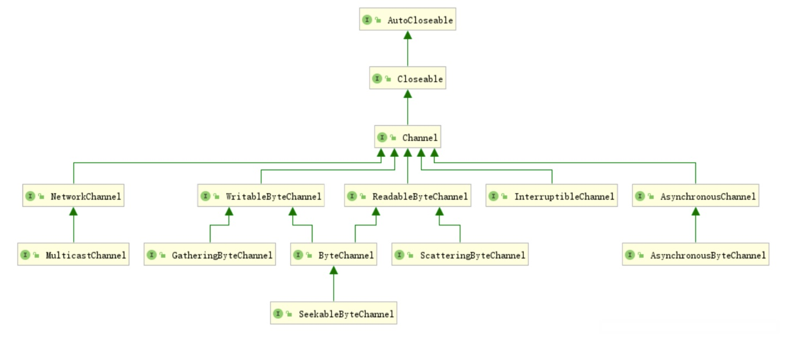

# 4.网络

[TOC]


本章的开头部分将首先回顾一下网络方面的基本概念，然后进一步介绍如何编写连接网络服务的 Java 程序，并演示网络客户端和服务器是如何实现的，最后将介绍如何通过 Java 程序发送 E-mail，以及如何从 Web 服务器获得信息。


## 4.1 连接到服务器

### 4.1.1 使用 telnet

telnet 是一种用于网络编程的非常强大的调试工具，可以在命令 shell 中输入 telnet 来启动它。例如下面的例子：

```shell
telnet time-a.nist.gov 13
```

>在 Windows 中，需要激活 telnet。要激活它，需要到“控制面板”，选择“程序”，点击“打开/关闭 Windows 特性”，然后选择“Telnet 客户瑞”复选框。Windows防火墙将会阻止我们在本章中使用的很多网络端口，你可能需要管理员账户才能解除对它们的禁用。
>
>在 macOS 中，需要下载安装 telnet。

上面这个命令连接到了大多数 UNIX 计算机都支持的“当日时间”服务，所连接的服务器由国家标准与技术研究所所维护，这家研究所负责提供铯原子钟的计量时间。当然，由于网络延迟，反馈回来的时间有一定延迟。

按照惯例，当日时间服务总是连接到端口13。

运行在远程计算机上的服务器软件不停地等待那些希望与端口13连接的网络请求。当远程计算机上的操作系统接收到一个请求与端口13连接的网络数据包时，它便唤醒正在监听网络连接请求的服务器进程，并为两者建立连接。这种连接将一直保持下去，直到被其中任何一方中止。

当你开始用 tine-a.nist.gov 在端口13 上建立 telnet 会话时，telnet 会先通过DNS服务将字符串“ tine-a.nist.gov” 转换为正确的IP 地址129.6.15.28。随后，telnet软件发送一个连接请求给该地址，请求一个到端口13的连接。一旦建立连接，远程程序便发送回一行数据，然后关闭该连接。当然，一般而言，客户端和服务器在其中一方关闭连接之前，会进行更多的对话。


### 4.1.2 用 Java 连接到服务器

下面的代码是我们的第一个网络程序。它的作用与我们使用 telnet 工具是相同的，即连接到某个端口并打印出它所找到的信息。

```java
package socket;
import java.io.*;
import java.net.*;
import java.nio.charset.*;
import java.util.*;

public class SocketTest
{
	public static void main(String[] args) throws IOException
    {
        try (Socket s = new Socket("time-a.nist.gov", 13);
             Scanner in = new Scanner(s.getInputStream(), StandardCharsets.UTF_8))
        {
            while(in.hasNextLine())
            {
                String line = in.nextLine();
                System.out.println(line);
            }
        }
    }
}
```

第11行代码用于打开一个套接字，它也是网络软件中的一个抽象概念，负责启动该程序内部和外部之间的通信。我们将远程地址和端口号传递给套接字的构造器，如果连接失败，它将抛出一个 UnknowntHostException 异常；如果存在其他问题，它将抛出一个 IOException 异常。因为 UnknownHostException 是 IOException 的一个子类，况且这只是一个示例程序，所以我们在这里直接抛出IOException。

在这个Socket构造方法中，其实隐含着bind方法，即该套接字将绑定本机的一个SocketAddress。

另外，Socket是使用TCP/IP机制进行通信的。

>为什么客户端不需要绑定端口号和ip？
>
>其实客户端也有自己的端口号和ip。但是有很多个客户端运行在这台机器上，而且这份代码也会在很多机器上运行，如果你想要客户端强行绑定端口号，那么就需要所有的公司进行协商，每个客户端使用不同的端口号。但这是不可能的。如果你强行让客户端绑定端口号，那么就极有可能引起冲突，使得某些客户端启动失败。
>但是服务器不一样，因为服务器一般只有一个，而且服务器一般是一个公司内部的东西，可以协商。而且服务器的端口号和ip地址必须是确定的，众所周知的，因为一台服务器连接着很多客户端，否则就可能找不到服务器。
>客户端也需要唯一性，但是不要求确定性。因此可以让操作系统来帮助我们分配端口号。因为端口号资源也有上限(16位)，操作系统需要管理端口号。所以哪些端口号没有被使用，只有操作系统知道。

一旦套接字被打开，java.net.Socket 类中的 getInputStream 方法就会返回一个 Inputstream 对象，该对象可以像其他任何流对象一样使用。一且获取了这个流，该程序将直接把每一行打印到标准输出。这个过程将一直持续到流发送完毕且服务器断开连接为止。

Socket 类非常简单易用，因为 Java 库隐藏了建立网络连接和通过连接发送数据的复杂过程。实际上，iava.net 包提供的编程接口与操作文件时所使用的接口基本相同。

```java
java.net.Socket

Socket(String host, int port)
InputStream getInputStream()
OutputStream getOutputStream()
```


### 4.1.3 套接字超时

从套接字读取信息时，在有数据可供访问之前、读操作将会被阻寒。如果此时主机不可达，那么应用将要等待很长的时间，并且因为受底层操作系统的限制而最终会导致超时。对于不同的应用，应该确定合理的超时值。然后调用 setSoTimeout 方法设置这个超时值（单位：毫秒)。

```java
Socket s = new Socket();
s.setSoTimeout(10000); // 10秒后超时
```

如果已经为套接字设置了超时值，并且读或写操作超过了时间限制，那么这些操作就会抛出SocketTineoutException 异常。你可以捕获这个异常，并对超时做出反应。

```java
try
{
    InputStream in = s.getInputStream(); // read from in
    ...
}
catch(SocketTimeoutException e)
{
    // react to timeout
}
```

另外还有一个超时问题是必须解决的。下面这个构造器：
```java
Socket(String host, int port)
```

会一直无限期地阻塞下去，直到建立了到达主机的连接或发生了错误为止。可以通过先构建一个无连接的套接字，然后再使用一个带超时的方法来进行连接。这里 InetSocketAddress 在后文介绍。

```java
Socket s = new Socket();
s.connect(new InetSocketAddress(host, port), timeout);
```


如果你希望允许用户在任何时刻都可以中断套接字连接，请查看 4.2.4节

```java
java.net.Socket

// 创建一个还未被连接的套接字
Socket()

// 将该套接字连接到给定的地址。
void connect(SocketAddress address)
    
// 将套接字连接到给定的地址。如果在给定的时间内没有响应，则返回。
void connect(SocketAddress, int timeoutInMilliseconds)

// 设置该套接字上读请求的阻塞时间。如果超出给定时间，则抛出一个 SocketTimeoutException 异常。
void setSoTimeout(int timeoutInMilliseconds)

// 如果该套接字已被连接，则返回 true
boolean isConnected()

// 如果该套接字已经关闭，则返回 true
boolean isClosed()
```


### 4.1.4 因特网地址 InetAddress

通常，不用过多考虑因特网地址的问题，它们是用一串数字表示的主机地址，一个因特网地址由4个字节组成（在 IPv6 中是16个字节)，比如129.6.15.28。但是，如果需要在主机名和因特网地址之间进行转换，那么就可以使用 InetAddress 类。

Java提供InetAddress类来封装IP地址或主机名。InetAddress类有两个子类:Inet4Address和Inet6Address，分别用于封装4个字节的IP地址和6个字节的IP地址。InetAddress内部对地址数字进行隐藏,用户不需要了解实现地址的细节，只需了解如何调用相应的方法即可。InetAddress类无构造方法,因此不能直接创建其对象，而是通过该类的静态方法创建一个InetAddress对象或InetAddress数组。

静态的 getByName 方法可以返回代表某个主机的 InetAddress 对象。例如:

```java
InetAddress address = InetAddress.getByName("time-a.nist.gov");
```

将返回一个 InetAddress 对象，该对象封装了一个 4 字节的序列：129.6.15.28。然后，可以通过 getAddress 方法来访问这些字节。

```java
byte[] addressBytes = address.getAddress();
```

一些访问量较大的主机名通常会对应于多个因特网地址，以实现负载均衡。例如，主机名 google.com 对应着12 个不同的因特网地址。当访问主机时，会随机选取其中的一个。可以通过调用 getAllByName 方法来获得所有主机地址：
```java
InetAddress[] addresses = InetAddress.getAllByName(host);
```

最后需要说明的是，有时我们可能需要本地主机的地址。如果只是要求得到 localhost 的地址，那总会得到本地回环地址127.0.0.1，但是其他程序无法用这个地址来连接到这台机器上。此时，可以使用静态的 getLocalHost 方法来得到本地主机的地址：
```java
InetAddress address = InetAddress.getLocalHost();
```

```java
java.net.InetAddress
static InetAddress getByName(String host)
static InetAddress getAllByName (String host)
// 为给定的主机名创建一个 InetAddress 对象，或者一个包含了该主机名所对应的所有因特网地址的数组。
    
static InetAddress getByAddress(byte[] addr)
// 通过原始的IP地址创建 InetAddress 对象，addr 可以包含ipv4或ipv6的地址，4或16字节，按照网络字节序，此方法不会阻塞，即不执行反向名称服务查找。
    
static InetAddress getLocalHost()
// 为本地主机创建一个 InetAddress 对象。

byte[] getAddress()
// 返回一个包含数字型地址的字节数组。

String getHostAddress()
// 返回一个由十进制数组成的字符串，各数字间用圆点符号隔开，例如，“129.6.15.28”

String getHostName()
// 返回主机名。
```


### 4.1.5 套接字地址 SocketAddress

只使用因特网地址不能将两个应用程序建立连接，还必须指定两台机器通信的端口。SocketAddress 是一个抽象类，它表示与协议无关的一个地址，用于连接两个应用程序，实现它的子类则与具体的协议有关。

```java
package java.net;
/**
 *
 * This class represents a Socket Address with no protocol attachment.
 * As an abstract class, it is meant to be subclassed with a specific,
 * protocol dependent, implementation.
 * <p>
 * It provides an immutable object used by sockets for binding, connecting, or
 * as returned values.
 *
 * @see java.net.Socket
 * @see java.net.ServerSocket
 * @since 1.4
 */
public abstract class SocketAddress implements java.io.Serializable {
    static final long serialVersionUID = 5215720748342549866L;
}
```


#### 4.1.5 InetSocketAddress

InetSocketAddress 是 SocketAddress 的实现子类，它依赖于IP协议。

它的内部类 InetSocketAddressHolder 维护了主机名 String，网络地址 InetAddress，以及端口号 int。

InetSocketAddress 有3个构造器：

```java
// 网络地址采取表示任何本地地址的网络地址，通常是0.0.0.0，端口号为port
public InetSocketAddress(int port)

// 网络地址为addr，端口号为port
public InetSocketAddress(InetAddress addr, int port)

// 网络地址为通过hostname获得的InetAddress，端口号为port
public InetSocketAddress(String hostname, int port)
```

其他的细节参考源代码：

```java
package java.net;

import java.io.IOException;
import java.io.InvalidObjectException;
import java.io.ObjectInputStream;
import java.io.ObjectOutputStream;
import java.io.ObjectStreamException;
import java.io.ObjectStreamField;

public class InetSocketAddress
    extends SocketAddress
{
    // Private implementation class pointed to by all public methods.
    private static class InetSocketAddressHolder {
        // The hostname of the Socket Address
        private String hostname;
        // The IP address of the Socket Address
        private InetAddress addr;
        // The port number of the Socket Address
        private int port;

        private InetSocketAddressHolder(String hostname, InetAddress addr, int port) {
            this.hostname = hostname;
            this.addr = addr;
            this.port = port;
        }

        private int getPort() {
            return port;
        }

        private InetAddress getAddress() {
            return addr;
        }

        private String getHostName() {
            if (hostname != null)
                return hostname;
            if (addr != null)
                return addr.getHostName();
            return null;
        }

        private String getHostString() {
            if (hostname != null)
                return hostname;
            if (addr != null) {
                if (addr.holder().getHostName() != null)
                    return addr.holder().getHostName();
                else
                    return addr.getHostAddress();
            }
            return null;
        }

        private boolean isUnresolved() {
            return addr == null;
        }

        @Override
        public String toString() {
            if (isUnresolved()) {
                return hostname + ":" + port;
            } else {
                return addr.toString() + ":" + port;
            }
        }

        @Override
        public final boolean equals(Object obj) {
            if (obj == null || !(obj instanceof InetSocketAddressHolder))
                return false;
            InetSocketAddressHolder that = (InetSocketAddressHolder)obj;
            boolean sameIP;
            if (addr != null)
                sameIP = addr.equals(that.addr);
            else if (hostname != null)
                sameIP = (that.addr == null) &&
                    hostname.equalsIgnoreCase(that.hostname);
            else
                sameIP = (that.addr == null) && (that.hostname == null);
            return sameIP && (port == that.port);
        }

        @Override
        public final int hashCode() {
            if (addr != null)
                return addr.hashCode() + port;
            if (hostname != null)
                return hostname.toLowerCase().hashCode() + port;
            return port;
        }
    }

    private final transient InetSocketAddressHolder holder;

    private static final long serialVersionUID = 5076001401234631237L;

    private static int checkPort(int port) {
        if (port < 0 || port > 0xFFFF)
            throw new IllegalArgumentException("port out of range:" + port);
        return port;
    }

    private static String checkHost(String hostname) {
        if (hostname == null)
            throw new IllegalArgumentException("hostname can't be null");
        return hostname;
    }

    public InetSocketAddress(int port) {
        this(InetAddress.anyLocalAddress(), port);
    }

    public InetSocketAddress(InetAddress addr, int port) {
        holder = new InetSocketAddressHolder(
                        null,
                        addr == null ? InetAddress.anyLocalAddress() : addr,
                        checkPort(port));
    }

    public InetSocketAddress(String hostname, int port) {
        checkHost(hostname);
        InetAddress addr = null;
        String host = null;
        try {
            addr = InetAddress.getByName(hostname);
        } catch(UnknownHostException e) {
            host = hostname;
        }
        holder = new InetSocketAddressHolder(host, addr, checkPort(port));
    }

    // private constructor for creating unresolved instances
    private InetSocketAddress(int port, String hostname) {
        holder = new InetSocketAddressHolder(hostname, null, port);
    }

    public static InetSocketAddress createUnresolved(String host, int port) {
        return new InetSocketAddress(checkPort(port), checkHost(host));
    }

    private static final ObjectStreamField[] serialPersistentFields = {
         new ObjectStreamField("hostname", String.class),
         new ObjectStreamField("addr", InetAddress.class),
         new ObjectStreamField("port", int.class)};

    private void writeObject(ObjectOutputStream out)
        throws IOException
    {
        // Don't call defaultWriteObject()
         ObjectOutputStream.PutField pfields = out.putFields();
         pfields.put("hostname", holder.hostname);
         pfields.put("addr", holder.addr);
         pfields.put("port", holder.port);
         out.writeFields();
     }

    private void readObject(ObjectInputStream in)
        throws IOException, ClassNotFoundException
    {
        // Don't call defaultReadObject()
        ObjectInputStream.GetField oisFields = in.readFields();
        final String oisHostname = (String)oisFields.get("hostname", null);
        final InetAddress oisAddr = (InetAddress)oisFields.get("addr", null);
        final int oisPort = oisFields.get("port", -1);

        // Check that our invariants are satisfied
        checkPort(oisPort);
        if (oisHostname == null && oisAddr == null)
            throw new InvalidObjectException("hostname and addr " +
                                             "can't both be null");

        InetSocketAddressHolder h = new InetSocketAddressHolder(oisHostname,
                                                                oisAddr,
                                                                oisPort);
        UNSAFE.putObject(this, FIELDS_OFFSET, h);
    }

    private void readObjectNoData()
        throws ObjectStreamException
    {
        throw new InvalidObjectException("Stream data required");
    }

    private static final long FIELDS_OFFSET;
    private static final sun.misc.Unsafe UNSAFE;
    static {
        try {
            sun.misc.Unsafe unsafe = sun.misc.Unsafe.getUnsafe();
            FIELDS_OFFSET = unsafe.objectFieldOffset(
                    InetSocketAddress.class.getDeclaredField("holder"));
            UNSAFE = unsafe;
        } catch (ReflectiveOperationException e) {
            throw new Error(e);
        }
    }

    public final int getPort() {
        return holder.getPort();
    }

    public final InetAddress getAddress() {
        return holder.getAddress();
    }

    public final String getHostName() {
        return holder.getHostName();
    }

    public final String getHostString() {
        return holder.getHostString();
    }

    public final boolean isUnresolved() {
        return holder.isUnresolved();
    }

    @Override
    public String toString() {
        return holder.toString();
    }

    @Override
    public final boolean equals(Object obj) {
        if (obj == null || !(obj instanceof InetSocketAddress))
            return false;
        return holder.equals(((InetSocketAddress) obj).holder);
    }

    @Override
    public final int hashCode() {
        return holder.hashCode();
    }
}

```


## 4.2 实现服务器

在上一节中，我们已经实现了一个基本的网络客户端，并且用它从因特网上获取了数据。在这一节中，我们将实现一个简单的服务器，它可以向客户端发送信息。

### 4.2.1 服务器套接字

ServerSocket 类用于创建服务器套接字，输入参数是端口号。例如，我们以端口号8189为例，因为所有标准服务都不使用这个端口。

```java
ServerSocket s = new ServerSocket(8189);
```

可以使用accept方法在服务器套接字上监听是否有客户端请求连接，一旦有人通过网络发送了正确的连接请求，并连接到了这个端口号上，那么该方法就会返回一个已经建立连接的Socket对象。

```java
Socket incoming = s.accept();
```

可以在这个 Socket 对象上获得输入输出流。

```java
InputStream inStream = incoming.getInputStream();
OutputStream outStream = incoming.getOutputStream();
```

服务器发送给服务器输出流outStream的所有信息都会成为客户端程序的输入，同时来自客户端程序的所有输出都会被包含在服务器输入流inStream中。

因为在本章的所有示例程序中，我们都要通过套接字来发送文本，所以我们将流转换成扫描器和写入器。

```java
Scanner in = new Scanner(inStream, StandardCharsets.UTF_8);
PrintWriter out = new PrintWriter(new OutputStreamWriter(outStream, StandardCharsets.UTF_8), true /* autoFlush */);
```

OutputStreamWriter 实现了写出字符数据。PrintWriter 实现了 print 系列方法 ，委托OutputStreamWriter 输出字符串。

以下代码将给客户端发送一条问候信息：
```java
out.println("Hello! Enter BYE to exit.");
```

下面是一个完成的例子：

```java
package server;
import java.io.*;
import java.net.*;
import java.nio.charset.*;
import java.util.*;

public class EchoServer
{
	public static void main(String[] args) throws IOException
    {
		// establish server socket
        try (ServerSocket S = new ServerSocket(8189))
        {
            // wait for client connection
            try (Socket incoming = S.accept())
            {
                InputStream inStream = incoming.getInputStream();
                OutputStream outStream = incoming.getOutputStream();
                try (Scanner in = new Scanner(inStream, String.valueOf(StandardCharsets.UTF_8)))
                {
                    PrintWriter out = new PrintWriter(
                            new OutputStreamWriter(
                                    outStream, StandardCharsets.UTF_8), true);
                    out.println("Hello! Enter BYE to exit.");
                    // echo client input
                    boolean done = false;
                    while (!done && in.hasNextLine())
                    {
                        String line = in.nextLine();
                        out.println("Echo:"+line);
                        if (line.trim().equals("BYE"))
                            done = true;
                    }
                }
            }
        }
    }
}
```

在这个简单的服务器程序中，它只是读取客户端输入，每次读取一行，并回送这一行。这表明程序接收到了客户端的输入。当然，实际应用中的服务器都会对输入进行计算并返回处理结果。


### 4.2.2 为多个客户端服务

前面例子中的简单服务器存在一个问题。假设我们希望有多个客户端同时连接到我们的服务器上。通常，服务器总是不间断地运行在服务器计算机上，来自整个因特网的用户希望同时使用服务器。前面的简单服务器会提供对客户端连接的支持，使得任何一个客户端都可以因长时间地连接服务而独占服务。解决办法是利用多线程来为客户服务。

每当程序建立一个新的套接字连接，也就是说当调用 accept() 时，就启动一个新的线程来处理服务器和该客户端之间的连接，而主程序将立即返回并等待下一个连接。为了实现这种机制，服务器应该具有类似以下代码的循环操作：

```java
while(true)
{
	Socket incoming = S.accept();
    ThreadedEchoHandler r = new ThreadedEchoHandler(incoming);
	Thread t = new Thread(r);
	t.start();
}
```

ThreadedEchoHandler 类实现了 Runnable 接口，而且在它的 run 方法中包含了与客户端通信的代码。
```java
class ThreadedEchoHandler implements Runnable
{
    public void run()
    {
        try(InputStream inStream = incoming.getInputStrean();
            OutputStrean outStrean = incoming.getOutputStrean())
        {
			// Process input and send response            
        }
		catch( IOException e)
        {
            // Handle exception
        }
    }
}
```

由于每一个连接都会启动一个新的线程，因而多个客户端就可以同时连接到服务器了。


### 4.2.3 半关闭

半关闭(half-close) 提供了这样一种能力：套接字连接的一端可以终止其输出，同时仍旧可以接收来自另一端的数据。

这是一种很典型的情况，例如我们在向服务器传输数据，但是一开始并不知道要传输多少数据。在向文件写数据时，我们只需在数据写入后关闭文件即可。但是，如果关闭一个套接字，那么与服务器的连接将立刻断开，因而也就无法读取服务器的响应了。

使用半关闭的方法就可以解决上述问题。可以通过关闭一个套接字的输出流来表示发送给服务器的请求数据已经结束，但是必须保持输入流处于打开状态。可以通过在 Socket 上调用 shutdownOutput 或 shutdownInput 来半关闭套接字的输出流或输入流。

```java
try (Socket socket = new Socket(host, port))
{
	Scanner in = new Scanner(socket.getInputStream(), StandardCharsets.UTF_8);
	PrinteWriter writer = new PrintWriter(socket.getOutputStream());
    // send request data
    writer.print(...);
    writer.flush();
    // 半关闭
    socket.shutdownOutput();
    while(in.hasNextLine()!=null)
    {
        String line = in.nextLine();
        ...
    }
}
```

当然，该方法只适用于一站式（one-shot）的服务，例如HTTP服务，在这种服务中，客户端连接服务器，发送一个请求，捕获响应信息，然后断开连接。

```java
java.net.Socket
    
void shutdownOutput()
// 将输出流设为“流结束”。

void shutdownInput()
// 将输入流设为“流结束”。

boolean isOutputShutdown()
// 如果输出已被关闭，则返回 true。

boolean isInputShutdown()
//如果输入已被关闭，则返回 true。
```


### 4.2.4 可中断套接字

当连接到一个套接字时，当前线程将会被阻塞直到建立连接或产生超时为止。同样地，当通过套接字读数据时，当前线程也会被阻塞直到操作成功或产生超时为止。

在交互式的应用中，也许会考虑为用户提供一个选项，用以取消那些看似不会产生结果的连接。但是，当线程因套接字无法响应而发生阻塞时，则无法通过调用 interrupt 来解除阻塞。

为了中断套接字操作，可以使用 java.nio 包提供的一个特性—SocketChannel 类。可以使用如下方法打开 SocketChannel:

```java
SocketChannel channel = SocketChannel.open(new InetSocketAddress(host, port));
```

通道(channel) 并没有与之相关联的流。实际上，它所拥有的 read 和 write 方法都是通过使用 Buffer 对象来实现的（关于 NIO 缓冲区的相关信息请参见第2章）。ReadableByteChannel 接口和 WritableByteChannel 接口分别声明了这两个方法。如果不想处理缓冲区，可以使用 Scanner 类从 SocketChannel 中读取信息，因为 Scanner 有一个带 ReadableByteChannel 参数的构造器：

```java
Scanner in = new Scanner(channel, StandardCharsets.UTF_8);
```

通过调用静态方法 Channels.newOutputStream，可以将通道转换成输出流。
```java
OutputStream outStream = Channels.newOutputStrean(channel);
```

上述操作就是所有要做的事情。当线程正在执行打开、读取或写入操作时，如果线程发生中断，那么这些操作将不会陷入阻塞，而是以抛出异常的方式结束。


#### 4.2.4.1 Channel

通道(Channel)是一个接口，它是一个与硬件设备、文件、套接字或程序组件的连接通道，可以通过它读取和写入数据, 可以把它看做是IO中的流，不同的是，Channel通常是双向的, Channel对象既可以调用读取的方法, 也可以调用写出的方法(具体取决于子类，Channel接口本身没有规定)。

Channnel 家族的结构图如下：



Channel 接口的源代码如下：

```java
package java.nio.channels;
import java.io.IOException;
import java.io.Closeable;

public interface Channel extends Closeable {
    public boolean isOpen();
    public void close() throws IOException;
}

```

Channel 接口继承了 Closeable 接口，该接口继承了 AutoCloseable 接口。

```java
package java.io;
import java.io.IOException;

public interface Closeable extends AutoCloseable {
    public void close() throws IOException;
}
```

```java
package java.lang;
public interface AutoCloseable {
    void close() throws Exception;
}
```

Closeable 接口表明了 Channel 是可以关闭的数据源或目标，调用 close 方法可以释放对象保存的资源。如果在一个已经关闭的对象上调用 close 方法，该动作不产生任何作用。

Channel 接口的 isOpen 方法返回通道是否已经打开。Channel 只有两种状态，open 和 closed。一旦创建，Chanel 就处于 open 的状态。如果在一个被关闭的通道上调用 IO 方法，将会抛出ClosedChannelException异常。


#### 4.2.4.2 ReadableByteChannel

ReadableByteChannel 是 Channel 的子接口，它表示该通道是可以读取字节的通道。

```java
package java.nio.channels;
import java.io.IOException;
import java.nio.ByteBuffer;

public interface ReadableByteChannel extends Channel {
    public int read(ByteBuffer dst) throws IOException;
}
```

该接口只声明了一个方法，read 方法。

+ read 方法从该通道读取字节序列并填入到给定的缓冲区ByteBuffer，返回的int表示读取的字节个数。

+ 可以随时调用此方法。但是，如果另一个线程已经在此通道上启动了读取操作，则此方法的调用将被阻塞，直到第一个操作完成。

+ 读取之前会判断缓冲区是否还有空闲空间，如果没有则不会从通道读取字节序列。

+ 方法会尽可能读取多的字节，最大为指定 ByteBuffer 的剩余空间，即 dst.remaining() 方法的返回值。

+ 如果通道是阻塞模式且dst还有剩余空间，那么read方法将阻塞直到读取至少一个字节。

+ 如果通道是非阻塞模式，那么read方法可能没有读取到字节就返回了。

+ 方法可能抛出的异常：

    + NonReadableChannelException：如果此通道未打开就进行读取。

    + ClosedChannelException： 如果此通道在read前已经被关闭了。

    + AsynchronousCloseException： 如果另一个线程在该线程进行读取操作时关闭此通道。

    + ClosedBylnterruptException： 如果另一个线程在当前线程进行读取操作时中断当前线程，从而关闭通道并设置当前线程的中断状态。

    + IOException 如果发生其他 I/O 错误。

        

#### 4.2.4.3 WritableByteChannel

WritableByteChannel 是 Channel 接口的子接口，它表示该通道是可以写入字节的通道。

```java
package java.nio.channels;

import java.io.IOException;
import java.nio.ByteBuffer;

public interface WritableByteChannel extends Channel{
    public int write(ByteBuffer src) throws IOException;
}
```

该接口只声明了一个方法，write 方法。

+ wiret 方法将缓冲区 ByteBuffer 中的字节序列写入通道，返回的int表示写入通道的字节个数。
+ 可以随时调用此方法。但是，如果另一个线程已经在此通道上启动了写入操作，则此方法的调用将被阻止，直到第一个操作完成。
+ 方法会尽可能写入多的字节，最大为指定 ByteBuffer 还尚未读写的字节数，即 src.remaining() 方法的返回值（如果不清楚为什么read和write的最大值都是remaining方法的返回值，可以回顾第2章的2.5.2节缓冲区结构）。
+ 方法可能抛出的异常：
    + NonWritableChannelException： 如果未打开此通道就进行写入。
    + ClosedChannelException： 如果此通道关闭了。
    + AsynchronousCloseException： 如果另一个线程在该线程进行写入操作时关闭此通道。
    + ClosedBylnterruptException： 如果另一个线程在当前线程进行写入操作时中断当前线程，从而关闭通道并设置当前线程的中断状态。
    + IOException 如果发生其他/O错误。


#### 4.2.4.4 NetworkChannel

NetworkChannel 是 Channel 的子接口，它表示连接一个网络套接字的通道，可以用来操作网络套接字。

```java
package java.nio.channels;

import java.net.SocketOption;
import java.net.SocketAddress;
import java.util.Set;
import java.io.IOException;

public interface NetworkChannel extends Channel
{
    // 将与通道连接的套接字绑定到本地地址 local 上。如果local参数的值为null，那么套接字将被绑定到一个自动分配的地址。
    NetworkChannel bind(SocketAddress local) throws IOException;

    // 返回此通道的套接字绑定到的套接字地址。
    SocketAddress getLocalAddress() throws IOException;

	// 设置套接字选项的值
    <T> NetworkChannel setOption(SocketOption<T> name, T value)
        throws IOException;

    // 返回套接字选项的值
    <T> T getOption(SocketOption<T> name) throws IOException;

    // 返回此通道支持的套接字选项的集合
    Set<SocketOption<?>> supportedOptions();
}
```

上面的代码提到了套接字选项，这是一组用来设置套接字功能的值。SocketOption 接口的定义如下：

```java
package java.net;
public interface SocketOption<T> {
    String name();
    Class<T> type();
}
```

每一个套接字选项具有获取名字和类型的两个方法。


#### 4.2.4.5 InterruptibleChannel

InterruptibleChannel 是 Channel 的子接口，它表示该通道是一个可中断通道。

```java
package java.nio.channels;
import java.io.IOException;

public interface InterruptibleChannel extends Channel{
    public void close() throws IOException;
}
```

+ 实现此接口的通道是可关异步闭的，如果一个线程在可中断通道上的 I/O 操作中被阻塞，则另一个线程可以调用该通道的 close 方法。 这将导致被阻塞的线程收到 AsynchronousCloseException。
+ 实现此接口的通道也是可中断的，如果一个线程在可中断通道上的 I/O 操作中被阻塞，则另一个线程可以中断该线程，这将导致通道被关闭，被阻塞的线程收到 ClosedByInterruptException，并且被阻塞的线程的中断状态被设置。
+ 如果线程的中断状态已经被设置并且它在通道上调用阻塞 I/O 操作，则通道将被关闭，并且线程将立即收到 ClosedByInterruptException； 其中断状态将保持设置状态。
+ 当且仅当通道实现此接口时，它才支持异步关闭和中断。 如有必要，可以通过 instanceof 运算符在运行时进行测试。


#### 4.2.4.6 AsynchronousChannel

AsynchronousChannel 是 Channel 的子接口，它表示该通道支持异步IO操作。

```java
package java.nio.channels;
import java.io.IOException;
import java.util.concurrent.Future; 

public interface AsynchronousChannel extends Channel{
    void close() throws IOException;
}
```

该通道支持异步IO，异步IO通常有两种形式：

1. Future\<V\> operation(...)
2. void operation(... A attachment, CompletionHandler\<V,? super A\> handler)

该接口的通道也是可异步关闭的。


#### 4.2.4.7 MulticastChannel

MulticastChannel 是 NetworkChannel 的子接口，它表示一个支持IP组播的 NetworkChannel。

```java
package java.nio.channels;

import java.net.InetAddress;
import java.net.NetworkInterface;
import java.io.IOException;
import java.net.ProtocolFamily;             // javadoc
import java.net.StandardProtocolFamily;     // javadoc
import java.net.StandardSocketOptions;      // javadoc

public interface MulticastChannel extends NetworkChannel
{
    @Override void close() throws IOException;
    
    // 该方法用于加入组并接收发送到该组的所有多播数据报。 一个通道可以加入多个多播组，也可以在多个接口上加入同一个组。 通过对返回的 MembershipKey 调用 drop 方法来删除成员资格。
    MembershipKey join(InetAddress group, NetworkInterface interf)
        throws IOException;

    // 如果底层平台支持源过滤，那么这个方法将只接受多播组中来源于 source 的数据，如果不支持源过滤，那么将抛出UnsupportedOperationException异常。
    MembershipKey join(InetAddress group, NetworkInterface interf, InetAddress source)
        throws IOException;
}

```


#### 4.2.4.8 ByteChannel

ByteChannel 是 ReadableByteChannel 和 WritableByteChannel 的子接口，代表可以读写字节的通道。

```java
package java.nio.channels;
import java.io.IOException;

public interface ByteChannel
    extends ReadableByteChannel, WritableByteChannel
{}
```

该接口只是扩展了读写字节的两个通道接口，并没有额外声明方法功能。


#### 4.2.4.9 ScatteringByteChannel

ScatteringByteChannel 是 ReadableByteChannel 的子接口，代表这个通道可以将数据读入到一个缓冲区序列中。

```java
package java.nio.channels;
import java.io.IOException;
import java.nio.ByteBuffer;


public interface ScatteringByteChannel extends ReadableByteChannel 
{        
    // 从通道中读取数据，并将数据依次放入 dsts 序列中的缓冲区，可供选择的缓冲区是从 dsts 中偏移量为offset开始的 length 个缓冲区，最大读取字节数为这些缓冲区的remaining方法返回值的和。
    public long read(ByteBuffer[] dsts, int offset, int length)
        throws IOException;
    
	// 该方法等价于 read(dsts, 0, dsts.length)
    public long read(ByteBuffer[] dsts) throws IOException;
}
```


#### 4.2.4.10 GatheringByteChannel

GatheringByteChannel 是 WritableByteChannel 的子接口，代表这个通道可以依次将缓冲区序列中的数据写入通道。

```java
package java.nio.channels;

import java.io.IOException;
import java.nio.ByteBuffer;

public interface GatheringByteChannel extends WritableByteChannel
{
   // 从缓冲区序列中读取数据，可供选择的缓冲区是从 srcs 中偏移量为offset开始的length个缓冲区，读取它们的数据写入通道。
    public long write(ByteBuffer[] srcs, int offset, int length)
        throws IOException;
    
    // 等价于 write(srcs, 0, srcs.length)
    public long write(ByteBuffer[] srcs) throws IOException;
}
```


#### 4.2.4.11 SeekableByteChannel

SeekableByteChannel 是 ByteChannel 的子接口，它表示这个通道维护了一个当前位置，且允许修改这个位置。

```java
package java.nio.channels;

import java.nio.ByteBuffer;
import java.io.IOException;

public interface SeekableByteChannel
    extends ByteChannel
{
	// 从这个通道的当前位置开始读取字节，然后用实际读取的字节数更新位置。
    @Override
    int read(ByteBuffer dst) throws IOException;
  
	// 字节从该通道的当前位置开始写入
    @Override
    int write(ByteBuffer src) throws IOException;

    // 返回此通道的位置
    long position() throws IOException;

	// 设置此通道的位置
    SeekableByteChannel position(long newPosition) throws IOException;

	// 返回此通道所连接的实体的当前大小
    long size() throws IOException;

	// 将此通道所连接的实体截断到给定的大小
    SeekableByteChannel truncate(long size) throws IOException;
}
```

保持当前position并允许改变position的字节通道。

SeekableChannel 连接到一个实体，通常是一个文件，该实体包含一个可读写的可变长度的字节序列。可以通过position()查询当前位置，通过position(Long)修改当前位置。

通道还提供对通道所连接的实体的当前大小的访问。当写入的字节超过其当前大小时，size增加，当它被truncate时，size减小。


#### 4.2.4.12 AsynchronousByteChannel

AsynchronousByteChannel 是 AsynchronousChannel 的子接口，表示这个异步IO通道可以读写字节。

```java
package java.nio.channels;

import java.nio.ByteBuffer;
import java.util.concurrent.Future;

public interface AsynchronousByteChannel extends AsynchronousChannel
{
    <A> void read(ByteBuffer dst,
                  A attachment,
                  CompletionHandler<Integer,? super A> handler);

    Future<Integer> read(ByteBuffer dst);

    <A> void write(ByteBuffer src,
                   A attachment,
                   CompletionHandler<Integer,? super A> handler);

    Future<Integer> write(ByteBuffer src);
}
```

该接口分别声明read和write的两种异步IO操作方法。


### 4.2.5 Selector

选择器Selector是NIO(Non-Blocking IO)中的重要技术之一。它与SelectableChannel联合使用实现了非阻塞的多路复用。使用它可以节省CPU资源，提高程序的运行效率。

"多路"是指：服务器端同时监听多个端口，每个端口都要监听多个客户端的连接。

Selector被称为选择器，也被称为多路复用器，它可以注册很多个Channel，监听各个 Channel上发生的事件，并且能够根据事件情况决定Channel读写。这样，通过一个线程管理多个 Channel，就可以处理大量网络连接了。 有了Selector，我们就可以利用一个线程来处理所有的Channels。线程之间的切换对操作系统来说代价 是很高的，并且每个线程也会占用一定的系统资源。所以，对系统来说使用的线程越少越好。

Selector 管理多个 Channel 的原理是，将多个 Channel 注册到一个 Selector 上，并告诉选择器这个 Channel IO就绪的条件。每个注册后的 Channel 与一个键关联。在管理时，我们可以通过Selector 查询有哪些Channel此时是就绪状态，然后通过Selector提供的键获取到对应的Channel，并处理每个Channel。

在开始之前，需要回顾一下Selector、SelectableChannel 和 SelectionKey：

+ Selector 选择器：Selector选择器类管理着一个被注册的通道集合的信息和它们的就绪状态。通道是在选择器上注册的，并且使用选择器来检查通道的就绪状态。
+ SelectableChannel 可选择通道：SelectableChannel 这个抽象类提供了实现通道的可选择性所需要的公共方法。它是所有支持就绪检查的通道类的父类。因为FileChannel类没有继承SelectableChannel，因此它不是可选择通道，而所有socket通道都是可选择的，包括从管道(Pipe)对象的中获得的通道。SelectableChannel可以被注册到Selector对象上，同时可以指定该通道对哪种操作感兴趣，当这种操作可以执行时，我们称该通道是IO就绪的。一个通道可以被注册到多个选择器上，但对每个选择器而言只能被注册一次。
+ SelectionKey 选择键：选择键封装了一个通道与它注册的一个选择器的之间的注册关系。选择键对象被SelectableChannel.register()方法返回并提供一个表示这种注册关系的标记。选择键包含了两个比特集(以整数的形式进行编码)，指示了该通道感兴趣的通道操作，以及通道已经准备好的操作。

#### 4.2.5.1 创建 Selector

通过调用 Selector 的静态方法 open 来创建一个selector。

```java
Selector selector = Selector.open();
```

下面是 Selector 的源代码：

```java
package java.nio.channels;
import java.io.Closeable;
import java.io.IOException;
import java.nio.channels.spi.SelectorProvider;
import java.util.Set;

public abstract class Selector implements Closeable {

    // 初始化Selector ，但Selector是抽象类，这个方法可以被子类重写
    protected Selector() { }

    // 通常使用open方法来获得一个Selector实例。
    public static Selector open() throws IOException {
        return SelectorProvider.provider().openSelector();
    }

    // 返回 Selector 是否被打开
    public abstract boolean isOpen();

    // 返回提供 Selector 的对象
    public abstract SelectorProvider provider();

    // 返回所有注册到该Selector上的Channel的键构成的集合
    public abstract Set<SelectionKey> keys();

    // 返回上一次select操作中被选中的Channel的键的集合
    public abstract Set<SelectionKey> selectedKeys();

    
    public abstract int selectNow() throws IOException;

    // 
    public abstract int select(long timeout)
        throws IOException;

    public abstract int select() throws IOException;

    public abstract Selector wakeup();

    public abstract void close() throws IOException;
}
```

Selector 是一个抽象类，所以需要有静态方法获得实例。


##### 4.2.5.1.1 open 方法

注意到，open 方法调用了SelectorProvider的静态方法产生一个Selector实例，该方法不是单例模式，即每次open会产生一个新的Selector，但是 SelectorProvider 是单例模式。


##### 4.2.5.1.2 select 和 selectNow 方法

在 Selector 的方法中，关于 select 的操作需要特别解释。

Selector 通过两个 select 和 一个 selectNow 方法检查通道是否就绪，并将就绪的通道放入已选择集合。它们的区别是，前者是阻塞的，后者是立即返回的。具体的，select/select(int timeout) 方法阻塞直到发生以下事件之一：

+ 选择了至少一个通道。
+ 选择器的 wakeup 方法被调用。
+ 选择器所在线程被中断。
+ select 方法有超时参数 timeout 且已经超时。

selectNow 方法则不阻塞，检查并直接返回，因此它很有可能选择了0个通道。

Selector 在内部维护了3个通道的键构成的集合：

+ Registered Key Set，已注册的键的集合。它是所有与选择器关联的通道所生成的键的集合。注意，并不是所有注册过的键都仍然有效，因为有的通道可能已经被关闭。可以通过在Selector上调用keys()方法返回这个集合。这个已注册的键的集合是不可以直接修改的，试图这么做的话将抛出 UnsupportedOperationException 异常
+ Selected Key Set，已选择的键的集合。它是那些已经IO就绪的通道的键的集合。可以通过在Selector 上调用selectedKeys方法返回该集合。
+ Cancelled Key Set，已取消的键的集合。它是那些已经调用过cancel方法的键的集合，这表明这些键已经无效，但它们还没有前两种集合中注销。这个集合是选择器对象的私有成员，因而无法直接访问。

select/selectNow 检查目前有哪些通道是IO就绪的，并选择这些通道(也就是将它的键放入Selected Key Set)，然后返回此次操作选择了的通道数。**注意，方法只会选择自上次调用选择方法后变成就绪状态的那些通道。**假设调用select方法，发现有一个通道变成就绪状态，返回了1，若再次调用select方法，如果另一个通道就绪了，它会再次返回1。如果对第一个就绪的channel没有做任何操作，现在就有两个就绪的通道，但每次select方法调用之间，只有一个通道就绪了。并且现在这两个键都在已选择集合中。


##### 4.2.5.1.3 keys 和 selectedKeys 方法

keys 方法返回所有注册过的键构成的集合。

selectedKeys 方法返回已选择集合，即该集合中的键对应的通道都处于就绪状态。

在实际使用时，我们通过 selectedKeys 方法获得就绪通道的键，再通过键获得通道，然后进行IO操作。在IO操作完后，我们还需要将这个键从已选择集合中移除，否则下次获取该集合将再次处理这个键。当然，如果因为某种原因我们当前不想执行某个IO操作，那么只需要跳过这个键，不移除它即可，这样我们在下次获取集合时仍然会获得这个就绪的通道。

可以通过迭代器遍历已选择集合。下面以ServerSocketChannel为例，假设一个Selector注册了许多ServerSocketChannel，那么可以这样获取就绪的通道并处理他们。

```java
// 获取已选择集合。
Set<SelectionKey> selectionKeys = selector.selectedKeys(); 
// 迭代器。
Iterator<SelectionKey> it = selectionKeys.iterator();
while (it.hasNext())
{
	// 获取一个键。
    SelectionKey sk = it.next(); 
    // 获取这个键关联的通道。
    ServerSocketChannel channel = (ServerSocketChannel)sk.channel();

    // 在这个channel上执行IO操作。
   	...
        
    // 处理完毕，将这个键从就绪集合（已选择集合）中移除。
    it.remove();
}
```


#### 4.2.5.2 注册 SelectableChannel

有了选择器，我们就可以把需要管理的 SelectableChannel 注册到这个选择器上。

```java
channel.configureBlocking(false);
SelectionKey key = channel.register(selector, Selectonkey.OP_READ);
```

下面是 SelectableChannel 的源代码：

```java
package java.nio.channels;

import java.io.IOException;
import java.nio.channels.spi.AbstractInterruptibleChannel;
import java.nio.channels.spi.SelectorProvider;

public abstract class SelectableChannel 
    extends AbstractInterruptibleChannel
    implements Channel
{
    protected SelectableChannel() { }

    // 返回这个SelectableChannel的创建者。
    public abstract SelectorProvider provider();

    // 返回通道支持的操作集合，用一个int的各个bit位表示
    public abstract int validOps();
    
	// 返回该通道是否被注册到某个Selector
    public abstract boolean isRegistered();

    // 如果通道注册到了sel中，则返回它对应的键，否则返回null
    public abstract SelectionKey keyFor(Selector sel);

    // 将当前通道注册到sel中，感兴趣的操作编码在ops中，并向返回的键关联一个对象att
    public abstract SelectionKey register(Selector sel, int ops, Object att)
        throws ClosedChannelException;
    
    // 注册通道，不关联对象
    public final SelectionKey register(Selector sel, int ops)
        throws ClosedChannelException
    {
        return register(sel, ops, null);
    }

 
    // 是否通道设置为阻塞模式，block为false时表示不阻塞
    public abstract SelectableChannel configureBlocking(boolean block)
        throws IOException;

    // 返回通道是否为阻塞模式
    public abstract boolean isBlocking();

    // configureBlocking 和 register 方法会使用一个锁来串行化，该方法获得这个锁
    public abstract Object blockingLock();

}
```

SelectableChannel 是一个抽象类，通常我们使用的是它的子类。它继承了 AbstractInterruptibleChannel，所以它是可中断通道。

+ 与Selector一起使用时，Channel必须处于非阻塞模式下，所以FileChannel不能与Selector一起使用，因为FileChannel不能切换到非阻塞模式。而套接字通道可以。
+ 注意到 validOps 方法返回的操作集合和register注册时感兴趣的操作集合都是编码在一个 int 中的。具体的编码方式在下一节 SelectionKey 中介绍。


#### 4.2.5.3 SelectionKey 

SelectionKey 封装了一个 SelectableChannel 和 Selector 的关系。

```java
package java.nio.channels;

import java.util.concurrent.atomic.AtomicReferenceFieldUpdater;
import java.io.IOException;

public abstract class SelectionKey {

    protected SelectionKey() { }

    // 返回与键关联的通道
    public abstract SelectableChannel channel();

    // 返回与键关联的选择器
    public abstract Selector selector();

    // 返回该键是否有效
    public abstract boolean isValid();

    // 将该键取消，当方法返回时，该键已经被加入选择器的取消集合。在下一次select调用时，选择器的键集和已选择键集中的该键将被移除。
    public abstract void cancel();

    // 返回该键感兴趣的动作集合
    public abstract int interestOps();

	// 修改该键感兴趣的动作集合
    public abstract SelectionKey interestOps(int ops);

    // 返回该键已经准备就绪的动作集合
    public abstract int readyOps();

    public static final int OP_READ = 1 << 0;
    public static final int OP_WRITE = 1 << 2;
    public static final int OP_CONNECT = 1 << 3;
    public static final int OP_ACCEPT = 1 << 4;
    
    public final boolean isReadable() {
        return (readyOps() & OP_READ) != 0;
    }

    public final boolean isWritable() {
        return (readyOps() & OP_WRITE) != 0;
    }

    public final boolean isConnectable() {
        return (readyOps() & OP_CONNECT) != 0;
    }

    public final boolean isAcceptable() {
        return (readyOps() & OP_ACCEPT) != 0;
    }

    // -- Attachments --

    private volatile Object attachment = null;

    private static final AtomicReferenceFieldUpdater<SelectionKey,Object>
        attachmentUpdater = AtomicReferenceFieldUpdater.newUpdater(
            SelectionKey.class, Object.class, "attachment"
        );

   // 将ob关联到该键
    public final Object attach(Object ob) {
        return attachmentUpdater.getAndSet(this, ob);
    }

    // 返回与该键关联的对象
    public final Object attachment() {
        return attachment;
    }
}
```

##### 4.2.5.3.1 动作编码

在向选择器注册通道时，会得到一个封装了这种关系的 SelectionKey 对象。这个对象规定了以下4种动作的编码：

```java
// 读就绪
public static final int OP_READ = 1 << 0;
// 写就绪
public static final int OP_WRITE = 1 << 2;
// 连接就绪，即成功连接到另一个服务器
public static final int OP_CONNECT = 1 << 3;
// 接受就绪，即准备接受新进入的连接了
public static final int OP_ACCEPT = 1 << 4;
```

这样，当注册时我们想要的动作时，只需要将参数 ops 的对应动作的bit位设置为1即可，如果对不止一种动作感兴趣，那么可以用“位或”操作将常量连接起来。

```java
int interestSet = SelectionKey.OP_READ | SelectionKey.OP_WRITE;
```

同样的，SelectionKey的interestOps的方法的返回值也是按照这个方式编码的，我们可以将返回值与动作常量进行“位与”运算，来检查该键感兴趣的动作。

```java
int interestSet = selectionKey.interestOps();
boolean isInterestedInAccept  = (interestSet & SelectionKey.OP_ACCEPT)!=0;
boolean isInterestedInConnect = (interestSet & SelectionKey.OP_CONNECT)!=0;
boolean isInterestedInRead    = (interestSet & SelectionKey.OP_READ)!=0;
boolean isInterestedInWrite   = (interestSet & SelectionKey.OP_WRITE)!=0;
```

如果我们只想获得已经准备就绪的动作集合，那么可以调用 SelectionKey 的 readyOps 方法，这个方法返回的int值中只有就绪的动作的比特位是1。于是我们可以这样检测某个动作是否就绪：

```java
boolean isWriteReady = (selectionKey.readyOps() & SelectionKey.OP_WRITE)!=0;
```

这样检测就绪太过麻烦，SelectionKey 的成员方法做了相同的事：

```java
public final boolean isAcceptable()
public final boolean isConnectable()
public final boolean isReadable()
public final boolean isWritable()
```


##### 4.2.5.3.2 获取键相关联的资源

可以通过 channel 方法获得与键相关联的通道，通过 selector 方法获取关联的选择器，用过 attachment 方法获取关联的对象。

```java
Channel channel = selectionKey.channel();
Selector selector = selectionKey.selector();
Object obj = selectionKey.attachment();
```


##### 4.2.5.3.3 取消键

我们可以通过SelectionKey对象的 cancel() 方法来取消特定的注册关系。该方法调用之后，该SelectionKey对象将会被”拷贝”至已取消键的集合中，该键此时已经失效，但是该注册关系并不会立刻终结。在下一次select()时，已取消键的集合中的元素会被清除，相应的注册关系也真正终结。


##### 4.2.5.3.4 绑定附加对象

可以将一个对象或者更多信息附着到SelectionKey上，这样就能更加方便的识别和处理某个通道。例如，可以附加与通道一起使用的Buffer，或是包含聚集数据的某个对象。

可以在键已经创建后调用 attach 方法附加对象，也可以在注册键时将对象作为参数附加。


#### 4.2.5.4 Selector 执行选择的过程

我们知道 Selector 调用 select 方法进行选择通道，现在我们再来深入一下选择的过程，也就是 select 的执行过程。当 select 被调用时将执行以下几步：

1. 首先检查已取消键集合，也就是通过 cancle 取消的键。如果该集合不为空，则清空该集合里的键，同时该集合中每个取消的键也将从已注册键集合和已选择键集合中移除。因此，一个键被取消时，并不会立刻从集合中移除，而是将该键加入已取消键集合中，这种取消策略就是我们常提到的“延迟取消”。
2. 再次检查已注册键集合（准确说是该集合中每个键的interest集合）。系统底层会依次询问每个已经注册的通道是否准备好选择器所感兴趣的某种操作，一旦发现某个通道已经就绪了，则会首先判断该通道是否已经存在在已选择键集合当中：
    1. 如果不存在，则首先清空该通道的对应的键的ready集合，然后重设ready集合，最后将该键存至已注册键集合中。
    2. 如果已经存在，则更新该通道在已注册键集合中对应的键的ready集合。这里需要明白，当更新ready集合时，在上次 select 中已经就绪的操作不会被删除，也就是ready集合中的元素是累积的，比如在第一次的selector对某个通道的read和write操作感兴趣，在第一次执行 select 时，该通道的read操作就绪，此时该通道对应的键中的ready集合存有read元素，在第二次执行 select 时，该通道的write操作也就绪了，此时该通道对应的ready集合中将同时有read和write元素。


#### 4.2.5.5 Selector 对已选择键的管理

到现在我们已经知道一个通道的的键是如何被添加到已选择键集合中的，下面我们来继续了解对已选择键集合的管理 。首先要记住：**选择器不会主动删除被添加到已选择键集合中的键(除了被cancel的键)**，而且被添加到已选择键集合中的键的ready集合只能被设置，而不能被清理。如果我们希望清空已选择键集合中某个键的ready集合该怎么办？我们知道一个键在新加入已选择键集合之前会首先置空该键的ready集合，这样的话我们可以人为的将某个键从已注册键集合中移除最终实现置空某个键的ready集合。被移除的键如果在下一次的select 中再次就绪，它将会重新被添加到已选择的键的集合中。这就是为什么要在每次迭代的末尾调用 keyIterator.remove()。


#### 4.2.5.6 停止选择器

选择器执行选择的过程，系统底层会依次询问每个通道是否已经就绪，这个过程可能会造成调用线程进入阻塞状态,那么我们有以下三种方式可以唤醒在select方法中阻塞的线程。

1. 通过调用Selector对象的wakeup方法让处在阻塞状态的select方法立刻返回。如果当前没有进行中的选择操作，那么下一次对select()方法的一次调用将立即返回。
2. 通过 close 方法关闭Selector。该方法使得任何一个在选择操作中阻塞的线程都被唤醒（类似 wakeup），同时使得注册到该Selector的所有Channel被注销，所有的键将被取消，但是Channel本身并不会关闭。
3. 调用 interrupt() 。调用该方法会使睡眠的线程抛出InterruptException异常。


#### 4.2.5.7 Selector 基本使用流程

1. 通过 Selector.open() 打开一个 Selector。
2. 将 Channel 注册到 Selector 中, 并设置需要监听的事件(interest set)。
3. 不断重复:
    - 调用 select() 方法。
    - 调用 selector.selectedKeys() 获取 selected keys。
    - 迭代每个 selected key：
        - 从 selected key 中获取 对应的 Channel 和附加信息(如果有的话)。
        - 判断是哪些 IO 事件已经就绪了, 然后处理它们。
        - 根据需要更改 selected key 的监听事件。
        - 将已经处理过的 key 从 selected keys 集合中删除。

例如，下面是的代码使用一个线程监听3个端口：

```java
import java.io.IOException;
import java.net.InetSocketAddress;
import java.nio.ByteBuffer;
import java.nio.channels.SelectionKey;
import java.nio.channels.Selector;
import java.nio.channels.ServerSocketChannel;
import java.nio.channels.SocketChannel;
import java.util.Iterator;
import java.util.Set;

public class Server {
    public static void main(String[] args) throws IOException, InterruptedException {
        ServerSocketChannel server1 = ServerSocketChannel.open();
        server1.configureBlocking(false);
        server1.bind(new InetSocketAddress(7777));

        ServerSocketChannel server2 = ServerSocketChannel.open();
        server2.configureBlocking(false);
        server2.bind(new InetSocketAddress(6666));

        ServerSocketChannel server3 = ServerSocketChannel.open();
        server3.configureBlocking(false);
        server3.bind(new InetSocketAddress(9999));

        //获取一个选择器
        Selector selector = Selector.open();

        //将端口注册到selector上
        server1.register(selector, SelectionKey.OP_ACCEPT);
        server2.register(selector, SelectionKey.OP_ACCEPT);
        server3.register(selector, SelectionKey.OP_ACCEPT);

        //接下来，操作selector
        while (true) {
            System.out.println("注册完毕，等待链接...");

            int count = selector.select();

            System.out.println("有链接到达，链接数量是：" + count);

            //获取当前所有的SelectionKey对象
            Set<SelectionKey> selectionKeys = selector.selectedKeys();
            Iterator<SelectionKey> it = selectionKeys.iterator();
            while (it.hasNext())
            {
                SelectionKey sk = it.next();
                ServerSocketChannel channel = (ServerSocketChannel)sk.channel();
                System.out.println("通道："+channel.getLocalAddress());

                SocketChannel socket = channel.accept();

                //对socket操作
      			
                it.remove();
                System.out.println("set集合大小："+selectionKeys.size());
            }
            //处理selector()不阻塞的问题
            Thread.sleep(1000*2);
            System.out.println();
        }
    }
}
```


### 4.2.6 SocketChannel

Java NIO的 SocketChannel 是连接到一个TCP网络套接字的 Channel。

有两种方法可以创建`SocketChannel`：

1. 打开一个`SocketChannel`并连接到因特网的某个地方；
2. 当有连接连到`ServerSocketChannel`的时候，会自动创建一个`SocketChannel`。

SocketChannel 创建后就可以完成Socket的工作，我们不能为一个已经存在的Socket创建通道。

SocketChannel 是一个抽象类，它继承了 AbstractSelectableChannel，后者又继承了 SelectableChannel。因此，SocketChannel 有两种工作模式，即阻塞和非阻塞模式。在刚创建时，它处于阻塞模式。

SocketChannel 实现了ByteChannel, ScatteringByteChannel, GatheringByteChannel, NetworkChannel接口。


#### 4.2.6.1 open 方法

可以通过open方法创建。

```java
public static SocketChannel open() throws IOException {
    return SelectorProvider.provider().openSocketChannel();
}
public static SocketChannel open(SocketAddress remote)
        throws IOException
```

对于第二种方法，接受参数remote，在创建Socket后将直接连接该地址。

对于第一种方法我们给出了源代码，可以看到，open方法其实是通过调用 SelectorProvider的 openSocketChannel 方法创建的 SocketChannel 实例。

SelectorProvider 也是一个抽象类，因此它的实例也是通过静态方法 provider() 获得的。SelectorProvider.provider() 方法是单例模式，它创建了一个 SelectorProviderImpl 类的实例，并且每次调用都返回这个对象。

有了 SelectorProvider 实例，在其上调用 openSocketChannel 方法，就可以获得一个 SocketChannel 实例。但SocketChannel也是抽象类，所以该方法返回的其实是SocketChannel的子类，即SocketChannelImpl，的实例对象。而且 openSocketChannel 不是单例模式，每次调用都会创建一个新的 SocketChannelImpl 对象。

为什么获得一个SocketChannel的实例对象要绕这么一大圈子呢？我认为这是为了代码复用和更好的程序结构。其实，在 SelectorProvider 类中，还有 openDatagramChannel，openPipe，openSelector，openServerSocketChannel 等方法，它们都是在Selector机制中使用到的通道类，将它们全部放在 SelectorProvider 类中可以更好的维护和实现。


#### 4.2.6.2 configureBlocking 方法

我们知道 SocketChannel 有阻塞和非阻塞两种工作模式。

刚创建的 SocketChannel 在阻塞模式，可以调用 configureBlocking 方法将其设置为非阻塞模式。

该方法是在父类 AbstractSelectableChannel 中实现的。

```java
public final SelectableChannel configureBlocking(boolean block)
        throws IOException
```

使用时 block 参数决定设置的模式：

+ block为true，设置通道为阻塞模式。
+ block为false，设置通道为非阻塞模式。


#### 4.2.6.3 bind 方法

可以通过调用 bind 方法将这个 SocketChannl 绑定到本地地址 local。

注意，一台主机如果有多个网络接口，那么它就有多个IP地址。因此这里的SocketAddress其实包含IP地址和端口号。

```java
public abstract SocketChannel bind(SocketAddress local)
        throws IOException;
```

注意，通常我们并不调用bind方法，因为指定端口号其实并不安全，让系统自动分配端口号更合理，在调用connect方法时系统会完成这项工作。


#### 4.2.6.4 connect 方法

通过 connect 方法可以将该通道的Socket连接到指定的套接字地址。

```java
public abstract boolean connect(SocketAddress remote) throws IOException;
```

+ 如果该通道在阻塞模式下，那么该方法会阻塞直到成功建立连接或者发生错误。我们通常不这样使用，因为一旦无法成功建立连接，该方法将一直阻塞下去，这是不可接受的。
+ 如果该通道在非阻塞模式下，那么该方法会直接返回，并返回是否已经成功建立连接。如果该方法返回值是false，那可能是连接过程还未结束，也可能是连接失败，接下来需要用使用 finishConnect 方法判断。

#### 4.2.6.5 finishConnect 方法

```java
public abstract boolean finishConnect() throws IOException;
```

+ 如果该通道在阻塞模式下：
    + 如果连接已经建立，该方法直接返回true。
    + 如果连接还未建立，则该方法会阻塞直到连接成功建立或失败，成功则返回true，失败则会抛出对应的检查型异常。
    + 如果连接已经失败，则抛出 IOException。
+ 如果该通道在非阻塞模式下：
    + 如果连接已经建立，该方法直接返回true。
    + 如果连接还未建立，该方法直接返回false。
    + 如果连接已经失败，则抛出 IOException。

#### 4.2.6.6 isConnected 方法

如果只是想检查一下是否建立了连接，不抛出异常，那么可以调用 isConnected 方法，该方法当前仅当该通道的套接字已打开且已连接时返回true，否则直接返回false。

```java
public abstract boolean isConnected();
```

#### 4.2.6.7 isConnectionPending 方法

如果只是想检查一下是否正在进行连接的过程，不抛出异常，那么可以调用 isConnectionPending 方法，该方法当且仅当connect正在工作(即没有成功也没有失败)时返回true，否则直接返回false。

```java
public abstract boolean isConnectionPending();
```

#### 4.2.6.8 socket 方法

该方法可以返回与通道关联的 Socket。

```java
public abstract Socket socket();
```


#### 4.2.6.9 validOps 方法

validOps 方法在SelectableChannel中声明，可以返回通道支持的操作集合。由于SocketChannel 支持读、写、连接操作，所以它返回了这3种动作。

```java
public final int validOps() {
    return (SelectionKey.OP_READ
            | SelectionKey.OP_WRITE
            | SelectionKey.OP_CONNECT);
}
```

注意，SocketChannel 只支持3种操作，但是父类 SelectableChannel 支持4种。其实，另一种 ACCEPT 动作是 ServerSockerChannel 支持的，而且它也仅支持该动作。

#### 4.2.6.10 setOption 方法

该方法可以为SocketChannel设置相关参数，具体略。

#### 4.2.6.11 getOption 方法

这个方法声明在 NetworkChannel 接口中，并没有在SocketChannel 中声明。该方法是直接在其子类 SocketChannelImpl 中实现的。SocketChannel是一个抽象类，所以其实我们获得的实例对象是SocketChannelImpl类的实例。忘记这些类的关系的话回顾4.2.6.1节。

getOption方法可以获取相关的参数，具体略。

#### 4.2.6.12 getRemoteAddress 方法

getRemoteAddress 方法可以获得通道连接的远程套接字的地址。

```java
public abstract SocketAddress getRemoteAddress() throws IOException;
```

#### 4.2.6.13 getLocalAddress 方法

getLocalAddress 方法可以获得通道绑定的本地地址。

```java
public abstract SocketAddress getLocalAddress() throws IOException;
```

#### 4.2.6.14 read 方法

read 系列方法在 ByteChannel 接口中声明。

```java
public abstract int read(ByteBuffer dst) throws IOException;

public abstract long read(ByteBuffer[] dsts, int offset, int length)
    throws IOException;

public final long read(ByteBuffer[] dsts) throws IOException {
    return read(dsts, 0, dsts.length);
}
```

#### 4.2.6.15 write 方法

write 系列方法在 ByteChannel 接口中声明。

```java
public abstract int write(ByteBuffer src) throws IOException;

public abstract long write(ByteBuffer[] srcs, int offset, int length)
    throws IOException;

public final long write(ByteBuffer[] srcs) throws IOException {
    return write(srcs, 0, srcs.length);
}
```


### 4.2.7 DatagramSocket

Socket 套接字使用TCP进行通信，而 DatagramSocket 套接字使用 UDP 进行通行。与Socket不同，DatagramSocket 不是抽象类。

此外，UDP的服务器端也是用DatagramSocket通信的，因为它不需要监听连接请求，所以其实服务器和客户端是等价的。

#### 4.2.7.1 构造方法

在说明绑定地址前，我们要知道什么是 wildcard address。whildcard address是表示本地IP地址的特殊符号，它的值是0.0.0.0，它表示任意一个本地IP地址。为什么是任意一个呢？因为同一台主机可能有很多个网络接口，每一个网络接口都会有不同的IP地址，如果我们不关心使用哪一个接口，就可以使用 wildcard address。

```java
// 绑定到wildcard address和系统分配的端口号
public DatagramSocket() throws SocketException

// 绑定到wildcard address和指定端口号
public DatagramSocket(int port) throws SocketException
    
// 绑定到本地地址bindaddr    
public DatagramSocket(SocketAddress bindaddr) throws SocketException 

// 帮到到指定本地IP地址和指定端口号
public DatagramSocket(int port, InetAddress laddr) throws SocketException
```

#### 4.2.7.2 bind 方法

bind方法可以将该DatagramSocket绑定到指定地址上。如果addr是null，那么方法将使用系统分配的本地地址。

```java
public synchronized void bind(SocketAddress addr) throws SocketException
```

#### 4.2.7.3 send 方法

send 方法将从这个DatagramSocket上发送出一个DatagramPacket，它包含自身长度、携带的数据、目标IP、目标端口号。

```java
public void send(DatagramPacket p) throws IOException
```

#### 4.2.7.4 receive 方法

receive 方法将从这个DatagramSocket上接受一个DatagramPacket，它包含自身长度、携带的数据、发送者的IP和端口号。

```java
public synchronized void receive(DatagramPacket p) throws IOException
```

#### 4.2.7.5 connect 方法

我们知道UDP是面向无连接的通信，那么DatagramSocket为什么有connect方法呢？实际上，DatagramSocket 方法的connect方法的功能是设置该套接字以后只能向指定的地址发送DatagramPacket，且只能接受来自该地址的DatagramPacket。如果设置的地址与实际DatagramPacket中携带的地址不同，那么send方法将抛出IllegalArgumentException异常。而且，如果用connect设置了目标地址，后续的DatagramPacket完全可以不指定目标地址，DatagramSocket将把设置的地址填入DatagramPacket，然后将其发送。

有两种版本的connect方法，它们参数不同，但本质都是IP地址和端口号确定的套接字地址。

```java
public void connect(InetAddress address, int port)
public void connect(SocketAddress addr) throws SocketException
```

#### 4.2.7.6 DatagramPacket 类

DatagramPacket 类用于封装UDP数据包，因此我们先来回顾UDP数据包的结构，如下所示：


16位的UDP校验和由DatagramSocket在发送时填入，因此DatagramPacket只需要处理好目标地址和数据即可。

```java
package java.net;

public final
class DatagramPacket {

    static {
        java.security.AccessController.doPrivileged(
            new java.security.PrivilegedAction<Void>() {
                public Void run() {
                    System.loadLibrary("net");
                    return null;
                }
            });
        init();
    }

	// 以下字段的访问权限是包可见，因为DatagramSocket还有访问这些字段
    byte[] buf; // 要发送或接受数据的缓冲区
    int offset; // 要发送或接收数据的第一个字节在缓冲区中的偏移量
    int length; // 要发送或接收数据的长度
    int bufLength; // 缓冲区的长度
    InetAddress address; // 要发送的目标或接收的数据源的网络地址
    int port; // 要发送的目标或接收的数据源的端口号

    // 创建一个用于接收的DatagramPacket，并使用参数指定buf，offset，length
    public DatagramPacket(byte buf[], int offset, int length) {
        setData(buf, offset, length);
        this.address = null;
        this.port = -1;
    }

	// 创建用于接收的DatagramPacket，等价于this(buf, 0, length);
    public DatagramPacket(byte buf[], int length) {
        this (buf, 0, length);
    }
    
    // 创建用于发送的DatagramPacket，并使用参数指定buf,offset,length,address,port
    public DatagramPacket(byte buf[], int offset, int length,
                          InetAddress address, int port) {
        setData(buf, offset, length);
        setAddress(address);
        setPort(port);
    }

    // 创建用于发送的DatagramPacket，与上一个方法本质相同，只不过使用SocketAddress封装的IP和port
    public DatagramPacket(byte buf[], int offset, int length, SocketAddress address) {
        setData(buf, offset, length);
        setSocketAddress(address);
    }

    // 用于发送，等价于 this(buf, 0, length, address, port);
    public DatagramPacket(byte buf[], int length,
                          InetAddress address, int port) {
        this(buf, 0, length, address, port);
    }

    // 用于发送，等价于 this(buf, 0, length, address);
    public DatagramPacket(byte buf[], int length, SocketAddress address) {
        this(buf, 0, length, address);
    }

    // 下面的方法都是上面字段的getter和setter方法。
    
    public synchronized InetAddress getAddress() {
        return address;
    }

    public synchronized int getPort() {
        return port;
    }

    public synchronized byte[] getData() {
        return buf;
    }

    public synchronized int getOffset() {
        return offset;
    }

    public synchronized int getLength() {
        return length;
    }
 
    public synchronized void setData(byte[] buf, int offset, int length) {
        /* this will check to see if buf is null */
        if (length < 0 || offset < 0 ||
            (length + offset) < 0 ||
            ((length + offset) > buf.length)) {
            throw new IllegalArgumentException("illegal length or offset");
        }
        this.buf = buf;
        this.length = length;
        this.bufLength = length;
        this.offset = offset;
    }

    public synchronized void setAddress(InetAddress iaddr) {
        address = iaddr;
    }
 
    public synchronized void setPort(int iport) {
        if (iport < 0 || iport > 0xFFFF) {
            throw new IllegalArgumentException("Port out of range:"+ iport);
        }
        port = iport;
    }

    public synchronized void setSocketAddress(SocketAddress address) {
        if (address == null || !(address instanceof InetSocketAddress))
            throw new IllegalArgumentException("unsupported address type");
        InetSocketAddress addr = (InetSocketAddress) address;
        if (addr.isUnresolved())
            throw new IllegalArgumentException("unresolved address");
        setAddress(addr.getAddress());
        setPort(addr.getPort());
    }

    public synchronized SocketAddress getSocketAddress() {
        return new InetSocketAddress(getAddress(), getPort());
    }

    public synchronized void setData(byte[] buf) {
        if (buf == null) {
            throw new NullPointerException("null packet buffer");
        }
        this.buf = buf;
        this.offset = 0;
        this.length = buf.length;
        this.bufLength = buf.length;
    }

    public synchronized void setLength(int length) {
        if ((length + offset) > buf.length || length < 0 ||
            (length + offset) < 0) {
            throw new IllegalArgumentException("illegal length");
        }
        this.length = length;
        this.bufLength = this.length;
    }

    private native static void init();
}
```


### 4.2.8 ServerSocketChannel

Java NIO中的 ServerSocketChannel 是一个可以监听新进来的TCP连接的通道, 就像标准IO中的ServerSocket一样。ServerSocketChannel类在 java.nio.channels包中。

ServerSocketChannel 也是一个抽象类，它继承了AbstractSelectableChannel，实现了 NetworkChannel。

#### 4.2.8.1 open 方法

与 SocketChannel 相同，使用open方法，而且都是通过SelectorProvider创建实例。

无法为已经存在的ServerSocket创建通道。

```java
public static ServerSocketChannel open() throws IOException {
    return SelectorProvider.provider().openServerSocketChannel();
}
```


#### 4.2.8.2 configureBlocking 方法

该方法是在 AbstractSelectableChannel 中实现的，与SocketChannel使用的方法相同。


#### 4.2.8.3 bind 方法

bind 方法将ServerSocketChannel绑定到指定的本地地址。

```java
public final ServerSocketChannel bind(SocketAddress local)
        throws IOException
public abstract ServerSocketChannel bind(SocketAddress local, int backlog)
        throws IOException;
```

第二个方法有一个参数backlog，它代表允许在这个通道上等待的客户端的最大数量。第一个方法不指定这个最大数值，则采取默认值。


#### 4.2.8.4 socket 方法

可以返回与通道关联的 ServerSocket。

```java
public abstract ServerSocket socket();
```


#### 4.2.8.5 validOps 方法

ServerSocketChannel 只支持ACCEPT动作。

```java
public final int validOps() {
    return SelectionKey.OP_ACCEPT;
}
```


#### 4.2.8.6 setOption 方法

可以为ServerSocket设置参数，这里不展开。

```java
public abstract <T> ServerSocketChannel setOption(
    SocketOption<T> name, T value)
        throws IOException;
```


#### 4.2.8.7 getOption 方法

与SocketChannel相同，ServerSocketChannel不声明getOption方法，直接由子类ServerSocketChannelImpl 实现。


#### 4.2.8.8 accept 方法

该方法可以接受与该通道连接的请求，返回一个 SocketChannel。

根据ServerSocketChannel的工作模式，有两种情况：

+ 如果通道处于阻塞模式，则方法会阻塞直到有连接请求到达或发生IO错误。
+ 如果通道处于非阻塞模式，那么如果有连接则建立，没有则立即返回。

另外，无论ServerSocketChannel处于什么工作模式，由它返回的SocketChannel默认都是阻塞模式的。

```java
public abstract SocketChannel accept() throws IOException;
```


#### 4.2.8.9 getLocalAddress 方法

该方法可以获取该通道绑定的套接字地址。

```java
public abstract SocketAddress getLocalAddress() throws IOException;
```

由于 ServerSocketChannel 负责监听连接请求，还尚未建立连接，所以它没有 getRemoteAddress 方法。


### 4.2.9 DatagramChannel

DatagramChannel 是DatagramSocket的通道，面向无连接的通信。注意，它不一定是UDP/IP协议了。

同样的，不能对一个已经创建的DatagramSocket创建通道。

DatagramChannel 继承了 AbstractSelectableChannel，实现了 ByteChannel, ScatteringByteChannel, GatheringByteChannel, MulticastChannel。

这与SocketChannel实现的NetworkChannel不同，DatagramChannel实现的是NetworkChannel的子接口MulticastChannel。

#### 4.2.9.1 open 方法

```java
public static DatagramChannel open() throws IOException
public static DatagramChannel open(ProtocolFamily family) throws IOException
```

如果没有协议参数family，那么DatagramChannel将使用默认的IPv4，如果支持IPv6则使用IPv6。


#### 4.2.9.2 configureBlocking 方法

该方法是在 AbstractSelectableChannel 中实现的，与SocketChannel使用的方法相同。


#### 4.2.9.3 bind 方法

将给通道绑定到本地地址。

```java
public abstract DatagramChannel bind(SocketAddress local)
        throws IOException;
```


#### 4.2.9.4 send 方法

```java
public abstract int send(ByteBuffer src, SocketAddress target)
    throws IOException;
```

如果通道在非阻塞模式且内部缓存的空间足够大，或者通道在阻塞模式且缓存空间够，则src中的数据将在一个数据包中发送出去，目标是target。


#### 4.2.9.5 receive 方法

```java
public abstract SocketAddress receive(ByteBuffer dst) throws IOException;
```

+ 如果通道在阻塞模式，则阻塞直到有数据包达到。
+ 如果通道在非阻塞模式，若刚好有数据包到达则将其复制到dst中，否则直接返回null。


#### 4.2.9.6 connect 方法

与 DatagramSocket相同，如果bind到一个指定地址，那么以后只能与该地址进行收发数据。

```java
public abstract DatagramChannel connect(SocketAddress remote)
    throws IOException;
```


#### 4.2.9.7 read & write 方法

DatagramSocket 具有 ByteChannel 的read和write方法。

```java
public abstract int read(ByteBuffer dst) throws IOException;
public abstract long read(ByteBuffer[] dsts, int offset, int length)
        throws IOException;
public final long read(ByteBuffer[] dsts) throws IOException {
    return read(dsts, 0, dsts.length);
}

public abstract int write(ByteBuffer src) throws IOException;
public abstract long write(ByteBuffer[] srcs, int offset, int length)
        throws IOException;
public final long write(ByteBuffer[] srcs) throws IOException {
    return write(srcs, 0, srcs.length);
}
```


#### 4.2.9.8 validOps 方法

面向无连接的Socket只支持读写动作，因此 DatagramChannel 只有读写动作。

```java
public final int validOps() {
    return (SelectionKey.OP_READ
            | SelectionKey.OP_WRITE);
}
```


## 4.3 获取Web数据

为了在 Java 程序中访问 Web 服务器，你可能希望在更高的级别上进行处理，而不只是创建套接字连接和发送 HTTP 请求。在下面的各个小节中，我们将讨论专用于此目的的 Java 类库中的各个类。


### 4.3.1 URL 和 URI

URL 和 URLConnection 类封装了大量复杂的实现细节，这些细节涉及如何从远程站点获取信息。例如，可以自一个字符串构建一个 URL 对象：

```java
var url = new URL(urlString)
```

如果只是想获得该资源的内容，可以使用 URL 类中的 openStrean 方法。该方法将产生一个 InputStream 对象，然后就可以按照一般的用法来使用这个对象了，比如用它构建一个 Scanner 对象：
```java
InputStream inStream = url.openStream();
var in = new Scanner(inStream, StandardCharsets.UTF_8);
```

java.net 包对**统一资源定位符(Uniform Resource Locator, URL)** 和**统一资源标识符(Uniform
Resource Identifier, URI)** 进行了非常有用的区分。

URI 是个纯粹的语法结构，包含用来指定 Web 资源的字符串的各种组成部分。URL 是 URI 的一个特例，它包含了用于定位 Web 资源的足够信息。其他 URI，比如下面的 URI 则不属于定位符。因为根据该标识符我们无法定位任何数据。像这样的 URI 我们称之为 **URN (uniform resource name)**，统一资源名称）。

```java
mailto:caychorstmann.com
```

在 Java 类库中，URI 类并不包含任何用于访问资源的方法，它的唯一作用就是解析。但是，URL 类可以打开一个连接到资源的流。因此，URL 类只能作用于那些 Java 类库知道该如何处理的模式，例如 http:, https:, ftp:, 本地文件系统(file:) 和JAR文件(jar:)。

URI 规范给出了标记这些标识符的规则。一个 URI具有以下句法：
```
[scheme:]schemeSpecificPart[#fragment]
```

上式中，中括号[]表示可选部分，并且:和＃可以被包含在标识符内。

包含 scheme: 部分的URI称为绝对URI，否则称为相对URI。

如果 schemeSpecicficPart 不是以 / 开头的，我们就称它为不透明的，否则称为透明的。

URI 类的作用之一是解析标识符并将它分解成各种不同的组成部分，具体的方法不展开。


### 4.3.2 使用 URLConnection 获取信息

如果想从某个 Web 资源获取更多信息，那么应该使用 URLConmection类，通过它能够得到比基本的 URL 类更多的控制功能。

当操作一个 URLConnection 对象时，必须像下面这样非常小心地安排操作步骤：

1. 调用 URL 类中的 openConnection 方法获得 URLConnection 对象。
2. 设置请求属性。
3. 调用 connect 方法连接远程资源。
4. 查询头信息。
5. 访问资源数据。


#### 4.3.2.1 获取 URLConnection 对象

调用 URL 类的 openConnection 获取对象。

```java
URL url = new URL("http://baidu.com");
URLConnection connection = url.openConnection();
```


#### 4.3.2.2 设置请求属性

在与服务器建立连接之前，可以设置连接的属性。其中最重要的是 setDoInput 和 setDoOutput。在默认情况下，建立的连接只产生从服务器读取信息的输入流，并不产生任何执行写操作的输出流。如果想获得输出流（例如，用于向一个 Web 服务器提交数据)，那么需要调用 setDoOutput：

```java
connection.setDoOutput(true);
```

接下来，也许想设置某些请求头（request header)。请求头是与请求命令一起被发送到服务器的。例如：

```
GET ww.server.com/index.html HTTP/1.0
Referer: http://www.somewhere.com/links.html
Proxy-Connection: Keep-ALive
User-Agent: Mozilla/5.0 (X11; U; Linux i686; en-US; ry:1.8.1.4)
Host: ww.server.com
Accept: text/html, image/gif, image/jpeg, image/png.*/*
Accept-Language: en
Accept-Charset: iso-8859-1, *, utf-8
Cookie: orangemilano=192218887821987
```

可以用 setRequestProperty 方法设置请求属性。每一个属性都是“名-值”对。例如：

```java
connection.setRequestProperty("User-Agent", "Mozilla/5.0");
connection.setRequestProperty("Accept-Language", "en-uS, en");
```


#### 4.3.2.3 连接远程资源

调用 connect 方法即可。

```java
// abstract public void connect() throws IOException;
connection.connect();
```


#### 4.3.2.4 查询头信息

与服务器建立连接后，可以查询头信息。为了方便使用，以下方法可以查询各标准字段：


似乎是为了展示自己的个性，该类的实现者引入了另一种迭代协议。调用如下方法：
```java
String key = connection.getHeaderFieldKey(n);
```

可以获得响应头的第n个键，其中n从1开始。如果n为0或大于消息头的字段总数，该方法将返回 null值。没有哪种方法可以返回字段的数量，必须反复调用 getHeaderFieldkey 方法直到返回 null 为止。同样地，调用以下方法：
```java
String value = connection.getHeaderField(n);
```

可以得到第n个值。

getHeaderFields 方法返回一个包含了消息头中所有字段的标准Map 对象。

```java
Map<String, List<String>> headerFields = connection.getHeaderFields();
```


#### 4.3.2.5 访问数据资源

使用 getInputStream 方法获取一个输入流用以读取信息（这个输入流与 URL 类中的 openStream 方法所返回的流相同)。另一个方法 getContent 在实际操作中并不是很有用。也可以注册自己的内容处理器，这里不展开介绍。


### 4.3.3 提交表单数据

在上一节中，我们介绍了如何从 Web 服务器读取数据。现在，我们将介绍如何让程序再将数据反馈回 Web 服务器和那些被 Web 服务器调用的程序。

#### 4.3.3.1 提交表单流程

为了将信息从 Web 浏览器发送到 Web 服务器，用户需要填写一个类似下图所示的表单。当用户点击提交按钮时，文本框中的文本以及复选框、单选按钮和其他输入元素的设定值都被发送到了 Web 服务器。此时，Web 服务器调用程序对用户的输入进行处理。

有许多技术可以让 Web服务器实现对程序的调用。其中最广人所知的是 Java Servlet、JavaServer Face、微软的 ASP ( Active Server Pages，动态服务器主页）以及 CGI ( Common Gateway Interface，通用网关接口）脚本。


服务器端程序用于处理表单数据并生成另一个 HTML 页，该页会被 Web服务器发回给浏览器，这个操作过程我们入下图所示。返回给浏览器的响应页可以包含新的信息（例如，信息检索程序中的响应页）或者只是一个确认。之后，Web浏览器将显示响应页。我们不会介绍应该如何实现服务器端程序，而是将侧重点放在如何编写客户端程序使之与已有的服务器端程序进行交互。当表单数据被发送到 web 服务器时，数据到底由谁来解释并不重要，可能是 Servlet 或 CGI 脚本，也可能是其他服务器端技术。客户端以标准格式将数据发送给 Web 服务器，而Web 服务器则负责将数据传递给具体的程序以产生响应。


#### 4.3.3.2 GET 方法

在向 Web 服务器发送信息时，通常有两个命令会被用到：GET 和 POST。 在使用 GET 命令时，只需将参数附在 URL的结尾的query部分即可。这种 URL 的格式如下：

```
http://host/path?query
```

其中query部分每个参数都具有“名字=值”的形式，而这些参数之间用&字符分隔开。参数的值将遵循下面的规则，使用 URL 编码模式进行编码：

+ 保留字符A到Z、a到z、0到9，以及".", "-", "~", "_"。
+ 用+字符替换所有的空格。
+ 将其他所有字符编码为 UTF-8，然后将这些字符编码的每个字节都编码为％后面紧跟一个两位的十六进制数字。

例如，若要发送街道名 “San Francisco, CA”，可以使用 “San+Francisco%2c+CA”，因为十六进制
数2c（即十进制数44）是“,”的 UTF-8 码值。 

再例如，Google Map 网站(ww.google.com/maps) 可以接受带有两个名为q和h1参数的查询请求，这两个参数分别表示查询的位置和响应中所使用的人类语言。为了得到 1 Market Street San Franciso, CA 的地图，并且让响应使用德语，只需访问下面的 URL 即可："http://www.google.com/maps?q=1+Market+Street+San+Francisco&h1=de" 。


#### 4.3.3.3 POST 方法

在浏览器中出现很长的查询字符串很让人郁闷，而且老式的浏览器和代理对在GET 请求中能够包含的字符数量做出了限制。正因为此，POST 请求经常用来处理具有大量数据的表单。在 POST 请求中，我们不会在 URL 上附着参数，而是从 URLConnection 中获得输出流，并将名/值对写入到该输出流中。我们仍旧需要对这些值进行 URL 编码，并用 & 字符将它们隔开。

首先，需要创建一个 URLConnection 对象。

```java
URL url = new URL("http://host/path");
URLConnection connection = url.openConnection();
```

然后，调用 setDoOutput 方法配置输出。

```java
connection.setDoOutput(true);
```

接着，调用 getOutputStream 方法获得一个流，可以通过这个流向服务器发送数据。如果要向服务器发送文本信息，那么可以非常方便地将流包装在 Printwriter 对象中。
```java
Printwriter out = new Printwriter(connection.getOutputStream(),
                                  StandardCharsets.UTF_8);
```

注意，这里没有connect，是因为getOutputStream会自动connect。其实，getInputStream 方法也会自动 connect。

现在，可以向服务器发送数据了。

```java
out.print(name + "=" + URLEncoder.encode(valuel, StandardCharsets.UTF_8)+"&");
out.print(name2 +"=" + URLEncoder.encode(value2, StandardCharsets.UTF_8));
```

之后，关闭输出流：
```java
out.close();
```

然后就可以读取服务器的响应了。

在从写出请求切换到读取响应的任何部分时，就会发生与服务器的实际交互。例如，在完成上面这些输出后，使用 connection.getContentEncoding 方法读取响应的编码方式时，头信息和数据就会被发送给服务器，然后获取并返回响应。

在读取响应过程中会碰到一个问题。如果服务器端出现错误，那么调用 connection.getInputStream() 时就会抛出一个 FileNotFoundException 异常。但是，此时服务器仍然会向浏览器返回一个错误页面（例如，常见的“错误 404-找不到该页”）。为了捕捉这个错误页，可以使用 getErrorStream 方法。

```java
InputStream err = connection.getErrorStream();
```

>注释：getErrorstream 方法与这个程序中的许多其他方法一样，属于 URLConnection 类的子类 HttpuRLConnection。如果要创建以 http:// 或 https:// 开头的 URL，那么可以将所产
>生的连接对象强制转型为 HttpURLConnection。

在将 POST 数据发送给服务器时，服务器端程序产生的响应可能是 redirect:，后面跟着一个完全不同的 URL，该 URL 应该被调用以获取实际的信息。服务器可以这么做，因为这些信息位于他处，或者提供了一个可以作为书签标记的 URL。 HttpURLConnection 类在大多数情况下可以处理这种重定向。

尽管重定向通常是自动处理的，但是有些情况下，你需要自己完成重定向。例如，在 HTTP 和 HTTPS 之间的自动重定向因为安全原因而不被支持。重定向还会因更细微的原因而失败。在这些情况下，可以人工实现重定向。在连接到服务器之前，将关闭自动重定向：

```java
connection.setInstanceFollowRedirects(false);
```

在发送请求之后，获取响应码：
```java
int responseCode = connection.getResponseCode();
```

检查它是否是下列值之一：
```java
HttpURLConnection.HTTP_MOVED_PERM
HttpURLConnection.HTTP_MOVED_TEMP
HttpURLConnection.HTTP_SEE_OTHER
```

如果是这些值之一，那么获取 Location 响应头，以获得重定向的 URL。然后，断开连接，并创建到新的 URL 的连接：

```java
String location = connection.getHeaderField("Location");
if (location != null)
{
	URL base = connection.getURL();
	connection.disconnect();
	connection = (HttpURLConnection) new URL(base, location).openConnection();
    ...
}
```


## 4.4 HTTP 客户端

URLConnection 类是在 HTTP 成为 Web 普适协议之前设计的，它提供了对大量协议的支持，但是它对 HTTP 的支持有些笨重。当做出决定要支持 HTTP/2 时，情况就很清楚了，它最好是提供一个新的客户端接口，而不是对现有 API做重构。HttpClient 提供了更便捷的 API 和对 HTTP/2的支持。在Java 9 和10中，其API 类位于 jdk.incubator.http 包中，使该 API 有机会成为根据用户反馈不断演化的产物。到了 Java 11, HttpClient 位于 java.net.http 包中。

与 URLConnection 类相比，HTTP客户端API从设计初始就提供了一种更简单的连接到Web 服务器的机制。HttpClient 对象可以发出请求并接收响应。可以通过下面的调用获取客户端：
```java
HttpClient client = HttpClient.newHttpClient();
```

如果需要配置客户端，可以先获取一个构建器，然后在构建器对象上调用方法定制其属性，最后调用 build 方法来终结构建过程，获得一个 HttpClient。例如：

```java
Httpclient client = HttpCLient.newBuilder()
    .followRedirects(HttpCLient.Redirect.ALMAYS)
    .build();
```

还可以遵循构建器模式来定制请求，下面是一个 Get 请求：
```java
HttpRequest request = HttpRequest.newBuilder()
    .uri(new URI("http://horstmann.com"))
    .GET()
    .build();
```

对于 POST 请求，需要一个“请求体发布器”（body publisher)，它会将请求数据转换为要推送的数据。有针对字符串、字节数组和文件的体发布器。例如，如果请求是JSON 格式的，那么只需将 JSON 字符串提供给某个字符串体发布器：

```java
HttpRequest request = HttpRequest.newBuilder()
    .uri(new URI(url))
    .header("Content- Type", "application/json")
    .POST(HttpRequest.BodyPublishers.ofString(jsonString))
    .build();
```

在发送请求时，必须告诉客户端如何处理服务器返回的响应体。如果只是想将相应体当作字符串处理，那么就可以像下面这样用 HttpResponse.BodyHandlers.ofString() 来发送请求：

```java
HttpResponse<String> response = client.send(request, HttpResponse.BodyHandlers.ofString());
```

HttpResponse 类是一个泛化类，它的类型参数表示响应体的类型。可以直接获取响应体字符串：
```java
String bodyString = response.body();
```

还有其他的响应体处理器，可以将响应体作为字节数组或输入流来获取。BodyHandlers.ofFile(filePath) 会产生一个处理器，将响应存储到给定的文件中。

HttpResponse 对象还会产生状态码与响应头。

```java
int status = response.statusCode();
HttpHeaders responseHeaders = response.headers();
```

可以将 HttpHeaders 对象转换为一个映射表。这个映射表的值是列表，因为在 HTTP 中，每个键都可以有多个值。

```java
Map<String, List<String>> headerMap = responseHeaders.map();
```

可以异步地处理响应。在构建客户端时，可以提供一个执行器：
```java
ExecutorService executor = Executors.newCachedThreadPooL();
HttpClient client = HttpCLient.newBuilder().executor(executor).build();
```

然后在该客户端上调用 sendAsync 方法，就会收到一个 `CompletableFuture<Ht
tpResponse<T>>` 对象，其中T是响应体的类型。

```java
HttpRequest request = HttpRequest.newBuilder().uri(uri).GET().build();
client.sendAsync(request, HttpResponse.BodyHandlers.ofString())
    .thenAccept(response ->...);
```


## 4.5 发送 E-mail

过去，编写程序发送邮件到邮件服务器上 SMTP 专用的25号端口是一件很简单的事。简单邮件传输协议用于描述 E-mail 消息的格式。一旦连接到服务器，就可以发送一个邮件报头（采用 SMTP 格式，该格式很容易生成）。紧随其后的是邮件消息。

首先打开一个到达主机的套接字：

```java
Socket s = new Socket("mail.yourserver.com", 25);
PrintWriter out = new PrintWriter(s.getOutputStream(), StandardCharsets.UTF_8);
```

然后发送以下信息到输出流：

```java
HELO sending host
MAIL FROM: sender e-mail address
RCPT TO: recipient e-mail address
DATA
Subject: subject
(blank line)
mail message (any number of lines)
.
QUIT
```

SMTP 规范(RFC 821) 规定，每一行都要以 \r 再紧跟一个 \n 来结尾。

SMTP 曾经总是例行公事般地路由任何人的 E-mail，但是，在蠕虫泛滥的今天，许多服务器都内置了检查功能，并且只接受来自授信用户或授信 IP 地址范围的请求。其中，认证通常是通过安全套接字连接来实现的。实现人工认证的代码非常冗长乏味，因此，我们将展示如何利用 JavaMail API 在Java 程序中发送 E-mail。

可以从 www.oracle.com/technetwork/java/javamail 处下载 JavaMail，然后将它解压到硬盘上的某处。如果要使用 JavaMail，则需要设置一些和邮件服务器相关的属性。例如，在使用 GMail时，需要设置：

```
mail.transport.protocol=smtps
mail.smtps.auth=true
mail.smtps.host=smtp.gmail.com
mail.smtps.user=accountname@gmail.com
```

首先要读入包含上面这些配置的属性文件，然后获取一个邮件会话：

```java
Session mailSession = Session.getDefaultInstance(props);
```

接着，用恰当的发送者、接受者、主题和消息文本来创建消息：

```java
MimeMessage message = new MimeMessage(mailSession);
message.setFrom(new InternetAddress(from));
message.addRecipient(RecipientType.TO, new InternetAddress(to));
message.setSubject(subject);
message.setText (builder.tostring());
```

然后将消息发送走：
```java
Transport tr = mailSession.getTransport();
tr.connect(null, password);
tr.sendlessage(message, nessage.getAllRecipients());
tr.close():
```


在本章中，我们已经看到了如何用 Java 编写网络客户端和服务器，以及如何从 Web 服务器上获取数据。


