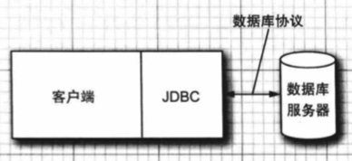
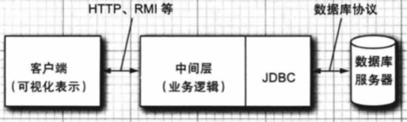
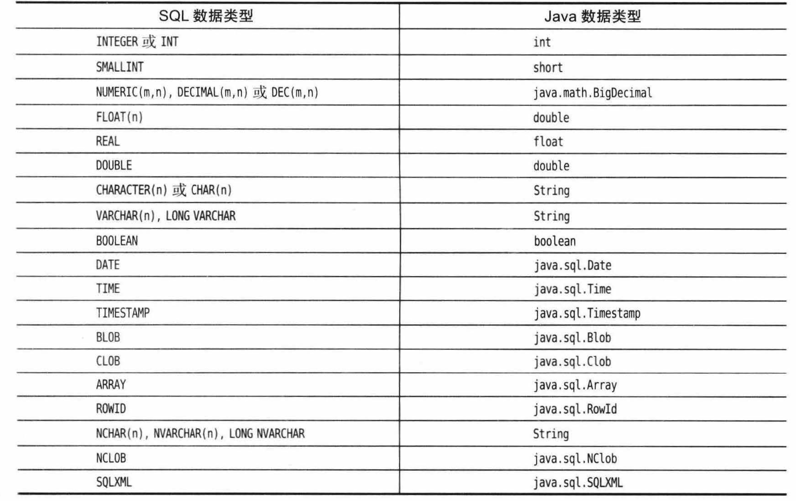

# 5.数据库编程

[TOC]

1996年，Sun公司发布了第1版的 **Java 数据库连接(Java DataBase Connectivity，JDBC)** API，使编程人员可以通过这个 API 接口连接到数据库，并使用结构化查询语言（即 SQL）完成对数据库的查找与更新。（SQL 通常发音为“sequel”，它是数据库访问的业界标准。）JDBC 自此成为 Java 类库中最常使用的 API之一。

JDBC 的版本已更新过数次。在本章中，我们将阐述JDBC幕后的关键思想，并将介绍（或者是复习）一下 **SQL (Structured Query Language，结构化查询语言)**，它是关系数据库的业界标准。


## 5.1 JDBC 的设计

从一开始，Java 技术开发人员就意识到了 Java 在数据库应用方面的巨大潜力。从1995年开始，他们就致力于扩展 Java 标准类库，使之可以运用 SQL 访问数据库。他们最初希望通过扩展 Java，就可以让人们用纯 Java 语言与任何数据库进行通信。但是，他们很快发现这是一项无法完成的任务：因为业界存在许多不同的数据库，且它们所使用的协议也各不相同。尽管很多数据库供应商都表示支持 Java 提供一套数据库访问的标准网络协议，但是每一家企业都希望 Java 能采用自己的网络协议。

所有的数据库供应商和工具开发商都认为，如果 Java 能够为SQL访问提供一套纯Java API，同时提供一个驱动管理器，以允许第三方驱动程序可以连接到特定的数据库，那它就会显得非常有用。这样，数据库供应商就可以提供自己的驱动程序，将其插入到驱动管理器中，Java API 就可以操作厂商提供的数据库了。

这种接口组织方式遵循了微软公司非常成功的 ODBC 模式，ODBC 为C语言访问数据库提供了一套编程接口。JDBC 和 ODBC 都基于同一个思想：根据 API编写的程序都可以与驱动管理器进行通信，而驱动管理器则通过驱动程序与实际的数据库进行通信。所有这些都意味着 JDBC API 是大部分程序员不得不使用的接口。

总结一下，JDBC的本质是官方(Sun，现在是Oracle)定义的一套操作所有关系型数据库的接口。各个数据库厂商去实现这套接口，并将这些实现类打包成JAR包提供，我们称这些特定数据库的实现类为驱动程序。

于是，使用JDBC进行开发的基本流程如下：

1. 导入驱动jar包
2. 注册驱动
3. 获取数据库连接对象 Connection
4. 定义sql
5. 获取执行sql语句的对象 Statement 执行sql，接受返回结果
6. 处理结果
7. 释放资源


### 5.1.1 JDBC 驱动程序类型

JDBC 规范将驱动程序归结为以下几类：

1. 第1类驱动程序将 JDBC 翻译成 ODBC.然后使用 ODBC 驱动程序与数据库进行通信。较早版本的 Java 包含了一个这样的驱动程序：JDBC/ODBC 桥，不过在使用这个桥接器之前需要对 ODBC 进行相应的部署和正确的设置。现在，有很多更好的驱动程序可用，所以JDK 已经不再提供 JDBC/ODBC 桥了。
2. 第2类驱动程序是由部分 Java 程序和部分本地代码组成的，用于与数据库的客户端API 进行通信。在使用这种驱动程序之前，客户端不仅需要安装 Java 类库，还需要安装一些与平台相关的代码。
3. 第3类驱动程序是纯 Java 客户端类库，它使用一种与具体数据库无关的协议将数据库请求发送给服务器构件，然后该构件再将数据库请求翻译成数据库相关的协议。这简化了部署，因为平台相关的代码只位于服务器端。
4. 第4类驱动程序是纯 Java 类库，它将 JDBC 请求直接翻译成数据库相关的协议。

大部分数据库供应商都为他们的产品提供第3类或第4类驱动程序。与数据库供应商提供的驱动程序相比，许多第三方公司专门开发了很多更符合标准的产品，它们支持更多的平台、运行性能也更佳，某些情况下甚至具有更高的可靠性。

总之，JDBC 最终是为了实现以下目标：

1. 通过使用标准的 SQL 语句，甚至是专门的 SQL 扩展，程序员就可以利用 Java 语言开发访问数据库的应用，同时还依旧遵守 Java 语言的相关约定。
2. 数据库供应商和数据库工具开发商可以提供底层的驱动程序。因此，他们可以优化各自数据库产品的驱动程序。


### 5.1.2 JDBC 的典型用法

在传统的客户端/服务器模型中，通常是在服务器端部署数据库，而在客户端安装GUI程序。在此模型中，JDBC 驱动程序应该部署在客户端，如下图所示。



但是，如今三层模型更加常见。在三层应用模型中，客户端不直接调用数据库，而是调用服务器上的中间件，由中间件完成数据库查询操作。这种三层模型有以下优点：它将可视化表示（位于客户端）从业务逻辑（位于中间层）和原始数据（位于数据库）中分离出来。因此，我们可以从不同的客户端，如Java 桌面应用、浏览器或者移动 App，来访问相同的数据和相同的业务规则。

客户端和中间层之间的通信在典型情况下是通过 HTTP 来实现的。JDBC 管理着中间层和后台数据库之间的通信，下图展示了这种通信模型的基本架构。




## 5.2 结构化查询语言

SQL 是对所有现代关系型数据库都至关重要的命令行语言，JDBC 则使得我们可以通过SQL 与数据库进行通信。桌面数据库通常都有一个图形用户界面；通过这种界面，用户可以直接操作数据。但是，基于服务器的数据库只能使用 SQL 进行访问。

关于 SQL 的知识不在这里介绍，你应该阅读更加专业和系统地学习它。


## 5.3 JDBC 配置

下面我们将学习采用传统的客户端/服务器模型的数据库编程。

在客户端，我们需要有一个可获得其 JDBC 驱动程序的数据库程序。目前这方面有许多出色的程序可供选择，比如 IBM DB2、 Microsoft SQL Server、 MysQL、 Oracle 和 PostgreSQL。

在服务器端，还需要创建一个数据库，我们假定这个数据库命名为 COREJAVA。 我们要自己创建，或者让数据库管理员创建这个数据库，并让你拥有适当权限，因为我们需要拥有对这个数据库进行创建、更新和删除表的权限。


### 5.3.1 数据库URL

在连接数据库时，我们必须使用各种与数据库类型相关的参数，例如主机名、端口号和数据库名。JDBC 使用了一种与普通 URL 相类似的语法来描述数据源。下面是这种语法的两个实例：
```
jdbc:derby://localhost:1527/COREJAVA;create=true
jdbc:postgresql:COREJAVA
```

上述 JDBC URL 指定了名为 COREJAVA 的一个 Derby 数据库和一个 PostgreSQL数据库。JDBC URL 的一般语法为：
```
jdbc:subprotocol:other stuff
```

其中，subprotocol 用于选择连接到数据库的具体驱动程序。other stf 参数的格式随所使用的 subprorocol 不同而不同。


### 5.3.2 驱动程序 JAR 文件

我们通过下载使用的数据库的驱动程序JAR文件来使用它。在运行访问数据库的程序时，需要将驱动程序的JAR文件包括到类路径中（编译时并不需要这个JAR文件）。

#### 5.3.2.1 从命令行启动程序

从命令行启动程序时，我们需要把JAR包的路径放在classpath选项中，也可以放在CLASSPATH环境变量中。由于默认的classpath是当前目录"."，且使用冒号分隔路径，所以我们设置classpath为driverPath:."。使用下面的命令：

```shell
java -classpath driverPath:. ProgramName
```

#### 5.3.2.2 从IDE启动程序

以IDEA为例，我们在项目下创建一个文件夹libs，用于存放需要使用的JAR包资源。将驱动程序JAR包放在这个文件夹下，然后右键该文件夹选择"Add as Library..." 即可。或者点击 “File->Project Structure...->Libraries"，然后在其中添加资源路径。


### 5.3.3 注册驱动器类

许多JDBC的JAR文件会自动注册驱动器类，在这种情况下，可以跳过本节介绍的步骤。包含 “META-INF/services/java.sql.Driver” 文件的 JAR 文件可以自动注册驱动器类。只需要解压缩JAR文件检查其是否包含该文件即可。

如果驱动程序不支持自动注册，那么就需要找出数据库提供商使用的JDBC驱动器类的名字进行注册。具体的有两种方式。

#### 5.3.3.1 在Java程序中加载驱动器类

可以使用Class的静态方法forName来完成注册。例如可以如下注册 MySQL ：

```java
Class.forName("com.mysql.cj.jdbc.Driver");
```

#### 5.3.3.2 设置 jdbc.drivers 属性

另一种方式是设置 jdbc.drivers 属性。可以用命令行参数来指定这个属性，例如：
```java
java -Djdbc.drivers=com.mysql.cj.jdbc.Driver ProgramName
```

或者在程序中设置系统属性：

```java
Systen.SetProperty("jdbc.drivers", "com.mysql.cj.jdbc.Driver");
```

### 5.3.4 连接到数据库

可以使用 Connection 对象来打开一个数据库连接。通过 DriverManager 的静态方法获得一个 Connection 对象。

例如，下面的DriverManager是MySQL的驱动程序。通过它我们连接了一个地址在 10.211.55.20，端口号3306处的数据库服务，打开了itcast数据库，使用的用户名为root，密码为1234。

```java
String url = "jdbc:mysql://10.211.55.20:3306/itcast"
String username = "root";
String password = "1234";
Connection conn = DriverManager.getConnection(url, username, password);
```


## 5.4 使用JDBC语句

下面我们使用 JDBC Statement 来执行SQL语句，获得执行结果以及处理错误。

### 5.4.1 执行 SQL 语句

要执行 SQL 语句，我们先要获得一个 Statement 对象。该对象可以通过上面创建的  Connection 对象获得。

```java
Statement stat = conn.createStatement();
```

然后我们需要构造出要执行的SQL语句字符串(不带分号)。

```java
String sql = "update table1 set age = 20 where id=1";
```

Statement 对象有3个常用的方法，可以用来执行SQL语句。

 #### 5.4.1.1 executeUpdate 方法

executeUpdate 方法既可以执行诸如 INSERT、 UPDATE 和 DELETE 之类的DML操作，也可以执行诸如 CREATE TABLE 和 DROP TABLE 之类的DDL语句。它会返回被影响的记录行数。

```java
int executeUpdate(String sql, int autoGeneratedKeys) throws SQLException;
```


#### 5.4.1.2 executeQuery 方法

executeQuery 方法，用于执行DQL操作，执行后返回代表查询结果的ResultSet对象，在ResultSet对象中存储查询产生的结果。

```java
ResultSet executeQuery(String sql) throws SQLException;
```

resultSet.next 方法可以判断这个结果集中下一行是否有内容，如果有内容，将当前行设置为下一行，返回true。逐行判断可以遍历返回集合。通过 ResultSet.get 系列方法可以获取这一行的某一个字段，参数是字段的名字或者字段的编号(从1开始)。

```java
while(resultSet.next())
{
    int id = resultSet.getInt("id");
    String name = resultSet.getstring(2);
    int age = resultSet.getInt(3);
    System.out.println(id+" "+name+ "+age");
}
```


#### 5.4.1.3 execute 方法

execute 方法是上面两者的综合，可以执行任意语句。它返回boolean值表明执行该SQL语句是否返回了ResultSet。如果返回值为true，则可以使用 Statement对象的getResultSet 方法返回一个ResultSet对象，然后ResultSet对象遍历查看结果。

```java
String sql="select * from student";
boolean execute = statement.execute(sql);
ResultSet res;
if(execute){
	res = statement.getResultSet();
}
while(res.next())
{
    int id = res.getInt("id")；
    String name = res.getstring(2);
    int age = res.getInt(3);
    System.out.println(id+" +name+ "+age);
}
```


### 5.4.2 管理连接、语句和结果集

每个 Connection 对象都可以创建一个或多个 Statement 对象。同一个 Statement 对象可以用于多个不相关的命令和查询。但是，一个 Statement 对象最多只能有一个打开的结果集。在同一个 Statement 对象上的命令将被串行化。

使用完 ResultSet、 Statement 或 Connection 对象后，应立即调用 close 方法。这些对象都使用了规模较大的数据结构，它们会占用数据库服务器上的有限资源。
Statement 对象的 close 方法将自动关闭所有与其相关联的结果集。同样地，调用
Connection 类的 close 方法将关闭该连接上的所有语句。

也可以在 Statement 上调用 closeOnCompletion 方法，在其所有结果集都被关
闭后，该语句会立即被自动关闭。如果所用连接都是短时的，那么无须操心语句和结果集的关闭。只需将 close 语句放在带资源的 try 语句中，以便确保连接对象不可能继续保持打开状态。


### 5.4.3 分析 SQL 异常

每个 SQLException 都有一个由多个 SQLException 对象构成的链，这些对象可以通过 getNextException 方法获取。这个异常链是每个异常都具有的由 Throwable 对象构成的“成因”链之外的异常链（请参见卷1第7章以了解 Java 异常的详细信息)，因此，我们需要用两个嵌套的循环来完整枚举所有的异常。幸运的是，SQLException 类得到了增强，实现了 `Iterable<Throwable>` 接口，其 iterator 方法可以产生一个 `Iterator<Throwable>`，这个迭代器可以迭代这两个链，首先迭代第一个 SQLException 的成因链，然后迭代下一个 SQLException，以此类推。

我们可以使用 for 循环遍历异常链：

```java
for(Throwable t : sqlException)
{
    // ...
}
```

可以在 SQLException 上调用 getSQLState 和 getErrorCode 方法来进一步分析它，其中第一个方法将产生符合 X/Open 或 SQL:2003 标准的字符串（调用 DatabaseMetaData 接口的 getSQLStateType 方法可以查出驱动程序所使用的标准）。而错误代码是与具体的提供商相关的。


### 5.4.4 组装数据库

在执行查询之前，还需要创建数据表并向其中插入数据。可以使用一系列的SQL指令来完成这些操作。可以将SQL指令写在一个文本文件中，然后每次读取其中一条指令并执行。


## 5.5 执行查询操作

### 5.5.1 预备语句

通常我们要查询的SQL语句总是有一或多个变量，而其他部分不变。如果每次都重新组装这个SQL语句的话，既麻烦又容易出错。预备语句(prepared statement)就是为了这种情况而提出的。

在预备查询语句中，我们可以用问号 “？”作为占位符，在实际执行查询前将占位符填充为实际值即可。

可以使用 Connection 的 prepareStatement 方法获得一个预备语句。

```java
String pubLisherQuery = "SELECT Books.Price, Books"
    + " FROM Books, Publishers"
    + " WHERE Books.Publisher Id = Publishers. Publisher Id AND Publishers.Name= ?";
PreparedStatement stat = conn.prepareStatement(publisherQuery);
```

然后，可以在 PreparedStatement 对象上使用一系列set方法为占位符设置实际值。

```java
stat.setString(1, publisher);
```

这里第一个参数是需要设置的占位符的位置，位置1表示第一个问号所在位置。注意，位置下标从1开始。第二个参数就是赋予占位符的值。

如果想要重用已经执行过的预备查询语句，那么除非使用 set 方法或调用 clearParameters 方法，否则所有宿主变量的绑定都不会改变。

为所有占位符绑定了具体的值后，就可以在 PreparedStatement 对象上调用 execute 方法。


### 5.5.2 读写 LOB

LOB的全称是Large OBject。除了数字、字符串和日期之外，许多数据库还可以存储大对象，例如图片或其他数据。在SQL中，二进制大对象称为 BLOB(Binary Large OBject)，字符型大对象称为 CLOB(Character Large OBject)。

要读取 LOB，需要执行 SELECT语句，然后在 ResultSet 上调用 getBlob 或 getClob 方法，这样就可以获得 Blob 或 Clob 类型的对象。要从 Blob 中获取二进制数据，可以调用 getBytes 或 getBinaryStream。例如，如果你有一张保存图书封面图像的表，那么就可以像下面这样获取一张图像：

```java
try (ResultSet result = stat.executeQuery())
{
	if (result.next())
    {
        Blob coverBlob = result.getBlob(1);
        Image coverlmage = ImageIO.read(coverBlob.getBinaryStream());
    }
}
```

类似地，如果获取了 Clob对象，那么就可以通过调用 getSubString 或 getCharacterStream 方法来获取其中的字符数据。

要将 LOB 置于数据库中，需要在 Connection 对象上调用 createBlob 或 createClob，然后获取一个用于该 LOB 的输出流或写出器，写出数据，并将该对象存储到数据库中。例如，下面展示了如何存储一张图像：
```java
Blob coverBlob = connection.createBlob();
int offset=0;
OutputStream out = coverBLob.setBinaryStream(offset);
ImageIO.write(coverImage, "PNG", out);
PreparedStatement stat = conn.prepareStatement("INSERT INTO Cover VALUES (?, ?)");
stat.set(1, isbn);
stat.set(2, coverBlob);
stat.executeupdate();
```


### 5.5.3 SQL 转义

“转义”语法是各种数据库普遍支持的特性，但是数据库使用的是与数据库相关的语法变体，因此，将转义语法转译为特定数据库的语法是 JDBC 驱动程序的任务之一。

转义主要用于下列场景：

+ 日期和时间字面常量
+ 调用标量函数
+ 调用存储过程
+ 外连接
+ 在 LIKE 子句中的转义字符

具体的转义语法不详细介绍。


### 5.5.4 多结果集

在执行存储过程，或者在使用允许单个语句中提交多个 SQL 语句的数据库时，一个语句可能会返回多个结果集。下面是获得所有结果集，下面是获取所有结果集的步骤：

1. 使用 execute 方法来执行 SQL 语句。
2. 获取第一个结果集(DQL语句)或更新计数(DML语句)。
3. 重复调用 get/oreResults 方法以移动到下一个结果集。
4. 当不存在更多的结果集或更新计数时，完成操作。

如果由多结果集构成的链中的下一项是结果集，execute 和 getMoreResults 方法将返回true，而如果在链中的下一项不是更新计数，getUpdateCount 方法将返回-1。下面的循环可以遍历所有的结果：

```java
boolean isResult = stmt.execute(command);
boolean done = false;
while (!done)
{
	if(isResult)
    {
        ResultSet result = stat.getResultSet();
		// do something with result
    }
	else
    {
    	int updateCount = stat.getUpdateCount();
		if (updateCount >= 0)
			// do something with updateCount
		else
            done = true;
    }
    if (!done) isResult 三 stat.getMoreResults();
}
```


### 5.5.5 获取自动生成的键

大多数数据库都支持某种在数据库中对行自动编号的机制。但是，不同的提供商所提供的机制之间存在着很大的差异，而这些自动编号的值经常用作主键。尽管 JDBC 没有提供独立于提供商的自动生成键的解决方案，但是它提供了获取自动生成键的有效途径。当我们向数据表中插入一个新行，且其键自动生成时，可以用下面的代码来获取这个键：

```java
stat.executeUpdate(insertStatement, Statement.RETURN_GENERATED_KEYS);
ResultSet rs = stat.getGeneratedKeys();
if (rs.next())
{
    int key = rs.getInt(1);
    ...
}
```


## 5.6 可滚动和可更新的结果集

我们前面已经介绍过，使用 ResultSet 接口中的 next 方法可以迭代遍历结果集中的所有行。但是，如果如果我们需要在结果集上前后移动，甚至跳到任意位置，那么就需要使用可滚动结果集。

另外，如果我们希望在结果集上进行更新操作，使得数据库也做相应的更新操作，那么就需要使用可更新的结果集。


### 5.6.1 可滚动结果集

默认情况下，结果集是不可滚动和不可更新的。为了从查询中获取可滚动的结果集，必须使用下面的方法得到一个不同的 Statement 对象：

```java
Statement stat = conn.createstatement(type, concurrency);
```

如果要获得预备语句，可以使用下面的方法：

```java
PreparedStatement stat = conn.prepareStatement(command, type, concurrency);
```

下面是 type 字段的可能取值：

+ ResultSet.TYPE_FORWARD_ONLY: 结果集不能滚动（默认值）。
+ ResultSet.TYPE_SCROLL_INSENSITIVE: 结果集可以滚动，但对数据库变化不敏感。
+ ResultSet.TYPE_SCROLL_SENSITIVE: 结果集可以滚动，且对数据库变化敏感。

下面是 concurrency 字段的可能取值：

+ ResultSet.CONCUR_READ_ONLY: 结果集不能用于更新数据库（默认值）。
+ ResultSet.CONCUR_UPDATABLE: 结果集可以用于更新数据库。

例如，如果只想滚动遍历结果集，而不想编辑它的数据，那么可以使用以下语句：

```java
Statement stat = conn.createstatement(ResultSet.TYPE_SCROLL_INSENSITIVE, ResultSet.CONCUR_READ_ONLY);
```

现在在该语句上执行查询语句获得的结果集将是可以滚动的。

可以使用previous方法将游标向前滚动，如果游标位于一个实际的行上，那么该方法将返回 true；如果游标位于第一行之
前，那么返回 false。

```java
if( rs.previous() )...
```

可以使用以下调用将游标向后或向前移动多行：如果n为正数，游标将向后移动。如果n为负数，游标将向前移动。如果n为0，那么
调用该方法将不起任何作用。如果试图将游标移动到当前行集的范围之外，即根据n值的正负号，游标将被设置在最后一行之后或第一行之前，且该方法将返回 false。如果游标位于一个实际的行上，则返回true。

```java
rs.relative(n);
```

或者，还可以将游标设置到指定的行号上：
```java
rs.absolute(n);
```

调用以下方法将返回当前行的行号。结果集中第一行的行号为1。如果返回值为0，那么游标当前不在任何行上，它要么位于第一行之前，要么位于最后一行之后。

```java
int currentRow = rs.getRow();
```

最后，isFirst、 isLast、 isBeforeFirst 和 iSAfterLast 用于测试游标是否位于这些特殊位置上。


### 5.6.2 可更新的结果集

如果希望编辑结果集中的数据，并且将结果集上的数据变更自动反映到数据库中，那么就必须使用可更新的结果集。可更新的结果集并非必须是可滚动的，但如果将数据提供给用户去编辑，那么通常也会希望结果集是可滚动的。如果要获得可更新的结果集，应该使用以下方法创建一条语句：

```java
Statement stat = conn.createstatement(ResultSet.TYPE_SCROLL_INSENSITIVE, ResultSet.CONCUR_UPDATABLE);
```

所有对应于 SQL 类型的数据类型都配有 updateXxx 方法，比如 updateDouble、 updateString等。与 getXxx 方法相同，在使用 updateXxx 方法时必须指定列的名称或序号，然后给该字段设置新的值。

updateXxx 方法改变的只是结果集中的行值，而非数据库中的值。当更新完行中的字段值后，必须调用 updateRow 方法，这个方法将当前行中的所有更新信息发送给数据库。如果没有调用 updateRow 方法就将游标移动到其他行上，那么对此行所做的所有更新都将被丢弃，而且永远也不会被传递给数据库。还可以调用 cancelRoUpdates 方法来取消对当前行的更新。

例如，下面的代码可以用于对数据库中的所有书涨价：

```java
String query = "SELECT FROM Books";
ResultSet rs = stat.executeQuery(query);
while(rs.next())
{
	if（...)
	{
        double increase=...;
        double price = rs.getDouble("Price");
        rs.updateDouble( "Price", price + increase);
        rs.updateRow(); // make sure to call updateRow after updating fields
    }
}
```

我们在前面的例子中已经介绍过如何修改一个现有的行。如果想在数据库中添加一条新的记录，首先需要使用 moveToInsertRow 方法将游标移动到特定的位置，我们称之为插入行(insert row)。然后，调用 updateXxx 方法在插人行的位置上创建一个新的行。在上述操作全
部完成之后，还需要调用 insertRow 方法将新建的行发送给数据库。完成插入操作后，再调用 moveToCurrentRow 方法将游标移回到调用 moveToInsertRow 方法之前的位置。请注意，我们无法控制在结果集或数据库中添加新数据的位置，因为这是取决于数据库的索引方式的。下面是一段示例程序：

```java
rs.moveToInsertRow();
rs.updatestring("Title", title);
rs.updateString("ISBN", isbn);
rs.updateString("Publisher Id", pubid);
rs.updateDouble("Price", price)；
rs.insertRow();
rs.moveToCurrentRow();
```

对于在插入行中没有指定值的列，将被设置为 SQL 的 NULL。但是，如果这个列有 NOT MULL 约束，那么将会抛出异常，而这一行也无法插人。

最后需要说明的是，你可以使用以下方法删除游标所指的行。deleteRow 方法会立即将该行从结果集和数据库中删除。

```java
rs.deleteRow();
```

注意，通常来说，如果不是一定要遍历的同时修改数据，那么建议使用SQL语句进行修改数据，那样的效率更高。


## 5.7 行集

可滚动的结果集虽然功能强大，却有一个重要的缺陷：在与用户的整个交互过程中，必须始终与数据库保持连接。用户也许会离开电脑旁很长一段时间，而在此期间却始终占有着数据库连接。这种方式存在很大的问题，因为数据库连接属于稀有资源。在这种情况下，我们可以使用行集。Rowset 接口扩展自 ResultSet 接口，却无须始终保持与数据库的连接。行集还适用于将查询结果移动到复杂应用的其他层，或者是诸如手机之类的其他设备中。你可能永远都不会考虑移动一个结果集，因为它的数据结构可能非常庞大，且依赖于数据库连接。


### 5.7.1 构建行集

以下为 javax.sql.rowset 包提供的接口，它们都扩展了 RowSet 接口：

+ CachedRowSet 允许在断开连接的状态下执行相关操作。关于被缓存的行集我们将在下一节中讨论。
+ WebRowSet 对象代表了一个被缓存的行集，该行集可以保存为 XML文件。该文件可以移动到 web 应用的其他层中，只要在该层中使用另一个 MebRowSet 对象重新打开该文件即可。
+ FilteredRowSet 和 JoinRowSet 接口支持对行集的轻量级操作，它们等同于 SQL中的 SELECT 和 JOIN 操作。这两个接口的操作对象是存储在行集中的数据，因此运行时无须建立数据库连接。
+ JdbcRowSet 是 ResultSet 接口的一个瘦包裝器。它在 RowSet 接口中添加了一些有用的方法。

在 Java 7中，有一种获取行集的标准方式：
```java
RowSetFactory factory = RowSetProvider.newFactory();
CachedRowSet crs = factory.createCachedRowSet();
```


### 5.7.2 被缓存的行集

一个被缓存的行集中包含了一个结果集中所有的数据。CachedRowSet 是 ResultSet 接口的子接口。被缓存的行集有一个非常重要的优点：断开数据库连接后仍然可以使用行集。这种做法大大简化了交互式应用的实现。在执行每个用户命令时，我们只需打开数据库连接、执行查询操作、将查询结果放入被缓存的行集，然后关闭数据库连接即可。我们甚至可以修改被缓存的行集中的数据。当然，这些修改不会立即反馈到数据库中。我们必须发起一个显式的请求，以便让数据库真正接受所有修改。此时 CachedRowSet 类会重新连接到数据库，并通过执行 SQL 语句向数据库中写入所有修改后的数据。

可以使用一个结果集来填充 CachedRowSet 对象：
```java
ResultSet result = ...;
RowSetFactory factory = RowSetProvider. newFactory();
CachedRowSet crs = factory.createCachedRowSet();
crs.populate(result);
conn.close(); // now OK to close the database connection
```

或者，也可以让 CachedRowSet 对象自动建立一个数据库连接。首先，设置数据库参数：
```java
crs.setURL("jdbc:derby:/ /Localhost:1527/COREJAVA");
crs. setUsername("dbuser");
crs.setPassword("secret");
```

然后，设置查询语句和所有参数。
```java
rs.setCommand("SELECT * FROM Books WHERE PubLisher ID = ?");
crs.setString(1, publisherld);
```

最后，将查询结果填充到行集中：
```java
crs.execute();
```


这个方法调用会建立数据库连接、执行查询操作、填充行集，最后断开连接。

如果查询结果非常大，那我们肯定不想将其全部放人行集中。毕竟，用户可能只是想浏览其中的几行而己。在这种情况下，可以指定每一页的尺寸：

```java
CachedRowSet crs = ...;
crs.setCommand(command);
crs.setPageSize(20);
crs.execute();
```

现在就能只获得20 行了。要获取下一批数据，可以调用：
```java
crs.nextPage();
```

可以使用与结果集中相同的方法来查看和修改行集中的数据。如果修改了行集中的内容，那么必须调用以下方法将修改写回到数据库中：
```java
crs.acceptChanges(conn);
// 如果在行集中设置了URL，用户，密码时，可以使用下面的调用
crs.acceptChanges();
```

另一个复杂的问题是，在填充了行集之后，数据库中的数据发生了改变，这显然容易产生数据不一致性。为了解决这个问题，标准实现会首先检查行集中的原始值（即，修改前的值）是否与数据库中的当前值一致。如果一致，那么修改后的值将覆盖数据库中的当前值。否则，将抛出 SyncProviderException 异常，且不向数据库写回任何值。在实现行集接口时其他实现也可以采用不同的同步策略。


## 5.8 元数据

在SQL中，描述数据库或其组成部分的数据称为元数据(区别于那些存在数据库中的实际数据)。我们可以获得三类元数据：关于数据库的元数据、关于结果集的元数据以及关于预备语句参数的元数据。

如果要了解数据库的更多信息，可以从数据库连接中获取一个 DatabaseMetaData 对象。

```java
DatabaseMetaData meta = conn.getMetaData();
```

现在就可以获取某些元数据了。例如，下面的调用将返回一个包含所有数据库表信息的结果集。该结果集中的每一行都包含了数据库中一张表的详细信息，其中，第三列是表的名称。

```java
ResultSet mrs = meta.getTables(null, nutl, nutl, new String[] { "TABLE" });
```

于是，下面的代码可以获取所有的表名：

```java
while(mrs.next())
	tableNames.addItem(mrs.getString(3));
```

关于获取其他元数据的操作，这里不展开。


## 5.9 事务

我们可以将一组语句构建成一个事务（transaction)。当所有语句都顺利执行之后，事务可以被提交(commit）。否则，如果其中某个语句遇到错误，那么事务将被回滚，就好像没有任何语句被执行过一样。


### 5.9.1 用JDBC对事务编程

默认情况下，数据库连接处于自动提交模式(autocommit mode)，即每个 SQL 语句一且被执行便被提交给数据库。一且命令被提交，就无法对它进行回滚操作。在使用事务时，需要关闭这个默认值：

```java
conn.setAutoCommit(false);
```

现在可以按照通常的方式创建一个语句对象：
```java
Statement stat = conn.createStatement();
```

然后任意多次地调用 executelpdate 方法，如果执行了所有命令之后没有出错，则调用 commit 方法：

```java
conn.submit();
```

如果出现错误，则可以调用rollback进行回滚：

```java
conn.rollback();
```

此时，程序将自动撤销自上次提交以来的所有语句。当事务被 SQLException 异常中断时，典型的办法就是发起回滚操作。


### 5.9.2 保存点

在使用某些驱动程序时，使用保存点（save point）可以更细粒度地控制回滚操作。创建一个保存点意味着稍后只需返回到这个点，而非放弃整个事务。例如，
```java
Statement stat = conn.createStatement(); // start transaction; rollback() goes here
stat.executeUpdate (commandl);
Savepoint svpt = conn.setSavepoint(); // set savepoint; rolLback(svpt) goes here
stat.executeUpdate (command2);

if（...) conn.rollback(svpt); // undo effect of command2

conn. commit();
```

当不再需要保存点时，应该释放它：
```java
conn.releaseSavepoint(svpt);
```


### 5.9.3 批量更新

假设有一个程序需要执行许多 INSERT 语句，以便将数据填入数据库表中，此时可以使用批量更新的方法来提高程序性能。在使用批量更新(batch update）时，一个语句序列作为一批操作将同时被收集和提交。

处于同一批中的语句可以是 INSERT、 UPDATE 和 DELETE 等操作，也可以是数据库定义语句，如 CREATE TABLE 和 DROP TABLE。但是，在批量处理中添加 SELECT 语句会抛出异常（从概念上讲，批量处理中的 SELECT 语句没有意义，因为它会返回结果集，而并不更新数据库）。

为了执行批量处理，首先必须使用通常的办法创建一个 Statement 对象：
```java
Statement stat = conn. createStatement();
```

现在，应该调用 addBatch 方法，而非 executeUpdate 方法：
```java
String command = "CREATE TABLE ...";
stat.addBatch(command);
while (...)
{
    command = "INSERT INTO VALUES(" +... + ")";
    stat.addBatch(command);
}
```

最后，提交整个批量更新语句：
```java
int[] counts = stat.executeBatch();
```

调用 executeBatch 方法将为所有已提交的语句返回一个记录数的数组。

为了在批量模式下正确地处理错误，必须将批量执行的操作视为单个事务。如果批量更新在执行过程中失败，那么必须将它回滚到批量操作开始之前的状态。首先，关闭自动提交模式，然后收集批量操作，执行并提交该操作，最后恢复最初的自动提交模式。


## 5.9 高级 SQL 类型

下图列举了 JDBC 支持的 SQL 数据类型以及它们在 Java 语言中对应的数据类型。




## 5.10 Web 与企业应用中的连接管理

使用 database.properties 文件可以对数据库连接进行非常简单的设置。这种方法适用于小型的测试程序，但是不适用于规模较大的应用。在 Web 或企业环境中部署 JDBC 应用时，数据库连接管理与 Java 名字和目录接口 (JNDI) 是集成在一起的。遍布企业的数据源的属性可以存储在一个目录中，采用这种方式使得我们可以集中管理用户名、密码、数据库名和 JDBC URL。

请注意，我们不再使用 DriverManager，而是使用 JNDI 服务来定位数据源。数据源是一个能够提供简单的 JDBC 连接和更多高级服务的接口，比如执行涉及多个数据库的分布式事务。javax.sql 标准扩展包定义了 DataSource 接口。

用户名管理和登录管理只是众多需要特别关注的问题之一。另一个重要问题则涉及建立数据库连接所需的开销。我们的示例数据库程序使用了两种策略来获取数据库连接：在程序的开头建立了到数据库的单个连接，并在程序结尾处关闭了它，或者在每次需要时都会打开一个新连接。但是，这两种方式都不令人满意：因为数据库连接是有限的资源，如果用户要离开应用一段时间，那么他占用的连接就不应该保持打开状态；另一方面，每次查询都获取连接并在随后关闭它的代价也是相当高的。

解决上述问题的方法是建立**数据库连接池(pool)**。这意味着数据库连接在物理上并未被关闭，而是保留在一个队列中并被反复重用。连接池是一种非常重要的服务，JDBC 规范为实现者提供了用以实现连接池服务的手段。不过，JDK 本身并未实现这项服务，数据库供应商提供的JDBC 驱动程序中通常也不包含这项服务。相反，web 容器和应用服务器的开发商通常会提供连接池服务的实现。

连接池的使用对程序员来说是完全透明的，可以通过获取数据源并调用 getConnection 方法来得到连接池中的连接。使用完连接后，需要调用 close 方法。该方法并不会在物理上关闭连接，而只是告诉连接池已经使用完该连接。连接池通常还会将池机制作用于预备语句上。


