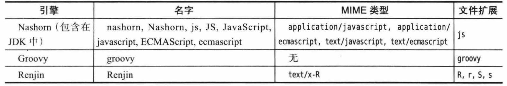
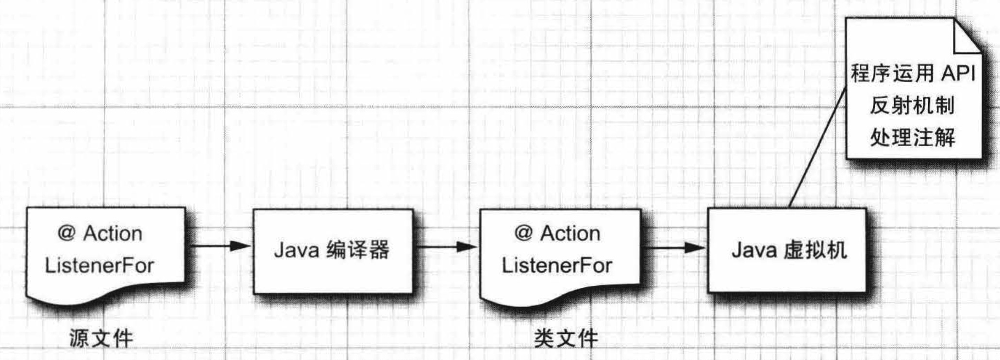
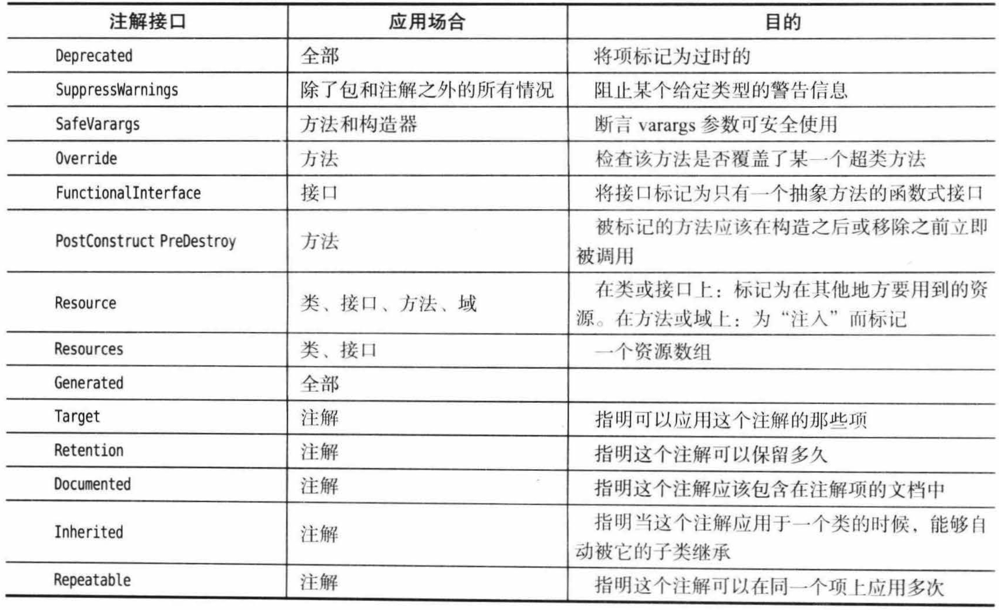
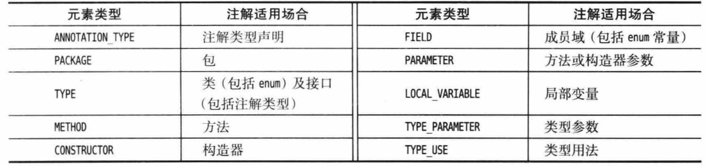
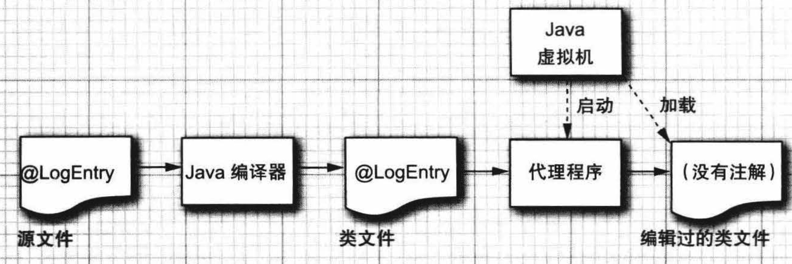

# 8.脚本、编译与注解处理


[TOC]


本章将介绍三种用于处理代码的技术：脚本 API使你可以调用诸如 JavaScript 和 Groovy 这样的脚本语言代码；当你希望在应用程序内部编译 Java 代码时，可以使用编译器 API；注解处理器可以在包含注解的 Java 源代码和类文件上进行操作。


## 8.1 Java 平台的脚本机制

脚本语言是一种通过在运行时解释程序文本，从而避免使用通常的编辑 /编译 /链接/运行循环的语言。脚本语言有许多优势：

+ 便于快速变更，鼓励不断试验。
+ 可以修改运行着的程序的行为。
+ 支持程序用户的定制化。

另一方面，大多数脚本语言都缺乏可以使编写复杂应用受益的特性，例如强类型、封装和模块化。因此人们在尝试将脚本语言和传统语言的优势相结合。脚本 API 使你可以在 Java 平台上实现这个目的，它支持在 Java 程序中使用 JavaScript、Groovy、Ruby，甚至是更奇异的诸如 Scheme 和 Haskell 等语言编写的脚本进行调用。


### 8.1.1 获取脚本引擎

脚本引擎是一个可以执行用某种特定语言编写的脚本的类库。当虚拟机启动时，它会发现可用的脚本引擎。为了枚举这些引擎，需要构造一个 ScriptEngineManager，并调用 getEngineFactories 方法。可以向每个引擎工厂询问它们所支持的引擎名、MIME 类型和文件扩展名。

>MIME (Multipurpose Internet Mail Extensions) 是描述消息内容类型的标准，用来表示文档、文件或字节流的性质和格式。MIME 能包含文本、图像、音频、视频以及其他应用程序专用的数据。
>
>浏览器通常使用 MIME 类型（而不是文件扩展名）来确定如何处理URL，因此 Web 服务器在响应头中添加正确的 MIME 类型非常重要。如果配置不正确，浏览器可能会无法解析文件内容，网站将无法正常工作，并且下载的文件也会被错误处理。

下表是脚本引擎工厂的属性：



通常，我们知道所需要的引擎，因此可以直接通过名字、MIME 类型或文件扩展来请求它，例如：
```java
ScriptEngine engine = manager.getEngineByName("nashorn");
```

Java Scripting API有许多类和接口。它们在javax.script包中。ScriptEngine 接口的实例执行以脚本语言编写的脚。

ScriptEngineFactory执行两个任务：

+ 创建脚本引擎的实例。
+ 提供有关脚本引擎的信息，如引擎名称，版本，语言等。

AbstractScriptEngine类是一个抽象类，并为ScriptEngine接口提供了部分实现。

ScriptEngineManager类发现和实例化脚本引擎。

```java
import javax.script.ScriptEngineManager

List<ScriptEngineFactory> getEngineFactories()
// 获取所有发现的引擎工厂的列表。

ScriptEngine getEngineByName(String name)
ScriptEngine getEngineByExtension(String extension)
ScriptEngine getEngineByMimeType(String mimeType)
// 获取给定名字、脚本文件扩展名或 MIME 类型的脚本引擎。
    
import javax.script.ScriptEnginefactory
List<String> getNames()
List<String> getExtensions()
List<String> getMimeTypes()
// 获取该工厂所了解的名字、脚本文件扩展名和 MIME 类型。
```


### 8.1.2 脚本计算与绑定

一旦拥有了引擎，就可以通过下面的调用来直接调用脚本，其中脚本存储在字符串scriptString中。
```java
Object result = engine.eval(scriptString);
```

如果脚本存储在文件中，那么需要先打开一个 Reader，然后调用：
```java
Object result = engine.eval(reader);
```

ScriptEngine 接口的 eval 方法具有以下的重载版本：

```java
Object eval(String script)
Object eval(Reader reader)
Object eval(String script, Bindings bindings)
Object eval(Reader reader, Bindings bindings)
Object eval(String script, ScriptContext context)
Object eval(Reader reader, ScriptContext context)
```

可以在同一个引擎上调用多个脚本。如果一个脚本定义了变量、函数或类，那么大多数引擎都会保留这些定义，以供将来使用。例如下面的方法将返回 1729。
```java
engine.eval("n = 1728");
Object result = engine.eval("n + 1");
```

我们经常希望能够向引擎中添加新的变量绑定。绑定由名字及其关联的 Java 对象构成。添加新绑定其实相当于给脚本提供参数，每个绑定是一组键/值对，键必须是非空的非空字符串。

可以通过脚本引擎的put方法向其提供参数。

```java
engine.put("k", 1728);
Object result engine.eval("k + 1");
```

于是，脚本代码可以从“引擎作用域”中的绑定里读取k的定义。这一点非常重要，因为大多数脚本语言都可以访问 Java 对象，通常使用的是比 Java 语法更简单的语法。

反过来，我们也可以获得由脚本绑定的键/值对。

```java
engine.eval("n = 1728");
Object result = engine.get("n");
```

对单个脚本引擎添加的绑定位于“引擎作用域”中。除此之外，还有“全局作用域”。任何添加到 ScriptEngineManager 中的绑定都位于全局作用域中，这些绑定对所有引擎都是可视的。

除了通过put方法向引擎或全局作用域添加单个绑定之外，还可以将绑定收集到一个类型为 Bindings 的对象中，然后通过脚本引擎的eval方法将绑定批量传递给它。

Java Bindings是Bindings接口的一个实例。SimpleBindings类是Bindings接口的一个实现。

Bindings接口继承了 ` Map<String，Object> ` 接口。

```java
Bindings scope = engine.createBindings();
scope.put("b", new JButton());
engine.eval(scriptString, scope);
```


### 8.1.3 重定向输入与输出

脚本引擎是在脚本上下文中执行的，可以通过调用脚本上下文的 setReader 和 setwriter 方法来重定向脚本的标准输入和输出。例如，
```java
var writer = new Stringwriter();
engine.getContext().setwriter(new Printwriter(writer, true));
```

在上例中，任何用 JavaScript 的 print 和 println 函数产生的输出都会被发送到 writer。

setReader 和 setwriter 方法只会影响脚本引擎的标准输入和输出源。例如，如果执行下面的 JavaSeript 代码，则只有第一个输出会被重定向。
```java
println("Hello");
java.lang.System.out.printin("World");
```

Nashorn 引擎没有标准输入源的概念，因此调用 setReader 没有任何效果。


### 8.1.4 调用脚本的函数和方法

对于许多脚本引擎而言，我们都可以调用脚本语言的函数，而不必执行整个脚本。提供这种功能的脚本引擎实现了 Invocable 接口。例如，Nashorn 引擎就实现了 Invocable 接口。

要调用一个函数，需要用函数名来调用 invokeFunction 方法，函数名后面是函数的参数：

```java
// Define greet function in JavaScript
engine.eval("function greet(how, whom) { return how + ',' + whom + '!' }");

// Call the function with arguments "Hello"，"World"
result = ( (Invocable) engine).invokeFunction("greet", "Hello","Morld");
```

如果脚本语言是面向对象的，那就可以调用 invokeMethod:

```java
// Define Greeter class in JavaScript
engine.eval("function Greeter(how) { this.how = how }");
engine.eval("Greeter.prototype.welcome = function(whom){ return this.how + ','+ whom + '!' }");

// Construct an instance
Object yo = engine.eval("new Greeter('Yo')");

// Call the we welcome method on the instance
result = ((Invocable) engine).invokeMethod(yo, "welcome", "World");
```

我们可以更进一步，让脚本引擎去实现一个 Java 接口，然后就可以用 Java 方法调用的语法来调用脚本函数。其细节依赖于脚本引擎，但是典型情况是我们需要为该接口中的每个方法都提供一个函数。例如，考虑下面的 Java 接口：

```java
public interface Greeter
{
	String welcome(String whom);
}
```

如果在 Nashorn 中定义了具有相同名字的两数，那么可通过这个接口来调用它：

```java
// Define welcome function in JavaScript 
engine.eval("function welcome (whom) { return 'Hello,'+ whom + '!'}");

// Get a Java object and call a Java method
Greeter g = ((Invocable) engine).getInterface(Greeter.class);
result = g.welcome("World");
```

在面向对象的脚本语言中，可以通过相匹配的 Java 接口来访问一个脚本类。例如，下面的代码展示了如何使用 Java 的语法来调用 JavaScript 的 SimpleGreeter类，即使用 yo 对象的方法实现了指定的接口。
```java
Greeter g = ((Invocable)engine).getInterface(yo, Greeter.class);
result = g.welcome("World");
```

总之，如果你希望从 Java 中调用脚本代码，同时又不想因这种脚本语言的语法而受到困扰，那么 Invocable 接口就很有用。

```java
import javax.script.Invocable

Object invokeFunction(String name, Object... parameters)
Object invokeMethod( Object implicitParaneter, String name, Object.. explicitParameters)
// 用给定的名字调用函数或方法，并传递给定的参数。

<T> T getInterface(Class<T> iface)
// 返回给定接口的实现，该实现用脚本引擎中的两数实现了接口中的方法。
<T> T getInterface(Object implicitParameter, CLass<T> iface)
// 返回给定接口的实现，该实现用给定对象的方法实现了接口中的方法。
```


### 8.1.5 编译脚本

某些脚本引擎出于对执行效率的考虑，可以将脚本代码编译为某种中间格式。这些引擎实现了 Compilable 接口。下面的示例展示了如何编译和计算包含在脚本文件中的代码：
```java
FileReader reader = new FileReader("myscript.js");
CompiledScript script = null;
if(engine implements Compilable)
	script = ((Compilable)engine).compile(reader);
```

一旦该脚本被编译，就可以执行它。下面的代码将会在编译成功的情况下执行编译后的脚本，如果引擎不支持编译，则执行原始的脚本。
```java
if (script != null)
	script.eval();
else
	engine.eval(reader);
```


当然，只有需要重复执行时，我们才希望编译脚本。


## 8.2 编译器 API

有许多工具都需要编译 Java 代码，例如 Java 编程开发环境和程序，测试和自动化构建工具也属于这类工具。

### 8.2.1 调用编译器

调用编译器非常简单，下面是一个示范调用：
```java
JavaCompiler compiler = ToolProvider.getSystemJavaCompiler();
OutputStream outStream = ...;
OutputStream errStream = ...;
int result = compiler.run(null, outStream, errStream, "-sourcepath", "src", "Test.java");
```

返回值为0表示编译成功。

编译器会向提供给它的流发送输出和错误消息。如果将这些参数设置为 null，编译器就会使用 System.out 和 System.err。run 方法的第一个参数是输入流，由于编译器不会接受任何控制台输入，因此总是应该让其保持为 null。（ run 方法是从泛化的 Tool 接口继承而来的，它考虑到某些工具需要读取输入。）


### 8.2.2 发起编译任务

可以通过使用 CompilationTask 对象来对编译过程进行更多的控制。如果要从字符串中提供源码，在内存中捕获类文件，或者处理错误和警告消息，这样做就会显得很有用。要想获取 CompilationTask 对象，需要以前一节中描述的 compiler 对象开始，然后按照下面的方式调用：

```java
JavaCompiler.CompilationTask task = compiler.getTask(
	errorwriter, // Uses System.err if null 
	fileManager, // Uses the standard file manager if null 
	diagnostics, // Uses System.err if null
	options, // null if no options
	classes, // For annotation processing; null if none
	sources);
```

最后三个参数是 Iterable 的实例。例如，选项序列可以像下面这样指定：
```java
Iterable<String> options = List.of ("-d", "bin");
```

sources 参数是 JavaFileObject 实例。如果想要编译磁盘文件，需要获取一个 StandardJavaFileManager 对象，并调用其 get JavafileObjects 方法：
```java
StandardJavaFileManager fileNanager = compiler.getStandardFileManager(nulL, null, nuLL);
Iterable<JavaFileObject> sources = 
    fileManager.getJavaFileObjectsFromStrings(List.of("Filel.java", "File2. java"));
JavaCompiler.CompilationTask task = compiler.getTask(
    nulL, null, null, options, null, sources);
```

getTask 方法会返回任务对象，但是并不会启动编译过程。`CompilationTask`类扩展了 `Callable<Boolean>`，我们可以将其对象传递给 `ExecutorService` 以并行执行，或者只是做出如下的同步调用：

```java
Boolean success = task.call();
```


### 8.3.3 捕获诊断消息

为了监听错误消息，需要安装一个 DiagnosticListener。这个监听器在编译器报告警告或错误消息时会收到一个 Diagnostic 对象。

`DiagnosticCollector` 类实现了这个接口，它将收集所有的诊断信息，使得你可以在编译完成之后遍历这些信息。

```java
DiagnosticCollector<JavaFileObject> collector = new DiagnosticCollector<>();
compiler.getTask(null, fileManager, collector, null, null, sources).call(); 
for (Diagnostic<? extends JavaFileObject> d : collector.getDiagnostics())
{
    System.out.println(d);
}
```

Diagnostic 对象包含有关问题位置的信息（包括文件名、行号和列号）以及人类可阅读的描述。

还可以在标准的文件管理器上安装一个 DiagnosticListener 对象，这样就可以捕获到有关文件缺失的消息：
```java
StandardJavaFileManager fileManager = compiler.getStandardFileManager(diagnostics, null, null);
```


### 8.2.4 从内存中读取源文件

如果动态地生成了源代码，那么就可以从内存中获取它来进行编译，而无须在磁盘上保存文件。可以使用下面的类来持有代码：

```java
public class StringSource extends SimpleJavaFileObject
{
	private String code;

    // name指类名，即Java源代码的公有类名，code是具体的代码
	StringSource(String name, String code)
    {
		super(URI.create("string:///" + name.replace('.', '/') +".java"), Kind.SOURCE);
		this.code = code;
    }

	public CharSequence getCharContent(boolean ignoreEncodingErrors)
    {
		return code;
    }
}
```

然后，生成类的代码，并提交给编译器一个 StringSource 对象的列表即可。
```java
List<StringSource> sources = List.of(new StringSource(classNamel, class1CodeString), ...）;
task = compiler.getTask(null, fileManager, diagnostics, null, null, sources);
```


### 8.2.5 将字节码写出到内存

如果动态地编译类，那么就无须将类文件写出到硬盘上。可以将它们存储在内存中，之后再加载它们。

首先，要有一个类来持有这些字节：
```java
public class ByteArrayClass extends SimpleJavaFileObject
{
    private ByteArrayOutputStream out;

	ByteArrayClass(String name)
	{
		Super(URI.create("bytes:///" + name.replace('.', '/'） + ".class"), Kind.CLASS);
    }

	public byte[] getCode()
    {
		return out.toByteArray();
    }

	public OutputStream openOutputStream() throws IOException
    {
		out = new ByteArrayOutputStream();
		return out;
    }
}
```

接下来，需要将文件管理器配置为使用这些类作为输出：
```java
// classes列表中的每个成员存储一个类文件的字节码
List<ByteArrayClass> classes = new ArrayListe();

StandardJavaFileManager stdFileManager
	=compiler.getStandardFileManager(null, nul, null);
JavaFileManager fileManager
	= new ForwardingJavaFileManager<JavafileManager>(stdFileManager)
		{
			public JavaFileObject getJavaFileForOutput (Location Location, 
                                                        String className, 
                                                        Kind kind, 
                                                        FileObject sibling)
				throws IOException
            {
				if (kind == Kind.CLASS)
                {
					ByteArrayClass outfile = new ByteArrayClass(className);
					classes.add (outfile);
					return outfile;
                }
				else return super.getJavaFileForOutput(location, classNane, kind, sibling);
            }
};
```

然后，在编译代码时使用该定制的文件管理器，编译后的字节码即存储到了 classes 列表中。

当想要加载这些字节码时，需要使用类加载器：

```java
public class ByteArrayClassLoader extends ClassLoader
{
    private Iterable<ByteArrayCLass> classes;
	public ByteArrayCLassLoader(Iterable<ByteArrayCLass> classes)
	{
		this.classes = classes;
    }

	public Class<?> findClass (String name) throws ClassNotFoundException
	{
		for (ByteArrayClass cl classes)
        {
			if (cl.getName().equals("/" + name.replace('.', '/') + ".class"))
			{
				byte[] bytes = cl.getCode();
				return defineClass(name, bytes, 0, bytes. length);
            }
        }
		throw new ClassNotFoundException(name);
    }
}
```

使用这个类加载器即可加载指定的类。

```java
ByteArrayClassLoader Loader = new ByteArrayClassLoader(classes);
Class<?> cl = Class.forName(className, true, loader);
```


## 8.3 使用注解

注解是那些插入到源代码中使用其他工具可以对其进行处理的标签。这些工具可以在源码层次上进行操作。

注解不会改变程序的编译方式。Java 编译器对于包含注解和不包含注解的代码会生成相同的虚拟机指令。

为了使用注解，我们需要选择一个处理工具，然后向处理工具可以理解的代码中插入注解，之后运用该处理工具处理代码。

注解的使用范围还是很广泛的，并且这种广泛性让人乍一看会觉得有些杂乱无章。下面是关于注解的一些可能的用法：

+ 附属文件的自动生成，例如部署描述符或者 bean 信息类
+ 测试、日志、事务语义等代码的自动生成。


### 8.3.1 注解简介

我们首先介绍基本概念，然后将这些概念运用到一个具体示例中：我们将某些方法标注为AWT构件的事件监听器，然后展示一个能够分析注解和连接监听器的注解处理器。然后，我们对其语法规则进行详细讨论。最后我们以两个注解处理的高级示例结束本章。其中一个可以处理源代码级别的注解。另外一个使用了 Apache 的字节码工程类库，可以向注解过的方法中添加额外的字节码。

下面是一个简单注解的示例：
```java
public class MyClass
{
	@Test public void checkRandomInsertions()
}
```

注解 @Test 用于注解 checkRandomInsertions 方法。

在 Java 中，注解是当作一个修饰符来使用的，它被置于被注解项之前，中间没有分号。(修饰符就是诸如 public 和 static 之类的关键词。)每一个注解的名称前面都加上了@符号，这有点类似于 Javadoc 的注释。然而，Javadoc 注释出现在/\*\*…\*/定界符的内部，而注解是代码的一部分。

@Test 注解自身并不会做任何事情，它需要工具支持才会有用。例如，当测试一个类的时候，JUnit4 测试工具（可以从 http://junit.org 处获得）可能会调用所有标识为 @Test 的方法。另一个工具可能会删除一个类文件中的所有测试方法，以便在对这个类测试完毕后，不会将这些测试方法与程序装载在一起。

注解可以定义成包含元素的形式，例如：
```java
@Test(timeout="10000")
```

这些元素可以被读取这些注解的工具去处理。其他形式的元素也是有可能的；我们将会在本章的随后部分进行讨论。

除了方法外，还可以注解类、成员以及局部变量，这些注解可以存在于任何可以放置一个像 public 或者 static 这样的修饰符的地方。另外，正如在 8.4 节中看到的，还可以注解包、参数变量、类型参数和类型用法。

每个注解都必须通过一个注解接口进行定义。这些接口中的方法与注解中的元素相对应。例如，JUnit 的注解 Test 可以用下面这个接口进行定义：

```java
@Target(ElementType.METHOD)
@Retention(RetentionPolicy.RUNTIME)
public @interface Test
{
	long timeout() default 0L;
    ...
}
```

@interface 创建了一个真正的 Java 注解接口。处理注解的工具将接收那些实现了这个注解接口的对象。这类工具可以调用 timeout 方法来获取某个特定 Test 注解的 timeout 元素。例如，在上面的例子中，我们使用注解 @Test(timeout="10000") 来注解某个方法，那么注解处理工具就可以通过timeout方法获取这个方法的timeout，即10000。

另外，在上面定义注解接口时，对这个接口使用了两个注解，即注解 Target 和 Retention ，它们是元注解，用来对注解接口进行注解。这里它们注解了 Test 注解，即将 Test 注解标识成一个只能运用到方法上的注解，并且当类文件载入到虚拟机的时候，它仍可以保留下来。我们将在8.5.3 节详细讨论这些元注解。


### 8.3.2 示例：注解事件处理器

在用户界面编程中，一件令人讨厌的事情就是组装事件源上的监听器。很多监听器是下面这种形式的：
```java
myButton.addActionListener(() -> doSomething());
```

在本节，我们设计了一个注解来免除这种苦差事。其使用方式如下：
```java
@ActionListenerFor(source="myButton") 
void doSomething(){...}
```


程序员不再需要去调用 addActionListener，而是讲每个方法直接用一个注解标记起来。

首先，我们声明这个注解接口：

```java
package runtimeAnnotations;
import java.Lang. annotation.*;

@Target(ElementType.METHOD)
@Retention(RetentionPolicy.RUNTIME)

public @interface ActionListenerFor
{
	String source();
}
```

然后我们在一个按钮上使用这个注解，实现对一个按钮安装监听器。

```java
package buttons3;

import java.awt.*；
import javax.Swing.*；
import runtimeAnnotations.*；
    
public class ButtonFrame extends JFrame
{
	
	private static final int DEFAULT_WIDTH = 300;
	private static final int DEFAULT_HEIGHT = 200;

    private JPanel panel;
    private JButton yellowButton；

    public ButtonFrame()
    {
        setSize(DEFAULT_WIDTH, DEFAULT_HEIGHT);
        panel = new JPanel();
        add(panel);

        yellowButton = new JButton("Yellow");

        panel.add(yellowButton);
        // 实现注解的功能
        ActionListenerInstaller.processAnnotations(this);
    }

    @ActionListenerFor(source = "yelLowButton")
    public void yellowBackground()
    {
        panel.setBackground(Color.YELLOW);
    }
}
```

上面的代码中，我们通过注解向按钮 yellowButton 安装了一个监听器 yellowBackground。这里，注解的功能是通过  ActionListenerInstaller 的静态方法 processAnnotations 来实现的，该方法将当前 ButtonFrame 对象作为参数，然后处理这个对象中被注解标记的成员。

ActionListenerInstaller 的源代码如下：

```java
package runtimeAnnotations;
import java. awt. event.*;
import java. Lang. reflect.*;

public class ActionListenerInstaller
{
	// 处理对象obj中的所有ActionListenerFor注解
    public static void processAnnotations(Object obj)
    {
		try
		{
			// 获取对象的类对象
            Class<?> cl = obj.getClass();

            // 遍历对象声明的所有方法
            for (Method m : cl.getDeclaredMethods())
            {
                // 获取方法的ActionListenerFor注解，如果方法没有该注解则返回null
                ActionListenerFor a = m.getAnnotation(ActionListenerFor.class);
                
				// 如果该方法有ActionListenerFor注解
                if (a != null)
                {
                    // 根据注解接口我们知道，可以通过注解的source方法获取需要安装监听器的对象名称
                    // 然后我们获取该成员变量
                    Field f = cl.getDeclaredField(a.source());
					
                    // 在对象f上安装监听器，监听器调用方法m
                    f.setAccessible(true);
                	addListener(f.get(obj), obj, m);
                }
            }
        }
        catch(ReflectiveOperationException e)
        {
			e.printStackTrace();
        }
    }
    
    // 在source上安装监听器，调用m方法，param是调用m的参数
    // 具体的安装过程是使用代理机制完成的，此处不展开说明
    public static void addListener(Object source, final Object param, final Method m)
        throws ReflectiveOperationException
    {
        InvocationHandler handler = new InvocationHandler()
        	{
                public Object invoke(Object proxy, Method mm, Object[] args) throws Throwable
                {
                	return m.invoke(param);
                }
        	};

        Object listener = Proxy.newProxyInstance(null,
        	new Class[] { java.awt.event.ActionListener.class}, handler);
        Method adder = source.getClass().getMethod("addActionListener", ActionListener.class);
        adder.invoke(source, Listener);
    }
}
```

在获取方法的注解时，我们使用了定义在 AnnotatedElement 接口中的 getAnnotation 方法。Method、Constructor、Field、 CLass 和 Package 这些类都实现了这个接口。

在获取要注解的对象时，我们使用 getDeclaredField 方法，这表明我们的注解的实现方式有局限性，因为这里注解对象必须是一个成员的名字，而不能是局部变量。

在这个例子中，注解是在运行时进行处理的，如下图所示。运行时注解就是在程序运行时通过反射得到我们注解的信息，然后再做一些操作。而编译时注解是在程序在编译期间通过注解处理器进行处理，通常会产生新的Java源文件。



注解可以在源码级别上对它们进行处理，这样，源代码生成器将产生用于添加监听器的代码。注解也可以在字节码级别上进行处理，字节码编辑器可以将对 addActionListener 的调用注入框体构造器中。听起来似乎很复杂，不过可以利用一些类库相对直截了当地实现这项任务。

下面是编译时注解与运行时注解的区别：


## 8.4 注解语法

### 8.4.1 注解接口

注解是由注解接口来定义的：

```java
modifiers @interface AnnotationName
{
    elementDeclaration1
    elementDeclaration2
    ...
}
```

每个元素声明都具有下面这种形式：
```java
type elementName();
或者
type elementName() default value;
```


例如，下面这个注解具有两个元素：assignedTo 和 severity。

```java
public @interface BugReport
{
	String assignedTo() default "[none]";
	int severity();
}
```

下面是注解接口的一些特点：

+ 所有的注解接口都隐式地扩展自 java.lang.annotation.Annotation 接口。这个接口是一个常规接口，不是一个注解接口。请查看本节最后为该接口提供的一些方法所做的 API 注解。
+ 你无法扩展注解接口。换句话说，所有的注解接口都直接扩展自 java.Lang.annotation.Annotation。
+ 你从来不用为注解接口提供实现类。
+ 注解元素的类型为下列之
    + 基本类型 (byte, char, int, long, float, double, boolean)。
    + String。
    + Class (具有一个可选的类型参数，例如 Class<? extends MyClass>)。
    + enum 类型。
    + 注解类型。
    + 由前面所述类型组成的数组(由数组组成的数组不是合法的元素类型)。


### 8.4.2 注解

每个注解都具有下面这种格式：
```java
@AnnotationName(elementName1=value1, elementName2=valuer2, ...)
```

例如：
```java
@BugReport(assignedTo="Harry", severity=10)
```

元素的顺序无关紧要。如果某个元素的值并未指定，那么就使用声明的默认值。

>注意：默认值并不是和注解存储在一起的，它们是动态计算而来的。例如，如果你将元素 assignedTo 的默认值更改为"[]"，然后重新编译 BugReport 接口，那么注解@BugReport(severity=10) 将使用这个新的默认值，甚至在那些在默认值修改之前就已经编译过的类文件中也是如此。

有两个特殊的快捷方式可以用来简化注解。

#### 8.4.2.1 标记注解

如果没有指定元素，要么是因为注解中没有任何元素，要么是因为所有元素都使用默认值，那么你就不需要使用圆括号了。例如，
@BugReport 和 @BugReport(assignedTo="[none]", severity=0) 是一样的。这样的注解又称为**标记注解**。

#### 8.4.2.2 单值注解

另外一种快捷方式是**单值注解**。如果一个元素具有特殊的名字 value，并且没有指定其他元素，那么你就可以忽略掉这个元素名以及等号。例如，既然我们已经在前面将 ActionListenerFor 注解接口定义为如下形式：
```java
public @interface ActionListenerFor
{
	String value();
}
```

那么，我们可以将这个注解书写成如下形式：
```java
@ActionListenerFor("yelLowButton")
```


#### 8.4.2.3 多注解

一个项可以有多个注解：
```java
@Test
@BugReport(showStopper=true, reportedBy="Joe")
public void checkRandonInsertions()
```


#### 8.4.2.4 重复注解

如果注解的作者将其声明为可重复的，那么你就可以多次重复使用同一个注解：
```java
@BugReport(showStopper=true, reportedBy="Joe")
@BugReport(reportedBy={"Harry", "Carl"})
public void checkRandomInsertions()
```

>注意，因为注解是由编译器计算而来的，因此，所有元素值必须是编译期常量。
>
>另外，一个注解元素永远不能设置为 null，甚至不允许其默认值为 null。这样在实际应用中会相当不方便。你必须使用其他的默认值，例如 "" 或者 Void.class。


#### 8.4.2.5 数组元素

如果元素值是一个数组，那么要将它的值花括号括起来，像下面这样：

```java
BugReport(..., reportedBy={"Harry", "Carl"})
```

如果该数组元素具有单值，那么可以忽略花括号：
```java
@BugReport(..., reportedBy="Joe") // OK, same as {"Joe"}
```


#### 8.4.2.6 注解元素

注解的元素也可以是注解，那么就可以创建出任意复杂的注解。例如，
```java
@BugReport(ref=@Reference(id="3352627"), ...)
```

但是，在注解中不能引入循环。例如，BugReport 具有一个注解类型为 Reference 的元素，那么 Reference 就不能再拥有一个类型为 BugReport 的元素。


### 8.4.3 声明注解(Annotating Declarations)

注解可以出现在许多地方，这些地方可以分为两类：声明注解(Annotating Declarations)和类型注解(Annotating Type Uses)。它们的区别是：

+ 声明注解描述了被声明的东西，但不描述运行时值。
+ 类型注解可以写在类型的任何使用上。 它在概念上创建了一个新的、更具体的类型。 也就是说，它描述了该类型代表的值。例如，int类型包含值 ..., -1, 0, 1, 2...，而@Positive int类型包含值 1,2,...，因此 @Positive int 是int的子类型。可以认为，类型注解是对类型的注解。

声明注解可以出现在下列声明处：

+ 包
+ 类 (包括 enum)
+ 接口 (包括注解接口）
+ 方法
+ 构造器
+ 实例域 (包含 enum 常量)
+ 局部变量
+ 参数变量
+ 类型参数

对于类和接口，需要将注解放置在 class 和 interface 关键词的前面：
```java
@Entity
public class User {...}
```

对于变量，需要将它们放置在类型的前面：
```java
@Suppresswarnings("unchecked") List<User> users = ...;
public User getUser (@Param("id") String userId)
```

泛化类或方法中的类型参数可以像下面这样被注解：
```java
public class Cache<@Immutable V> {...}
```

包是在文件 package-info.java 中注解的，该文件只包含以注解先导的包语句。

```java
/**
	Package-level Javadoc
*/
@GPL(version="3")
package com.horstmann.corejava;
import org.gnu.GPL;
```

注意，对局部变量的注解只能在源码级别上进行处理。类文件并不描述局部变量。因此，所有的局部变量注解在编译完一个类的时候就会被遗弃掉。同样地，对包的注解不能在源码级别之外存在。


### 8.4.4 类型注解(Annotating Type Uses)

声明注解提供了正在被声明的项的相关信息。例如，在下面的声明中就断言 userld 参数不为空。

```java
public User getuser (@NonNull String userId)
```

现在，假设我们有一个类型为 `List<String>` 的参数，并且想要表示其中所有的字符串都不为 null。这就是类型用法注解大显身手之处，可以将该注解放置到类型参数之前：List<@NonNull String>。

类型用法注解可以出现在下面的位置：

+ 与泛化类型参数一起使用：List<@NonNuLL String>, Conparator. <@NonNull String> reverseOrder()。
+ 数组中的任何位置：`@NonNull String[][] words` (word\[i\]\[j\] 不为 null) , `String @NonNull [][]
    words` (words 不为 null),  `String[] @NonNull[] words` (words[i] 不为 nulL)。
+ 与超类和实现接口一起使用：`class Warning extends @Localized Message`。
+ 与构造器调用一起使用：new @Localized String(...)。
+ 与强制转型和 instanceof 检查一起使用：(@Localized String) text, if (text instanceof @Localized String)。（这些注解只供外部工具使用，它们对强制转型和 instanceof 检查不会产生任何影响。）
+ 与异常规约一起使用：public String read() throws @Localized IOException。
+ 与通配符和类型边界一起使用：List<@Localized？ extends Message>， List<? extends @Localized Message>。
+ 与方法和构造器引用一起使用：@Localized Message::getText。

可以将注解放置到诸如 private 和 static 这样的其他修饰符的前面或后面。习惯（但不是必需）的做法，是将类型用法注解放置到其他修饰符的后面和将声明注解放置到其他修饰符的前面。例如，

```java
private @NonNull String text; // Annotates the type use 
@Id private String userId; // Annotates the variable
```

> 注意，注解的作者需要指定特定的注解可以出现在哪里。如果一个注解可以同时应用于声明和类型注解，并且它确实被应用到了某个变量声明上，那么该变量和类型用法就都被注解了。例如，请考虑
> ```java
> public User getUser (@NonNull String userld)
> ```
>
>
> 如果 @NonNull 可以同时应用于参数和类型用法，那么 userld 参数就被注解了，而且参数类型是 @NonNull String。可以认为此时这个注解既是声明注解，又是类型注解。


### 8.4.5 注解 this

假设想要将参数注解为在方法中不会被修改。

```java
public class Point
{
    public boolean equals(@ReadOnly Object other){...}
}
```

那么，处理这个注解的工具在看到 p.equals(q) 就会推理出q没有被修改过。

但如果我们要求p也没被修改过呢？当该方法被调用时，this 变量是绑定到p的。但是 this 从来都没有被声明过，因此你无法注解它。

实际上，我们可以用一种很少使用的语法变体来声明它，这样我们就可以添加注解了：

```java
public class Point
{
	public boolean equals(@ReadOnly Point this, @ReadOnly Object other){...}
}
```

第一个参数被称为接收器参数，它必须被命名为 this，而它的类型就是要构建的类。

>注意，你只能为方法而不能为构造器提供接收器参数。从概念上讲，构造器中的 this 引用在构造器没有执行完之前还不是给定类型的对象。所以，放置在构造器上的注解描述的是被构建的对象的属性。

传递给内部类构造器的是另一个不同的隐藏参数，即对其外部类对象的引用。你也可以让这个参数显式化：

```java
public class Sequence
{
    private int from;
    private int to;

    class Iterator implements java.util.Iterator<Integer>
    {
        private int current;
        public Iterator(@ReadOnly Sequence Sequence.this)
        {
        	this.current = Squence,this.from;
        }
        ...
    }
    ...
}
```

这个参数的名字必须像引用它时那样，叫做 EnclosingClass.this，其类型为外部类。


## 8.5 标准注解

Java SE 在 java.lang、 java.lang.annotation 和 javax.annotation 包中定义了大量的注解接口。如下图所示。



### 8.5.1 用于编译的注解

@Deprecated 注解可以被添加到任何不再鼓励使用的项上。所以，当你使用一个已过时的项时，编译器将会发出警告。这个注解与 Javadoc 标签 @deprecated 具有同等功效。但是，该注解会一直持久化到运行时。

@SuppressWarnings 注解会告知编译器阻止特定类型的警告信息，例如，@SuppressWarnings ("unchecked")。

@Override 这种注解只能应用到方法上。编译器会检查具有这种注解的方法是否真正覆盖了一个来自于超类的方法。

@Generated 注解的目的是供代码生成工具来使用。任何生成的源代码都可以被注解，从而与程序员提供的代码区分开。例如，代码编辑器可以隐藏生成的代码，或者代码生成器可以移除生成代码的旧版本。每个注解都必须包含一个表示代码生成器的唯一标识符，而日期字符串和注释字符串是可选的。例如：

```java
@Generated("com.horstmann.beanproperty", "2008-01-04T12:08:56.235-0700");
```


### 8.5.2 用于管理资源的注解

@PostConstruct 和 @PreDestroy 注解用于控制对象生命周期的环境中，例如 web 容器和应用服务器。标记了这些注解的方法应该在对象被构建之后，或者在对象被移除之前，紧接着调用。

@Resource 注解用于资源注入。例如，考虑一下访问数据库的 Web 应用。当然，数据库访问信息不应该被硬编码到 Web 应用中。而是应该让 Web 容器提供某种用户接口，以便设置连接参数和数据库资源的JNDI名字。在这个 web 应用中，可以像下面这样引用数据源：
```java
@Resource(name="jdbc/mydb")
private DataSource source;
```


当包含这个域的对象被构造时，容器会“注入”一个对该数据源的引用。


### 8.5.3 元注解

#### 8.5.3.1 @Target

@Target 元注解可以应用于一个注解，以限制该注解可以应用到哪些项上。例如，

```java
@Target({ElementType.TYPE, ElementType.METHOD})
public @interface BugReport
```

下图显示了@Target注解的属性的所有可能的取值情况，它们属于枚举类型 ElementType。可以指定任意数量的元素类型，用括号括起来。



一条没有 @Target 限制的注解可以应用于任何项上。编译器将检查你是否将一条注解只应用到了某个允许的项上。例如，如果@BugReport 应用于一个成员城上，则会导致一个编译器错误。


#### 8.5.3.2 @Retention

@Retention 元注解用于指定一条注解应该保留多长时间。只能将其指定为以下3种中的一种。默认值为 RetentionPolicy.CLASS。

+ RetentionPolicy.SOURCE。编译时注解，不包括在类文件中的注解，也就是源码级别的注解，注解只保留在源文件，当Java文件编译成class文件的时候，注解被遗弃。
+ RetentionPolicy.CLASS。编译时注解，包括在类文件中的注解，但是虚拟机不需要将它们载入。注解被保留到class文件，但jvm加载class文件时候被遗弃，这是默认的注解声明周期。
+ RetentionPolicy.RUNTIME。运行时注解，包括在类文件中的注解，并由虚拟机载入。通过反射 API 可获得它们。


#### 8.5.3.3 @Documented

@Documented 元注解为像 Javadoc 这样的归档工具提供了一些提示。应该像处理其他修饰符(例如 protected 和 static）一样来处理归档注解，以实现其归档目的。其他注解的使用并不会纳入归档的范畴。

注意，将一个注解应用到它自身上是合法的。例如，@Documented 注解被它自身注解为 @Documented。


#### 8.5.3.4 @Inherited

@Inherited 元注解只能应用于对类的注解。如果一个类具有一个被@Inherited注解的注解，那么它的所有子类都自动具有同样的注解。这使得创建一个与 Serializable 这样的标记接口具有相同运行方式的注解变得很容易。实际上，@Serializable 注解应该比没有任何方法的Serializable 标记接口更适用。一个类之所以可以被序列化，是因为存在着对它的成员域进行读写的运行时支持，而不是因为任何面向对象的设计原则。注解比接口继承更擅长描述这一事实。

假设定义了一个继承注解 @Persistent 来指明一个类的对象可以存储到数据库中，那么该持久类的子类就会自动被注解为是持久性的。

```java
@Inherited @interface Persistent{...}
@Persistent class Employee {...}
class Manager extends Employee {...} // also @Persistent
```


#### 8.5.3.5 @Repeatable

对于 Java SE 8 来说，将同种类型的注解多次应用于某一项是合法的。为了向后兼容，可重复注解的实现者需要提供一个容器注解，它可以将这些重复注解存储到一个数组中。

下面是如何定义 @TestCase 注解以及它的容器的代码：
```java
@Repeatable(TestCases.class)
@interface TestCase
{
    String params();
    String expected();
}

@interface TestCases
{
	TestCase[] value();
}
```

现在，只要用户提供了两个或更多个 @TestCase 注解，那么它们就会自动地被包装到 @TestCases 注解中。

>警告：在处理可重复注解时必须非常仔细。如果调用 getAnnotation 来查找某个可重复注解，而该注解又确实重复了，那么就会得到null。这是因为重复注解被包装到了容器注解中。在这种情况下，应该调用 getAnnotationsByType。这个调用会“遍历”容器，并给出一个
>重复注解的数组。如果只有一条注解，那么该数组的长度就为1。通过使用这个方法，你就不用操心如何处理容器注解了。


## 8.6 源码级注解处理

在上一节中，你看到了如何分析正在运行的程序中的注解。注解的另一种用法是自动处理源代码以产生更多的源代码、配置文件、脚本或其他任何我们想要生成的东西。

### 8.6.1 注解处理器

注解处理已经被集成到了 Java 编译器中。在编译过程中，你可以通过运行下面的命令来调用注解处理器。
```java
javac -processor ProcessorClassNamel, ProcessorClassName2, ... sourcefiles
```


编译器会定位源文件中的注解。每个注解处理器会依次执行，并得到它表示感兴趣的注解。如果某个注解处理器创建了一个新的源文件，那么上述过程将重复执行。如果某次处理循环没有再产生任何新的源文件，那么就编译所有的源文件。

注解处理器通常通过扩展 AbstractProcessor 类而实现 Processor 接口。你需要指定你的处理器支持的注解，我们的案例如下：
```java
@eSupportedAnnotationTypes("com.horstmann.annotations.ToString")
@SupportedSourceVersion(SourceVersion.RELEASE_8) 
public class ToStringAnnotationProcessor extends AbstractProcessor
{
    public boolean process(Set<? extends TypeElement> annotations,
    	RoundEnvironment currentRound)
    {
        ...
    }
}
```

处理器可以声明具体的注解类型或诸如“com.horstmann*”这样的通配符(com.horstmam 包及其所有子包中的注解），甚至是“\*”(所有注解）。

在每一轮中，process 方法都会被调用一次，调用时会传递给由这一轮在所有文件中发现的所有注解构成的集，以及包含了有关当前处理轮次的信息的 RoundEnvironment 引用。


### 8.6.2 语言模型 API

应该使用语言模型 API 来分析源码级的注解。与用来呈现类和方法的虚拟机表示形式的反射 API 不同，语言模型 API 让我们可以根据 Java 语言的规则去分析 Java 程序。

编译器会产生一棵树，其节点是实现了 javax.lang.model.element.Element 接口及其 TypeElement、VariableElenent、ExecutableElement 等子接口的类的实例。这些节点可以类比于编译时的 Class、Field/Parameter 和 Method/Constructor 反射类。

在源码级别上等价于 AnnotatedElement 接口的是 AnnotatedConstruct。使用下面的方法就可以获得属于给定注解类的单条注解或重复的注解。
```java
A getAnnotation (Class<A> annotationType)
A[] getAnnotationsByType(CLass<A> annotationType)
```

TypeElement 表示一个类或接口，而 getEnclosedElements 方法会产生一个由它的域和方法构成的列表。

在 Element 上调用 getSimpleName 或 在 TypeElement 上调用 getQualifiedName 会产生一个 Name 对象，它可以用 toString 方法转换为一个字符串。


### 8.6.3 使用注解来生成源码

作为示例，我们将使用注解来减少实现 tostring 方法时枯燥的编程工作量。我们不能将这些方法放到原来的类中，因为注解处理器只能产生新的类，而不能修改已有的类。

因此，我们将所有方法添加到工具类 ToStrings 中：
```java
public class ToStrings
{
    public static String toString(Point obj)
    {
    	//Generated code
    }
    public static String toString (Rectangle obj)
    {
	    // Generated code
    }
    public static String toString (Object obj)
    {
    	return Objects.toString(obj);
    }
}
```

我们不想使用反射，因此对访问器方法而不是域进行注解：
```java
@ToString
public class Rectangle
{
	@ToString (includeName=false) public Point getTopLeft() { return topLeft; } 
    @ToString public int getwidth() { return width; }
	@ToString public int getHeight() { return height; }
}
```

然后，注解处理器应该生成下面的源码：

```java
public static String toString (Rectangle obj)
{
    StringBuilder result = new StringBuilder();
    result.append("Rectangle");
    result.append("[");
    resuit.append(toString(obj. getTopLeft()));
    result.append(",");
    result.append("width=")
    result.append(toString(obj.getwidth()));
    result.append(",");
    result.append("height=");
    result.append(toString(obj.getHeight()));
    result,append("]");
    return result.toString());
}
```

下面的框架所描述的方法可以为具有给定的 TypeElement 的类产生 toString 方法：

```java
private void writeToStringMethod(Printwriter out, TypeElement te)
{
    String className = te.getQualifiedName().toString();
	// Print method header and declaration of string builder 
    ToString ann = te.getAnnotation(ToString.class);
	if (ann.includeName ())
		//Print code to add class name
	for (Element c : te.getEnclosedElements())
    {
        ann = c.getAnnotation(ToString.class);
		if (ann != null)
        {
			if (ann.includeName()) // Print code to add field name
			// Print code to append toString(obj.methodName())
        }
    }
	// Print code to return string
}
```

对于具体的那些显得有些元长的代码，这里不再展开。


## 8.7 字节码工程

你已经看到了我们是怎样在运行期或者在源码级别上对注解进行处理的。还有第3种可能：在字节码级别上进行处理。除非将注解在源码级别上删除，否则它们会一直存在于类文件中。类文件格式是归过档的（参阅 http://docs.oracle.com/javase/specs/jvms/se10/htmL)，这种
格式相当复杂，并且在没有特殊类库支持的情况下，处理类文件具有很大的挑战性。ASM库就是这样的特殊类库之一，可以从网站 http://asm.ow2.org 上获得。


### 8.7.1 修改类文件

在本小节，我们使用 ASM 向已注解方法中添加日志信息。如果一个方法被这样注解过：
```java
@LogEntry(Logger=loggerName)
```

那么，在方法的开头部分，我们将添加下面这条语句的字节码：
```java
Logger.getLogger(loggerName).entering(className, methodName);
```

例如，如果对 Item 类的 hashCode 方法做了如下注解：
```java
@LogEntry(Logger="global") public int hashCode()
```

那么，在任何时候调用该方法，都会报告一条与下面打印出来的消息相似的消息：
```
May 17, 2016 10:57:59 AM Item hashCode
FINER: ENTRY
```

为了实现这项任务，我们需要遵循下面几点：

1. 加载类文件中的字节码。
2. 定位所有的方法。
3. 对于每个方法，检查它是不是有一个 LogEntry 注解。
4. 如果有，在方法开头部分添加下面所列指令的字节码：

```
ldc loggerName
invokestatic
	java/util/logging/Logger.getLogger:(Ljava/lang/String;)Ljava/util/logging/Logger;
ldc className
ldc methodName
invokevirtual
	java/util/logging/Logger.entering:(Ljava/Lang/String;Ljava/lang/String;)V
```

插入这些字节码看起来相当棘手，不过 ASM却使它变得相当简单。我们不会详细描述和分析插入字节码的过程。它的原来是编辑类文件，并且在已经用 LogEntry 注解标注过的方法的开头部分插入字节码。


### 8.7.2 在加载时修改字节码

在前一节中，已经看到了一个用于编辑类文件的工具。但是，在把另一个工具添加到程序的构建过程中时，会显得笨重不堪。更吸引人的做法是将字节码工程延迟到载入时，即类加载器加载类的时候。

设备(instrumentation) API 提供了一个安装字节码转换器的挂钩。不过，必须在程序的 main 方法调用之前安装这个转换器。通过定义一个代理，即用来按照某种方式监视程序的一个类库，就可以处理这个需求。代理代码可以在 premain 方法中执行初始化。

下面是构建一个代理所需的步骤：

1. 实现一个具有下面这个方法的类：public static void premain(String arg, Instrumentation instr) 。当加载代理时，此方法会被调用。代理可以获取一个单一的命令行参数，该参数是通过 arg 参数传递进来的。instr参数可以用来安装各种各样的挂钩。
2. 制作一个清单文件 EntryLoggingAgent.mf 来设置 Premain-Class 属性。例如：Premain-Class: bytecodeAnnotations. EntryLoggingAgent
3. 将代理代码打包，并生成一个JAR 文件，例如：
    javac -classpath .:asm/Lib/\\* bytecodeAnnotations/EntryLoggingAgent.java
    jar cvfm EntryLoggingAgent.jar bytecodeAnnotations/EntryLoggingAgent.mf bytecodeAnnotations/Entry*.class

为了运行一个具有该代理的 Java 程序，需要使用下面这个命令行选项：
```shell
java -javaagent:AgentJARFile=agentArgument ...
```

下面是在加载时修改字节码的示意图：




在本章，我们学习到了以下的知识：

+ 怎样向 Java 程序中添加注解
+ 怎样设计自己的注解接口。
+ 怎样实现可以利用注解的工具。


