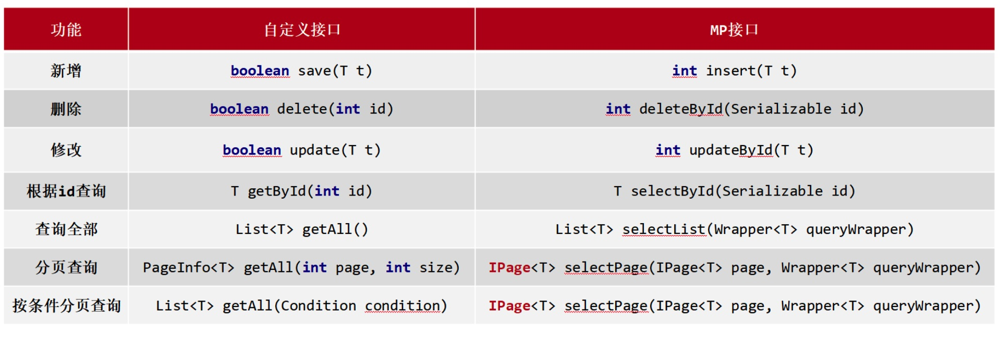

## MybatisPlus 对 Mybatis的主要扩展有：

### 1. DAO接口可以继承BaseMapper\<T\>，从而可以自动获取到下面的方法：



### 2. Wrapper

BaseMapper中的查询方法除了selectById，另外一个重要的方法是根据Wrapper查询。

第一种 QueryWrapper：

```java
QueryWrapper qw = new QueryWrapper();
qw.lt("age",18);
List<User> userList = userDao.selectList(qw);
```

第二种，QueryWrapper的基础上可以使用lambda：

```java
QueryWrapper<User> qW = new QueryWrapper<User>();
qw.lambda().lt(user::getAge, 10)；//添加条件
List<User> userList = userDao.selectList(qw);
```

第三种 LambdaQueryWrapper：

```java
LambdaQueryWrapper<User> lqw = new LambdaQueryWrapper<User>()；
lqw.lt(User::getAge, 10);
List<User> userList = userDao.selectList(lqw);
```

关于QueryWrapper，还有下面的知识点：

1. 多条件构建
2. null判定
3. 查询投影
4. 查询指定字段
5. 聚合查询
6. 分组查询
7. 等值查询
8. 范围查询
9. 模糊查询
10. 排序查询


### 3.DML编程控制

1. ID生成策略控制 @TableId
2. 多记录操作 selectBatchIds
3. 逻辑删除 @TableLogic(value="0",delval="1")
4. 乐观锁 @Version，乐观锁拦截器optimisticLockerInnerInterceptor


