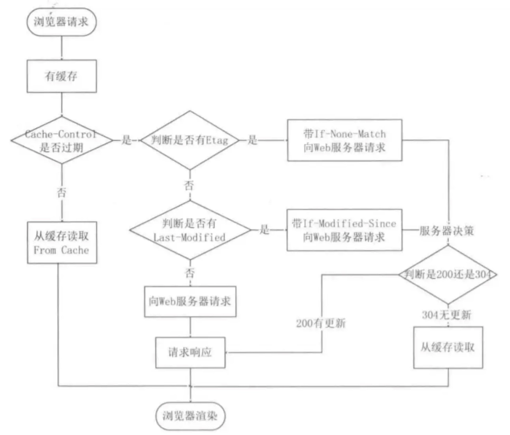
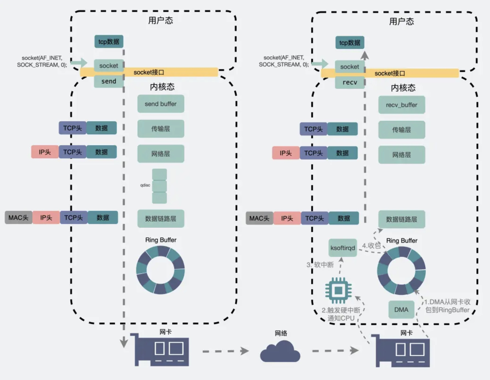

## IPv4地址，网络地址，子网掩码

IPv4地址 & 子网掩码 = 网络地址

网络地址表示一段IP地址，有许多主机地址共享同一个网络地址。

但我们如何知道一个网络地址下可以分配多少个主机地址呢？此时我们需要知道一个网络地址使用的子网掩码有多少位，因此，CIDR网络地址表示法对网络地址后加了/x，其中x表示子网掩码的长度，例如有一个IPv4地址 192.168.50.10，它的子网掩码是255.255.192.0，那么它的子网掩码有18位，网络地址是 192.168.50.10 & 255.255.192.0 = 192.168.0.0，因此它的网络地址的CIDR表示法就是 192.168.0.0/18。


## 4种NAT技术类型 https://blog.csdn.net/weixin_55807049/article/details/122746836

### 1.Static NAT

网关有一个可以分配的公网段，将私网IP和公网IP进行一一对应。

### 2.Dynamic NAT

网关有一个可以分配的公网地址池，路由器将PC的私网IP地址替换为空闲的公网IP地址，然后访问Internet。公网地址和私网地址仍然是一一对应的，无法提高公网地址的利用率。

### 3.NAPT(Network Address Port Translation)

从地址池中选择地址时，网络地址和端口转换 (NAPT) 不仅会转换 IP 地址，还会转换端口号。可以节省IP地址。

### 4.Easy IP

特殊的NAPT，没有地址池，所有的私网地址都只能映射到一个公网地址，然后通过端口号来区分。


## 什么是Restful编程风格？

RESTfuI是一种基于 HTTP 协议的软件设计风格，用于构建网络应用程序和服务。它的核心思想是将网络资源视为一种“状态〞，并通过 HTTP 协议进行数据的传输和操作的执行。具体来说，RESTful使用 URI（统一资源标识符）来定位资源，并使用HTTP的各种操作方法（如 GET、POST、PUT 和 DELETE）来对这些资源的状态进行更新和管理。此外，RESTful 设计是无状态的，这意味着服务器不会维持与客户端的连接状态，每次请求都是独立的。这样的设计使得系统更加灵活和易于扩展，能够轻松地处理并发请求和负载均衡。


## HTTP

### 1.什么是HTTP

HTTP全称叫HyperText Transfer Protocol，中文叫超文本传输协议。它是一个用于点对点传输超文本的应用层协议。超文本是指文字、图片、视频等数据的混合体，最关键的是还有超链接，能够从一个超文本跳转到另一个超文本。HTML就是最常见的一种超文本。

我们把超文本的请求方称为HTTP客户端，大多数情况是浏览器，把超文本的提供方称为服务端，大多数情况是Web Server。

### 2.HTTP的工作原理

HTTP的工作原理是基于两种报文的。客户端发送请求报文，服务端回复响应报文。

#### 请求报文

请求报文的结构分为请求行、请求头、请求体。其中，请求行由请求方式、URL和版本号构成。

```
<method><request-URL><version> <headers> <entiry-body>
```

在Restful软件设计风格中，HTTP的每一种请求方式都有各自的含义：

+ GET：用于从服务器获取数据。它是幂等的。
+ POST：用于提交数据到服务器。非幂等的。
+ PUT：与POST都是提交数据，但PUT是用来更新一个已经存在的实体。
+ DELETE：从服务器删除数据。

请求的URL是指请求的路径，通常是由服务器的域名加服务器上资源的路径构成的。这个URL可能请求的是静态资源，则服务器返回对应的数据，如果请求的是动态资源，那么服务器会调用对应的Servlet去执行函数，然后返回函数的返回值。

请求行的最后是版本号。HTTP最有名的几个版本是HTTP1,1、HTTP2.0、HTTP3.0。

请求头是按照key-value来组织的，有许多字段，例如：

+ Content-Length：表示请求体的长度。由于HTTP一直到2.0都是用的TCP，TCP是面相字节流的，会有粘包问题。所以HTTP在应用层必须能够处理包的分界线。请求行和请求头中的每个键值对都是用回车和换行符来分隔的，请求头结束的时候还有一个空行。请求体的长度就是用Content-Length来标识的。
+ User-Agent：客户端浏览器类型、操作系统类型等等。
+ Accept-Language：客户端接受的语言。
+ Accept-Encodings：客户端可识别的编码方式。
+ Cookie：客户端携带的Cookie数据。
+ Connection：表示是否启用长连接。
+ 等等

请求体通常用于携带数据，GET方法因为是从服务器取数据，所以通常没有请求体，如果它有参数的话是直接放在URL后面；POST方法用于提交数据，这些数据就放在请求体中。

#### 响应报文

响应报文由响应行、响应头和响应体构成。其中，响应行由版本号、状态码和状态码说明构成。

```
<version><status><reason-phrase> <headers> <entity-body>
```

响应行的版本号也就是HTTP的版本号。

状态码和状态码说明是表达对HTTP请求的响应结果，一般有以下几种状态码：

+ 1xx：是一种中间状态，表示请求已经接受，服务器正在处理。例如101表示协议切换，从HTTP切换WebSocket协议时使用。
+ 2xx：请求成功。例如200表示ok。
+ 3xx：重定向。例如301表示永久重定向，所请求的资源被移动了别处的话就返回这个状态码。304表示重定向到客户端的本地缓存。
+ 4xx：客户端错误。例如404表示客户端请求了不存在的资源。403表示客户端权限不够。
+ 5xx：服务端错误。例如502 Bad Gateway，通常是网关无法获得后台服务器的正常响应，

响应头的常用字段有：

+ Content-Length：响应体的长度。
+ Expires：过期时间。因为客户端会缓存响应，在过期之前再次访问的话可以使用缓存。HTTP有具体的缓存策略。

响应体就是要请求的数据，可能是HTML，也可能是JSON格式的数据等等。


综上，HTTP协议的工作原理就是客户端发送请求报文，服务端回复响应报文。

关于报文的传输模式，可以从HTTP协议演化的角度去说明。


### 3.HTTP协议的演化

在HTTP1.1之前，每个HTTP请求发送前都需要建立TCP连接，响应后关闭连接。我们知道HTTP传输的是超文本，所以客户端极有可能连续请求非常多的资源，这样效率极低。所以在HTTP1.1时，引入了长连接，就是除非显式的关闭TCP连接，否则HTTP就保持并复用TCP连接。

HTTP1.1的另一个重大改进是支持管道传输，在这之前HTTP是停等式传输。管道传输提高了HTTP的传输效率。


HTTP2.0引入了一些新的优化。总结为4个方面。

1. 头部压缩。HTTP请求头和响应头其实有点大，如果要提交的数据量很小的话，其实有效负载率很低。因此，HTTP2.0中，如果客户端发送许多请求头相同的请求，那么会使用HPACK算法进行压缩。这是一种结合了压缩表、哈夫曼编码等算法的算法。
2. 二进制格式。在HTTP1.1中，请求和响应的头部字段都是按照文本格式编码的，很浪费空间。HTTP2.0采用二进制编码格式。
3. 支持并发传输。在HTTP1.1中，虽然实现了HTTP请求的管道化传输，但是服务器在处理时还是只能顺序处理，如果有一个请求卡住，那么后续的请求都被阻塞。在HTTP2.0中，引入了stream的概念，每个请求都会有一个所属的stream，这些stream虽然复用一条TCP连接，但是他们之间是隔离的，可以并发传输。这样就解决了HTTP的队头阻塞问题。但由于底层还是用的TCP，所以还是会有TCP层面的队头阻塞问题。
4. 服务器主动推送。HTTP/2 还在一定程度上改善了传统的「请求 - 应答」工作模式，服务端不再是被动地响应，可以主动向客户端发送消息。客户端和服务器双方都可以建立 Stream， Stream ID 也是有区别的，客户端建立的 Stream 必须是奇数号，而服务器建立的 Stream 必须是偶数号。

HTTP3.0的变化更大。

1. 采用基于UDP的QUIC传输协议。TCP的可靠性保障中，如果接受窗口中有未接收到的字节，那么整个窗口都无法向前移动，而且应用程序也不能从内核拿到数据。这就是TCP层面的队头阻塞。

    在HTTP2.0中，多个Stream共用一个TCP连接，所以如果发生TCP的队头阻塞，那么后续到达的其他Stream的数据也无法被接收。所以HTTP3.0采用基于UDP的QUIC协议，QUIC为每个Stream分配了单独的滑动窗口，于是当某个流发生丢包时，只会阻塞这个流，其他流不会受到影响，因此不存在队头阻塞问题。

    此外，QUIC的流量控制有Stream级别和Connection级别的。Stream级别是针对每个Stream独立的接受窗口进行的，Connection级别是对所有Stream的窗口总和进行的。

    QUIC采用了与TCP相同的拥塞控制。

2. 更快的连接建立。HTTP2.0使用的TCP协议在建立连接时，TCP三次握手加TLS握手，总共需要3个RTT时间。而QUCI协议中只需要1个RTT。

3. 连接迁移功能。因为HTTP3.0是基于UDP的，所以客户端和服务端的连接其实是逻辑连接，而不是TCP的物理连接。这个逻辑连接就是用Stream ID来标识的。所以如果客户端从切换了WIFI之类的操作使得IP地址改变，也不会导致连接被破坏。


### 4.HTTPS

HTTP 的报文是明文传输的，会泄漏请求参数、请求数据等等。

HTTPS 在 HTTP 与 TCP 层之间加入了 SSL/TLS 协议。HTTPS与HTTP的区别在于：

1. 机密性：使用混合加密传输。在TLS握手阶段，采用非对称加密和服务端商议出一份对称密钥。在之后的传输过程中使用对称加密通信。解决了窃听的风险。
2. 完整性：服务端对报文进行摘要，然后对摘要进行数字签名，客户端可以用公钥验证数字签名。解决了报文被篡改的风险。
3. 使用数字证书保证公钥是可信的。


### 5.HTTP的缓存策略

HTTP 缓存有两种实现方式，分别是**强制缓存和协商缓存**。

#### 1.强制缓存

强制缓存指的是只要浏览器判断缓存没有过期，则直接使用浏览器的本地缓存，决定是否使用缓存的主动性在于浏览器这边。

强缓存是利用下面这两个 HTTP 响应头部（Response Header）字段实现的，它们都用来表示资源在客户端缓存的有效期：

- `Cache-Control`， 是一个相对时间；
- `Expires`，是一个绝对时间；

如果 HTTP 响应头部同时有 Cache-Control 和 Expires 字段的话，**Cache-Control 的优先级高于 Expires**。

Cache-control 选项更多一些，设置更加精细，所以建议使用 Cache-Control 来实现强缓存。具体的实现流程如下：

- 当浏览器第一次请求访问服务器资源时，服务器会在返回这个资源的同时，在 Response 头部加上 Cache-Control，Cache-Control 中设置了过期时间大小；
- 浏览器再次请求访问服务器中的该资源时，会先**通过请求资源的时间与 Cache-Control 中设置的过期时间大小，来计算出该资源是否过期**，如果没有，则使用该缓存，否则重新请求服务器；
- 服务器再次收到请求后，会再次更新 Response 头部的 Cache-Control。

#### 2.协商缓存

协商缓存与强制缓存的区别是，第二次访问时，浏览器仍然向服务器发出请求，由服务器选择是否让浏览器使用缓存。如果不使用，服务器就正常返回数据，如果使用，就返回304重定向，让浏览器使用缓存。

服务器作出是否使用缓存的判断有两套依据：

1. 基于时间的判断。请求头部中的 `If-Modified-Since` 字段与响应头部中的 `Last-Modified` 字段实现。
    + 服务器在响应头中会将资源的最后修改时间放入 last-modified 字段。
    + 当浏览器第二次请求资源时，它会将第一次请求时收到的响应头中的资源最后修改时间放入本次请求头的 if-modified-since 字段。用于告知服务器它现在所持有的资源的版本。
    + 服务器收到含有if-modified-since字段的请求后，检查在时间之后资源是否发生过修改，如果没有则返回304。
2. 基于版本号的判断。工作原理与基于时间的判断一样，只不过是借助请求头中的 `If-None-Match` 字段与响应头部中的 `ETag` 字段来实现。
    + 服务器在响应头中会将资源当前的版本号放入 etag 字段。
    + 当浏览器第二次请求资源时，它会将第一次请求时收到的响应头中的资源版本号放入本次请求头的 if-none-match 字段。用于告知服务器它现在所持有的资源的版本。
    + 服务器收到含有 if-none-match 字段的请求后，检查与资源当前的版本号是否一致，一致则返回304。


综上，一共有3组字段来支持HTTP的缓存机制。具体的工作流程是：先进行强缓存判断，不命中时再进行协商缓存，其中优先基于版本号的判断，如果还不命中，最终进行基于时间的判断。

流程图如下：




## HTTP是全双工吗？

单工： 数据传输只允许在一个方向上的传输，只能一方来发送数据，另一方来接收数据并发送。

半双工：数据传输允许两个方向上的传输，但是同一时间内，只可以有一方发送或接受消息。

全双工：同时可进行双向传输。例如：`websocket`。

http1.1是半双工，http2.0是全双工(支持服务器推送)。


## TCP

TCP的全称是Transmission Control Protocol，中文叫传输控制协议。它是一个用于面向连接的、可靠的、基于字节流的传输层协议。由于传输层是按照端口号来区分应用程序的，所以TCP的包头中源端口号和目的端口号。TCP包的包头是20-60字节。

下面从3个角度来说明TCP的工作原理。

### 1.面向连接

TCP是端到端传输的协议，这里的端是指某台主机上的一个引用程序，使用IP地址+端口号来标识。在开启传输之前，TCP需要进行3次握手。

1. 客户端发送SYN报文，携带序列号给服务器，请求建立连接，进入SYN_SENT状态。
2. 服务端收到序列号后，返回ACK和自身的SYN序列号，ACK为收到的syn+1，并进入半连接状态，SYN_RCVD状态。
3. 客户端收到服务端的ack和序列号后，将序列号加一作为ack回复给服务端，进入已连接状态。服务端收到ack后也进入已连接状态。

在关闭连接时。要进行4次挥手。关闭连接可能是任意一方发起的，这里以客户端发起举例。

1. 客户端发送FIN报文，请求关闭连接。这表明客户端没有要向服务端发送的数据了。
2. 服务端返回ACK，进入CLOSE_WAIT状态。
3. 服务端发送完成传输后，发送FIN报文，表面服务端没有要向客户端发送的数据了。
4. 客户端返回ACK，等待两个MSL时间后关闭连接。MSL(Maximum Segment Lifetime)是报文最长存活时间，这有两个原因：
    1. 防止历史连接中的数据，被后面相同四元组的连接错误的接收；
    2. 保证「被动关闭连接」的一方，能收到ACK而正确的关闭；


### 2.可靠性

TCP能够保证将传输的数据按顺序无误的交给应用层。

这是由下面的机制实现的：

1. 序号机制和ACK。TCP流的每个字节都有序号，一个TCP包的负载的第一个字节的序号会被记录到包头中。接收方会对已经累计接收到的字节进行ACK确认，这样发送方就能知道哪些字节成功传输了，而哪些失败了。
2. 校验和机制。TCP包头有一个校验和字段，如果接收方校验失败，则不会对该包进行ACK。
3. 重传机制。超时重传是指发送方会对每个已发送的包进行计时，在指定时间内没有收到ACK就要重发这个包。快速重传是指发送方连续收到3个同样的ACK，则说明这个ACK的下一个包丢失了，且后续的包已经到到达了，此时发送方直接重传这个包。
4. 流量控制。为了使得发送方的发送速率能够匹配接受方的接收速率。发送方有发送窗口，接收方有接收窗口。
    1. 为了避免窗口关闭问题，发送方要定期发送窗口探测报文。
    2. 为了避免糊涂窗口综合症，接收方不返回小窗口，发送方采用Nagle算法延迟发送。
5. 拥塞控制。为了避免在网络拥塞的情况下高速发送数据，使得网络更加恶化。
    1. 慢启动
    2. 拥塞避免
    3. 拥塞发生
    4. 快速恢复


### 3.字节流

首先说一下TCP是如何分包的。由于TCP的可靠性传输，TCP的包如果丢失或有差错则需要整个包进行重传，如果传输层的TCP包很大的话，经过IP层分片后，可能会对应多个IP包，这些IP包是分开传输的， 那么只要有一个发生错误，则其他IP包都要重传，这样效率很低。因此，TCP在传输层按照MSS对字节流进行分割，MSS指Maximum Segment Size。也就是TCP层一个包叫做一个段。每个段的最大长度被设置为小于MTU，也就是以太网的最大包长。这样的话，一个段发生错误不会牵连到其他段。

因此，应用层的一个报文message，发给传输层之后会被TCP分成多个段进行传输。同时由于缓冲区的存在，发送方可能把下一条消息的一部分也拿到当前TCP包中进行传输，这就是粘包问题。因此，在接收方看来收到的数据就是一个字节流，要从中提取出完整的应用层消息，需要应用层自己来设置边界。具体方法有：

1. 固定长度消息。
2. 特殊字符来作为边界。HTTP就是一个很好的例子，请求头中的每个字段结尾都有回车和换行符。请求头结尾还有一个空行。
3. 消息中携带长度字段。例如HTTP的Content-Length。


## TCP和UDP的区别

1. TCP面向连接，需要3次握手4次挥手，而UDP是无连接的，直接发送。
2. TCP是可靠传输，保证数据按序完整的到达，而UDP是尽力传输，不做任何保障。
3. TCP是基于字节流的，会有粘包问题，而UDP是基于数据包的，没有粘包问题。
4. TCP是有状态的，因为TCP的重传机制需要记录消息是否被接收。UDP是无状态的，消息从主机进入网络后就不再留存记录了。
5. TCP传输效率比UDP低。这是因为TCP的复杂机制，包括ACK机制、流量控制、拥塞控制等。
6. TCP头部开销更大，包头20-60字节，而UDP只有8字节。
7. TCP只支持一对一传输，UDP支持广播。


## TCP和UDP可以绑定到同一个端口吗？

可以。服务端的内核网络协议栈在处理接收到的包时，从下到上处理，在网络层时，根据IP包头中的字段判断应该把IP Payload交给上层的那个模块处理。TCP和UDP是完全不同的两个模块，一个IP包的负载只会被传递到其中的一个。这两个模块内部会根据传输层包的端口来决定交给哪个Socket。所以TCP和UDP的网络端口号是隔离的。


## 多个TCP服务进程可以绑定到同一个端口吗？

不行。除非这些进程使用主机上不同的IP。


## 多个TCP客户端进程可以绑定同一个端口吗？

bind 函数虽然常用于服务端网络编程中，但是它也是用于客户端的。

前面我们知道，客户端是在调用 connect 函数的时候，由内核随机选取一个端口作为连接的端口。

而如果我们想自己指定连接的端口，就可以用 bind 函数来实现：客户端先通过 bind 函数绑定一个端口，然后调用 connect 函数就会跳过端口选择的过程了，转而使用 bind 时确定的端口。

针对多个客户端是否能绑定同一个端口，要看多个客户端绑定的 IP + PORT 是否都相同，如果都是相同的，那么在执行 bind() 时候就会出错，错误是“Address already in use”。


## Linux发送和接收网络包的流程

### 1.发送网络包

首先，应用程序会调用 Socket 发送数据包的接口，由于这个是系统调用，所以会从用户态陷入到内核态中的 Socket 层，内核会申请一个内核态的 sk_buff 内存，**将用户待发送的数据拷贝到 sk_buff 内存，并将其加入到发送缓冲区**。

接下来，网络协议栈从 Socket 发送缓冲区中取出 sk_buff，并按照 TCP/IP 协议栈从上到下逐层处理。

如果使用的是 TCP 传输协议发送数据，那么**先拷贝一个新的 sk_buff 副本** ，这是因为 sk_buff 后续在调用网络层，最后到达网卡发送完成的时候，这个 sk_buff 会被释放掉。而 TCP 协议是支持丢失重传的，在收到对方的 ACK 之前，这个 sk_buff 不能被删除。所以内核的做法就是每次调用网卡发送的时候，实际上传递出去的是 sk_buff 的一个拷贝，等收到 ACK 再真正删除。

接着，对 sk_buff 填充 TCP 头。这里提一下，sk_buff 可以表示各个层的数据包，在应用层数据包叫 data，在 TCP 层我们称为 segment，在 IP 层我们叫 packet，在数据链路层称为 frame。

然后交给网络层，在网络层里会做这些工作：选取路由（确认下一跳的 IP）、填充 IP 头、netfilter 过滤、对超过 MTU 大小的数据包进行分片。处理完这些工作后会交给网络接口层处理。这里要注意，如果要进行IP分片，那么sk_buff在IP层就又进行了一次复制。

网络接口层会通过 ARP 协议获得下一跳的 MAC 地址，然后对 sk_buff 填充帧头和帧尾，接着将 sk_buff 放到网卡的发送队列RingBuffer中。

这一些工作准备好后，会触发「软中断」告诉网卡驱动程序，这里有新的网络包需要发送，驱动程序会从 RingBuffer 中取出sk_buff，接着将 sk_buff 数据映射到网卡可访问的内存 DMA 区域，最后触发真实的发送。

当发送完成的时候，网卡设备会触发一个硬中断来释放内存，主要是释放 sk_buff 内存和清理 RingBuffer 内存。

最后，当收到这个 TCP 报文的 ACK 应答时，传输层就会释放原始的 sk_buff 。

#### 发送网络数据的时候，涉及几次内存拷贝操作？

第一次，调用发送数据的系统调用的时候，内核会申请一个内核态的 sk_buff 内存，将用户待发送的数据拷贝到 sk_buff 内存，并将其加入到发送缓冲区。

第二次，在使用 TCP 传输协议的情况下，从传输层进入网络层的时候，每一个 sk_buff 都会被克隆一个新的副本出来。副本 sk_buff 会被送往网络层，等它发送完的时候就会释放掉，然后原始的 sk_buff 还保留在传输层，目的是为了实现 TCP 的可靠传输，等收到这个数据包的 ACK 时，才会释放原始的 sk_buff 。

第三次，当 IP 层发现 sk_buff 大于 MTU 时才需要进行。会再申请额外的 sk_buff，并将原来的 sk_buff 拷贝为多个小的 sk_buff。


### 2.接收网络包

当网卡接收到一个网络包后，会通过 DMA 技术，将网络包写入到指定的内存地址，也就是写入到 Ring Buffer ，这个是一个环形缓冲区，接着就会告诉操作系统这个网络包已经到达。

网卡通知操作系统网络报到达是通过向 CPU 发起硬件中断来完成的。当 CPU 收到硬件中断请求后，根据中断表，调用已经注册的中断处理函数。

硬件中断处理函数会做如下的事情：

- 需要先「暂时屏蔽中断」，表示已经知道内存中有数据了，告诉网卡下次再收到数据包直接写内存就可以了，不要再通知 CPU 了，这样可以提高效率，避免 CPU 不停的被中断。
- 接着，发起「软中断」，然后恢复刚才屏蔽的中断。

至此，硬件中断处理函数的工作就已经完成。

硬件中断处理函数做的事情很少，主要耗时的工作都交给软中断处理函数了。

内核中的 ksoftirqd（kernel software IRQ daemon) 线程专门负责软中断的处理，当 ksoftirqd 内核线程收到软中断后，就会来轮询处理数据。ksoftirqd 线程会从 Ring Buffer 中获取一个数据帧，用 sk_buff 表示，从而可以作为一个网络包交给网络协议栈进行逐层处理。

首先，会先进入到网络接口层，在这一层会检查报文的合法性，如果不合法则丢弃，合法则会找出该网络包的上层协议的类型，比如是 IPv4，还是 IPv6，接着再去掉帧头和帧尾，然后交给网络层。

到了网络层，则取出 IP 包，判断网络包下一步的走向，比如是交给上层处理还是转发出去。当确认这个网络包要发送给本机后，就会从 IP 头里看看上一层协议的类型是 TCP 还是 UDP，接着去掉 IP 头，然后交给传输层。

传输层取出 TCP 头或 UDP 头，根据四元组「源 IP、源端口、目的 IP、目的端口」 作为标识，找出对应的 Socket，并把数据放到 Socket 的接收缓冲区。

最后，应用层程序调用 Socket 接口，将内核的 Socket 接收缓冲区的数据「拷贝」到应用层的缓冲区。




## RPC

RPC全称是Remote Procedure Call，中文叫远程过程调用。它的作用就是使得调用远程服务像调用本地方法一样方便。

RPC框架的核心组件有4个：

1. 客户端：服务的调用者
2. 客户端存根（Client Stub）：存放服务端地址信息，将客户端的请求参数数据信息打包成网络消息，再通过网络传输发送给服务存根。
3. 服务端存根（Server Stub）：接收客户端发送过来的请求消息并进行解包，然后再调用本地服务进行处理。
4. 服务端：服务的真正提供者。

一次 RPC 调用流程如下：

1. 服务消费者(Client 客户端)通过本地调用的方式调用服务。
2. 客户端存根(Client Stub)接收到调用请求后负责将方法、入参等信息序列化(组装)成能够进行网络传输的消息体。
3. 客户端存根(Client Stub)找到远程的服务地址，并且将消息通过网络发送给服务端。
4. 服务端存根(Server Stub)收到消息后进行解码(反序列化操作)。
5. 服务端存根(Server Stub)根据解码结果调用本地的服务进行相关处理
6. 服务端(Server)本地服务业务处理。
7. 处理结果返回给服务端存根(Server Stub)。
8. 服务端存根(Server Stub)序列化结果。
9. 服务端存根(Server Stub)将结果通过网络发送至客户端。
10. 客户端存根(Client Stub)接收到消息，并进行解码(反序列化)。
11. 服务消费方得到最终结果。

由此可见，RPC这个远程调用方法，包括了通信协议和序列化协议。

在通信协议方面，RPC也可以直接使用传输层的TCP，也可以复用HTTP进行传输。例如Google的gRPC就是利用HTTP2.0来进行网络传输的。

在序列化协议方面，RPC的定制化程度更高。只要客户端和服务端使用同样的序列化规则即可，因此RPC的远程调用传递的参数可以非常简洁。相比于只使用HTTP进行远程服务，RPC的效率更高。因此RPC通常使用在微服务集群内部的远程服务调用，而对外则使用更加复杂和通用的HTTP。


## Web Socket

Web Socket是在HTTP1.1之后提出的应用层协议，相比于HTTP1.1它的主要改进是全双工的通信机制，因此在对实时交互或者服务器推送有要求的场景下可能会使用Web Socket。

在HTTP1.1中，服务器不能主动推送数据到客户端。只能使用客户端定时轮询或者长轮询机制。

1. 定时轮询就是客户端以较高的频率发送HTTP请求，检查是否要更新数据。例如微信公众号平台扫码登录。
2. 长轮询就是客户端设置HTTP请求的过期时间很长，服务器在收到请求后可以等待一段时间再回复。例如百度网盘网页版，在登录时会等待服务器的响应时间较长，只要手机端点击登陆，服务器就会立刻响应。

像登录这种简单的场景可以使用轮询机制，但如果是网页游戏这种场景，就需要全双工机制了。

Web Socket建立连接的方式是先通过TCP3次握手建立HTTP连接，然后客户端在HTTP请求头中使用 Upgrade: WebSocket 字段来请求升级协议。服务器使用状态码101来响应。之后客户端和服务端就可以使用Web Socket进行通信了。


## Socket 编程

### 1.TCP

客户端：socket, connect, read/write, close

服务端：socket, bind, listen, accpet, read/write, close

#### 客户端的connect

TCP的三次握手是在客户端使用connect后开启的，当服务器返回ack时，connect发送第三次握手并返回。此时，客户端已经可以向服务端发送数据了。但是注意，虽然客户端已经是ESTABLISH状态了，但是第三次握手如果在网络中丢失，那么服务端就还没有建立连接，服务端在指定时间内收不到ack就会重传syn+ack，直到建立连接或删除半连接。

#### 服务端的listen

服务端对socket在listen这一步会创建两个队列，半连接队列和已连接队列。

+ 半连接队列。其中存储的是只经过两次握手，正在等待客户端第三次握手的连接。

    + 该队列中的socket都处于SYN_RECV状态。
    + 该队列底层使用哈希表实现。因为当服务端收到客户端的第三次握手时，它需要找到之前存储的半连接socket，因此使用哈希表可以实现O(1)时间复杂度建立连接。

+ 已连接队列。已经完成三次握手，正在等待服务端使用accpet取走的连接。

    + 该队列中的ESTABLISHED状态。

    + 该队列底层使用链表实现。因为accept函数只需要从中取走一个已建立的连接即可，并不关心是哪一个，所以可以直接取出头节点socket。

        

服务端调用listen后，有操作系统内核将与到达的SYN消息建立连接，而用户进程不需要管理这些事情，所以listen函数不会阻塞。内核会将经过两次握手的socket放在半连接队列，如果收到第三次握手则将其转移到已连接队列。

**由此可见，即使不调用accept，tcp连接也可以正常建立。**

listen函数除了接收socket作为参数，还接受一个backlog参数。早期它的含义是半连接队列的最大长度，现在它的含义是和内核参数共同决定半连接队列和已连接队列的somaxconn(socket maximum connection)最大长度。

+ 已连接队列的最大长度：min(somaxconn, backlog)
+ 半连接队列的最大长度稍微复杂，但也和backlog有关系。
    + 当 max_syn_backlog > min(somaxconn, backlog) 时， 半连接队列最大值 max_qlen_log = min(somaxconn, backlog) * 2;
    + 当 max_syn_backlog < min(somaxconn, backlog) 时， 半连接队列最大值 max_qlen_log = max_syn_backlog * 2;

在默认行为下，如果半连接或已连接队列满了，那么新的连接请求就会被丢弃。

#### 服务端的accept

应用程序在listen后会调用accept函数，这时可能会发生阻塞。

accept函数的作用就是从已连接队列中取出一个socket。如果调用accept时已连接队列为空，则该函数会阻塞等待。

在取出已连接socket后，主线程需要让其他线程处理该socket的通信，而自己本身需要再次去调用accept来检查是否有新的已连接socket。


## 如何防御SYN攻击

### 1.增大半连接队列

修改内核参数。增大 tcp_max_syn_backlog 和 somaxconn等参数。指标不治本。

### 2.减少SYN+ACK的重传次数

当服务器的半连接队列中的socket接收不到第三次握手时，有可能是正常连接只不过发生了丢包。所以服务器会重传SYN+ACK，希望能够得到客户端的第三次握手。只有在重传达到上限后才会主动删除半连接。所以为了防止半连接占用太多资源，可以减少重传次数。

### 3.开启 tcp_syncookies 功能

该机制的核心思想就是在完成三次握手前不为socket分配资源。因此，就不会占用半连接队列。那么原本半连接socket需要维护的信息，就是通过写在第二次握手的初始化序列号里，从而让客户端第三次握手时自带该信息。

net.ipv4.tcp_syncookies 参数主要有以下三个值：

- 0 值，表示关闭该功能；
- 1 值，表示仅当 SYN 半连接队列放不下时，再启用它；
- 2 值，表示无条件开启功能；

当启用该功能时，工作步骤如下：

- 服务端收到 SYN 后，根据算法，计算出一个 `cookie`值；
- 将 cookie 值放到第二次握手报文的「序列号」里，然后服务端回第二次握手给客户端；
- 服务端接收到客户端的应答报文时，服务端会检查这个 ACK 包的合法性。如果合法，将该连接对象放入到「 Accept 队列」。
- 最后应用程序通过调用 `accpet()` 接口，从「 Accept 队列」取出的连接。


## DHCP

DHCP全称Dynamic Host Configuration Protocol，中文为动态主机配置协议。该协议允许DHCP服务器动态的为客户端分配IP地址。

先说明一点，DHCP 客户端进程监听的是 68 端口号，DHCP 服务端进程监听的是 67 端口号。

DHCP分配IP地址的过程如下：

1. 客户端首先发起 **DHCP 发现报文（DHCP DISCOVER）** 的 IP 数据报，由于客户端没有 IP 地址，也不知道 DHCP 服务器的地址，所以使用的是 UDP **广播**通信，其使用的广播目的地址是 255.255.255.255（端口 67） 并且使用 0.0.0.0（端口 68） 作为源 IP 地址。DHCP 客户端将该 IP 数据报传递给链路层，链路层然后将帧广播到所有的网络中设备。
2. DHCP 服务器收到 DHCP 发现报文时，用 **DHCP 提供报文（DHCP OFFER）** 向客户端做出响应。该报文可能使用单播，也可能使用广播，取决于网络配置。如果使用广播，则IP 广播地址 255.255.255.255。该报文携带服务器提供的 IP 地址、子网掩码、默认网关、DNS 服务器以及 **IP 地址租用期**。
3. 客户端收到一个或多个服务器的 DHCP 提供报文后，从中选择一个服务器，广播 **DHCP 请求报文（DHCP REQUEST**进行响应，回显配置的参数。此时源地址仍然为0.0.0.0。
4. 最后，服务端用 **DHCP ACK 报文**对 DHCP 请求报文进行响应，应答所要求的参数。

一旦客户端收到 DHCP ACK 后，交互便完成了，并且客户端能够在租用期内使用 DHCP 服务器分配的 IP 地址。

如果租约的 DHCP IP 地址快期后，客户端会向服务器发送 DHCP 请求报文：

- 服务器如果同意继续租用，则用 DHCP ACK 报文进行应答，客户端就会延长租期。
- 服务器如果不同意继续租用，则用 DHCP NACK 报文，客户端就要停止使用租约的 IP 地址。

可以发现，DHCP 交互中，**全程都是使用 UDP 广播通信**。

如果 DHCP 服务器和客户端不是在同一个局域网内，路由器又不会转发广播包，那不是每个网络都要配一个 DHCP 服务器？所以，为了解决这一问题，就出现了 **DHCP 中继代理**。有了 DHCP 中继代理以后，**对不同网段的 IP 地址分配也可以由一个 DHCP 服务器统一进行管理。**

- DHCP 客户端会向 DHCP 中继代理发送 DHCP 请求包，而 DHCP 中继代理在收到这个广播包以后，再以**单播**的形式发给 DHCP 服务器。
- 服务器端收到该包以后再向 DHCP 中继代理返回应答，并由 DHCP 中继代理将此包广播给 DHCP 客户端 。


## ICMP

ICMP全称是Internet Control Message Protocol，中文叫互联网控制报文协议。它是用于传递互联网连接状态信息的网络层协议。

ICMP 大致可以分为两大类：

- 一类是用于诊断的查询消息，也就是「**查询报文类型**」，例如：

    - 回送请求（Echo Request）
    - 回送应答（Echo Reply）

    回送请求和回送应答的使用例子是ping程序。客户端进程发送回送请求向目标主机，如果目标主机能返回回送应答，则目标主机可达。

    另一类是通知出错原因的错误消息，也就是「**差错报文类型**」，例如：

    - **原点抑制（Source Quench）**：如果某个源主机向目的主机快速地发送数据包，但目的主机来不及处理，就会向源主机发出该类型的 ICMP 包，提醒源主机放慢发送速度。
    - **重定向（Redirect）**：如果某个源主机向网络中发送一个 IP 包，路径中某个路由器收到这个 IP 包，对照其路由表，发现自己不应该接收该包(包需要原路返回，或者不是最佳路由路径)，就会向源主机发送该类型的 ICMP 包，提醒源主机修改自己的路由表，下次路由到另外一个更好的路由器。
    - **分片错误**：如果某个源主机在发送一个 IP 包之前，对该 IP 包中的首部字段 DF 位设为 1，也就是“分片禁止位=1”，表示该包在传输的过程中不允许分片，但是中间某个路由器允许传输的最大路径 MTU 小于该包大小，需要分片才能传输，但是由于设置不分片位，路由器会将该包丢弃，并向源主机发送一个携带 MTU 信息的 ICMP 包，提醒源主机下次发包的大小不应超过该 MTU 的值。**traceroute程序利用该报文类型来探测两个主机之间的链路层MTU，实现方式就是逐步调整UDP包的大小，探测不分片的最大长度**。
    - **超时错误**：超时定义了数据包在网络中存活的最长时间，IPv4 中的 TTL 字段和 IPv6 中的 Hop Limit 字段都表示了这层意思，它们是一个整数值，会随着经过的路由器而递减，当减为 0 时，就认为该 IP 包超时，然后当前减为 0 的路由器会向源主机发送 ICMP 包，通知它发生了超时错误。**traceroute程序利用该报文类型探测两个主机之间路径上的路由器，实现方式就是递增TTL，导致每一个节点都会返回一次差错报文。traceroute请求目标主机一个没有被监听的端口，当到达主机后，返回的差错报文类型将是端口不可达**。


## UDP组播

组播报文的目的地址使用D类IP地址。在ip组播环中，数据包的目的地址不是一个，而是一组，形成组地址。所有的信息接收者都加入到一个组内，并且一旦加入之后，流向组地址的数据立即开始向接收者传输，组中的所有成员都能接收到数据包。组播组中的成员是动态的，主机可以在任何时刻加入和离开组播组。

用同一个IP多播地址接收多播数据包的所有主机构成了一个主机组，也称为多播组。一个多播组的成员是随时变动的，一台主机可以随时加入或离开多播组，多播组成员的数目和所在的地理位置也不受限制，一台主机也可以属于几个多播组。此外，不属于某一个多播组的主机也可以向该多播组发送数据包。  

#### **组播地址**

1. 组播组可以是永久的也可以是临时的。组播组地址中，有一部分由官方分配的，称为永久组播组。永久组保持不变的是它的ip地址，组中的成员构成可以发生变化。永久组播组中成员的数量都可以是任意的，甚至可以为零。那些没有保留下来供永久组播组使用的ip组播地址，可以被临时组播组利用。
2. 224.0.0.0～224.0.0.255为预留的组播地址（永久组地址），地址224.0.0.0保留不做分配，其它地址供路由协议使用；
3. 224.0.1.0～224.0.1.255是公用组播地址，可以用于Internet；
4. 224.0.2.0～238.255.255.255为用户可用的组播地址（临时组地址），全网范围内有效；
5. 239.0.0.0～239.255.255.255为本地管理组播地址，仅在特定的本地范围内有效。

组播是一对多的传输方式，其中有个组播组的 概念，发送端将数据向一个组内发送，网络中的路由器通过底层的IGMP协议自动将数据发送到所有监听这个组的终端。至于广播则和组播有一些相似，区别是路由器向子网内的每一个终端都投递一份数据包，不论这些终端是否乐于接收该数据包。UDP广播只能在内网（同一网段）有效，而组播可以较好实现跨网段群发数据。

### 组播的原理：

组播首先由一个用户申请一个组播组，这个组播组被维护在路由器中，其他用户申请加入组播组，这样当一个用户向组内发送消息时，路由器将消息转发给组内的所有成员。如果申请加入的组不在本级路由中，如果路由器和交换机允许组播协议通过，路由器将申请加入的操作向上级路由提交。**广域网通信要经过多级路由器和交换机，几乎所有的网络设备都默认阻止组播协议通过(只允许本网段内，不向上级提交)，这使得广域网上实现组播有一定局限**。


## IGMP

IGMP全称 Internet Group Management Protocol，中文是互联网组管理协议。他是工作在主机和最后一跳路由器之间网络层协议。

主机可以通过IGMP 报文向路由器申请加入和退出组播组，默认情况下路由器是不会转发组播包到连接中的主机，除非主机通过 IGMP 加入到组播组，主机申请加入到组播组时，路由器就会记录 IGMP 路由器表，路由器后续就会转发组播包到对应的主机了。

IGMP 报文采用 IP 封装，IP 头部的协议号为 2，而且 TTL 字段值通常为 1，因为 IGMP 是工作在主机与连接的路由器之间。

IGMP有两种工作机制：

### 1.常规查询与响应

1. 路由器会周期性发送目的地址为 `224.0.0.1`（表示同一网段内所有主机和路由器） **IGMP 常规查询报文**。
2. 主机1 和 主机 3 收到这个查询，随后会启动「报告延迟计时器」，计时器的时间是随机的，通常是 0~10 秒，计时器超时后主机就会发送 **IGMP 成员关系报告报文**（源 IP 地址为自己主机的 IP 地址，目的 IP 地址为组播地址）。如果在定时器超时之前，收到同一个组内的其他主机发送的成员关系报告报文，则自己不再发送，这样可以减少网络中多余的 IGMP 报文数量。
3. 路由器收到主机的成员关系报文后，就会在 IGMP 路由表中加入该组播组，后续网络中一旦该组播地址的数据到达路由器，它会把数据包转发出去。


 
