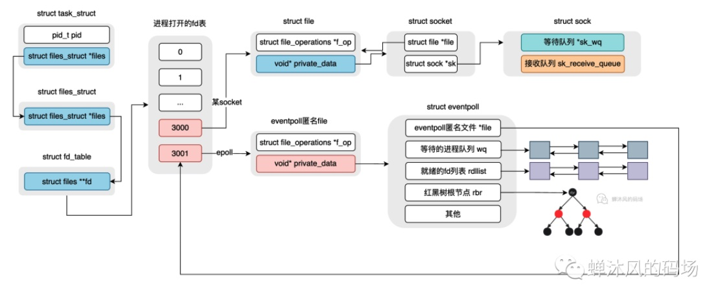
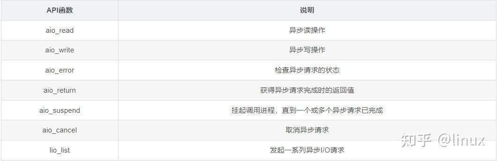
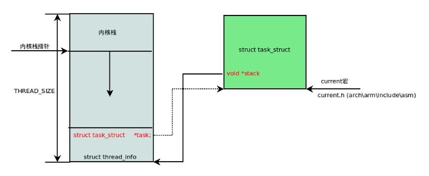

# 操作系统知识


## 中断

https://blog.csdn.net/qq_38089448/article/details/132457300

硬中断是外部硬件产生的,包括不可屏蔽中断NMI与可屏蔽中断INTR，硬中断可以嵌套。

软中断是内部产生的，是不可屏蔽中断，不可以嵌套。


## 逻辑地址、线性地址、物理地址

https://blog.csdn.net/qq_45675126/article/details/132269108

逻辑地址（logical address）:机器语言指令中用来指定一个操作数或一条指令的地址。每一个逻辑地址都由一个段和偏移量组成，偏移量指明了从段开始的地方到实际地址之间的距离。例如，c语言取指针的操作（&），这个值是逻辑地址，它是相对于你当前进程数据段的地址，不是物理地址。逻辑地址由两个16位的地址分量构成，一个为段基值，另一个为偏移量。两个分量均为无符号数编码。

线性地址（linear address）:也称虚拟地址（virtual address），是一个32位无符号整数，可以用来表示高达4GB的地址，是逻辑地址和物理地址之间的中间层，在分段部件中，逻辑地址就是段中的偏移地址，加上基地址就是线性地址。

物理地址（physical address）:用于内存芯片级内存单元寻址，它们从微处理器的地址引脚发送到内存总线上的电信号相对应。物理地址通常由32位或36位无符号整数表示。

> x86 CPU的内存管理设计的方案是 逻辑地址->线性地址->物理地址，也就是强制使用段页式内存管理。然而，linux系统不适用段式，只使用页式，所以就将程序的所有段映射到同一个线性空间，也就是所有段的基地址都是0，那么逻辑地址的所有位就都用来表示段内偏移量，也就等于线性地址了。而在 x86_64 的 CPU上已经抛弃了分段。


## 线程的3种类别

### 1.用户态线程

用户态线程只能实现并发，不能实现并行，操作系统对用户态线程无感知。

### 2.内核态线程

内核态线程在多核CPU上可以并行，有内核来进行调度。

### 3.轻量级进程

LWP是内核态线程与用户态线程的中间层，一个LWP对应一个内核态线程，对应一或多个用户态线程。LWP工作在用户空间，它本质上就是一组共享虚拟地址的进程，但由于属于同一组的LWP切换时上下文内容切换很少，更像线程的概念，所以称为轻量级进程。


## 进程间通信和线程间通信

https://blog.csdn.net/Bingo_Nong/article/details/114626446

### 通信模式

单工、半双工、全双工这三个术语描述了不同类型的通信方式，它们之间的主要区别在于数据的传输方向和是否允许同时的双向通信。

1. **单工通信（Simplex）：**
    - **定义：** 单工通信是指数据只能在一个方向上传输的通信方式。
    - **特点：** 在单工通信中，通信双方有一个固定的发送方和接收方。一方只能发送数据，而另一方只能接收数据。传统的广播电台和电视广播就是单工通信的例子，听众和观众只能接收信息，而不能向广播台发送信息。
2. **半双工通信（Half-Duplex）：**
    - **定义：** 半双工通信是指数据可以在两个方向上传输，但不能同时进行，通信双方在不同时间段内交替发送和接收数据。
    - **特点：** 在半双工通信中，通信双方可以在同一通信链路上发送和接收数据，但不能同时进行。对讲机通信就是一个半双工通信的例子，一方说话时另一方只能听，反之亦然。
3. **全双工通信（Full-Duplex）：**
    - **定义：** 全双工通信是指数据可以在两个方向上同时进行的通信方式。
    - **特点：** 在全双工通信中，通信双方可以同时发送和接收数据，允许双向通信。典型的例子是电话通信，双方可以同时说话和听对方说话，实现了双向的交互通信。


进程间通信可以分为相同主机的进程之间通信和不同主机的进程通信。

对于相同主机：

### 1.管道

管道本身是一种半双工通信方式，它是一个先进先出的队列。但是使用时通常确定了发送方和接收方之后就按照单工来使用，用两条管道来模拟全双工。

匿名管道只能在具有亲缘关系的进程间通信，例如linux命令中的竖线，用完就销毁。

有名管道会被抽象成一个文件，支持任意进程间通信，例如linux中用命令mkfifo可以创建有名管道。

### 2.消息队列

消息队列是保存在内核中的消息链表。在发送数据时，会分成一个一个独立的数据单元，也就是消息体（数据块），消息体是用户自定义的数据类型，消息的发送方和接收方要约定好消息体的数据类型，所以每个消息体都是固定大小的存储块，不像管道是无格式的字节流数据。如果进程从消息队列中读取了消息体，内核就会把这个消息体删除。

消息队列生命周期随内核，如果没有释放消息队列或者没有关闭操作系统，消息队列会一直存在，而前面提到的匿名管道的生命周期，是随进程的创建而建立，随进程的结束而销毁。

**消息队列不适合比较大数据的传输**，因为在内核中每个消息体都有一个最大长度的限制，同时所有队列所包含的全部消息体的总长度也是有上限。在 Linux 内核中，会有两个宏定义 `MSGMAX` 和 `MSGMNB`，它们以字节为单位，分别定义了一条消息的最大长度和一个队列的最大长度。

**消息队列通信过程中，同样存在存在用户态与内核态之间的数据拷贝开销**，因为进程写入数据到内核中的消息队列时，会发生从用户态拷贝数据到内核态的过程，同理另一进程读取内核中的消息数据时，会发生从内核态拷贝数据到用户态的过程。

### 3.共享内存

管道和消息队列的读取和写入的过程，都会有发生用户态与内核态之间的消息拷贝过程。那**共享内存**的方式，就很好的解决了这一问题。

现代操作系统对于内存管理，采用的是虚拟内存技术，也就是每个进程都有自己独立的虚拟内存空间，不同进程的虚拟内存映射到不同的物理内存中。共享内存机制就是就是拿出一块虚拟地址空间来，映射到相同的物理内存中来实现通信。共享内存通常需要进行并发控制，例如使用互斥锁或信号量等等。

### 4.信号量

为了防止多进程竞争共享资源，而造成的数据错乱，所以需要保护机制，使得共享的资源，在任意时刻只能被一个进程访问。正好，**信号量**就实现了这一保护机制。 **信号量其实是一个整型的计数器，主要用于实现进程间的互斥与同步，而不是用于缓存进程间通信的数据**。

### 5.信号

信号是进程间通信机制中**唯一的异步通信机制**，因为可以在任何时候发送信号给某一进程，一旦有信号产生，我们就有下面这几种，用户进程对信号的处理方式。

**1.执行默认操作**。Linux 对每种信号都规定了默认操作，例如，上面列表中的 SIGTERM 信号，就是终止进程的意思。

**2.捕捉信号**。我们可以为信号定义一个信号处理函数。当信号发生时，我们就执行相应的信号处理函数。

**3.忽略信号**。当我们不希望处理某些信号的时候，就可以忽略该信号，不做任何处理。有两个信号是应用进程无法捕捉和忽略的，即 `SIGKILL` 和 `SEGSTOP`，它们用于在任何时候中断或结束某一进程。


对于不同主机：

### 6.Socket通信

对于不同主机之间的进程通信，通常使用Socket通信。

Socket应用层和传输层通信的编程接口，使用时需要指定传输层的协议，最常用的就是TCP和UDP。

针对有连接、面向字节流的可靠传输TCP，Socket通信的基本模型是，客户端connect，然后read/write，最后close；服务端需要先bind，listen，accept，然后read/write，最后close。

针对无连接，面向数据包的不可靠传输UDP，Socket通信的基本模型是，客户端和服务端都是bind，sendto/recvfrom。


线程间通信：

如果是两个进程的线程，则等同于进程通信。

如果是一个进程的不同线程，则有：

1. 互斥量
2. 信号量
3. 条件变量


## 进程调度算法

### 1.先来先服务

每次从就绪队列选择最先进入队列的进程，然后一直运行，直到进程退出或被阻塞，才会继续从队列中选择第一个进程接着运行。吞吐量极低。

### 2.短作业优先

它会优先选择运行时间最短的进程来运行，这有助于提高系统的吞吐量。但是容易造成长任务饿死。

### 3.高响应比优先

每次进行进程调度时，先计算「响应比优先级」，然后把「响应比优先级」最高的进程投入运行，「响应比优先级」的计算公式：

优先权=(等待时间+任务要求执行的时间)/任务要求执行的时间。

### 4.时间片轮转(Round Robin)

每个进程被分配一个时间段，称为时间片（\*Quantum\*），即允许该进程在该时间段中运行。

- 如果时间片用完，进程还在运行，那么将会把此进程从 CPU 释放出来，并把 CPU 分配给另外一个进程；
- 如果该进程在时间片结束前阻塞或结束，则 CPU 立即进行切换；

### 5.优先级调度算法

调度程序能从就绪队列中选择最高优先级的进程进行运行，这称为最高优先级（\*Highest Priority First，HPF\*）调度算法。

进程的优先级可以分为，静态优先级和动态优先级：

- 静态优先级：创建进程时候，就已经确定了优先级了，然后整个运行时间优先级都不会变化；
- 动态优先级：根据进程的动态变化调整优先级，比如如果进程运行时间增加，则降低其优先级，如果进程等待时间（就绪队列的等待时间）增加，则升高其优先级，也就是**随着时间的推移增加等待进程的优先级**。

### 6.多级反馈队列调度算法

多级反馈队列（\*Multilevel Feedback Queue\*）调度算法是「时间片轮转算法」和「最高优先级算法」的综合和发展。

- 「多级」表示有多个队列，每个队列优先级从高到低，优先级越高时间片越短。
- 「反馈」表示如果有新的进程加入优先级高的队列时，立刻停止当前正在运行的进程，转而去运行优先级高的队列；
- 当时间片用完后要将当前任务降低到下一个队列中，同时要定期提高所有任务所处的队列，以避免饥饿现象。


## Linux的5种IO模式

### 1.阻塞式IO

阻塞式IO会阻塞用户进程直到数据传输完成。如果内核缓冲区中没有数据可读，那么read函数会一直阻塞，直到有数据可读为止。在这段时间里，应用进程无法执行其他操作。(在调用accept的过程会发生阻塞直至有客户端和服务器建立连接)。

阻塞I/O模型通常适用于单线程、同步、串行的应用程序，比如文件传输、打印机等。

### 2.非阻塞式IO

非阻塞IO是指在进行输入输出操作时，程序不会阻塞等待结果返回，而是可以继续执行其他操作，等到结果返回时再去获取结果。实现非阻塞IO的方式一般是通过轮询或事件驱动的方式。轮询是指程序会不断地询问IO操作是否完成，如果没有完成就会继续执行其他操作，直到IO操作完成为止。事件驱动则是通过注册事件回调函数，当IO操作完成时自动调用该回调函数，从而实现非阻塞IO操作。

非阻塞I/O的accept函数不会阻塞，因为它是在非阻塞模式下工作的。当没有新的连接请求到达时，accept函数会立即返回-1。

### 3.IO多路复用

I/O多路复用是一种通用的高效I/O处理机制，它允许一个进程可以同时监视多个文件描述符（套接字），并且可以在其中任何一个文件描述符上等待数据可读或可写，从而实现并发I/O操作。IO多路复用机制通常由select、poll和epoll等系统调用实现。


#### 1.select

```c++
int select(int nfds, fd_set *readfds, fd_set *writefds, fd_set *exceptfds, struct timeval *timeout);
```

它接收五个参数，分别是最大的fd值加1、可读fd集合、可写fd集合、异常fd集合和超时时间。

fd集合是bit数组，每个比特位代表一个文件描述符，文件描述符的值就是这个比特位的偏移量。

select函数在用户空间和内核空间之间有两次数据拷贝，一次是将用户空间的fd集合拷贝到内核空间，另一次是将就绪的fd集合拷贝回用户空间。这些拷贝操作会消耗一定的时间和内存。内核会将就绪的文件描述符对应的比特位保留为1，其他的置0，复制到用户空间。用户应用程序需要遍历设置的文件描述符集合以检查有哪些就绪事件。

select避免了非阻塞IO的那种无效轮询，为此付出的代价是一次select系统调用的阻塞，外加N次就绪文件描述符的系统调用。


#### 2.poll

```c++
int poll(struct pollfd *fds, nfds_t nfds, int timeout);

struct pollfd {
    int    fd;       /* file descriptor */
    short  events;   /* events to look for */
    short  revents;  /* events returned */
 };
```

`pollfd`由3部分组成，首先是描述符`fd`，其次`events`表示描述符`fd`上待检测的事件类型，一个`short`类型的数字用来表示多种事件，自然可以想到用的是二进制掩码的方式来进行位操作。

poll与select本质上没有太大的区别，区别如下：

1. poll会将每次遍历之后的结果保存到revents字段中，没有select那种值-结果参数，也就不需要每次调用poll的时候重置我们感兴趣的描述符以及相关事件。
2. 错误事件不能在events中进行设置，但是当相应事件发生时会通过revents字段返回。

2. poll函数将设置最大监听数量的权限给了程序设计者，自由控制pollfd结构数组的大小，突破了select函数1024个最大描述符的限制。


#### 3.epoll

```c++
int epoll_create(int size);
int epoll_ctl(int epfd, int op, int fd, struct epoll_event *event);  
int epoll_wait(int epfd, struct epoll_event *events, int maxevents, int timeout);
```

下面概括每个函数完成的工作：

epoll_create:

创建一个匿名文件，在当前进程中分配一个空闲的文件描述符与之绑定，在该文件描述符指向的file结构体的private_data字段指向一个eventpoll结构体。

至于为什么要使用文件描述符，是因为这样的话就可以递归监听eventpoll。

eventpoll结构体主要包含以下内容：

1. 匿名文件的file结构体指针
2. 等待在该eventpoll上的进程队列 wq
3. 就绪的文件描述符队列 rdllist
4. 红黑树根节点 rbr
5. 监听该eventpoll的eventpoll队列 poll_wait

epoll_create执行完后结构如下：



epoll_ctl:

现在考虑使用epoll_ctl向eventpoll添加事件的过程。

第一步，首先将要监听的文件描述符封装到一个epitem结构体中，这个epitem就是eventpoll中红黑树的节点。初始化epitem包括初始化其中的eventpoll指针和目标文件描述符的file结构体指针。

第二步，设置回调函数。我们知道，每个socket其实都有一个等待队列，用于存储在该socket上等待的进程和回调函数。另外，linux高度抽象了文件的概念，每个文件描述符都有一个file_operations结构体，用于统一化各种文件操作。第二步就是调用文件的描述符上的poll操作，将ep_poll_callback设置为socket的回调函数。因此，只有实现了poll方法的文件描述符才可以被epoll监听。

第三步，将epitem插入红黑树。


epoll_wait

首先，检查eventpoll结构中的rdllist上有没有就绪的事件，如果有就直接将这个队列返回。

如果没有，那么就将自身线程加入到eventpoll的wq队列，设置回调函数default_wake_function，功能是将自身唤醒。

当socket上的事件就绪时，内核会通过ep_poll_callback中的ep_item找到eventpoll，将就绪事件加入rdllist，检查wq队列是否有线程阻塞。


epoll相比poll的优势是不用检查所有的文件描述符，内核直接返回了就绪的事件队列。同时，epoll支持边缘触发和水平触发两种模式，可以更好地满足应用程序的需求。

在 epoll 中，水平触发（Level-Triggered，LT）和边缘触发（Edge-Triggered，ET）的实现方式有所不同。

在水平触发模式下，当一个文件描述符上有数据可读或可写时，内核会不断通知应用程序，直到所有数据都被读取或写入。应用程序在接收到通知后，可以选择读取或写入任意数量的数据，而不必担心是否会丢失数据。

在 epoll 中，水平触发模式是默认模式。当应用程序调用 epoll_wait 等待事件时，如果文件描述符上有事件发生，内核会返回一个标志，表示该文件描述符上有事件可以处理。

而在边缘触发模式下，内核只在文件描述符状态发生变化时才会通知应用程序。当应用程序接收到通知后，必须立即读取或写入所有可用数据，否则数据会被丢失。

在 epoll 中，可以通过设置 EPOLLET 标志将文件描述符设置为边缘触发模式。当应用程序调用 epoll_wait 等待事件时，如果文件描述符上的事件未被处理，则会阻塞等待，直到有新的事件发生为止。在边缘触发模式下，应用程序必须处理所有可用数据，并确保在下一次读取或写入之前不会发生数据丢失。


### 4.信号驱动式IO

信号驱动IO不再用主动询问的方式去确认数据是否就绪，调用sigaction的安装一个SIGIO的信号处理函数，然后应用用户进程可以去做别的事，不用阻塞。当内核数据准备好后，再通过SIGIO信号通知应用进程，数据准备好后的可读状态。用户进程收到信号之后，立即调用recvfrom，去读取数据。

但是，由于信号是不可靠的，因此在使用信号驱动式 I/O 时需要考虑到信号可能会丢失的情况。

此外，IO过程仍然是同步阻塞的。


### 5.异步IO

异步 I/O 是一种 I/O 处理方式，它允许一个进程在等待 I/O 操作完成时继续执行其他任务，而不必阻塞等待 I/O 完成。异步 I/O 通过操作系统提供的通知机制，在 I/O 操作完成时通知进程，以实现异步处理。

异步IO常用API如下：



1. 请求：异步 I/O 的请求由应用程序发起，通常包括描述符、缓冲区地址和数据长度等参数。在发起异步 I/O 请求后，应用程序可以继续执行其他任务。每个请求都使用struct aiocb来控制。

    ```c++
    struct aiocb {
        int             aio_fildes;     //文件描述符
        off_t           aio_offset;     //文件偏移量
        volatile void  *aio_buf;        //缓冲区
        size_t          aio_nbytes;     //数据长度
        int             aio_reqprio;    //请求优先级
        struct sigevent aio_sigevent;   //通知方式
        int             aio_lio_opcode; //要执行的操作
    };
    ```

    

2. 内核：内核负责将异步 I/O 请求提交到 I/O 队列中，并将请求相关的数据保存在内核中。当 I/O 操作完成时，内核会向应用程序发送通知，以便应用程序可以处理 I/O 操作的结果。

3. 通知机制：通知机制用于将 I/O 完成的事件通知给应用程序，以便应用程序可以及时处理 I/O 操作的结果。通知机制通常采用信号+信号处理函数或直接安装回调函数的方式。当然，如果主线程想要轮询也可以通过aio_error来检查io操作是否完成。


异步 I/O 和非阻塞 I/O 都是一种非阻塞的 I/O 处理方式，它们都允许应用程序在等待 I/O 完成时继续执行其他任务。但是，它们之间有几个主要的区别：

1. 实现方式：异步 I/O 由操作系统内核来处理 I/O 操作，并使用通知机制将 I/O 完成的事件通知给应用程序。而非阻塞 I/O 则需要应用程序在发起 I/O 请求后轮询检查 I/O 是否完成，真正进行IO操作时还是会阻塞，也就是同步IO。
2. 接口：异步 I/O 通常使用操作系统提供的系统调用，如 aio_read() 和 aio_write() 等，应用程序发起 I/O 请求后可以立即返回。而非阻塞 I/O 则需要使用相应的系统调用，并将文件描述符设置为非阻塞模式，这样在进行 I/O 操作时可以立即返回。
3. 编程模型：异步 I/O 通常使用事件驱动编程模型，应用程序使用回调函数处理 I/O 完成的事件。而非阻塞 I/O 则需要应用程序自己实现轮询检查 I/O 完成的逻辑。


## 死锁形成的条件以及预防方法

死锁形成的4个必要条件：

1. 互斥访问
2. 持有并等待
3. 不可剥夺资源
4. 循环等待

对于死锁，有预防、避免和检测及接触方法。

### 1.死锁的预防

通过破坏4个条件中的任意一个来预防。

1. 互斥访问通常不可以破坏。
2. 持有并等待可以破坏。采用静态分配方式，一个进程在执行前需要申请全部的资源，如果不成功则全部释放。效率低。
3. 不可抢占不可以破坏。通常只有CPU是可抢占的。
4. 循环等待可以破坏。采用层次分配，将所有资源按层次编号，进程申请资源必须按照编号递增的方式申请，这样就不会出现循环等待的情况。效率低。

### 2.死锁的避免

银行家算法。核心思想就是在分配一个资源时，检查分配后是否会使得系统进入不安全的状态，如果会则拒绝分配。

不安全状态是指有可能发生死锁。

检查方法是在所有进程队列中，检查资源池中的资源是否能够满足其执行完成，如果可以，则假设该进程完成并释放资源，然后继续检查，直到所有进程执行完毕，则是安全状态，如果有进程无法执行完毕，则处于不安全状态。

### 3.死锁的检测

进程资源分配图。在分配图中，每个进程和资源都是一个节点，进程持有资源就是资源有一条边指向进程，进程申请资源就是进程有一条边指向资源。

死锁检测就是检查分配图：

1. 如果没有循环，则没有死锁。
2. 如果有循环，则不一定有死锁。需要进一步判断。对于不阻塞的进程，假设执行完毕，释放其资源，然后检查是否有新的不阻塞进程产生。这个过程有点像拓扑排序。如果最后能全部执行，则没有死锁，否则有死锁。

### 4.死锁的解除

1. **立即结束所有进程的执行，重新启动操作系统**：这种方法简单，但以前所在的工作全部作废，损失很大。
2. **撤销涉及死锁的所有进程，解除死锁后继续运行**：这种方法能彻底打破**死锁的循环等待**条件，但将付出很大代价，例如有些进程可能已经计算了很长时间，由于被撤销而使产生的部分结果也被消除了，再重新执行时还要再次进行计算。
3. **逐个撤销涉及死锁的进程，回收其资源直至死锁解除。**
4. **抢占资源**：从涉及死锁的一个或几个进程中抢占资源，把夺得的资源再分配给涉及死锁的进程直至死锁解除。


## Linux系统中的各种栈

### 1.进程栈

进程栈是指主线程的用户态栈，是在fork时创建的，位于线程的虚拟地址空间中文件映射区的上方，增长方向是高地址向低地址增长。进程栈是动态增长的，可以触发缺页异常使操作系统映射更多的物理内存到栈空间。

### 2.线程栈

对于从主线程创建来的线程，他们与主线程共享同一个虚拟内存空间，所以他们各自的栈空间其实是主线程调用mmap在文件映射去分配的。每个线程栈都是固定大小的，不可以动态增长。

### 3.内核栈

每个线程都有一个task_struct，他们都有一个内核栈。当线程从用户态陷入内核态时，就要从它的用户态栈切换到内核栈。内核栈也是固定大小的，只有4个page的大小，因此默认就是16KB。内核栈也是从高地址向低地址增长，它的最低位置有一个thread_info结构体，存储了task的相关信息，它的最高位置有一个pt_regs结构体，存储了用户态的寄存器值。当线程从内核态返回用户态时，需要恢复这些寄存器上下文。



### 4.中断栈

中断栈可能是单独分配的，也可能是复用进程的内核栈的。如果是单独分配的，那么每个处理器都有一个单独的中断栈。

CPU收到中断信号后会首先保存被中断程序的状态，然后再去执行中断处理程序，最后再返回到原程序中被中断的点去执行。具体是怎么做呢？我们以x86为例讲解一下。

CPU收到中断信号后会首先把一些数据push到内核栈上，保存的数据是和当前执行点相关的，这样中断完成后就可以返回到原执行点。如果CPU当前处于用户态，则会先切换到内核态，把用户栈切换为内核栈再去保存数据(内核栈的位置是在当前线程的TSS中获取的)。CPU都push了哪些数据呢？分为两种情况。当CPU处于内核态时，会push寄存器EFLAGS、CS、EIP的值到栈上，对于有些CPU异常还会push Error Code。Push CS、EIP是为了中断完成后返回到原执行点，push EFLAGS是为了恢复之前的CPU状态。当CPU处于用户态时，会先切换到内核态，把栈切换到内核栈，然后push寄存器SS(old)、ESP(old)、EFLAGS、CS、EIP的值到新的内核栈，对于有些CPU异常还会push Error Code。Push SS(old)、ESP(old)，是为了中断返回的时候可以切换回原来的栈。有些CPU异常会push Error Code，这样可以方便中断处理程序知道更具体的异常信息。

保存完被中断程序的信息之后，就要去执行中断处理程序了。CPU会根据当前中断信号的向量号去查询中断向量表找到中断处理程序。CPU是如何获得当前中断信号的向量号的呢，如果是CPU异常可以在CPU内部获取，如果是指令中断，在指令中就有向量号，如果是硬件中断，则可以从中断控制器中获取中断向量号。那CPU又是怎么找到中断向量表呢，是通过IDTR寄存器。

CPU现在已经把被中断的程序现场保存到内核栈上了，又得到了中断向量号，然后就根据中断向量号从中断向量表中找到对应的门描述符，对描述符做一番安全检查之后，CPU就开始执行中断处理函数(就是门描述符中的段偏移)。中断处理函数的最末尾执行IRET指令，这个指令会根据前面保存在栈上的数据跳回到原来的指令继续执行。

 


