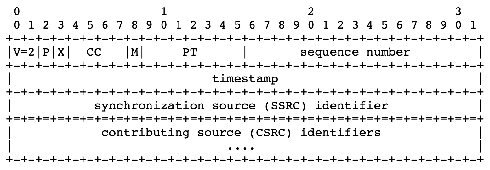
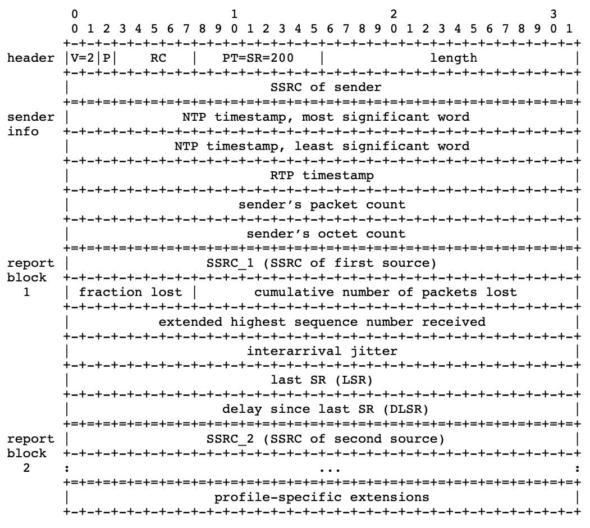
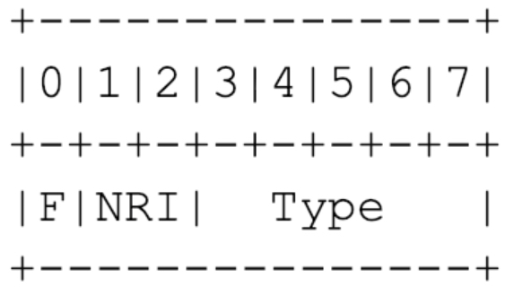
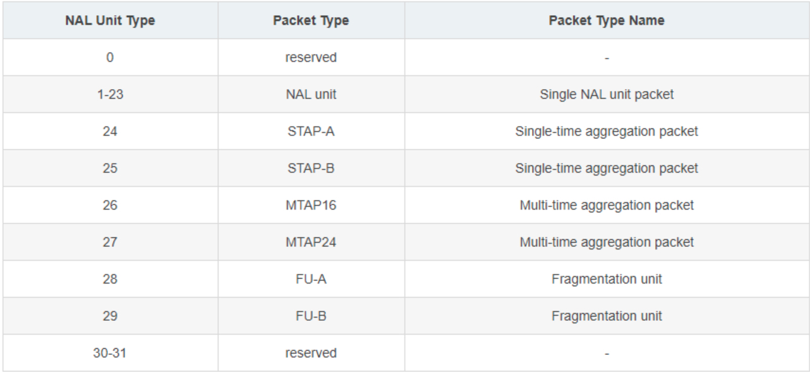
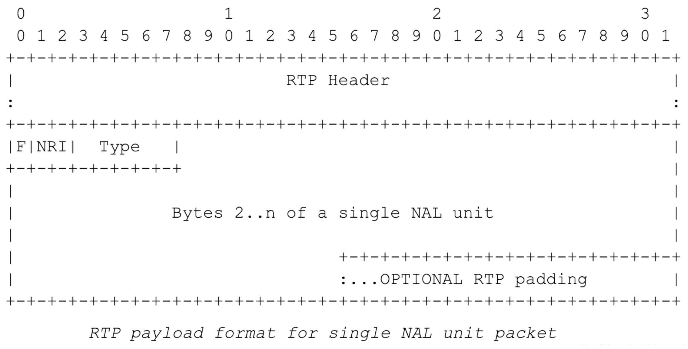
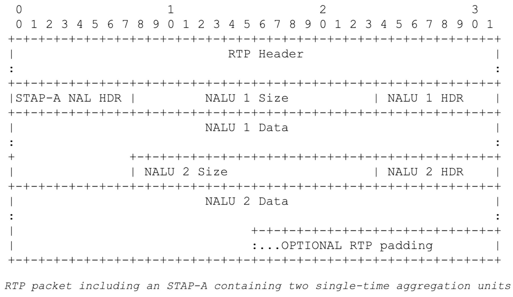
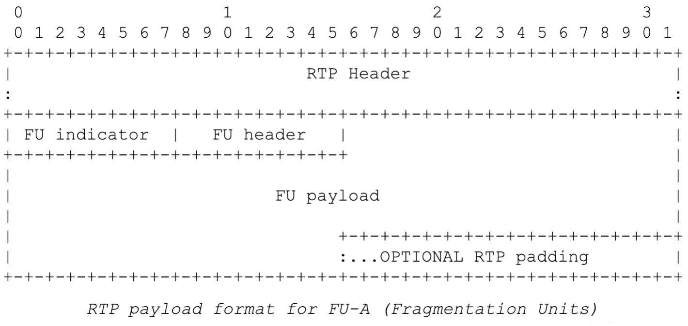
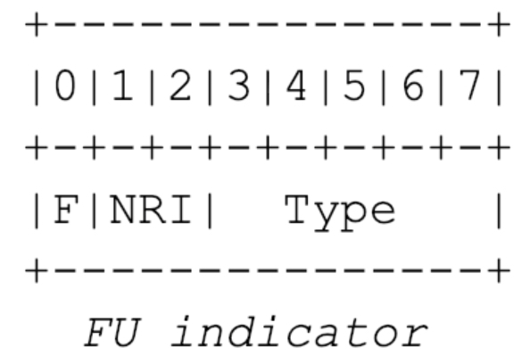
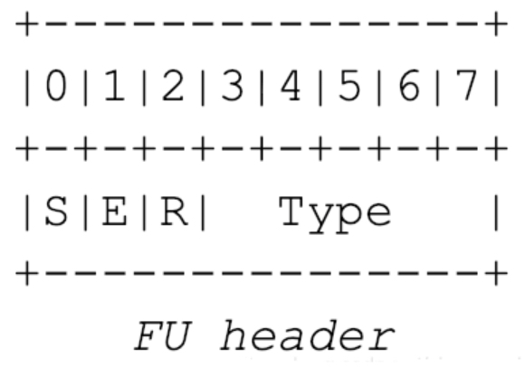

# RTP Survey

## 1. 概述

RTP，即 real-time transport protocol（实时传输协议），为实时传输交互的音频和视频提供了端到端传输服务。RTP 不提供任何机制以保证数据的实时性和 QoS (quality-of-service)，而是依赖底层的服务来提供这些功能，RTP 既不保证传输的可靠性也不保证无序传输，同时也不假定底层网络是可信任的和有序的。接收端可以利用 RTP 中的序列号排序收到的报文。

RTCP，即real-time transport control protocol（实时传输控制协议），负责管理传输质量在当前应用进程之间交换控制信息。在RTP会话期间，各参与者周期性地传送RTCP包，包中含有已发送的数据包的数量、丢失的数据包的数量等统计资料。因此，服务器可以利用这些信息动态地改变传输速率，甚至改变有效载荷类型。RTP和RTCP配合使用，能以有效的反馈和最小的开销使传输效率最佳化，故特别适合传送网上的实时数据。


## 2. 应用场景

1. 简单的多播音频会议
   
    一个小组要通过网络开一个音频会议，他们用了 IP 多播服务。基于某种分配机制，小组得到了一个多播组地址和一对端口，其中一个端口是用来传输音频数据的，另一个是用来传输 RTCP 报文的。这个组播地址和端口发给了所有与会者。如果想要引入一些安全策略，可以对数据报文和控制报文加密，然后把加密时用到的密钥分发给与会者。
    
2. 音频和视频会议
   
    如果这个会议既要传输音频又要传输视频的话，它们会以独立的 RTP Session 传输。也就是说，负责音频传输的部分和负责视频传输的部分会通过不同的组播地址（和端口对）分别传输各自的 RTP 报文和 RTCP 报文。在 RTP 协议这一层，音频和视频 Session 并没有被组合到一起。
    
3. 混合器和翻译器（Mixers & Translators）

  当参会者的带宽条件不同时，可能需要使用mixer将多个流耦合到一个单一的流中，再将这个流用低带宽消耗的编码方案进行压缩，发送给接收者。

  此外，有些与会者可能处于应用级防火墙的后面，无法仅通过 IP 组播访问。这种情况下需要另一类 RTP 级别的中继（Translator）。我们需要两个 Translator，安装在防火墙的两面，外面的 Translator 将收到的所有组播报文，通过一个安全连接传输给防火墙里面的 Translator。然后，防火墙里的 Translator 再将这些报文分发给内网的与会者。

4. 层编码

    发送者将媒体数据拆分出面向不同带宽与会者的媒体流（500K，2M，5M），它们分别对应了不同的组播地址，数据的接收者根据自己的带宽情况，选择加入适合的组播。


## 3. 基本概念

**RTP payload**：RTP 包中传输的数据，比如音频采样数据或者压缩过的视频数据。

**RTP packet**：由定长 RTP 头部，数据来源者的列表，RTP payload 组成的数据包。一些下层协议可能会自己定义 RTP 的封装格式。一般来说，一个下层协议包只包含一个 RTP 包，但是也有可能多个 RTP 包被合并到一起。

**RTCP packet**：RTP 控制报文，由定长的 RTC 头部开始，之后会跟着一些结构化的元素，它们在 RTCP 发挥不同功能时，会有不同的结构。通常多个 RTCP 包会被合在一起，通过一个下层协议包一起发送。

**Port**：传输层协议中用来区分某一主机下不同应用的抽象。RTP 协议依赖更底层网络提供端口机制，继而提供多播的 RTP 和 RTCP 报文。

**Transport address**：网络地址和端口的组合，用来定位传输层的节点。

**RTC media type**：一个 RTP Session 中所用到的所有 payload 类型的合集。

**Multimedia Session**：视频会议组中同时工作的一组 RTP Session。例如，视频会议中的 Audio Session 和 Video Session。

**RTP Session**：一组参与者利用 RTP 来通讯的组合。一个参与者可以同时加入到多个 RTP Session 中。在 Multimedia Session 中，除非特意将多媒体编码进同一数据流，否则，每个数据流会通过不同的 RTP Session 传输。与会者通过 Transport address 来区分不同的 RTP Session。同一 RTP Session 的不同与会者会共享同一个 Transport address，也可能每个与会者都有自己的 Transport address。在单播的情况时，一个与会者可能用同一对端口（RTP&RTCP）来接收所有其他与会者的数据，也可能对不同的与会者采用不同的端口对（RTP&RTCP）。

**Synchronization source (SSRC)**：RTP 报文流的一个 Source，由 RTP 头中定义的 32-bit 的 SSRC identifier 来标识，这样做是为了不依赖网络地址。同一个 SSRC 中发送的所有包都具有同一时序和序列号间隔，因此接收者可以通过 SSRC 将收到的数据包分组并排序。一个信号源（麦克风，摄像头，Mixer）的报文流会有由一个 SSRC 的发送器发送。一个 SSRC 可能会随着时间的变化，改变其数据格式，例如音频编码。SSRC 的身份识别码都是随机生成的，但是必须保证整个 RTP Session 中该身份识别码不会重复，这些工作是通过 RTCP 来完成的。如果一个与会者在一个 RTP Session 中发送不同的媒体数据流，那么每个流的 SSRC 必须不同。

**Contributing source (CSRC)**：RTP Mixer 所混合的所有数据对应的 SSRC 的列表。Mixer 会将一个 SSRC 列表写入 RTP 头中，该列表包含了这个混合报文中包含的所有来源 SSRC。

**End system**：一个生成 RTP payload 和消费收到的 RTP payload 的应用。一个 End system 可以扮演一个或者多个 SSRC 角色，但是通常是一个。

**Mixer**：一个中介系统，它接收一个或多个 Source 的数据，随后它可能会改变这些数据的格式，并将它们合并为一个新的 RTP packet。因为，多个输入源的时序通常来说都不一致，所以 Mixer 通常会同步不同源的时间，并生成一个自己的时序来处理合并数据流。所有从 Mixer 输出的数据包都会标记上该 Mixer 的 SSRC。

**Translator**：一个中介系统，它会转发 RTP packet 但是不改变其原本的 SSRC。

**Monitor**：一个在 RTP Session 中接收 RTCP 报文的应用，它会总结数据被接收的报告，并为当前分发系统评估 QOS，诊断错误，长期统计。Monitor 可以集成进会议应用中，也可以是独立的第三方应用，只接收 RTCP 报文，但是什么都不发送。

**Wallclock time（绝对日期和时间）**是用网络时间协议（NTP）的时间格式来表示，即从 1900 年一月一日 0 点到现在的秒数。NTP 的时间戳使用了 64-bit 的无符号固定小数点的形式表示，其中头 32-bit 用来表示整数部分，后 32-bit 用来表示小数部分。RTP 的时间格式采用了 NTP 的简化版，他只用了 NTP 的 64-bit 数据的中间 32-bit，即前 16-bit 表示整数，后 16-bit 表示小数。

**NTP 时间戳**到 2036 年就会循环回 0，但是因为 RTP 只会使用不同 NTP 时间的差值，所以这不会有什么影响。只要一对时间戳都在同一个循环周期里，直接用模块化的架构相减或者比较就可以，NTP 的循环问题就不重要了。


## 4. RTP包格式

RTP 头的格式如下：



前 96-bit 的数据是每个 RTP 包都有的部分，CSRC 部分只有 Mixer 发送的报文才会有。这些字段的意义如下：

+ Version（V）：2 bits，RTP 版本号，现在用的是 2。（第一个 RTP 草案用的 1）

+ Padding（P）：1 bit，如果设置了该字段，报文的末尾会包含一个或多个填充字节，这些填充字节不是 payload 的内容。填充字节的第一字节包括了后面填充字节的长度，该长度字段包含自己，主要是为了一些对齐处理。Padding 可能会被一些加密算法使用，因为有些加密算法需要定长的数据块。Padding 也可能被一些更下层的协议使用，用来一次发送多个 RTP 包。
+ Extension（X）：1 bit，如果设置了该字段，那么包头数据后跟着一个拓展数据。
+ CSRC count（CC）：4 bits，CSRC 列表的长度。
+ Marker（M）：1 bit，Marker 会在预设中进行定义（预设和 RTP 的关系可以参考 rfc3551），在报文流中用它来划分每一帧的边界。视频帧比较大，需要通过多个NALU来传输，当看到M位为1时就认为是这个I帧的结束，由于音频帧比较小，一个RTP包就是一个音频帧，所以该位直接置1。
+ Payload type（PT）: 7bits，该字段定义 RTP payload 的格式和他在预设中的意义。上层应用可能会定义一个（静态的类型码 <->payload 格式）映射关系。也可以用 RTP 协议外的方式来动态地定义 payload 类型。在一个 RTP Session 中 payload 类型可能会改变，但是不应该用 payload 类型来区分不同的媒体流，正如之前所说，不同的媒体流应该通过不同 Session 分别传输。在流媒体中PT大部分是用来区分音频流和视频流的，这样便于客户端进行解析。
+ Sequence number：16 bits，每发送一个 RTP 包该序列号 + 1，达到最大值后从0开始。RTP 包的接收者可以通过它来确定丢包情况并且利用它来重排包的顺序。这个字段的初始值应该是随机的。一般RTP协议是承载协议是UDP，UDP是不可靠传输协议。那我们如何保证接收端收的数据是正确的呢，就是通过这个字段进行重新排序，所以接收端一般收到RTP数据第一件事就是排序。另外，发送端的音频和视频都是通过RTP传输的，但是他们是分别计数的，所用的序列号是不同的。
+ Timestamp：32 bits，时间戳反映了 RTP 数据包生成第一块数据时的时刻。这个时间戳必须恒定地线性增长，因为它会被用来同步数据包和计算网络抖动，此外这个时钟解决方案必须有足够的精度，像是一个视频帧只有一个时钟嘀嗒这样是肯定不够的。如果 RTP 包是周期性的生成的话，通常会使用采样时钟而不是系统时钟，例如音频传输中每个 RTP 报文包含 20ms 的音频数据，那么相邻的下一个 RTP 报文的时间戳就是增加 20ms 而不是获取系统时间。和序列号一样时间戳的初始值也应该是随机的，而且如果多个 RTP 包是一次性生成的，那它们就会有相同的时间戳。不同媒体流的时间戳可能以不同的步幅增长，它们通常都是独立的，具有随机的偏移。这些时间戳虽然足以重建单一媒体流的时序，但是直接比较多个媒体流的时间戳是没办法进行同步的。每一时间戳都会和参考时钟（wallclock）组成时间对，而且需要同步的不同流会共用同一个参考时钟，通过对比不同流的时间对，就能计算出不同流的时间戳偏移量。这个时间对并不是和每个 RTP 包一同发送，而是通过 RTCP 协议，以一个相对较低的频率进行共享。
+ SSRC：32 bits，该字段用来确定数据的发送源。这个身份标识应该随机生成，并且要保证同一个 RTP Session 中没有重复的 SSRC。虽然 SSRC 冲突的概率很小，但是每个 RTP 客户端都应该时刻警惕，如果发现冲突就要去解决。同步信源是指产生媒体流的信源，例如麦克风、摄像机、RTP混合器等；它通过RTP报头中的一个32位数字SSRC标识符来标识，而不依赖于网络地址，接收者将根据SSRC标识符来区分不同的信源，进行RTP报文的分组。
+ CSRC list：0 ~ 15 items， 32 bits each，CSRC list 表示对该 payload 数据做出贡献的所有 SSRC。这个字段包含的 SSRC 数量由 CC 字段定义。如果有超过 15 个 SSRC，只有 15 个可以被记录。CSRC是指当混合器接收到一个或多个同步信源的RTP报文后，经过混合处理产生一个新的组合RTP报文，并把混合器作为组合RTP报文的 SSRC，而将原来所有的SSRC都作为CSRC传送给接收者，使接收者知道组成组合报文的各个SSRC。


### 4.1 RTP协议原理

#### 4.1.1 发送地址的确定

RTP协议是发送端传输流媒体数据的，但是往哪个IP和端口传输，如何将自己传输的音视频属性告诉给接收端就需要一种机制来实现，常见的做法就是用SDP进行描述，然后通过RTSP、SIP或者HTTP等协议和接收端协商。一般在协商过程中，会确定发送端RTP和RTCP的目的地址，目的地址由一个IP地址和端口对组成，偶数端口就是RTP媒体流的目的端口，偶数端口+1就是RTCP协议的目的端口。

#### 4.1.2 RTP数据包的生成

通过RTSP等协议的SDP信息协商好了RTP数据包的发送目的和传输方式，我们就需要把音视频数据打包成RTP包，用UDP发送给接收端了。RTP不仅可以用来传视频，也可以传音频，甚至可以传输图像和非音视频数据。传输视频不仅可以传输H264编码的数据，也可以传输H265,同样可以传输谷歌的VP8 VP9系列编码的视频裸数据。音频可以传输G7xx系列、AAC系列。那封装好的数据可以传输吗，也是可以的。其中安防中常说的国标流就是RTP+PS形式，也可以传输RTP+TS数据；

>TS流与PS流的区别在于TS流的包结构是固定长度的,而PS流的包结构是可变长度的。PS包由于长度是变化的,一旦丢失某一PS包的同步信息,接收机就会进入失步状态,从而导致严重的信息丢失事件。而TS码流由于采用了固定长度的包结构,当传输误码破坏了某一TS包的同步信息时,接收机可在固定的位置检测它后面包中的同步信息,从而恢复同步,避免了信息丢失。因此在信道环境较为恶劣、传输误码较高时一般采用TS码流,而在信环境较好、传输误码较低时一般采用PS码流。
>
>关于几种格式码流：ES/PES/PTS/DTS/PS/TS：https://zhuanlan.zhihu.com/p/529641002?utm_id=0


## 5. RTCP包格式

当应用程序开始一个rtp会话时将使用两个端口：一个给rtp，一个给rtcp。rtp本身并不能为按顺序传送数据包提供可靠的传送机制，也不提供流量控制或拥塞控制，它依靠rtcp提供这些服务。

RTCP协议的功能是通过不同的RTCP数据报来实现的，包括以下几种类型：

1. SR（Sender Report）：发送端报告。
2. RR（Receiver Report）：接收端报告。
3. SDES（Source Description Items）：源点描述。
4. BYE：结束传输。
5. APP：特定应用。

这5种数据包的格式大同小异，以SR为例介绍。

RTCP 的SR包格式如下：



SR由3或4部分组成，profile-specific extenions可选。第1部分是8字节的包头，各字段如下：

+ Version（V）：同RTP包头域。
+ Padding（P）：同RTP包头域。
+ Reception Report Count（RC）：5比特，该SR包中包含的接收报告块的数目，可以为零。
+ Packet Type（PT）：8比特，SR包是200。
+ Length：16比特，其中存放的是该SR包以32比特为单位的总长度减一。
+ Synchronization Source（SSRC）：SR包发送者的同步源标识符。与对应RTP包中的SSRC一样。
+ NTP Timestamp（Network time protocol）SR包发送时的绝对时间值。NTP的作用是同步不同的RTP媒体流。

第2部分是发送者信息（Sender Info），20字节长，只在SR中出现（RR不含该内容），包含发送者的信息。字段如下：

+ RTP Timestamp：与NTP时间戳对应，与RTP数据包中的RTP时间戳具有相同的单位和随机初始值。
+ Sender's packet count：从开始发送包到产生这个SR包这段时间里，发送者发送的RTP数据包的总数. SSRC改变时，这个域清零。
+ Sender's octet count：从开始发送包到产生这个SR包这段时间里，发送者发送的净荷数据的总字节数（不包括头部和填充）。发送者改变其SSRC时，这个域要清零。

第3部分包含0或多个接收报告块，具体数目由header中的RC字段确定。每一个块表示该发送者从一个其他源收到数据包。字段如下：

+ Source Identifier（SSRC_n）：该报告块中包含的是从哪个源接收到的包的统计信息。
+ Fraction Lost：表明从上一个SR或RR包发出以来从同步源n（SSRC_n）收到的RTP数据包的丢失率。
+ Cumulative Number of Packets Lost：从开始接收到SSRC_n的包到发送SR，从SSRC_n传过来的RTP数据包的丢失总数。
+ Extended Highest Sequence Number Received：从SSRC_n收到的RTP数据包中最大的序列号。
+ Interarrival Jitter：RTP数据包接受时间的统计方差估计。
+ Last SR（LSR）：取最近从SSRC_n收到的SR包中的NTP时间戳的中间32比特。如果目前还没收到SR包，则该域清零。
+ Delay Since Last SR（DLSR）：上次从SSRC_n收到SR包到发送本报告的延时。


## 6. RTP会话过程

当应用程序建立一个RTP会话时，应用程序将确定一对目的传输地址。目的传输地址由一个网络地址和一对端口组成，有两个端口：一个给RTP包，一个给RTCP包，使得RTP/RTCP数据能够正确发送。RTP数据发向偶数的UDP端口，而对应的控制信号RTCP数据发向相邻的奇数UDP端口（偶数的UDP端口＋1），这样就构成一个UDP端口对。 RTP的发送过程如下，接收过程则相反。

1. RTP协议从上层接收流媒体信息码流（如H.263），封装成RTP数据包；RTCP从上层接收控制信息，封装成RTCP控制包。
2. RTP将RTP 数据包发往UDP端口对中偶数端口；RTCP将RTCP控制包发往UDP端口对中的接收端口。


## 7. RTP Payload

RTP Payload一般分为3种：

1. Single NAL Unit Packet：一个packet只包含一个NALU。
2. Aggregation Packet：一个packet包含多个NALU。
3. Fragmentation Unit：一个较长的NALU分布在多个RTP包中。

RTP Payload以NALU header开头。NALU header的结构为：



+ F（forbidden_zero_bit）：错误位或语法冲突标识位，一般为0。

+ NRI（nal_ref_idc）：用于表示当前NALU的重要性，值越大，越重要。该值与H264编码规范相同，此处可以直接使用原始码流的NRI。nal_ref_idc不等于0时, NAL unit的内容可能是SPS/PPS/参考图像的片等。nal_ref_idc等于0时，NAL unit的内容可能是非参考图像的片等。

+ Type：RTP载荷类型。其中，1-23为H264编码规定的数据类型，单NALU类型的RTP包使用此范围内的值。24-27为聚合分组类型，28-29为分片分组类型。30，31，0保留。

    


### 7.1 Single NAL Unit Packet

此结构的NALU Header结构可以直接使用原始码流NALU Header，所以单NALU分组Type = 1~23。封装RTP包的时候可以直接把查询到的NALU去掉起始码（Start_Code_Prefix）后的部分 当作单NALU分组的RTP包Payload部分。

>H264比特流 = Start_Code_Prefix + NALU + Start_Code_Prefix + NALU + …



### 7.2 Aggregation Packet

通常采用STAP-A (Type=24)结构封装RTP聚合分组，下图为包含2个NALU的采用STAP-A结构的聚合分组。



- STAP-A NAL HDR: 也是一个NALU Header （F|NRI|Type）结构，1字节。比如可能值为0x18=00011000b，Type=11000b=24，即为STAP-A。所有聚合NALU的F只要有一个为1则设为1，NRI取所有NALU的NRI最大值。
- NALU Size: 表示此原始码流NALU长度，2字节。
- NALU HDR + NALU Data: 即为原始码流一个完整NALU。

### 7.3 Fragmentation Unit

通常采用无DON字段的FU-A结构封装RTP分片分组。






采用FU-A分组类型的话FU indicator中的Type = 28，NRI与此NALU中NRI字段相同。

FU header中Type采用原始码流NALU中的Type字段，S=1表示这个RTP包为分片分组第一个分片，E=1表示为分片分组最后一个分片。除了首尾分片，中间的分片S&E都设为0。R为保留位，设为0。


## 8. 几种RTP的开源实现

### 8.1 oRTP

oRTP 是一款开源软件，实现了 RTP 与 RTCP 协议。目前使用 oRTP 库的软件主要是 linphone（一款基于 IP 进行视频和语音通话的软件）。

1. ORTP使用C语言编写，可以工作于windows, Linux, 以及 Unix平台。
2. 实现了RFC3550协议，提供简单易用的API。支持多种配置，RFC3551为默认的配置。
3. 支持单线程下的多个RTP会话，支持自适应抖动处理。
4. 基于GPL版权声明。


### 8.2 JRTPLIB

 JRtplib是一个用C++编写的面向对象的库，旨在帮助开发人员使用RFC3550中描述的实时传输协议（RTP），该库可以提供接口给开发者实现RTP发送和接收数据，而无需担心SSRC冲突、调度和传输RTCP数据等。用户只需要向库提供发送的有效负载数据即可。

主要程序流程：

+ 发送：
    1. 获得接收端的 IP 地址和端口号 
    2. 创建 RTP 会话
    3. 指定 RTP 数据接收端
    4. 设置 RTP 会话默认参数
    5. 发送流媒体数据
+ 接收：
    1. 获得用户指定的端口号
    2. 创建RTP会话
    3. 设置接收模式
    4. 接受RTP数据
    5. 检索RTP数据源
    6. 获取RTP数据报
    7. 删除RTP数据报

#### 8.2.1 初始化

在使用 JRTPLIB 进行实时流媒体数据传输之前，首先应该生成 RTPSession 类的一个实例来表示此次 RTP会话，然后调用 Create() 方法来对其进行初始化操作。RTPSession 类的 Create() 方法只有一个参数，用来指明此次 RTP 会话所采用的端口号。JRTPLIB-3.11中已经修改了Create（prot）方法。新的Create方法被修改为Create(sessparams,&transparams)。其中的两个参数需要如下先定义：

```c++
RTPUDPv4TransmissionParams transparams;
RTPSessionParams sessparams;
sessparams.SetOwnTimestampUnit(1.0/8000.0);/*设置时间戳，1/8000表示1秒钟采样8000次，即录音时的8KHz*/
sessparams.SetAcceptOwnPackets(true);
transparams.SetPortbase(portbase);/*本地通讯端口*/
```


#### 8.2.2 数据发送

当 RTP 会话成功建立起来之后，接下去就可以开始进行流媒体数据的实时传输了。首先需要设置好数据发送的目标地址，RTP 协议允许同一会话存在多个目标地址，这可以通过调用 RTPSession 类的AddDestination()、DeleteDestination() 和 ClearDestinations() 方法来完成。例如，下面的语句表示的是让 RTP 会话将数据发送到本地主机的 6000 端口：

```c++
unsigned long addr = ntohl(inet_addr("127.0.0.1")); 
sess.AddDestination(addr, 6000);
```

目标地址全部指定之后，接着就可以调用 RTPSession 类的 SendPacket() 方法，向所有的目标地址发送流媒体数据。SendPacket() 是 RTPSession 类提供的一个重载函数对于同一个 RTP 会话来讲，负载类型、标识和时戳增量通常来讲都是相同的，JRTPLIB 允许将它们设置为会话的默认参数，这是通过调用 RTPSession 类的 SetDefaultPayloadType()、SetDefaultMark() 和SetDefaultTimeStampIncrement() 方法来完成的。为 RTP 会话设置这些默认参数的好处是可以简化数据的发送，例如，如果为 RTP 会话设置了默认参数：

```c++
sess.SetDefaultPayloadType(0);
sess.SetDefaultMark(false);  
sess.SetDefaultTimeStampIncrement(10);
```

之后在进行数据发送时只需指明要发送的数据及其长度就可以了：

```c++
sess.SendPacket(buffer, 5);
```


#### 8.2.3 数据接收

对于流媒体数据的接收端，首先需要调用 RTPSession 类的 PollData() 方法来接收发送过来的 RTP 或者RTCP 数据报。

JRTPLIB-3.11中修改PollData（）方法为Poll（），使用方法一样。

由于同一个 RTP 会话中允许有多个参与者（源），可以通过调用 RTPSession 类的GotoFirstSource() 和 GotoNextSource() 方法来遍历所有的源，也可以通过调用 RTPSession 类的GotoFirstSourceWithData() 和 GotoNextSourceWithData() 方法来遍历那些携带有数据的源。在从 RTP 会话中检测出有效的数据源之后，就可以调用 RTPSession 类的 GetNextPacket() 方法从中抽取 RTP 数据报，当接收到的 RTP 数据报处理完之后，要记得及时释放。

```c++
if (sess.GotoFirstSourceWithData()) {   
 do {   
          sess.AddToAcceptList(remoteIP, allports,portbase);
           sess.SetReceiveMode(RECEIVEMODE_ACCEPTSOME);
           RTPPacket *pack;         
          pack = sess.GetNextPacket();            // 处理接收到的数据    
           delete pack;   } 
 while (sess.GotoNextSourceWithData()); 
 }
```


### 8.3 Live555

live555 是一个 Live Networks公司开发基于 C++ 的流媒体项目，它主要由几个用于多媒体流的库组成，其官方网站地址为 http://www.live555.com/live555。它使用开放的标准协议 (RTP/RTCP，RTSP，SIP)，方便与其它标准的流媒体组件互操作。这些库可以为 Unix-like（包括 Linux 和 Mac OS X），Windows，和 QNX （及其它 POSIX 兼容系统）等系统进行编译，它们可以被用于构建流媒体应用。除了库之外，live555 还包含了两个流媒体应用程序 “LIVE555 Media Server“ 和 “LIVE555 Proxy Server“，它们都是 RTSP 服务器应用程序。


live555 源码主要由八个部分组成：UsageEnvironment，BasicUsageEnvironment，groupsock，liveMedia，mediaServer，proxyServer，testProgs，WindowsAudioInputDevice。


### 8.4 ccRTP

ccRTP 是一个基于 GNU Common C++的 C++ 库，它提供了一个高性能、灵活和可扩展的符合标准的 RTP 堆栈，并具有完整的 RTCP 支持。

在设计ccRTP时已经考虑到RTP已经被定义为一个应用层的协议框架，而不是一个典型的互联网传输协议，如TCP和UDP。因此，RTP 几乎从未作为与应用程序分离的层来实现。因此，RTP 应用程序通常必须定制适应性强的 RTP 数据包布局和处理规则、时序约束、会话成员规则以及其他 RTP 和 RTCP 机制。ccRTP 旨在为 RTP 框架提供一个框架，而不仅仅是一个 RTP 数据包操作库。

GNU ccRTP 使用模板来隔离线程和套接字相关的依赖关系，因此它可以用于实现具有不同线程模型和底层传输协议的实时流，而不仅仅是 IPV4 UDP 套接字。有关 ccRTP 功能的更详细列表，您可以查看程序员手册。


## 9. FAQ

1. RTP协议包头中没有负载长度字段，那么应用层如何知道该RTP包的长度呢？

    这其实取决于使用RTP协议的应用。RTP协议默认一个PDU（Protocol Data Unit，也就是每层的数据单位）中只包含一个RTP包。也就是说，应用每次只发出一个RTP包，这个RTP包虽然可能会被底层协议分段，但接收端的传输层在交付前会把分段拼接回完整的数据，所以接收端收到一段数据，减去包头的长度，剩下的全部内容就是该RTP包的Payload。
