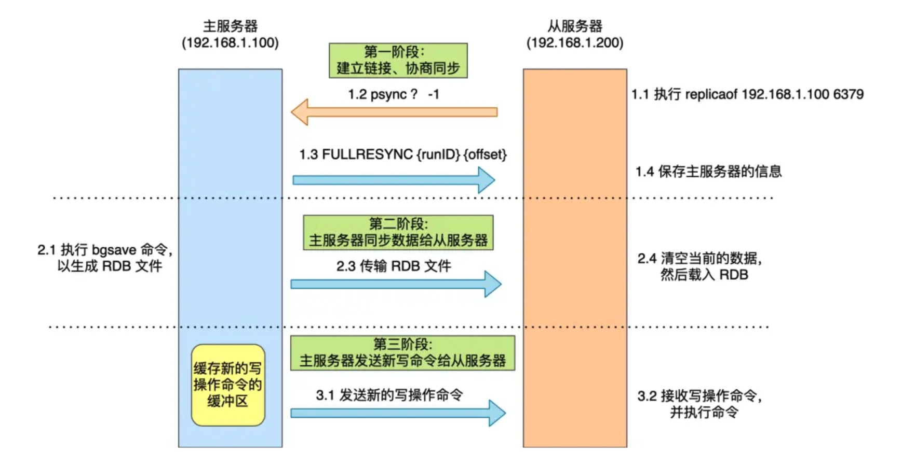
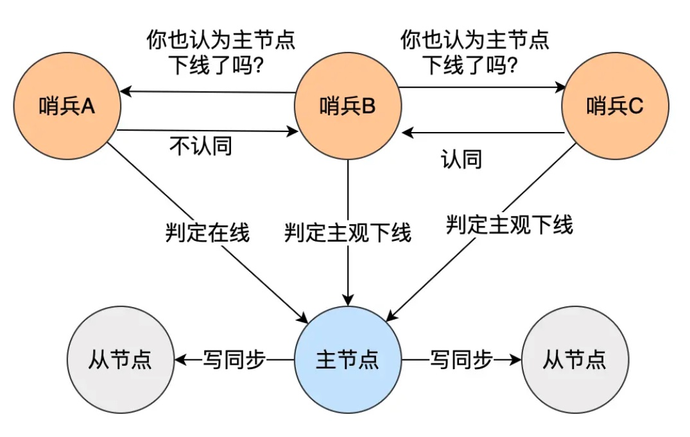

# Redis


## Redis数据结构

Redis 提供了丰富的数据类型，常见的有五种数据类型：**String（字符串），Hash（哈希），List（列表），Set（集合）、Zset（有序集合）**。

随着 Redis 版本的更新，后面又支持了四种数据类型： **BitMap（2.2 版新增）、HyperLogLog（2.8 版新增）、GEO（3.2 版新增）、Stream（5.0 版新增）**。 Redis 五种数据类型的应用场景：

- String 类型的应用场景：缓存对象、常规计数、分布式锁、共享 session 信息等。
- List 类型的应用场景：消息队列（但是有两个问题：1. 生产者需要自行实现全局唯一 ID；2. 不能以消费组形式消费数据）等。
- Hash 类型：缓存对象、购物车等。
- Set 类型：聚合计算（并集、交集、差集）场景，比如点赞、共同关注、抽奖活动等。
- Zset 类型：排序场景，比如排行榜、电话和姓名排序等。

Redis 后续版本又支持四种数据类型，它们的应用场景如下：

- BitMap（2.2 版新增）：二值状态统计的场景，比如签到、判断用户登陆状态、连续签到用户总数等；
- HyperLogLog（2.8 版新增）：海量数据基数统计的场景，比如百万级网页 UV 计数等；
- GEO（3.2 版新增）：存储地理位置信息的场景，比如滴滴叫车；
- Stream（5.0 版新增）：消息队列，相比于基于 List 类型实现的消息队列，有这两个特有的特性：自动生成全局唯一消息ID，支持以消费组形式消费数据。


### String

String 类型的底层的数据结构实现主要是 SDS（简单动态字符串）。 SDS 和我们认识的 C 字符串不太一样，之所以没有使用 C 语言的字符串表示，因为 SDS 相比于 C 的原生字符串：

- **SDS 不仅可以保存文本数据，还可以保存二进制数据**。因为 SDS 使用 len 属性的值而不是空字符来判断字符串是否结束，并且 SDS 的所有 API 都会以处理二进制的方式来处理 SDS 存放在 buf[] 数组里的数据。所以 SDS 不光能存放文本数据，而且能保存图片、音频、视频、压缩文件这样的二进制数据。
- **SDS 获取字符串长度的时间复杂度是 O(1)**。因为 C 语言的字符串并不记录自身长度，所以获取长度的复杂度为 O(n)；而 SDS 结构里用 len 属性记录了字符串长度，所以复杂度为 O(1)。
- **Redis 的 SDS API 是安全的，拼接字符串不会造成缓冲区溢出**。因为 SDS 在拼接字符串之前会检查 SDS 空间是否满足要求，如果空间不够会自动扩容，所以不会导致缓冲区溢出的问题。

应用场景：

1. 缓存对象：可以直接缓存整个对象的JSON，也可以分字段缓存
2. 常规计数：因为 Redis 处理命令是单线程，所以执行命令的过程是原子的。因此 String 数据类型适合计数场景，比如计算访问次数、点赞、转发、库存数量等等
3. 分布式锁：SET 命令有个 NX 参数可以实现「key不存在才插入」，可以用它来实现分布式锁，EX/PX加过期时间兜底。value要有客户端的唯一标识。解锁时要判断是自己加的锁才能释放，通过lua脚本实现原子性。
4. 共享Session信息。分布式系统下借助Redis统一存储Session信息。


### List

List 类型的底层数据结构是由**双向链表或压缩列表**实现的：

- 如果列表的元素个数小于 512 个（默认值，可由 list-max-ziplist-entries 配置），列表每个元素的值都小于 64 字节（默认值，可由 list-max-ziplist-value 配置），Redis 会使用**压缩列表**作为 List 类型的底层数据结构；
- 如果列表的元素不满足上面的条件，Redis 会使用**双向链表**作为 List 类型的底层数据结构；

但是**在 Redis 3.2 版本之后，List 数据类型底层数据结构就只由 quicklist 实现了，替代了双向链表和压缩列表**。

应用场景：

1. 消息队列。消息队列在存取消息时，必须要满足三个需求，分别是**消息保序、处理重复的消息和保证消息可靠性**。

Redis 的 List 和 Stream 两种数据类型，就可以满足消息队列的这三个需求。我们先来了解下基于 List 的消息队列实现方法，后面在介绍 Stream 数据类型时候，在详细说说 Stream。

*1、如何满足消息保序需求？*

List 可以使用 LPUSH + RPOP （或者反过来，RPUSH+LPOP）命令实现消息队列。

在生产者往 List 中写入数据时，List 并不会主动地通知消费者有新消息写入，如果消费者想要及时处理消息，就需要在程序中不停地调用 `RPOP` 命令（比如使用一个while(1)循环）。如果有新消息写入，RPOP命令就会返回结果，否则，RPOP命令返回空值，再继续循环。所以，即使没有新消息写入List，消费者也要不停地调用 RPOP 命令，这就会导致消费者程序的 CPU 一直消耗在执行 RPOP 命令上，带来不必要的性能损失。为了解决这个问题，Redis提供了 BRPOP 命令。**BRPOP命令也称为阻塞式读取，客户端在没有读到队列数据时，自动阻塞，直到有新的数据写入队列，再开始读取新数据**。和消费者程序自己不停地调用RPOP命令相比，这种方式能节省CPU开销。

*2、如何处理重复的消息？*

消费者要实现重复消息的判断，需要 2 个方面的要求：

- 每个消息都有一个全局的 ID。
- 消费者要记录已经处理过的消息的 ID。当收到一条消息后，消费者程序就可以对比收到的消息 ID 和记录的已处理过的消息 ID，来判断当前收到的消息有没有经过处理。如果已经处理过，那么，消费者程序就不再进行处理了。

**List 并不会为每个消息生成 ID 号，所以我们需要自行为每个消息生成一个全局唯一ID。**

*3、如何保证消息可靠性？*

当消费者程序从 List 中读取一条消息后，List 就不会再留存这条消息了。所以，如果消费者程序在处理消息的过程出现了故障或宕机，就会导致消息没有处理完成，那么，消费者程序再次启动后，就没法再次从 List 中读取消息了。

为了留存消息，List 类型提供了 `BRPOPLPUSH` 命令，这个命令的**作用是让消费者程序从一个 List 中读取消息，同时，Redis 会把这个消息再插入到另一个 List（可以叫作备份 List）留存**。

List实现消息队列的缺点：不支持多个消费者消费同一条消息，也不支持消息组。Redis5.0提供的Stream数据类型可以支持。


### Hash

Hash 类型的底层数据结构是由**压缩列表或哈希表**实现的：

- 如果哈希类型元素个数小于 512 个（默认值，可由 hash-max-ziplist-entries 配置），所有值小于 64 字节（默认值，可由 hash-max-ziplist-value 配置）的话，Redis 会使用**压缩列表**作为 Hash 类型的底层数据结构；
- 如果哈希类型元素不满足上面条件，Redis 会使用**哈希表**作为 Hash 类型的底层数据结构。

**在 Redis 7.0 中，压缩列表数据结构已经废弃了，交由 listpack 数据结构来实现了**。

应用场景：

1. 存储对象：Hash 类型的 （key，field， value） 的结构与对象的（对象id， 属性， 值）的结构相似，也可以用来存储对象。

在介绍 String 类型的应用场景时有所介绍，String + Json也是存储对象的一种方式，那么存储对象时，到底用 String + json 还是用 Hash 呢？

一般对象用 String + Json 存储，对象中某些频繁变化的属性可以考虑抽出来用 Hash 类型存储。

以购物车为例，这是一个需要频繁变化的对象，可以使用Hash来缓存。

以用户 id 为 key，商品 id 为 field，商品数量为 value。当前仅仅是将商品ID存储到了Redis 中，在回显商品具体信息的时候，还需要拿着商品 id 查询一次数据库，获取完整的商品的信息。


### Set

Set 类型的底层数据结构是由**哈希表或整数集合**实现的：

- 如果集合中的元素都是整数且元素个数小于 512 （默认值，set-maxintset-entries配置）个，Redis 会使用**整数集合**作为 Set 类型的底层数据结构；整数集合是Redis自己设计的一种存储结构,集合键的底层实现之一。整数集合的底层实现为数组,这个数组以有序、无重复的方式保存集合元素,在有需要时,程序会根据新添加元素的类型,改变这个数组的类型。
- 如果集合中的元素不满足上面条件，则 Redis 使用**哈希表**作为 Set 类型的底层数据结构。

集合的主要几个特性，无序、不可重复、支持并交差等操作。这里有一个潜在的风险。**Set 的差集、并集和交集的计算复杂度较高，在数据量较大的情况下，如果直接执行这些计算，会导致 Redis 实例阻塞**。在主从集群中，为了避免主库因为 Set 做聚合计算（交集、差集、并集）时导致主库被阻塞，我们可以选择一个从库完成聚合统计，或者把数据返回给客户端，由客户端来完成聚合统计。

应用场景：

1. 点赞。Set 类型可以保证一个用户只能点一个赞，这里举例子一个场景，key 是文章id，value 是用户id。
2. 共同关注。Set 类型支持交集运算，所以可以用来计算共同关注的好友、公众号等。key 可以是用户id，value 则是已关注的公众号的id。则可以通过交集运算获得共同关注。
3. 抽奖活动。存储某活动中中奖的用户名 ，Set 类型因为有去重功能，可以保证同一个用户不会中奖两次。


### Zset

Zset 类型的底层数据结构是由**压缩列表或跳表**实现的：

- 如果有序集合的元素个数小于 128 个，并且每个元素的值小于 64 字节时，Redis 会使用**压缩列表**作为 Zset 类型的底层数据结构；
- 如果有序集合的元素不满足上面的条件，Redis 会使用**跳表**作为 Zset 类型的底层数据结构；

**在 Redis 7.0 中，压缩列表数据结构已经废弃了，交由 listpack 数据结构来实现了。**

应用场景：

1. 排行榜。有序集合比较典型的使用场景就是排行榜。例如学生成绩的排名榜、游戏积分排行榜、视频播放排名、电商系统中商品的销量排名等。
2. 姓名、电话字典序排序。使用有序集合的 `ZRANGEBYLEX` 或 `ZREVRANGEBYLEX` 可以帮助我们实现电话号码或姓名的排序，我们以 `ZRANGEBYLEX` （返回指定成员区间内的成员，按 key 正序排列，分数必须相同）为例。注意，使用字典序排序的有序集合各个元素的score需要相同。


### BitMap

Bitmap，即位图，是一串连续的二进制数组（0和1），可以通过偏移量（offset）定位元素。BitMap通过最小的单位bit来进行`0|1`的设置，表示某个元素的值或者状态，时间复杂度为O(1)。

Bitmap 本身是用 String 类型作为底层数据结构实现的一种统计二值状态的数据类型。

应用场景：

1. 签到统计。
2. 判断用户登录状态。


### HyperLogLog

HyperLogLog 是一种用于「统计基数」的数据集合类型，基数统计就是指统计一个集合中不重复的元素个数。但要注意，HyperLogLog 是统计规则是基于概率完成的，不是非常准确，标准误算率是 0.81%。

所以，简单来说 HyperLogLog **提供不精确的去重计数**。

应用场景：

百万级网页UV计数。

在统计 UV 时，你可以用 PFADD 命令（用于向 HyperLogLog 中添加新元素）把访问页面的每个用户都添加到 HyperLogLog 中。

```shell
PFADD page1:uv user1 user2 user3 user4 user5
```

接下来，就可以用 PFCOUNT 命令直接获得 page1 的 UV 值了，这个命令的作用就是返回 HyperLogLog 的统计结果。

```shell
PFCOUNT page1:uv
```


### GEO

主要用于存储地理位置信息，并对存储的信息进行操作。

GEO 本身并没有设计新的底层数据结构，而是直接使用了 Sorted Set 集合类型。GEO 类型使用 GeoHash 编码方法实现了经纬度到 Sorted Set 中元素权重分数的转换，这其中的两个关键机制就是「对二维地图做区间划分」和「对区间进行编码」。一组经纬度落在某个区间后，就用区间的编码值来表示，并把编码值作为 Sorted Set 元素的权重分数。

应用场景：

1. 滴滴叫车。


### Stream

Redis 专门为消息队列设计的数据类型。

用于完美地实现消息队列，它支持消息的持久化、支持自动生成全局唯一 ID、支持 ack 确认消息的模式、支持消费组模式等，让消息队列更加的稳定和可靠。

Stream 消息队列操作命令：

- XADD：插入消息，保证有序，可以自动生成全局唯一 ID；
- XLEN ：查询消息长度；
- XREAD：用于读取消息，可以按 ID 读取数据；
- XDEL ： 根据消息 ID 删除消息；
- DEL ：删除整个 Stream；
- XRANGE ：读取区间消息
- XREADGROUP：按消费组形式读取消息；
- XPENDING 和 XACK：
    - XPENDING 命令可以用来查询每个消费组内所有消费者「已读取、但尚未确认」的消息；
    - XACK 命令用于向消息队列确认消息处理已完成；

Stream 可以以使用 **XGROUP 创建消费组**，创建消费组之后，Stream 可以使用 XREADGROUP 命令让消费组内的消费者读取消息。

创建两个消费组，这两个消费组消费的消息队列是 mymq，都指定从第一条消息开始读取：

```shell
# 创建一个名为 group1 的消费组，0-0 表示从第一条消息开始读取。
> XGROUP CREATE mymq group1 0-0
OK
# 创建一个名为 group2 的消费组，0-0 表示从第一条消息开始读取。
> XGROUP CREATE mymq group2 0-0
OK
```

消费组 group1 内的消费者 consumer1 从 mymq 消息队列中读取所有消息的命令如下：

```shell
# 命令最后的参数“>”，表示从第一条尚未被消费的消息开始读取。
> XREADGROUP GROUP group1 consumer1 STREAMS mymq >
1) 1) "mymq"
   2) 1) 1) "1654254953808-0"
         2) 1) "name"
            2) "xiaolin"
```

**消息队列中的消息一旦被消费组里的一个消费者读取了，就不能再被该消费组内的其他消费者读取了，即同一个消费组里的消费者不能消费同一条消息**。

Streams 会自动使用内部队列（也称为 PENDING List）留存消费组里每个消费者读取的消息，直到消费者使用 XACK 命令通知 Streams“消息已经处理完成”。

如果消费者没有成功处理消息，它就不会给 Streams 发送 XACK 命令，消息仍然会留存。此时，**消费者可以在重启后，用 XPENDING 命令查看已读取、但尚未确认处理完成的消息**。


Redis 基于 Stream 消息队列与专业的消息队列有哪些差距？

一个专业的消息队列，必须要做到两大块：

- 消息不丢。但是Redis 消息中间件可能会丢失信息。Redis 在以下 2 个场景下，都会导致数据丢失：
    - AOF 持久化配置为每秒写盘，但这个写盘过程是异步的，Redis 宕机时会存在数据丢失的可能。
    - 主从复制也是异步的，主从切换时，也存在丢失数据的可能。
- 消息可堆积。但是Redis指定队列最大长度时，队列长度超过上限后，旧消息会被删除，只保留固定长度的新消息。这么来看，Stream 在消息积压时，如果指定了最大长度，还是有可能丢失消息的。但 Kafka、RabbitMQ 专业的消息队列它们的数据都是存储在磁盘上，当消息积压时，无非就是多占用一些磁盘空间。


补充：Redis 发布/订阅机制为什么不可以作为消息队列？

发布订阅机制存在以下缺点，都是跟丢失数据有关：

1. 发布/订阅机制没有基于任何数据类型实现，所以不具备「数据持久化」的能力，也就是发布/订阅机制的相关操作，不会写入到 RDB 和 AOF 中，当 Redis 宕机重启，发布/订阅机制的数据也会全部丢失。
2. 发布订阅模式是“发后既忘”的工作模式，如果有订阅者离线重连之后不能消费之前的历史消息。
3. 当消费端有一定的消息积压时，也就是生产者发送的消息，消费者消费不过来时，如果超过 32M 或者是 60s 内持续保持在 8M 以上，消费端会被强行断开，这个参数是在配置文件中设置的，默认值是 `client-output-buffer-limit pubsub 32mb 8mb 60`。

所以，发布/订阅机制只适合即时通讯的场景，比如构建哨兵集群的场景采用了发布/订阅机制。


## Redis的持久化方式

### 1.AOF持久化 (Append Only File)

AOF 日志：每执行一条写操作命令，就把该命令以追加的方式写入到一个文件里。

#### AOF日志没有采取数据库常用的WAL(Write Ahead Logging)技术，它先执行命令，再写AOF日志。原因如下：

1. Redis在写日志前没有语法检查，先写日志的话会写入错误命令。
2. WAL技术的优势是记录了redolog之后，可以先不执行命令，而是之后异步执行，从而提高效率，而且能够通过redolog保证事务的持久性。但是Redis是以轻量和高效为特点的，它基于内存，执行命令的速度本身就很快，完全没必要异步执行，而且Redis是弱事务，如果追求强事务的话可以使用MySQL等数据库。


#### AOF日志的写入过程：

1. 主线程先执行命令
2. 主线程将命令写入aof_buf
3. 主线程调用write将aof_buf中的命令文本写入AOF文件的内核缓冲区
4. 之后行为有3种，Redis 提供了 3 种写回硬盘的策略。
    1. **appendfsync always**，所以它的意思是每次写操作命令执行完后，同步将 AOF 日志数据写回硬盘，也就是主线程每次write后都追加fsync操作，后台线程执行fsync后主线程才返回，这种策略对性能影响最高。
    2. **appendfsync everysec**，这个单词的意思是每秒，所以它的意思是每次写操作命令执行完后，先将命令写入到 AOF 文件的内核缓冲区，然后主线程就可以返回，每隔大概1s会在write后追加fsync操作，对主线程的性能影响较低。
    3. **appendfsync no**，意味着不由 Redis 控制写回硬盘的时机，刷盘时机由操作系统决定，对主线程性能影响最低。


#### AOF日志过大触发AOF重写

AOF 日志是一个文件，随着执行的写操作命令越来越多，文件的大小会越来越大。 如果当 AOF 日志文件过大就会带来性能问题，比如重启 Redis 后，需要读 AOF 文件的内容以恢复数据，如果文件过大，整个恢复的过程就会很慢。

所以，Redis 为了避免 AOF 文件越写越大，提供了 **AOF 重写机制**，当 AOF 文件的大小超过所设定的阈值后，Redis 就会启用 AOF 重写机制，来压缩 AOF 文件。

AOF 重写机制是在重写时，读取当前数据库中的所有键值对，然后将每一个键值对用一条命令记录到「新的 AOF 文件」，等到全部记录完后，就将新的 AOF 文件替换掉现有的 AOF 文件。在使用重写机制后会丢弃历史命令，一个键值对在重写日志中只用一条命令就行了。

Redis 的**重写 AOF 过程是由后台子进程 bgrewriteaof 来完成的**，这么做可以达到两个好处：

- 子进程进行 AOF 重写期间，主进程可以继续处理命令请求，从而避免阻塞主进程；
- 子进程带有主进程的数据副本，这里使用子进程而不是线程，因为如果是使用线程，多线程之间会共享内存，那么在修改共享内存数据的时候，需要通过加锁来保证数据的安全，而这样就会降低性能。而使用子进程，创建子进程时，父子进程是共享内存数据的，不过这个共享的内存只能以只读的方式，而当父子进程任意一方修改了该共享内存，就会发生「写时复制」，于是父子进程就有了独立的数据副本，就不用加锁来保证数据安全。

触发重写机制后，主进程就会创建重写 AOF 的子进程，此时父子进程共享物理内存，重写子进程只会对这个内存进行只读，重写 AOF 子进程会读取数据库里的所有数据，并逐一把内存数据的键值对转换成一条命令，再将命令记录到重写日志（新的 AOF 文件）。

**但是重写过程中，主进程依然可以正常处理命令**，那问题来了，重写 AOF 日志过程中，如果主进程修改了已经存在 key-value，那么会发生写时复制，此时这个 key-value 数据在子进程的内存数据就跟主进程的内存数据不一致了，这时要怎么办呢？

为了解决这种数据不一致问题，Redis 设置了一个 **AOF 重写缓冲区**，这个缓冲区在创建 bgrewriteaof 子进程之后开始使用。

在重写 AOF 期间，当 Redis 执行完一个写命令之后，它会**同时将这个写命令写入到 「AOF 缓冲区」和 「AOF 重写缓冲区」**。

也就是说，在 bgrewriteaof 子进程执行 AOF 重写期间，主进程需要执行以下三个工作:

- 执行客户端发来的命令；
- 将执行后的写命令追加到 「AOF 缓冲区」；
- 将执行后的写命令追加到 「AOF 重写缓冲区」；

当子进程完成 AOF 重写工作（*扫描数据库中所有数据，逐一把内存数据的键值对转换成一条命令，再将命令记录到重写日志*）后，会向主进程发送一条信号，信号是进程间通讯的一种方式，且是异步的。

主进程收到该信号后，会调用一个信号处理函数，该函数主要做以下工作：

- 将 AOF 重写缓冲区中的所有内容追加到新的 AOF 的文件中，使得新旧两个 AOF 文件所保存的数据库状态一致；
- 新的 AOF 的文件进行改名，覆盖现有的 AOF 文件。

信号函数执行完后，主进程就可以继续像往常一样处理命令了。


### 2.RDB持久化 (Redis Database)

因为 AOF 日志记录的是操作命令，不是实际的数据，所以用 AOF 方法做故障恢复时，需要全量把日志都执行一遍，一旦 AOF 日志非常多，势必会造成 Redis 的恢复操作缓慢。为了解决这个问题，Redis 增加了 RDB 快照。RDB 快照就是记录某一个瞬间的内存数据，记录的是实际数据，而 AOF 文件记录的是命令操作的日志，而不是实际的数据。因此在 Redis 恢复数据时， RDB 恢复数据的效率会比 AOF 高些，因为直接将 RDB 文件读入内存就可以，不需要像 AOF 那样还需要额外执行操作命令的步骤才能恢复数据。

Redis 提供了两个命令来生成 RDB 文件，分别是 save 和 bgsave，他们的区别就在于是否在「主线程」里执行：

- 执行了 save 命令，就会在主线程生成 RDB 文件，由于和执行操作命令在同一个线程，所以如果写入 RDB 文件的时间太长，**会阻塞主线程**；
- 执行了 bgsave 命令，会创建一个子进程来生成 RDB 文件，这样可以**避免主线程的阻塞**；

执行 bgsave 过程中，Redis 依然**可以继续处理操作命令**的，也就是数据是能被修改的，关键的技术就在于**写时复制技术（Copy-On-Write, COW）。**

执行 bgsave 命令的时候，会通过 fork() 创建子进程，此时子进程和父进程是共享同一片内存数据的，因为创建子进程的时候，会复制父进程的页表，但是页表指向的物理内存还是一个，此时如果主线程执行读操作，则主线程和 bgsave 子进程互相不影响。


### 3.混合持久化

RDB 优点是数据恢复速度快，但是快照的频率不好把握。频率太低，丢失的数据就会比较多，频率太高，就会影响性能。

AOF 优点是丢失数据少，但是数据恢复不快。

为了集成了两者的优点， Redis 4.0 提出了**混合使用 AOF 日志和内存快照**，也叫混合持久化，既保证了 Redis 重启速度，又降低数据丢失风险。

混合持久化工作在 **AOF 日志重写过程**，当开启了混合持久化时，在 AOF 重写日志时，fork 出来的重写子进程会先将与主线程共享的内存数据以 RDB 方式写入到 AOF 文件，然后主线程处理的操作命令会被记录在重写缓冲区里，重写缓冲区里的增量命令会以 AOF 方式写入到 AOF 文件，写入完成后通知主进程将新的含有 RDB 格式和 AOF 格式的 AOF 文件替换旧的的 AOF 文件。

也就是说，使用了混合持久化，AOF 文件的**前半部分是 RDB 格式的全量数据，后半部分是 AOF 格式的增量数据**。


## Redis的过期删除策略

每当我们对一个 key 设置了过期时间时，Redis 会把该 key 带上过期时间存储到一个**过期字典**（expires dict）中，也就是说「过期字典」保存了数据库中所有 key 的过期时间。

Redis采用 **惰性删除** + **定期删除**。

惰性删除策略的做法是，**不主动删除过期键，每次从数据库访问 key 时，都检测 key 是否过期，如果过期则删除该 key。**

定期删除策略的做法是，**每隔一段时间「随机」从数据库中取出一定数量的 key 进行检查，并删除其中的过期key。**


### Redis 持久化时，对过期键会如何处理的？分为RDB持久化和AOF持久化。

RDB 文件分为两个阶段，RDB 文件生成阶段和加载阶段。

- **RDB 文件生成阶段**：从内存状态持久化成 RDB（文件）的时候，会对 key 进行过期检查，**过期的键「不会」被保存到新的 RDB 文件中**，因此 Redis 中的过期键不会对生成新 RDB 文件产生任何影响。

- RDB 加载阶段

    ：RDB 加载阶段时，要看服务器是主服务器还是从服务器，分别对应以下两种情况：

    - **如果 Redis 是「主服务器」运行模式的话，在载入 RDB 文件时，程序会对文件中保存的键进行检查，过期键「不会」被载入到数据库中**。所以过期键不会对载入 RDB 文件的主服务器造成影响；
    - **如果 Redis 是「从服务器」运行模式的话，在载入 RDB 文件时，不论键是否过期都会被载入到数据库中**。但由于主从服务器在进行数据同步时，从服务器的数据会被清空。所以一般来说，过期键对载入 RDB 文件的从服务器也不会造成影响。

AOF 文件分为两个阶段，AOF 文件写入阶段和 AOF 重写阶段。

- **AOF 文件写入阶段**：当 Redis 以 AOF 模式持久化时，**如果数据库某个过期键还没被删除，那么 AOF 文件会保留此过期键，当此过期键被删除后，Redis 会向 AOF 文件追加一条 DEL 命令来显式地删除该键值**。
- **AOF 重写阶段**：执行 AOF 重写时，会对 Redis 中的键值对进行检查，**已过期的键不会被保存到重写后的 AOF 文件中**，因此不会对 AOF 重写造成任何影响。


### Redis 主从模式中，对过期键会如何处理？

当 Redis 运行在主从模式下时，**从库不会进行过期扫描，从库对过期的处理是被动的**。也就是即使从库中的 key 过期了，如果有客户端访问从库时，依然可以得到 key 对应的值，像未过期的键值对一样返回。

从库的过期键处理依靠主服务器控制，**主库在 key 到期时，会在 AOF 文件里增加一条 del 指令，同步到所有的从库**，从库通过执行这条 del 指令来删除过期的 key。


## Redis 内存满了，会发生什么？

在 Redis 的运行内存达到了某个阀值，就会触发**内存淘汰机制**，这个阀值就是我们设置的最大运行内存，此值在 Redis 的配置文件中可以找到，配置项为 maxmemory。


### Redis 内存淘汰策略有哪些？

Redis 内存淘汰策略共有八种，这八种策略大体分为「不进行数据淘汰」和「进行数据淘汰」两类策略。

***1、不进行数据淘汰的策略***

**noeviction**（Redis3.0之后，默认的内存淘汰策略） ：它表示当运行内存超过最大设置内存时，不淘汰任何数据，而是不再提供服务，直接返回错误。

***2、进行数据淘汰的策略***

针对「进行数据淘汰」这一类策略，又可以细分为「在设置了过期时间的数据中进行淘汰」和「在所有数据范围内进行淘汰」这两类策略。 在设置了过期时间的数据中进行淘汰：

- **volatile-random**：随机淘汰设置了过期时间的任意键值；
- **volatile-ttl**：优先淘汰更早过期的键值。
- **volatile-lru**（Redis3.0 之前，默认的内存淘汰策略）：淘汰所有设置了过期时间的键值中，最久未使用的键值；
- **volatile-lfu**（Redis 4.0 后新增的内存淘汰策略）：淘汰所有设置了过期时间的键值中，最少使用的键值；

在所有数据范围内进行淘汰：

- **allkeys-random**：随机淘汰任意键值;
- **allkeys-lru**：淘汰整个键值中最久未使用的键值；
- **allkeys-lfu**（Redis 4.0 后新增的内存淘汰策略）：淘汰整个键值中最少使用的键值。

 

### Redis的内存淘汰策略中LRU和LFU分别是如何实现的？

Redis 实现的是一种**近似 LRU 算法**，目的是为了更好的节约内存，它的**实现方式是在 Redis 的对象结构体中添加一个额外的字段，用于记录此数据的最后一次访问时间**。

当 Redis 进行内存淘汰时，会使用**随机采样的方式来淘汰数据**，它是随机取 5 个值（此值可配置），然后**淘汰最久没有使用的那个**。

Redis 实现的 LRU 算法的优点：

- 不用为所有的数据维护一个大链表，节省了空间占用；
- 不用在每次数据访问时都移动链表项，提升了缓存的性能；

但是 LRU 算法有一个问题，**无法解决缓存污染问题**，比如应用一次读取了大量的数据，而这些数据只会被读取这一次，那么这些数据会留存在 Redis 缓存中很长一段时间，造成缓存污染。

因此，在 Redis 4.0 之后引入了 LFU 算法来解决这个问题。

LFU 算法相比于 LRU 算法的实现，多记录了「数据的访问频次」的信息。Redis 对象的结构如下：

```c
typedef struct redisObject {
    ...
      
    // 24 bits，用于记录对象的访问信息
    unsigned lru:24;  
    ...
} robj;
```

Redis 对象头中的 lru 字段，在 LRU 算法下和 LFU 算法下使用方式并不相同。

**在 LRU 算法中**，Redis 对象头的 24 bits 的 lru 字段是用来记录 key 的访问时间戳，因此在 LRU 模式下，Redis可以根据对象头中的 lru 字段记录的值，来比较最后一次 key 的访问时间长，从而淘汰最久未被使用的 key。

**在 LFU 算法中**，Redis对象头的 24 bits 的 lru 字段被分成两段来存储，高 16bit 存储 ldt(Last Decrement Time)，用来记录 key 的访问时间戳；低 8bit 存储 logc(Logistic Counter)，用来记录 key 的访问频次。


## Redis缓存设计

### 如何避免缓存穿透、缓存雪崩和缓存击穿？

**缓存穿透**是指客户端请求的数据在缓存中和数据库中都不存在，这样缓存永远不会生效，这些请求都会打到数据库。那么当有大量这样的请求到来时，数据库的压力骤增。这就是缓存穿透问题。

解决方案：

1. 加强数据格式校验，避免非法请求
2. 缓存空对象。可以针对查询的数据，在缓存中设置一个空值或者默认值，这样后续请求就可以从缓存中读取到空值或者默认值，返回给应用，而不会继续查询数据库。
3. 布隆过滤。使用布隆过滤器快速判断数据是否存在，避免通过查询数据库来判断数据是否存在。


**缓存雪崩** 是指在同一时段大量的缓存key同时失效或者Redis服务宕机，导致大量请求到达数据库，带来巨大压力。

解决方法：

1. 给不同的Key的TTL添加随机值，或者对某些key设置不过期。避免短时间内大量key过期失效。
2. 利用Redis集群提高服务的可用性。
3. 给缓存业务添加降级限流策略。
4. 给业务添加多级缓存。


**缓存击穿** 也叫热点Key问题，就是一个被高井发访问井且缓存重建业务较复杂的key突然失效了，无数的请来访问会在瞬间给数据库带来巨大的冲击。

解决方案：

1. 互斥锁+逻辑过期，互斥锁保证同一时间只有一个业务线访问数据库重建缓存。逻辑过期能够使得未获得互斥锁的请求返回旧值或默认值。
2. 不给热点数据设置过期时间，由后台异步更新缓存，或者在热点数据准备要过期前，提前通知后台线程更新缓存以及重新设置过期时间；


### 如何设计一个缓存策略，可以动态缓存热点数据呢？

由于数据存储受限，系统并不是将所有数据都需要存放到缓存中的，而**只是将其中一部分热点数据缓存起来**，所以我们要设计一个热点数据动态缓存的策略。

热点数据动态缓存的策略总体思路：**通过数据最新访问时间来做排名，并过滤掉不常访问的数据，只留下经常访问的数据**。

以电商平台场景中的例子，现在要求只缓存用户经常访问的 Top 1000 的商品。具体细节如下：

- 先通过缓存系统做一个排序队列（比如存放 1000 个商品），系统会根据商品的访问时间，更新队列信息，越是最近访问的商品排名越靠前；
- 同时系统会定期过滤掉队列中排名最后的 200 个商品，然后再从数据库中随机读取出 200 个商品加入队列中；
- 这样当请求每次到达的时候，会先从队列中获取商品 ID，如果命中，就根据 ID 再从另一个缓存数据结构中读取实际的商品信息，并返回。

在 Redis 中可以用 zadd 方法和 zrange 方法来完成排序队列和获取 200 个商品的操作。


## 常见的缓存更新策略

### Cache Aside

Cache Aside（旁路缓存）策略是最常用的，应用程序直接与「数据库、缓存」交互，并负责对缓存的维护，该策略又可以细分为「读策略」和「写策略」。

**写策略的步骤：**

- 先更新数据库中的数据，再删除缓存中的数据。

**读策略的步骤：**

- 如果读取的数据命中了缓存，则直接返回数据；
- 如果读取的数据没有命中缓存，则从数据库中读取数据，然后将数据写入到缓存，并且返回给用户。

注意，写策略的步骤的顺序不能倒过来，即**不能先删除缓存再更新数据库**，原因是在「读+写」并发的时候，会出现缓存和数据库的数据不一致性的问题。

**Cache Aside 策略适合读多写少的场景，不适合写多的场景**，因为当写入比较频繁时，缓存中的数据会被频繁地清理，这样会对缓存的命中率有一些影响。如果业务对缓存命中率有严格的要求，那么可以考虑两种解决方案


### Read/Write Through

Read/Write Through（读穿 / 写穿）策略原则是应用程序只和缓存交互，不再和数据库交互，而是由缓存和数据库交互，相当于更新数据库的操作由缓存自己代理了。


### Write Back

Write Back（写回）策略在更新数据的时候，只更新缓存，同时将缓存数据设置为脏的，然后立马返回，并不会更新数据库。对于数据库的更新，会通过批量异步更新的方式进行。实际上，Write Back（写回）策略也不能应用到我们常用的数据库和缓存的场景中，因为 Redis 并没有异步更新数据库的功能。Write Back 是计算机体系结构中的设计，比如 CPU 的缓存、操作系统中文件系统的缓存都采用了 Write Back（写回）策略。

**Write Back 策略特别适合写多的场景**，因为发生写操作的时候， 只需要更新缓存，就立马返回了。比如，写文件的时候，实际上是写入到文件系统的缓存就返回了，并不会写磁盘。

**但是带来的问题是，数据不是强一致性的，而且会有数据丢失的风险**，因为缓存一般使用内存，而内存是非持久化的，所以一旦缓存机器掉电，就会造成原本缓存中的脏数据丢失。所以你会发现系统在掉电之后，之前写入的文件会有部分丢失，就是因为 Page Cache 还没有来得及刷盘造成的。


### 如何保证数据库和缓存的一致性？

最常使用的Cache Aside策略，在更新数据时，先更新数据库，再删除缓存。由于缓存操作速度很快，所以这种方式发生并发问题的概率很小。但仍然有概率发生并发问题，所以需要为缓存设置过期时间兜底。

另外删除缓存还是更新缓存取决于系统的读和写操作的频率。如果读操作多，那么可以采用更新缓存，如果写操作多，那么可以采用删除缓存，以避免大量无效的写操作。

最后，更新数据库和缓存是两个不同的操作，如果第二个操作失败的话，会引起不一致。所以需要保证两个操作的原子性。有以下方案：

1. 单体系统，则将两个操作放入一个事务，分布式系统则利用TCC等分布式事务方案。
2. 重试机制。可以引入**消息队列**，将第二个操作（删除缓存）要操作的数据加入到消息队列，由消费者来操作数据。
    - 如果应用**删除缓存失败**，可以从消息队列中重新读取数据，然后再次删除缓存，这个就是**重试机制**。当然，如果重试超过的一定次数，还是没有成功，我们就需要向业务层发送报错信息了。
    - 如果**删除缓存成功**，就要把数据从消息队列中移除，避免重复操作，否则就继续重试。
3. 订阅 MySQL binlog，再操作缓存。我们可以通过订阅 binlog 日志，拿到具体要操作的数据，然后再执行缓存删除，阿里巴巴开源的 Canal 中间件就是基于这个实现的。


## Redis实现延迟队列

延迟队列是指把当前要做的事情，往后推迟一段时间再做。延迟队列的常见使用场景有以下几种：

- 在淘宝、京东等购物平台上下单，超过一定时间未付款，订单会自动取消；
- 打车的时候，在规定时间没有车主接单，平台会取消你的单并提醒你暂时没有车主接单；
- 点外卖的时候，如果商家在10分钟还没接单，就会自动取消订单；

在 Redis 可以使用有序集合（ZSet）的方式来实现延迟消息队列的，ZSet 有一个 Score 属性可以用来存储延迟执行的时间。

使用 zadd score1 value1 命令就可以一直往内存中生产消息。再利用 zrangebysocre 查询符合条件的所有待处理的任务， 通过循环执行队列任务即可。

另外，redis默认是按照score从小到大排序的，如果要取最大的值，可以使用 zrevrange 命令。


## Redis大Key

大 key 并不是指 key 的值很大，而是 key 对应的 value 很大。

一般而言，下面这两种情况被称为大 key：

- String 类型的值大于 10 KB；
- Hash、List、Set、ZSet 类型的元素的个数超过 5000个；

### 大Key会造成什么问题？

大 key 会带来以下四种影响：

- **客户端超时阻塞**。由于 Redis 执行命令是单线程处理，然后在操作大 key 时会比较耗时，那么就会阻塞 Redis，从客户端这一视角看，就是很久很久都没有响应。
- **引发网络阻塞**。每次获取大 key 产生的网络流量较大，如果一个 key 的大小是 1 MB，每秒访问量为 1000，那么每秒会产生 1000MB 的流量，这对于普通千兆网卡的服务器来说是灾难性的。
- **阻塞工作线程**。如果使用 del 删除大 key 时，会阻塞工作线程，这样就没办法处理后续的命令。
- **内存分布不均**。集群模型在 slot 分片均匀情况下，会出现数据和查询倾斜情况，部分有大 key 的 Redis 节点占用内存多，QPS 也会比较大。

### 如何查找大Key？

***1、redis-cli --bigkeys 查找大key***

***2、使用 SCAN 命令查找大 key***

***3、使用 RdbTools 工具查找大 key***

RdbTools 是第三方开源工具，可以用来解析 Redis 快照（RDB）文件，找到其中的大 key。


### 如何删除大Key？

***1、分批次删除***

例如对于**删除大 Hash**，可以使用 `hscan` 命令，每次获取 100 个字段，再用 `hdel` 命令，每次删除 1 个字段。

***2、异步删除***

从 Redis 4.0 版本开始，可以采用**异步删除**法，**用 unlink 命令代替 del 来删除**。

这样 Redis 会将这个 key 放入到一个异步线程中进行删除，这样不会阻塞主线程。

除了主动调用 unlink 命令实现异步删除之外，我们还可以通过配置参数，达到某些条件的时候自动进行异步删除。


## Redis 管道

管道技术（Pipeline）是客户端提供的一种批处理技术，用于一次处理多个 Redis 命令，从而提高整个交互的性能。

普通命令模式客户端每次向服务器发送一个命令，并等待服务器返回响应。

管道模式中，客户端会一次性向服务器发送一批命令，服务器会响应这一批命令的结果。

要注意的是，管道技术本质上是客户端提供的功能，而非 Redis 服务器端的功能。


## Redis 事务

Redis支持弱事务。通过multi、exec、discard和watch这四个命令来完成的。

具体过程是：

1. 执行 watch key 监控事务中要操作的字段
2. 执行 multi 开启事务
3. 写入具体的业务操作
4. 执行 exec 并返回执行结果

首先 watch 监控 key 所起的作用实际上是一个乐观锁，它所监控的是在事务加入到队列期间有没有其他客户端对所监控的值进行修改，通过REDIS_DIRTY_CAS作为标志位，如果key对应的值被其他客户端修改了则开启REDIS_DIRTY_CAS，如果没有被修改则不开启REDIS_DIRTY_CAS。

然后 multi 的作用是开启事务，如果执行了 multi 则表示开启事务，那么接下来发送到客户端的命令不会立即执行，而是被加入到一个FIFO的队列中，直到遇到 exec 命令，则队列中的命令会依次执行并根据先进先出的顺序返回执行结果。

执行 exec 命令时，首先会判断REDIS_DIRTY_CAS是否开启，如果开启，说明该事务关注的key的值在添加命令到队列中期间已经被其他客户端修改过了，这时就不会再执行事务队列中的命令而是会返回（nil），如果REDIS_DIRTY_CAS没有开启，说明在执行事务期间key没有被修改，则继续执行事务队列并返回执行结果。还有一点，一个watch对应的是一个事务，也就是说监控只持续到exec命令，再开启一个事务时需要提前再次设置watch。

因此可以总结如下：

1. 原子性：Redis事务只保证事务中的命令同执行或同不执行，一旦开始执行不保证同成功同失败，也就是其中一条命令失败并不会回滚之前的命令。Redis选择不执行事务中的命令的原因可能有：watch监控的key被其他客户端修改了；命令队列中存在语法错误的命令。
2. 隔离性：事务之间是具备隔离性的，一个事务执行期间不会执行其他客户端提交的命令。
3. 持久性：Redis事务的持久性是由Redis的持久化策略决定的，包括AOF持久化、RDB持久化和混合持久化。他们不保证完全的安全性。
4. 一致性：单机可以，但集群中不能保证实时一致性。


## Redis 实现分布式锁

Redis 本身可以被多个客户端共享访问，正好就是一个共享存储系统，可以用来保存分布式锁，而且 Redis 的读写性能高，可以应对高并发的锁操作场景。

Redis 的 SET 命令有个 NX 参数可以实现「key不存在才插入」，所以可以用它来实现分布式锁：

- 如果 key 不存在，则显示插入成功，可以用来表示加锁成功；
- 如果 key 存在，则会显示插入失败，可以用来表示加锁失败。

基于 Redis 节点实现分布式锁时，对于加锁操作，我们需要满足三个条件。

- 加锁包括了读取锁变量、检查锁变量值和设置锁变量值三个操作，但需要以原子操作的方式完成，所以，我们使用 SET 命令带上 NX 选项来实现加锁；
- 锁变量需要设置过期时间，以免客户端拿到锁后发生异常，导致锁一直无法释放，所以，我们在 SET 命令执行时加上 EX/PX (EX的单位是秒，PX的单位是毫秒)选项，设置其过期时间；
- 锁变量的值需要能区分来自不同客户端的加锁操作，以免在释放锁时，出现误释放操作，所以，我们使用 SET 命令设置锁变量值时，每个客户端设置的值是一个唯一值，用于标识客户端；

满足这三个条件的分布式命令如下：

```c
SET lock_key unique_value NX PX 10000 
```

- lock_key 就是 key 键；
- unique_value 是客户端生成的唯一的标识，区分来自不同客户端的锁操作；
- NX 代表只在 lock_key 不存在时，才对 lock_key 进行设置操作；
- PX 10000 表示设置 lock_key 的过期时间为 10s，这是为了避免客户端发生异常而无法释放锁。

而解锁的过程就是将 lock_key 键删除（del lock_key），但不能乱删，要保证执行操作的客户端就是加锁的客户端。所以，解锁的时候，我们要先判断锁的 unique_value 是否为加锁客户端，是的话，才将 lock_key 键删除。

可以看到，解锁是有两个操作，这时就需要 Lua 脚本来保证解锁的原子性，因为 Redis 在执行 Lua 脚本时，可以以原子性的方式执行，保证了锁释放操作的原子性。

```c
// 释放锁时，先比较 unique_value 是否相等，避免锁的误释放
if redis.call("get",KEYS[1]) == ARGV[1] then
    return redis.call("del",KEYS[1])
else
    return 0
end
```

这样一来，就通过使用 SET 命令和 Lua 脚本在 Redis 单节点上完成了分布式锁的加锁和解锁。


## Redis 主从复制架构

要避免这种单点故障，最好的办法是将数据备份到其他服务器上，让这些服务器也可以对外提供服务，这样即使有一台服务器出现了故障，其他服务器依然可以继续提供服务。

多台服务器要保存同一份数据，这里问题就来了。

这些服务器之间的数据如何保持一致性呢？数据的读写操作是否每台服务器都可以处理？

Redis 提供了**主从复制模式**，来避免上述的问题。

这个模式可以保证多台服务器的数据一致性，且主从服务器之间采用的是「读写分离」的方式。

主服务器可以进行读写操作，当发生写操作时自动将写操作同步给从服务器，而从服务器一般是只读，并接受主服务器同步过来写操作命令，然后执行这条命令。

### 1. 第一次同步

多台服务器之间要通过什么方式来确定谁是主服务器，或者谁是从服务器呢？

我们可以使用 `replicaof`（Redis 5.0 之前使用 slaveof）命令形成主服务器和从服务器的关系。

比如，现在有服务器 A 和 服务器 B，我们在服务器 B 上执行下面这条命令：

```text
# 服务器 B 执行这条命令
replicaof <服务器 A 的 IP 地址> <服务器 A 的 Redis 端口号>
```

接着，服务器 B 就会变成服务器 A 的「从服务器」，然后与主服务器进行第一次同步。

主从服务器间的第一次同步的过程可分为三个阶段：

- 第一阶段是建立链接、协商同步；
- 第二阶段是主服务器同步数据给从服务器；这是通过RDB快照片实现的。主服务器生成一个RDB快照发送给从服务器，并将开始生成快照那一刻之后的写操作写入replication buffer中。从服务器用快照进行初始化。
- 第三阶段是主服务器发送新写操作命令给从服务器。主服务器将 replication buffer 缓冲区里所记录的写操作命令发送给从服务器，从服务器执行来自主服务器 replication buffer 缓冲区里发来的命令，这时主从服务器的数据就一致了。




### 2. 命令传播

主从服务器在完成第一次同步后，双方之间就会维护一个 TCP 连接。

后续主服务器可以通过这个连接继续将写操作命令传播给从服务器，然后从服务器执行该命令，使得与主服务器的数据库状态相同。

而且这个连接是长连接的，目的是避免频繁的 TCP 连接和断开带来的性能开销。

上面的这个过程被称为**基于长连接的命令传播**，通过这种方式来保证第一次同步后的主从服务器的数据一致性。


### 3. 分摊主服务器的压力

在前面的分析中，我们可以知道主从服务器在第一次数据同步的过程中，主服务器会做两件耗时的操作：生成 RDB 文件和传输 RDB 文件。

主服务器是可以有多个从服务器的，如果从服务器数量非常多，而且都与主服务器进行全量同步的话，就会带来两个问题：

- 虽然主服务器是通过 bgsave 命令来生成 RDB 文件的，备份操作本身不会阻塞主线程，但是主服务器仍然会忙于使用 fork() 创建子进程，如果主服务器的内存数据非大，在执行 fork() 函数时是会阻塞主线程的，从而使得 Redis 无法正常处理请求；
- 传输 RDB 文件会占用主服务器的网络带宽，会对主服务器响应命令请求产生影响。

为了解决这个问题，Redis 支持从服务器有自己的从服务器，我们可以把拥有从服务器的从服务器当作经理角色，它不仅可以接收主服务器的同步数据，自己也可以同时作为主服务器的形式将数据同步给从服务器，最终形成一个树结构。


### 4.增量复制

主从服务器在完成第一次同步后，就会基于长连接进行命令传播。

可是，网络总是不按套路出牌的嘛，说延迟就延迟，说断开就断开。

如果主从服务器间的网络连接断开了，那么就无法进行命令传播了，这时从服务器的数据就没办法和主服务器保持一致了，客户端就可能从「从服务器」读到旧的数据。

那么问题来了，如果此时断开的网络，又恢复正常了，要怎么继续保证主从服务器的数据一致性呢？

在 Redis 2.8 之前，如果主从服务器在命令同步时出现了网络断开又恢复的情况，从服务器就会和主服务器重新进行一次全量复制，很明显这样的开销太大了，必须要改进一波。

所以，从 Redis 2.8 开始，网络断开又恢复后，从主从服务器会采用**增量复制**的方式继续同步，也就是只会把网络断开期间主服务器接收到的写操作命令，同步给从服务器。

**那么增量复制是如何实现的呢？**

在主服务器进行命令传播时，不仅会将写命令发送给从服务器，还会将写命令写入到 repl_backlog_buffer 缓冲区里，因此 这个缓冲区里会保存着最近传播的写命令。这是一个环形缓冲区，主服务器写数据，从服务器读数据。

当网络恢复后，主服务器根据自己的 master_repl_offset 和 slave_repl_offset 之间的差距，也就是写数据和读数据的偏移量之间的差距，然后来决定对从服务器执行哪种同步操作：

- 如果判断出从服务器要读取的数据还在 repl_backlog_buffer 缓冲区里，那么主服务器将采用**增量同步**的方式；
- 相反，如果判断出从服务器要读取的数据已经不存在 repl_backlog_buffer 缓冲区里，那么主服务器将采用**全量同步**的方式。


### 总结

主从复制共有三种模式：**全量复制、基于长连接的命令传播、增量复制**。

主从服务器第一次同步的时候，就是采用全量复制，此时主服务器会两个耗时的地方，分别是生成 RDB 文件和传输 RDB 文件。为了避免过多的从服务器和主服务器进行全量复制，可以把一部分从服务器升级为「经理角色」，让它也有自己的从服务器，通过这样可以分摊主服务器的压力。

第一次同步完成后，主从服务器都会维护着一个长连接，主服务器在接收到写操作命令后，就会通过这个连接将写命令传播给从服务器，来保证主从服务器的数据一致性。

如果遇到网络断开，增量复制就可以上场了，不过这个还跟 repl_backlog_size 这个大小有关系。

如果它配置的过小，主从服务器网络恢复时，可能发生「从服务器」想读的数据已经被覆盖了，那么这时就会导致主服务器采用全量复制的方式。所以为了避免这种情况的频繁发生，要调大这个参数的值，以降低主从服务器断开后全量同步的概率。


### 怎么判断 Redis 某个节点是否正常工作？

Redis 判断节点是否正常工作，基本都是通过互相的 ping-pong 心态检测机制，如果有一半以上的节点去 ping 一个节点的时候没有 pong 回应，集群就会认为这个节点挂掉了，会断开与这个节点的连接。

Redis 主从节点发送的心态间隔是不一样的，而且作用也有一点区别：

- Redis 主节点默认每隔 10 秒对从节点发送 ping 命令，判断从节点的存活性和连接状态，可通过参数repl-ping-slave-period控制发送频率。
- Redis 从节点每隔 1 秒发送 replconf ack{offset} 命令，给主节点上报自身当前的复制偏移量，目的是为了：
    - 实时监测主从节点网络状态；
    - 上报自身复制偏移量， 检查复制数据是否丢失， 如果从节点数据丢失， 再从主节点的复制缓冲区中拉取丢失数据。
    
    

### 主从复制架构中，过期key如何处理？

主节点处理了一个key或者通过淘汰算法淘汰了一个key，这个时间主节点模拟一条del命令发送给从节点，从节点收到该命令后，就进行删除key的操作。


### Redis 是同步复制还是异步复制？

Redis 主节点每次收到写命令之后，先写到内部的缓冲区，然后异步发送给从节点。


### 主从复制中两个 Buffer(replication buffer 、repl backlog buffer)有什么区别？

replication buffer 、repl backlog buffer 区别如下：

- 出现的阶段和功能不一样：
    - repl backlog buffer 是在增量复制阶段出现，**一个主节点只分配一个 repl backlog buffer**，主要用于从节点从中读取需要同步的命令。
    - replication buffer 是在全量复制阶段出现，**主节点会给每个新连接的从节点，分配一个 replication buffer**，主要用于缓存主节点向从节点发送RDB快照期间新增的写命令。
- 这两个 Buffer 都有大小限制的，当缓冲区满了之后，发生的事情不一样：
    - 当 repl backlog buffer 满了，因为是环形结构，会直接**覆盖起始位置数据**;
    - 当 replication buffer 满了，会导致连接断开，删除缓存，从节点重新连接，**重新开始全量复制**。


### 主从不一致性

主从数据不一致，就是指客户端从从节点中读取到的值和主节点中的最新值并不一致。

之所以会出现主从数据不一致的现象，是**因为主从节点间的命令复制是异步进行的**，所以无法实现强一致性保证（主从数据时时刻刻保持一致）。

具体来说，在主从节点命令传播阶段，主节点收到新的写命令后，会发送给从节点。但是，主节点并不会等到从节点实际执行完命令后，再把结果返回给客户端，而是主节点自己在本地执行完命令后，就会向客户端返回结果了。如果从节点还没有执行主节点同步过来的命令，主从节点间的数据就不一致了。

那么如何应对主从不一致性？

第一种方法，尽量保证主从节点间的网络连接状况良好。

第二种方法，可以开发一个外部程序来监控主从节点间的复制进度，当复制进度大于某个阈值，可以暂停从该从服务器读取缓存。具体做法：

- Redis 的 INFO replication 命令可以查看主节点接收写命令的进度信息（master_repl_offset）和从节点复制写命令的进度信息（slave_repl_offset），所以，我们就可以开发一个监控程序，先用 INFO replication 命令查到主、从节点的进度，然后，我们用 master_repl_offset 减去 slave_repl_offset，这样就能得到从节点和主节点间的复制进度差值了。
- 如果某个从节点的进度差值大于我们预设的阈值，我们可以让客户端不再和这个从节点连接进行数据读取，这样就可以减少读到不一致数据的情况。不过，为了避免出现客户端和所有从节点都不能连接的情况，我们需要把复制进度差值的阈值设置得大一些。


### 主从复制和主从切换如何减少数据丢失？

对于主从复制，总结为降级服务。

对于 Redis 主节点与从节点之间的数据复制，是异步复制的，当客户端发送写请求给主节点的时候，客户端会返回 ok，接着主节点将写请求异步同步给各个从节点，但是如果此时主节点还没来得及同步给从节点时发生了断电，那么主节点内存中的数据会丢失。

Redis 配置里有一个参数 min-slaves-max-lag，表示一旦所有的从节点数据复制和同步的延迟都超过了 min-slaves-max-lag 定义的值，那么主节点就会拒绝接收任何请求。

假设将 min-slaves-max-lag 配置为 10s 后，根据目前 master->slave 的复制速度，如果数据同步完成所需要时间超过10s，就会认为 master 未来宕机后损失的数据会很多，master 就拒绝写入新请求。这样就能将 master 和 slave 数据差控制在10s内，即使 master 宕机也只是这未复制的 10s 数据。

那么对于客户端，当客户端发现 master 不可写后，我们可以采取降级措施，将数据暂时写入本地缓存和磁盘中，在一段时间（等 master 恢复正常）后重新写入 master 来保证数据不丢失，也可以将数据写入 kafka 消息队列，等 master 恢复正常，再隔一段时间去消费 kafka 中的数据，让将数据重新写入 master 。

对于主从切换，也是降级服务，具体如下：

先来理解集群的脑裂现象，这就好比一个人有两个大脑，那么到底受谁控制呢？

在 Redis 主从架构中，部署方式一般是「一主多从」，主节点提供写操作，从节点提供读操作。

如果主节点的网络突然发生了问题，它与所有的从节点都失联了，但是此时的主节点和客户端的网络是正常的，这个客户端并不知道 Redis 内部已经出现了问题，还在照样的向这个失联的主节点写数据（过程A），此时这些数据被主节点缓存到了缓冲区里，因为主从节点之间的网络问题，这些数据都是无法同步给从节点的。

这时，哨兵也发现主节点失联了，它就认为主节点挂了（但实际上主节点正常运行，只是网络出问题了），于是哨兵就会在从节点中选举出一个 leader 作为主节点，这时集群就有两个主节点了 —— **脑裂出现了**。

这时候网络突然好了，哨兵因为之前已经选举出一个新主节点了，它就会把旧主节点降级为从节点（A），然后从节点（A）会向新主节点请求数据同步，**因为第一次同步是全量同步的方式，此时的从节点（A）会清空掉自己本地的数据，然后再做全量同步。所以，之前客户端在过程 A 写入的数据就会丢失了，也就是集群产生脑裂数据丢失的问题**。

总结一句话就是：由于网络问题，集群节点之间失去联系。主从数据不同步；重新平衡选举，产生两个主服务。等网络恢复，旧主节点会降级为从节点，再与新主节点进行同步复制的时候，由于从节点会清空自己的缓冲区，所以导致之前客户端写入的数据丢失了。


总结：当主节点发现「从节点下线的数量太多」，或者「网络延迟太大」的时候，那么主节点会禁止写操作，直接把错误返回给客户端。与此同时，哨兵会发现主节点下线，会选取新主节点，等到旧主节点上线后降为从节点，也不会丢失太多数据。


## Redis 的哨兵架构

Redis 在 2.8 版本以后提供的**哨兵（*Sentinel*）机制**，它的作用是实现**主从节点故障转移**。它会监测主节点是否存活，如果发现主节点挂了，它就会选举一个从节点切换为主节点，并且把新主节点的相关信息通知给从节点和客户端。

哨兵其实是一个运行在特殊模式下的 Redis 进程，所以它也是一个节点。从“哨兵”这个名字也可以看得出来，它相当于是“观察者节点”，观察的对象是主从节点。当然，它不仅仅是观察那么简单，在它观察到有异常的状况下，会做出一些“动作”，来修复异常状态。

哨兵节点主要负责三件事情：**监控、选主、故障转移**。

### 哨兵监控

哨兵会每隔 1 秒给所有主从节点发送 PING 命令，当主从节点收到 PING 命令后，会发送一个响应命令给哨兵，这样就可以判断它们是否在正常运行。如果主节点或者从节点没有在规定的时间内响应哨兵的 PING 命令，哨兵就会将它们标记为「**主观下线**」。这个「规定的时间」是配置项 `down-after-milliseconds` 参数设定的，单位是毫秒。

除了主观下线，还有**客观下线**的概念。客观下线只针对主节点。当哨兵不能及时收到主节点的响应时，有可能「主节点」其实并没有故障，可能只是因为主节点的系统压力比较大或者网络发送了拥塞，导致主节点没有在规定时间内响应哨兵的 PING 命令。所以，为了减少误判的情况，我们通常使用多个节点部署成**哨兵集群**（*最少需要三台机器来部署哨兵集群*），**通过多个哨兵节点一起判断，就可以就可以避免单个哨兵因为自身网络状况不好，而误判主节点下线的情况**。

具体的，当一个哨兵判断主节点为「主观下线」后，就会向其他哨兵发起命令，其他哨兵收到这个命令后，就会根据自身和主节点的网络状况，做出赞成投票或者拒绝投票的响应。当这个哨兵的赞同票数达到哨兵配置文件中的 quorum 配置项设定的值后，这时主节点就会被该哨兵标记为「客观下线」。quorum 的值一般设置为哨兵个数的二分之一加 1。



### 哨兵选主

当哨兵监控到主节点下线并通过投票认定其客观下线后，就需要开始选主。由于判断出主节点客观下线的哨兵可能有多个，所以要选择一个哨兵作为leader来执行故障转移。

这是一个投票选举过程。该投票的候选者就是那些判断主节点客观下线的哨兵。候选者会向其他哨兵发送命令，表明希望成为 Leader 来执行主从切换，并让所有其他哨兵对它进行投票。每个哨兵只有一次投票机会，如果用完后就不能参与投票了，可以投给自己或投给别人，但是只有候选者才能把票投给自己。

那么在投票过程中，任何一个「候选者」，要满足两个条件，即可成为leader。

- 第一，拿到半数以上的赞成票；
- 第二，拿到的票数同时还需要大于等于哨兵配置文件中的 quorum 值。

综上，**quorum 的值建议设置为哨兵个数的二分之一加 1**，例如 3 个哨兵就设置 2，5 个哨兵设置为 3，而且**哨兵节点的数量应该是奇数**。


### 哨兵故障转移

在哨兵集群中通过投票的方式，选举出了哨兵 leader 后，就可以进行主从故障转移的过程了，如下图：

主从故障转移操作包含以下四个步骤：

- 第一步：在已下线主节点（旧主节点）属下的所有「从节点」里面，挑选出一个从节点，并将其转换为主节点。
- 第二步：让已下线主节点属下的所有「从节点」修改复制目标，修改为复制「新主节点」；
- 第三步：将新主节点的 IP 地址和信息，通过「发布者/订阅者机制」通知给客户端；
- 第四步：继续监视旧主节点，当这个旧主节点重新上线时，将它设置为新主节点的从节点；


#### 步骤一：选出新主节点

第一步要做的就是在已下线主节点属下的所有「从节点」中，挑选出一个状态良好、数据完整的从节点，然后向这个「从节点」发送 SLAVEOF no one 命令，将这个「从节点」转换为「主节点」。

选择新主节点有两步，首先过滤掉网络连接不好的节点，其次通过三轮考察选择新主节点。

过滤网络连接不好的节点是通过主从节点断连次数来判断的，如果发生断连的次数超过了 10 次，就说明这个从节点的网络状况不好，不适合作为新主节点。

三轮考察：

- 第一轮考察：哨兵首先会根据从节点的优先级来进行排序，优先级越小排名越靠前，
- 第二轮考察：如果优先级相同，则查看复制的下标，哪个从「主节点」接收的复制数据多，哪个就靠前。（具体指repl_backlog_buffer的读取位置）
- 第三轮考察：如果优先级和下标都相同，就选择从节点 ID 较小的那个。

### 步骤二：将从节点指向新主节点

当新主节点出现之后，哨兵 leader 下一步要做的就是，让已下线主节点属下的所有「从节点」指向「新主节点」，这一动作可以通过向「从节点」发送 `SLAVEOF` 命令来实现。

### 步骤三：通知客户端新主节点的地址

这主要**通过 Redis 的发布者/订阅者机制来实现**的。每个哨兵节点提供发布者/订阅者机制，客户端可以从哨兵订阅消息。

客户端和哨兵建立连接后，客户端会订阅哨兵提供的频道。主从切换完成后，哨兵就会向 `+switch-master` 频道发布新主节点的 IP 地址和端口的消息，这个时候客户端就可以收到这条信息，然后用这里面的新主节点的 IP 地址和端口进行通信了。

### 步骤四：将旧主节点设置为从节点

最后要做的是，继续监视旧主节点，当旧主节点重新上线时，哨兵集群就会向它发送 `SLAVEOF` 命令，让它成为新主节点的从节点。


### 哨兵集群是如何组成的？

前面提到了 Redis 的发布者/订阅者机制，那就不得不提一下哨兵集群的组成方式，因为它也用到了这个技术。

在配置哨兵的信息时，只需要填下面这几个参数，设置主节点名字、主节点的 IP 地址和端口号以及 quorum 值。

```c
sentinel monitor <master-name> <ip> <redis-port> <quorum> 
```

不需要填其他哨兵节点的信息，那么它们是如何感知对方的，又是如何组成哨兵集群的？

在主从集群中，主节点上有一个名为`__sentinel__:hello`的频道，不同哨兵就是通过它来相互发现，实现互相通信的。

另外，主节点知道所有「从节点」的信息，所以哨兵会每 10 秒一次的频率向主节点发送 INFO 命令来获取所有「从节点」的信息。

总结：正是通过 Redis 的发布者/订阅者机制，哨兵之间可以相互感知，然后组成集群，同时，哨兵又通过 INFO 命令，在主节点里获得了所有从节点连接信息，于是就能和从节点建立连接，并进行监控了。


## Redis 的集群架构

Redis的主从复制和哨兵模式可以提供很好的分布式服务，但对于高并发场景下，一个主节点对于大量的写操作仍有点力不从心。因此，Redis提供了去中心化的集群架构。集群模式最小需要有6个节点，3主3从，主节点提供读写操作，从节点作为备用节点，不提供请求，只作为故障转移使用。由于Redis的集群模式是去中心化的，所以可以水平扩展，即赠加新的节点。增加新节点只需要已经有的节点将一部分槽位转移给新节点即可。

### 分片存储

Redis Cluster 将所有数据划分为 16384 个 slots(槽位)，每个节点负责其中一部分槽位。槽位的信息存储于每个节点中。
当 Redis Cluster 的客户端来连接集群时，它也会得到一份集群的槽位配置信息并将其缓存在客户端本地。这样当客户端要查找某个 key 时，可以直接定位到目标节点。同时因为槽位的信息可能会存在客户端与服务器不一致的情况，还需要纠正机制来实现槽位信息的校验调整。

### 槽为定位算法

Cluster 默认会对 key 值使用 crc16 算法进行 hash 得到一个整数值，然后用这个整数值对 16384 进行取模来得到具体槽位。
HASH_SLOT = CRC16(key) mod 16384

然后，客户端根据集群的槽位配置信息和得到的槽位，访问负责该key的节点。

### 跳转重定位

当客户端向一个错误的节点发出了指令，该节点会发现指令的 key 所在的槽位并不归自己管理，这时它会向客户端发送一个特殊的跳转指令携带目标操作的节点地址，告诉客户端去连这个节点去获取数据。客户端收到指令后除了跳转到正确的节点上去操作，还会同步更新纠正本地的槽位映射表缓存，后续所有 key 将使用新的槽位映射表。

### 选举原理

当某个slave发现它的master下线后，会对外广播failover信息，然后开始竞选master，当某个slave节点拥有半数以上的投票结果时，这个slave节点就会成为新的master。

选举流程：

1. slave发现master的状态变成fail
2. slave会对外广播failover信息，然后集群的选举周期+1
3. 其它节点接收到广播后，只有master才会响应，并且返回ack
4. 当该slave节点拥有半数以上的ack时，就成为新的master

### 集群节点的通信

redis cluster节点间采取gossip协议进行通信。

维护集群的元数据(集群节点信息，主从角色，节点数量，各节点共享的数据等)有两种方式：集中式和gossip

1. 集中式：

    优点在于元数据的更新和读取，时效性非常好，一旦元数据出现变更立即就会更新到集中式的存储中，其他节点读取的时候立即就可以立即感知到；不足在于所有的元数据的更新压力全部集中在一个地方，可能导致元数据的存储压力。 很多中间件都会借助zookeeper集中式存储元数据。

2. gossip：

    gossip协议包含多种消息，包括ping，pong，meet，fail等等。
    meet：某个节点发送meet给新加入的节点，让新节点加入集群中，然后新节点就会开始与其他节点进行通信；
    ping：每个节点都会频繁给其他节点发送ping，其中包含自己的状态还有自己维护的集群元数据，互相通过ping交换元数据(类似自己感知到的集群节点增加和移除，hash slot信息等)；
    pong: 对ping和meet消息的返回，包含自己的状态和其他信息，也可以用于信息广播和更新；
    fail: 某个节点判断另一个节点fail之后，就发送fail给其他节点，通知其他节点，指定的节点宕机了。

    gossip协议的优点在于元数据的更新比较分散，不是集中在一个地方，更新请求会陆陆续续，打到所有节点上去更新，有一定的延时，降低了压力；缺点在于元数据更新有延时可能导致集群的一些操作会有一些滞后。

### 集群模式的脑裂问题

如果集群发生网络分区，导致一个从节点变成主节点提供服务，而旧的主节点也在提供服务，最终当网络恢复时两个节点的其中一个就只能作废，导致数据丢失。因此，Redis提供了一种限制主节点工作的条件，那就是它所拥有的从节点的数量。只有拥有指定数量从节点的主节点才可以提供服务。这样当发生分区时，新旧主节点中的一个会因为从节点数量不够而无法提供服务。


### 为什么Redis集群不使用一致性hash？

1. 数据迁移范围：扩缩容的时候，一致性哈希只会影响相关节点前后的数据迁移；而 redis cluster 则是全员参与，尽可能达到数据均分。redis cluster 集群数据就更加均分，也就是 数据倾斜 的几率更小。
2. 哈希槽的方式可以更便捷的新增/删除节点。


## 什么是一致性哈希？

一致性哈希是一种特殊的哈希算法，目的是解决分布式缓存的问题。 即在移除或者添加一个服务器时，能够尽可能小地改变已存在的请求与处理服务器之间的映射关系。

在分布式缓存系统中，一个缓存的key会通过哈希算法映射到某个服务器上。如果使用普通的哈希算法，那么最后按照服务器数量取模的话，会导致一个问题，那就是**当节点数量发生了变化，也就是在对系统做扩容或者缩容时，必须迁移改变了映射关系的数据**，而这个迁移量是很大的。一致性哈希的优势就是服务器数量发生改变后，需要迁移的数据非常少。

一致性哈希是对一个固定值取模，例如2^32。我们将取模结果组织成一个环，称为哈希环。然后，我们**将存储节点和存储数据都映射到哈希环上**。当存储数据时，**先通过哈希找到key在哈希环上的位置，然后按照顺时针方向找到第一个存储节点，就是负责该数据的节点**。

这样的算法有一个问题，那就是数据在节点上分布不均匀，尤其是在扩容或缩容后。一种解决办法是使用 **虚拟节点** 。我们不再把真实节点直接映射到哈希环上，而是将大量虚拟节点映射到哈希环上，然后再将虚拟节点映射到真实服务器上。由于虚拟节点数量较多，所以哈希环上槽位会分布的比较均匀，再分布到真实节点上就会负载均匀一些。


## Redis 内存碎片问题

分为内部碎片和外部碎片。

内部碎片：jemalloc分配机制导致。jemalloc是redis的默认内存分配器，其分配策略不是完全按照操作系统的按需分配来进行的，而是按照2^n次方的方式来分配，比如8字节，16字节，32字节、2KB，4KB，8KB等，固定大小。

外部碎片：redis每个键值的大小都不一致，频繁的修改操作可能会导致当有内存释放后有可能太小最终无法被马上使用。

Redis 内存碎片率的计算公式：`mem_fragmentation_ratio` （内存碎片率）= `used_memory_rss` (操作系统实际分配给 Redis 的物理内存空间大小)/ `used_memory`(Redis 内存分配器为了存储数据实际申请使用的内存空间大小)。通常情况下，我们认为 `mem_fragmentation_ratio > 1.5` 的话才需要清理内存碎片。

内存碎片的清理：Redis4.0-RC3 版本以后自带了内存整理，可以避免内存碎片率过大的问题。**核心思想就是对内存进行搬家合并，让空闲的内存合并到一起，形成大块可以使用的连续空间**。可以通过参数调节自动内存整理触发的时机，例如内存碎片占用的空间大小或者内存碎片率。为了不影响性能，也可以通过参数调节清理内存碎片占用CPU时间的比例。


## Redis 常见阻塞原因

### 1.高复杂度的命令

例如：

`KEYS *`：会返回所有符合规则的 key。

`HGETALL`：会返回一个 Hash 中所有的键值对。

`LRANGE`：会返回 List 中指定范围内的元素。

`SMEMBERS`：返回 Set 中的所有元素。

`SINTER`/`SUNION`/`SDIFF`：计算多个 Set 的交集/并集/差集。

### 2.持久化阻塞

AOF日志的刷盘策略有3种，always，everysec和no，对主线程的阻塞程度依次降低。

AOF重写的3步(创建子进程重写AOF文件、向新AOF文件追加AOF重写缓冲区、覆盖旧AOF文件)中，第2步由主线程完成且较为耗时。

RDB快照有两种生成方式，save和bgsave，前者会阻塞主线程，后者是使用后台线程完成快照。

### 3.大Key阻塞

大 key 造成的阻塞问题如下：

- 客户端超时阻塞：由于 Redis 执行命令是单线程处理，然后在操作大 key 时会比较耗时，那么就会阻塞 Redis，从客户端这一视角看，就是很久很久都没有响应。
- 引发网络阻塞：每次获取大 key 产生的网络流量较大，如果一个 key 的大小是 1 MB，每秒访问量为 1000，那么每秒会产生 1000MB 的流量，这对于普通千兆网卡的服务器来说是灾难性的。
- 阻塞工作线程：如果使用 del 删除大 key 时，会阻塞工作线程，这样就没办法处理后续的命令。

### 4.集群扩容

Redis 集群可以进行节点的动态扩容缩容，这一过程目前还处于半自动状态，需要人工介入。

在扩缩容的时候，需要进行数据迁移。而 Redis 为了保证迁移的一致性，迁移所有操作都是同步操作。

执行迁移时，两端的 Redis 均会进入时长不等的阻塞状态，对于小 Key，该时间可以忽略不计，但如果一旦 Key 的内存使用过大，严重的时候会触发集群内的故障转移，造成不必要的切换。

### 5.内存交换

Swap 对于 Redis 来说是非常致命的，Redis 保证高性能的一个重要前提是所有的数据在内存中。如果操作系统把 Redis 使用的部分内存换出硬盘，由于内存与硬盘的读写速度差几个数量级，会导致发生交换后的 Redis 性能急剧下降。

预防内存交换的方法：

- 保证机器充足的可用内存
- 确保所有 Redis 实例设置最大可用内存(maxmemory)，防止极端情况 Redis 内存不可控的增长
- 降低系统使用 swap 优先级，如`echo 10 > /proc/sys/vm/swappiness`

### 6.CPU竞争

Redis 是典型的 CPU 密集型应用，不建议和其他多核 CPU 密集型服务部署在一起。当其他进程过度消耗 CPU 时，将严重影响 Redis 的吞吐量。

### 7.网络问题

连接拒绝、网络延迟，网卡软中断等网络问题也可能会导致 Redis 阻塞。


