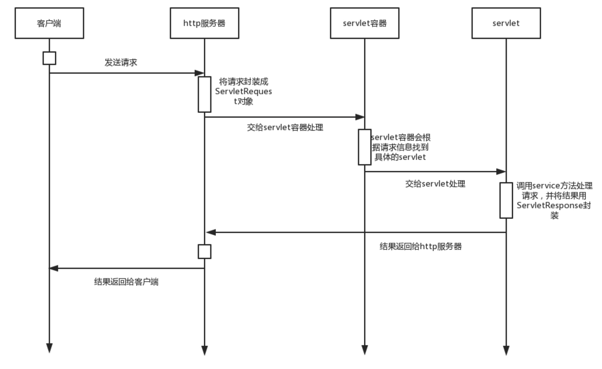

# SpringMVC


## 1. SpringMVC和三层开发框架的关系

MVC模式和Web开发中的三层结构的概念不能混为一谈。

三层架构和MVC是有明显区别的,MVC应该是展现模式(三个加起来以后才是三层架构中的表现层)。通常意义上的三层架构就是将整个业务应用划分为：表现层（UI）、业务逻辑层（BLL）、数据访问层（DAL）。区分层次的目的即为了“高内聚，低耦合”的思想。 

1. 表现层（UI）：通俗讲就是展现给用户的界面，即用户在使用一个系统的时候他的所见所得。  
2. 业务逻辑层（BLL）：针对具体问题的操作，也可以说是对数据层的操作，对数据业务逻辑处理。  
3. 数据访问层（DAL）：也称为持久层，该层所做事务直接操作数据库，针对数据的增添、删除、修改、更新、查找等。 

MVC是表现层的架构，它的核心思想是将表现层的数据显示、数据模型与业务操作分离开来。 在Spring MVC框架中，有三个核心的组件，分别是Model、View和Controller。它们分别代表着MVC（Model-View-Controller）设计模式的三个部分，用于构建Web应用程序。

1. **Model：**
    - **定义：** Model 代表应用程序的数据模型，通常是一个JavaBean对象（也可以是Map或其他数据结构）。这个对象包含了应用程序的业务逻辑和数据状态。
    - **作用：** Model 负责存储和管理数据，提供业务逻辑处理的方法。Controller通过Model来获取或更新应用程序的状态，然后将其传递给View。
2. **View：**
    - **定义：** View 是用户界面的表示，通常是用户看到和与之交互的部分。在Web应用程序中，View通常是由JSP、Thymeleaf等模板引擎生成的HTML页面。
    - **作用：** View负责显示Model的数据，用户通过View与应用程序进行交互。View可以接收用户输入，并将其传递给Controller，进而影响Model的状态。
3. **Controller：**
    - **定义：** Controller是应用程序的控制器，它接收来自用户的请求并决定如何响应。Controller负责处理用户输入，调用Model中的业务逻辑进行处理，然后选择合适的View来呈现结果。
    - **作用：** Controller起到了协调Model和View的作用，处理用户的请求和业务逻辑，并根据具体的业务需求来决定应该使用哪个View。


## 2. Tomcat、SpringMVC和Servlet的关系

### 2.1 Tomcat

Tomcat是一个免费的，开放源代码的Web应用服务器，是Apache软件基金会项目中的一个核心项目，由Apache ，Sun和一些公司以及个人共同开发而成。

当我们在本地有一个网页，我们只能在本地打开它，要让其他人也能访问这个网页，就要使用Web服务监听Http请求，其他人发送Http请求，服务器发送Http响应，从而传送网页资源。Tomcat就是完成这个功能的Web服务器。

Tomcat 要实现 2 个核心功能：

1. 处理 Socket 连接，负责网络字节流(即负责Http协议的解析)与 Request 和 Response 对象的转化。
2. 加载和管理 Servlet，以及具体处理 Request 请求。

因此 Tomcat 设计了两个核心组件连接器（Connector）和容器（Container）来分别做这两件事情。连接器负责对外交流，容器负责内部处理。

具体的，Tomcat 的可以按照如下分层；

1. Server：指的就是整个 Tomcat 服务器，它包含多个服务（Service），负责管理和启动各个Service，同时监听 8005 端口发过来的 shutdown 命令，用于关闭整个服务器。
2. Service：每个 Service 组件都包含了若干用于接收客户端消息的 Connector 组件和处理请求的 Engine 组件。Service 组件还包含了若干 Executor 组件，每个 Executor 都是一个线程池，它可以为 Service 内所有组件提供线程池执行任务。通过在 Tomcat Server中配置多个 Service，可以实现通过不同的端口号来访问同一台机器上部署的不同应用。
3. Connector：是Tomcat 与外部世界的连接器，监听固定端口接收外部请求，封装为ServletRequest传递给 Container，并将Container 处理的结果ServletResponse返回给外部。
4. Container：容器，顾名思义就是用来装载东西的器具，在 Tomcat 里，容器就是用来装载 Servlet 的。Tomcat 通过一种分层的架构，使得 Servlet 容器具有很好的灵活性。Tomcat 设计了 4 种容器，分别是 Engine、Host、Context 和 Wrapper。这 4 种容器不是平行关系，而是嵌套关系，它们之间从上至下层层调用。


### 2.2 Servlet

Java Servlet 是运行在 Web 服务器或应用服务器上的程序，它是作为来自 Web 浏览器(其他 HTTP 客户端)的请求和 HTTP 服务器上的数据库或应用程序之间的中间层。

以前，开发人员使用Serlet完成对数据库等内容的请求。现在，SpringMVC对Servlet进行了封装，我们可以使用SpringMVC框架完成表现层的工作。

这里需要注意到，在以前直接使用Servlet的方式下，Servlet容器中需要配置多个Servlet，每个Servlet映射到一些请求，容器会根据请求的路径找到具体的一个去执行。




### 2.3 SpringMVC

以前在Servlet容器中运行着的是Servlet，而现在Spring MVC框架遵循了Servlet规范，它也可以接受ServletRequest，负责接收并处理Servelt容器传递的请求，并将响应写回Response。因此，现在Servlet容器中运行着的是SpringMVC封装的Servlet。

当一个请求发来时先进Tomcat服务器，在服务器中会有拦截器，过滤器，等这些功能走完之后，才真正的进入了SpringMVC框架中。

1. 用户发来一个请求，首先进入的是前端控制器DispatcherServlet。Dispatcherservler|的生命周期与普通的Servlet一样都是由Servlet容器管理，在第一次访问时创建，在容器关闭时销毁。显而易见的，Dispatcherservler 实例在Servlet容器中，而不是Spring自己的loC容器中。Dispatcherservlet是Spring MVC中的唯—Servlet, Servlet 容 器（Tomcat)把所有请求都转发到 DispatcherServler，然后通过 HandlerMapping 把请求路由到具体的 Controller中。
2. 前端控制器将（DispacherServlet）用户发来的请求发送给处理器映射器（HandlerMapping）。
3. 处理器映射器根据前端控制器发来的用户的请求找到对应符合的控制器（Handler）,并且将其封装成处理器执行链，返回给前端控制器。
4. 处理器适配器接收到来自前端控制器的执行链后，找到对应执行此执行链的处理器适配器（HandlerAdapter）来调用的具体的控制器（就是说其对应的方法或者逻辑）。
5. 控制器执行完成后，会返回一个ModelAndView对象给处理器适配器。
6. 处理器适配器将返回来的ModelAndView对象返回给前端控制器(到这里所有的业务处理过程就要完了，接下就是将结果以页面的的形式相应给用户)。
7. 前端控制器将返回回来的ModelAndView对象交给视图解析器（ViewResolver），视图解析器根据传过里的View对象解析成对应的页面对象，然后将页面对象和Model对象返回给前端控制器。
8. 前端控制器再将返回回来的对象交给视图（View）,视图根据传过来的Model对象再一次的对页面进行渲染，然后在返回给前端控制器。
9. 前端控制器将完成的结果响应给浏览器，然后浏览器展现给用户。


在使用时，由于SpringMVC是在Servlet容器中工作，所以我们需要在WEB-IND/web.xml文件中配置Servlet容器。具体的，我们需要配置一个特殊的Servlet，它的名字叫DispatcherServlet，也就是SpringMVC的统一入口。我们要指明DispatcherServlet的类和它能处理的请求路径，通常是全部路径"/"。这样，Servlet容器将根据这个类去创建DispatcherServlet，并拦截它能处理的请求，将这些请求发送给它进行处理。

由此可见，这就是SpringMVC的优势所在，以前我们需要为每个请求配置一个Servlet，而现在，我们直接把所有的请求都映射到一个SpringMVC提供的Servlet上，即DispatcherServlet。然后，DispatcherServlet会根据请求路径去寻找一个handler来处理请求。这里的handler就是我们在开发中使用@RequestMapping注解的类或方法。

例如：

```xml
<?xml version="1.0" encoding="UTF-8"?>
<web-app xmlns="http://xmlns.jcp.org/xml/ns/javaee"
         xmlns:xsi="http://www.w3.org/2001/XMLSchema-instance"
         xsi:schemaLocation="http://xmlns.jcp.org/xml/ns/javaee http://xmlns.jcp.org/xml/ns/javaee/web-app_4_0.xsd"
         version="4.0">

    <!-- 配置 SpringMVC 的前端控制器DispatcherServlet，对浏览器发送的请求统一进行处理 -->
    <servlet>
        <servlet-name>springMVC</servlet-name>
        <servlet-class>org.springframework.web.servlet.DispatcherServlet</servlet-class>
    </servlet>

    <servlet-mapping>
        <servlet-name>dispatcherServlet</servlet-name>
        <!--设置springMVC的核心控制器所能处理的请求的请求路径
        /所匹配的请求可以是/login或.html或.js或.css方式的请求路径
        但是/不能匹配.jsp请求路径的请求。通常，我们使用MVC来处理所有的请求，所以就是“/”-->
        <url-pattern>/</url-pattern>
    </servlet-mapping>
</web-app>
```

由于 SpringMVC 也是基于 Spring 的，所以它有一个专门用于Web对象的容器(与我们之前介绍的Spring容器不同)，可以通过配置Java Bean从这个容器中获得DispatcherServlet，上面的配置文件中servlet-class标签中的类就是他的配置类。

如果不使用web.xml配置，而使用纯注解方式，则配置类需要继承AbstractDispatcherServletInitializer，并实例化它的3个抽象方法，例如：

```java
//web容器配置类
public class ServletContainersInitConfig extends AbstractDispatcherServletInitializer {
    //加载springmvc配置类，产生springmvc容器（本质还是spring容器）
    protected WebApplicationContext createServletApplicationContext() {
        //初始化WebApplicationContext对象
        AnnotationConfigWebApplicationContext ctx = new AnnotationConfigWebApplicationContext();
        //加载指定配置类
        ctx.register(SpringMvcConfig.class);
        return ctx;
    }

    //设置由springmvc控制器处理的请求映射路径
    protected String[] getServletMappings() {
        return new String[]{"/"};
    }

    //加载spring配置类，这个Spring容器和SpringMVC容器是两个容器，需要分开加载
    protected WebApplicationContext createRootApplicationContext() {
        AnnotationConfigWebApplicationContext ctx = new AnnotationConfigWebApplicationContext();
        ctx.register(SpringConfig.class);
        return ctx;
    }
}
```

SpringMVC容器管理表现层对象，即Controller，Spring容器管理业务层和数据层对象，即Service和DAO。加载这两个容器的方式有以下3种：

1. 方式一：SpringMVC和Spring加载的bean设定扫描范围为精准范围，例如controller包、service包、dao包等。
2. 方式二：Spring加载的bean设定扫描范围为com.itheima,排除掉controller包中的bean。
3. 方式三：不区分Spring与springMvc的环境，加载到同一个环境中[暂不介绍]。

>上面的配置还有一种简单版本，只需要提供配置类即可。
>
>```java
>public class ServletContainersInitConfig extends AbstractAnnotationConfigDispatcherServletInitializer {
>
>    protected Class<?>[] getRootConfigClasses() {
>        return new Class[]{SpringConfig.class};
>    }
>
>    protected Class<?>[] getServletConfigClasses() {
>        return new Class[]{SpringMvcConfig.class};
>    }
>
>    protected String[] getServletMappings() {
>        return new String[]{"/"};
>    }
>}
>```

注意，这里配置了所有的"/"目录下的访问都使用SpringMVC，之后需要配置一个WebMvcConfigurationSupport，将静态资源的访问放行，即还是使用默认的Servlet来返回静态资源。

有了上面的配置，Servlet容器就会知道该把哪些请求路径发送给SpringMVC(通常就是全部请求)。

接下来，我们就需要配置SpringMVC容器，也就是让DispatcherServlet知道该把哪个请求映射到哪个Controller上。

SpringMVC是基于Spring的，它直接使用Spring的方式类配置，所以配置类如下：

```java
//springmvc配置类，本质上还是一个spring配置类
@Configuration
@ComponentScan("com.itheima.controller")
public class SpringMvcConfig {
}
```

然后，我们在Controller类上加上@Controller注解，放置在@ComponentScan指定的包下，就可以将控制器注册到AnnotationConfigWebApplicationContext中，每个Controller类的方法加上@RequestMapping，即可将指定请求映射到这个方法上。

例如：

```java
package com.itheima.controller;

import org.springframework.stereotype.Controller;
import org.springframework.web.bind.annotation.RequestMapping;
import org.springframework.web.bind.annotation.ResponseBody;

//定义表现层控制器bean
@Controller
public class UserController {

    //设置映射路径为/save，即外部访问路径
    @RequestMapping("/save")
    //设置当前操作返回结果为指定json数据（本质上是一个字符串信息）
    @ResponseBody
    public String save(){
        System.out.println("user save ...");
        return "{'info':'springmvc'}";
    }

    //设置映射路径为/delete，即外部访问路径
    @RequestMapping("/delete")
    @ResponseBody
    public String delete(){
        System.out.println("user save ...");
        return "{'info':'springmvc'}";
    }
}
```

综上，在启动Tomcat服务前，我们需要写两个配置类，一个用于配置Servlet容器使用SpringMVC，另一个用于配置SpringMVC。

+ Servlet的配置类需要继承一个抽象类，实现它的3个方法，分别是加载SpringMVC容器、指定请求到SpringMVC容器的映射、加载Spring容器。
+ SpringMVC的配置类的格式就和Spring配置类相同，它需要扫描所有的Controller Bean。


